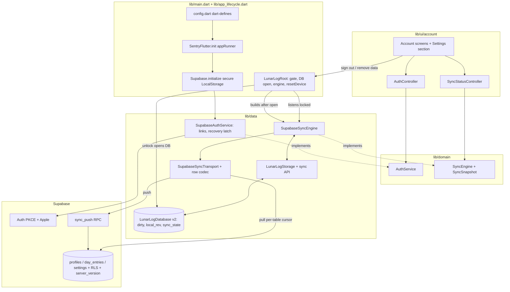
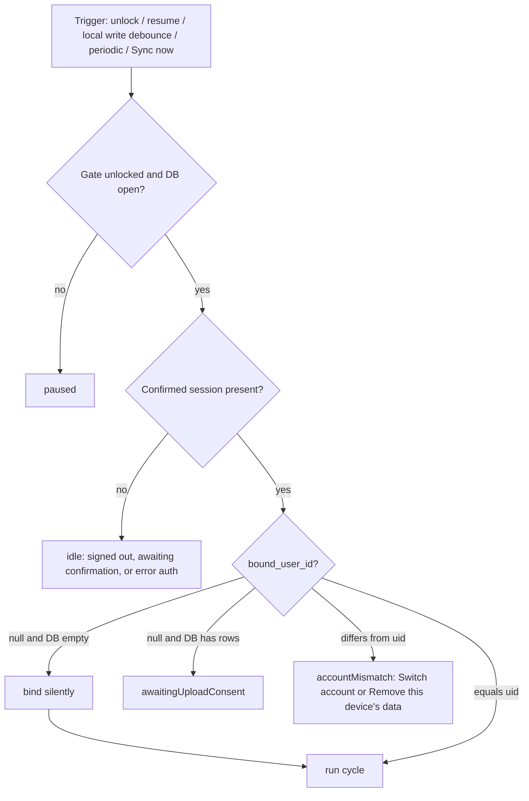
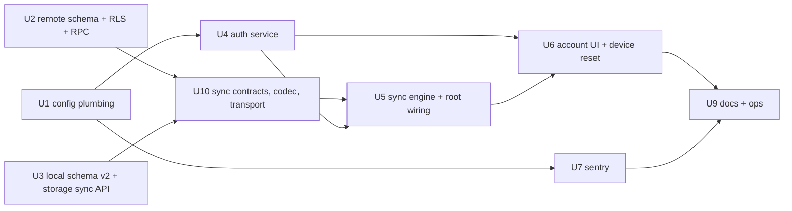

# Supabase Auth and Cloud Sync - Plan

## Goal Capsule

- **Objective:** Add optional Supabase accounts to lunarlog, mirror the local encrypted Drift store into RLS-protected Postgres, sync it offline-first across the operator's devices, migrate existing local rows into the account on first sign-in, and ship Sentry crash reporting with strict health-data hygiene.
- **Authority:** GitHub issue #1 for product intent; this plan's Product Contract and Key Technical Decisions for scope and mechanism; `AGENTS.md` and the repo's `.agents/skills/supabase*` rules for Supabase conventions. The R-IDs win on behavior, the KTDs on mechanism.
- **Execution profile:** Deep plan, high-risk (auth, minors' health data, migration, external services). Implement units in dependency order; regenerate `lib/data/db/db.g.dart` after every schema change; keep every existing test green.
- **Stop conditions:** Stop and surface a blocker if an assumption in `### Assumptions` proves infeasible, if RLS cannot be proven by the pgTAP suite, or if any unit would require sending health content (notes, tags, dates, profile names) to Sentry.
- **Tail ownership:** The invoking pipeline owns commit, review, and PR. Manual device verification (Apple Sign-In, deep links, SQLCipher on device) is recorded in the Verification Contract as human follow-up.

---

## Product Contract

### Summary

lunarlog gains an optional account. A signed-in operator's profiles and day entries are pushed to Supabase Postgres tables that only that operator can read or write, pulled back on other devices, and merged last-writer-wins. The local encrypted Drift database stays the source the UI reads and writes, so the app keeps working offline and without an account. The biometric gate stays as an app lock in front of everything. Sentry reports crashes without ever carrying health content.

### Problem Frame

Today lunarlog is fully local: an encrypted SQLCipher database behind a device-credential gate, no backup, no second device. Losing the phone loses the family's history, and a crash on a family member's device cannot be diagnosed because nothing reports it. Issues #3 through #5 (sharing, custodianship, caregiver alerts) all need an account and a server copy of the data. The data is sensitive health data, some of it minors', so isolation between accounts must be structural (RLS). Moving it to a server does add readers the device-only model never had: anyone holding the project database password, the service role, or a Supabase MCP session with the `database` feature can read `note` and `display_name` in plaintext until client-side encryption lands (see AS6 and Open Questions). The plan names that boundary rather than claiming it does not exist.

### Actors

- A1. **Operator** — the adult who owns the device and the account, logs entries for every profile.
- A2. **Second device** — another install signed into the same account (a second phone, the Mac, the web build).
- A3. **Supabase** — Auth, Postgres with RLS, PostgREST.
- A4. **Sentry** — crash and API-error sink.

### Requirements

**Accounts and sessions**

- R1. The operator can create an account and sign in with email and password; the confirmation link must be opened on the device that signed up.
- R2. The operator can request a password reset by email and set a new password from the emailed link on the same device.
- R3. On iOS the operator can sign in with Apple.
- R4. The device-credential gate (`lib/app_lifecycle.dart`) stays in front of all data as an app lock, independent of the Supabase session.
- R5. The Supabase session and PKCE verifier are persisted in platform secure storage on native with a device-bound accessibility class, never in plain SharedPreferences.
- R6. Sign-in is optional. With no account the app behaves exactly as it does today (see AS1).

**Remote schema and isolation**

- R7. Postgres tables `profiles`, `day_entries`, and `settings` live in `supabase/migrations/` with RLS enabled and policies limited to rows whose `user_id` equals the caller's `auth.uid()`, for select, insert, update, and delete.
- R8. Every table carries foreign keys and indexes on `user_id` and, for `day_entries`, on `profile_id`; a day entry can only reference a profile owned by the same user.
- R9. Row-level isolation is proven by automated RLS tests on all three tables that fail if a second user can read, insert, update, or delete another user's rows, or can learn whether another user's row id exists on any write path.

**Sync**

- R10. The local Drift database remains the source of truth the UI reads and writes; sync never blocks local use.
- R11. Local writes are pushed and remote changes pulled automatically when the app is unlocked, signed in, and online; failures retry with backoff and never lose local data.
- R12. Conflicts resolve last-writer-wins on `updated_at`; on equal timestamps the server's copy wins; exactly one live day entry per (profile, date) exists on every device after sync.
- R13. Sync runs only while the gate is unlocked; locking pauses it after the in-flight batch.
- R14. Existing local rows on a device are uploaded into the account on first sign-in only after the operator confirms the upload, and the operator can return to that confirmation later after declining (see AS4).
- R15. A device holds data for at most one account; signing in as a different account offers a non-destructive switch back and a destructive "remove this device's data", never only the destructive path.
- R16. Sign-out removes the local database, its key, the session, and sync state from the device after warning about unsynced changes, including unsynced deletions (see AS3, KTD16). A separate "Sign out everywhere" revokes every session of the account and tells the operator that other devices keep access until their access token expires.

**Observability**

- R17. Crashes and unhandled errors are reported to Sentry with release health, sampled at 100% for a tiny user base.
- R18. No Sentry event or breadcrumb carries health content or identity: notes, tags, entry dates, profile names, emails, user ids, device names, auth headers, or request query strings.
- R19. Sentry is inert when no DSN is configured (tests, local runs).

**Platform**

- R20. Supabase URL, publishable key, and Sentry DSN are injected at build time from CI secrets and never committed.
- R21. The web build keeps working; account sign-in and sync on web are both off unless the build opts in, and the wipe-local-data action signs out and resets sync state (see AS9).

### Key Flows

- F1. First install, create account
  - **Trigger:** Fresh install, operator taps "Create account" on the first-run account step.
  - **Actors:** A1, A3
  - **Steps:** Gate unlocks; database opens (empty); operator creates an account; the app records "awaiting confirmation" for that email; the operator opens the confirmation link on this device; the session arrives; the device binds; the first-run flow shows "Restoring your data", finds no profiles, and continues to the name form; the first profile is created locally and pushed.
  - **Covered by:** R1, R4, R6, R11

- F2. Existing offline device signs in
  - **Trigger:** Operator with months of local data signs in from Settings.
  - **Actors:** A1, A3
  - **Steps:** Confirmed session established; the app detects local rows and an unbound device; shows the upload-consent step; on consent every local row (tombstones included) is marked dirty, the device binds to the account, push runs in batches, then a full pull reconciles.
  - **Covered by:** R10, R14, R15

- F3. Second device signs in
  - **Trigger:** Operator signs in on a device with an empty database.
  - **Actors:** A2, A3
  - **Steps:** Device binds automatically (nothing to consent to); the first-run flow holds a data-free "Restoring your data" step until the bind-time full pull completes; the profile picker shows the account's profiles; the name form appears only if the account has no profiles.
  - **Covered by:** R11, R12

- F4. Password reset while locked
  - **Trigger:** Operator opens the reset link from a mail app while lunarlog is locked or killed.
  - **Actors:** A1, A3
  - **Steps:** The auth service, constructed before the first frame, exchanges the code, stores the session, and latches the recovery state; the gate demands the device credential; only then the "set new password" screen shows; the new password is saved; normal state resumes.
  - **Covered by:** R2, R4

- F5. Two devices edit the same day offline
  - **Trigger:** Both devices log the same date for the same profile while offline, then reconnect.
  - **Actors:** A1, A2, A3
  - **Steps:** Each pushes; the server's push function keeps the winning row live and tombstones the other; each device receives the resolved rows and ends with exactly one live entry.
  - **Covered by:** R12

- F6. Sign out on a shared device
  - **Trigger:** Operator taps "Sign out".
  - **Actors:** A1
  - **Steps:** If dirty rows exist (tombstones included), the operator is warned and must choose to sync first or discard; the device is reset per KTD16; the app returns to first-run.
  - **Covered by:** R15, R16

- F7. Wrong account on a bound device
  - **Trigger:** A device bound to account A gets a session for account B (a second family account, or Apple Sign-In with "Hide My Email" producing a new user).
  - **Actors:** A1, A3
  - **Steps:** Sync refuses to run; the mismatch screen explains the cause (naming the Hide My Email case) and offers "Switch account" (local sign-out, data untouched) as the primary action and "Remove this device's data" as the secondary.
  - **Covered by:** R15

### Acceptance Examples

- AE1. **Covers R7, R9.** Given users A and B each own one profile and one setting, when B selects, inserts into, updates, or deletes `profiles`, `day_entries`, or `settings` filtered to A's rows, then zero rows are returned or affected, and a delete attempt is refused at the privilege layer.
- AE2. **Covers R8.** Given user B tries to insert a day entry whose `profile_id` is A's profile, when the insert runs, then it is rejected by the composite foreign key.
- AE3. **Covers R12.** Given device 1 deleted and re-created 2026-09-01 (new ULID) and device 2 edited the original ULID offline, when both sync, then both devices hold exactly one live row for that date, chosen by greater `updated_at` then smaller ULID, and no unique-index error surfaces.
- AE4. **Covers R13.** Given a pull page is being applied, when the app is backgrounded, then the page and its cursor commit or roll back together, no new page starts, and unlock resumes from the persisted cursor.
- AE5. **Covers R15.** Given local rows bound to account A, when account B signs in on the same device, then nothing is pushed or pulled, "Switch account" returns to the signed-out state with A's data intact, and only "Remove this device's data" resets the device.
- AE6. **Covers R11.** Given a push was accepted by the server but the app died before the acknowledgement, when the app restarts and syncs, then re-pushing the same ULIDs changes nothing remotely and the dirty flags clear.
- AE7. **Covers R18.** Given a Drift exception whose message embeds a SQL statement with a note argument, when Sentry captures it, then the event contains the exception type and stack but no SQL arguments, note text, URL query string, or auth header.
- AE8. **Covers R2, R4.** Given the app is locked or killed and a password-recovery link is opened, when the gate is declined, then no recovery screen and no profile data render; when the gate is granted, then the recovery screen shows before any profile screen.
- AE9. **Covers R10.** Given the session's refresh fails after weeks offline, when the operator opens the app, then unlock, reading, and editing work locally, rows stay dirty, and a non-blocking "sign in again to sync" status appears.
- AE10. **Covers R16.** Given a signed-in native install with data, when the operator signs out, then the next cold start reaches first-run with a fresh key and an empty database, never the fail-closed screen.
- AE11. **Covers R11.** Given an edit lands while a push of the same row is in flight and the clock has not advanced, when the push acknowledges, then the row stays dirty and is pushed again.
- AE12. **Covers R9.** Given user B inserts a profile directly through PostgREST whose `id` equals one of A's ULIDs, when the insert runs, then it succeeds as B's own row and no unique-violation error reveals A's id.
- AE13. **Covers R11.** Given a device with an empty database signs in during first run, when the account holds one profile, then "Restoring your data" shows until the pull completes, the picker renders that profile, and no name form was shown.

### Scope Boundaries

**Not in this plan**

- Family sharing, invitations, multi-user access to one profile (issue #3).
- Custodianship transfer and reciprocal sharing (issue #4).
- Caregiver alerts and reminder coordination changes (issue #5).
- Any fertility feature (repo rule, unchanged).

**Deferred to Follow-Up Work**

- In-app account deletion (Edge Function calling `auth.admin.deleteUser`, cascading rows, and Apple token revocation via the Sign in with Apple REST API) and JSON data export. App Store guideline 5.1.1(v) makes deletion a submission blocker once account creation ships; the Definition of Done gates the release pipeline on it.
- Supabase Realtime as a "pull now" hint. Adding the tables to the Realtime publication would let the deferred account-deletion cascade emit DELETE events that bypass RLS, and the foreground, write-debounce, and periodic triggers already cover a single operator. Revisit after account deletion ships, with Broadcast rather than `postgres_changes`.
- Apple Sign-In on Android and web (needs an Apple Services ID and a client secret rotated every six months).
- Client-side syncing of user-scoped settings. The remote `settings` table ships now with full RLS coverage; no synced setting exists yet, so the client wiring waits for the first one.
- New profile attributes named in the issue's draft schema (`birth_year`, `color`) and the `name` column rename. The app has `display_name`, `is_minor`, `sort_order`; the remote schema mirrors those (see AS2).
- Client-side encryption of `note` and `display_name` before upload (see Open Questions).
- Sentry debug-symbol upload from CI via `sentry_dart_plugin` (needs a `SENTRY_AUTH_TOKEN` secret).
- Managing auth settings (redirect URLs, providers, password rules, JWT expiry, SMTP) through `supabase/config.toml` and `supabase config push` instead of the dashboard checklist.
- Excluding the iOS database file from iCloud backup and moving the existing database key to a `ThisDeviceOnly` Keychain class (README "Known limitations"; App Store 5.1.3(ii)). Changing the class of an already-written key needs a read-then-rewrite migration, so it is not folded into this plan.
- `https` App Links with `autoVerify` in place of the custom scheme.
- A new-device sign-in email notice to the operator (Auth Hook or Edge Function), since a second device binds and pulls everything silently.

### Dependencies

- Supabase Cloud project `dleexnnevuuddcgcpztq` with Postgres 17; the Supabase CLI already initialized (`supabase/config.toml`).
- GitHub secrets on `wjdavis5/lunarlog`: `SUPABASE_URL`, `SUPABASE_ANON_KEY` (holds the `sb_publishable_…` key), `SUPABASE_PROJECT_REF`, `SUPABASE_DB_PASSWORD`. New: `SUPABASE_ACCESS_TOKEN` (CLI login for migrations, scoped to a `production` GitHub environment with a required reviewer) and `SENTRY_DSN`.
- Dashboard configuration the code cannot do: Apple provider with the bundle id as client id; `lunarlog://auth-callback` in the redirect allow-list; custom SMTP before any non-team user signs up (built-in SMTP sends 2 emails per hour to team addresses only); "Confirm email" left on; minimum password length 12 with letters, digits, and symbols and leaked-password protection on; JWT expiry set to the shortest value the dashboard allows (target 10 minutes); session inactivity timeout where the project tier offers it; Sentry "prevent storing IP addresses" and server-side scrubbing.
- A Sentry project and DSN.

---

## Planning Contract

### Assumptions

Un-validated planning bets made in pipeline mode. Each is implemented as stated unless redirected.

- AS1. Accounts are optional. The first-run flow becomes: revised notice, then a "Sign in or create account" step with "Not now", then the name form; local-only use continues unchanged, and sign-in is always reachable from Settings.
- AS2. The remote schema mirrors the local Drift column set and names (`display_name`, `is_minor`, `sort_order`, `local_date`, `tz`, `note`, `deleted_at`). The issue's draft column list (`name`, `birth_year`, `color`, `civil_date`, `notes`, `tombstoned_at`) is treated as illustrative; adding new profile attributes is product work outside this migration.
- AS3. Sign-out is destructive on the device: it resets the device per KTD16 after a warning when unsynced rows or tombstones exist. "Lock" is the non-destructive action, and "Switch account" (F7) is the non-destructive exit from a wrong account. Rationale: the biometric gate is device-owner-scoped, not account-scoped, so keeping another account's minors' data on a shared device is the larger risk.
- AS4. First sign-in on a device that already holds local rows shows an explicit upload-consent step; the device binds to exactly one account at that point, and only once the session is confirmed. A device with an empty database binds silently. The consent copy states that two devices which each created the same person offline will show two profiles after upload. Declining leaves a tappable "Upload pending" tile that reopens the consent step.
- AS5. Apple Sign-In ships native on iOS only in this issue.
- AS6. `note` and `display_name` are stored in Postgres as plaintext for this issue, protected by RLS, TLS, and Supabase at-rest encryption, and cleared from tombstoned rows. Client-side encryption is deferred (Open Questions).
- AS7. Account deletion and data export are follow-up work (Scope Boundaries); the Definition of Done blocks App Store submission until deletion ships.
- AS8. Sync freshness comes from unlock, resume, write-debounce, and a periodic timer; there is no Realtime hint in this issue (Scope Boundaries).
- AS9. On web, both account sign-in and sync run only when the build sets `LUNARLOG_WEB_SYNC=true`. A signed-in web session holds a bearer token in browser storage that can read every row through PostgREST whether or not sync runs, so the define gates auth itself; a default dev web build carries neither data nor a token. The dev banner names the exposure when the define is on.
- AS10. With hosted email confirmation on, `signUp` returns a user and no session. The app records "awaiting confirmation" for that email in device-local settings, shows it in the status tile, and treats the account as signed out until the confirmation link (opened on this device) produces a session. Binding and upload consent wait for a confirmed session.
- AS11. Whole-row last-writer-wins is acceptable: concurrent edits to different fields of one row (for example `sort_order` on one device and `display_name` on another) keep only the later row.

### Key Technical Decisions

- KTD1. **Custom last-writer-wins sync coordinator over the existing Drift schema, not PowerSync, a direct online client, or an encrypted-blob backup.** The local tables already carry client ULID ids, monotonic UTC `updated_at`, and `deleted_at` tombstones designed for exactly this (`lib/data/db/tables.dart`, `lib/data/db/storage.dart`). PowerSync is the mature alternative but replaces the Drift executor, and the app's fail-closed SQLCipher wiring (`lib/data/db/native_db.dart`, `db_factory.dart`) is built around that executor; it also adds a hosted or self-hosted service. Supabase has no first-party offline sync. A direct online-only client would break R10. Uploading the encrypted database file as an opaque blob would cover the lost-phone case with no plaintext on the server, but it cannot merge two devices and gives issue #3 nothing to share, so row sync is the choice. Data volume is tiny (a few profiles, one row per logged day), so a hand-written LWW coordinator is small and fully testable against in-memory Drift. Accepted cost: the repo owns cursor, reconciliation cadence, codec, retry, and binding semantics indefinitely; a later move to PowerSync would replace U5 and U10 wholesale and drop the U3 sync columns.
- KTD2. **Server-assigned `server_version` is the pull cursor, kept per table and committed with the page; client `updated_at` is the LWW value.** Client clocks are not trusted for ordering: a BEFORE INSERT OR UPDATE trigger stamps `server_version` from one sequence on every remote table. Each table has its own cursor in `sync_state` (`cursor_profiles`, `cursor_day_entries`), because pages are per table and a shared cursor advanced by one table's page would skip the other's pending rows. A page's rows and its new cursor are written in one Drift transaction (`applyRemotePage`), so a crash can only re-fetch rows, never skip them. Because sequence values can commit out of order, the engine also runs a full reconciliation pull (all rows, paged) on bind, after a push that returned resolved rows, and whenever the last full pull is older than 24 hours; the full pull never advances a cursor. Applying a row already held is a no-op under LWW, so over-fetching is safe. Governs R11, R12.
- KTD3. **Push goes through one hardened `sync_push` RPC, not raw PostgREST upserts.** PostgREST cannot target the partial unique index on live day entries, so two devices creating the same (profile, date) offline would fail with a unique violation. The RPC is `security invoker` with `set search_path = ''` and every reference schema-qualified; execute is revoked from `public` and `anon`. It validates input (each argument is a JSON array of at most 500 rows; per-row key allowlist; `id` matches the 26-character ULID shape; `flow` in the enum; `local_date` parses) and ignores any `user_id` or `server_version` in the payload, relying on column defaults and the trigger. It iterates the validated rows and runs each upsert inside its own `BEGIN … EXCEPTION WHEN OTHERS` block, so an RLS violation on `ON CONFLICT DO UPDATE` (a hidden row), a constraint failure, or a validation failure rejects only that row with the same opaque `{id, rejected: true}` entry while the rest of the batch commits; the function is therefore not an existence oracle. It upserts profiles then day entries with the LWW guard (overwrite only when incoming `updated_at` is greater, or equal and incoming is a tombstone), runs the KTD5 resolver on every write that leaves a live day entry, and returns `{"resolved": [...], "rejected": [...], "server_now"}` where `resolved` carries the server's current copy of every row it tombstoned by resolution and of every incoming row it declined (older, or equal-and-live), so the client converges in the same cycle instead of at the next full reconcile. Governs R8, R9, R12.
- KTD4. **Local schema v2 adds dirty tracking, a local revision counter, and a device binding row, not per-row `user_id`.** `profiles` and `day_entries` gain `dirty` (bool, default false) and `local_rev` (int, default 0, bumped on every local write, never synced). `markPushed(id, localRevAtPush)` clears `dirty` only when `local_rev` still equals the pushed value; keying on `updated_at` would drop an edit made while the clamp kept the timestamp unchanged (regressed clock, millisecond web clocks, two edits in one tick). A new `sync_state` singleton table holds `bound_user_id`, `device_id`, `cursor_profiles`, `cursor_day_entries`, `last_full_pull_at`, `last_sync_at`, `last_error`, `server_clock_offset_ms`. The storage clock adds `server_clock_offset_ms` (learned from `server_now`) when stamping local writes, so a device whose clock trails the server does not lose every LWW race. The whole local database belongs to one account (R15), so the binding is a device-level fact and the guard is one comparison. Existing storage writes set `dirty = true`; remote applies write `dirty = false` and must compare before writing, since `LunarLogStorage` today clamps `updated_at` but always overwrites the payload.
- KTD5. **One conflict rule on client and server, compared on parsed microsecond instants; tombstones carry no payload.** Per-id: greater `updated_at` wins; on equal `updated_at` the server's stored copy wins on the server and the remote copy wins on the client, so both sides pick the server's version (a tombstone pushed with an equal timestamp still wins on the server, which is the delete-wins tie). Per (profile, date) among live day entries: greater `updated_at` wins, then the lexicographically smaller ULID; the loser is tombstoned with `deleted_at = updated_at = winner.updated_at`. Resolved rows carry that exact timestamp to every device and are applied with `dirty = false`, so a resolution never outranks a later legitimate edit. A tombstone stores `note = null`, `tags = '[]'`, and for profiles `display_name = ''`, on the server and locally, so deleted health content does not persist; a newer live write to a tombstoned id revives it with its own full payload (LWW; "delete wins" is only a tie rule) and re-runs the resolver. Timestamps are compared as parsed `DateTime` values, never as ISO strings, because Postgres and Dart render the same instant differently. One rule, two implementations, one shared fixture of cases.
- KTD6. **Auth and sync contracts live in `lib/domain`; implementations in `lib/data`; UI notifiers in `lib/ui`.** `lib/domain/auth/auth_service.dart` (interface, `AuthSessionState`) and `lib/domain/sync/sync_engine.dart` (interface, `SyncPhase`, `SyncSnapshot`, `Stream<SyncSnapshot>`) sit beside the repository interfaces; `SupabaseAuthService`, `SupabaseSyncEngine`, transport, and codec sit in `lib/data`; `AuthController` and `SyncStatusController` are `ChangeNotifier`s in `lib/ui/account` taking the domain interfaces, exactly like `ProfileController` takes `ProfilesRepository`. `NotificationPermissionState` living in `lib/data` is an existing leak, not the pattern to follow. `SupabaseClient` is not fakeable in widget tests; hand-written `FakeAuthService`, `FakeSyncEngine`, and `FakeSyncTransport` follow the repo's `FakeGate` convention. Supabase is initialized once in `lib/main.dart` before `runApp` and never touched by `lib/ui`.
- KTD7. **supabase_flutter 2.17.x with `publishableKey`, PKCE, and secure-storage session with a device-bound Keychain class.** `Supabase.initialize` gets a `LocalStorage` and a `pkceAsyncStorage` backed by `flutter_secure_storage` on native, using iOS accessibility `first_unlock_this_device` (the items never migrate in a backup or device transfer) and the default encrypted preferences on Android (`allowBackup="false"` already excludes them); the web path keeps the package default and is only reachable when AS9's define is on. The bootstrap takes an optional `http.Client` so U7 can pass `SentryHttpClient` without U7 touching the bootstrap file. `anonKey` is deprecated; the existing secret already holds an `sb_publishable_…` value. Governs R5.
- KTD8. **Deep links use the custom scheme `lunarlog://auth-callback`; the auth service owns link handling and latches recovery before any widget exists.** A custom scheme can be claimed by another app, which is acceptable only because PKCE binds the auth code to the verifier in this app's secure storage, so a hijacked code cannot be exchanged; the implicit flow is never enabled, and `https` App Links are a deferred hardening. supabase_flutter's own link detection is disabled (`detectSessionInUri: false`) because it exchanges the code during initialization, before anything can subscribe, and gotrue replays only `initialSession` to late subscribers, so a cold-start recovery event would be lost. Instead `SupabaseAuthService` is constructed in the bootstrap before the first frame, subscribes to `onAuthStateChange`, observes `app_links` (bundled by supabase_flutter) for the initial and subsequent links, calls `getSessionFromUrl` itself, and latches `pendingRecovery` in the service. `AuthController` reads that latch; `ProfileHomeGate` consumes it only when the gate reports unlocked (the existing launch-payload consumer does not check this today, so AE8 needs the check written). The invariant is "no Drift access before unlock", not "no work". Any `error` or `error_description` from an incoming URL is never rendered verbatim. Sign-up confirmation and password reset both use this link and must be opened on the originating device (R1, R2). Governs R1, R2, R4.
- KTD9. **Native Apple Sign-In on iOS via `sign_in_with_apple` and `signInWithIdToken` with a hashed nonce.** supabase_flutter 2.x has no Apple helper. Native-only needs no Apple client secret; the Supabase Apple provider's client id is the bundle id `com.wjdavis5.lunarlog`. Requires the Sign in with Apple entitlement (new `ios/Runner/Runner.entitlements`) and regenerated provisioning profiles for the CI manual-signing path. A cancelled Apple dialog returns to the sign-in screen with no error; an Apple identity that resolves to a different user than the bound account routes to F7. Governs R3.
- KTD10. **Sync runs only when gate unlocked, database open, session confirmed, and device bound.** The engine is constructed after the database opens (KTD11), listens to the existing `GateController` `ChangeNotifier` and edge-detects `locked`, and subscribes to `AuthService` state. `lock()` pauses after the current page or batch; a session that fails to refresh puts the engine in `error(auth)` and never blocks local use (AE9). Governs R13, R10.
- KTD11. **`LunarLogRoot` owns the engine, mirroring how it owns the database; `main.dart` injects only database-free collaborators.** `main.dart` passes `AuthService?` and `SyncTransport?`, both `null` when `AppConfig.hasSupabase` is false or when running on web without AS9's define; there is no noop auth implementation, so an unconfigured build shows no account section at all. `LunarLogRoot._openDatabase` builds `SupabaseSyncEngine` right after `attachSettings` when both collaborators are present and provides it and its `SyncStatusController` down the tree. Null collaborators mean nothing starts, so existing widget-test harnesses stay untouched. Timers are injectable and `dispose()` is awaited, unlike the reminder coordinator's fire-and-forget, so an in-flight page finishes before the database closes.
- KTD12. **Sentry is initialized through `SentryFlutter.init(appRunner:)` with an allowlist-shaped privacy floor.** `sendDefaultPii = false`, no screenshots, no view hierarchy, no session replay, `enableUserInteractionBreadcrumbs = false`, `tracesSampleRate = 0`, `sampleRate = 1.0`, `enableAutoSessionTracking = true`, never a Sentry user. `beforeSend` keeps only `contexts.os`, `contexts.runtime`, and `contexts.app.version`, drops `extra` entirely, strips `request.url` query strings and all `request.headers` and bodies, and reduces every exception thrown from `lib/data` (Drift, sqlite, PostgREST, Auth, codec) to its type name. `beforeBreadcrumb` truncates `http` URLs at `?`, drops navigation `data`, and drops any breadcrumb whose data contains a deny-listed key in either camelCase or snake_case (`note`, `tags`, `display_name`, `local_date`, `email`, `record`, `p_day_entries`). `SENTRY_DSN` comes from `--dart-define`; an empty DSN means init is skipped and `runApp` is called directly. Governs R17, R18, R19.
- KTD13. **Build-time configuration via `const String.fromEnvironment` in a single `lib/config.dart`.** Keys: `SUPABASE_URL`, `SUPABASE_PUBLISHABLE_KEY`, `SENTRY_DSN`, `LUNARLOG_WEB_SYNC`. Release and CI workflows pass `--dart-define` from secrets; local development uses `--dart-define-from-file=dart_defines.json` (gitignored, client-safe values only, with a committed `dart_defines.example.json`). The `.env` file stays server-side-only (DB password, CLI). Governs R20, R21.
- KTD14. **Migrations are imperative SQL under `supabase/migrations/`, pushed by a dedicated workflow behind a reviewed environment, with pgTAP RLS tests.** `supabase migration new` names the files; a `supabase-migrate.yml` workflow runs `supabase link` and `supabase db push` on pushes to `main` that touch `supabase/**`, inside a GitHub `production` environment with a required reviewer that owns the `SUPABASE_ACCESS_TOKEN` and `SUPABASE_DB_PASSWORD` secrets; a CI job runs `supabase start` and `supabase test db` so R9 is proven on every PR. Advisors are checked through the Supabase MCP `get_advisors` tool before approving each push (no CLI equivalent). Governs R7, R9.
- KTD15. **Per-user composite primary keys, column-list grants, table-level CHECK constraints, and a composite foreign key make isolation and validation structural.** Primary keys are `(id, user_id)` on `profiles` and `day_entries`, so a direct insert that reuses another user's ULID lands as the caller's own row instead of raising a unique violation that reveals the id (AE12). `user_id` defaults to `auth.uid()` and is protected by `WITH CHECK`. Day entries carry `(profile_id, user_id) → profiles(id, user_id)`, so a client cannot attach a day entry to another user's profile even if it guesses the ULID. `UPDATE` is granted to `authenticated` only on an explicit column list that omits `user_id` and `server_version` (Postgres ignores a column-level REVOKE when a table-level grant exists), and `DELETE` is not granted at all (the app only tombstones; the R7 delete policy exists but no role can exercise it). CHECK constraints cap `note`, `display_name`, and `settings.value` length and require `tags` to be a JSON array of bounded size, so direct PostgREST writes cannot produce rows the pull codec rejects. Policies use `to authenticated` and `(select auth.uid()) = user_id` so the planner evaluates the function once per statement. Soft-deleting a profile leaves its day entries live on both sides (the cascade is hard-delete only); the UI hides them through the profile filter and a revival restores them. Reversal cost: issue #3's per-profile membership and issue #4's ownership transfer replace owner-equality policies, the composite key, the column-list grant, and the device-level binding with a membership model; those artifacts are scoped as disposable now, and the follow-ups carry a schema migration plus an engine change rather than an extension.
- KTD16. **Device reset is one ordered operation owned by `LunarLogRoot`, and the app tree unmounts before the database closes.** `resetDevice()`: await the engine's `dispose()`; set `_db = null` through `setState` and await the next frame so `LunarLogApp` (its reminder coordinator, controllers, repository streams, and the gate's settings watch) unmounts and nothing can query the closing database; remove the persisted session and PKCE entries locally; close the database; on native delete the database file and its `-wal`, `-shm`, and `-journal` siblings, then delete the database key (deleting the file first means a crash mid-reset cannot leave a keyed file that would quarantine on the next open); on web run `wipeAllData`; reset the engine's in-memory state; reopen through `dbOpener` (which mints a fresh key); then best-effort call `signOut(scope: local)` on the server, whose failure never skips the local steps. `_LunarLogAppState.dispose` awaits the reminder coordinator's `dispose()` so the unmount is complete. `WebGuardrails.onWipe`, sign-out, and the mismatch screen's destructive action all call this one path. "Sign out everywhere" calls `signOut(scope: global)` first and then the same reset. Governs R15, R16, R21.

### High-Level Technical Design

Component topology after this plan.



Sync cycle sequence (one run of the engine).

```mermaid
sequenceDiagram
  participant E as SyncEngine
  participant S as LunarLogStorage
  participant R as sync_push RPC
  participant P as PostgREST (RLS)
  E->>E: guard: unlocked, db open, session confirmed, bound_user_id == uid
  E->>S: readDirty(profiles) then readDirty(dayEntries), tombstones included
  loop batches of <= 500, profiles first
    E->>R: sync_push(batch)
    R-->>E: {resolved[], rejected[], server_now}
    E->>S: markPushed(accepted ids, localRevAtPush); applyResolved(resolved) dirty=false; record offset
  end
  loop per table: profiles then day_entries
    E->>P: select where server_version > cursor_<table> order by server_version limit 500
    P-->>E: page
    E->>S: applyRemotePage(rows, newCursor) in one transaction
  end
  alt full reconcile due
    E->>P: select all rows paged from server_version 0, profiles then day_entries
    E->>S: applyRemote(rows) without touching cursors
    E->>S: set last_full_pull_at
  end
```

Gating decision for whether the engine may run.



Data model deltas, directional.

```text
local (drift, schemaVersion 2)
  profiles      + dirty bool default false, + local_rev int default 0
  day_entries   + dirty bool default false, + local_rev int default 0
  sync_state    id int pk check(id = 1), bound_user_id text?, device_id text,
                cursor_profiles int default 0, cursor_day_entries int default 0,
                last_full_pull_at text?, last_sync_at text?, last_error text?, server_clock_offset_ms int?
  app_settings  + key 'awaiting_confirmation_email' (device-local, AS10)

remote (postgres, public schema)
  profiles      id text (26-char ULID check), user_id uuid not null default auth.uid() -> auth.users on delete cascade,
                display_name text check(char_length <= 80), is_minor bool, sort_order int, archived_at timestamptz?,
                created_at, updated_at, deleted_at?, server_version bigint (trigger), primary key (id, user_id)
  day_entries   id text, user_id uuid default auth.uid(), profile_id text, local_date date, tz text, flow text check(...),
                tags jsonb default '[]' check(jsonb_typeof = 'array' and jsonb_array_length <= 32), note text? check(char_length <= 2000),
                created_at default now() -- server-only, no local counterpart; row_codec never reads or writes it
                updated_at, deleted_at?, server_version, primary key (id, user_id),
                fk (profile_id, user_id) -> profiles(id, user_id) on delete cascade,
                unique (user_id, profile_id, local_date) where deleted_at is null
  settings      user_id uuid default auth.uid(), key text, value text check(char_length <= 4000), updated_at, server_version, pk (user_id, key)
  sync_push(p_profiles jsonb, p_day_entries jsonb) returns jsonb  -- security invoker, per-row exception blocks, KTD3 validation
  policies      4 per table, to authenticated, using/with check ((select auth.uid()) = user_id)
  grants        select, insert to authenticated on all three; update only on an explicit column list omitting user_id and server_version;
                no delete grant; nothing to anon/public
  indexes       (user_id), (user_id, server_version) on all; (profile_id, user_id) on day_entries
```

### Sequencing



U1, U2, U3 are independent and can proceed in parallel. U7 touches `lib/main.dart`, one line in `lib/app_lifecycle.dart` (the startup `debugPrint`), and its own files, so it can run alongside U2 through U4 and U10; land its `app_lifecycle.dart` change after U5 and U6 or rebase over them.

---

## Implementation Units

### U1. Build-time configuration plumbing

**Goal:** One place reads Supabase, Sentry, and web-account configuration from dart-defines; CI and release workflows inject it from secrets; local development has a gitignored define file.

**Requirements:** R20, R21 (KTD13).

**Dependencies:** none.

**Files:**
- Create `lib/config.dart`
- Create `dart_defines.example.json`; add `dart_defines.json` to `.gitignore`
- Modify `.env.example` (rename `SUPABASE_ANON_KEY` to `SUPABASE_PUBLISHABLE_KEY`, add a comment that `.env` is server-side only)
- Modify `.github/workflows/ci.yml`, `.github/workflows/ios-release.yml`, `.github/workflows/play-store-release.yml` (add `--dart-define` flags to every `flutter build` and, in CI, an empty-DSN build)
- Create `test/config_test.dart`

**Approach:**
1. `AppConfig` exposes `supabaseUrl`, `supabasePublishableKey`, `sentryDsn`, `webSyncEnabled` as `const String.fromEnvironment` values plus `hasSupabase` and `hasSentry` booleans (empty string means unconfigured; `webSyncEnabled` is true only for the literal `true`). `hasSupabase` is false on web unless `webSyncEnabled` (AS9).
2. Workflows pass `--dart-define=SUPABASE_URL=${{ secrets.SUPABASE_URL }} --dart-define=SUPABASE_PUBLISHABLE_KEY=${{ secrets.SUPABASE_ANON_KEY }} --dart-define=SENTRY_DSN=${{ secrets.SENTRY_DSN }}`; the existing secret name is kept because it already holds the publishable key, and AGENTS.md records the mapping. `LUNARLOG_WEB_SYNC` is never set in CI.
3. `ci.yml` keeps its unsigned iOS and web builds working with empty defines so forks and PRs without secrets still pass.

**Execution note:** Mostly configuration; verify by building once with defines set and once without, and by the analyzer.

**Patterns to follow:** `lib/main.dart` platform selection by `kIsWeb`; workflow step style in `.github/workflows/ci.yml`.

**Test scenarios:**
- `AppConfig.hasSupabase` is false when `SUPABASE_URL` or the key is empty, true when both are set (test via a small pure function that takes the two strings and the platform flags, since `fromEnvironment` is compile-time).
- On web, `hasSupabase` is false unless `webSyncEnabled`.
- `AppConfig.hasSentry` is false for an empty DSN.
- `webSyncEnabled` is false for empty, `false`, and `TRUE`; true only for `true`.

**Verification:** `flutter analyze` clean; `flutter build web --release` succeeds with no defines; a local run with `--dart-define-from-file=dart_defines.json` reports `hasSupabase == true`.

### U2. Remote schema, RLS, sync_push RPC, and migration pipeline

**Goal:** Postgres tables, policies, constraints, triggers, and the push function exist as tracked migrations; RLS isolation is proven by pgTAP on all three tables; migrations reach the cloud project from a reviewed CI job.

**Requirements:** R7, R8, R9, R12 (KTD2, KTD3, KTD5, KTD14, KTD15); AE1, AE2, AE3, AE12.

**Dependencies:** none.

**Files:**
- Create `supabase/migrations/<timestamp>_initial_sync_schema.sql` (via `supabase migration new initial_sync_schema`)
- Create `supabase/migrations/<timestamp>_sync_push.sql`
- Create `supabase/tests/000-setup.sql`, `supabase/tests/rls_isolation_test.sql`, `supabase/tests/sync_push_test.sql`
- Create `.github/workflows/supabase-migrate.yml`
- Modify `.github/workflows/ci.yml` (new `db-tests` job: `supabase/setup-cli@v1`, `supabase start`, `supabase test db`)
- Modify `supabase/config.toml` only if `supabase start` needs `[db.seed] enabled = false` (no `seed.sql` exists)

**Approach:**
1. Tables, keys, constraints, and CHECKs per the data-model sketch in High-Level Technical Design; `flow` check constraint matches the Dart enum names (`none`, `spotting`, `light`, `medium`, `heavy`); `id` columns check the 26-character Crockford ULID shape.
2. One sequence `sync_version_seq`; one trigger function `set_server_version()` applied BEFORE INSERT OR UPDATE on all three tables; `server_version` is never accepted from the client (excluded from the update column list and overwritten by the trigger).
3. RLS enabled and forced on all three tables; four policies each per KTD15; grants per the data-model sketch (no delete grant, column-list update).
4. `sync_push` per KTD3: validation, per-row exception blocks, the LWW guard, the KTD5 resolver on every live-leaving write, payload clearing on tombstones, and `resolved` carrying server copies of resolved and declined rows.
5. pgTAP uses `basejump/supabase_test_helpers` (`tests.create_supabase_user`, `tests.authenticate_as`, `tests.rls_enabled`).
6. `supabase-migrate.yml`: on push to `main` touching `supabase/**`, a job in the `production` GitHub environment (required reviewer) runs `supabase link --project-ref` then `supabase db push`, using environment-scoped `SUPABASE_ACCESS_TOKEN` and `SUPABASE_DB_PASSWORD`.

**Execution note:** Write the pgTAP isolation tests first and watch them fail without policies; RLS proof is the point of this unit.

**Patterns to follow:** `.agents/skills/supabase/SKILL.md` security checklist; `.agents/skills/supabase-postgres-best-practices/references/security-rls-performance.md`, `schema-foreign-key-indexes.md`, `data-upsert.md`.

**Test scenarios (pgTAP):**
- Covers AE1. As user B, `select` on `profiles`, `day_entries`, and `settings` returns zero of A's rows; `update` affects zero rows; `insert` with `user_id = A` is rejected by `with check`; `delete` is refused with `permission denied`.
- `tests.rls_enabled('public')` passes for all three tables.
- Covers AE2. As user B, inserting a day entry with A's `profile_id` fails on the composite foreign key.
- Covers AE12. As user B, a direct insert of a profile whose `id` equals A's ULID succeeds as B's own row; the same holds for a day entry.
- As user B, `update ... set user_id = A` on B's own row is rejected by the column-list UPDATE grant; `update ... set server_version = 1` is rejected the same way.
- A direct insert with an over-length `note`, a non-array `tags`, an over-length `display_name`, or an over-length `settings.value` is rejected by the CHECK constraint.
- `server_version` strictly increases across two updates of the same row and cannot be set by the client.
- Covers AE3. `sync_push` with a live entry for a date that already has a different live ULID keeps the greater-`updated_at` row live and tombstones the other; with equal `updated_at` the smaller ULID wins; the returned `resolved` list carries the loser with `deleted_at` equal to the winner's `updated_at`, `note = null`, and `tags = '[]'`.
- `sync_push` with an incoming `updated_at` older than the stored row leaves the stored row unchanged and returns the stored copy in `resolved`; equal `updated_at` with an incoming tombstone wins; equal `updated_at` with an incoming live row leaves the stored row unchanged and returns it in `resolved`.
- A tombstone pushed through `sync_push` is stored with no payload; a later live write with a newer `updated_at` revives it with the new payload and re-runs the resolver against any other live row for that date.
- `sync_push` called twice with identical payloads is a no-op the second time (idempotent).
- `sync_push` as user B containing rows with `user_id = A` in the payload lands them under B (payload `user_id` ignored); nothing lands under A.
- A batch containing one of A's ULIDs plus 499 valid rows lands the 499 and returns exactly one opaque `rejected` entry that is byte-identical to the entry for a malformed row.
- `sync_push` rejects a non-array argument and a batch of 501 rows outright; per-row it rejects an id that is not a ULID, an unknown `flow`, and a row that violates a CHECK constraint.
- `anon` and `public` cannot execute `sync_push` or read any table.

**Verification:** `supabase start` then `supabase test db` passes locally and in the new CI job; `supabase db push --dry-run` against the linked project lists exactly the new migrations; Supabase MCP `get_advisors` reports no RLS or security findings.

### U3. Local schema v2 and storage sync API

**Goal:** The Drift database tracks dirty rows, local revisions, per-table cursors, and the device binding; `LunarLogStorage` gains the compare-before-write remote-apply path, dirty reads, payload-free tombstones, a server-offset clock, and the device-reset primitives.

**Requirements:** R10, R12, R14, R15, R16 (KTD4, KTD5, KTD16).

**Dependencies:** none.

**Files:**
- Modify `lib/data/db/tables.dart` (add `dirty` and `local_rev` to `Profiles` and `DayEntries`; add `SyncState` table)
- Modify `lib/data/db/db.dart` (`schemaVersion` 2, `onUpgradeSteps` wraps the `from < 2` body in `transaction()`, `wipeAllData` also resets `sync_state`)
- Regenerate `lib/data/db/db.g.dart`
- Modify `lib/data/db/storage.dart` (set `dirty` and bump `local_rev` on every local write; clear payload on tombstone; add `readDirtyProfiles`, `readDirtyDayEntries`, `markPushed`, `applyRemoteProfile`, `applyRemoteDayEntry`, `applyRemotePage`, `applyResolved`, `readSyncState`, `writeSyncState`, `markAllDirty`, `isEmpty`, `dirtyCount`, `setClockOffset`)
- Modify `lib/data/db/key_store.dart` (`DbKeyStore.deleteKey`), `lib/startup/startup_native.dart` and `lib/startup/startup_web.dart` (`deleteLocalDatabase()` per platform: file plus `-wal`, `-shm`, `-journal` on native; `wipeAllData` on web)
- Create `lib/data/sync/conflict_rules.dart` (pure functions implementing KTD5: per-id winner, same-date winner)
- Modify `test/data/db_test.dart` (v1 fixture migration, mid-step failure recovery)
- Create `test/data/storage_sync_test.dart`, `test/data/conflict_rules_test.dart`, `test/data/device_reset_test.dart`

**Approach:**
1. Migration step: `if (from < 2)` add the four columns with defaults and create `sync_state` inside an explicit `await transaction(() async { … })`. Drift does not wrap `onUpgrade` in a transaction (verified in drift 2.34.3), so without the wrapper a failure after the first `addColumn` would leave `user_version = 1` with half-applied DDL and quarantine the install forever; with it, a failing step rolls back everything and the next launch retries.
2. `applyRemote*` is keyed by `id`, compares parsed `updated_at` instants before writing, applies KTD5 (remote wins ties), writes `dirty = false` without bumping `local_rev`, and for a live day entry first runs the same-date rule against any other live local row for that (profile, date), tombstoning a local loser with the winner's timestamp and marking it dirty. Profiles are applied before day entries; a local foreign-key failure is reported as retryable, not fatal.
3. `applyRemotePage(rows, table, newCursor)` writes the rows and the table's cursor in one transaction. `applyResolved(rows)` applies server copies with `dirty = false`; unknown ids are no-ops.
4. `markPushed(id, localRevAtPush)` clears `dirty` only when `local_rev` still equals the pushed value (AE11).
5. `softDeleteDayEntry`, `softDeleteProfile`, `applyRemote*`, and `applyResolved` store tombstones with `note = null`, `tags = []`, and `display_name = ''` (KTD5).
6. `dirtyCount` counts live and tombstoned dirty rows.
7. The storage clock adds the offset set by `setClockOffset` (KTD4) when stamping local writes; the clamp still never regresses `updated_at`.
8. `readSyncState` returns defaults when the singleton row is missing; `wipeAllData` deletes the row.
9. `deleteLocalDatabase()` and `deleteKey()` are the primitives KTD16's `resetDevice` composes; they do nothing destructive on their own beyond what they name.

**Execution note:** Add characterization tests around the existing `upsertDayEntry` clamp before changing write paths; the current tests assert the `max()` rule and must keep passing.

**Patterns to follow:** `lib/data/db/storage.dart` transaction-per-write style and `@visibleForTesting onUpgradeSteps`; `test/data/db_test.dart` `FixedClock`, `RecordingKeyStore`, and the SQLCipher host group.

**Test scenarios:**
- Opening a real v1 fixture (raw v1 DDL executed by the test, on a file in the SQLCipher host group and in memory) with rows upgrades to v2 with every row intact, `dirty = false`, `local_rev = 0`, and default `sync_state`.
- An upgrade step injected to throw after the first `addColumn` leaves `user_version = 1`, no new columns, and the rows intact; a clean reopen completes the upgrade.
- `upsertProfile`, `upsertDayEntry`, `softDeleteProfile`, `softDeleteDayEntry` set `dirty = true` and bump `local_rev`; `readDirty*` returns them including tombstones.
- A tombstoned day entry has `note == null` and empty tags; a tombstoned profile has an empty `display_name`; a later `upsertDayEntry` for the same date creates a new live row with its own payload.
- Covers AE11. `markPushed` clears `dirty` when `local_rev` matches; leaves it set when a later local write with an unchanged `updated_at` bumped `local_rev`.
- `applyRemoteDayEntry` with a newer `updated_at` overwrites the payload, clears `dirty`, and leaves `local_rev` alone; with an older `updated_at` leaves the local row untouched; with an equal `updated_at` (live or tombstone) applies the remote row.
- A timestamp round-tripped through the remote ISO rendering (`.123+00:00` versus `.123000Z`) compares equal to the local value.
- Covers AE3. `applyRemoteDayEntry` of a live remote row for a date that has a different live local ULID tombstones the loser by the same-date rule with the winner's timestamp and marks a local loser dirty; the partial unique index is never violated.
- `applyResolved` with an unknown id is a no-op; with a known id applies the server copy with `dirty = false`.
- A later live remote edit to a resolved loser revives it and re-runs the same-date rule.
- `conflict_rules` fixture table: newer wins; equal timestamp remote wins per id; equal timestamp smaller ULID wins per date; tombstones never compete for a date.
- `applyRemotePage` commits rows and cursor together; a throwing row leaves both untouched.
- With a clock offset of +5 minutes set, a local write's `updated_at` is stamped 5 minutes ahead of the test clock and still never regresses below the stored value.
- `markAllDirty` flags every live and tombstoned row; `isEmpty` is true only when both tables have zero rows of any kind; `dirtyCount` includes tombstones.
- `wipeAllData` removes all rows and the `sync_state` row; `readSyncState` then returns defaults.
- Covers AE10. `deleteLocalDatabase()` then `deleteKey()` on a native-style factory: the next `open()` reports no existing file, mints a new key, and succeeds; `deleteKey()` first then a crash is simulated and the next open quarantines, which is why the plan orders file deletion first.

**Verification:** `dart run build_runner build --delete-conflicting-outputs` regenerates `db.g.dart` cleanly; `flutter test test/data` passes including the pre-existing 162-test baseline.

### U4. Auth service, session storage, deep links, Apple Sign-In

**Goal:** The app can create an account, sign in, reset a password, and sign in with Apple on iOS, with the session in device-bound secure storage, link handling owned by the service, and recovery honored only after the gate opens.

**Requirements:** R1, R2, R3, R4, R5 (KTD6, KTD7, KTD8, KTD9); AE8.

**Dependencies:** U1.

**Files:**
- Modify `pubspec.yaml` (add `supabase_flutter ^2.17`, `sign_in_with_apple ^8.2`, `crypto`; confirm the exact latest versions on pub.dev at implementation time)
- Create `lib/domain/auth/auth_service.dart` (interface, `AuthUser`, `AuthSessionState`, typed `AuthFailure`)
- Create `lib/data/auth/supabase_auth_service.dart`, `lib/data/auth/secure_local_storage.dart`
- Create `lib/ui/account/auth_controller.dart` (`ChangeNotifier` over the session stream and the service's recovery latch)
- Create `lib/startup/supabase_bootstrap.dart` (calls `Supabase.initialize` with `detectSessionInUri: false` when `AppConfig.hasSupabase`; constructs `SupabaseAuthService` and starts its link observer; takes `http.Client?`)
- Modify `lib/main.dart` (bootstrap, pass `AuthService?` or `null`), `lib/app.dart` (accept `AuthService?`, provide `AuthController` when present)
- Modify `android/app/src/main/AndroidManifest.xml` (add `<uses-permission android:name="android.permission.INTERNET"/>`, absent today so release builds have no network, plus the intent filter for `lunarlog://auth-callback`)
- Modify `ios/Runner/Info.plist` (`CFBundleURLTypes` with scheme `lunarlog`); create `ios/Runner/Runner.entitlements` (Sign in with Apple); modify `ios/Runner.xcodeproj/project.pbxproj` (`CODE_SIGN_ENTITLEMENTS`)
- Create `test/ui/auth_controller_test.dart`, `test/data/secure_local_storage_test.dart`, `test/data/supabase_auth_service_test.dart`, `test/support/fake_auth_service.dart`

**Approach:**
1. `AuthService` methods: `signUp` (returns `awaitingConfirmation(email)` or a session), `signInWithPassword`, `sendPasswordReset`, `updatePassword`, `signInWithAppleNative` (iOS only; throws `UnsupportedError` elsewhere; a cancelled dialog returns `cancelled`, not a failure), `signOut({scope})`, `currentUserId`, `Stream<AuthSessionState> states` with values `signedOut`, `signedIn`, `passwordRecovery`, `expired`, plus `pendingRecovery` and `consumeRecovery()`. "Awaiting confirmation" is not a session state; U6 persists it in device-local settings (AS10).
2. `SupabaseAuthService` is constructed in the bootstrap before the first frame, subscribes to `onAuthStateChange`, observes `app_links` for the initial and later links, and calls `getSessionFromUrl` itself (KTD8); a recovery exchange sets the latch before any widget exists. It has no reference to the gate. Provider errors are mapped to typed `AuthFailure` values (`wrongPassword`, `weakPassword`, `network`, `unknown`); raw messages, `error_description`, and emails are never surfaced.
3. `SecureLocalStorage` implements supabase's `LocalStorage` and `GotrueAsyncStorage` over `flutter_secure_storage` with the KTD7 accessibility options; the web path keeps the package default.
4. Apple: `generateRawNonce`, SHA-256 hash to `SignInWithApple.getAppleIDCredential`, then `signInWithIdToken(provider: apple, idToken, nonce: rawNonce)`; persist the full name from the first credential via `updateUser`.
5. `emailRedirectTo` for sign-up and `redirectTo` for reset emails are both `lunarlog://auth-callback` on native and `Uri.base` origin on web.
6. `AuthController` exposes `state`, `pendingRecovery`, `consumeRecovery()`; `ProfileHomeGate` (U6) consumes recovery only when `GateController.unlocked`.

**Patterns to follow:** `lib/domain/repositories/profiles_repository.dart` interface placement; `lib/data/gate/app_gate.dart` conditional export; `FakeGate` in `test/ui/gate_test.dart`; `lib/ui/profiles/profile_controller.dart` for the controller shape.

**Test scenarios:**
- `AuthController` reflects `signedOut`, `signedIn`, `expired` from a `FakeAuthService` stream and notifies listeners once per change.
- A recovery latched in the service before the controller subscribes is still visible as `pendingRecovery == true` on first read; `consumeRecovery()` clears it; a second recovery event before consumption does not double-notify.
- `SecureLocalStorage` round-trips `persistSession`, `accessToken`, `hasAccessToken`, `removePersistedSession` against an in-memory fake of `FlutterSecureStorage`, and the fake asserts every write carries the `first_unlock_this_device` iOS option.
- `SupabaseAuthService` given a link with a code and a stored verifier exchanges it and, for a recovery link, sets the latch; given a link with no matching verifier it yields no session and stays `signedOut`; given a link carrying `error_description` it surfaces a typed failure with none of the link text.
- `signUp` against a fake that returns no session yields `awaitingConfirmation(email)` and no state change.
- `AuthFailure` for a wrong password, a weak password, and a network error are distinct typed values with no provider text.
- `signInWithAppleNative` on a non-iOS platform throws `UnsupportedError` and leaves state `signedOut`; a cancelled credential returns `cancelled` with no state change.
- Integration (manual, device): reset link opened while the app is killed cold-starts into the gate, then the recovery screen; a confirmation link opened on the signing-up device produces a session; Apple Sign-In returns a session whose user id matches the email/password account when emails match, and F7 fires when Hide My Email creates a new user.

**Verification:** `flutter analyze`; `flutter test`; `flutter build ios --release --no-codesign` succeeds with the entitlement; manual device checklist recorded in U9.

### U10. Sync contracts, row codec, and transport

**Goal:** The domain-level sync contract, the wire codec between Drift rows and the remote JSON shape, and the Supabase transport exist and are pinned by tests before the engine is built.

**Requirements:** R11, R12 (KTD2, KTD3, KTD5, KTD6).

**Dependencies:** U2, U3.

**Files:**
- Create `lib/domain/sync/sync_engine.dart` (interface, `SyncPhase` enum, `SyncSnapshot` with phase, dirty count, rejected count, last sync, last error, `requestSync()`, `confirmUpload()`)
- Create `lib/data/sync/sync_transport.dart` (interface: `push(batch)`, `pullPage(table, afterVersion, limit)`), `lib/data/sync/supabase_sync_transport.dart`, `lib/data/sync/row_codec.dart`
- Create `test/data/row_codec_test.dart`, `test/data/supabase_sync_transport_test.dart`, `test/support/fake_sync_transport.dart`, `test/support/fake_sync_engine.dart`

**Approach:**
1. `row_codec` maps ISO text timestamps to and from `timestamptz` strings, `yyyy-MM-dd` to `date`, `tags` JSON text to a JSON array, and the enum names; decoding parses timestamps to `DateTime` in UTC with microsecond precision. The server-only `day_entries.created_at` is neither emitted nor read.
2. `SupabaseSyncTransport` calls the `sync_push` RPC and the two table selects with `server_version` filters and paging; it maps `PostgrestException` and `AuthException` to typed transport errors (`auth`, `network`, `rejected(ids)`), never exposing raw messages, and decodes `resolved`, `rejected`, and `server_now`.
3. `FakeSyncTransport` records pushes and serves scripted pull pages so U5 can simulate out-of-order versions, mid-cycle lock, and partial failure.

**Patterns to follow:** `lib/data/repositories/mappers.dart` (the only place storage and domain types meet); `lib/domain/repositories/settings_store.dart` for a small domain contract.

**Test scenarios:**
- `row_codec` round-trips every column of both tables except the server-only `day_entries.created_at`, including microsecond timestamps, an empty `tags` list, a null `note`, and a tombstone.
- A remote timestamp rendered `2026-09-01T10:00:00.123+00:00` decodes equal to a local `2026-09-01T10:00:00.123000Z`.
- `row_codec` rejects a payload with an unknown `flow` or a non-ULID id with a typed error, not a `FormatException` carrying the row.
- `SupabaseSyncTransport` sends batches of at most 500 rows and passes `after_version` and `limit` to the selects (verified against a fake PostgREST client or by asserting the built query).
- 401 and `AuthException` map to `auth`; socket and 5xx map to `network`; `resolved`, `rejected`, and `server_now` in the RPC result are decoded into typed values.

**Verification:** `flutter test test/data/row_codec_test.dart test/data/supabase_sync_transport_test.dart` green.

### U5. Sync engine and root wiring

**Goal:** Dirty rows are pushed in batches through `sync_push`, server resolutions and declines are applied in the same cycle, remote changes are pulled per table by `server_version` with periodic full reconciliation, triggers and gating match KTD10, the device binding guard is enforced with a non-destructive mismatch state, and `LunarLogRoot` owns the engine's lifecycle.

**Requirements:** R10, R11, R12, R13, R14, R15 (KTD1, KTD2, KTD4, KTD10, KTD11); AE3, AE4, AE5, AE6, AE9.

**Dependencies:** U3, U4, U10.

**Files:**
- Create `lib/data/sync/supabase_sync_engine.dart`
- Create `lib/ui/account/sync_status_controller.dart` (`ChangeNotifier` over `Stream<SyncSnapshot>`)
- Modify `lib/app_lifecycle.dart` (`LunarLogRoot` accepts `AuthService?` and `SyncTransport?`; builds the engine in `_openDatabase` after `attachSettings`; awaits `dispose()` on teardown; provides `SyncEngine?`), `lib/app.dart` (provide `SyncStatusController` when an engine is present; await the reminder coordinator's `dispose()`), `lib/main.dart` (construct `SupabaseSyncTransport` when `AppConfig.hasSupabase`)
- Create `test/data/sync_engine_test.dart`; modify `test/ui/gate_test.dart` (engine built only after the first unlock; disposed before the database closes)

**Approach:**
1. `start()` subscribes to `GateController` (edge-detecting `locked`), `AuthService.states`, `WidgetsBindingObserver` resume, and a debounced local-write signal from the repositories' streams (same debounce shape as `ReminderCoordinator.replanDebounce`); a periodic timer (15 minutes, injectable) is the fallback. `requestSync()` is public for the "Sync now" control.
2. Every trigger funnels into one `requestSync()` that coalesces while a cycle is running (at most one queued re-run).
3. A cycle follows the sequence diagram: guard; read dirty profiles then day entries; push in batches of at most 500 with profiles in the earliest batches; after each batch `markPushed` for accepted ids, `applyResolved` for the server copies, and record the clock offset; a failed batch leaves its rows dirty; then per-table incremental pull with `applyRemotePage`; then full reconcile when due; then `sync_state` timestamps.
4. Binding per the gating flowchart and only with a confirmed session: empty database binds silently; non-empty and unbound enters `awaitingUploadConsent` and exposes `confirmUpload()` which calls `markAllDirty` and binds; a different uid enters `accountMismatch`, exposes nothing but status, and leaves the binding and data untouched so U6's "Switch account" can sign out locally.
5. Errors: `auth` sets `error(auth)`; `network` sets `error(network)` with exponential backoff and jitter capped at 10 minutes; a rejected row is logged by id only, left dirty, not retried in a tight loop, and counted in the snapshot so the UI can show "some entries could not be uploaded"; a local foreign-key failure on pull is retried on the next cycle after profiles are applied.
6. `lock()` sets `paused` after the current batch or page; unlock requests a sync.
7. `dispose()` is awaited and cancels every timer and subscription.

**Execution note:** Implement test-first against `FakeSyncTransport` and an in-memory `LunarLogDatabase`.

**Patterns to follow:** `lib/data/notifications/reminder_coordinator.dart` (subscriptions, debounce, `WidgetsBindingObserver`, injectable timers, `dispose`); `LunarLogRoot._openDatabase` for post-open wiring.

**Test scenarios:**
- Push sends every dirty row including tombstones, profiles before day entries, in batches of at most 500, and calls `markPushed` with each row's `local_rev` captured before the request.
- Covers AE6. A push whose transport throws after the server accepted (the fake records the payload then throws) leaves rows dirty; the next cycle re-pushes the same ids and the fake sees an identical payload.
- Returned `resolved` rows (both resolution losers and declined rows) are applied with `dirty = false` before the pull; a declined local edit is reverted to the server copy in the same cycle.
- The clock offset from `server_now` is stored and applied to subsequent local writes.
- Per-table incremental pull applies pages in order and advances only that table's cursor; a page that throws leaves the cursor at the previous page.
- A profiles page ending at version 900 does not move `cursor_day_entries`, and day entries 501 to 899 are still pulled on the next page.
- A row with `server_version` lower than the cursor delivered by the full reconcile is still applied under LWW, and the full reconcile leaves both cursors unchanged.
- Full reconcile runs on bind, after a push that returned resolved rows, and when `last_full_pull_at` is older than 24 hours; not otherwise.
- Covers AE4. `lock()` during a scripted multi-page pull finishes the current page, sets `paused`, starts no further page; `unlock()` resumes from the persisted cursor.
- Covers AE5. `sync_state.bound_user_id = A` and session uid `B` yields `accountMismatch`, zero transport calls, and an unchanged binding; a later `signedOut` state returns the engine to `idle` with the binding still `A`.
- Non-empty unbound database with a confirmed session yields `awaitingUploadConsent` and zero transport calls; `confirmUpload()` marks all rows dirty, binds, and runs a cycle.
- Empty database with a confirmed session binds silently and pulls; the snapshot exposes a `restoring` phase until the bind-time full pull completes.
- Covers AE9. Auth state `expired` yields `error(auth)`, local writes still succeed and stay dirty, and a later `signedIn` state for the same uid resumes without consent.
- Two `requestSync()` calls during a running cycle produce exactly one follow-up cycle.
- A rejected row stays dirty, is not retried in a tight loop, and appears in the snapshot's rejected count.
- `LunarLogRoot` builds the engine only after the first unlock and awaited-disposes it before closing the database; with null collaborators nothing is built and the existing gate tests pass unchanged.
- `dispose()` during a running cycle leaves no pending timers (drain with the repo's `disposeApp` pattern).

**Verification:** `flutter test test/data/sync_engine_test.dart test/ui/gate_test.dart` green; existing UI suites still pass; a manual two-device run (Mac web build with `LUNARLOG_WEB_SYNC=true` and iPhone) using a throwaway test account with fabricated profiles, never the family account, converges on the same rows.

### U6. Account UI, first-run step, upload consent, device reset

**Goal:** The operator can reach every auth action from the app with clear pending states, sees sync status, consents to uploading existing data (and can return to that consent), recovers from a wrong account without losing data, and can sign out or remove another account's data through one safe reset path.

**Requirements:** R1, R2, R3, R6, R14, R15, R16, R21 (AS1, AS3, AS4, AS9, AS10, KTD6, KTD16); F1, F2, F3, F6, F7; AE5, AE8, AE10, AE13.

**Dependencies:** U4, U5.

**Files:**
- Create `lib/ui/account/sign_in_screen.dart` (email, password, create-account toggle, forgot password, Apple button on iOS, pending state), `lib/ui/account/password_recovery_screen.dart`, `lib/ui/account/upload_consent_screen.dart`, `lib/ui/account/restoring_screen.dart`, `lib/ui/account/account_section.dart` (settings tiles), `lib/ui/account/sync_status_tile.dart`, `lib/ui/account/account_mismatch_screen.dart`
- Modify `lib/ui/settings/settings_screen.dart` (Account section), `lib/ui/profiles/first_run_screen.dart` (revised notice, then the account step, then the name form; the restoring step after a first-run sign-in), `lib/ui/profiles/profile_picker_screen.dart` (sync status glyph in the app bar), `lib/ui/profiles/profile_home_gate.dart` (route to recovery, consent, restoring, and mismatch screens; consume recovery only when the gate is unlocked), `lib/ui/web/dev_banner.dart` (wipe calls the reset path; banner copy when the web define is on)
- Modify `lib/domain/repositories/settings_store.dart` (`SettingsKeys.awaitingConfirmationEmail`)
- Modify `lib/app_lifecycle.dart` (`resetDevice()` per KTD16, exposed to the tree as a callback), `lib/app.dart` (thread the callback to `WebGuardrails.onWipe`)
- Create `test/ui/account_test.dart`, `test/ui/device_reset_test.dart`; modify `test/ui/profiles_test.dart` (`kNoticeText` copy), `test/ui/web_guardrails_test.dart`, `test/ui/gate_test.dart`

**Approach:**
1. Screens read `AuthController?` and `SyncStatusController?` via nullable `Provider.of`, like `GateController?` in `profile_home_gate.dart`, so existing harnesses without those providers keep working; with a null `AuthController` the Account section does not render.
2. Copy follows repo tone; the first-run notice becomes "Data stays on this device unless you sign in to sync it to your account." and `kNoticeText` in tests changes with it. No forbidden vocabulary (the R13 sweep in `test/ui/overview_test.dart` applies to any screen it renders). The consent screen names the duplicate-profile outcome (AS4).
3. First-run order (AS1): revised notice, account step, name form. After a successful first-run sign-in the flow shows a data-free "Restoring your data…" step until the snapshot leaves `restoring` (or reports `error`), then lets `ProfileHomeGate` re-evaluate `needsFirstRun`; the name form appears only if the account has zero profiles or sync is unavailable, with the status tile explaining why (AE13).
4. Pending states: the sign-in, create-account, forgot-password, and Apple actions disable their button and show a spinner while the call is in flight, mirroring `controller.authenticating` in `lib/ui/gate/lock_screen.dart`; a cancelled Apple dialog returns to the screen with no `auth-error`. The create-account path enforces the 12-character minimum client-side before calling `signUp`.
5. Sign-up with no session persists `SettingsKeys.awaitingConfirmationEmail`; the status tile reads "Waiting for email confirmation — open the link on this device"; a confirmed session clears it.
6. Widget keys: `auth-email`, `auth-password`, `auth-sign-in`, `auth-create-account`, `auth-forgot-password`, `auth-apple`, `auth-error`, `auth-pending`, `recovery-new-password`, `recovery-save`, `consent-upload`, `consent-not-now`, `restoring`, `account-sign-out`, `account-sign-out-everywhere`, `account-sync-now`, `sync-status`, `mismatch-switch-account`, `mismatch-remove-data`.
7. `sync-status` copy: "Syncing…" while a cycle runs; "Up to date · <relative time>" when idle; "Upload pending — tap to review" while unbound with data (tapping reopens the consent screen); "Sync is off in this web build" when the web define is off; "Sign in again to sync" on `error(auth)`; "Some entries could not be uploaded" when the rejected count is above zero. `account-sync-now` calls `requestSync()`, disables itself while a cycle runs, and the tile reflects the outcome.
8. Sign-out dialog: if the snapshot's dirty count (tombstones included) is above zero, offer "Sync now" and "Discard unsynced changes and sign out"; otherwise a single confirm naming the consequence ("This removes the data from this device. It stays in your account."). "Sign out everywhere" is a second tile whose confirm states that other devices may keep syncing for up to the JWT expiry (10 minutes) before their access ends.
9. `resetDevice()` on `LunarLogRoot` implements KTD16 and is the only destructive path; sign-out, sign-out-everywhere, the mismatch screen's secondary action, and the web wipe all call it.
10. The mismatch screen (F7) explains the cause, names the Apple "Hide My Email" case, and offers `mismatch-switch-account` (`signOut(scope: local)`, nothing else) first and `mismatch-remove-data` second.
11. Web banner copy when the define is on: "Development build — this browser holds your synced family data unencrypted. Not for real data."

**Patterns to follow:** `lib/ui/profiles/first_run_screen.dart` sequential boolean steps and `isWebBuild` injection; `lib/ui/settings/settings_screen.dart` tiles; `showDialog` confirmations in `lib/ui/profiles/profile_dialogs.dart`; `lib/ui/gate/lock_screen.dart` pending state.

**Test scenarios:**
- Signed out: Settings shows "Sign in"; tapping opens the sign-in screen; while `FakeAuthService` holds the call, `auth-pending` shows and `auth-sign-in` is disabled; a wrong-password `AuthFailure` renders `auth-error` with generic copy and stays on the screen.
- Create-account toggle switches the primary action; a 9-character password renders `auth-error` without calling `signUp`; a valid sign-up returning `awaitingConfirmation` persists the setting and the status tile reads the waiting copy; a later `signedIn` clears it.
- Forgot password sends `sendPasswordReset` for the typed email and shows a neutral confirmation regardless of whether the account exists.
- A cancelled Apple credential returns to the sign-in screen with no `auth-error`.
- Covers AE8. With `pendingRecovery` latched and the gate locked, nothing renders; after unlock the home gate shows the recovery screen before any profile screen; saving calls `updatePassword` and returns home.
- First run with `isWebBuild = false`: the revised notice renders, then the account step, then the name form after "Not now".
- Covers AE13. First-run sign-in on an empty database shows `restoring`; when the fake engine reports the pull done with one profile the picker renders and no name form was shown; with zero profiles the name form renders.
- Covers AE5. `SyncPhase.accountMismatch` renders the mismatch screen with both actions; `mismatch-switch-account` calls `signOut(scope: local)` only and the data remains; `mismatch-remove-data` calls `resetDevice` and returns to first-run.
- `awaitingUploadConsent` renders the consent screen with the local row counts and the duplicate-profile sentence; `consent-upload` calls `confirmUpload`; `consent-not-now` leaves the tile at "Upload pending — tap to review", and tapping the tile reopens the consent screen.
- `account-sync-now` calls `requestSync()`, is disabled while the fake engine reports a running cycle, and the tile reads "Syncing…" then "Up to date".
- Sign-out with dirty rows (including a tombstone-only dirty set) shows the two-choice dialog; discard resets; with zero dirty rows the single confirm resets and lands on first-run with `FakeAuthService.signOutCalls == [local]`.
- "Sign out everywhere" shows the expiry caveat, calls `signOut(scope: global)`, then resets.
- Covers AE10. `device_reset_test`: `resetDevice` awaits engine dispose, unmounts the app tree before closing the database (no query hits the closed database), removes the session locally, deletes the file and key in that order, reopens with a fresh key, and lands on first-run; a failing remote `signOut` does not skip any local step.
- Apple button renders only when `defaultTargetPlatform == iOS` (injectable flag).
- Web wipe (`web-wipe-confirm`) calls `resetDevice`; with the web define off the Account section is absent and the banner does not mention sync; with it on the banner shows the synced-data copy.
- Existing profile, logging, overview, and gate suites pass unchanged apart from the notice copy.

**Verification:** `flutter test` green; manual: sign-up with confirmation, sign-in, reset, Apple, mismatch switch, sign-out on an iPhone build from `Williams-Mini`.

### U7. Sentry crash reporting with privacy floor

**Goal:** Crashes and Supabase HTTP failures reach Sentry with release health, scrubbed to an allowlist, and Sentry is inert without a DSN.

**Requirements:** R17, R18, R19 (KTD12); AE7.

**Dependencies:** U1.

**Files:**
- Modify `pubspec.yaml` (add `sentry_flutter ^9.28`; confirm the exact latest version on pub.dev at implementation time)
- Create `lib/observability/sentry_bootstrap.dart` (init options, `beforeSend`, `beforeBreadcrumb`), `lib/observability/scrub.dart` (pure scrubbing functions)
- Modify `lib/main.dart` (`SentryFlutter.init(appRunner:)` when `AppConfig.hasSentry`, else direct `runApp`; wrap in `SentryWidget`; pass `SentryHttpClient()` to the Supabase bootstrap's `http.Client?` parameter)
- Modify `lib/app_lifecycle.dart` (one line: replace the startup `debugPrint` with a scrubbed capture plus a path-free debug line)
- Modify `ios/Runner/PrivacyInfo.xcprivacy` (declare network use, crash data, email, health data; remove "no crash reporting SDKs" wording)
- Create `test/observability/scrub_test.dart`

**Approach:**
1. Options per KTD12; `release` and `environment` from the package info and a `kReleaseMode` check.
2. `scrubEvent` and `scrubBreadcrumb` implement the KTD12 allowlist and deny list as pure functions over `SentryEvent` and `Breadcrumb`.

**Execution note:** Test the scrubbers as pure functions on hand-built `SentryEvent` and `Breadcrumb` objects; verify init by running once with a DSN and confirming a test crash appears in Sentry with no PII fields.

**Patterns to follow:** `lib/data/notifications/notification_scheduler.dart` noop-when-unavailable posture; `kIsWeb` and `kDebugMode` guards in `lib/main.dart`.

**Test scenarios:**
- Covers AE7. An event with a `SqliteException` whose message includes `INSERT INTO day_entries … 'private note'` is reduced to the type name; the note string appears nowhere in the serialized event.
- A `PostgrestException` whose `details` embeds a note and an `AuthException` whose message embeds an email are both reduced to their type names.
- An event with `request.url = https://x.supabase.co/rest/v1/day_entries?profile_id=eq.01H…` keeps the path and loses the query string; `request.headers` (including `Authorization` and `apikey`) and `request.data` are removed.
- An event carrying `extra['note']`, `contexts['device']['name']`, or `contexts['profile']['display_name']` loses them; `contexts.os`, `contexts.runtime`, and `contexts.app.version` survive.
- A `navigation` breadcrumb loses its `data`; an `http` breadcrumb with a filtered PostgREST URL is truncated at `?`; a breadcrumb whose `data` contains `email` or `record` is dropped.
- `user` is null on every event even when set upstream.
- `sentry_bootstrap` with an empty DSN calls the app runner without initializing Sentry (observable through an injected init function).

**Verification:** `flutter test test/observability`; a deliberate test exception in a dev build appears in Sentry with `sendDefaultPii` off and no user, URL query, header, device name, or note text; release health shows the session.

### U9. Documentation and operational checklist

**Goal:** README, AGENTS.md, and the workflows describe the new configuration, dashboard prerequisites, manual verification steps, release gate, and store-listing impacts.

**Requirements:** R20 and the Dependencies list; supports every unit.

**Dependencies:** U6, U7.

**Files:**
- Modify `README.md` (overview paragraph, Config & credentials, Known limitations, Verified), `AGENTS.md` (dart-defines, new secrets, dashboard prerequisites, MCP `get_advisors` step, device checklist, release gate)
- Create `docs/ops/supabase-go-live.md`

**Approach:**
1. README overview: restate the product as local-first with optional account sync, naming Supabase and Sentry as the two parties that receive data, in place of "the data never leaves the device" and "fully offline".
2. Go-live checklist: custom SMTP configured; "Confirm email" on; password policy (12 characters, letters, digits, symbols, leaked-password protection); JWT expiry at the dashboard minimum (target 10 minutes); session inactivity timeout if the tier offers it; Apple provider enabled with the bundle id; `lunarlog://auth-callback` in the redirect allow-list; Sentry project set to not store IP addresses and server-side scrubbing on; `SUPABASE_ACCESS_TOKEN` and `SUPABASE_DB_PASSWORD` in the `production` environment with a required reviewer; `SENTRY_DSN` secret added; provisioning profile regenerated with the Sign in with Apple capability; App Privacy details updated (Health, Email linked to user; Crash data not linked; no tracking); Play Data safety updated; **release gate:** no `version:` bump in `pubspec.yaml` and no `submit_for_review` dispatch until in-app account deletion has shipped.
3. Device checklist: cold-start reset link, confirmation link on the signing-up device, Apple Sign-In and the Hide My Email mismatch path, two-device convergence with a throwaway account, lock mid-sync, sign-out reset (AE10).
4. README "Known limitations": replace "No backup or export in v1" with the account-based backup statement; keep the iCloud exclusion item and the web posture; add the web account opt-in.

**Test expectation:** none -- documentation only.

**Verification:** Docs reviewed against the implemented units; every secret and dashboard setting named in the checklist exists in AGENTS.md's credential table.

---

## System-Wide Impact

- **Gate state machine:** unchanged in shape; the engine and the recovery latch observe it rather than extending it. The invariant "nothing touches the database before the first successful unlock" holds because session restore, link handling, and code exchange never read Drift.
- **Startup order:** `main.dart` becomes Sentry init → Supabase init and auth service construction → `runApp`; both are skipped when unconfigured so tests and forks are unaffected.
- **Composition root:** `LunarLogRoot` gains the engine and `resetDevice()`; `LunarLogApp` gains two optional providers and awaits its coordinator's disposal. `WebGuardrails.onWipe` moves from a row wipe to the full reset path.
- **Storage invariants:** `updated_at` still never regresses on device; `local_rev` is the new local-only write counter; tombstones no longer carry payload; the remote-apply path is the only writer allowed to write a row with `dirty = false`.
- **Layering:** new contracts land in `lib/domain`, so `lib/ui/account` imports no `lib/data` type; the existing `NotificationPermissionState` leak is left as is.
- **Test harnesses:** new providers are optional and nullable-read, so the four hand-built provider trees in `test/ui` keep working; the first-run notice copy assertion changes.
- **CI:** two new jobs (pgTAP database tests, reviewed Supabase migration push) and `--dart-define` on every build; PRs from forks still build with empty defines.
- **Release pipeline:** `ios-release.yml` uploads every push to `main` to TestFlight and auto-submits on a version bump; the Definition of Done blocks version bumps until account deletion ships.
- **Privacy surface:** the app now makes network calls to Supabase and Sentry; `PrivacyInfo.xcprivacy`, App Privacy details, Play Data safety, and the README must say so before submission.

---

## Risks and Dependencies

- **Client clock skew decides LWW.** Mitigation: the monotonic clamp prevents local regressions, the storage clock applies the server offset learned on every push (KTD4), and declined rows come back in the same cycle (KTD3). Accepted for a single-family deployment.
- **Whole-row LWW and duplicate profiles (AS11, AS4).** Concurrent edits to different fields of one row keep one side; two devices that each created the same person offline yield two profiles after upload. Accepted and stated in the consent copy.
- **Single-owner schema is disposable.** Issue #3's membership model and issue #4's ownership transfer replace the owner-equality policies, composite keys, column-list grant, and device binding (KTD15); budget a schema migration and an engine change there rather than an extension.
- **Out-of-order `server_version` commits can skip a row in an incremental pull.** Mitigation: KTD2's full reconciliation on bind, after resolutions, and daily.
- **Built-in Supabase SMTP is 2 emails per hour to team addresses.** Any real sign-up or reset fails until custom SMTP is configured; tracked in the go-live checklist and Open Questions.
- **Apple capability plumbing is untestable in `flutter test`.** Entitlements, provisioning profile regeneration, and `app_links` on the UIScene template must be verified on `Williams-Mini`; a wrong scheme fails silently. Confirm on device that a PKCE recovery link on cold start reaches the service's latch before U6 relies on it.
- **Custom URL scheme hijack.** Another app can claim `lunarlog://`; PKCE makes a stolen code useless (KTD8), and App Links are a deferred hardening.
- **Backups carry the database and key.** Until the deferred iCloud-exclusion and key-class migration land, an iOS backup restore onto another device carries the encrypted file and its key; the session and PKCE items do not travel (KTD7).
- **Sentry could leak health content through an unforeseen path.** Mitigation: allowlist-shaped scrubbing (KTD12), type-name reduction for every `lib/data` exception, no user, server-side scrubbing rules and IP storage off as defense in depth, and the AE7 tests. Native-layer crash events may bypass the Dart `beforeSend`; they carry device and thread context, not health content.
- **Shared-device data exposure** if sign-out did not wipe. Mitigation: AS3, KTD16, and the binding guard with a non-destructive switch (AE5, F7).
- **Migration failure on existing installs.** Mitigation: the v1→v2 step is additive and wrapped in an explicit transaction (U3); a failed step leaves `user_version = 1` for a retry, and the migration test injects a mid-step failure on a real v1 fixture on the SQLCipher path.
- **Web build could hold an account's token or data unencrypted.** Mitigation: sign-in and sync on web are off unless `LUNARLOG_WEB_SYNC=true` (AS9), and manual two-device checks use a throwaway account.
- **Store review:** account creation without in-app deletion violates guideline 5.1.1(v); the Definition of Done blocks version bumps and review submission until deletion ships.
- **"Sign out everywhere" revokes sessions, not tokens.** Other devices keep access until the JWT expires; the dashboard JWT expiry is set to the minimum and the confirm copy says so (R16).
- **pgTAP helpers need network and time in CI.** `basejump/supabase_test_helpers` installs through `dbdev` at test time and `supabase start` pulls images; the `db-tests` job needs outbound network and a generous timeout.

---

## Open Questions

**Resolved during planning**

- Sync architecture: custom LWW coordinator (KTD1).
- Cursor and conflict rules: KTD2, KTD3, KTD5.
- Session storage, key type, Keychain class, and link handling: KTD7, KTD8.
- Where auth UI attaches and first-run order: Settings plus an optional first-run step (AS1).
- Sign-out semantics, mismatch handling, and device reset order: AS3, F7, KTD16.

**Deferred, non-blocking**

- Which custom SMTP provider to configure on the Supabase project before the first real sign-up.
- Whether to encrypt `note` and `display_name` client-side with a per-account key (passphrase-wrapped, so recovery loss means data loss) before issues #3 and #4 add sharing, which would also need key exchange.
- Whether public self-service sign-up should stay enabled for a single-family deployment, or the project should disable sign-ups and invite the operator from the dashboard until issue #3 needs invitations.
- Whether the project tier offers the session inactivity timeout; if not, the short JWT expiry is the only session bound.
- Whether to keep the 24-hour full-reconcile interval or make it adaptive.
- Whether Apple Sign-In on Android and web is wanted at all given the six-month secret rotation.
- When a bind-time pull on a fresh device returns zero profiles, whether first run should proceed to the name form automatically or ask whether the account is really empty.

---

## Verification Contract

| Gate | Command or check | Applies to | Done signal |
|---|---|---|---|
| Static analysis | `flutter analyze` | all units | 0 issues |
| Unit and widget tests | `flutter test` | all units | all pass, baseline 162 tests plus new suites |
| Codegen freshness | `dart run build_runner build --delete-conflicting-outputs` then `git diff --exit-code lib/data/db/db.g.dart` | U3 | no diff after regeneration |
| Database tests | `supabase start` then `supabase test db` | U2 | pgTAP suite passes locally and in the CI `db-tests` job |
| Migration dry run | `supabase db push --dry-run` on the linked project | U2 | lists only the new migrations |
| Advisors | Supabase MCP `get_advisors` | U2 | no security or RLS findings |
| Web build | `flutter build web --release` (no defines) | U1, U6 | succeeds |
| iOS build | `flutter build ios --release --no-codesign` on `Williams-Mini` | U4, U7 | succeeds with entitlements |
| Device checklist | manual, recorded in `docs/ops/supabase-go-live.md` | U4, U5, U6 | every item checked on an iPhone build with a throwaway account |
| Sentry smoke | deliberate test exception in a dev build | U7 | event visible, no PII fields |

---

## Definition of Done

**Global**

- All Verification Contract gates pass; no existing test was deleted or weakened to make room for the change.
- No credential value, DSN, or key appears in any tracked file.
- Every deferred item in Scope Boundaries is either filed as an issue or recorded in the go-live checklist.
- No `version:` bump in `pubspec.yaml` and no `submit_for_review` dispatch of `ios-release.yml` until in-app account deletion has shipped; the deletion issue is filed as a blocker of the first review submission.
- Abandoned experiments and dead code from the implementation run are removed from the diff.

**Per unit**

- U1: builds succeed with and without defines; workflows pass defines from secrets.
- U2: pgTAP isolation, privilege, constraint, and `sync_push` tests pass on all three tables; advisors clean; migrations pushed through the reviewed environment or ready to push.
- U3: v1 fixture migration and mid-step failure recovery tests pass; storage sync API, payload-free tombstones, clock offset, and reset primitives covered; `db.g.dart` regenerated and committed.
- U4: auth flows work through `FakeAuthService`; link handling and the recovery latch live in the service; secure storage options asserted; platform config (INTERNET permission, scheme, entitlement) present.
- U10: codec round-trip and transport error mapping covered; fakes available to U5 and U6.
- U5: engine tests cover batching, resolved and declined rows, per-table cursors, reconcile, gating, binding, mismatch, and errors; root wiring keeps gate tests green.
- U6: account screens, pending states, consent re-entry, restoring step, mismatch switch, and `resetDevice` tested; notice copy updated with its test.
- U7: scrub tests pass; Sentry inert without DSN; privacy manifest updated.
- U9: README overview and limitations, AGENTS.md, go-live checklist, and release gate updated.

---

## Sources and Research

- Repo: `lib/data/db/tables.dart` (sync metadata already modeled), `lib/data/db/storage.dart` (clamp semantics and the "importer must compare first" note), `lib/app_lifecycle.dart` (gate state machine and launch-payload seam), `lib/data/notifications/reminder_coordinator.dart` (subscription and timer discipline), `lib/data/repositories/mappers.dart` (import discipline), `lib/ui/gate/lock_screen.dart` (pending-state pattern), `build.yaml` (ISO text timestamps chosen for LWW ordering), `test/ui/profiles_test.dart` (`kNoticeText`), `android/app/src/main/AndroidManifest.xml` (no INTERNET permission today).
- drift 2.34.3 `engines.dart` `_runMigrations`: `onUpgrade` runs without a transaction wrapper.
- Postgres privileges: a column-level REVOKE has no effect when the table-level grant exists; grant on an explicit column list instead.
- Repo skills: `.agents/skills/supabase/SKILL.md` (security checklist, RLS shape, MCP advisors, `SECURITY DEFINER` and `PUBLIC` execute notes), `.agents/skills/supabase-postgres-best-practices/references/security-rls-performance.md`, `schema-foreign-key-indexes.md`, `data-upsert.md`.
- supabase_flutter 2.17.2 docs: `Supabase.initialize`, `FlutterAuthClientOptions` (PKCE default, `localStorage`, `pkceAsyncStorage`, `detectSessionInUri`), deep-link guide (`https://supabase.com/docs/guides/auth/native-mobile-deep-linking`), PKCE same-device constraint (`https://supabase.com/docs/guides/auth/sessions/pkce-flow`), Apple guide (`https://supabase.com/docs/guides/auth/social-login/auth-apple`), identity linking, rate limits (`https://supabase.com/docs/guides/auth/rate-limits`), passwords and email confirmation (`https://supabase.com/docs/guides/auth/passwords`), API keys migration (`https://supabase.com/docs/guides/getting-started/migrating-to-new-api-keys`), sessions and refresh-token reuse window (`https://supabase.com/docs/guides/auth/sessions`).
- Supabase RLS and testing: `https://supabase.com/docs/guides/database/postgres/row-level-security`, database linter, pgTAP extended guide (`https://supabase.com/docs/guides/local-development/testing/pgtap-extended`), managing environments in CI (`https://supabase.com/docs/guides/deployment/managing-environments`), realtime `postgres_changes` RLS behavior (DELETE events bypass RLS).
- PostgREST cannot target partial unique indexes: `https://github.com/supabase/postgrest-js/issues/403`.
- Sync design: PowerSync custom conflict resolution and delete-wins baseline (`https://docs.powersync.com/handling-writes/custom-conflict-resolution`), sequence commit ordering (`https://blog.sequinstream.com/postgres-sequences-can-commit-out-of-order/`), Supabase offline-first Flutter post, Replicache push/pull protocol.
- Landscape: PowerSync v2 SDK and `drift_sqlite_async` bridge; Supabase discussion #357 (no first-party offline sync); ElectricSQL's Flutter client stalled.
- flutter_secure_storage iOS accessibility options and backup behavior.
- sentry_flutter 9.28 options and data-collected docs (`https://docs.sentry.io/platforms/dart/guides/flutter/configuration/options/`, `.../data-management/data-collected/`), `SentryHttpClient` integration.
- Apple: guideline 4.8 (Sign in with Apple not required for first-party email/password), 5.1.1(v) account deletion, 5.1.3 health data; FTC COPPA FAQ (data collected from children vs about children).
