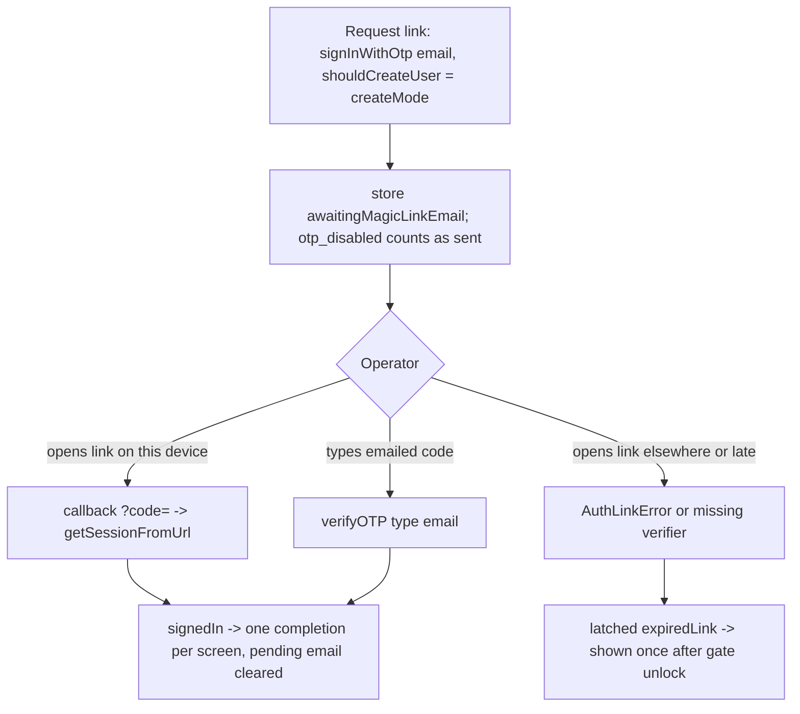

# Social Logins and Passwordless Sign-In - Plan

## Goal Capsule

- **Objective:** Add native Google Sign-In on iOS and Android, passwordless email sign-in (magic link plus an emailed code), branding-compliant Apple and Google buttons, and in-app linking of a second sign-in method, on top of the Supabase account system that shipped with issue #1 (PR #16).
- **Authority:** GitHub issue #2 for product intent; this plan's Product Contract and Key Technical Decisions for scope and mechanism; `AGENTS.md` and `.agents/skills/supabase/SKILL.md` for Supabase conventions; `docs/plans/2026-09-02-001-feat-supabase-auth-cloud-sync-plan.md` (the "#1 plan") for every mechanism this plan extends. R-IDs win on behavior, KTDs on mechanism.
- **Execution profile:** Standard plan, high-risk (authentication, minors' health data, two external identity providers). Work in the `.worktrees/feat-social-logins` worktree per `AGENTS.md`. Implement units in dependency order and keep every existing test green. Code doc comments cite this plan's IDs with a `#2` prefix, for example `(#2 U2; KTD1)`, so they never collide with the #1 plan's IDs already cited across `lib/`.
- **Stop conditions:** Stop and surface a blocker if `google_sign_in` 7.x cannot deliver an ID token with a nonce on either platform, if the silent access-token read returns null on iOS (AS3), if an assumption in `### Assumptions` proves infeasible, or if any unit would require logging or reporting an email, name, token, or identity payload.
- **Tail ownership:** The invoking pipeline owns commit, review, and PR. Google Cloud and Supabase dashboard configuration, and the device checklist, are human follow-up recorded in the Verification Contract and `docs/ops/supabase-go-live.md`.

---

## Product Contract

### Summary

The sign-in screen gains "Sign in with Google" on iOS and Android and "Email me a sign-in link" on every platform with accounts, beside the existing Apple and email/password options. Both provider buttons follow their owners' branding rules. A signed-in operator can see which sign-in methods the account has and add Google or Apple to it after a fresh device-credential check. A link opened on the wrong device, or an expired link or code, tells the operator what happened instead of failing silently.

### Problem Frame

Issue #1 delivered accounts, but the only ways in are a typed password or, on iOS, Apple. Android operators have no one-tap option, and the household's Google accounts are the identities they already use daily. The Apple entry point is a generic Material button, which App Store review can reject under guideline 4.8 (issue #9). Apple "Hide My Email" already creates a second Supabase user for the same person, and adding Google widens that: a relay address never matches a Google address, so automatic identity linking cannot join them, and today the app offers no way to attach a second method to an existing account. Finally, the deep-link path that magic links depend on drops every rejected link on the floor: nothing in the UI reads `pendingLinkFailure`, which was tolerable for confirmation and reset links and is not for a primary sign-in path.

### Actors

- A1. **Operator** — the adult who owns the device and the account.
- A2. **Second device** — another install signed into the same account.
- A3. **Supabase Auth** — validates Google and Apple ID tokens, sends magic-link and code emails, links identities.
- A4. **Google Identity** — Credential Manager on Android, the GoogleSignIn SDK on iOS, issuing OpenID Connect ID tokens.

### Requirements

**Google Sign-In**

- R1. On iOS and Android the operator can sign in with Google through the platform's native picker; no browser tab and no web OAuth redirect.
- R2. The Google ID token is bound to a nonce the app generated, and Supabase's nonce check stays on.
- R3. A dismissed Google picker returns to the sign-in screen with no error; a device without Google credentials or Play Services shows copy that names email sign-in as the alternative.
- R4. Google Sign-In is hidden when the build carries no Google client ids, and on web builds.

**Passwordless email**

- R5. The operator can request a sign-in email; opening its link on the requesting device signs the device in through the existing PKCE callback, and typing the code from the same email signs in without opening the link.
- R6. In sign-in mode a request for an unknown email creates no account and shows the same response as for a known email; in create-account mode it creates one, so passwordless accounts are possible while sign-ups are open (KTD3 owns the closed-sign-ups behavior).
- R7. A link that is expired, reused, or opened on a device other than the one that requested it produces a visible, generic message after the device-credential gate opens; the message carries no link text and no email.
- R8. A session that arrives through a link while the sign-in screen or the first-run account step is showing completes that screen exactly once, the same way a button sign-in does.

**Identity and linking**

- R9. The account section shows which sign-in methods the account has (email, Google, Apple).
- R10. A signed-in operator can add Google, or on iOS Apple, as a sign-in method for the current account after a fresh device-credential check, without signing out.
- R11. A Google or Apple sign-in whose Supabase user differs from the device-bound account reaches the existing "Different account" screen, whose copy explains both the Apple relay-email case and the different-Google-account case.

**Branding, policy, privacy**

- R12. The Apple button is the `sign_in_with_apple` package's `SignInWithAppleButton`; the Google button follows Google's branding guidelines (unmodified "G" mark, approved colors and label); on iOS the Apple button appears first and is at least as large as Google's (App Store guideline 4.8).
- R13. Emails, names, avatar URLs, ID tokens, access tokens, nonces, and identity payloads from Google, Apple, or Supabase never reach logs, `toString()` output, or Sentry.
- R14. Every new failure is a fieldless typed `AuthFailure`, and every new copy string is generic (no email, no provider error text); the provider-unavailable copy may name the provider the operator attempted.
- R15. `auth.uid()` for a Google or magic-link session drives RLS exactly as an email session does; no schema or policy change is needed.

### Key Flows

- F1. Google sign-in on a fresh device
  - **Trigger:** First-run account step or Settings → Sign in; operator taps the Google button.
  - **Actors:** A1, A3, A4
  - **Steps:** Native picker shows accounts; the app receives an ID token minted for its nonce; Supabase returns a session; the screen completes; binding, upload consent, or restoring proceed as in the #1 plan (F2, F3 there).
  - **Covered by:** R1, R2, R15

- F2. Google sign-in on a device already bound to an email account
  - **Trigger:** Operator signs in with Google on a device bound to account A.
  - **Actors:** A1, A3
  - **Steps:** Same verified email → Supabase links the Google identity to A → same `auth.uid()` → normal sync. Different email → a new user → `accountMismatch` → "Different account" screen.
  - **Covered by:** R11, R15

- F3. Passwordless sign-in
  - **Trigger:** Operator enters an email and taps "Email me a sign-in link".
  - **Actors:** A1, A3
  - **Steps:** The app records the pending email; the status tile and the sign-in screen show "check your email" with a code field. Path a: the operator opens the link on this device → callback → session. Path b: the operator types the code → session. Either way the sign-in screen completes and the pending email clears.
  - **Covered by:** R5, R6, R8

- F4. Link opened elsewhere or too late
  - **Trigger:** The link is opened on another device, or after expiry, or twice.
  - **Actors:** A1, A3
  - **Steps:** Another device: no verifier → exchange fails → the requesting device stays signed out; a plain browser shows nothing, and another lunarlog install shows the same generic message described below (a mailbox holder using the raw token is the residual, see KTD3). Expired: the callback carries `error_code` → classified as an error, never exchanged. In both cases the failure is latched in the service; after the gate unlocks, the home gate shows one generic message and consumes it.
  - **Covered by:** R7

- F5. Add a sign-in method
  - **Trigger:** Signed-in operator taps "Add Google" (or "Add Apple" on iOS) in the account section.
  - **Actors:** A1, A3, A4
  - **Steps:** Device-credential prompt → native picker → ID token → link identity to the current user. Success refreshes the methods list. If the identity already belongs to another user, the operator sees generic copy and the account is unchanged. A failed or unavailable device-credential check cancels the action before any provider call.
  - **Covered by:** R9, R10

### Acceptance Examples

- AE1. **Covers R2.** Given the app initialized Google with the SHA-256 of a raw nonce, when Supabase receives the ID token with that raw nonce, then a session is created; when the token carries a different nonce, then Supabase rejects it and the app shows the generic failure copy.
- AE2. **Covers R3.** Given the operator dismisses the Google picker, when control returns, then the screen shows no error and no spinner and the state stays `signedOut`.
- AE3. **Covers R6.** Given sign-in mode and an email with no account, when the operator requests a link, then the app shows the same "check your email" copy as for a known email, no account is created, and no failure is surfaced.
- AE4. **Covers R7.** Given a link with `error_code=otp_expired`, when it opens the app cold, then the device-credential gate shows first, and after unlock the home screen shows "That sign-in link is no longer valid. Request a new one." once.
- AE5. **Covers R8.** Given the pushed sign-in screen is showing, when a magic-link session arrives, then the screen pops without a tap; given a password sign-in whose session event fires before the call returns, then the screen pops once and the route beneath is untouched.
- AE6. **Covers R10.** Given an email/password account signed in, when the operator adds Google whose email differs after passing the device-credential prompt, then the methods list shows Email and Google and the `auth.uid()` is unchanged; when the prompt is declined, then no provider call happens.
- AE7. **Covers R11.** Given a device bound to account A, when a Google sign-in resolves to user B, then the "Different account" screen appears, "Switch account" leaves A's data intact, and no sync runs.
- AE8. **Covers R4.** Given a build with empty `GOOGLE_WEB_CLIENT_ID`, when the sign-in screen renders on Android, then no Google button exists; given a web build, then no Google button exists regardless of defines.

### Scope Boundaries

- No Google Sign-In on web: `google_sign_in_web` supports only its rendered button, and web accounts are off by default (#1 plan AS9).
- No unlinking of a sign-in method: it needs a second identity and a re-authentication story; the account keeps every method it has. The admin recovery for a rogue identity is recorded in U6. **Superseded 2026-09-05** by `docs/plans/2026-09-05-001-feat-remove-linked-sign-in-method-plan.md` (issue #31): the account section now offers `Remove Google` / `Remove Apple`, reusing exactly the re-authentication story this bullet said was missing; the U6 admin recovery is now the fallback for cases the in-app action cannot reach, not the only removal.
- No provider-management screen beyond the methods line and the add actions.
- No change to the one-account-per-device binding, upload consent, or sync.

#### Deferred to Follow-Up Work

- **Passkeys.** Supabase passkeys are beta and the Dart API is `@experimental`; a native flow needs the `passkeys` plugin, a relying-party id on an HTTPS domain the app owns with an `apple-app-site-association` and `assetlinks.json`, and that id is immutable once a passkey is enrolled. The app has no App Links domain. File after an `https` callback domain exists (the #1 plan's deferred App Links hardening).
- **Account deletion and export** remain issue #17 and gate the first store submission.
- **Security-notification emails** (identity linked, password changed) once custom SMTP exists (issue #18).

### Dependencies

- Google Cloud OAuth clients (Web, iOS, Android with debug, release, and Play App Signing SHA-1s) and the Supabase Google provider configured with the Web and iOS client ids (the token audiences per KTD1; the Android client id is never an audience); Supabase "manual linking" enabled; the Magic Link and Confirm signup email templates extended with `{{ .Token }}`; email OTP expiry and length set; custom SMTP (issue #18). All human dashboard work, recorded in U6.
- Issue #9 is closed by U4 (Apple button).

---

## Planning Contract

### Assumptions

- AS1. Google Sign-In ships native on iOS and Android in this issue. OAuth client ids are client-safe, so the iOS reversed client id is committed in `ios/Runner/Info.plist` once it exists; until then no Google URL scheme is present, which is safe because `hasGoogle` is false and the plugin is never invoked.
- AS2. One Google nonce per process is acceptable: Supabase never invalidates a consumed nonce, so a per-attempt nonce would stop no replay a per-process one allows; both require the raw nonce, which lives only in memory and never in logs (KTD7). Any app can mint a token for the public client ids with its own nonce, so the nonce defends the legitimate user's captured token, not attacker-minted ones. "Skip nonce check" stays off because it lets any captured ID token for either client id become a session without that in-memory secret.
- AS3. The Google access token is passed to Supabase only when it can be read without a prompt; Supabase requires it only when the ID token carries `at_hash`. iOS tokens from the GoogleSignIn SDK carry `at_hash` and Credential Manager tokens generally do not, so the silent read must succeed on iOS; the device checklist proves it, and a null silent read on iOS is a stop condition rather than a reason to add the prompting variant.
- AS4. The emailed code works only after both the Magic Link template (existing users) and the Confirm signup template (new users created through `signInWithOtp`) include `{{ .Token }}`; until then the link path alone works, and the code field is still shown.
- AS5. Email OTP expiry is set to 600 seconds and `otp_length` to 8 in the dashboard before passwordless ships (U6 checkbox); cooldown and send limits keep Supabase defaults. The expiry setting governs every Supabase email link (confirmation, recovery, email change, magic link), so the #1 flows tighten too and the app has no resend button; re-sign-up or re-request is the recovery path, recorded in U6. There is no client-side attempt cap: the brute-force bound is server-side, and the code field accepts 6 to 10 digits so a default-length project still works.
- AS6. The "add a method" action covers Google everywhere and Apple on iOS; an Apple identity from the native flow links with the same hashed-nonce discipline as sign-in.
- AS7. Sign-in with Google or a magic link on a device holding local data goes through the existing upload-consent step; nothing about binding changes.
- AS8. The Google button is drawn in Flutter from the official "G" asset and the published colors, because no official Flutter widget exists.

### Key Technical Decisions

- KTD1. **Native Google Sign-In through `google_sign_in` 7.2 and `signInWithIdToken`, with a per-process hashed nonce.** 7.x is the Credential Manager migration; 6.x wraps the deprecated Android SDK. The service generates a raw nonce on the first Google attempt, calls `initialize(clientId: iOS id, serverClientId: Web id, nonce: sha256hex(raw))` once, then `authenticate()`; the raw nonce goes to `signInWithIdToken(provider: google, idToken, accessToken?, nonce: raw)`. Supabase compares `sha256(nonce)` to the token's `nonce` claim and errors if only one side has one, so both or neither. The token audience is the Web client id on Android and the iOS client id on iOS; both are listed in the dashboard. The plugin sits behind a `GoogleSignInClient` interface in `lib/data/auth/`, a platform seam like `AuthLinkSource` and not a GoTrue concern, injected into the service with a default adapter exactly as `AppleCredentialRequest` is, so `lib/startup/supabase_bootstrap.dart` is untouched and tests inject an ID token without the plugin. `AuthGateway.signInWithIdToken` gains the `accessToken` parameter it lacks today. Governs R1, R2.
- KTD2. **Client ids are build-time constants; the button hides when they are empty.** `AppConfig` gains `googleIosClientId`, `googleWebClientId`, and `hasGoogle` (both non-empty, not web, and `hasSupabase`), read from `GOOGLE_IOS_CLIENT_ID` and `GOOGLE_WEB_CLIENT_ID` defines in all six workflow build steps, `dart_defines.example.json`, and `dart_defines.json`. The iOS reversed client id is a literal `CFBundleURLTypes` entry in `ios/Runner/Info.plist`, added by the operator in the same change that sets the client ids (U6 human step); no xcconfig indirection and no placeholder scheme ships. Governs R4.
- KTD3. **Passwordless email is `signInWithOtp` plus `verifyOTP(type: email)`, riding the existing PKCE callback; the mailbox is the trust boundary.** `signInWithOtp(email, emailRedirectTo: kAuthCallbackUrl, shouldCreateUser: createMode)` makes Supabase send a link that verifies to `lunarlog://auth-callback?code=…`, which `classifyAuthLink` already accepts as a callback (`type=magiclink` needs no new branch). The same email's `{{ .Token }}` is verified with `verifyOTP(type: OtpType.email)`; `OtpType.magiclink` is deprecated. The link's `token_hash` verifies from any client that holds the publishable key, so PKCE only stops a tapped link from installing a session on a foreign device; the link text itself is a bearer credential, and whoever reads the mailbox can sign in, which is why AS5 shortens expiry and U6 requires sign-ups to be closed or allow-listed. The link path is kept beside the code for one-tap convenience on the requesting device and because the #1 callback already exists; a code-only flow was considered and rejected only on that convenience. In sign-in mode `sendMagicLink` treats the server's `otp_disabled` rejection (unknown email with `shouldCreateUser: false`) as success, so known and unknown emails get one response (R6). The steady state after onboarding is sign-ups closed: `signup_disabled` from any provider (passwordless create mode, a first Google or Apple sign-in) maps to `AuthFailure.signUpClosed` with copy "New accounts for this app are set up by the account owner", so a new household member is told accounts are invitation-only instead of "something went wrong"; a first Apple Hide My Email sign-in is then rejected too, which is the intended fix for the duplicate-user problem, and that person adds Apple from the account section (F5) instead. The pending email is stored in device-local settings under a new `SettingsKeys.awaitingMagicLinkEmail`, shown by `SyncStatusTile` and the sign-in screen, and cleared by `lib/app.dart` when a session arrives, exactly like `awaitingConfirmationEmail`. Governs R5, R6.
- KTD4. **One completion path per screen, and link failures surface once at the home gate through the launch-payload pattern.** gotrue emits `signedIn` on `onAuthStateChange` before `signInWithPassword` returns, so a naive listener would complete a screen twice. `SignInScreen` therefore funnels the button actions and a new `AuthController` listener through one `_signedIn()` guarded by a `_completed` flag; `FirstRunScreen` keeps its single `onSignedIn` callback and gains no build-time exit. `ProfileHomeGate` reads `AuthController.pendingLinkFailure` only when the gate reports unlocked, shows one `SnackBar` whose text is `authFailureCopy(failure)` (a latched `network` failure keeps its own copy), and consumes it through the same microtask-plus-guard shape as `_maybeConsumeLaunchPayload`; `pendingRecovery` is read at that spot but consumed by the recovery screen, so the launch payload is the precedent, not recovery. New failure kinds join the sealed `AuthFailure`: `expiredLink` (link rejected, expired, reused, or opened on a foreign device), `invalidCode` (wrong or expired emailed code), `providerUnavailable` (Google sign-in failed for any reason other than cancellation), `identityTaken` (identity belongs to another user), and `signUpClosed` (KTD3). `authFailureCopy` is an exhaustive switch, so its new arms land with the failures (U2). Mapping is by operation, not by code alone: `handleLink` maps every non-network exchange failure to `expiredLink`, including `otp_expired`, `flow_state_not_found`, `flow_state_expired`, `bad_code_verifier`, the gotrue null-code "Code verifier could not be found" exception, and any `AuthLinkError`, while `AuthNetworkFailure` keeps its retryable behavior; `verifyEmailCode` wraps `otp_expired` and `otp_disabled` into `invalidCode`; `mapAuthError` stays pure. Governs R3, R7, R8.
- KTD5. **Sign-in methods come from `User.identities`; adding one uses `linkIdentityWithIdToken` behind a fresh device-credential check.** `AuthUser` gains `providers: List<String>` built from `identities[].provider` (fallback `appMetadata['providers']`), never from `userMetadata`; the session's user is re-read after linking, and `getUserIdentities` is added only if that proves stale. `AuthService.linkGoogle()` and `linkApple()` reuse the KTD1 and #1-plan KTD9 credential paths and call `linkIdentityWithIdToken` with the same token, access token, and nonce; the dashboard's "manual linking" must be on. Supabase requires no re-authentication to link and the app offers no unlink, so anyone holding the unlocked device (a household member, a borrowed phone) could attach their own identity permanently: the account section calls a new `GateController.reauthenticate()` before linking, and a declined or unavailable prompt cancels the action with no extra UI, like a dismissed Google picker. **Superseded 2026-09-05** by `docs/plans/2026-09-05-001-feat-remove-linked-sign-in-method-plan.md` (issue #31): "the app offers no unlink" is no longer true — `AuthService.unlinkProvider` removes Google or Apple behind the same re-authentication story this KTD describes, plus a confirmation dialog naming the consequence first. That method is required, not optional: `unlock()` returns immediately while the app is unlocked, and a credential prompt raised outside the controller's `_authenticating` flag trips the `inactive` re-lock; `reauthenticate()` returns false when already authenticating, sets `_authenticating` and clears `_lifecycleDuringAuth` exactly as `unlock()` does, awaits the gate's access request, returns granted and not interrupted, and never changes `_locked`. **Superseded 2026-09-03** by `docs/plans/2026-09-03-003-fix-gate-discards-granted-unlock-plan.md` (issue #65): `_lifecycleDuringAuth` is gone, because the credential prompt reports its own `inactive` and so "not interrupted" was never true on iOS — `reauthenticate()` silently cancelled every add-a-method attempt, and `unlock()` could not open the app at all. It now reports the credential's own result and replays a departure only when the operator is still away once the prompt is down. An exfiltrated token bypasses any client prompt; that case is bounded by the JWT expiry, refresh-token revocation on "Sign out everywhere", and U6's admin recovery. Automatic linking joins a Google identity to an existing user only when the emails match and are verified, and Apple relay addresses never match, so the add action is the only way to attach Apple-with-Hide-My-Email to an email account. Governs R9, R10.
- KTD6. **Buttons: `SignInWithAppleButton` and a branded Google button widget; Apple first on iOS.** The Apple widget is the package's HIG implementation (44 pt, `SignInWithAppleButtonStyle.black`, text `signIn`), keeping the `auth-apple` key. The Google button is a `lib/ui/account/google_sign_in_button.dart` widget: 40 dp height, white fill, `#747775` stroke, `#1F1F1F` text "Sign in with Google", the official `assets/branding/google_g_logo.png` (bundled 1x/2x/3x) on a white pad, no custom colors. On iOS the order is Apple, Google, email; on Android Google, email. The Apple button stays iOS-only. Governs R12.
- KTD7. **Privacy floor extends to identity payloads.** `sentryDenyListedKeys` in `lib/observability/scrub.dart` gains `identities`, `identity_data`, `id_token`, `identity_token`, `access_token`, `refresh_token`, `provider_token`, `provider_refresh_token`, `authorization_code`, `server_auth_code`, `token_hash`, `code_verifier`, `nonce`, `full_name`, `given_name`, `family_name`, `picture`, `avatar_url`, `photo_url`, `hd`, `user_metadata`; `sentryDataLayerTypeMarkers` gains `googlesignin` so a `GoogleSignInException` that escapes the KTD8 mapping is reduced to its type. Bare words such as `name`, `token`, `user`, `sub`, and `session` are not added, because the scrubber also drops any message that mentions a deny-listed key and those words appear in ordinary Drift, gotrue, and HTTP messages; a `session` breadcrumb key is already covered by its nested token keys. `GoogleSignInAccount`, `AuthResponse`, and `User` are never interpolated into a log; `debugPrint` lines carry only `runtimeType` and the `GoogleSignInExceptionCode` enum name. Governs R13, R14.
- KTD8. **Google failures map by `GoogleSignInExceptionCode`.** `canceled` → `GoogleSignInCancelled` (not a failure); every other code from `authenticate()` (`providerConfigurationError`, `uiUnavailable`, `unknownError`) → `AuthFailure.providerUnavailable`, because the Android plugin reports "no credentials available" as `unknownError` and the description string is neither stable nor loggable, and the email-alternative copy is right for every non-cancel failure; a credential with no ID token → `AuthFailure.unknown`. A wrong SHA-1 also surfaces as `canceled` on Android, so U6's go-live doc names that trap and records that the no-account case is not separately detectable. Governs R3.

### High-Level Technical Design

```mermaid
sequenceDiagram
  participant UI as SignInScreen
  participant S as SupabaseAuthService
  participant G as GoogleSignInClient
  participant SB as Supabase Auth
  UI->>S: signInWithGoogleNative()
  S->>S: raw = nonce(); hashed = sha256(raw)
  S->>G: initialize(iosId, webId, nonce: hashed) [once per process]
  S->>G: authenticate()
  G-->>S: idToken (aud = platform client id, nonce = hashed) + accessToken?
  S->>SB: signInWithIdToken(google, idToken, accessToken?, nonce: raw)
  SB-->>S: session (auto-linked when verified email matches)
  S-->>UI: GoogleSignInSession(user with providers)
```



### Sequencing

U1 (config, dependency) → U2 (Google sign-in, new failures, copy arms) → U7 (passwordless service) → U8 (identities and linking service) → U3 (link-delivered completion and link-failure surface; needs U2 and U7) → U4 (buttons, passwordless entry, pending-email state; needs U3) → U5 (account section and linking UI; needs U8 and U4) → U6 (privacy floor, docs, go-live). U7 and U8 each depend only on U2, but they edit the same six auth files and fixtures, so U8 starts only after U7 has landed; never run them concurrently.

---

## Implementation Units

### U1. Google configuration and dependency

**Goal:** The build knows its Google client ids and hides Google when they are absent.

**Requirements:** R4 (KTD2).

**Dependencies:** none.

**Files:**
- Modify `pubspec.yaml` (add `google_sign_in: ^7.2.0`; add `assets/branding/` to `flutter.assets`)
- Modify `lib/config.dart` (`googleIosClientId`, `googleWebClientId`, `hasGoogle`, pure `computeHasGoogle`)
- Modify `dart_defines.example.json`; modify `.github/workflows/ci.yml`, `ios-release.yml`, `play-store-release.yml` (add the two defines to every `--dart-define` build step, from same-named repository secrets)
- Verify `android/app/build.gradle.kts` `minSdk` resolves to at least 24 (google_sign_in_android 7.2 requirement); set it explicitly if `flutter.minSdkVersion` is lower
- Modify `test/config_test.dart`

**Approach:**
1. Mirror `hasSupabase`: `hasGoogle` is a `const` expression (`hasSupabase && !kIsWeb && both ids non-empty`) with `computeHasGoogle` as the testable twin.
2. Forks and PR builds get empty secrets, so every workflow must still build with empty ids; nothing in `lib/` may assume they exist.
3. `ios/Runner/Info.plist` is not touched here (KTD2); client ids stay out of `.env` and out of `AGENTS.md` values.

**Patterns to follow:** `lib/config.dart` `hasSupabase` / `computeHasSupabase`; the three-line `--dart-define` blocks in `ci.yml` "Build web (release)", "Build debug APK", "Build iOS (unsigned)".

**Test scenarios:**
- `computeHasGoogle` is false when either id is empty, when `isWeb` is true, or when `hasSupabase` is false; true otherwise.
- `AppConfig.hasGoogle` equals `computeHasGoogle` over the compile-time inputs (same style as the existing `hasSupabase` agreement test).
- Test expectation for workflows: none — verified by the web, APK, and unsigned iOS CI builds.

**Verification:** `flutter analyze`; `flutter test`; `flutter build web --release` and `flutter build apk --debug` with and without the defines succeed; the CI unsigned iOS build succeeds.

### U2. Google sign-in in the auth contract and service, with the new failure kinds

**Goal:** `AuthService` can sign in with Google natively with a nonce-bound token, and every new failure kind exists with its copy.

**Requirements:** R1, R2, R3, R13, R14 (KTD1, KTD4 failure kinds, KTD7, KTD8); AE1, AE2.

**Dependencies:** U1.

**Files:**
- Modify `lib/domain/auth/auth_service.dart` (`GoogleSignInResult` sealed: `GoogleSignInSession`, `GoogleSignInCancelled`; `AuthFailure` factories `expiredLink`, `invalidCode`, `providerUnavailable`, `identityTaken`, `signUpClosed`; method `signInWithGoogleNative`)
- Create `lib/data/auth/google_sign_in_client.dart` (`GoogleSignInClient` interface; `GoogleCredential` value with `idToken`, `accessToken?`; default adapter over `GoogleSignIn.instance` guarding the once-per-process `initialize`)
- Modify `lib/data/auth/auth_gateway.dart` (`accessToken` on `signInWithIdToken`) and `GoTrueAuthGateway`
- Modify `lib/data/auth/supabase_auth_service.dart` (Google flow, cached nonce pair, `_googleAvailable`, `GoogleSignInException` mapping)
- Modify `lib/ui/account/auth_controller.dart` (delegation); modify `lib/ui/account/sign_in_screen.dart` only for the four new `authFailureCopy` arms (the switch is exhaustive; the buttons come in U4)
- Modify `test/support/fake_auth_service.dart` (`googleResult`, `googleUnsupported`, `googleCalls`); modify `test/data/supabase_auth_service_test.dart` (fake gateway gains `accessToken`; fake `GoogleSignInClient`)

**Approach:**
1. `_googleAvailable` defaults to `AppConfig.hasGoogle`, injectable like `appleAvailable`; unavailable throws `UnsupportedError` before touching the client.
2. The nonce pair (`raw`, `hashed`) is created on the first Google call and cached in the service for the process (AS2); `initialize` runs once through the client interface with the iOS client id passed only on iOS; the adapter guards re-entry.
3. Access token: call the client's `authorizationForScopes(['email', 'profile'])` (no UI) and pass the token when present; never call the prompting variant (AS3).
4. `GoogleSignInException` mapping per KTD8; any other exception from the client → `unknown`, logged by type only; `signup_disabled` from Supabase → `signUpClosed` (KTD3).
5. Copy for the new failures: `providerUnavailable` → "Google Sign-In isn't available on this device. Use email instead."; `expiredLink` → "That sign-in link is no longer valid. Request a new one."; `invalidCode` → "That code was not accepted. Check it or request a new email."; `identityTaken` → "That sign-in method already belongs to another account."; `signUpClosed` → "New accounts for this app are set up by the account owner."

**Patterns to follow:** `signInWithAppleNative` and `AppleCredentialRequest` in `lib/data/auth/supabase_auth_service.dart`; `_guard`; `FakeAuthGateway` in `test/data/supabase_auth_service_test.dart`.

**Test scenarios:**
- Covers AE1. Google sign-in passes `OAuthProvider.google`, the injected ID token, and a raw nonce whose SHA-256 equals the nonce the client was initialized with; a second Google call reuses the same nonce and does not re-initialize.
- Covers AE2. A `canceled` exception returns `GoogleSignInCancelled` with no state change and no failure.
- `providerConfigurationError`, `uiUnavailable`, and `unknownError` throw `providerUnavailable`; a credential without an ID token throws `unknown`; a Supabase `signup_disabled` rejection throws `signUpClosed`.
- `signInWithGoogleNative` with `googleAvailable: false` throws `UnsupportedError` and leaves state `signedOut`.
- Access token is forwarded when the client returns one and omitted when it returns null.
- Every new `AuthFailure` `toString()` contains no message, email, or token, and `authFailureCopy` returns email-free copy for each.

**Verification:** `flutter analyze`; `flutter test`.

### U7. Passwordless email in the auth contract and service

**Goal:** `AuthService` can send a sign-in email and verify its code, with link and code failures typed by operation.

**Requirements:** R5, R6, R7, R14 (KTD3, KTD4 mapping); AE3.

**Dependencies:** U2.

**Files:**
- Modify `lib/domain/auth/auth_service.dart` (`sendMagicLink({email, createAccount})`, `verifyEmailCode({email, code})`)
- Modify `lib/data/auth/auth_gateway.dart` (`signInWithOtp`, `verifyOTP`) and `GoTrueAuthGateway`
- Modify `lib/data/auth/supabase_auth_service.dart` (both operations; `handleLink` and `verifyEmailCode` wrap failures per KTD4)
- Modify `lib/ui/account/auth_controller.dart` (delegations)
- Modify `test/support/fake_auth_service.dart` (`magicLinkCalls`, `codeCalls`); modify `test/data/supabase_auth_service_test.dart` (fake gateway gains the two methods)

**Approach:**
1. `sendMagicLink` passes `emailRedirectTo` from `resolveAuthRedirectUrl` and `shouldCreateUser: createAccount`; in sign-in mode an `otp_disabled` rejection completes normally (KTD3); in create mode `signup_disabled` maps to `signUpClosed`.
2. `verifyEmailCode` calls `verifyOTP(type: OtpType.email)` and wraps `otp_expired` and `otp_disabled` into `invalidCode`.
3. `handleLink` wraps its exchange failures into `expiredLink` per KTD4, including the null-code "Code verifier could not be found" exception and the `AuthLinkError` branch that surfaced `unknown` before; a `network` failure keeps its retryable behavior.

**Patterns to follow:** `sendPasswordReset` and `handleLink` in `lib/data/auth/supabase_auth_service.dart`.

**Test scenarios:**
- Covers AE3. `sendMagicLink(createAccount: false)` calls `signInWithOtp` with `shouldCreateUser: false` and the callback redirect; when the gateway throws `otp_disabled` it completes with no failure and no state change; `createAccount: true` passes true.
- `verifyEmailCode` calls `verifyOTP(type: OtpType.email)` and yields `signedIn`; a rejected or expired code throws `invalidCode`.
- A link carrying `error_code=otp_expired` surfaces `expiredLink`; an exchange failing with `flow_state_not_found` or `flow_state_expired` surfaces `expiredLink`; a `?code=` callback while the gateway throws the null-code verifier exception surfaces `expiredLink`, leaves state `signedOut`, and latches the link; none of them carries link text.
- `sendMagicLink(createAccount: true)` when the gateway throws `signup_disabled` throws `signUpClosed`.
- A transient network failure during the exchange still surfaces `network` and leaves the link retryable.

**Verification:** `flutter analyze`; `flutter test`.

### U8. Sign-in methods and identity linking in the auth contract and service

**Goal:** `AuthUser` reports the account's sign-in methods, and the service can link Google or Apple to the current user.

**Requirements:** R9, R10, R14, R15 (KTD5); AE6.

**Dependencies:** U2, U7 (same files; U7 lands first).

**Files:**
- Modify `lib/domain/auth/auth_service.dart` (`AuthUser.providers`; `linkGoogle`, `linkApple`)
- Modify `lib/data/auth/auth_gateway.dart` (`linkIdentityWithIdToken`) and `GoTrueAuthGateway`
- Modify `lib/data/auth/supabase_auth_service.dart` (`_toUser` with providers; linking through the KTD1 and Apple credential paths; `identity_already_exists` → `identityTaken`)
- Modify `lib/ui/account/auth_controller.dart` (delegations)
- Modify `test/support/fake_auth_service.dart` (`providers`, `linkCalls`); modify `test/data/supabase_auth_service_test.dart` (fake gateway gains the method; identities on the fake user)

**Approach:**
1. `providers` derives from `identities[].provider`, falling back to `appMetadata['providers']`, never from `userMetadata`.
2. `linkGoogle` and `linkApple` require `state == signedIn`, obtain a credential the same way as sign-in (same nonce discipline), call `linkIdentityWithIdToken`, and re-read the session user so `providers` is fresh (gotrue saves the returned session and emits `userUpdated`); add `getUserIdentities` only if the re-read proves stale.
3. The device-credential check before linking is a UI concern (U5); the service only enforces the signed-in precondition.
4. R15 is proven here rather than argued: a Google or code session and an email session expose the same `currentUserId`, and the engine's binding compares that id alone, so RLS behavior is identical by construction.

**Patterns to follow:** `signInWithAppleNative` in `lib/data/auth/supabase_auth_service.dart`; `_toUser`.

**Test scenarios:**
- `currentUser.providers` lists `['email', 'google']` for a user with two identities and falls back to `appMetadata['providers']` when identities are null.
- Covers AE6. `linkGoogle` while signed in calls `linkIdentityWithIdToken` with the Google token and raw nonce and refreshes providers; `identity_already_exists` throws `identityTaken` and the user is unchanged; `linkGoogle` while signed out throws `unknown` without calling the client.
- `linkApple` on a non-iOS platform throws `UnsupportedError`; a cancelled Apple dialog during linking leaves providers unchanged and throws no failure.
- Covers R15. A session established through the Google path and one through `verifyEmailCode` yield the same `currentUserId` as a password session for the same fake user, and the sync engine's binding check (`test/data/sync_engine_test.dart` fake) accepts it without change.

**Verification:** `flutter analyze`; `flutter test`.

### U3. Link-delivered sessions and the link-failure surface

**Goal:** A session that arrives through a link completes whatever sign-in surface is showing exactly once, and rejected links produce one visible message after unlock.

**Requirements:** R7, R8 (KTD4); AE4, AE5.

**Dependencies:** U2, U7.

**Files:**
- Modify `lib/ui/account/sign_in_screen.dart` (`AuthController` listener; `_completed` guard on `_signedIn()`)
- Modify `lib/ui/profiles/first_run_screen.dart` (in `initState`, when a session already exists and a `SyncStatusController` is present, enter the restoring wait instead of the name form, so a cold-start link session does not skip the restoring step)
- Modify `lib/ui/profiles/profile_home_gate.dart` (consume `pendingLinkFailure` after unlock through the `_maybeConsumeLaunchPayload` shape; `SnackBar` keyed `auth-link-failure` with `authFailureCopy`)
- Modify `test/ui/account_test.dart`, `test/ui/profiles_test.dart`, `test/ui/gate_test.dart`

**Approach:**
1. The listener lives in `SignInScreen` state: on `signedIn` while mounted, run `_signedIn()`; `_signedIn()` returns early when `_completed` is already set, so a button action whose session event fires first completes once (KTD4).
2. `FirstRunScreen` keeps its single `onSignedIn` path; only the cold-start case in `initState` changes.
3. The gate shows the failure only when unlocked, consumes it in a microtask guarded against re-entry, and never repeats it on rebuild.

**Patterns to follow:** `_maybeConsumeLaunchPayload` in `profile_home_gate.dart`; `_onSignedIn` and `_awaitingRestore` in `first_run_screen.dart`.

**Test scenarios:**
- Covers AE5. Pushed `SignInScreen` pops when the fake service emits `signedIn` without any tap; when a password sign-in's `signedIn` emission precedes the call's return, the screen pops once and the route beneath is still present.
- Embedded first-run account step advances to the restoring step when the fake emits `signedIn`, and the name form never appears for a non-empty account; a first run that starts with an existing session and a sync controller shows the restoring wait first.
- Covers AE4. With `pendingLinkFailure = expiredLink` and the gate locked, no SnackBar shows; after unlock the SnackBar shows the `expiredLink` copy once and `consumeLinkFailure` clears it; a rebuild shows nothing; a latched `network` failure shows the network copy.
- An unbound, empty device receiving a `?code=` callback with no stored verifier stays `signedOut`, shows the `expiredLink` message after unlock, and `bound_user_id` stays null.
- The SnackBar copy contains no email and no link text.

**Verification:** `flutter analyze`; `flutter test`.

### U4. Provider buttons and passwordless entry on the sign-in screen

**Goal:** The sign-in screen offers Apple (HIG widget), Google (branded widget), and passwordless email with a code field, with the platform ordering, hide rules, and a persisted "check your email" state.

**Requirements:** R1, R3, R4, R5, R6, R12, R14 (KTD3, KTD6, KTD8); AE2, AE8. Closes issue #9.

**Dependencies:** U3.

**Files:**
- Create `lib/ui/account/google_sign_in_button.dart`; add `assets/branding/google_g_logo.png` at 1x, 2x, 3x (official asset from Google's branding page) and `assets/branding/README.md` naming the source and license terms
- Modify `lib/domain/repositories/settings_store.dart` (`SettingsKeys.awaitingMagicLinkEmail`)
- Modify `lib/ui/account/sign_in_screen.dart` (`showGoogle` override like `showApple`; `SignInWithAppleButton`; Google button keyed `auth-google`; "Email me a sign-in link" keyed `auth-magic-link`; code field keyed `auth-code` with "Sign in with code" keyed `auth-verify-code`; ordering; pending-email write and read-back on init)
- Modify `lib/ui/account/sync_status_tile.dart` (`kAwaitingMagicLinkCopy`, precedence next to the confirmation copy), `lib/app.dart` (clear the key on `signedIn`)
- Modify `test/ui/account_test.dart`

**Approach:**
1. `_showGoogle` defaults to `AppConfig.hasGoogle`; `showGoogle` overrides for tests; both provider buttons render above the email form on iOS in the order Apple, Google.
2. Passwordless: the button sends a link for the typed email in the current mode (`createAccount: _createMode`), stores `awaitingMagicLinkEmail`, and reveals the code field; the code button calls `verifyEmailCode` and is disabled until the field holds 6 to 10 digits, mirroring the password-length guard in the same screen. On init the screen reads `awaitingMagicLinkEmail` and, when set, pre-fills the email and reveals the code field so a code already in the inbox can be entered after a restart. The key follows the `awaitingConfirmationEmail` lifecycle; the tile copy names "sign-in email" and the same-device rule.
3. Google button: `Semantics(button: true, label: 'Sign in with Google')`, 40 dp, disabled while busy, no color changes on press beyond the spec's state overlay.

**Patterns to follow:** existing `_apple()` and `_run()` in `sign_in_screen.dart`; `showApple` platform-override test with `debugDefaultTargetPlatformOverride` reset inside the test; `awaitingConfirmationEmail` handling in `sign_in_screen.dart`, `sync_status_tile.dart`, and `app.dart`.

**Test scenarios:**
- Covers AE8. `showGoogle: false` renders no `auth-google`; a `showGoogle: null` test on a non-web platform with empty config renders none (the web rule is asserted through `computeHasGoogle` in U1).
- On iOS override with both shown, the Apple button precedes the Google button in the tree and the Apple widget is a `SignInWithAppleButton` keyed `auth-apple`.
- Covers AE2. Google cancelled: no `auth-error`, no spinner, form still editable.
- Google `providerUnavailable` shows the email-alternative copy under `auth-error`.
- Tapping `auth-magic-link` in sign-in mode calls `sendMagicLink(createAccount: false)` with the trimmed email, stores `awaitingMagicLinkEmail`, and reveals `auth-code`; in create mode passes true; the tile shows the magic-link copy; a `signedIn` transition clears the key and the copy.
- Entering a code and tapping `auth-verify-code` calls `verifyEmailCode`; `invalidCode` shows its copy; a 6-digit and an 8-digit code are both accepted by the field; with 5 digits the button is disabled and no call is made.
- Opening the screen while `awaitingMagicLinkEmail` is set pre-fills the email and shows the code field without a new request.
- Every new copy string contains no email.

**Verification:** `flutter analyze`; `flutter test`; the Google button is compared by eye against Google's light-theme spec on a device (human item in U6's checklist).

### U5. Account section: sign-in methods, adding one behind re-auth, mismatch copy

**Goal:** A signed-in operator sees the account's sign-in methods, can add Google or Apple after a fresh device-credential check, and the "Different account" screen explains the Google case.

**Requirements:** R9, R10, R11 (KTD5); AE6, AE7.

**Dependencies:** U8, U4.

**Files:**
- Modify `lib/ui/account/account_section.dart` (convert to a `StatefulWidget` with a per-action busy flag; subtitle on the `account-identity` tile: "Sign-in methods: Email, Google"; actions `account-add-google`, `account-add-apple` shown when the method is absent and the platform supports it, disabled with a trailing spinner while linking; inline `Text` keyed `account-link-error` beneath the identity tile for `identityTaken` and other failures; re-auth through `GateController.reauthenticate()` before linking)
- Modify `lib/ui/account/account_mismatch_screen.dart` (provider-neutral sentence plus the Apple "Hide My Email" note, keeping that phrase, the operator's email line, and the "Nothing has been uploaded or changed" reassurance)
- Modify `lib/app_lifecycle.dart` (`GateController.reauthenticate()` per KTD5) and the test `FakeGate` (matching hook returning a configurable result)
- Modify `test/ui/account_test.dart`, `test/ui/gate_test.dart`

**Approach:**
1. Keep the tile title `Signed in as …` unchanged (pinned by tests); the methods line is the subtitle.
2. Add actions call `reauthenticate()` first (KTD5); a declined or unavailable prompt cancels with no provider call and no copy; then the tapped action is disabled with a spinner until the link call returns; success calls `setState` and re-reads `currentUser.providers` (the controller does not notify on a same-state `userUpdated`); failures render in `account-link-error` through `authFailureCopy`.
3. Mismatch copy: "This device is set up for a different account. This happens when Apple's Hide My Email created a new account, or when you chose a different Google account." with the existing actions unchanged.

**Patterns to follow:** `account_section.dart` sign-out action wiring; the gate's unlock prompt in `lib/app_lifecycle.dart`; `account_mismatch_screen.dart` copy test at `test/ui/account_test.dart` (`textContaining('Hide My Email')`).

**Test scenarios:**
- Providers `['email']` renders "Sign-in methods: Email" and shows `account-add-google`; providers `['email', 'google']` hides it.
- `account-add-apple` renders only on iOS (override) and when `apple` is absent.
- Covers AE6. Tapping `account-add-google` with the fake gate granting re-auth calls `linkGoogle`; on success the subtitle updates; with the fake gate declining, `linkGoogle` is never called and no error shows; `identityTaken` shows its copy in `account-link-error` and the subtitle is unchanged; a second tap while the first link call is held does not call `linkGoogle` again.
- `GateController.reauthenticate()` returns false without prompting when an unlock is already in progress, does not change `locked`, and returns false when the prompt is interrupted by a lifecycle change.
- Covers AE7. The mismatch screen still contains "Hide My Email" and now contains "different Google account"; "Switch account" and the destructive action keys are unchanged.

**Verification:** `flutter analyze`; `flutter test`.

### U6. Privacy floor, documentation, and go-live checklist

**Goal:** Sentry cannot carry identity payloads, and every human prerequisite for Google and passwordless sign-in is written down with its trap.

**Requirements:** R13 (KTD7); documentation for KTD2, KTD3, KTD5, KTD8.

**Dependencies:** U1–U5, U7, U8.

**Files:**
- Modify `lib/observability/scrub.dart` (deny-list keys per KTD7); modify `test/observability/scrub_test.dart`
- Modify `docs/ops/supabase-go-live.md` (Google Cloud clients with debug, release, and Play App Signing SHA-1s; Supabase Google provider Web and iOS client ids and nonce check on; manual linking on; Magic Link and Confirm signup templates with `{{ .Token }}` and a "never share this code or link, even with family" line; email OTP expiry 600 s and length 8, noting the expiry governs confirmation and reset links too and that re-sign-up or re-request is the recovery; closing "Allow new users to sign up" once the household's accounts exist, or a `before_user_created` hook with a household allow-list whose addresses live only in a table in the Supabase project populated from the dashboard SQL editor, never in a tracked migration, `docs/`, or a secret; the onboarding procedure for a new household member once sign-ups are closed (reopen briefly or allow-list); the reversed client id entry in `ios/Runner/Info.plist`; `GOOGLE_*` repository secrets; admin recovery for a rogue linked identity: delete the identity from the user in the dashboard, then revoke every session for that user from the dashboard; device checklist items for Google fresh device, Google same-email auto-link, Google different-account mismatch, Google sign-in with sign-ups closed showing the invitation-only copy, iOS Google sign-in completing with no consent prompt, add-method with declined and granted re-auth, magic link on this device, link on another lunarlog install, expired link, confirmation and reset links opened after expiry, code entry from a magic-link email and from a confirmation email, Play-Services-less Android, post-unlock state after the Google picker and the Apple sheet, Google button screenshot against the branding spec)
- Modify `AGENTS.md` ("Dashboard Prerequisites", "Config & Credential Locations": the two defines and the Info.plist entry), `README.md` (accounts section: sign-in methods, web limitation)
- Modify `docs/residual-review-findings/feat-supabase-auth-cloud-sync.md` only to note issue #9 closed by this plan

**Approach:**
1. Deny-list keys are matched in both camelCase and snake_case as the existing scrubber does; bare words stay out (KTD7).
2. The go-live doc records that a wrong Android SHA-1 surfaces as a cancelled picker, that a missing Google account on Android is not distinguishable from other failures, that the code path needs both template changes, and that open sign-ups let anyone burn the project's OTP send quota.
3. No client id value is written into `AGENTS.md`; only where it lives.

**Patterns to follow:** existing sections of `docs/ops/supabase-go-live.md`; `sentryDenyListedKeys` tests.

**Test scenarios:**
- A breadcrumb whose data contains `identities`, `idToken`, `id_token`, `picture`, `full_name`, `hd`, `avatar_url`, `authorization_code`, `token_hash`, or `refresh_token` is dropped; one with only allowed keys passes.
- An event `extra` containing `user_metadata` is removed (existing extra-drop rule still holds).
- A message containing the plain word `user`, `name`, or `session` is not scrubbed by the new keys (bare words are not deny-listed).
- An exception whose type name contains `GoogleSignInException` is reduced to its type name.
- Test expectation for docs: none — reviewed by reading.

**Verification:** `flutter analyze`; `flutter test`; docs reviewed against the KTDs.

---

## System-Wide Impact

- **Auth boundary:** two more ID-token paths and one OTP path enter `SupabaseAuthService`; every one ends in the same `onAuthStateChange` handling, binding, and mismatch logic, so sync and RLS are untouched (R15).
- **Deep links:** the callback classifier is unchanged; magic links raise the cost of silent failures, which U3 removes.
- **Session events before call return:** gotrue's early `signedIn` emission now has two consumers per screen; KTD4's single completion path is the invariant every future sign-in surface must keep.
- **Store review:** Google Sign-In makes guideline 4.8 apply; the Apple button change satisfies it. Account deletion (issue #17) remains the submission gate.
- **Privacy:** identity payloads (names, avatars, relay emails) now flow through the app; KTD7 keeps them out of Sentry, and `AuthUser` carries only id, email, and provider names.
- **CI:** six build steps gain two defines; forks build with empty values.

---

## Risks and Dependencies

- **Per-process Google nonce.** A second `initialize` per launch is impossible in `google_sign_in` 7.x, and "Skip nonce check" is not the fallback (AS2). Residual: the raw nonce and a token leaking from the same process within the token's hour, which KTD7 addresses.
- **Magic link is a mailbox credential.** The link's token hash verifies from any client with the publishable key (KTD3). Mitigations: 600-second expiry, closed or allow-listed sign-ups, and the template warning; custom SMTP (issue #18) is a prerequisite for real use.
- **Open sign-ups and quotas.** Anyone holding the publishable key can create accounts and burn the project-wide 30 OTP sends per hour, denying the household its links, or send 60 emails per hour to a known address. U6's sign-up closure or allow-list hook is the control.
- **Linking as persistence.** An unattended unlocked device could attach a second identity with no unlink and no notification email until issue #18; KTD5's re-auth prompt is the control. A stolen token can do the same through the API and no client control stops it; JWT expiry, "Sign out everywhere", and U6's admin recovery are the mitigations. **Superseded 2026-09-05** by `docs/plans/2026-09-05-001-feat-remove-linked-sign-in-method-plan.md` (issue #31): the household now has an in-app removal for the attached-identity case; the notification-email gap for both link and unlink remains issue #18.
- **System pickers trip the gate's re-lock.** The Google picker and the Apple sheet send the app `inactive`, which the gate treats as departure on gated platforms, so the lock screen can appear while the picker is up and the sign-in or link completes behind it (pre-existing for Apple). The flow still completes because the service is UI-independent; the device checklist confirms the post-unlock state. **Resolved 2026-09-03** by `docs/plans/2026-09-03-003-fix-gate-discards-granted-unlock-plan.md` (issue #65): provider ceremonies now run inside a system-UI window, so they no longer re-lock. That plan also removed the `_lifecycleDuringAuth` mechanism this plan's KTD5 specifies — see the note there.
- **Sign-ups closed after onboarding** means every create path returns `signUpClosed` (KTD3); adding a household member needs the U6 onboarding procedure.
- **Android SHA-1 mismatch looks like a cancel.** Debug, release, and Play App Signing keys each need an OAuth client; U6 documents it, and the device checklist catches it.
- **Supabase issue #43895** (multiple accounts with the same email → 500) can hit a Hide My Email user who later signs in with Google; the add-method action (F5) is the mitigation, and the mismatch screen covers the rest.
- **Google branding review** is subjective; the widget follows the published measurements and the official asset, and a device screenshot is a checklist item.
- **Web:** `google_sign_in_web` cannot provide an ID token through `authenticate()`; hiding Google on web keeps `web_guardrails_test.dart` semantics intact.

---

## Verification Contract

| Gate | Command or check | Applies to | Done signal |
|---|---|---|---|
| Static analysis | `flutter analyze` | all units | 0 issues |
| Unit and widget tests | `flutter test` | all units | all pass, baseline from a fresh `flutter test` run on `main` plus new suites |
| Web build | `flutter build web --release` with and without the new defines | U1, U4 | succeeds; no Google button in the web bundle path |
| Android build | `flutter build apk --debug` with and without the new defines | U1 | succeeds; `minSdk` ≥ 24 |
| iOS build | CI "Build iOS (unsigned)" | U1, U4 | succeeds |
| Sentry scrub | `flutter test test/observability` | U6 | new deny-list cases pass |
| Dashboard prerequisites | human, `docs/ops/supabase-go-live.md` | U6 | Google provider, manual linking, template, OTP settings, sign-up closure, secrets ticked |
| Device checklist | human, iPhone and Android builds with a throwaway account | U2–U5, U7, U8 | every new item checked, Google button screenshot compared to the branding spec |

---

## Definition of Done

**Global**

- All Verification Contract gates pass; no existing test deleted or weakened.
- No client secret, DSN, key, or token value in any tracked file; OAuth client ids and the reversed id are the only Google values that may be committed.
- Issue #9 is referenced as closed by the PR; passkeys are recorded as deferred with their prerequisites.
- No `version:` bump and no `submit_for_review` dispatch until issue #17 ships.
- Abandoned experiments and dead code from the implementation run are removed from the diff.

**Per unit**

- U1: builds succeed with and without the defines; `hasGoogle` rule tested; `minSdk` verified.
- U2: Google flow tested through fakes with the nonce discipline asserted; all four new failures typed, text-free, and with copy.
- U7: passwordless send and verify tested; uniform unknown-email response; link failures mapped by operation.
- U8: providers and linking tested; signed-out linking refused.
- U3: single completion path, cold-start restoring wait, and single-shot link-failure message after unlock tested.
- U4: HIG Apple widget, branded Google widget, ordering, hide rules, passwordless entry, pending-email lifecycle, and copy tested.
- U5: methods subtitle, re-auth-gated add actions, and generalized mismatch copy tested with pinned phrases intact.
- U6: scrub deny list tested; go-live, `AGENTS.md`, and `README.md` updated.

---

## Sources and Research

- Repo: `lib/data/auth/supabase_auth_service.dart` (Apple flow, `mapAuthError`, `_guard`, transient-failure un-latch), `lib/data/auth/auth_link_classifier.dart` (a `code` callback is provider-agnostic), `lib/ui/account/sign_in_screen.dart` (exhaustive `authFailureCopy` switch), `lib/ui/profiles/profile_home_gate.dart` (`_maybeConsumeLaunchPayload` microtask-plus-guard; `pendingRecovery` read only; no `pendingLinkFailure` consumer anywhere in `lib/ui`), `lib/ui/profiles/first_run_screen.dart` (`_awaitingRestore` set only from `_onSignedIn`), `lib/ui/account/account_section.dart` (`account-identity` tile title pinned by `test/ui/account_test.dart`), `lib/observability/scrub.dart` (message-mention scrubbing), the six `--dart-define` build steps across `.github/workflows/`.
- Installed SDK: gotrue 2.27.2 (`signInWithIdToken`, `signInWithOtp`, `verifyOTP` with `tokenHash`, `linkIdentityWithIdToken`, `getUserIdentities`, the null-code verifier exception before any network call, beta `passkey` namespace that needs a platform ceremony), supabase_flutter 2.17.2, sign_in_with_apple 8.2.0 (`SignInWithAppleButton`).
- google_sign_in 7.2.0 and platform packages (`initialize(clientId, serverClientId, nonce)` once per process; `authenticate()`; `authorizationClient.authorizationForScopes`; Android minSdk 24, Credential Manager; iOS SDK 9 nonce support; web `renderButton` only): `https://pub.dev/packages/google_sign_in`, `https://pub.dev/documentation/google_sign_in/latest/google_sign_in/GoogleSignIn/initialize.html`, `https://github.com/flutter/flutter/issues/172073`.
- Supabase: Google native login and client id list (`https://supabase.com/docs/guides/auth/social-login/auth-google?platform=flutter`), nonce comparison in `token_oidc.go` and `otp_disabled` in `otp.go` (`https://github.com/supabase/auth`), identity linking (`https://supabase.com/docs/guides/auth/auth-identity-linking`), passwordless email and templates (`https://supabase.com/docs/guides/auth/auth-email-passwordless`, `https://supabase.com/docs/guides/auth/auth-email-templates`), rate limits (`https://supabase.com/docs/guides/auth/rate-limits`), PKCE same-device rule (`https://supabase.com/docs/guides/auth/sessions/pkce-flow`), auth hooks (`before_user_created`), passkeys beta (`https://supabase.com/docs/guides/auth/passkeys`), duplicate-email bug (`https://github.com/supabase/supabase/issues/43895`).
- Branding and policy: Google branding guidelines (`https://developers.google.com/identity/branding-guidelines`), Apple HIG Sign in with Apple, App Store guideline 4.8 and 5.1.1(v), Google Play account-deletion policy (`https://support.google.com/googleplay/android-developer/answer/13327111`), OWASP Forgot Password cheat sheet (short-lived single-use links, uniform responses).
- Privacy: Sentry sensitive-data guide (`https://docs.sentry.io/platforms/dart/guides/flutter/data-management/sensitive-data/`); Google ID token claims (`email`, `name`, `picture`, `hd`, `sub`); Apple credential fields (`email`, `fullName`, `is_private_email`, `authorizationCode`, `identityToken`).
