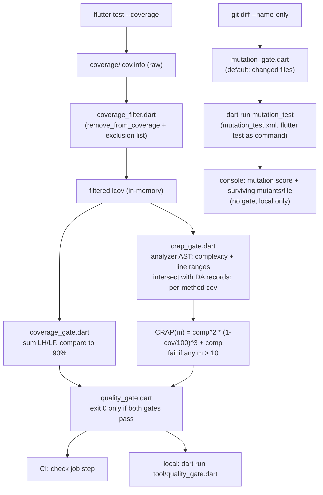

# chore(quality): 90% coverage floor, CRAP gate at 10, and local mutation testing

## Summary

Add three code-quality gates to `lunarlog`: a 90% total line-coverage floor
enforced in CI and locally, a per-method CRAP (Change Risk Anti-Patterns)
gate that fails any method scoring above 10, and a local (non-CI) mutation-
testing workflow. All three read from one `coverage/lcov.info` produced by
`flutter test --coverage`, filtered through one reviewed exclusion list, so
coverage and CRAP never disagree about what counts.

**Baseline, measured during planning** (Flutter 3.47.2, 476 tests, all
passing): raw total line coverage is **73.6%** (3898/5296 lines). After
excluding generated code and the reviewed platform-adapter files (see
KTD1/KTD4), filtered total coverage is already **91.8%** (3408/3713 lines) —
above the 90% floor. This changes the shape of the work: the floor itself is
already met by the exclusion review; the remaining risk is **per-method CRAP
scores** in the handful of files that still sit well below 90% individually
(`tables.dart` 16.9%, `startup_native.dart` 41.7%, `profile.dart` 55.6%, and
others — see U5), not a broad coverage-raising effort. Per R13, this baseline
must be posted to issue #33 before the gate is enabled (see Operational
Notes).

---

## Problem Frame

`lunarlog` has no automated floor on test coverage or method-level risk
today — `flutter test` runs but nothing fails the build if a change quietly
drops coverage or adds a large, poorly-tested method. The team wants three
independent, git-committed gates (no hosted service) that read the same
coverage data, run identically on the Windows lab desktop and a macOS
checkout, and don't block quick local iteration (`flutter test` alone must
stay green and fast).

---

## Requirements

- **R1** — `flutter test --coverage` output (`coverage/lcov.info`) drives a
  gate that fails when **total** line coverage is below 90%.
- **R2** — The gate runs in CI (the `check` job in `.github/workflows/ci.yml`)
  and locally through one documented script.
- **R3** — Generated code (`lib/data/db/db.g.dart`, other `*.g.dart`) and
  platform adapters that cannot run under `flutter test` are excluded from
  the coverage denominator via an explicit, reviewed exclusion list; no
  other exclusions.
- **R4** — A failing coverage run prints the measured percentage and the top
  uncovered files.
- **R5** — CRAP(m) = comp(m)^2 × (1 − cov(m)/100)^3 + comp(m) is computed
  per method from cyclomatic complexity and per-method coverage; any method
  scoring above 10 fails the build.
- **R6** — The CRAP tool (complexity + scoring) is a script committed to the
  repo and pinned (dependency-locked), not a hosted service.
- **R7** — CRAP uses the same exclusion list as R3, and reports every method
  over the threshold with its complexity and coverage.
- **R8** — A mutation-testing run is wired into the local verification flow
  only (no CI gate), with a documented command, changed-files-by-default
  scope, an on-demand full-run mode, and a runtime target of a few minutes
  for the default scope.
- **R9** — The mutation run reports mutation score and surviving mutants per
  file, so the score can be tracked over time even without a gate.
- **R10** — `AGENTS.md` and `README.md` document all three commands
  alongside `flutter analyze` / `flutter test`.
- **R11** — `flutter test` alone (no gates) still passes for quick local
  iteration; gates run only through the documented script(s).
- **R12** — The full local flow (coverage + CRAP + mutation) works on the
  Windows lab desktop (Flutter at `C:\src\flutter\bin`) and on a macOS
  checkout, using the same commands.
- **R13** — The measured baseline is recorded in issue #33 before the gate
  is enabled; if the codebase is below 90% today, this PR raises coverage
  rather than lowering the floor (satisfied here by the exclusion review —
  see Summary).

---

## Key Technical Decisions

**KTD1 — Exclusion mechanism: `remove_from_coverage`, not `// coverage:ignore-*` comments.**
`package:coverage` supports `// coverage:ignore-line` / `-start` / `-end` /
`-file` directives, but they are only honored by `dart run
coverage:format_coverage --check-ignore`, a step `flutter test --coverage`
does not expose (verified: `flutter test --coverage` alone produces
`coverage/lcov.info` directly and does not apply ignore comments). Using the
[`remove_from_coverage`](https://pub.dev/packages/remove_from_coverage) pub
package instead — a pinned dev_dependency that filters `coverage/lcov.info`
by regex after the fact — needs no change to how tests are run and keeps
`flutter test --coverage` as the single source of raw coverage data.

**KTD2 — Per-method coverage comes from line ranges + DA records, not FN/FNDA.**
The issue's design assumes `lcov.info`'s `FN`/`FNDA` records carry
per-function coverage. Empirically, `flutter test --coverage`'s lcov output
contains **zero** `FN`/`FNDA` records for this project (only `SF`/`DA`/`LF`/
`LH`) — Flutter's coverage formatter doesn't emit them. The CRAP tool instead
gets each method's line range from `package:analyzer`'s AST (the same pass
that computes complexity) and intersects it with the filtered `DA` lines to
get per-method coverage. This is a plan-time deviation from the issue's
literal design, not an open question — it's the only viable way to get
per-method coverage from what `flutter test --coverage` actually emits.

**KTD3 — Complexity via a small `package:analyzer` script, not DCM.**
`dart_code_metrics`/DCM's current cyclomatic-complexity rule ships under the
commercial "DCM" product with a license model that's a poor fit for R6
("committed to the repo and pinned, not a hosted service"). `package:analyzer`
is the same BSD-licensed library the Dart SDK and `dart analyze` use, has no
external service dependency, and gives full control over the McCabe count
(decision points: `if`/`else if`, `for`, `while`, `do-while`, `case`,
`catch`, `&&`, `||`, `??`, `?.`, `?:`, plus 1).

**KTD4 — Exclusions are whole-file, reviewed per file; mixed files are not split just to serve the list.**
`remove_from_coverage` only matches whole files by regex, so the exclusion
list operates at file granularity. Reviewed during planning:
- `lib/data/db/db.g.dart` + general `**/*.g.dart` — generated.
- `lib/data/auth/google_sign_in_client.dart` — 100% platform adapter
  (`PluginGoogleSignInClient`) plus a trivial immutable value type; matches
  the issue's own named example.
- `lib/data/auth/auth_gateway.dart` — 100% platform adapter
  (`GoTrueAuthGateway`, `AppLinksSource`); its two interfaces contribute no
  executable lines, so nothing testable is lost by excluding the file.
- `lib/data/db/key_store.dart` — mostly `SecureDbKeyStore`
  (`flutter_secure_storage` adapter). It also holds `isValidDbKeyHex` and
  `SecureDbKeyStore.generateKey()`, which **are** pure and testable — U5
  still writes direct unit tests for them even though the whole file sits in
  the excluded set; exclusion only removes the file from the *gate's*
  denominator, it doesn't stop the file from being tested.
- `lib/data/notifications/notification_scheduler.dart` — mostly
  `FlutterLocalNotificationsScheduler` (plugin adapter). `NoopReminderScheduler`
  is trivial and pure; same treatment as `key_store.dart` — tested directly,
  excluded from the gate.
- `lib/main.dart` is **not** added to the list: nothing imports it under
  test, so it never appears in `lcov.info` at all (confirmed empirically) —
  its `SentryHttpClient()` wiring is already outside the denominator with no
  explicit exclusion needed.
No other files are excluded. A file that is genuinely a 50/50 mix of adapter
and non-trivial testable logic (none found during planning) would be a
reason to split it in a follow-up, not to add it here.

**KTD5 — Gate scripts are pure Dart under `tool/`, run via `dart run`.**
Not shell or PowerShell — Dart runs identically via `dart run` on the
Windows desktop and a macOS checkout (R12), avoiding parallel `.sh`/`.ps1`
scripts that drift out of sync.

**KTD6 — Coverage and CRAP share one filtered-lcov pass.**
Both gates call the same `tool/quality/coverage_filter.dart` (built on
`remove_from_coverage`'s pattern list from KTD4) so a file excluded from the
coverage floor is excluded from CRAP too, per R7 — one exclusion list, read
in one place.

---

## High-Level Technical Design



---

## Output Structure

```text
tool/
  quality_gate.dart              # CLI entrypoint: run+filter+both gates, exit code
  quality/
    exclusions.dart              # single reviewed regex list (KTD4)
    coverage_filter.dart         # remove_from_coverage wrapper -> filtered per-file LF/LH/DA
    coverage_gate.dart           # % calc, top-uncovered report, 90% threshold
    crap_gate.dart               # analyzer complexity + per-method coverage + CRAP scoring/report
  mutation_gate.dart             # CLI entrypoint: changed-files (default) or --full scope
mutation_test.xml                # mutation_test package config (flutter test as the test command)
```

`tool/quality/*.dart` are libraries; `tool/quality_gate.dart` and
`tool/mutation_gate.dart` are the two commands the README documents (R2,
R10). Test files for the tool scripts live under `test/tool/` mirroring this
layout.

---

## Implementation Units

### U1. Shared exclusion list and filtered-coverage helper

**Goal:** One reviewed, regex-based exclusion list and one function that
turns raw `coverage/lcov.info` into a filtered, in-memory per-file
`{path, lines: {lineNo: hitCount}}` structure that both gates consume.

**Requirements:** R3, R7 (KTD1, KTD4, KTD6)

**Dependencies:** none

**Files:**
- `tool/quality/exclusions.dart` (new)
- `tool/quality/coverage_filter.dart` (new)
- `pubspec.yaml` (add `remove_from_coverage` dev_dependency, pinned)
- `test/tool/quality/coverage_filter_test.dart` (new)

**Approach:**
1. `exclusions.dart` exports a `const List<Pattern>` (or `List<RegExp>`) —
   the five entries from KTD4, each with a one-line comment naming why
   (generated / platform adapter, and for the two mixed files, that their
   pure helpers are still tested directly).
2. `coverage_filter.dart` shells out to `remove_from_coverage` (via
   `Process.run('dart', ['run', 'remove_from_coverage', '-f', lcovPath, for
   each pattern '-r', pattern])`) to produce a filtered lcov file, then
   parses that filtered file into the per-file structure (`SF`/`DA`/`LF`/
   `LH` records) for the two gates to consume without re-parsing.
3. Both the raw-lcov path and the filtered-output path are parameters, not
   hardcoded, so tests can point at fixture lcov files.

**Patterns to follow:** existing small pure-Dart data-transform modules
under `lib/data/sync/row_codec.dart` (parse-and-return-a-typed-structure
shape) as a style reference; no direct dependency.

**Test scenarios:**
- Given a fixture `lcov.info` with an `SF:` entry matching an exclusion
  pattern, the filtered structure omits that file entirely.
- Given a fixture with no matching entries, the filtered structure is
  unchanged from the raw parse.
- A file whose path only *partially* matches a pattern (e.g. a different
  file that happens to contain `key_store` as a substring elsewhere in the
  path) is excluded only if the pattern actually matches it — assert the
  patterns are anchored/specific enough not to over-match (test the five
  KTD4 patterns against a small table of real repo paths, including
  near-miss paths that must NOT match).
- Malformed/empty `lcov.info` (e.g. a file with `LF:0`) does not crash the
  parser and yields a well-defined result (that file contributes 0/0, or a
  file with `LF:0` under `flutter test --coverage`'s Dart 3 null-safety
  output shouldn't occur, but at minimum a run in the current codebase must
  parse cleanly end-to-end — assert on the real `coverage/lcov.info`
  produced by `flutter test --coverage` in this repo).

**Verification:** running the helper against this repo's real
`coverage/lcov.info` (after `flutter test --coverage`) yields a filtered
total matching the ~91.8% baseline measured during planning, within
rounding, until later units change actual test coverage.

---

### U2. Coverage-floor gate

**Goal:** Sum the filtered per-file `LH`/`LF`, compare to the 90% floor,
print the percentage and the top uncovered files, and return a pass/fail
result the CLI entrypoint (U4) can act on.

**Requirements:** R1, R4

**Dependencies:** U1

**Files:**
- `tool/quality/coverage_gate.dart` (new)
- `test/tool/quality/coverage_gate_test.dart` (new)

**Approach:**
1. Given the filtered per-file structure from U1, sum `LH`/`LF` across all
   files for the total percentage; per-file percentage for the "top
   uncovered files" report (sort ascending by percentage, cap at a fixed
   count, e.g. 10).
2. Print the total percentage and the report unconditionally (not just on
   failure), so a passing run in CI still shows the number (R4 requires this
   on failure at minimum; printing always is simpler and matches "make a
   failure actionable" without a separate success/failure code path).
3. Return a small result type (`{passed: bool, totalPercent: double,
   topUncovered: List<...>}`) — no `exit()` call here; U4 owns process exit
   codes so this stays testable as a pure function.

**Test scenarios:**
- Total coverage exactly at 90.0% passes (boundary, not "below").
- Total coverage at 89.99% fails.
- The top-uncovered report lists files ascending by percentage and caps at
  the fixed count when more files are below 100%.
- A filtered structure with zero total lines (degenerate/empty input) does
  not divide by zero and reports a defined, non-crashing result.

**Verification:** run against this repo's current filtered coverage; the
printed total matches U1's filtered baseline and the gate result is `passed:
true` once U5 closes any regression risk.

---

### U3. CRAP gate

**Goal:** For every method/function in every non-excluded `lib/` file,
compute cyclomatic complexity (via `package:analyzer`'s AST) and per-method
coverage (via the method's line range intersected with U1's filtered `DA`
records), score CRAP(m), and report every method scoring above 10.

**Requirements:** R5, R6, R7 (KTD2, KTD3)

**Dependencies:** U1

**Files:**
- `tool/quality/crap_gate.dart` (new)
- `pubspec.yaml` (add `analyzer` dev_dependency, pinned)
- `test/tool/quality/crap_gate_test.dart` (new)

**Approach:**
1. Use `package:analyzer`'s `resolveFile`/`AnalysisContextCollection` (or
   the lighter `parseFile` if resolution isn't needed for pure syntactic
   complexity — resolution is not required since complexity only needs the
   AST shape, not type information) to walk every `.dart` file under `lib/`
   not matched by U1's exclusion list.
2. For each `MethodDeclaration`/`FunctionDeclaration`/constructor body,
   compute McCabe complexity: 1 + count of `IfStatement` (each `else if`
   branch counts), `ForStatement`/`ForEachStatement`, `WhileStatement`/
   `DoStatement`, `SwitchCase`, `CatchClause`, `BinaryExpression` with `&&`/
   `||`, `ConditionalExpression` (`?:`), and null-aware operators (`??`,
   `?.`) that introduce a branch.
3. Record each method's start/end line; look up per-line hit data from U1's
   filtered `DA` records for that file within that range; `cov(m) =
   linesHit / linesInRange * 100` (a line only counts if it has a `DA`
   record at all — non-executable lines like signatures are absent from
   `DA` and excluded from the denominator, same convention as the coverage
   gate itself).
4. Score CRAP(m); collect every method with `CRAP(m) > 10`, sorted
   descending by score, each with file:line, method name, complexity, and
   coverage.
5. A method with zero executable lines (an abstract/interface signature) is
   skipped — it has no complexity to compute and no coverage to measure.

**Technical design (directional):**
```
for file in libFiles where not excluded(file):
  ast = parseFile(file)
  for method in ast.methodsAndFunctions:
    comp = 1 + countDecisionPoints(method.body)
    lines = method.lineRange
    hitLines = filteredDA[file].linesIn(lines).where(hitCount > 0)
    totalLines = filteredDA[file].linesIn(lines)
    cov = totalLines.isEmpty ? 100 : hitLines.length / totalLines.length * 100
    crap = comp*comp*(1 - cov/100)**3 + comp
    if crap > 10: offenders.add((file, method, comp, cov, crap))
```

**Patterns to follow:** none existing in-repo (first analyzer-based tool);
follow `package:analyzer`'s own documented `AnalysisContextCollection`
usage pattern from its README/example.

**Test scenarios:**
- A trivial one-line method (complexity 1) at 0% coverage scores CRAP ≤ 10
  (never a false positive on trivial code).
- A method with complexity 3 and 0% coverage scores CRAP = 12 and is
  reported as an offender.
- The same complexity-3 method at 100% coverage scores CRAP = 3 and is not
  reported.
- A method entirely inside a `DA`-record-free range (e.g., an abstract
  method) is skipped, not scored as 0% coverage.
- Two methods in the same file with different line ranges get independent,
  correctly-attributed coverage numbers (guards against an off-by-range bug
  that would blend adjacent methods' coverage).
- Running against this repo's current `lib/` (post-U1 exclusions) produces
  a finite, printable report — this is also the discovery step that feeds
  U5's scope; record its actual output when this unit lands.

**Verification:** the tool runs end-to-end against this repo without
crashing, printing zero or more offenders; each reported offender's
complexity is independently spot-checked by hand against the source for at
least two methods (sanity check for the McCabe count, not full test
coverage of every operator kind — those are covered by the unit test
fixtures above).

---

### U4. `quality_gate.dart` entrypoint and CI wiring

**Goal:** One command that runs `flutter test --coverage`, filters, runs
both gates, prints both reports, and exits non-zero if either fails; wired
into the CI `check` job right after the existing `flutter test` step.

**Requirements:** R1, R2, R11

**Dependencies:** U1, U2, U3

**Files:**
- `tool/quality_gate.dart` (new)
- `.github/workflows/ci.yml` (modify: add a step to the `check` job)

**Approach:**
1. `tool/quality_gate.dart`'s `main()`: run `flutter test --coverage` as a
   subprocess (propagate its exit code immediately if it fails — a gate run
   never masks a genuine test failure), then U1's filter, then U2 and U3,
   print both reports, `exit(0)` only if both passed, else `exit(1)`.
2. CI step: `- name: Quality gates (coverage + CRAP)` running `dart run
   tool/quality_gate.dart`, placed after the existing `Test` step (which
   keeps running plain `flutter test` — R11 — since CI still wants a fast
   signal from the plain test step before spending time on gates; the new
   step re-runs with `--coverage`, which is the accepted cost of R1/R2
   requiring the coverage artifact CI didn't otherwise produce).
3. No change to the `db-tests`, `android`, or `ios` jobs — gates apply to
   the Dart/Flutter unit and widget suite only, matching R1's scope
   (`flutter test --coverage`).

**Test scenarios:**
- `Test expectation: none -- this unit is process orchestration and CI YAML;
  its correctness is covered by U2/U3's gate-logic tests and verified by an
  actual CI run on the PR (R1/R2's acceptance is "fails CI with a readable
  message naming the offender" — proven by observing the real CI run, not a
  unit test of YAML).`

**Verification:** push the branch and confirm the `check` job's new step
appears, runs, and (once U5 closes any real offenders) passes; manually
verify the failure path once by temporarily lowering the threshold constant
in a scratch run (not committed) and confirming the printed message names
the offending file/method.

---

### U5. Close CRAP-risk gaps surfaced by U3

**Goal:** Using U3's actual offender report (not the pre-tooling guesses
from planning) as the worklist, add targeted unit tests so no method scores
CRAP > 10, and confirm the filtered coverage total stays at or above 90%
(already true at baseline — this unit is about not regressing it while
adding tests, plus closing any CRAP offenders that turn out to need more
than a coverage bump, i.e. an actual complexity reduction).

**Requirements:** R1, R5, R13

**Dependencies:** U3, U4

**Files:** exact set determined by U3's report; planning-time candidates
most likely to appear (lowest per-file coverage in the filtered baseline,
all real domain/data logic with branching — not adapters):
- `lib/data/db/tables.dart` (16.9%) — likely a schema-exercise gap rather
  than a CRAP risk (Drift table column getters are complexity-1 accessors);
  confirm via U3's report before writing tests here.
- `lib/startup/startup_native.dart` (41.7%) — `deleteDatabaseFiles`/
  `kDatabaseSiblingSuffixes` are explicitly documented in the file as
  "testable without the platform's documents directory"; add the test its
  own doc comment calls for. `localDatabaseFile()`/`buildDbFactory()` stay
  untested (real `path_provider` platform call) — candidates for a future
  exclusion-list addition if U3 flags them, not this unit (KTD4's "no other
  exclusions" — revisit only with evidence, not preemptively).
- `lib/domain/models/profile.dart` (55.6%), `lib/domain/models/day_entry.dart`
  (59.0%), `lib/domain/tags.dart` (60.0%) — domain value types with
  validation/derivation logic.
- `lib/data/sync/sync_transport.dart` (68.4%), `lib/domain/sync/sync_engine.dart`
  (69.6%), `lib/domain/auth/auth_service.dart` (69.8%), `lib/data/auth/auth_link_classifier.dart`
  (72.2%) — the branchiest files in the filtered set, so the most likely
  source of real CRAP offenders.
- `lib/data/db/key_store.dart`'s `isValidDbKeyHex` and
  `SecureDbKeyStore.generateKey()` (excluded from the gate per KTD4, but
  still get direct tests per that decision).
- `lib/data/notifications/notification_scheduler.dart`'s
  `NoopReminderScheduler` (same treatment).

**Approach:**
1. Run `dart run tool/quality_gate.dart` once U4 lands; take its CRAP
   offender list as the authoritative worklist instead of the candidate
   list above.
2. For each offender, prefer adding test coverage for the missing branches
   (cov(m) has a cubic effect on CRAP — even partial coverage often drops a
   method below 10). Only refactor to reduce complexity if a method's
   complexity alone is high enough that no realistic coverage improvement
   would bring it under 10 (comp ≥ 4 at 100% coverage already scores 4,
   comfortably under 10, so this should be rare — a method would need
   complexity ≥ 10 to fail even at full coverage).
3. Re-run `tool/quality_gate.dart` after each batch of tests until both
   gates pass.

**Patterns to follow:** existing `test/domain/`, `test/data/` test files for
the corresponding `lib/` modules (e.g. `test/domain/sync/` for
`sync_engine.dart`) — match their fake/mock style rather than introducing a
new testing approach.

**Test scenarios:**
- For each file in the actual offender worklist: the specific
  under-covered branch identified by U3's report (exact branches are
  execution-time discoveries — U3's report names file:line:method, and the
  missing coverage within that method's range is derived from the filtered
  `DA` records at that point, not guessable now).
- `isValidDbKeyHex`: accepts a well-formed 64-char lowercase hex string;
  rejects wrong length, uppercase hex, and non-hex characters.
- `SecureDbKeyStore.generateKey()`: returns a 64-char string matching
  `isValidDbKeyHex`; two calls return different values (randomness sanity,
  not a cryptographic proof).
- `deleteDatabaseFiles`: given a temp `File` plus matching `-wal`/`-shm`/
  `-journal` siblings (some present, some absent), all present siblings are
  deleted and missing ones are skipped without error.
- `NoopReminderScheduler`: `initialize` resolves to
  `NotificationAvailability.available`; `rescheduleAll`/`cancelAll` complete
  without throwing regardless of input.

**Verification:** `dart run tool/quality_gate.dart` exits 0 (both gates
pass) and `flutter test` (no `--coverage`) still passes on its own,
confirming R11.

---

### U6. Mutation testing (local only)

**Goal:** Wire `mutation_test` into the local flow with a documented
command, changed-files-by-default scope, an on-demand full-run mode, and a
console report (mutation score + surviving mutants per file). No CI gate.

**Requirements:** R8, R9, R10, R12

**Dependencies:** U1 (reuses the exclusion list so excluded files aren't
mutated)

**Files:**
- `mutation_test.xml` (new, repo root — `mutation_test` package convention)
- `tool/mutation_gate.dart` (new)
- `pubspec.yaml` (add `mutation_test` dev_dependency, pinned)
- `README.md`, `AGENTS.md` (document the command — also covers R10 for U4's
  coverage/CRAP commands)

**Approach:**
1. `mutation_test.xml`: `<files>` scoped to `lib/*.dart` (recursively, minus
   the KTD4 exclusion patterns translated to the XML `<exclude>` block);
   `<commands><command expected-return="0" timeout="…">flutter test
   {test-file}</command></commands>` — `mutation_test` substitutes the
   relevant test target; confirm at implementation time whether the package
   needs the whole-suite `flutter test` or supports a per-file target
   (affects the timeout budget, not the design).
2. `tool/mutation_gate.dart`: default mode computes changed files via `git
   diff --name-only <merge-base-with-main-or-HEAD~1>` (cross-platform via
   `Process.run('git', [...])`, no shell-specific syntax — same reasoning as
   KTD5), filters to `lib/**/*.dart` minus exclusions, and passes that file
   list to `dart run mutation_test` positionally. A `--full` flag skips the
   git-diff step and runs the whole configured `lib/*.dart` scope instead.
3. Print `mutation_test`'s own summary (score + surviving mutants per file)
   to the console as-is — no separate report format to build; R9 is
   satisfied by not suppressing its output.
4. Validate the default (changed-files) scope's runtime empirically once
   wired — R8's "a few minutes" target — and note the measured time in the
   PR description; if a single file's `flutter test` invocation inside
   `mutation_test` is the bottleneck, that's a config tuning question for
   implementation, not a design change here.

**Test expectation:** none — this unit wires an external CLI tool and a git
subprocess call; there is no in-repo logic to unit-test beyond U1's already-
tested exclusion list. Verification is a real local run, not a test suite.

**Verification:** on this Windows desktop, `dart run tool/mutation_gate.dart`
with at least one changed `lib/` file completes and prints a mutation score
and per-file surviving-mutant list; `dart run tool/mutation_gate.dart --full`
completes (may take longer — no time budget on the full-run mode per R8).
Cross-platform (macOS) verification happens on the macOS build machine per
R12 and is recorded in the PR description rather than re-derived here.

---

## Scope Boundaries

**In scope:** the three gates as specified, their shared exclusion list,
CI wiring for coverage+CRAP only, local wiring for mutation testing, and
enough test-writing to close whatever CRAP offenders U3 actually finds
(U5), plus documentation.

**Out of scope / non-goals:**
- A CI gate on mutation score (R8 explicitly excludes this "for now").
- Splitting mixed adapter/pure-logic files (KTD4) — none were found to need
  it during planning; only U3's actual findings could justify it, and that
  would be a follow-up, not this PR.
- Raising per-file coverage to 90% for every file — the gate is on the
  **total**, matching R1's literal wording; individual low-coverage files
  are addressed only where U3 finds a real CRAP risk (U5).

### Deferred to Follow-Up Work

- Re-evaluating `dart_code_metrics`/DCM if its licensing changes, as a
  potential replacement for the in-repo `package:analyzer` complexity walk
  (KTD3) — not needed now, noted for future reference.
- Extending the exclusion review to `localDatabaseFile()`/`buildDbFactory()`
  in `startup_native.dart` if U3's report shows them as recurring CRAP risk
  — deferred per KTD4's "no other exclusions without evidence."

---

## Risks & Dependencies

- **New dev dependencies** (`remove_from_coverage`, `analyzer`,
  `mutation_test`) each need a pinned version in `pubspec.yaml`/
  `pubspec.lock`, consistent with how `drift_dev`/`build_runner` are already
  pinned in this repo.
- **`mutation_test`'s actual runtime** on this Windows desktop is unproven
  until U6 lands; if the default changed-files scope is too slow even for
  the smallest realistic diff, the fallback is tightening the file-list
  computation (e.g., excluding test files, which the current design already
  does) rather than changing the tool.
- **CI job budget:** the `check` job's 20-minute timeout has comfortable
  headroom — a full `flutter test --coverage` run took roughly 2 minutes
  during planning-time baseline measurement, plus gate computation (parsing
  ~90 files with `package:analyzer`), which is a low-second-count addition.

---

## Operational / Rollout Notes

- Before this PR's CI wiring (U4) takes effect on `main`, post the measured
  baseline — raw 73.6% (3898/5296), filtered 91.8% (3408/3713), plus the
  five-entry exclusion list from KTD4 — as a comment on issue #33, per R13.
- The PR description should record the actual `mutation_test` runtime
  measured on this Windows desktop (U6) and confirm (or schedule) the
  macOS-checkout verification pass, per R12.

---

## Verification Contract

- `flutter test` (no coverage) passes on its own — R11.
- `dart run tool/quality_gate.dart` exits 0 locally after U5 — R1, R5.
- The CI `check` job's new step passes on the PR — R2.
- `dart run tool/mutation_gate.dart` completes locally with a printed score
  and surviving-mutant list — R8, R9.
- `AGENTS.md` and `README.md` both document all three commands — R10.
- Baseline comment posted to issue #33 before the gate is relied upon in CI
  — R13.

## Definition of Done

- [ ] U1–U6 implemented and committed.
- [ ] `dart run tool/quality_gate.dart` passes locally (both gates).
- [ ] CI `check` job's new step is green on the PR.
- [ ] `dart run tool/mutation_gate.dart` verified on Windows; macOS
      verification recorded in the PR description.
- [ ] `AGENTS.md` and `README.md` updated.
- [ ] Baseline comment posted to issue #33.
