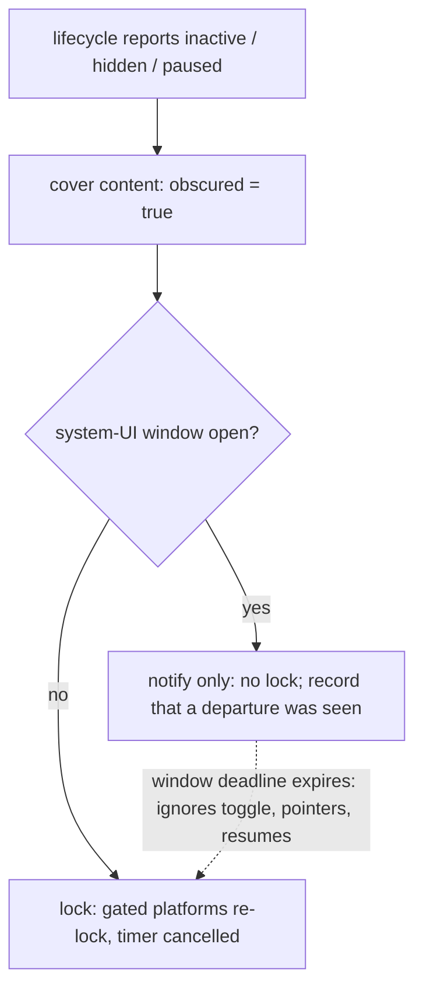
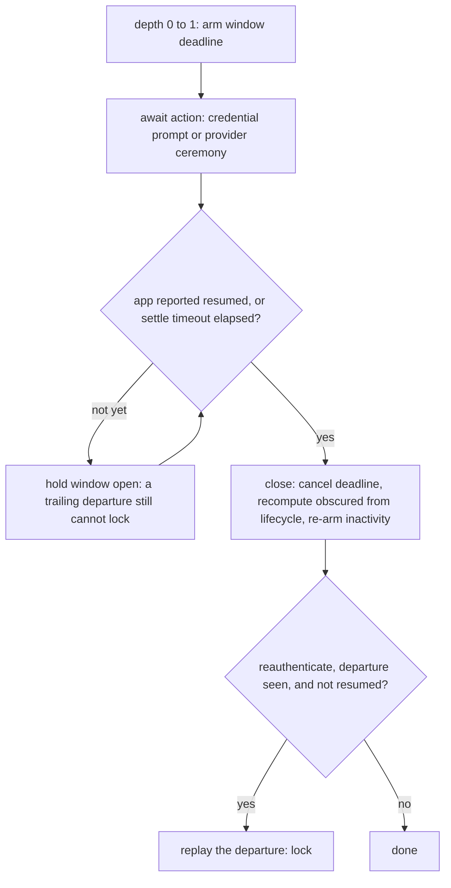

# The Gate Discards a Granted Credential - Plan

## Goal Capsule

- **Objective:** Make a device credential the system accepted actually open the app (issue #65), and stop the Google and Apple sign-in ceremonies from re-locking the app mid-flow. The posture does move, deliberately and in one bounded place: while the app's own system UI is on screen, a lifecycle departure no longer locks. Everywhere else it is unchanged, content stays covered throughout, and the window's deadline bounds the exception.
- **Authority:** Issue #65 for the defect; this plan's Product Contract for behavior and its Key Technical Decisions for mechanism; `AGENTS.md` for conventions and the worktree rule. Where this plan contradicts the re-lock behavior recorded in `docs/plans/2026-09-03-001-feat-social-logins-plan.md` (its KTD5 and its "System pickers trip the gate's re-lock" risk) and in `docs/ops/supabase-go-live.md`, this plan wins and those documents are corrected as part of the work.
- **Execution profile:** Standard plan, high risk (the credential gate is the only thing standing between a found phone and minors' health data). Work in the `.worktrees/fix-gate-system-ui-relock` worktree on branch `fix/gate-system-ui-relock`. Code doc comments cite this plan's IDs with a `#65` prefix, for example `(#65 U1; KTD1)`, so they never collide with the `#1` and `#2` plan IDs already cited across `lib/`.
- **Stop conditions:** Stop and surface a blocker if any change would make a *declined* credential open the app, if the existing `backgrounding re-locks (R7)` test group in `test/ui/gate_test.dart` cannot stay green unmodified, if any existing assertion beyond the single KTD8 `re-authentication for linking` case has to change (KTD7, KTD8), or if removing the departure latch turns out to be load-bearing for a behavior this plan has not accounted for.
- **Tail ownership:** The invoking pipeline owns commit, review, and PR. On-device confirmation on an iPhone (and an Android device for the passcode-fallback case) is human follow-up recorded in the Verification Contract.

---

## Product Contract

### Summary

Fix the gate so a credential the system accepted opens the app, and close the coverage gap that let it ship. Replace the "a lifecycle change during the prompt means the operator left" heuristic — which cannot be implemented correctly on either platform — with an explicit window the app opens around system UI it launched itself. The fail-closed posture outside that window does not change.

### Problem Frame

`GateController.unlock()` treats any lifecycle departure observed while the credential prompt is up as evidence the operator left the app, and discards the credential's result on that basis. On iOS the Face ID prompt reports `inactive` *itself*, so the latch is always set and `granted && !_lifecycleDuringAuth` is never true. The app stays locked, retrying does the same thing, and the operator has no way in.

The reporter's screenshot narrows it: the lock screen shows the **"Unlock" label rather than the spinner** (`authenticating` is false, so the call finished) and **no "Not unlocked" message** (`lastAttemptDenied` is false, so nothing was declined). Two branches reach that state, and this plan fixes both rather than betting on one:

- **The discarded grant.** The credential was accepted and the `_lifecycleDuringAuth` arm of `unlock()` threw the result away. This is the primary candidate and the one the narrative fits.
- **The trailing departure.** `lock()` re-locks without touching `_denied`, so a lifecycle event arriving *after* `requestAccess()` returns produces an identical screen — and so does an ordinary idle re-lock the operator has not yet tapped through. The screenshot cannot tell these apart from the first.

Both are live because platform ordering around the prompt is not guaranteed (see Sources). Fixing only the latch would leave a fix that can land while the defect survives on-device, which is why KTD2's window is held open past the credential result rather than closed the moment it arrives.

Google sign-in is the trigger, not the cause. The iOS picker's own focus loss re-locks the app, which is what puts the operator in front of the Unlock button in the first place; the broken unlock is then a dead end. The same latch also silently cancels "Add Google" / "Add Apple", because `reauthenticate()` returns false whenever its own prompt reports `inactive`.

This was not an unknown. `docs/residual-review-findings/feat-social-logins.md` records "the credential prompt's own `inactive` report versus `reauthenticate()` is settled only by the go-live device check" as an unresolved soft-bucket item, and `docs/ops/supabase-go-live.md` already documents the picker-driven re-lock as *expected* behavior. The device check has now happened, in the field, and it says the behavior is wrong.

The deeper problem is that the latch cannot be repaired by choosing better lifecycle states. Research into current platform behavior (see Sources) found no signal that reliably separates "our own system UI is up" from "the operator left": on iOS a native modal presentation spuriously reports `hidden` while the app is fully foreground (flutter/flutter#146734, open), Android's device-credential fallback — which this app enables with `biometricOnly: false` — genuinely backgrounds the activity through `KeyguardManager`, and `didBecomeActive` is not always delivered after a Face ID prompt (Apple Developer Forums 788367). A fix keyed on `hidden`/`paused` instead of `inactive` reproduces this bug one state to the right, on both platforms.

### Actors

- A1. **Operator** — the adult who owns the device and holds the credential.
- A2. **Device authenticator** — Face ID / Touch ID / Android biometrics, with the device passcode as fallback.
- A3. **Provider system UI** — the Google picker (Credential Manager on Android, an `ASWebAuthenticationSession` on iOS) and the Apple sheet.

### Requirements

**The credential decides**

- R1. A credential the device authenticator accepts unlocks the app, whatever lifecycle transitions were reported while the prompt was up.
- R2. A declined, cancelled, or unavailable credential leaves the app locked and shows the existing "Not unlocked" message. Nothing in this plan may make a declined credential open the app.
- R3. `reauthenticate()` returns the credential's own result, so adding a sign-in method is no longer silently cancelled by the prompt's own lifecycle report.

**System UI the app launched itself**

- R4. Starting Google or Apple sign-in — from the sign-in screen or from the add-a-method actions — does not re-lock the app. The operator returns to where they were, signed in, with no lock screen in between.
- R5. Content stays covered whenever the app is not resumed, including for the whole duration of every system-UI window, and the cover is never left stranded once one closes. The window suppresses the *lock*, never the cover.
- R6. Every system-UI window carries its own deadline, armed when the window opens. When it expires the app locks, whatever the operator did in the meantime and whatever the inactivity toggle is set to, so an abandoned picker on an unattended device cannot hold the app open.

**Posture that must not move**

- R7. Outside a system-UI window the re-lock policy is unchanged: `inactive`, `hidden`, and `paused` each still re-lock on gated platforms. The existing `backgrounding re-locks (R7)` group in `test/ui/gate_test.dart` and its integration-test counterpart stay green **without modification** — that is the evidence the posture did not move.
- R8. The user-facing statements of the policy are corrected to name their one exception. The Settings subtitle ("Backgrounding always relocks") and `PRIVACY.md`'s "immediate locking upon backgrounding" are both falsified by R4 — on Android the passcode fallback genuinely backgrounds the app — so each gains a qualifier: backgrounding re-locks immediately except while a sign-in or credential prompt the app itself opened is on screen, where content stays covered and the window's deadline applies instead.

**Coverage and record**

- R9. A regression test drives a real lifecycle transition through the fake authenticator while the prompt is in flight — the exact shape the existing suite never exercised for `unlock()`.
- R10. Every document that recorded the defect as expected behavior is corrected: the go-live device checklist, the social-logins plan's risk entry **and its KTD5** (which specifies the deleted `_lifecycleDuringAuth` mechanism as the design), the residual-findings soft-bucket line, and the stale re-auth doc comment in `lib/ui/account/account_section.dart`. The checklist also names the one departure this plan does not fix — the first-run notification-permission prompt — so a fresh-install checker does not read it as a regression.

### Key Flows

- F1. **Unlock after a re-lock**
  - **Trigger:** The operator taps Unlock on the lock screen.
  - **Actors:** A1, A2
  - **Steps:** The gate opens a system-UI window and presents the credential. The prompt's own focus loss covers the content but does not lock or unlock anything. The authenticator accepts; the window closes; the app unlocks and the inactivity countdown restarts. A decline leaves it locked with the denial message.
  - **Covered by:** R1, R2, R5

- F2. **Sign in with Google (or Apple)**
  - **Trigger:** The operator taps the provider button on the sign-in screen.
  - **Actors:** A1, A3
  - **Steps:** The screen opens a system-UI window around the provider call. The picker's focus loss covers the content; no lock screen appears. The session arrives, the window closes, the sign-in screen completes exactly once, and the operator is back where they were.
  - **Covered by:** R4, R5

- F3. **Add a sign-in method**
  - **Trigger:** The operator taps "Add Google" or "Add Apple" in the account section.
  - **Actors:** A1, A2, A3
  - **Steps:** One window spans both ceremonies — the credential check and then the provider picker. The credential's own result decides whether the link proceeds; neither ceremony re-locks the app; the methods line refreshes.
  - **Covered by:** R3, R4, R5

- F4. **Abandoned ceremony on an unattended device**
  - **Trigger:** A window is open and the operator walks away, or a provider future never settles.
  - **Actors:** A1
  - **Steps:** The window's own deadline, armed when it opened, expires and locks the app behind the system UI. Nothing the operator or the platform does in between extends it — not a pointer event, not a background-and-return, not the inactivity toggle being off. When the ceremony finally settles, its outcome lands behind the lock screen and the next unlock works.
  - **Covered by:** R6

### Acceptance Examples

- AE1. **Covers R1.** Given the app is locked and the operator taps Unlock, when the prompt reports `inactive` while it is up and the authenticator then accepts, then the app unlocks, the lock screen is gone, and no denial message was shown.
- AE2. **Covers R1.** Given the same tap, when the prompt reports `hidden` and then `paused` while it is up and the authenticator still accepts, then the app unlocks — the credential, not the lifecycle history, decides.
- AE3. **Covers R2.** Given the operator taps Unlock and the authenticator declines, then the app stays locked, the "Not unlocked" message appears, and the database is never opened.
- AE4. **Covers R3.** Given a signed-in operator taps "Add Google", when the credential prompt reports `inactive` and is then accepted, then the link call happens; when it is declined, then no link call happens and the account is unchanged.
- AE5. **Covers R4, R5.** Given an unlocked app on a gated platform, when a provider sign-in is in flight and the lifecycle reports `inactive`, then the content is covered and the app is **not** locked; when the ceremony settles and the app resumes, then the cover is gone, the app is still unlocked, and the sign-in screen completed once.
- AE6. **Covers R6.** Given a provider ceremony in flight, when the window's deadline expires, then the app locks — and it still locks when the relock toggle is off, when pointer events arrived during the ceremony, and when the app backgrounded and resumed while the window was open.
- AE8. **Covers R5.** Given a credential granted while the app's last reported state is `paused`, then the app unlocks but content stays covered until `resumed` arrives; and given a window that closes while the app is resumed, then the cover is lifted rather than stranded.
- AE9. **Covers R1.** Given a granted credential, when a lifecycle departure is delivered *after* the credential result, then the app stays unlocked — the trailing transition does not re-lock it.
- AE7. **Covers R7.** Given an unlocked app with no system-UI window open, when the lifecycle reports `inactive`, `hidden`, or `paused`, then the app locks and the content is covered — unchanged from today, asserted by the existing tests.

### Scope Boundaries

- The re-lock policy outside a system-UI window is not revisited. `inactive` keeps re-locking; narrowing it was considered and rejected in scoping because iPad Slide Over and an iOS app-switcher peek can report `inactive` with no `paused` to follow, so narrowing would under-lock.
- No change to what the gate protects, when the database opens, the sync engine's pause/resume contract, or the one-account-per-device binding.
- No new dependency, no platform-channel work, and no change to `local_auth` options (`biometricOnly: false`, `stickyAuth: true` stay as they are).
- No change to the lock screen's copy or layout.

#### Deferred to Follow-Up Work

- **The lock icon renders in the wrong palette.** `LockScreen` reads `Theme.of(context)` outside the `MaterialApp` it then builds, so the padlock picks up the ambient default (purple) while the button below it uses the app's teal. Visible in the issue's screenshot, cosmetic, and unrelated to the defect. File separately.
- **The notification-permission prompt is a fourth system-UI departure.** `LunarLogApp.initState` starts the reminder scheduler with `requestAlertPermission: true`, so iOS raises its permission alert immediately after the first unlock on a fresh install — the same class of spurious re-lock this plan fixes for provider ceremonies. Out of scope here because it needs its own decision about when to ask for notification permission at all; the window built in U1 is what a follow-up would reuse.

### Dependencies

None. No dashboard configuration, no migration, no new package.

---

## Planning Contract

### Assumptions

- AS1. The discarded grant is the *primary* cause of issue #65, not the proven-sole cause. The screenshot's accepted-but-not-denied state is also reachable by a departure delivered after the credential result, and by an ordinary idle re-lock. The plan closes both rather than resolving which fired, because the on-device instrumentation that would separate them costs more than covering both; the device check is still what confirms the symptom is gone.
- AS2. Suppressing the lock for the whole duration of a system-UI window — rather than trying to detect a genuine departure inside it — is an acceptable exchange. The content stays covered throughout, the credential prompt is short, KTD4's replay still catches a walked-away re-auth, and R6's window deadline bounds every remaining case unconditionally. The alternative requires a reliable per-event departure signal, and the research found none.
- AS3. iOS is already UIScene-migrated with a real `FlutterSceneDelegate` (`ios/Runner/SceneDelegate.swift`), so the deep-link forwarding caveat that applies to hand-migrated projects on Flutter 3.41+ does not apply here. Verified in the repo, not assumed.
- AS4. Reading the gate from `SignInScreen` is safe: the `ChangeNotifierProvider<GateController>` sits above `LunarLogApp`, so it is in scope at every production call site, and reading it nullably keeps the harnesses that mount the screen without a gate working unchanged.

### Key Technical Decisions

- KTD1. **Delete the departure latch; the credential's result is authoritative for `unlock()`.** `_lifecycleDuringAuth` and the `else` arm that re-locks on it come out. A granted credential unlocks; a declined one stays locked and sets the denial flag. The rationale is threefold. It never protected anything: the operator presented exactly the credential the gate exists to demand, and no threat model makes that credential unsafe because the app briefly lost focus while it was being presented. It cannot be implemented correctly: no lifecycle signal separates the prompt's own focus loss from a real departure on either platform (KTD2's evidence). And it is what shipped this defect. Governs R1, R2.

- KTD2. **Suppression is a re-entrant window the app opens around system UI it launched itself, not a lifecycle discrimination.** `GateController` gains a depth counter and a `Future<T> duringSystemUi<T>(Future<T> Function() action)` scope. While the depth is above zero, `_departed()` still sets the cover and notifies but does **not** call `lock()`. A counter rather than a flag, because the add-a-method flow legitimately nests a credential prompt inside a provider ceremony. This is deliberately *not* "ignore `inactive`, act on `hidden`/`paused`": on iOS a native modal presentation spuriously reports `hidden` while the app is fully foreground (flutter/flutter#146734, open, reproduced on 3.19 and 3.22), and Android's device-credential fallback launches a separate activity through `KeyguardManager` and genuinely reports `paused` — so a state-keyed fix breaks on both platforms, not one. Governs R4, R5.

- KTD2a. **The window closes on the app's return, not on the action's result.** Decrementing the depth in a plain `finally` would reopen the trailing-departure branch named in the Problem Frame: a lifecycle event delivered moments after the credential result would re-lock, and the fix would appear to land while issue #65 survived on-device. So the outermost window closes when the app next reports `resumed`, or when a short settle timeout expires, whichever comes first — never merely because the awaited future completed. The settle timeout exists because iOS does not always deliver `didBecomeActive` after an `LAContext` prompt (Apple Developer Forums 788367), so waiting for `resumed` alone could hang the window open; the R6 deadline bounds it regardless. Closing the window reconciles the cover (KTD9) and re-arms the inactivity countdown. Governs R1, R4.

- KTD3. **`_authenticating` keeps its own job and is not merged into the window.** It still means "a credential prompt is up", which is what drives the lock screen's spinner, disables the Unlock button, and prevents a second prompt over the first. The new counter means "system UI we launched is up", which is what suppresses the lock. Merging them would let a provider ceremony disable the Unlock button and would make `unlock()`'s re-entrancy guard reject a legitimate tap. Governs R1, R3.

- KTD4. **`reauthenticate()` returns the credential result, and keeps a narrowed replay keyed on state at completion.** It opens a window like every other prompt and still never changes `_locked` itself, so the credential's result is what the caller gets — the false-positive cancellation of "Add Google" is gone. But unlike `unlock()`, KTD1's rationale does not transfer here: a re-auth is not what opens the app, so no grant is being discarded, and once KTD1 lands a spurious re-lock costs one Unlock tap that now works rather than a dead end. So the replay survives in narrowed form: when the window closes, if a departure was observed while it was open **and** the app is not currently `resumed`, `_departed()` fires. This is a level check at one known moment, not the per-event discrimination KTD2 rejects — it asks "is the operator still gone?", which no ordering guarantee is needed to answer, rather than "was that event a real departure?", which no signal can answer. One of the two cases named in KTD8 therefore survives unchanged. Governs R3.

- KTD5. **The window arms its own deadline, independent of the inactivity timer and of the relock toggle.** Reusing the inactivity countdown was the first design and it does not work: `didChangeAppLifecycleState`'s `resumed` branch calls `_armInactivity()`, which *cancels and restarts* the countdown, so every background-and-return resets it and the timer measures foreground idle time rather than window age; pointer events reaching `GateShell`'s `Listener` do the same; and `_armInactivity()` refuses outright when `relockEnabled` is off, which would leave those operators with **no** bound at all — a posture they have today, pinned by the existing `background re-lock is not disabled by the inactivity toggle` case. So `duringSystemUi` arms a separate timer when the depth goes 0→1, cancelled when it returns to zero, that calls `lock()` when it fires and closes the window. It ignores pointer activity, resumes, nesting, and the toggle; the toggle governs foreground inactivity, which is a different question. It reuses the two-minute value so the operator sees one number, and it is the whole bound on AS2's exchange. Governs R6.

- KTD9. **The cover is reconciled against the lifecycle, never set or cleared blind.** Today only `resumed` and `unlock()`'s granted arm clear `_obscured`, and the deleted latch is what used to re-set it when a grant landed off-foreground. Left as-is, the window design breaks R5 in both directions: `unlock()` would uncover content while the app is still backgrounded (the Android `KeyguardManager` path), and a `reauthenticate()` or provider window closing would leave the cover stranded with no lock screen and no button behind it — a new dead end, on a path where iOS may never deliver the `resumed` that would clear it. So both the window's close and `unlock()`'s granted arm recompute `_obscured` from the binding's current lifecycle state rather than assigning a constant. Governs R5.

- KTD6. **The window is opened by the UI layer, and the gate is read nullably.** `SignInScreen` and `AccountSection` wrap their provider calls, because the service layer must not know about the gate and `AuthController` has no access to it. `SignInScreen` gains a `context.read<GateController?>()` in the same shape `AccountSection` already uses, so the harnesses that mount it without a gate provider keep passing with no edit. In `AccountSection._addMethod` a single window spans the credential check and the provider call, which the depth counter makes safe. Governs R4.

- KTD7. **The posture outside the window is untouched, and the existing tests are the proof.** The `didChangeAppLifecycleState` switch keeps sending `inactive`, `hidden`, and `paused` to `_departed()`. `test/ui/gate_test.dart`'s `backgrounding re-locks (R7)` group and its integration-test counterpart must pass **unmodified**; needing to edit them is a signal the change went further than intended and is a stop condition. Governs R7, R8.

- KTD8. **Exactly one existing test encodes the defective contract and is rewritten, not deleted.** The `re-authentication for linking` group in `test/ui/gate_test.dart` contains one case asserting that an interrupted prompt returns **false** — that is KTD4's behavior in reverse and cannot survive it; it is rewritten to assert that a granted prompt returns true and never changes `locked`, whatever the lifecycle reported. Its sibling, "an interrupted prompt on a gated platform replays the departure: covered and re-locked", **survives unchanged** under KTD4's narrowed replay, which is a deliberate check on the design: a change that also broke that case would be suppressing more than intended. The rewrite is called out by name in the PR description, because silently flipping a security assertion is exactly the change a reviewer must see. If the implementation needs any second existing assertion to change, that is a stop condition under KTD7.

### High-Level Technical Design

Departure handling, before and after. The branch that used to record a latch now suppresses the lock, and the window's own deadline is what bounds it.



Window lifetime — it outlives the awaited action, and closing it reconciles the cover.



The unlock path, with the discarded-grant branch removed.

```mermaid
sequenceDiagram
  participant UI as LockScreen
  participant G as GateController
  participant A as Device authenticator
  UI->>G: unlock()
  G->>G: authenticating = true; open window
  G->>A: requestAccess()
  A-->>G: (prompt reports inactive) → cover only, no lock
  A-->>G: granted / declined
  G->>G: close window; re-arm inactivity
  G-->>UI: granted → unlocked; declined → locked + denial message
```

### Sequencing

U3's red run comes **first** — author the issue-#65 cases against the unmodified `lib/`, watch them fail, keep the output — because that evidence is unobtainable afterwards. Then U1 (the gate itself) → U2 (provider ceremonies open the window) → U3's remaining cases and its green run → U4 (documentation, which depends on the behavior being settled).

---

## Open Questions

- **Should the window deadline be shorter than the inactivity timeout?** It currently reuses the two-minute value so the operator sees one number in Settings, but the two situations differ: during a window the operator is by definition not looking at the app. A ceremony-specific 30-60s bound is defensible. Resolve after the device check shows how long a real Google ceremony takes; changing the constant later is a one-line edit with no structural consequence.
- **Should turning off "Relock after inactivity" be visible as *not* disabling the window deadline?** KTD5 deliberately decouples them. The Settings copy does not mention the deadline at all, which is arguably right (it is a safety net, not a setting) and arguably a surprise. U4's copy change is where this would land if the answer is "mention it".
- **Does the accepted exchange belong in the App Store / Play privacy or security descriptions,** or is qualifying `PRIVACY.md` enough? Not a blocker for this PR — the release gate is already held by the account-deletion requirement.

---

## Implementation Units

### U1. Replace the departure latch with a re-entrant system-UI window

**Goal:** A granted credential unlocks the app, and system UI the app launched cannot re-lock it.

**Requirements:** R1, R2, R3, R5, R6, R7 (KTD1, KTD2, KTD2a, KTD3, KTD4, KTD5, KTD8, KTD9).

**Dependencies:** none.

**Files:**
- `lib/app_lifecycle.dart` (modify)
- `test/ui/gate_test.dart` (modify — rewrites the single KTD8 case in the `re-authentication for linking` group; the new scenarios land in U3)

**Approach:**

1. Remove `_lifecycleDuringAuth` and every read of it.
2. Add a re-entrant depth counter and a `duringSystemUi<T>(Future<T> Function())` scope. On 0→1 it arms the window deadline (KTD5) — a timer independent of `relockEnabled` and of the inactivity timer, which locks and closes the window if it fires. The window closes when the app next reports `resumed` or a short settle timeout elapses, **not** when the awaited future completes (KTD2a). Closing cancels the deadline, recomputes `_obscured` from the binding's current lifecycle state (KTD9), and re-arms the inactivity countdown. Track, per window, whether a departure was observed while it was open — `reauthenticate()` is the only reader (step 5).
3. Rewrite `_departed()`: always set the cover and notify; call `lock()` only when no window is open, and record the departure on the open window otherwise. It no longer inspects `_authenticating`.
4. Rewrite `unlock()`: keep the `!_locked || _authenticating` re-entrancy guard and the `_authenticating` flag; run `requestAccess()` inside a window; on the result, `granted` clears `_locked` and the denial flag, otherwise the denial flag is set and the app stays locked. There is no third outcome. Do **not** assign `_obscured = false` here — the cover is reconciled by the window's close (KTD9), so a grant landing while the app is away leaves content covered.
5. Rewrite `reauthenticate()`: keep the "already authenticating" guard, run the request inside a window, return the credential's result, and leave `_locked` untouched by the result itself. On the window's close, apply KTD4's narrowed replay — if a departure was recorded and the app is not currently `resumed`, call `_departed()`.
6. Let `_armInactivity()` arm while a credential prompt is up (drop the `_authenticating` early-return); it still refuses when the app is locked or the toggle is off. The window deadline, not this timer, is what bounds a window.
7. Rewrite the single `re-authentication for linking` case that asserts the old interrupted-prompt return value (KTD8); its replay sibling must still pass unchanged.
8. Update the library-level doc comment and the per-method comments so they describe the window rather than the latch, and cite `(#65 U1; KTD1, KTD2)`.

**Patterns to follow:** the existing `ChangeNotifier` discipline in this file — mutate, then a single `notifyListeners()` per logical transition. The `finally`-based cleanup shape already used by the current `reauthenticate()`.

**Test scenarios** (added in U3, listed here because they define this unit's contract):

- A granted credential unlocks even though the prompt reported `inactive` while it was up.
- A granted credential unlocks even though the prompt reported `hidden` and then `paused` while it was up.
- A departure delivered *after* the credential result does not re-lock the app (the trailing-transition branch, AE9).
- A declined credential leaves the app locked, sets the denial flag, and does not open the database.
- A second `unlock()` while one is in flight does not raise a second prompt.
- `reauthenticate()` returns true for a granted prompt that reported `inactive`, and false for a declined one, and the result itself never changes `locked`.
- `reauthenticate()`'s narrowed replay: a departure observed during the window with the app *not* resumed at close re-locks; the same departure with the app resumed at close does not.
- `reauthenticate()` returns false without prompting while an `unlock()` is in flight.
- With a window open, `inactive` sets the cover and does **not** lock; with no window open, it locks — the same controller, the same event.
- Nested windows: an inner window closing while an outer one is still open does not restore locking, and does not cancel the outer deadline.
- The window deadline fires and locks the app: with the relock toggle persisted **off**; after pointer events arrived during the window; and after a background-and-resume cycle inside the window. None of the three extends it.
- The window does not close while the app is still away, and does close once `resumed` arrives; a window whose `resumed` never arrives closes on the settle timeout.
- Cover reconciliation: a grant delivered while the last reported state is `paused` leaves `obscured` true until `resumed`; a window closing while the app is resumed leaves `obscured` false rather than stranded.
- After a window closes, the inactivity countdown is armed again.

**Verification:** `flutter test test/ui/gate_test.dart` passes, and the `backgrounding re-locks (R7)` group passes **with no edits to it**.

### U2. Open the window around the Google and Apple ceremonies

**Goal:** Signing in with Google or Apple, and adding a sign-in method, no longer drops the operator at the lock screen.

**Requirements:** R4, R5 (KTD6).

**Dependencies:** U1.

**Files:**
- `lib/ui/account/sign_in_screen.dart` (modify)
- `lib/ui/account/account_section.dart` (modify)
- `test/ui/account_test.dart` (modify — cases in U3)

**Approach:**

1. In `SignInScreen`, read the gate nullably alongside the existing `AuthController` read, and wrap the provider call inside `_google()` and `_apple()` in the gate's window when a gate is present. Leave `_run`'s busy-flag and error mapping exactly as they are — the window wraps the provider call, not the error handling.
2. In `AccountSection._addMethod`, open one window spanning the existing `reauthenticate()` call and the subsequent link call, so the two consecutive ceremonies are one suppression window. The null-gate branch keeps its current behavior of aborting before any link call.
3. Do not touch the email/password paths, the deep-link handling, or `_signedIn()`'s completion guard. Leaving the app for a mail client is a genuine departure and must keep re-locking.
4. Update `account_section.dart`'s library doc comment, which still describes the deleted contract ("a declined, unavailable, or interrupted device credential cancels silently"): drop "interrupted", and note that the credential check and the provider call now run inside one system-UI window.
5. Cite `(#65 U2; KTD4, KTD6)` on the new wrapping and the comment.

**Patterns to follow:** `AccountSection._addMethod`'s existing `context.read<GateController?>()` and its null-gate guard — mirror that shape in `SignInScreen` rather than inventing a second one.

**Test scenarios:**

- A Google sign-in is in flight, the lifecycle reports `inactive`, and the app is not locked; the content is covered.
- The same for an Apple sign-in.
- When the provider call settles and the app resumes, the cover is gone, the app is still unlocked, and the sign-in screen completed exactly once.
- A provider call that throws still closes the window: a later `inactive` locks the app normally.
- "Add Google" with a granted credential: no re-lock across either ceremony, and the link call happens.
- "Add Google" with a declined credential: no link call, no re-lock, account unchanged.
- The screen still works with no gate in the tree (the standalone harness), unchanged.
- An email/password sign-in is unaffected: `inactive` during it still locks the app.

**Verification:** `flutter test test/ui/account_test.dart test/ui/first_run_test.dart` passes; the first-run harness, which mounts the sign-in screen with no gate provider, needs no edit.

### U3. Regression coverage that drives a real lifecycle transition through the prompt

**Goal:** The suite exercises the shape that shipped this bug, so it cannot ship again.

**Requirements:** R9 (and it is the evidence for R1–R7).

**Dependencies:** U1, U2 for the final green run only. The cases are authored and observed failing against the unmodified `lib/` *before* U1 begins — see the Execution note; that red run is the evidence, and it is unobtainable once U1 has landed.

**Files:**
- `test/support/pump_helpers.dart` (modify — host the lifecycle driver)
- `test/ui/gate_test.dart` (modify — new cases; the existing `backgrounding re-locks (R7)` group untouched)
- `test/ui/account_test.dart` (modify)
- `integration_test/gate_test.dart` (modify)

**Approach:**

1. There are **two independent `FakeGate` classes**, and both need the hook. Extend the one in `test/ui/gate_test.dart` (imported unchanged by three files — `test/ui/account_test.dart`, `test/ui/app_auth_provider_test.dart`, `test/ui/device_reset_test.dart`, so keep its current constructor arguments working) with an optional mid-prompt lifecycle hook built on its existing held-completer knob. Then extend the separate `FakeGate` in `integration_test/gate_test.dart`, which has neither that knob nor a constructor-settable `requiresUnlock`, for step 4's case.
2. The hook reports its transition by calling `tester.binding.handleAppLifecycleStateChanged(...)` (or `controller.didChangeAppLifecycleState(...)`) **directly, without pumping** — the pumping lifecycle driver resolves inside an outer `tap`/`pumpAndSettle`, and calling it from within `requestAccess()` trips a `TestAsyncUtils` guarded-function conflict. The pumping driver stays for use between awaited test steps only.
3. Lift the lifecycle driver — currently a method on `Harness` in `test/ui/gate_test.dart`, duplicated as a local closure in the integration test's `main()` — into `test/support/pump_helpers.dart`, and have both callers delegate to it, so the account-section tests can drive lifecycle too. It walks the legal `resumed ↔ inactive ↔ hidden ↔ paused` path because the binding asserts on direct jumps.
4. Add the U1 and U2 scenarios listed above. The U2 "content is covered" assertions read `gate.obscured` directly — `account_test.dart`'s harnesses mount a bare `MaterialApp` with no `GateShell`, and growing them one is out of proportion to the assertion.
5. Add one end-to-end case to the integration matrix: locked app, tap Unlock, the prompt reports `inactive`, the credential is granted, profile data is on screen. That is issue #65 as a test.

**Execution note:** author the issue-#65 cases and run them red against the unmodified `lib/` **before starting U1**, and keep that output — it is the Definition of Done's evidence. The value of this unit is that it reproduces the field defect, and a test that has never been red does not prove that. If U1 is already in progress when the cases are written, stash or revert its diff for the red run rather than skipping it.

**Test scenarios:** as enumerated in U1 and U2, plus the integration case above.

**Verification:** `flutter test` fully green with no existing test deleted or weakened; `dart run tool/quality_gate.dart` passes the coverage floor and the CRAP gate; `dart run tool/mutation_gate.dart` on the changed files reports no surviving mutant in the new departure/window logic.

### U4. Correct the documents that recorded the defect as expected

**Goal:** Nothing in the repo still tells a reader that the lock screen appearing mid-sign-in is normal.

**Requirements:** R8, R10.

**Dependencies:** U1, U2 (the behavior must be settled first).

**Files:**
- `docs/ops/supabase-go-live.md` (modify)
- `docs/plans/2026-09-03-001-feat-social-logins-plan.md` (modify)
- `docs/residual-review-findings/feat-social-logins.md` (modify)

**Approach:**

1. Rewrite the go-live checklist's "Post-unlock state after the Google picker and the Apple sheet" item: it currently instructs the checker to expect the lock screen during the picker. It becomes the opposite assertion — no lock screen appears during either ceremony, and the sign-in completes once — plus a new item for issue #65 itself: lock the app, tap Unlock, pass Face ID, land on profile data.
2. Add an explicit exception line to that item: on a fresh iOS install the notification-permission alert still re-locks the app right after the first unlock. It is expected, it is the deferred follow-up, and it is **not** a regression of #65. Without this a checker files a false regression or dismisses a real one.
3. Amend the social-logins plan's "System pickers trip the gate's re-lock" risk entry **and its KTD5** to record that they were resolved here, with a pointer to this plan. KTD5 still specifies `reauthenticate()` as clearing `_lifecycleDuringAuth` and returning "granted and not interrupted" — machinery this plan deletes. Do not rewrite their history; append the resolution.
4. Update the residual-findings soft-bucket line that left the credential prompt's `inactive` report unsettled, recording that the field check settled it and where.
5. Correct the two user-facing policy statements per R8: the Settings subtitle in `lib/ui/settings/settings_screen.dart` and `PRIVACY.md`'s "immediate locking upon backgrounding" each gain the system-UI-window exception. Add the window to `README.md`'s Known limitations with its deadline, beside the existing snapshot-suppression entry.

**Files (additions for step 5):**
- `lib/ui/settings/settings_screen.dart` (modify)
- `PRIVACY.md` (modify)
- `README.md` (modify)

**Test expectation: none — copy and documentation only.** No test asserts the Settings subtitle text (`test/ui/gate_test.dart`'s settings group matches on the `relock-toggle` key, not the string), so the copy change breaks nothing.

**Verification:** a reader following the go-live checklist would catch issue #65 if it regressed; no remaining sentence in the repo describes the picker-driven re-lock as expected.

---

## System-Wide Impact

- **Sync engine.** It edge-detects the gate's locked state: a lock aborts the in-flight cycle and emits a paused phase, and the unlock edge triggers a full re-sync. Removing the spurious ceremony re-lock removes a pause/abort/re-sync churn cycle per provider sign-in. The other side of that: the engine no longer parks in `paused` when the app is backgrounded *during* a ceremony, so it keeps syncing while the app is not resumed. That is a real behavior change, not just removed churn — it is bounded by the window's deadline, and it is the same posture the engine already has for a foreground app. No engine change is needed and its contract is unchanged.
- **Profile home gate.** It withholds the auth-link-failure message and the password-recovery screen until the gate reports unlocked. Fewer spurious re-locks means fewer deferred messages; the latch behavior itself is untouched.
- **Lock screen.** No change. It renders from `authenticating` and `lastAttemptDenied`, both of which keep their current meanings.
- **First-run and standalone sign-in harnesses.** Unaffected, because U2 reads the gate nullably.
- **Operators.** The visible change is the disappearance of a lock screen that should never have been there, and an Unlock button that works.

---

## Risks and Dependencies

- **A window that never closes holds the app unlocked.** If a provider future never settles, the depth never returns to zero. The window's own deadline (KTD5) is the bound — it ignores pointer activity, resumes, nesting, and the relock toggle, which is what the first draft of this plan got wrong by reusing the inactivity timer — and content is covered throughout, so the exposure is an unlocked-but-covered app for at most the deadline.
- **Suppressing the lock during a ceremony is a real, accepted reduction.** An operator who genuinely leaves the app while a *provider* picker is up is not re-locked by the lifecycle event; only the deadline gets them. (A credential prompt is narrower — KTD4's replay still re-locks a `reauthenticate()` the operator walked away from.) Accepted per AS2: the alternative needs a reliable departure signal that does not exist on either platform, and the cover plus the deadline bound it.
- **The deadline reuses the two-minute inactivity value.** An abandoned picker and an idle-but-attended app are different exposures sharing one number, chosen so the operator sees a single figure in Settings. A shorter ceremony-specific bound is defensible and is recorded as an open question rather than assumed.
- **Platform lifecycle behavior is in flux.** Several open Flutter issues touch the exact states this file consumes, including the unfinished UIScene state mapping. The fix is deliberately built to not depend on state ordering, which is the mitigation; the on-device check is what confirms it.
- **The device checklist is the only proof for the real authenticator.** `flutter test` uses a fake gate by construction — which is precisely how this shipped. The regression tests prove the controller's logic; only a device proves the platform's.
- **Android's passcode fallback is the case most likely to still bite.** It genuinely backgrounds the activity, so it exercises the window's `paused` path rather than the `inactive` path. It needs its own line on the device checklist.

---

## Verification Contract

| Gate | Command or check | Applies to | Done signal |
|---|---|---|---|
| Static analysis | `flutter analyze` | all units | 0 issues |
| Unit and widget tests | `flutter test` | U1–U3 | all pass; no existing test deleted, and none weakened beyond the single KTD8 rewrite |
| Posture unchanged | the `backgrounding re-locks (R7)` group and its integration counterpart | U1 | pass **with no edits to those tests** |
| Quality gates | `dart run tool/quality_gate.dart` | U1–U3 | coverage floor and per-method CRAP gate pass |
| Mutation check | `dart run tool/mutation_gate.dart` | U1 | no surviving mutant in the departure/window logic |
| Integration matrix | `flutter test integration_test/gate_test.dart` | U3 | the issue #65 case passes |
| iOS build | CI "Build iOS (unsigned)" | U1, U2 | succeeds |
| Device check — iOS | human, TestFlight build | U1, U2 | lock the app, tap Unlock, pass Face ID → profile data. Sign in with Google and with Apple → no lock screen at any point. Add a sign-in method → no lock screen, methods line updates |
| Device check — Android | human, debug build with a screen lock set | U1 | unlock with biometrics, and again with the **passcode fallback** (the separate-activity case) → app opens both times |
| Device check — the exchange itself | human, both platforms | U1, U2 (AS2, R6) | start a Google sign-in, background the app while the picker is up, wait past the deadline, return → **the lock screen is showing**. Repeat backgrounding and returning every minute → the deadline still fires on schedule, not reset by the resumes. Repeat once with the relock toggle **off** → it still fires |
| Device check — cover | human, both platforms | U1 (R5, KTD9) | during each ceremony, open the app switcher → the app's card shows the cover, never data; after every ceremony ends, no black cover is left on screen |

---

## Definition of Done

**Global**

- Every Verification Contract gate passes; no existing test deleted, and the only rewritten assertion is the single KTD8 case.
- `_lifecycleDuringAuth` no longer exists anywhere in `lib/`.
- No declined credential can open the app — asserted by test, in both `unlock()` and `reauthenticate()`.
- No window can outlive its deadline, and no code path leaves the cover stranded — both asserted by test.
- The PR references issue #65, states the security exchange in AS2 plainly, and calls out the one rewritten security assertion by name, so the reviewer weighs both deliberately rather than inheriting them.
- Abandoned experiments and dead code from the implementation run are removed from the diff.

**Per unit**

- U1: the latch is gone; the window is re-entrant, outlives its action, carries its own toggle-independent deadline, and reconciles the cover on close; the credential's result is the only thing that decides an unlock; the posture tests pass unmodified.
- U2: both provider entry points (`_google`, `_apple`) and the add-method flow open a window; the gate is read nullably; the stale re-auth doc comment is corrected; no email/password or deep-link path changed.
- U3: the new cases were observed failing against the pre-fix `lib/` and pass after; both `FakeGate` classes carry the hook; the integration matrix carries issue #65 as a case.
- U4: no sentence in the repo still describes the picker-driven re-lock as expected; the Settings and PRIVACY.md claims name their exception; the checklist names the deferred first-run prompt as a non-regression and would catch a real one.

---

## Sources and Research

- **Field evidence:** issue #65 and its screenshot — lock screen showing the "Unlock" label (not the spinner) with no denial message, which is reachable only through the `_lifecycleDuringAuth` arm of `unlock()`.
- **Repo:** `lib/app_lifecycle.dart` (`GateController`, `_departed()`, `unlock()`, `reauthenticate()`, `_armInactivity()`, `GateShell`), `lib/data/gate/local_auth_gate.dart` (`biometricOnly: false`, `stickyAuth: true`), `lib/ui/gate/lock_screen.dart`, `lib/ui/account/sign_in_screen.dart` (`_run`, `_signedIn`, the provider paths), `lib/ui/account/account_section.dart` (`_addMethod`, the only `reauthenticate()` caller), `lib/data/sync/supabase_sync_engine.dart` (gate edge detection and the paused phase), `lib/ui/profiles/profile_home_gate.dart` (unlocked-gated message consumption), `lib/app.dart` (the reminder start and its iOS permission prompt), `ios/Runner/SceneDelegate.swift` (already a real `FlutterSceneDelegate`), `test/ui/gate_test.dart`, `test/ui/account_test.dart`, `test/ui/first_run_test.dart`, `integration_test/gate_test.dart`, `test/support/`.
- **Prior record of this defect:** `docs/ops/supabase-go-live.md` (the checklist item that documents it as expected), `docs/plans/2026-09-03-001-feat-social-logins-plan.md` (KTD5 and the "System pickers trip the gate's re-lock" risk), `docs/residual-review-findings/feat-social-logins.md` (the unresolved soft-bucket line).
- **Why a state-keyed fix fails — iOS:** `AppLifecycleState` names responding to a biometric request as an `inactive` cause (`https://api.flutter.dev/flutter/dart-ui/AppLifecycleState.html`); flutter/flutter#146734, open, `onHide`/`onInactive` firing when a native view controller is pushed while the app is foreground (`https://github.com/flutter/flutter/issues/146734`); Apple Developer Forums 788367, `didBecomeActive` sometimes not delivered after an `LAContext` prompt (`https://developer.apple.com/forums/thread/788367`); flutter/flutter#174400 and #170037, the unfinished UIScene lifecycle mapping.
- **Why a state-keyed fix fails — Android:** `BiometricPrompt` with `DEVICE_CREDENTIAL` launches a separate activity via `KeyguardManager.createConfirmDeviceCredentialIntent()`, genuinely backgrounding the app (`https://developer.android.com/reference/androidx/biometric/BiometricPrompt`); `local_auth_android`'s own `AuthenticationHelper` carries an `activityPaused` guard because the prompt is cancelled on a real pause.
- **Why `inactive` must keep re-locking outside a window:** iPad Slide Over reports `inactive` with no way to distinguish it (Apple Developer Forums 778666), and an app-switcher peek can report `inactive` with no `paused` to follow.
- **The pattern this fix follows:** `flutter_app_lock` separates an `inactive`-driven privacy overlay from the lock decision and relies on an explicit in-flight flag rather than state discrimination (`https://pub.dev/packages/flutter_app_lock`).
- **`hidden` semantics:** introduced in Flutter 3.13, synthesized by the framework between `inactive` and `paused` (`https://docs.flutter.dev/release/breaking-changes/add-applifecyclestate-hidden`).
- **Not run:** the device checklist itself (no macOS or physical device in this session) and any real-authenticator test — both are recorded as human follow-up in the Verification Contract.
