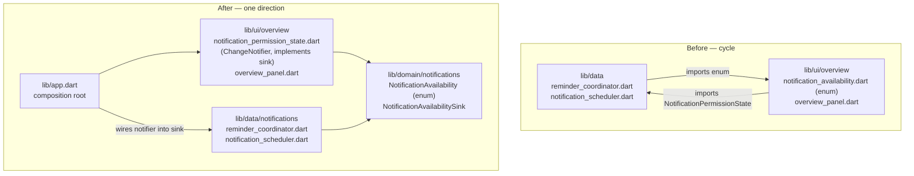

# refactor: notification layering, repository/query cleanups, and sync error-path coverage

**Target worktree:** `.worktrees/chore-issues-44-45-49` on branch `chore/issues-44-45-49` (KTD0).

---

## Goal Capsule

Close three open internal-quality issues in one branch: fix the `lib/data` → `lib/ui` layering inversion around notification availability (#44), remove duplicated repository construction, duplicated query builders, and in-memory linear scans (#49), and add the two missing sync-engine error-path regression tests (#45).

No user-visible behavior changes. Every existing test must pass unchanged except where an import path moved. The only new behavior is test coverage.

---

## Problem Frame

Three findings from the #37 review remain open. All three are internal-quality defects that are cheap now and expensive later:

1. **Layering inversion (#44).** Two files in `lib/data` import `lib/ui`, while `lib/ui` imports `lib/data` in the other direction. The cycle exists solely because the `NotificationAvailability` enum was parked in `lib/ui/overview/` when U6 introduced it as a UI-only hint, and U8 later made `lib/data` the producer of that value. Nothing enforces the layering, so the crossing can silently return.

2. **Duplicated construction and linear scans (#49).** The composition root builds a second, parallel set of Drift repositories for the reminder coordinator, and `build()` constructs brand-new repository instances on every rebuild because `Provider.value` is fed an inline constructor call. Separately, `getProfiles`/`watchProfiles` duplicate their query construction verbatim, and three repository methods re-implement by-key lookups as `O(n)` in-memory scans over full result lists when the storage layer already has indexed access.

3. **Untested sync error paths (#45).** Two branches of the sync engine's failure handling have no regression coverage: a storage apply failure *between* push batches (after `markPushed` already committed earlier batches), and the partial-success case of the reconcile per-row fallback where some rows land and others are deferred.

### Verified against the code — two drifts from the issue text

Research confirmed the substance of all three issues, with two corrections the implementer needs:

- **#45 names the wrong test file.** The issue says `supabase_sync_engine_test.dart`; the actual file is `test/data/sync_engine_test.dart`. The engine itself is `lib/data/sync/supabase_sync_engine.dart`.
- **#45's second claim is partly covered already.** `test/data/sync_engine_test.dart:770` covers reconcile's batch→per-row fallback for a single-row page. The genuine gap is the *partial-success* case: a multi-row page where the batch apply fails, then per-row application lands some rows and defers others. See KTD6.

### Reported conflict — #44's proposed target layer

The issue proposes moving "the notification availability enum and domain contracts to `lib/domain`". The enum can move there; **`NotificationPermissionState` cannot.** `lib/domain` today has **zero** `package:flutter` imports (verified: `grep -rn "^import 'package:flutter" lib/domain/` returns nothing) — it is pure Dart. `NotificationPermissionState` extends `ChangeNotifier` from `package:flutter/foundation.dart`, so moving it into `lib/domain` would introduce the first Flutter dependency into the domain layer to fix a layering violation. That trade is not worth making. KTD1 resolves this with a pure-Dart domain contract plus a UI-side implementation.

---

## Requirements

| ID | Requirement | Source |
|---|---|---|
| R1 | No file under `lib/data` imports `package:lunarlog/ui/`. | #44 |
| R2 | `lib/domain` remains free of `package:flutter` imports. | Code (verified); #44 conflict |
| R3 | `lib/ui/overview/overview_panel.dart` no longer imports `lib/data` for notification permission state. | #44 |
| R4 | The layering rule from R1 is enforced by an automated check, not convention. | #44 ("contradicts the architectural layering documented in `lib/app.dart`") |
| R5 | `_LunarLogAppState` constructs each Drift repository exactly once for the widget's lifetime; the reminder coordinator and the Provider tree share those instances. | #49.1 |
| R6 | `getProfiles` and `watchProfiles` share one query builder. | #49.2 |
| R7 | Repository by-key lookups (`DriftDayEntriesRepository.find`, `DriftProfilesRepository.findById`, `DriftProfilesRepository.setArchived`) issue indexed storage queries instead of scanning full lists — with identical observable results, including tombstone exclusion. | #49.3 |
| R8 | A regression test covers a storage apply failure mid-push, after `markPushed` committed an earlier batch: earlier batches stay pushed, the failing rows stay dirty, the cycle fails cleanly, and the next cycle re-pushes only what is left. | #45.1 |
| R9 | A regression test covers reconcile's per-row fallback **partial success**: the batch apply fails, per-row application lands the applicable rows, the inapplicable row is deferred, and the full-pull stamp does not advance. | #45.2 |
| R10 | `flutter analyze`, `flutter test`, and `dart run tool/quality_gate.dart` all pass. | CI constraint |
| R11 | No user-visible behavior change; no schema change; no migration. | Batch direction |

---

## Key Technical Decisions

### KTD0. All work happens in the `.worktrees/chore-issues-44-45-49` worktree

*(session-settled: user-directed — chosen over working in the main `C:\git\repos\lunarlog` checkout: other Claude sessions share this repo and the main checkout must stay clean.)*

Governs every unit. The branch `chore/issues-44-45-49` is already created off `main` at `abc234f`.

### KTD1. Break the cycle with a pure-Dart domain contract, not by relocating the ChangeNotifier

Create `lib/domain/notifications/notification_availability.dart` holding **two pure-Dart declarations**:

- `enum NotificationAvailability { available, denied }` — moved verbatim from `lib/ui/overview/notification_availability.dart`.
- `NotificationAvailabilitySink` — a minimal abstract interface with a single `void update(NotificationAvailability next)` member. This is the *only* thing `lib/data` needs from the permission state.

Then:

- `ReminderCoordinator` depends on `NotificationAvailabilitySink`, not on the concrete notifier — its `permissionState` parameter and field change type. It already only calls `.update(...)` and reads `.value` for the denial short-circuit; the `.value` read moves to a locally-tracked field (see U1 Approach) so the sink stays write-only and pure.
- `NotificationPermissionState` moves out of `reminder_coordinator.dart` into a new `lib/ui/overview/notification_permission_state.dart`, keeps extending `ChangeNotifier`, and `implements NotificationAvailabilitySink`.
- `app.dart`, the composition root, wires the concrete notifier into the coordinator's sink parameter — exactly the role its own header comment claims.

**Rejected: move `NotificationPermissionState` to `lib/domain`** (the issue's literal proposal) — it would put `package:flutter` into a layer that has none, trading one layering violation for a worse one. See the reported conflict above.

**Rejected: consolidate both types inside `lib/data/notifications`** (the issue's alternative) — it clears R1 but leaves `overview_panel.dart` importing `lib/data` for a UI state holder, so R3 stays broken and the arrow still points the wrong way for the widget layer.

### KTD2. Enforce the layering with a test, not a lint

Add `test/architecture/layering_test.dart`: read every `.dart` file under `lib/data/`, fail if any imports `lib/ui` — matching both the `package:lunarlog/ui/` form **and** a relative import whose target escapes `lib/data` into `ui` (an `import '` target starting with `../` and containing `/ui/`); read every file under `lib/domain/`, fail if any imports `package:flutter`. The relative form matters because this repo already mixes both styles (`lib/data/repositories/drift_profiles_repository.dart` uses `import 'mappers.dart';`), so a package-prefix-only check would let the exact cycle R1 removes come back green. A plain filesystem+regex test needs no new dependency, runs in milliseconds, and gives a failure message that names the offending file.

**Rejected: a custom lint rule / `import_lint` package** — a new dev dependency and analyzer plugin config for a two-rule check the test expresses in ~30 lines.

### KTD3. Hoist repositories to `late final` fields initialized in `initState`

`_LunarLogAppState` gains `late final` fields for the profiles repository, day-entries repository, settings store, and prediction service, all constructed in `initState` from `widget.db.storage`. `build()` switches every affected provider to `Provider.value` / `Provider<T>.value` over those fields; `_startReminders` and `_clearAwaitingConfirmation` use them instead of constructing their own.

This is strictly *more* correct than today, not merely deduplicated: `Provider<ProfilesRepository>.value(value: DriftProfilesRepository(...))` currently allocates a fresh repository on **every rebuild** while telling Provider the value is stable.

**Verified, not assumed:** `widget.db` is stable for the widget's lifetime. `LunarLogRoot.build` constructs `LunarLogApp` only when `_db != null`, `_ensureOpen` returns early when `_db` is already set, and `_db` is only ever cleared — never swapped to a different instance. Every widget test unmounts via `disposeApp` before pumping a second app. `initState`-time capture is therefore safe today. The residual exposure is that nothing *guards* this: a future test that pumps two `LunarLogApp`s without unmounting would capture a stale database with no failure signal.

### KTD4. New storage lookups preserve today's exact read-path semantics

Two new public storage methods back R7:

- `getDayEntry({required String profileId, required String localDate})` — adds an optional `String? localDate` parameter to the existing private `_dayEntryQuery` and calls it with the same ordering, returning the **first** row or `null`. Note `_dayEntryQuery` returns `Selectable<DayEntry>`, which does not accept a further chained `.where(...)` — the filter must go **inside** the helper, so this unit changes the helper's signature rather than composing onto its result.
- `getProfile(String id, {bool includeTombstones = false})` — an indexed `id` lookup that applies the same tombstone filter as `getProfiles`.

The "first row, not `getSingleOrNull`" choice is deliberate: `find` is a read path whose contract today is to return `null` rather than throw, and `getSingleOrNull` throws when a query matches more than one row. Storage's private `_liveDayEntry` does throw `StateError` in that case, but that is a defensive assertion behind a schema guarantee, not a reachable state — `lib/data/db/db.dart` creates the partial unique index `uq_day_entries_profile_date_live` (`kLiveDayEntryIndexSql`) on `(profile_id, local_date) WHERE deleted_at IS NULL` at `onCreate`, so two live rows for one pair cannot exist. Keep `getDayEntry` non-throwing to match `find`'s existing shape; do not route it through `_liveDayEntry`. Same tombstone reasoning for `getProfile`: exclusion must match `getProfiles`, because `setArchived` relies on it to reject tombstoned ids with `StateError`.

### KTD5. Reuse the existing `HookedStorage` seam for the push-failure test

`test/data/sync_engine_test.dart` already has `HookedStorage extends LunarLogStorage` (line 144) and `Rig` already accepts a `storageFactory` (line 162). Add a `beforeMarkPushed` hook to `HookedStorage` rather than introducing a second fake-storage class.

**`_chunk` does not give one batch per row — seed two profiles, not a profile and an entry.** `_chunk` appends the first day entries to the *last* profile batch (`if (p >= profiles.length) { batch.addAll(entries.sublist(...)) }`), so one profile plus one day entry at `batchSize: 1` yields a **single** batch containing both rows. A throw on the second `markPushed` would then land inside batch 1 — before any batch committed, and before `_pushBatch` ever reaches `setClockOffset` — which is not the failure R8 exists to pin. Two dirty profiles and no day entries at `batchSize: 1` give exactly two batches (`[pA]`, `[pB]`), so the throw on the second `markPushed` is the first write of batch 2, after batch 1 fully committed.

`Rig.storage` is declared `LunarLogStorage`, so arming the hook needs a cast: `(rig.storage as HookedStorage).beforeMarkPushed = ...`. The existing binding test at line 1006 shows the same pattern.

**Rejected: a mock/`Mockito` storage** — the repo's sync tests deliberately run against a real in-memory Drift database so storage assertions are real; a mock would make the atomicity assertions meaningless.

### KTD6. Test reconcile's partial success, not the already-covered single-row case

`sync_engine_test.dart:770` already proves batch-apply failure falls back to per-row and that a still-failing row defers the full-pull stamp — with a **one-row** page. Untested is `_applyReconcilePage`'s loop landing some rows while deferring others. R9's test scripts a two-row `dayEntries` reconcile page: one entry whose profile exists locally (applies) and one orphan whose profile does not (defers). No harness change is needed — `FakeSyncTransport.scriptPage` already supports it.

---

## High-Level Technical Design

Notification availability, before and after (#44):



Sync push failure mid-batch, the sequence R8 pins down:

```mermaid
sequenceDiagram
  participant C as _cycle
  participant P as _push
  participant T as transport
  participant S as storage

  C->>P: _push(uid)
  P->>T: push(batch 1)
  T-->>P: PushResult
  P->>S: markPushed(row 1) ✓
  Note over S: row 1 now dirty = false
  P->>T: push(batch 2)
  T-->>P: PushResult
  P->>S: markPushed(row 2) ✗ throws
  S-->>C: exception propagates past _push
  C->>C: catch → _fail(SyncErrorKind.other)
  Note over C: phase = error; row 1 stays clean,<br/>row 2 stays dirty; the clock offset<br/>is never persisted (loop aborted)
```

---

## Implementation Units

### U1. Relocate notification availability contracts and rewire the layers

**Goal:** `lib/data` stops importing `lib/ui`, without adding Flutter to `lib/domain`.

**Requirements:** R1, R2, R3, R11.

**Dependencies:** none.

**Files:**
- create `lib/domain/notifications/notification_availability.dart`
- create `lib/ui/overview/notification_permission_state.dart`
- delete `lib/ui/overview/notification_availability.dart`
- modify `lib/data/notifications/reminder_coordinator.dart`
- modify `lib/data/notifications/notification_scheduler.dart`
- modify `lib/ui/overview/overview_panel.dart`
- modify `lib/app.dart`
- modify `test/data/reminder_coordinator_test.dart` (imports; fake sink if useful)
- modify `test/ui/overview_test.dart` (imports)

**Approach:** one atomic change — the tree does not compile between the move and the rewire, so this is a single unit and a single commit.

1. Create the domain file with the `NotificationAvailability` enum (moved verbatim, docs adapted) and the `NotificationAvailabilitySink` interface (one member: `void update(NotificationAvailability next)`).
2. Move `NotificationPermissionState` from `reminder_coordinator.dart` into `lib/ui/overview/notification_permission_state.dart` unchanged except for `implements NotificationAvailabilitySink` and importing the domain enum.
3. In `ReminderCoordinator`, retype the `permissionState` constructor parameter and `_permissionState` field to `NotificationAvailabilitySink` and drop the `lib/ui` import. The coordinator currently *reads* `_permissionState.value` for its denial short-circuit — replace that read with a private field the coordinator sets in `start()` from the value it already receives from `_scheduler.initialize(...)` and forwards to the sink. The sink then stays write-only, so it can remain a pure interface.

   **Declare the field with an eager initializer, not `late`:** `NotificationAvailability _availability = NotificationAvailability.available;`. `ReminderCoordinator` registers itself as a `WidgetsBindingObserver` in its *constructor*, and `app.dart` fires `unawaited(_startReminders())` from `initState`, so an `AppLifecycleState.resumed` event can schedule a replan during the `await _scheduler.initialize(...)` gap — an unbounded gap on iOS/macOS first launch, where `initialize` awaits the user's answer to the system permission dialog. Today that path safely reads `_permissionState.value`, which `app.dart` seeded to `available`. A `late` field would instead throw `LateInitializationError` from inside an unawaited timer callback. The eager initializer preserves today's behavior exactly, which is what R11 requires.
4. Point `notification_scheduler.dart` at the domain enum import.
5. Point `overview_panel.dart` at `notification_permission_state.dart` and the domain enum; **remove** its `package:lunarlog/data/notifications/reminder_coordinator.dart` import (that import exists only for the notifier — confirm nothing else in the file needs it).
6. Update `app.dart`'s two notification imports and delete the old UI enum file.
7. Fix the two test files' import lines. Symbol names are unchanged, so no test body should need editing.

**Patterns to follow:** the existing `lib/domain/repositories/*.dart` contracts — pure abstract Dart, no Flutter. `app.dart`'s header comment already declares composition-root responsibility for cross-layer wiring; this unit makes that claim true.

**Test scenarios:**
- Existing `test/data/reminder_coordinator_test.dart` passes unchanged (beyond imports), including the denied-availability case at line 109 that asserts scheduling is skipped and the sink receives `denied`.
- Existing `test/ui/overview_test.dart` passes unchanged (beyond imports), including the reminder-hint case at line 377 that renders `_ReminderHint` when availability is `denied`.
- A `ReminderCoordinator` driven with a **test-local minimal sink** (not `NotificationPermissionState`) still updates availability and still skips scheduling when denied — proving `lib/data` no longer needs the UI type.
- A replan triggered *before* `start()` resolves availability (a lifecycle `resumed` event while `_scheduler.initialize(...)` is still pending) behaves as it does today: it schedules and does not throw. This is the regression the eager initializer prevents; with a `late` field it fails with `LateInitializationError`.

**Verification:** `flutter analyze` clean; `grep -rn "package:lunarlog/ui/" lib/data/` returns nothing; `grep -rn "package:flutter" lib/domain/` returns nothing; `flutter test` green.

---

### U2. Add the layering guard test

**Goal:** the R1/R2 invariants fail CI if they regress.

**Requirements:** R4, R10.

**Dependencies:** U1.

**Files:**
- create `test/architecture/layering_test.dart`

**Approach:** two `test` cases in one group. Each walks its directory with `dart:io` (`Directory('lib/data').listSync(recursive: true)`, filtered to `.dart`), reads each file, and collects offenders whose contents match the forbidden import. Assert the offender list is empty and include the offending paths in the failure `reason` so the message is actionable. Skip generated files (`*.g.dart`) explicitly — `lib/data/db/db.g.dart` is codegen output and should not be policed.

**Execution note:** write this test **before** running the suite for U1 in the same session if convenient — it is the cheapest proof U1 actually landed. It is not test-first in the TDD sense; it is a guard.

**Patterns to follow:** existing `test/` layout — mirror the `lib/` structure; `test/support/` holds shared helpers.

**Test scenarios:**
- No file under `lib/data/` (excluding `*.g.dart`) imports `package:lunarlog/ui/`; the failure message names each offender.
- No file under `lib/domain/` imports `package:flutter`; the failure message names each offender.
- Both cases enumerate a non-zero number of files, so a wrong path or a bad glob cannot make the test vacuously pass — assert the scanned-file count is greater than zero.

**Verification:** the test passes on the U1 tree; temporarily re-adding a `lib/ui` import to `reminder_coordinator.dart` makes it fail with the file named. Revert the temporary edit.

---

### U3. Share the profiles query builder and add indexed by-key storage lookups

**Goal:** one query builder for profiles reads; indexed single-row lookups available to repositories.

**Requirements:** R6, R7 (storage half), R11.

**Dependencies:** none.

**Files:**
- modify `lib/data/db/storage.dart`
- modify `test/data/db_test.dart`

**Approach:**

1. Extract the duplicated body of `getProfiles`/`watchProfiles` into a private `_profilesQuery({required bool includeTombstones})` that applies the `sortOrder` then `id` ordering and the `deletedAt.isNull()` filter. `getProfiles` returns `.get()`; `watchProfiles` returns `.watch()`. Mirror the shape of the existing `_dayEntryQuery`, which already does exactly this for day entries — the profiles pair is the outlier.
2. Add `Future<DayEntry?> getDayEntry({required String profileId, required String localDate})`. `_dayEntryQuery` returns `Selectable<DayEntry>`, which cannot take a chained `.where(...)`, so add an optional `String? localDate` parameter **inside** `_dayEntryQuery` and apply the equality filter there; the existing `getDayEntries`/`watchDayEntries` callers pass nothing and are unaffected. Keep the same ordering and return the first row or `null` (per KTD4 — not `getSingleOrNull`, to preserve today's non-throwing read-path shape).
3. Add `Future<Profile?> getProfile(String id, {bool includeTombstones = false})`: an `id` equality select that applies the same tombstone filter as `_profilesQuery`, returning `null` when filtered out.
4. Document both new methods with the tombstone/edge semantics they guarantee, since U4 depends on them exactly.

**Patterns to follow:** `_dayEntryQuery` and its `getDayEntries`/`watchDayEntries` pair (`lib/data/db/storage.dart`) — the target shape for step 1. The existing private `_profileOrNull` shows the indexed-id select idiom for step 3.

**Test scenarios:**
- `getProfiles()` and `watchProfiles().first` return identical lists for a mixed set of live, archived, and tombstoned profiles — same order, same exclusions (pins the extraction).
- `getProfiles(includeTombstones: true)` and `watchProfiles(includeTombstones: true)` both include tombstones, ordered by `sortOrder` then `id`.
- `getDayEntry` returns the live entry for a `(profileId, localDate)` that has one.
- `getDayEntry` returns `null` for a date with no entry, and `null` for a date whose only row is a tombstone.
- `getDayEntry` returns the entry for the requested profile only — an entry with the same `localDate` under a different profile is not returned.
- No test for two live rows sharing a `(profileId, localDate)`: the partial unique index `uq_day_entries_profile_date_live` (`kLiveDayEntryIndexSql` in `lib/data/db/db.dart`, created at `onCreate`) makes that state unreachable. Do not try to construct it — record the index as the reason in a one-line comment where `getDayEntry` is documented.
- `getProfile(id)` returns the profile; `getProfile(tombstonedId)` returns `null`; `getProfile(tombstonedId, includeTombstones: true)` returns the tombstone; `getProfile(unknownId)` returns `null`.

**Verification:** `flutter test test/data/db_test.dart` green; no change in any existing storage assertion.

---

### U4. Delegate repository by-key lookups to indexed storage queries

**Goal:** remove the three in-memory linear scans.

**Requirements:** R7, R11.

**Dependencies:** U3.

**Files:**
- modify `lib/data/repositories/drift_day_entries_repository.dart`
- modify `lib/data/repositories/drift_profiles_repository.dart`
- modify `test/domain/repositories_test.dart` — the existing `DriftProfilesRepository` / `DriftDayEntriesRepository` suite. It already covers `find`, `findById`, and `setArchived`, so extend it in place. (There is no `test/data/repositories/` directory; do not create one.)

**Approach:**

1. `DriftDayEntriesRepository.find` becomes a single `_storage.getDayEntry(...)` call mapped through `dayEntryToDomain`, returning `null` when storage returns `null`.
2. `DriftProfilesRepository.findById` becomes a single `_storage.getProfile(id)` call mapped through `profileToDomain`.
3. `DriftProfilesRepository.setArchived` fetches with `_storage.getProfile(id)` and keeps its existing `StateError('cannot archive unknown or tombstoned profile: $id')` when the result is `null` — the tombstone exclusion that makes that message true now comes from `getProfile`'s default rather than from `getProfiles()`.

**Scope note:** #49's body names only `drift_day_entries_repository.dart`, but its title names "linear scans" generally and `DriftProfilesRepository` has two more of the same defect with an identical fix. They are included here deliberately; flag this in the PR description.

**Patterns to follow:** the repositories' existing one-line delegating methods (`delete`, `listForProfile`) — thin mapping over a storage call, no logic in the repository.

**Test scenarios:**
- `find` returns the entry for an existing `(profileId, localDate)`, with all fields mapped (flow, tags, note, tz).
- `find` returns `null` for a date with no entry, and `null` when only a tombstone exists for that date.
- `find` scoped to profile A does not return profile B's entry for the same `localDate` (R7 profile scoping).
- `findById` returns the profile for a live id, `null` for an unknown id, and `null` for a tombstoned id.
- `setArchived(id, true)` sets `archivedAt`; `setArchived(id, false)` clears it.
- `setArchived` throws `StateError` for an unknown id **and** for a tombstoned id — the pre-refactor contract.

**Verification:** `flutter test` green; `grep -rn 'for (final row in rows) {' lib/data/repositories/` returns **nothing**. That brace form matches exactly the three by-key scans this unit removes (`find`, `findById`, `setArchived`) and nothing else — the collection-literal form `[for (final row in rows) ...]` used by the stream mappings has no brace, so it is not matched. Do **not** verify with `grep "for (final row in await _storage.get"`: that pattern only ever matched `listForProfile` and `list`, which stay, so it passes identically before and after this unit and proves nothing.

---

### U5. Construct each repository once in the composition root

**Goal:** one instance per repository for the widget's lifetime, shared by the coordinator and the Provider tree.

**Requirements:** R5, R11.

**Dependencies:** none (independent of U1–U4; sequence it after U1 only to keep `app.dart` edits in one place if convenient).

**Files:**
- modify `lib/app.dart`
- modify `test/ui/app_auth_provider_test.dart` — the existing `LunarLogApp` provider-wiring test, which already mounts the app and reads providers through a `homeContext(tester).read<T>()` helper. (There is no `test/ui/app_test.dart`.)

**Approach:**

1. Add `late final` fields to `_LunarLogAppState` for the profiles repository, day-entries repository, settings store, and prediction service.
2. Initialize all four in `initState`, before the existing `_permissionState` / auth / reminder setup, from `widget.db.storage`.
3. `_startReminders` uses the fields instead of constructing `DriftDayEntriesRepository`, `DriftProfilesRepository`, and a second `CyclePredictionService`. Its "build the coordinator's instances directly from the database instead of reading them from this context" comment describes the old workaround — replace it with a comment explaining that the state owns the instances and provides them downward.
4. `_clearAwaitingConfirmation` uses the settings-store field instead of constructing `DriftSettingsStore` per call.
5. `build()` switches the `ProfilesRepository`, `DayEntriesRepository`, `SettingsStore`, and `CyclePredictionService` providers to `.value` over the fields. The prediction service's `create:` callback (which reads `DayEntriesRepository` from context) becomes a `.value` over the field — same object graph, resolved once.

**Already verified (KTD3):** no test replaces `widget.db` on a mounted `LunarLogApp`, and `LunarLogRoot` never swaps the instance — so `initState` capture is safe and no `didUpdateWidget` handling is needed. If implementation turns up a counter-example, stop and report rather than silently capturing a stale database.

**Patterns to follow:** the existing `_permissionState` `late final` field and its `initState` initialization in the same class — the pattern this unit extends to the repositories.

**Test scenarios:**
- Mounting `LunarLogApp` and reading `ProfilesRepository` twice across two rebuilds yields the **same instance** (`identical(...)` is true) — the defect this unit fixes.
- The same identity assertion for `DayEntriesRepository`, `SettingsStore`, and `CyclePredictionService`.
- **Write a new test** mounting `LunarLogApp(db: db, scheduler: fakeScheduler)` and asserting the coordinator starts and plans reminders against the hoisted instances. No widget test passes `scheduler:` today (`grep -rn "scheduler:" test/ui/` returns nothing), so `_startReminders` currently has zero widget coverage — and this unit rewrites it. Budget this as real work: it needs a fake `ReminderScheduler` and has to drive the `unawaited(_startReminders())` that `initState` fires.
- **Write a new test** supplying `onTeardown` and asserting the coordinator teardown future is delivered. `onTeardown` is referenced by no test in the repo today, so the disposal path this unit touches is also uncovered.
- Without a scheduler (the widget-test default), no notification machinery is touched — the existing assertion holds.
- The awaiting-confirmation clear-on-sign-in path still writes both settings keys after the repositories were hoisted.

**Verification:** `flutter test` green; `grep -n "DriftProfilesRepository(\|DriftDayEntriesRepository(\|DriftSettingsStore(" lib/app.dart` shows exactly one construction site each.

---

### U6. Cover a storage apply failure mid-push

**Goal:** pin the engine's behavior when `markPushed` fails after an earlier batch already committed.

**Requirements:** R8, R10.

**Dependencies:** none.

**Files:**
- modify `test/data/sync_engine_test.dart`

**Approach:**

1. Extend the existing `HookedStorage` (line 144) with a `Future<void> Function(SyncTable table, String id)? beforeMarkPushed` hook and an override that calls it before `super.markPushed(...)`. Leave the existing `beforeIsEmpty` hook untouched — the binding test at line 1006 depends on it.
2. Add a test in the `push` group. Build `Rig(batchSize: 1, storageFactory: (db, clock) => HookedStorage(db, clock: clock))`. Bind to `uidA` and create **two profiles and no day entries** — per KTD5, that is what actually yields two batches (`[pA]`, `[pB]`); a profile-plus-entry pair collapses into one batch and would not test R8 at all.
3. Arm the hook via `(rig.storage as HookedStorage).beforeMarkPushed` to throw on the **second** invocation — the first write of batch 2, after batch 1 committed. Throw a plain `Exception` so it lands in `_cycle`'s general `catch` and yields `SyncErrorKind.other`, not the transport-error path.
4. Assert the post-failure state, then re-arm the hook to a no-op, run `rig.sync()`, and assert recovery.

**Execution note:** confirm the failure lands in `_cycle`'s general `catch` and not `on SyncTransportError` before writing the assertions — throw a bare `Exception`, not a `SyncTransportError`.

**Patterns to follow:** the AE6 test at `test/data/sync_engine_test.dart:341` — the same shape (arm a failure, assert the failed-cycle state, then assert the next cycle recovers) but for a transport failure rather than a storage failure. `test/data/sync_engine_test.dart:1006` shows the `storageFactory` + `HookedStorage` wiring.

**Test scenarios:**
- Two batches were actually sent — `rig.transport.pushes` has length 2, each carrying one profile. This assertion is load-bearing: it fails loudly if `_chunk` ever collapses the setup back into one batch, which would silently void everything below.
- Profile A (batch 1) is **not dirty** after the failure — `markPushed` committed and nothing rolled it back.
- Profile B (the failing batch) **stays dirty**; `storage.dirtyCount()` is exactly 1.
- The cycle ends in `SyncPhase.error` with `lastError == SyncErrorKind.other`.
- The pull never ran — `rig.transport.pulls` is empty, matching AE6's "a failed push ends the cycle".
- `serverClockOffsetMs` in sync state is **unchanged** from its pre-cycle value: the persist happens after the batch loop, which the exception skipped. (Assert the persisted state, not the in-memory offset, which batch 1's `setClockOffset` did set — this asymmetry is the contract being pinned, and it only exists because batch 1 completed.)
- After the hook is disarmed, the next `rig.sync()` re-pushes **only** profile B — `rig.transport.pushes` grows by one and that batch carries exactly one profile, not two.
- After recovery, `dirtyCount()` is 0 and the phase is `SyncPhase.idle`.

**Verification:** `flutter test test/data/sync_engine_test.dart` green, including all pre-existing tests (the `HookedStorage` change must not disturb the binding test).

---

### U7. Cover reconcile's per-row fallback partial success

**Goal:** prove that when a reconcile page fails as a batch, the per-row retry lands what it can and defers only what it must.

**Requirements:** R9, R10.

**Dependencies:** none.

**Files:**
- modify `test/data/sync_engine_test.dart`

**Approach:** add a test beside the existing single-row fallback test at line 770, in the `pull` group.

1. Bind with a stale `lastFullPullAt` so a full reconcile is due (the line-770 test's `t0.subtract(const Duration(hours: 25))` setup).
2. Ensure profile `pA` exists locally, so a day entry referencing it can apply. Create it via `rig.storage.upsertProfile(...)`, which marks it dirty — harmless here, but it means `pA` also rides this cycle's push, so do not assert on `rig.transport.pushes` in this test.
3. Script the incremental `dayEntries` page empty, then script the reconcile `dayEntries` page with **two** rows, **orphan first and the appliable `pA` entry second**. `applyRemoteRows` fails the page as one transaction because of the orphan; `_applyReconcilePage` then applies row by row.
4. Assert the split outcome.

**Row order is load-bearing, not incidental.** `_applyReconcilePage` iterates the page in order, so with the appliable row *first* a `break`-on-first-failure mutation produces byte-identical results — the good row already landed and the orphan is last — and the verification below would pass against the very regression this unit exists to catch. Orphan-first makes a `break` skip the appliable row and fail the test. State this in an inline comment in the test so a later edit does not reorder the page and silently disarm the check.

**Patterns to follow:** the fallback test at `test/data/sync_engine_test.dart:770` — same scaffolding, extended from a one-row to a two-row page. `remoteEntry(...)` and `rig.transport.scriptPage(...)` are the existing helpers.

**Test scenarios:**
- The appliable entry **is** persisted — `storage.getDayEntries(profileId: pA)` has length 1 and carries the remote row's values.
- The orphan is **not** persisted — no day entry exists for the unknown profile id.
- The cycle stays `SyncPhase.idle` — a retryable apply failure is not a cycle failure.
- `lastFullPullAt` does **not** advance past the stale stamp, so the reconcile is retried next cycle.
- The per-table cursors are untouched by the reconcile — the engine's `_reconcile` pages from version 0 and applies without moving cursors. (Its source comment cites "KTD2", which is the *sync* plan's numbering, not this plan's KTD2.)

**Verification:** `flutter test test/data/sync_engine_test.dart` green; the new test fails if `_applyReconcilePage`'s per-row loop is changed to `break` on the first failure instead of continuing (a quick manual mutation confirms the test has teeth).

---

## Verification Contract

Run from the worktree root, in order:

1. `flutter pub get`
2. `flutter analyze` — zero issues.
3. `flutter test` — all green, including the two new architecture assertions and the four new sync/storage/app test groups.
4. `dart run tool/quality_gate.dart` — the 90% coverage floor and the per-method CRAP gate both pass.

Gate 4 is the one that can surprise: U1 and U5 move and reshape code without adding behavior, so the coverage denominator shifts. U6 and U7 add coverage to previously-uncovered engine branches, which should move the floor the right way. If the CRAP gate flags a method touched by U5, prefer adding the missing test scenario over restructuring — the unit's scenario list is the place to look first.

No codegen is required: no Drift table or schema definition changes (`db.g.dart` untouched). No Supabase migration.

---

## Definition of Done

- [ ] `grep -rn "package:lunarlog/ui/" lib/data/` returns nothing (R1).
- [ ] `grep -rn "package:flutter" lib/domain/` returns nothing (R2).
- [ ] `lib/ui/overview/overview_panel.dart` has no `lib/data` import (R3).
- [ ] `test/architecture/layering_test.dart` exists and enforces both rules with non-vacuous file counts (R4).
- [ ] `lib/app.dart` constructs each Drift repository exactly once, in `initState` (R5).
- [ ] `getProfiles`/`watchProfiles` share `_profilesQuery` (R6).
- [ ] `find`, `findById`, and `setArchived` issue indexed queries with unchanged observable behavior, tombstone handling included (R7).
- [ ] The mid-push `markPushed` failure test exists and asserts the full split-state contract (R8).
- [ ] The reconcile partial-fallback test exists and asserts both the landed and the deferred row (R9).
- [ ] All four Verification Contract gates pass (R10).
- [ ] No schema change, no migration, no user-visible behavior change (R11).
- [ ] Issues #44, #45, and #49 are referenced in the PR body, along with the two reported drifts, U4's scope note, and a note that R4/U2's layering-guard test is an enforcement mechanism added beyond issue #44's literal Solution ask (its problem statement motivates it; its proposed solution does not name it).

---

## Scope Boundaries

**In scope:** issues #44, #45, #49 as specified above, plus `DriftProfilesRepository`'s two linear scans (same defect class as #49's named one — see U4's scope note).

### Deferred to Follow-Up Work

- `lib/ui/startup/fail_closed_screen.dart` also imports `lib/data`. It is a separate crossing with a different cause and is not part of #44's finding; leave it and consider a follow-up issue once the U2 guard exists (the guard tests `lib/data → lib/ui`, so this file does not trip it).
- Broader sync-engine coverage beyond R8/R9 (issue #42's push/apply/reconcile batching work overlaps this area and is separately planned).
- Extending the layering guard to a full dependency-direction matrix across all four layers.

### Non-goals

- Any change to sync wire format, RPC contracts, or the Supabase schema.
- Any change to reminder scheduling behavior, timing, or notification content.
- Performance work beyond replacing the linear scans with indexed lookups; no benchmarking is claimed or required.
- Touching the other open issues in this repo (#38/#39/#40 are already in flight on PR #67).

---

## Risks & Dependencies

| Risk | Likelihood | Mitigation |
|---|---|---|
| The CRAP or coverage gate trips on reshaped code in U1/U5 even though behavior is unchanged. | Medium | Each unit's test scenarios are written to cover the reshaped paths, not just the new ones. If a gate still trips, add the missing scenario rather than restructuring code to satisfy the metric. |
| U6's fake setup collapses into a single push batch, so R8's cross-batch failure is never exercised and the unit reports coverage it does not have. | **High if the setup is written naively** | KTD5 spells out why `_chunk` merges entries into the last profile batch and mandates the two-profile setup; U6's first test scenario asserts `pushes` has length 2, so a collapse fails loudly instead of silently voiding the test. |
| U1's new `_availability` field is declared `late`, and a lifecycle-resume replan races `start()` — `LateInitializationError` inside an unawaited timer. | Medium | U1 step 3 mandates the eager initializer and U1 has a dedicated pre-`start()` replan scenario. |
| U7's page is written appliable-row-first, making the `break` mutation undetectable and the unit's own falsification check vacuous. | Medium | U7 mandates orphan-first ordering, explains why, and requires an inline comment in the test so a later reorder does not disarm it. |
| U5's `initState` capture goes stale if a future test pumps a second `LunarLogApp` without unmounting the first. | Low | Verified safe today (KTD3); nothing guards it, so the risk is future-facing only. |
| Adding `beforeMarkPushed` to `HookedStorage` disturbs the existing binding test that uses `beforeIsEmpty`. | Low | Additive hook only; U6's verification re-runs the whole sync test file, not just the new test. |
| `overview_panel.dart`'s `lib/data` import turns out to serve something besides the notifier. | Low | Verified: its only use is `NotificationPermissionState` at line 64. `flutter analyze` catches it immediately if that changes before the unit lands. |

---

## Sources & Research

All findings below were verified directly against the working tree at `abc234f`; no external research was needed (the change is entirely internal to well-established local patterns).

- Issue #44 — `lib/data/notifications/reminder_coordinator.dart:20` and `lib/data/notifications/notification_scheduler.dart:9` both import `package:lunarlog/ui/overview/notification_availability.dart`; `lib/ui/overview/overview_panel.dart:11` imports back into `lib/data`. `lib/domain` has zero `package:flutter` imports.
- Issue #49 — `lib/app.dart:108-125` (`_startReminders`) builds a second repository set; `lib/app.dart:181-193` feeds `Provider.value` inline constructor calls; `lib/app.dart:134-138` (`_clearAwaitingConfirmation`) builds a settings store per call; `lib/data/db/storage.dart:206-228` duplicates the profiles query; `lib/data/repositories/drift_day_entries_repository.dart` `find` and `lib/data/repositories/drift_profiles_repository.dart` `findById`/`setArchived` scan full lists.
- Issue #45 — engine at `lib/data/sync/supabase_sync_engine.dart` (`_push`, `_pushBatch`, `_applyPushResult`, `_applyReconcilePage`); tests at `test/data/sync_engine_test.dart` (**not** `supabase_sync_engine_test.dart`); existing coverage at lines 341, 745, 770; reusable seams `HookedStorage` (line 144) and `Rig.storageFactory` (line 162).
- Quality gates — `tool/quality_gate.dart` runs `flutter test --coverage` then the coverage-floor and CRAP gates; both must pass for exit 0.
