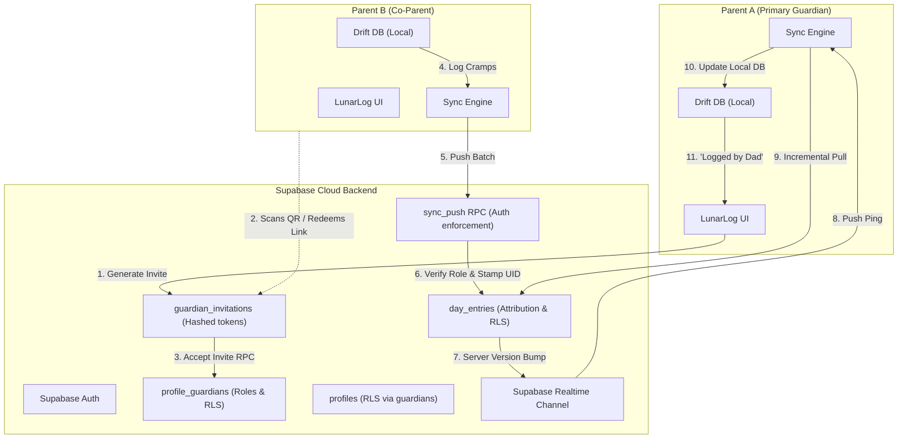
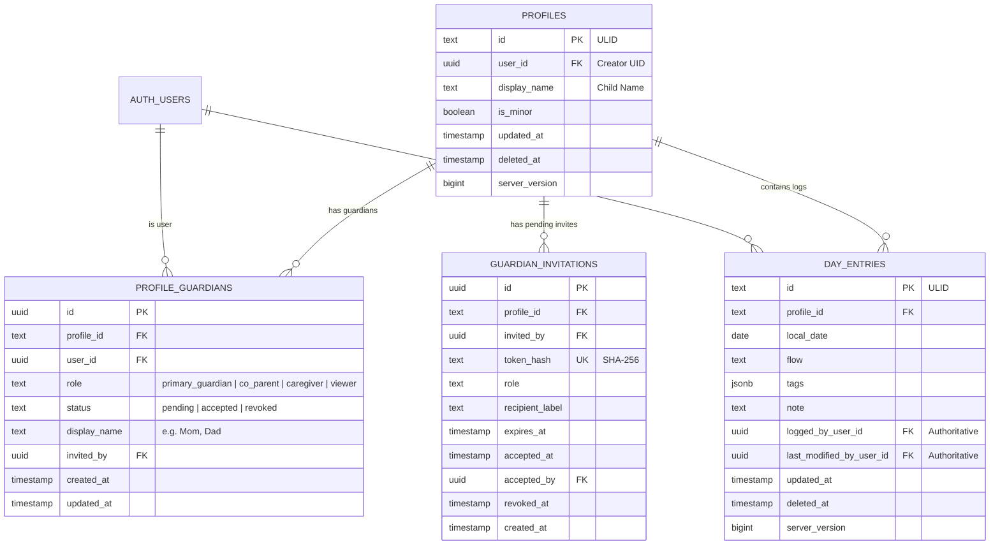
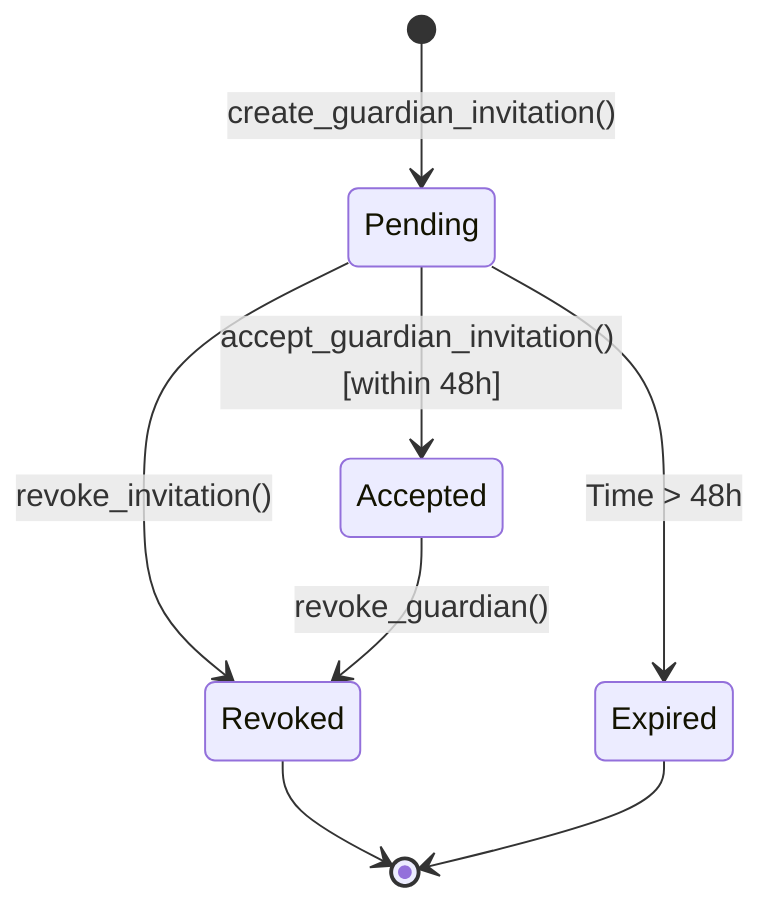

# Multi-Guardian Profile Sharing and Caregiver Attribution - Plan

**Target repo:** `lunarlog` (`repos/lunarlog` / `wjdavis5/lunarlog`). All file paths inside implementation units are repo-relative to `repos/lunarlog/`.

---

## Goal Capsule

- **Objective:** Enable multiple authenticated parents, co-parents, and caregivers to securely view, log, and co-manage a child's menstrual cycle profile across separate devices and accounts, with granular role-based permissions, server-enforced data isolation, tamper-proof caregiver attribution, and instant cross-device updates.
- **Means:** Extend the Supabase PostgreSQL backend with `profile_guardians` and `guardian_invitations` tables, update RLS policies and the `sync_push` RPC to enforce role boundaries and stamp user attribution, upgrade the local Drift SQLite schema (v3) with attribution columns and guardian models, integrate Supabase Realtime for instant change propagation, and introduce an in-app invite/pairing workflow via single-use cryptographically hashed tokens.
- **Authority hierarchy:** GitHub issue #8 owns product requirements; this document's Product Contract owns behavioral specification; Planning Contract owns technical architecture and database design; Implementation Units own atomic execution detail.
- **Stop conditions:** Stop work and surface to the user if any RLS policy fails pgTAP isolation tests, if server-side attribution can be forged by client payloads, or if offline-first single-operator local use without an account is compromised.
- **Execution profile:** `code`; deep plan covering database migrations, RPC security, Drift schema updates, sync engine synchronization, and Flutter UI.
- **Tail ownership:** Full ownership handoff to child when coming of age is deferred to Issue #4 (data structures here are designed strictly forward-compatible with #4); native mobile APNs/FCM background push notifications are deferred to Issue #5 (caregiver alert coordinator).

---

## Product Contract

### Summary

lunarlog introduces multi-guardian profile sharing, allowing parents, co-parents, and family helpers to collaborate on cycle tracking for shared family members. Profiles support four discrete roles (Primary Guardian, Co-Parent, Caregiver, and Viewer), entries display clear attribution badges (e.g. "Logged by Mom", "Cramps added by Dad"), pairing occurs via secure expiring tokens or QR codes, and changes synchronize in real time across caregivers' devices.

### Problem Frame

Mainstream cycle tracking applications assume a single user tracking their own body. In families—particularly with separated or divorced parents, co-parenting partners, or extended family caregivers—managing a young adolescent's cycle requires coordinated care: ensuring supplies are stocked across households, avoiding duplicate medications or interventions, and tracking symptoms without forcing parents to text back and forth. 

Furthermore, health data concerning minors requires absolute privacy and strict access boundaries: a co-parent shared on a daughter's profile must never see the other parent's personal cycle logs. Access must be granted on a per-profile basis, revocable at any time, and verified cryptographically at the database layer (RLS). When the child eventually matures and takes ownership of their profile (Issue #4), the transition must be seamless.

### Key Decisions

- **Per-profile guardian membership model (`profile_guardians`).** Access is granted per profile rather than per account. An operator with multiple profiles can share one child's profile with a co-parent while keeping all other family profiles completely private. (Governs R1, R2, R4, R5)
- **Expiring pairing tokens over SMTP email invites.** Invitations are generated in-app as secure, single-use, cryptographically hashed tokens (shared via system share sheet, AirDrop, iMessage, or QR code) with a 48-hour TTL. This avoids relying on email infrastructure, eliminates email rate limits, and prevents leaking account addresses. (Governs R6, R7, R8)
- **Authoritative server-side attribution stamping.** The `sync_push` RPC stamps `logged_by_user_id` and `last_modified_by_user_id` directly from `auth.uid()`, preventing client payloads from falsifying logging identity. (Governs R9, R10, R11)
- **Supabase Realtime for instant in-app sync; push notifications coordinated with Issue #5.** In-app UI updates propagate via Supabase Realtime broadcast channels; background APNs/FCM push notifications hook into the notification coordinator defined in Issue #5. (Governs R12, R13)
- **Forward-compatible with child ownership handoff (Issue #4).** The primary guardian role maps directly to the future owner role; when a child claims ownership, existing parents remain linked as co-parents or caregivers without schema alterations. (Governs R14, R15)

### Actors

- A1. **Primary Guardian (Creator):** The adult who initially created the profile. Holds exclusive rights to delete or archive the profile and manage all guardian memberships.
- A2. **Co-Parent / Joint Guardian:** A secondary parent with equal rights to view, log, receive alerts, and invite helpers/viewers. Cannot delete or archive the profile.
- A3. **Caregiver / Family Helper:** A trusted relative (e.g. grandparent, babysitter) who can view history, log daily flow and symptoms, and receive alerts. Cannot invite other guardians or edit profile settings.
- A4. **Healthcare Provider / Viewer:** A medical provider or read-only observer. Can view cycle history, predictions, and logs; cannot log entries or modify settings.
- A5. **Child (Profile Subject):** The data subject whose cycle is tracked; future recipient of profile ownership under Issue #4.

### Requirements

#### Roles and Permissions Matrix

- R1. A profile can have multiple linked guardians, each assigned exactly one role: `primary_guardian`, `co_parent`, `caregiver`, or `viewer`.
- R2. Every profile has exactly one `primary_guardian` at any given time.
- R3. Role permissions strictly follow the matrix:
  - `primary_guardian`: View, Log, Receive Alerts, Invite/Manage Guardians, Delete/Archive Profile.
  - `co_parent`: View, Log, Receive Alerts, Invite/Manage Guardians (Caregivers & Viewers), Cannot Delete/Archive.
  - `caregiver`: View, Log, Receive Alerts (configurable), Cannot Invite, Cannot Delete/Archive.
  - `viewer`: View only, Cannot Log, Cannot Receive Alerts, Cannot Invite, Cannot Delete/Archive.
- R4. An owner or co-parent can revoke access for any caregiver or viewer; only the primary guardian can revoke a co-parent.
- R5. When a guardian's access is revoked, their local device removes the shared profile and its day entries on the subsequent sync cycle.

#### Invitation & Pairing Protocol

- R6. An authorized guardian (`primary_guardian` or `co_parent`) can generate a single-use pairing invitation for a profile with a designated role (`co_parent`, `caregiver`, or `viewer`).
- R7. Invitations expire automatically after 48 hours unless accepted or explicitly revoked.
- R8. An invitation is accepted when a signed-in user provides the secret token; the server binds their `auth.uid()` to `profile_guardians` and transitions the invite to `accepted`.
- R9. An unauthenticated recipient opening an invite link is guided through sign-in or account creation before the token is redeemed.

#### Attribution & Transparency

- R10. Every `day_entries` row records `logged_by_user_id` (the user who initially created the entry) and `last_modified_by_user_id` (the user who last updated it).
- R11. The server enforces attribution stamping inside the `sync_push` RPC using `auth.uid()`; client-supplied attribution fields in push batches are ignored.
- R12. The Day Detail view displays human-readable attribution for each entry:
  - Displayed as "Logged by Mom (8:15 AM)" or "Modified by Dad (1:30 PM)" when a custom label or name is present.
  - Displayed as "Logged by you" when the current signed-in user matches the attribution ID.
  - Gracefully falls back to role name (e.g. "Logged by Co-Parent") if no custom display name exists.

#### Cross-Parent Sync & Realtime

- R13. When any guardian commits a change to a shared profile or its day entries, a Supabase Realtime event is broadcast on the profile's channel.
- R14. Active devices subscribed to the channel automatically trigger an incremental sync pull to update their local database without manual refresh.
- R15. Offline writes resolve via last-writer-wins on `updated_at`. If Parent A and Parent B edit the same date offline, the latest timestamp wins for conflicting fields, while non-conflicting tags are unioned.

#### Data Isolation & Security

- R16. Row-Level Security (RLS) guarantees that non-guardians cannot read or write any data for a profile.
- R17. Guardians cannot see other profiles belonging to an operator unless explicitly shared on those profiles.

### Key Flows

- F1. **Invite Co-Parent / Guardian**
  - **Trigger:** Parent opens Profile Settings -> "Manage Guardians" -> taps "Invite Guardian".
  - **Actors:** A1, A2, Supabase.
  - **Steps:** A1 selects role (`Co-Parent`) and enters an optional label ("Dad"); app calls `create_guardian_invitation` RPC; server generates a secure token and stores SHA-256 hash with 48h expiry; app displays share sheet with deep link (`lunarlog://invite?code=...`) and QR code.
  - **Covered by:** R1, R6, R7

- F2. **Accept Invitation on Second Device**
  - **Trigger:** Second parent scans QR code or taps deep link on their device.
  - **Actors:** A2, Supabase.
  - **Steps:** App opens and detects invite code; if not signed in, prompts A2 to authenticate; once authenticated, calls `accept_guardian_invitation` RPC; server validates hash and expiry, inserts `profile_guardians` row, and marks invite accepted; client triggers a full reconcile pull; child profile and history appear on A2's device.
  - **Covered by:** R8, R9, R14

- F3. **Co-Parent Logs Symptom / Entry**
  - **Trigger:** Co-Parent logs cramps and flow for shared profile.
  - **Actors:** A2, Supabase, A1.
  - **Steps:** A2 saves day entry locally (stamped dirty); background sync calls `sync_push`; server verifies A2 is an active guardian with log rights, sets `logged_by_user_id = A2.uid`, updates `server_version`, and triggers a Realtime notification; A1's device receives Realtime ping, runs incremental pull, and displays the new entry with "Logged by Dad".
  - **Covered by:** R3, R10, R11, R12, R13

- F4. **Revoke Guardian Access**
  - **Trigger:** Primary Guardian taps "Revoke Access" next to a caregiver.
  - **Actors:** A1, A3, Supabase.
  - **Steps:** A1 confirms revocation; app calls `revoke_guardian` RPC; server sets status to `revoked`; subsequent pulls by A3 return RLS denial; on next sync cycle, A3's device tombstones the profile and hides historical entries.
  - **Covered by:** R4, R5, R16

### Acceptance Examples

- AE1. **Role Enforcement on Push:** Given a user with role `viewer` on profile P, when the user pushes a day entry for profile P, then `sync_push` rejects the row with an authorization error and does not insert it into `day_entries`.
- AE2. **Attribution Integrity:** Given Parent A pushes a day entry with payload `logged_by_user_id: <Parent B UID>`, when `sync_push` executes under Parent A's JWT, then `day_entries.logged_by_user_id` is set to Parent A's UID in Postgres.
- AE3. **Single-Use Invite Expiry:** Given an invite generated 49 hours ago, when a user attempts to accept it, the RPC returns `expired` and no `profile_guardians` row is created.
- AE4. **Cross-Household Profile Isolation:** Given Parent A has profiles Maya (shared with Parent B) and Chloe (personal), when Parent B signs in and syncs, Parent B sees Maya's profile and entries, but Chloe's profile and entries are absent.

### Success Criteria

- 100% of RLS policies for `profiles`, `day_entries`, `profile_guardians`, and `guardian_invitations` proven by pgTAP automated test suite.
- Zero client-spoofed attribution fields permitted by the sync engine.
- Instant (<1.5s) propagation of logged entries between two active devices on LAN/cellular via Supabase Realtime.
- Unauthenticated / local-only single-device usage continues to operate with zero regressions.

### Scope Boundaries

#### In-Scope

- Database schema, migrations, RLS policies, and RPC functions for multi-guardian access.
- Drift schema migration (v3) for local guardian tables and attribution metadata.
- Pairing and invitation token generation, deep link handling, and redemption.
- Realtime channel subscription for instant in-app sync notifications.
- In-app attribution display on Day Detail and History views.
- Guardian management UI (view members, invite, revoke).

#### Deferred to Follow-Up Work

- **Child Ownership Hand-off Flow (Issue #4):** Handshake for child claiming sovereignty upon reaching adulthood; the schema and roles designed here accommodate this transition directly.
- **Native Push Notifications (Issue #5):** APNs / FCM push notifications for period start and severe symptom alerts when the app is terminated; coordinated with the caregiver alert coordinator.
- **Granular symptom-level redactions:** Hiding specific sensitive notes from certain caregivers (all entries currently follow the role matrix).

#### Outside This Product's Identity

- Unauthenticated guest sharing (web links without Supabase login).
- Public leaderboard or social feed features.

---

## Planning Contract

### Key Technical Decisions

- KTD1. **Decouple `profiles` and `day_entries` primary keys from `user_id`.** In `20260903014208_initial_sync_schema.sql`, primary keys were composite `(id, user_id)` and foreign keys were `(profile_id, user_id)`. To enable multi-user sharing, `profiles` must have a unique constraint on `id` (ULID), and `day_entries` foreign key must reference `profiles(id)` directly. `day_entries` live uniqueness constraint becomes `(profile_id, local_date) where deleted_at is null`, ensuring one canonical status per child per calendar date regardless of which parent logs.
- KTD2. **Separate Junction Table `profile_guardians` with Role Enum.** Store memberships in `public.profile_guardians` with composite unique constraint `(profile_id, user_id)`. Roles are constrained to `primary_guardian`, `co_parent`, `caregiver`, and `viewer`. Backfill existing rows by inserting `(id, user_id, 'primary_guardian', 'accepted')` for all current `profiles`.
- KTD3. **Cryptographic Token Hashing for Invitations (`guardian_invitations`).** The client generates a cryptographically secure random token (256-bit entropy, Base64URL-encoded). The client computes `SHA-256(token)` and sends only the hash to the server. The secret token is embedded in the invite deep link or QR code. The server never stores the raw token, preventing database leak compromise.
- KTD4. **`sync_push` RPC Evolution for Permission and Attribution Checks.** Modify `public.sync_push` to:
  1. Validate caller has membership in `profile_guardians` for each touched `profile_id`.
  2. Reject mutations if role lacks write permission (e.g. `viewer` trying to write, or non-`primary_guardian` trying to delete/archive).
  3. Authoritatively stamp `logged_by_user_id` on insert and `last_modified_by_user_id` on every write using `(select auth.uid())`.
- KTD5. **Drift Schema Migration v2 -> v3.**
  - Add `ProfileGuardians` Drift table (`id`, `profile_id`, `user_id`, `role`, `status`, `display_name`, `updated_at`).
  - Add `logged_by_user_id` and `last_modified_by_user_id` text columns to `DayEntries`.
  - Bump schema version to 3; write migration step in `LunarLogDatabase`; regenerate `db.g.dart` using `build_runner`.
- KTD6. **Realtime Broadcast via Supabase Channels.** `SupabaseSyncEngine` opens a Realtime channel `profile_sync:<profile_id>` for all non-archived profiles in the local database. When a `day_entries` or `profiles` change occurs in Postgres, a lightweight broadcast ping triggers `engine.sync()` on listening devices.

### High-Level Technical Design

#### System Architecture & Multi-Guardian Data Flow



#### Database Schema ERD



#### Invitation State Machine



### Assumptions

- **A-1 (Token Entropy):** 256-bit CSPRNG tokens formatted with Base64URL provide sufficient brute-force protection against guessing unexpired invite links without server-side CAPTCHA.
- **A-2 (Realtime Scale):** Family profile channels generate low-frequency message volumes well within Supabase free/pro Realtime quotas.
- **A-3 (Conflict Resolution on Attribution):** When two offline updates to the same date merge, the winning entry retains the initial creator's `logged_by_user_id` while updating `last_modified_by_user_id` to the author of the winning timestamp.

### Risks & Mitigations

- **Risk: Breaking Existing Client Sync during Schema Migration.**
  - *Mitigation:* The migration backfills `profile_guardians` for all existing profiles before applying new RLS policies. Foreign key refactoring on `day_entries` preserves all existing ULIDs and relationships.
- **Risk: Accidental Leak of Other Profiles to Co-Parents.**
  - *Mitigation:* RLS policies on `profiles` and `day_entries` explicitly enforce `EXISTS (SELECT 1 FROM profile_guardians WHERE profile_id = ... AND user_id = auth.uid() AND status = 'accepted')`. Proved by negative pgTAP tests simulating cross-user access.
- **Risk: Sync Cursor Gaps when New Profile is Accepted.**
  - *Mitigation:* When an invitation is accepted, the client sets `lastFullPullAt = null`, triggering an immediate full reconcile pull from `server_version = 0` to ingest the new profile and all historical entries.

---

## Implementation Units

### U1. Database Migration: `profile_guardians`, `guardian_invitations`, and Schema Refactor

- **Goal:** Update the Supabase Postgres schema to support multi-guardian access: create `profile_guardians` and `guardian_invitations`, refactor `profiles` and `day_entries` constraints, backfill existing rows, and implement updated RLS policies.
- **Requirements:** R1, R2, R3, R4, R5, R10, R16, R17
- **Dependencies:** None
- **Files:**
  - `supabase/migrations/20260904010000_multi_guardian_schema.sql` (create)
  - `supabase/tests/profile_guardians_rls_test.sql` (create)
- **Approach:**
  1. Alter `public.profiles`: add unique constraint on `id` alone (`profiles_id_uq`).
  2. Create `public.profile_guardians` table with `id`, `profile_id references profiles(id) on delete cascade`, `user_id references auth.users(id) on delete cascade`, `role`, `status`, `display_name`, `invited_by`, `created_at`, `updated_at`, and `unique(profile_id, user_id)`.
  3. Backfill `profile_guardians`: insert `(id, user_id, 'primary_guardian', 'accepted')` for every existing row in `public.profiles`.
  4. Create `AFTER INSERT ON public.profiles` trigger (`profiles_insert_primary_guardian`) to automatically insert `(new.id, new.user_id, 'primary_guardian', 'accepted')` into `profile_guardians` whenever a new profile is created, guaranteeing every profile always has an initial primary guardian record.
  5. Create `public.guardian_invitations` table with `id`, `profile_id`, `invited_by`, `token_hash`, `role`, `recipient_label`, `expires_at`, `accepted_at`, `accepted_by`, `revoked_at`, `created_at`.
  6. Refactor `public.day_entries`:
     - Add `logged_by_user_id uuid references auth.users(id)`.
     - Add `last_modified_by_user_id uuid references auth.users(id)`.
     - Drop old composite FK `day_entries_profile_fk (profile_id, user_id)`.
     - Add new FK `day_entries_profile_fk foreign key (profile_id) references public.profiles(id) on delete cascade`.
     - Backfill `logged_by_user_id = user_id`, `last_modified_by_user_id = user_id`.
     - Replace unique index `day_entries_live_profile_date_uq` to index on `(profile_id, local_date) where deleted_at is null`.
  7. Refactor RLS policies:
     - `profiles`: `USING ((select auth.uid()) = user_id OR EXISTS (SELECT 1 FROM public.profile_guardians pg WHERE pg.profile_id = profiles.id AND pg.user_id = (select auth.uid()) AND pg.status = 'accepted'))`.
     - `day_entries`: `USING (EXISTS (SELECT 1 FROM public.profile_guardians pg WHERE pg.profile_id = day_entries.profile_id AND pg.user_id = (select auth.uid()) AND pg.status = 'accepted'))`.
     - `profile_guardians`: members can read other members of the same profile; primary guardian and co-parent can manage.
     - `guardian_invitations`: creators and co-parents can select/insert; redemption handled via SECURITY DEFINER function.
  7. Grant privileges: `revoke all`, `grant select, insert, update` on designated columns to `authenticated`.
- **Patterns to follow:** `supabase/migrations/20260903014208_initial_sync_schema.sql`, `supabase-postgres-best-practices`.
- **Test scenarios:**
  - *Happy path:* Primary guardian can select and update own profiles and day entries.
  - *Happy path:* Co-parent added to `profile_guardians` can select profile and day entries.
  - *Edge case:* Non-guardian user attempts to select profile or day entries; query returns 0 rows.
  - *Edge case:* Primary guardian deletes profile; cascade removes `profile_guardians` and `day_entries`.
  - *Error path:* Co-parent attempts to update `user_id` or delete profile directly; rejected by RLS.
- **Verification:** Run `npx supabase@2.116.0 test db --local` with all pgTAP tests in `profile_guardians_rls_test.sql` passing.

---

### U2. Supabase RPC Updates: `sync_push` Guardian Enforcement and Invitation Handshake

- **Goal:** Update the `sync_push` RPC to enforce guardian roles and stamp server attribution; implement `create_guardian_invitation` and `accept_guardian_invitation` RPCs.
- **Requirements:** R3, R6, R7, R8, R10, R11
- **Dependencies:** U1
- **Files:**
  - `supabase/migrations/20260904020000_sync_push_and_invitations.sql` (create)
  - `supabase/tests/guardian_sync_push_test.sql` (create)
  - `supabase/tests/invitations_rpc_test.sql` (create)
- **Approach:**
  1. Update `public.sync_push`:
     - In profile loop: check caller's role in `profile_guardians`. If role is `caregiver` or `viewer`, reject row. If row has `deleted_at` or `archived_at` not null and caller is not `primary_guardian`, reject row.
     - In day entries loop: check caller's role in `profile_guardians` for `v_profile_id`. If role is `viewer`, reject row.
     - Attribution stamping: set `logged_by_user_id = coalesce(v_stored.logged_by_user_id, v_uid)` and `last_modified_by_user_id = v_uid`.
  2. Implement `public.create_guardian_invitation(p_profile_id text, p_role text, p_recipient_label text, p_token_hash text, p_ttl_hours int default 48)`:
     - `security invoker`, `set search_path = ''`.
     - Validates caller is `primary_guardian` or `co_parent` of `p_profile_id`.
     - Inserts into `guardian_invitations` with `expires_at = now() + (p_ttl_hours || ' hours')::interval`.
  3. Implement `public.accept_guardian_invitation(p_token_hash text, p_guardian_display_name text)`:
     - `security definer`, `set search_path = ''`.
     - Validates invite exists, `accepted_at is null`, `revoked_at is null`, and `expires_at > now()`.
     - Inserts into `profile_guardians (profile_id, user_id, role, display_name, status, invited_by)` using `auth.uid()`.
     - Marks invite `accepted_at = now()`, `accepted_by = auth.uid()`.
     - Returns JSON object with profile id, display name, and assigned role.
  4. Implement `public.revoke_guardian(p_profile_id text, p_target_user_id uuid)`:
     - Validates caller authority (Primary Guardian can revoke anyone; Co-Parent can revoke Caregivers/Viewers).
     - Sets `status = 'revoked'` in `profile_guardians`.
- **Patterns to follow:** `supabase/migrations/20260903080000_sync_push_concurrency.sql`.
- **Test scenarios:**
  - *Happy path:* Co-parent pushes day entry; server sets `logged_by_user_id = co_parent_uid` and returns resolved row.
  - *Happy path:* Create invite -> accept invite with second user -> second user successfully joins profile.
  - *Edge case:* Viewer attempts to push day entry; `sync_push` rejects the row into `rejected` list.
  - *Edge case:* Expired invite token redemption fails with informative error code.
  - *Error path:* Attacker attempts to accept an already-accepted or revoked invite; rejected.
- **Verification:** Run `npx supabase@2.116.0 test db --local` with `guardian_sync_push_test.sql` and `invitations_rpc_test.sql` passing.

---

### U3. Drift Schema v3: Guardian Tables, Attribution Columns, and Domain Models

- **Goal:** Update the local encrypted Drift database schema to version 3, adding attribution columns to `DayEntries`, creating the `ProfileGuardians` table, and updating domain models.
- **Requirements:** R1, R10, R12
- **Dependencies:** None (can develop in parallel with U1/U2)
- **Files:**
  - `lib/data/db/tables.dart` (modify)
  - `lib/data/db/db.dart` (modify migration)
  - `lib/data/db/db.g.dart` (regenerate)
  - `lib/domain/models/day_entry.dart` (modify)
  - `lib/domain/models/profile_guardian.dart` (create)
  - `test/data/db/migration_v2_to_v3_test.dart` (create)
  - `test/domain/models/day_entry_test.dart` (modify)
- **Approach:**
  1. In `lib/data/db/tables.dart`:
     - Add `TextColumn get loggedByUserId => text().named('logged_by_user_id').nullable()();`
     - Add `TextColumn get lastModifiedByUserId => text().named('last_modified_by_user_id').nullable()();` to `DayEntries`.
     - Define `ProfileGuardians` table: `id`, `profileId`, `userId`, `role`, `status`, `displayName`, `updatedAt`.
  2. In `lib/data/db/db.dart`:
     - Increment `schemaVersion` to 3.
     - Implement `from2To3` migration step: `addColumn(dayEntries, dayEntries.loggedByUserId)`, `addColumn(dayEntries, dayEntries.lastModifiedByUserId)`, `createTable(profileGuardians)`.
  3. Run `dart run build_runner build --delete-conflicting-outputs`.
  4. Update `DayEntry` domain model in `lib/domain/models/day_entry.dart` to include `loggedByUserId` and `lastModifiedByUserId`.
  5. Create `ProfileGuardian` domain model and `GuardianRole` enum (`primaryGuardian`, `coParent`, `caregiver`, `viewer`).
- **Patterns to follow:** `lib/data/db/tables.dart` v2 migration pattern.
- **Test scenarios:**
  - *Happy path:* v2 database with existing profiles and entries successfully upgrades to v3 without data loss.
  - *Happy path:* Inserting and reading `DayEntry` with attribution IDs persists and returns values accurately.
  - *Edge case:* `loggedByUserId` and `lastModifiedByUserId` default to null for legacy offline rows.
- **Verification:** Run `flutter test test/data/db/migration_v2_to_v3_test.dart` and `flutter test test/domain/models/day_entry_test.dart`.

---

### U4. Sync Codec, Transport, and Engine Integration for Guardians

- **Goal:** Update row codecs, transport, and sync engine to serialize/deserialize guardian records, handle entry attribution, and trigger full reconciles upon joining a profile.
- **Requirements:** R3, R5, R8, R10, R11, R14
- **Dependencies:** U2, U3
- **Files:**
  - `lib/data/sync/remote_rows.dart` (modify)
  - `lib/data/sync/row_codec.dart` (modify)
  - `lib/data/sync/supabase_sync_transport.dart` (modify)
  - `lib/data/sync/supabase_sync_engine.dart` (modify)
  - `test/data/sync/row_codec_test.dart` (modify)
  - `test/data/sync/supabase_sync_transport_test.dart` (modify)
  - `test/data/sync/supabase_sync_engine_guardians_test.dart` (create)
- **Approach:**
  1. Add `SyncTable.profileGuardians` to `remote_rows.dart`.
  2. Update `row_codec.dart`:
     - Encode/decode `profile_guardians`.
     - Map `logged_by_user_id` and `last_modified_by_user_id` on `day_entries`.
  3. Update `SupabaseSyncTransport`:
     - Add `profile_guardians` to pull query rotations and cursors.
  4. Update `SupabaseSyncEngine`:
     - Apply remote `profile_guardians` rows to local store.
     - Add public method `triggerFullReconcile()` to reset cursors and pull all records when a user accepts an invitation.
     - Detect when a profile membership status is `revoked`: tombstone local profile and day entries.
- **Patterns to follow:** `lib/data/sync/row_codec.dart`, `lib/data/sync/supabase_sync_engine.dart`.
- **Test scenarios:**
  - *Happy path:* Sync pull decodes remote `profile_guardians` and saves them locally.
  - *Happy path:* Sync push includes attribution fields in payload and decodes resolved attribution from server.
  - *Edge case:* Remote profile guardian marked `revoked` causes local sync engine to purge/hide shared profile.
- **Verification:** Run `flutter test test/data/sync/`.

---

### U5. Sharing Service & Invitation Token Management

- **Goal:** Implement the client-side cryptographic pairing token generator and sharing service interface.
- **Requirements:** R6, R7, R8, R9
- **Dependencies:** U2, U3
- **Files:**
  - `lib/domain/sharing/sharing_service.dart` (create)
  - `lib/data/sharing/supabase_sharing_service.dart` (create)
  - `test/data/sharing/supabase_sharing_service_test.dart` (create)
- **Approach:**
  1. Define `SharingService` abstract interface:
     - `Future<GeneratedInvite> createInvite({required String profileId, required GuardianRole role, String? label, Duration ttl})`
     - `Future<AcceptedInviteResult> acceptInvite({required String rawToken, String? displayName})`
     - `Future<List<ProfileGuardian>> getGuardians(String profileId)`
     - `Future<void> revokeGuardian({required String profileId, required String userId})`
  2. Implement `SupabaseSharingService`:
     - Use `Random.secure()` to generate 32 random bytes; encode with `base64UrlEncode` for `rawToken`.
     - Compute `sha256.convert(utf8.encode(rawToken)).toString()` for `tokenHash`.
     - Call Supabase RPC `create_guardian_invitation` with hash.
     - Construct URI: `lunarlog://invite?code=<rawToken>&profile=<profileId>`.
     - Call `accept_guardian_invitation` RPC on redemption and notify sync engine to reconcile.
- **Patterns to follow:** `lib/data/auth/supabase_auth_service.dart`.
- **Test scenarios:**
  - *Happy path:* Token generation produces valid Base64URL string and matching SHA-256 hash.
  - *Happy path:* Calling `acceptInvite` passes computed hash to RPC and receives assigned role.
  - *Error path:* RPC error correctly mapped to typed `SharingFailure`.
- **Verification:** Run `flutter test test/data/sharing/supabase_sharing_service_test.dart`.

---

### U6. Supabase Realtime Sync Coordinator

- **Goal:** Subscribe to Supabase Realtime channels for shared profiles and trigger immediate debounced sync cycles when co-caregivers push changes.
- **Requirements:** R13, R14
- **Dependencies:** U4
- **Files:**
  - `lib/data/sync/realtime_sync_coordinator.dart` (create)
  - `lib/data/sync/supabase_sync_engine.dart` (modify)
  - `test/data/sync/realtime_sync_coordinator_test.dart` (create)
- **Approach:**
  1. Create `RealtimeSyncCoordinator` taking `SupabaseClient` and `SyncEngine`.
  2. Listen to active profile IDs: for each profile, join channel `realtime:profile:<profileId>`.
  3. Listen to Postgres changes or broadcast events on `public:day_entries` and `public:profiles`.
  4. Debounce events (e.g. 500ms) to prevent hammer during rapid typing or multi-entry syncs.
  5. On event, call `syncEngine.sync()`.
  6. Ensure clean disposal on app lock or sign out.
- **Patterns to follow:** `lib/data/auth/supabase_auth_service.dart`.
- **Test scenarios:**
  - *Happy path:* Incoming broadcast event on subscribed profile channel triggers `syncEngine.sync()`.
  - *Edge case:* Multiple rapid broadcast events within 300ms coalesce into a single sync call.
  - *Edge case:* Disposing coordinator closes all active Realtime channels.
- **Verification:** Run `flutter test test/data/sync/realtime_sync_coordinator_test.dart`.

---

### U7. UI: Caregiver Attribution Display in Day Detail & History

- **Goal:** Display caregiver attribution ("Logged by Mom", "Modified by Dad") in the Day Detail and Calendar views.
- **Requirements:** R10, R12
- **Dependencies:** U3, U4
- **Files:**
  - `lib/ui/day_detail/day_detail_screen.dart` (modify)
  - `lib/ui/day_detail/widgets/caregiver_attribution_badge.dart` (create)
  - `test/ui/day_detail/day_detail_attribution_test.dart` (create)
- **Approach:**
  1. Create `CaregiverAttributionBadge` widget:
     - Formats "Logged by [Name/Role] ([Time])" and "Modified by [Name/Role] ([Time])".
     - Uses current user ID to display "Logged by you" when matching.
     - Resolves user ID against local `ProfileGuardians` table to find the friendly `displayName` (e.g. "Mom", "Dad") or falls back to role title.
  2. Place badge in `DayDetailScreen` below the header/date.
  3. If entry has no attribution (legacy or unconfigured offline row), omit badge cleanly.
- **Patterns to follow:** `lib/ui/day_detail/day_detail_screen.dart`.
- **Test scenarios:**
  - *Happy path:* Entry with `loggedByUserId` matching a guardian displays "Logged by Dad (8:15 AM)".
  - *Happy path:* Entry with `loggedByUserId` matching current user displays "Logged by you".
  - *Edge case:* Entry without attribution IDs renders without errors or empty badge containers.
- **Verification:** Run `flutter test test/ui/day_detail/`.

---

### U8. UI: Manage Guardians and Invite Pairing Flow

- **Goal:** Build the "Manage Guardians" screen in Profile Settings allowing parents to see active caregivers, invite new guardians with roles, show QR codes/share links, and revoke access.
- **Requirements:** R1, R3, R4, R6, R7, R8, R9
- **Dependencies:** U5
- **Files:**
  - `lib/ui/sharing/manage_guardians_screen.dart` (create)
  - `lib/ui/sharing/invite_guardian_dialog.dart` (create)
  - `lib/ui/sharing/accept_invite_sheet.dart` (create)
  - `lib/ui/profiles/profile_settings_screen.dart` (modify)
  - `test/ui/sharing/manage_guardians_screen_test.dart` (create)
- **Approach:**
  1. In `ProfileSettingsScreen`, add "Family & Caregivers" list tile showing current guardian count.
  2. In `ManageGuardiansScreen`:
     - Display list of linked guardians with role badges (`Primary Guardian`, `Co-Parent`, etc.).
     - Provide "Invite Caregiver" button (visible to Primary Guardian and Co-Parent).
  3. In `InviteGuardianDialog`:
     - Select Role: `Co-Parent`, `Caregiver`, or `Viewer`.
     - Optional Nickname / Label: "e.g. Dad, Grandma".
     - Generate button calls `SharingService.createInvite`.
     - Renders QR code and "Share Link" button invoking system share sheet.
  4. In `AcceptInviteSheet`:
     - Presented when app opens with `lunarlog://invite?code=...`.
     - Displays profile name and inviting parent's name.
     - "Join Family Profile" button invokes `acceptInvite` and routes to home screen.
- **Patterns to follow:** `lib/ui/account/account_screen.dart`, `lib/ui/profiles/profile_form_screen.dart`.
- **Test scenarios:**
  - *Happy path:* Primary guardian opens screen, taps invite, selects Co-Parent, and sees generated QR/link.
  - *Happy path:* Primary guardian taps revoke on caregiver; confirmation dialog appears and revokes.
  - *Edge case:* Viewer or Caregiver viewing screen does not see "Invite Caregiver" button or revoke options.
- **Verification:** Run `flutter test test/ui/sharing/`.

---

### U9. Documentation, Quality Gate, and Migration Verification

- **Goal:** Run database verification against Supabase local test instance, execute the full Flutter test and quality gate suites, and update project documentation.
- **Requirements:** R16, R17
- **Dependencies:** U1 through U8
- **Files:**
  - `AGENTS.md` (modify)
  - `README.md` (modify)
  - `docs/plans/2026-09-04-0710-feat-multi-guardian-support-plan.md` (this file)
- **Approach:**
  1. Run pgTAP database suite: `npx supabase@2.116.0 test db --local`.
  2. Run Flutter test and quality gates:
     - `flutter test`
     - `dart run tool/quality_gate.dart` (verify 90% line coverage and CRAP metric compliance).
  3. Update `AGENTS.md` and `README.md` to document the new `profile_guardians` and `guardian_invitations` tables, role matrix, and pairing flow.
- **Verification:** `flutter analyze`, `flutter test`, and `dart run tool/quality_gate.dart` all exit with code 0.

---

## Verification Contract

### Automated Verification Commands

```bash
# 1. Supabase Database & pgTAP RLS Tests
npx supabase@2.116.0 start -x realtime,storage-api,imgproxy,mailpit,studio,edge-runtime,logflare,vector,supavisor
npx supabase@2.116.0 db reset --local
npx supabase@2.116.0 test db --local

# 2. Flutter Code Analysis
flutter analyze

# 3. Flutter Unit & Widget Tests
flutter test

# 4. Enforce Coverage & CRAP Quality Gates
dart run tool/quality_gate.dart
```

### Manual Device Checklist

- [ ] **Cross-Device Invitation Handshake:** Generate invite on Device A (iPhone); scan QR code on Device B (Android); verify child profile syncs down with full history.
- [ ] **Attribution Verification:** Log entry on Device B; verify Device A receives Realtime update and displays "Logged by [Device B Name]".
- [ ] **Role Enforcement:** Log into a Device C with role `Viewer`; verify logging UI is disabled and attempts to force writes via RPC are rejected.
- [ ] **Revocation Wipe:** Revoke Device C from Device A; trigger sync on Device C and confirm the shared profile and its entries are removed from Device C's view.

---

## Definition of Done

- All 9 Implementation Units completed with passing unit, widget, and pgTAP tests.
- Zero regressions to existing single-operator local SQLite functionality.
- Supabase MCP `get_advisors` returns zero security, RLS, or performance findings on the migration scripts.
- CI workflows (`ci.yml`, `db-tests`) pass without warnings.
