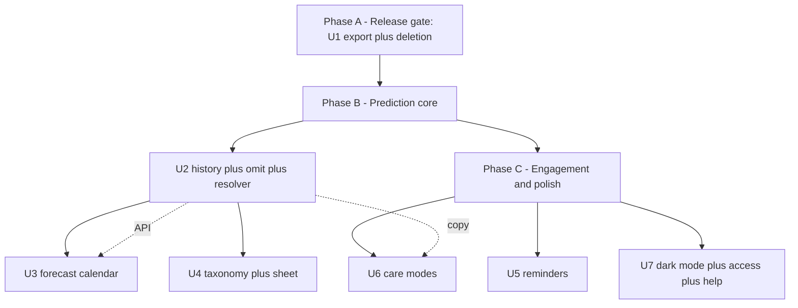
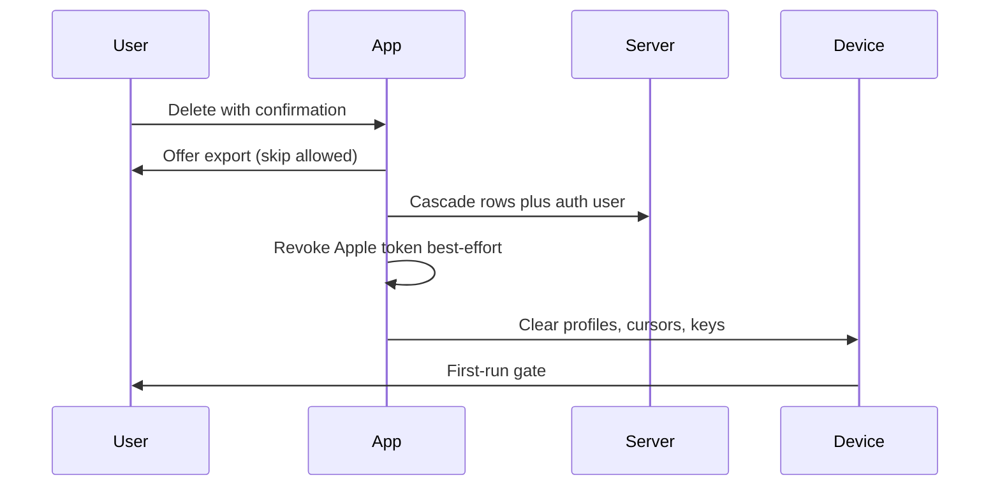

# Target-State Roadmap - Plan

## Goal Capsule

- **Objective:** The operator plans months ahead from the calendar, logs in seconds, trusts estimates after irregular cycles, gets useful nudges, hands the phone to a teen without worry, exports for a clinician, deletes the account in-app, and reads the app day or night.
- **Means:** One phased roadmap plan over seven workstreams with seven public-issue payloads (KTD1).
- **Authority:** PRIVACY.md (no fertility scope, local-first) outranks AGENTS.md (gates, migration flow), which outranks this plan on mechanism.
- **Stop conditions:** Stop a unit when its acceptance in the Verification Contract passes; stop the roadmap when the Definition of Done holds.
- **Execution profile:** code; per-workstream worktree and branch per repo rule.
- **Tail ownership:** ce-work or a human implementer, unit by unit in phase order.

---

## Product Contract

### Summary

This plan ships seven workstreams toward the generic target state in three phases: the release gate first (export plus in-app deletion), then the prediction core (history with omit, forecast calendar, richer logging), then engagement and polish (smart reminders, care modes, dark mode with accessibility and help).

### Problem Frame

Lunarlog today is a minimal honest tracker: one light theme, one-month calendar with no future navigation, seventeen fixed tags, a mean-of-three predictor that needs three clean cycles, one-shot reminders, and no history view, export, deletion, modes, or help content. Each gap alone costs trust; together they keep the app below the target state where planning, logging, and reviewing feel effortless. Three open issues already cover the edges of reminders, deletion with export, and sharing, so the plan expands those threads instead of duplicating them. The repo is public, so every public word in issues and UI copy stays generic.

### Key Decisions

- **Public wording stays generic.** Issue bodies, labels aside, never name the reference app; "target state" is the only comparison language. Governs R1, R2, R3, R4, R5, R6, R7, R8, R9, R10, R11, R12, R13, R14, R15, R16, R17.
- **Issue strategy is expand-in-place plus new-for-gaps.** The open reminders, deletion/export, and sharing issues grow to full scope; the other four workstreams get new issues.
- **Lead slice is the release gate.** Export plus deletion ships first because submission is blocked without deletion. Governs R13, R14.

### Requirements

**Forecast calendar and history**

- R1. The calendar navigates twelve months forward and renders predicted bleed bands with cycle-day numerals for the first predicted cycle.
- R2. The calendar overlays PMS and cramps badges from fixed offsets and filters days by up to three symptom layers defaulting to the profile's most-used tags.
- R3. Future cells stay non-loggable and explain predicted state on tap without opening the log sheet.
- R4. History lists reverse-chron cycles with lengths and supports one-tap omit-from-average with outlier auto-flag.
- R5. The predictor exposes confidence (high, learning, irregular) and plain-language cycle summaries derived from averaged lengths and logging streak.
- R6. Late state resolves through log-it, skip-cycle, or remind-in-three-days, with skip-cycle feeding the same omit flag per R4.

**Logging taxonomy**

- R7. The log sheet groups tags into collapsible searched clusters while preserving existing codes.
- R8. Profiles hold a custom-tag registry seeded with the defaults and synced opaquely; unknown codes render as text and never drop.
- R9. The log sheet pre-fills likely flow and tags on empty dates only; a tap is always required to save and saved entries are never overwritten by suggestions.

**Reminders and modes**

- R10. Reminders configure per type with lead-days, time, profile routing, and quiet hours; firing follows predictor state transitions.
- R11. Notification actions log dated entries idempotently through the device-credential gate with neutral labeling.
- R12. Care modes (standard, teen, caregiver, irregular) change vocabulary, defaults, and reminder presets prospectively per profile.

**Export, deletion, polish**

- R13. Export produces CSV, a one-page PDF summary, and JSON for the selected profile through the system share sheet.
- R14. Account deletion offers export first, runs online with confirmation, cascades server rows, revokes the Apple token on a best-effort basis, and resets the device to first-run.
- R15. The app follows the system dark mode with a dark scheme built on the existing seed tokens.
- R16. Logging and calendar surfaces stay operable at 200 percent text scale with a screen reader.
- R17. Contextual offline help cards answer the question on the screen that links them.

### Actors

- A1. Operator and caregiver: configures, logs (including for a dependent), exports, deletes.
- A2. Dependent minor: views and logs own profile under custodian rules; never reaches another profile's data.

### Key Flows

- F1. Log and confirm
  - **Trigger:** Operator taps a selectable calendar cell.
  - **Steps:** Sheet opens with existing entry or suggestions; operator picks flow and tags; save upserts; streams refresh prediction, overview, calendar.
  - **Covered by:** R7, R8, R9.
- F2. Reminder action write
  - **Trigger:** Scheduled reminder fires for a profile.
  - **Steps:** Operator taps a neutral action; gate unlocks; dated entry upserts idempotently; late window replans.
  - **Covered by:** R10, R11.
- F3. Late resolution
  - **Trigger:** Predictor passes estimate plus grace with no log.
  - **Steps:** Overview offers log-it, skip-cycle, or remind-in-three-days; skip-cycle sets the omit flag; recompute follows.
  - **Covered by:** R4, R6.
- F4. Export before delete
  - **Trigger:** Signed-in operator opens deletion.
  - **Steps:** Flow offers export with skip; online confirmation; server cascade; Apple revocation best-effort; device resets to first-run.
  - **Covered by:** R13, R14.

### Acceptance Examples

- AE1. When the operator omits the outlier cycle, the next estimate moves and the false late banner clears. Covers R4.
- AE2. When the device is offline, deletion refuses with retry copy and removes nothing. Covers R14.
- AE3. When a notification action fires twice for one date, one entry exists with the last-tapped values. Covers R11.

### Success Criteria

- Submission unblocks: deletion plus export ships with cascade proof.
- Each workstream is demoable on a phone without a laptop.
- Quality gates stay green on every workstream branch.

### Scope Boundaries

- Deferred to Follow-Up Work: remote caregiver push with new server dispatch and store push services; chained numerals beyond the first predicted cycle; QR invite sharing; wearable overlays; a hosted article library.
- Outside this product's identity: fertility windows, ovulation prediction, conception and pregnancy modes, temperature-based ovulation charting.

### Sources

- Open issues on reminders, deletion with export, and sharing (expanded in place per this plan).
- AGENTS.md (gates, migration flow, worktree rule), PRIVACY.md (no-fertility rule, portability promise), docs/ops/supabase-go-live.md (release gate).
- The prioritized gap analysis behind this roadmap is a local-only ideation artifact deliberately kept out of the public repo; it carries no implementation authority beyond what this plan restates.

---

## Planning Contract

### Key Technical Decisions

- KTD1. One roadmap plan feeds seven issue payloads: three in-place expansions plus four new issues (session-settled: user-directed — chosen over seven all-new duplicates: keeps history on existing threads). Conflict call-out: the open reminders thread currently mandates remote push deliverables that cannot ship without sharing backend and store push services, so the expansion narrows it to local-first scope and moves remote dispatch to Deferred to Follow-Up Work.
- KTD2. Omit lives as a device-local exclusion list of cycle starts per profile; the cycle entity is episode start through next start, the open cycle pins to the top and stays omittable-free, outliers reuse the 15 to 60 day window, and confidence maps to high, learning, or irregular from valid count and spread.
- KTD3. Predict-and-confirm is fire-and-forget: corrections save as normal entries, no priors update, suggestions seed empty dates only.
- KTD4. Actions write to the civil date at tap time as upserts; Started maps to medium and Spotting to spotting while Not-yet writes nothing and snoozes late reminders three days; labels stay neutral and the write applies after gate unlock, never while locked.
- KTD5. Deletion offers export non-blockingly with skip, requires online plus typed confirmation, clears local profiles with cursors and re-locks the gate, and attempts Apple revocation only for Apple-linked accounts.
- KTD6. The registry is a per-profile string list seeded with the seventeen defaults; validation accepts registry members; unknown synced codes render raw; entries dedupe case-insensitively with a per-profile cap.
- KTD7. PMS badges cover estimate minus seven through minus one day and cramps minus two through plus two, only under an active estimate; later months show bands without numerals and quiet months show a keep-logging strip.
- KTD8. Tapping a future cell opens a read-only explainer; the future logging lock stays.
- KTD9. Reminder configs persist device-locally; transitions arm on becoming active, becoming late, or estimate shifts over two days; quiet hours shift fires to the next boundary and coalesce same-day duplicates; cap eviction prefers late over upcoming over PMS-watch over log-nudge.
- KTD10. Mode is a per-profile string defaulting to standard; switching applies vocabulary and presets prospectively and replans at the next coordinator pass without touching saved entries.
- KTD11. Export covers live entries for the selected profile with tombstones excluded; JSON carries the entry array plus profile metadata; the PDF is a one-page summary with disclaimer; temp files are deleted after sharing completes.

### High-Level Technical Design





### Sequencing

- Phase A ships first: U1 unblocks submission and is independent of prediction work.
- Phase B runs U2 before U3 and U6: the forecast window and mode copy consume the confidence shape U2 defines. U4 runs alongside U3.
- Phase C runs U5, U6, U7 in any order after Phase B decisions land. One worktree and branch per unit per repo rule.

### Assumptions

- Multi-device omit divergence is accepted in the first version.
- Spread thresholds inside confidence mapping stay provisional until measured against real histories.
- Help content ships as roughly two dozen bundled cards before growing.

### Constraints

- Date-based vocabulary only; no health content in logs or errors.
- Every Drift schema change regenerates the codegen file and extends pgTAP coverage where server-touched.
- No version bump and no review submission until unit U1 deletion ships.
- Work happens in isolated worktrees; the primary checkout stays clean.

### Risks & Dependencies

- New share, CSV, and PDF dependencies need store privacy review on first release.
- The sharing backend needs its composite-key migration before multi-user export scoping; caller-only export holds until then.
- The sixty-notification cap needs the eviction order per KTD9 once profiles multiply.
- Estimate chaining beyond one cycle is cut; accuracy data decides any revisit.

---

## Implementation Units

### U1. Export plus in-app deletion

- **Goal:** The operator keeps a copy and deletes the account without contacting anyone.
- **Requirements:** R13, R14.
- **Dependencies:** None.
- **Files:** lib/app_lifecycle.dart, lib/ui/account/account_section.dart, lib/data/db/db.dart, lib/data/sync/row_codec.dart, new export module under lib/data/export/, supabase/migrations/ plus supabase/tests/ for the deletion RPC, test/ui/device_reset_test.dart, test/data/row_codec_test.dart, new export and deletion tests.
- **Approach:**
  1. Build JSON export first from the codec shape with share-sheet delivery.
  2. Add CSV plus the one-page PDF summary with disclaimer.
  3. Add the server cascade RPC with pgTAP proof plus Apple revocation best-effort.
  4. Wire the client flow per KTD5 and F4.
- **Patterns to follow:** Ordered reset in LunarLogRootState, sign-out dirty-guard copy, kinds-only error taxonomy.
- **Test scenarios:**
  - Export of a seeded profile yields CSV rows matching on-screen entries with codes, notes, and time zones intact.
  - PDF renders counts, average, last six starts, and disclaimer on one page.
  - Deletion removes server rows and the auth user, proven by pgTAP, and the device returns to first-run.
  - Offline deletion refuses and removes nothing (Covers AE2).
  - Deleting an email-only account skips Apple revocation without error.
- **Verification:** Quality gates green; pgTAP suite passes locally; a signed-in test account deletes end to end on a phone build.

### U2. History plus omit plus late resolver

- **Goal:** One bad cycle stops poisoning every future estimate.
- **Requirements:** R4, R5, R6.
- **Dependencies:** None.
- **Files:** lib/domain/prediction/prediction.dart, lib/domain/episodes/episodes.dart, lib/domain/prediction/prediction_service.dart, lib/ui/overview/overview_panel.dart, settings store keys, test/domain/prediction_test.dart, test/domain/episodes_test.dart, test/ui/overview_test.dart.
- **Approach:**
  1. Model the cycle entity and the device-local exclusion list per KTD2.
  2. Add the history list with omit toggle and outlier auto-flag.
  3. Add confidence plus narrative summaries with insufficient-data fallbacks.
  4. Replace the late banner with the three-option resolver per F3.
- **Patterns to follow:** Pure recompute per stream emission; disclaimer on every estimate surface.
- **Test scenarios:**
  - Omitting a 48-day outlier moves the next estimate back and clears the false late flag (Covers AE1).
  - A paused profile with an open cycle over sixty days still resolves through log-it.
  - Confidence reads learning below three valid cycles and irregular on a low valid ratio.
  - Skip-cycle appends the current start to the exclusion list and replans the late window.
- **Verification:** Prediction and overview suites green; manual check on an irregular test profile.

### U3. Forecast calendar

- **Goal:** The operator answers camp-week questions from the calendar.
- **Requirements:** R1, R2, R3.
- **Dependencies:** U2.
- **Files:** lib/ui/logging/month_calendar.dart, lib/domain/prediction/prediction_service.dart, test/ui/logging_test.dart, test/domain/prediction_service_test.dart.
- **Approach:**
  1. Unlock forward navigation to twelve months.
  2. Paint bleed bands plus PMS and cramps badges per KTD7 with numerals on the first cycle.
  3. Add symptom-layer toggles defaulting to the top three used tags.
  4. Keep future cells read-only per KTD8.
- **Patterns to follow:** Per-cell derived flags over the entry stream; theme-driven decoration.
- **Test scenarios:**
  - Swiping six months ahead shows hatched bands distinct from logged fills.
  - Toggling a symptom layer hides and shows matching days.
  - A quiet profile shows the keep-logging strip with no bands.
  - Tapping a future cell opens the explainer and never the log sheet.
- **Verification:** Logging suite green; rendered review on small and large phones.

### U4. Taxonomy plus log sheet

- **Goal:** Logging drops to seconds with room for personal tags.
- **Requirements:** R7, R8, R9.
- **Dependencies:** None; coordinate registry caps with U1 export columns.
- **Files:** lib/ui/logging/day_sheet.dart, lib/domain/tags.dart, lib/data/db/tables.dart, lib/domain/models/day_entry.dart, lib/data/db/storage.dart, lib/data/sync/row_codec.dart, test/domain/tags_test.dart, test/ui/logging_test.dart, test/data/row_codec_test.dart, test/data/db_test.dart.
- **Approach:**
  1. Regroup the seventeen codes into searched clusters without changing codes.
  2. Add the per-profile registry with relaxed validation per KTD6.
  3. Add predict-and-confirm seeding per KTD3.
  4. Extend sync and server checks for registry members where touched.
- **Patterns to follow:** Stable snake_case codes; UI owns display strings; storage refuses oversize notes.
- **Test scenarios:**
  - Search finds a tag by display name and by code.
  - A custom tag saves, survives reload, and renders on a second synced device as raw text.
  - Correcting a suggestion saves exact values with no side effects.
  - Unknown synced codes render without throwing.
- **Verification:** Domain, UI, and codec suites green; migration round-trip on a local Supabase stack where schema-touched.

### U5. Smart reminders

- **Goal:** Nudges arrive for the right profile at the right moment and log in one tap.
- **Requirements:** R10, R11.
- **Dependencies:** U2 for transition states.
- **Files:** lib/data/notifications/scheduling.dart, lib/data/notifications/reminder_coordinator.dart, lib/data/notifications/notification_scheduler.dart, settings store keys, test/data/scheduling_test.dart, test/data/reminder_coordinator_test.dart.
- **Approach:**
  1. Add per-type configs with quiet hours per KTD9.
  2. Fire on predictor transitions with stable per-type identifiers.
  3. Add neutral actions with gate-first idempotent writes per KTD4.
  4. Rewrite the open reminders thread to this scope with remote dispatch deferred (per KTD1).
- **Patterns to follow:** Pure planner feeding the platform adapter; archived profiles drop out; denied permission cancels and hints.
- **Test scenarios:**
  - Two profiles hold different reminder days and times and both fire.
  - Quiet hours shift a morning fire to the boundary instead of dropping it.
  - Double-tapping an action leaves one entry (Covers AE3).
  - Denied permission cancels all and shows the overview hint.
- **Verification:** Notification suites green; lock-screen label review for neutral wording; on-device fire check.

### U6. Care modes

- **Goal:** A teen, a caregiver, and an irregular tracker each see fitting words and defaults.
- **Requirements:** R12.
- **Dependencies:** U2 for narrative copy reuse.
- **Files:** lib/domain/models/profile.dart, lib/ui/profiles/profile_controller.dart, lib/ui/profiles/profile_dialogs.dart, lib/ui/profiles/first_run_screen.dart, lib/ui/overview/overview_panel.dart, test/ui/profiles_test.dart, test/ui/overview_test.dart, test/ui/first_run_test.dart.
- **Approach:**
  1. Add the per-profile mode string defaulting to standard per KTD10.
  2. Variant copy and defaults per mode without touching saved entries.
  3. Reuse U2 confidence strings inside mode variants.
  4. Record the sharing-thread relationship in the open sharing issue (per KTD1).
- **Patterns to follow:** Presentational mapping over isMinor plus settings; disclaimer on every variant.
- **Test scenarios:**
  - Switching to teen hides the options the mode excludes while history stays verbatim.
  - Switching to irregular silences the late banner and rewords the overview.
  - Reminders replan at the next pass with mode presets and no retroactive rewrite.
- **Verification:** Profile and overview suites green; copy review for vocabulary rules.

### U7. Dark mode plus access plus help

- **Goal:** Night logging works for every reader.
- **Requirements:** R15, R16, R17.
- **Dependencies:** None.
- **Files:** lib/app.dart, lib/ui/settings/settings_screen.dart, lib/ui/logging/month_calendar.dart, lib/ui/logging/day_sheet.dart, new bundled help assets, test/ui/settings_test.dart, test/ui/logging_test.dart.
- **Approach:**
  1. Add the dark scheme on existing tokens with system mode.
  2. Pass semantics, contrast, and text-scale over calendar and sheet.
  3. Bundle the contextual help cards with a trigger map.
- **Patterns to follow:** Theme-driven consumers stay untouched; assets stay offline-first.
- **Test scenarios:**
  - System dark mode renders calendar, sheet, and overview without washed-out secondary text.
  - At 200 percent text scale no log-sheet control clips or overlaps.
  - A screen reader distinguishes a predicted badge from a logged bleed.
  - Airplane mode still opens every help card with source and review date.
- **Verification:** UI suites green; manual dark plus large-text plus screen-reader pass on both phone platforms.

---

## Verification Contract

| Check | Proves |
|---|---|
| flutter analyze | Zero analyzer issues on every unit branch |
| flutter test | Unit plus widget suites for touched areas |
| dart run tool/quality_gate.dart | Ninety percent line floor plus per-method complexity gate |
| Supabase local stack with pgTAP suite | Deletion cascade and RLS behavior for U1 |
| Release and debug phone builds | Notifications, share sheet, dark mode, and access on device |
| Advisor lint before migration approval | No security or RLS findings on schema work |

---

## Definition of Done

- Every unit's acceptance scenarios pass with gates green and no abandoned-attempt code left in the diff.
- U1 deletion plus export ships before any version bump or review submission.
- Public text across issues and UI copy carries no reference-app naming.
- Each phase demos on a phone without a laptop.

---

## Appendix

### Issue payloads

Post these verbatim after the plan lands. Three expand existing threads in place; four open new issues. Labels follow repo convention.

**Update 1: open reminders thread — retitle to `feat(notifications): per-type local reminders with log-from-notification actions`.**

```text
## Summary
Rebuild reminders around four local types (period-due, PMS-watch, late nudge, log-nudge) with lead-days, time-of-day, per-profile routing, and quiet hours. Firing follows predictor state transitions. Notification actions log dated entries idempotently through the device-credential gate with neutral labeling.

## Scope
- Per-type configs persisted on-device with quiet-hours shifting (never silent drops).
- Stable per-type identifiers under the existing notification cap with documented eviction order.
- Neutral action labels; no health detail on the lock screen; writes apply after unlock.
- Prior remote-push deliverables (server dispatch, scheduled server checks, store push) move to follow-up work until sharing and push services land.

## Acceptance
- Two profiles hold different schedules and both fire correctly.
- Double-tapped actions leave exactly one entry.
- Denied permission cancels everything and shows the in-app hint.
```

**Update 2: open deletion thread — extend to full export scope.**

```text
## Summary
Deletion stays the release gate and export grows to CSV plus a one-page PDF summary alongside JSON, all generated on-device and delivered through the share sheet.

## Scope
- Export covers live entries for the selected profile; tombstones excluded; temp files deleted after sharing.
- PDF is a summary (counts, average, recent starts) with disclaimer, not a full history dump.
- Deletion offers export first with skip, requires online plus typed confirmation, cascades server rows, revokes Apple tokens best-effort, and resets the device to first-run.

## Acceptance
- pgTAP proves the cascade removes rows and the auth user.
- Offline deletion refuses and removes nothing.
- The device returns to first-run with cursors cleared.
```

**Update 3: open sharing thread — append the presentational half.**

```text
## Scope addition
Care modes (standard, teen, caregiver, irregular) ship as the presentational half of family access: vocabulary, defaults, and reminder presets per profile, prospective only, with no schema change. Backend sharing phases unchanged and land first; modes consume roles without waiting on them.
```

**New issue A: `feat(calendar): twelve-month forecast with symptom layers`.**

```text
## Summary
Navigate twelve months ahead with predicted bleed bands, PMS and cramps badges, cycle-day numerals on the first predicted cycle, and symptom-layer filters defaulting to the profile's most-used tags.

## Scope
- Past stays factual; future renders hatched as estimates with a keep-logging strip when no active estimate exists.
- Bands derive from fixed offsets off the estimate; numerals never chain across months.
- Future cells open a read-only explainer and never the log sheet.

## Acceptance
- Six months ahead shows bands distinct from logged fills.
- Layer toggles hide and show matching days.
```

**New issue B: `feat(logging): grouped picker with custom-tag registry`.**

```text
## Summary
Group the fixed tags into searched clusters and add a per-profile custom-tag registry seeded with the defaults, synced opaquely. The sheet pre-fills likely values on empty dates and always requires a tap to save.

## Scope
- Existing codes unchanged; validation accepts registry members; unknown synced codes render as text.
- Suggestions never overwrite saved entries and feed no learning loop.
- Registry caps per profile with case-insensitive dedupe.

## Acceptance
- Custom tags survive reload and render on a second device.
- Correcting a suggestion saves exact values with no side effects.
```

**New issue C: `feat(history): cycle history with omit-from-average`.**

```text
## Summary
A reverse-chron cycle list with one-tap omit, outlier auto-flag, confidence labels, plain-language summaries, and a three-option late resolver feeding the same omit flag.

## Scope
- Omit is a device-local exclusion list; the open cycle pins to the top and stays omittable-free.
- Confidence maps from valid count and spread; summaries fall back gracefully with thin data.
- Skip-cycle in the resolver appends the current start to the exclusion list.

## Acceptance
- Omitting the outlier moves the next estimate and clears the false late flag.
```

**New issue D: `feat(design): dark mode with access pass and offline help`.**

```text
## Summary
Follow system dark mode on existing tokens, make logging and calendar operable at large text with a screen reader, and bundle contextual offline help cards.

## Scope
- Theme consumers stay untouched; secondary text holds contrast in both schemes.
- Forecast badges expose semantics distinct from logged bleeds.
- Cards are bundled, offline-first, each with source and review date.

## Acceptance
- Dark plus 200 percent text plus screen reader leaves every control operable.
- Every card opens in airplane mode.
```
