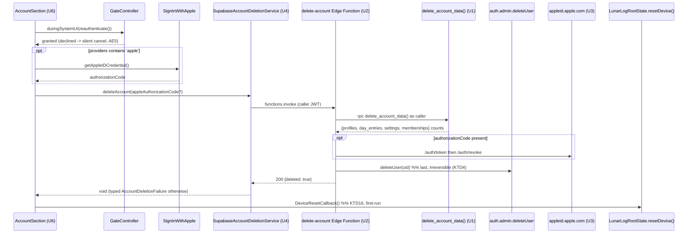

# feat: In-app account deletion and JSON export (App Store 5.1.1(v) release gate)

IDs in this document are plan-local and cited elsewhere with an `#17` prefix
(`#17 R1`, `#17 KTD2`, `#17 U4`), matching the convention the accounts plan
(`docs/plans/2026-09-02-001-feat-supabase-auth-cloud-sync-plan.md`) and the
social-logins plan (`#2`) already use.

---

## Goal Capsule

A signed-in operator can, entirely in-app: (a) export their profiles and day
entries as a JSON file through the platform share sheet, and (b) delete their
account — server rows gone, `auth.users` row gone, Apple token revoked, and the
device returned to first-run through the existing ordered `resetDevice()`.
Shipping this clears the release gate recorded in
`docs/ops/supabase-go-live.md` (no `version:` bump, no `submit_for_review`
dispatch of `ios-release.yml` until deletion exists), because App Store
guideline 5.1.1(v) makes in-app deletion a submission blocker once account
creation exists (PR #16).

---

## Problem Frame

The app now creates accounts (email/password, Google, Apple, passwordless), but
offers no way to remove one. Three consequences:

1. **Release blocker.** Guideline 5.1.1(v) blocks the first App Store review
   submission. The gate is written into `docs/ops/supabase-go-live.md` and into
   AGENTS.md's "Release gate" bullet.
2. **False store declarations.** Play Console Data safety and the App Store
   privacy details both claim "user can request deletion"; today that is only
   true by contacting the operator through the Supabase dashboard.
3. **Apple's own requirement.** An app using Sign in with Apple must revoke the
   Apple token when the account is deleted. The app currently signs in with
   `signInWithIdToken` and discards the Apple `authorizationCode`, so nothing
   is retained that could be revoked later.

Deleting is destructive and irreversible for a family's health history, so an
export path must exist first — and the local encrypted store already holds
everything the account holds, which makes the export cheap and offline-capable.

---

## Requirements

| ID | Requirement |
|---|---|
| R1 | A signed-in operator can delete their account from the account section of Settings without contacting anyone. |
| R2 | The confirmation states exactly what is removed: the server rows, the account itself, and this device's local data — and offers export first. |
| R3 | Deletion is guarded by a fresh device-credential check before any server call, the same discipline as adding a sign-in method (`#2 KTD5`). |
| R4 | Server side removes the caller's `profiles`, `day_entries`, `settings`, `profile_guardians` and `guardian_invitations` rows, then removes the `auth.users` row. Scoped to the caller; callable only by the authenticated owner. |
| R5 | When the account carries an Apple identity, the Apple token is revoked as part of deletion. |
| R6 | After the server confirms, the client runs the existing ordered device reset (`resetDevice()`, `KTD16`) so the install returns to first-run. |
| R7 | Deleting a *non-owner* guardian (caregiver / co-parent / viewer on someone else's profile) removes their membership and their own owned data, and must not delete the other guardian's profiles or entries. |
| R8 | A signed-in operator can export a JSON file of their profiles and day entries and hand it to the platform share sheet on iOS and Android. |
| R9 | The export contains only data reachable by the caller, carries a schema version, and contains no secrets, tokens, ids of other accounts, or Supabase internals. |
| R10 | Every failure path is typed and surfaced with app-authored copy — no provider text, no server message, nothing that could carry health data into a crash report (mirrors `AuthFailure` / `SharingFailure`, R18 of the accounts plan). |
| R11 | An unconfigured build (no Supabase defines) and web builds show neither tile, exactly as the rest of the account section behaves (`KTD11`). |
| R12 | A deletion that fails part-way must not leave the device reset over a live account, and must be safely retryable. |
| R13 | `docs/ops/supabase-go-live.md`'s release gate, dashboard prerequisites, and device checklist reflect the shipped feature; the store privacy declarations become true. |

### Acceptance Examples

| ID | Example |
|---|---|
| AE1 | Signed-in operator taps **Delete account** → device credential prompt → confirmation naming server rows + account + this device's data, with an **Export first** action → confirm → server rows and `auth.users` row are gone → app is at first-run. |
| AE2 | pgTAP: after `delete_account_data()` runs as user A, zero `profiles`, `day_entries`, `settings`, `profile_guardians` and `guardian_invitations` rows remain for A, and user B's rows are untouched. |
| AE3 | pgTAP: user B is a caregiver on user A's profile. B deletes; A's profile and entries survive, B's `profile_guardians` row is gone, and A's entries logged by B have `logged_by_user_id` null. |
| AE4 | Operator taps **Export my data** → a `lunarlog-export-<timestamp>.json` file reaches the share sheet; its contents parse to the documented schema and list only that operator's profiles and entries. |
| AE5 | Declining the device credential cancels deletion silently — no server call, no copy, no reset (same shape as a dismissed provider picker, `#2 KTD8`). |
| AE6 | The Edge Function returns 401 for a request with no or an invalid `Authorization` header, and never accepts a user id from the request body. |

---

## Key Technical Decisions

**KTD1 — Edge Function, not a `security definer` RPC alone, is the deletion entry point.**
Removing the `auth.users` row needs the service role (`auth.admin.deleteUser`),
and Apple revocation needs an outbound HTTPS call with an ES256-signed client
secret; neither is reachable from SQL. The function is thin: authenticate the
caller from the `Authorization` header, call one SQL function for the rows,
revoke Apple, then delete the user.

**KTD2 — The row deletion lives in a `security definer` SQL function (`public.delete_account_data()`), not in the Edge Function's TypeScript.**
This is what makes the cascade provable by pgTAP in the existing `db-tests`
CI job (AE2, AE3) instead of only by a manual smoke test, and it keeps the
deletion semantics next to the RLS policies they mirror. It also stops the plan
from depending on FK-cascade configuration remaining correct: the deletes are
explicit, and the `on delete cascade` from `auth.users` is a second line of
defence rather than the mechanism.

**KTD3 — The Apple token is revoked from a *fresh* authorization code obtained at deletion time, not from a stored Apple refresh token.**
The app signs in with `signInWithIdToken` and never exchanges the
`authorizationCode`, so no Apple refresh token exists anywhere today. The two
options are (a) start capturing and storing an Apple refresh token server-side
at every sign-in, or (b) re-run `SignInWithApple.getAppleIDCredential()` during
the delete flow, ship the one-time `authorizationCode` to the Edge Function,
exchange it for a refresh token and revoke it immediately. (b) is chosen: it
stores no long-lived third-party credential at rest for an app that holds
minors' health data, needs no schema, and the extra Apple dialog is acceptable
inside an explicitly destructive flow. Rejected: (a) — a new secret at rest,
a new table, and a migration for every existing Apple user.

**KTD4 — Ordering inside the Edge Function is rows → Apple revoke → `auth.users`.**
The user row goes last because it is the only irreversible, non-retryable step;
while it exists, a caller whose revoke or row delete failed can retry the whole
call idempotently. Apple revocation precedes user deletion so the identity is
still readable, and a revoke failure is reported as a typed failure rather than
being swallowed — the operator must not be told "deleted" when Apple still
holds a live grant.

**KTD5 — Export reads the local encrypted Drift store, not the server.**
The local store is the app's source of truth (local-first) and already holds
every profile and entry the account holds. Exporting locally works offline, at
the lock screen's trust level, without a second RLS surface to review, and it
is exactly the data the operator is about to lose to `resetDevice()`.
Rejected: a server-side export endpoint — a second data-egress surface for no
additional content.

**KTD6 — The export payload is built by a pure function in `lib/domain/export/`, and only the file-write + share step touches platform channels.**
`lib/domain` must stay pure Dart (enforced by `test/architecture/layering_test.dart`),
which makes the serializer fully unit-testable and keeps the untestable
platform adapter to a handful of lines in `lib/data/export/`, consistent with
`google_sign_in_client.dart` and `notification_scheduler.dart`.

**KTD7 — Deletion reuses the existing device-credential ceremony and the one device-reset path.**
The delete flow calls `GateController.duringSystemUi()` around
`GateController.reauthenticate()` exactly as `_addMethod` in
`lib/ui/account/account_section.dart` does (`#65 U2`, `#2 KTD5/KTD6`), and ends
in the `DeviceResetCallback` already provided by `LunarLogRootState`
(`KTD16`) — no second destructive path is introduced.

**KTD8 — The deletion service is constructed in production wiring in the same place `SupabaseSharingService` is.**
`LunarLogRootState._startSyncEngine` builds the production sharing service when
a `SupabaseClient` exists; the deletion service is built alongside it and
provided down the tree. This is a direct response to issue #76 / PR #83, where
a service existed and was tested but was never wired into the running app; the
wiring gets its own test (see U4 test scenarios).

---

## High-Level Technical Design

Export is a much shorter path: `ProfilesRepository.list()` +
`DayEntriesRepository.listForProfile()` → `buildAccountExport()` (pure) →
`AccountExportWriter` (temp file via `path_provider`) → share sheet.

---

## Implementation Units

### U1. `delete_account_data()` migration and pgTAP coverage

**Goal:** One `security definer` SQL function that removes every row the
calling user owns, plus the tests that prove the cascade and the
non-owner-guardian boundary.

**Requirements:** R4, R7; AE2, AE3.

**Dependencies:** none.

**Files:**
- `supabase/migrations/20260905100000_account_deletion.sql` (new — timestamp must sort after `20260905090000_close_guardian_revocation_bypass.sql`)
- `supabase/tests/account_deletion_test.sql` (new)
- `AGENTS.md` (schema and pgTAP counts in the "Supabase Backend" section — may instead land in U7 if it is the only doc touch)

**Approach:**
1. `create function public.delete_account_data() returns jsonb language plpgsql security definer set search_path = ''` — mirroring the shape of `create_guardian_invitation` / `revoke_guardian` in `20260904020000_sync_push_and_invitations.sql`.
2. Raise `insufficient_privilege` when `(select auth.uid())` is null. Take no parameters: the caller is the subject, so no id can be passed in (AE6).
3. Delete in FK-safe order for rows owned by `v_uid`: `day_entries`, `guardian_invitations` (`created_by`), `profile_guardians` (`user_id`), `profiles`, `settings`. Deleting a `profiles` row cascades that profile's entries and every guardian's membership on it — that is intended for an owner and unreachable for a non-owner (R7), because a non-owner owns no `profiles` row for that profile.
4. Return a `jsonb` object of per-table deleted counts (via `get diagnostics`) so the Edge Function can log a shape without logging content.
5. `grant execute on function public.delete_account_data() to authenticated;` and no grant to `anon`.
6. Header comment states, per the repo's standing rule, that merged migrations are never edited in place.

**Patterns to follow:** the SQL style, `search_path = ''`, fully-qualified
`public.` references, `errcode` choices, and the long explanatory header of
`supabase/migrations/20260905090000_close_guardian_revocation_bypass.sql`.
Test style follows `supabase/tests/guardian_revocation_bypass_test.sql` and the
inlined helper subset in `supabase/tests/000-setup.sql` (no `dbdev`, no
network).

**Test scenarios (pgTAP):**
- The function exists, is `security definer`, has `search_path = ''`, and is executable by `authenticated` but not `anon`.
- Called with no JWT (`auth.uid()` null), it raises `insufficient_privilege` and deletes nothing.
- Covers AE2. User A owns 2 profiles with 5 entries, 3 settings rows, 1 outstanding invitation. After A calls it: zero rows for A in all five tables.
- Covers AE2. User B's profiles, entries, settings and memberships are byte-identical before and after A's deletion.
- Covers AE3. B is an accepted caregiver on A's profile; B calls it → A's profile and entries still exist, B's `profile_guardians` row is gone, and A's entries stamped `logged_by_user_id = B` now read null (the existing `on delete set null` FK, exercised through the `auth.users` delete in U2's manual smoke — assert the membership half here).
- A revoked (`status = 'revoked'`) membership row for the caller is also removed.
- Calling twice in a row succeeds and reports zero counts the second time (idempotent, supports KTD4's retry story).
- The returned `jsonb` carries the expected keys with correct counts.

**Verification:** `npx supabase@2.116.0 db reset --local` then
`npx supabase@2.116.0 test db --local` passes with the new file counted; the
`db-tests` CI job is green.

---

### U2. `delete-account` Edge Function

**Goal:** The authenticated HTTP entry point that runs U1's function, triggers
U3's revocation, and removes the `auth.users` row last.

**Requirements:** R4, R5, R12; AE1, AE6.

**Dependencies:** U1 (calls its RPC), U3 (imports the revoke helper — implement U3's module signature first or stub it and land them together).

**Files:**
- `supabase/functions/delete-account/index.ts` (new)
- `supabase/functions/_shared/cors.ts` (new, only if a preflight response is needed for the `functions.invoke` path)
- `supabase/config.toml` (new `[functions.delete-account]` block with `verify_jwt = true`)

**Approach:**
1. Read the `Authorization` header; with none, return 401 without touching the database. Build a user-scoped Supabase client from that header (anon key + `global.headers`) and a separate service-role client from `SUPABASE_SERVICE_ROLE_KEY` (injected by the platform).
2. Resolve the caller with `auth.getUser()` on the user-scoped client. The request body carries **only** an optional `appleAuthorizationCode`; a user id in the body is ignored, never trusted (AE6).
3. `rpc('delete_account_data')` on the **user-scoped** client, so the function runs as the caller and RLS/`auth.uid()` semantics hold.
4. If the caller's identities include `apple` and a code was supplied, call U3's `revokeAppleToken`. A revoke failure returns a typed `apple_revoke_failed` error and stops **before** the user delete (KTD4) — the caller can retry.
5. `auth.admin.deleteUser(user.id)` on the service-role client, last.
6. Respond `{ ok: true }` or `{ ok: false, code: <stable string> }` with an appropriate status. Never echo Supabase or Apple error text, tokens, emails, or row content into the response or the log; log the error *type* and U1's counts only (mirrors the `debugPrint('… (${error.runtimeType})')` discipline in `lib/`).

**Execution note:** this is the first Edge Function in the repo — there is no
Deno tooling in CI yet. Prove it with `npx supabase@2.116.0 functions serve` +
`curl` against the local stack (no header → 401; valid header → rows gone,
user gone) before wiring the client, and record the smoke steps in U7's
runbook.

**Patterns to follow:** stable, fieldless error codes as in
`lib/domain/sharing/sharing_service.dart`'s `SharingFailure` family, so U4 can
map them without parsing prose.

**Test scenarios:**
- Manual local smoke, recorded in `docs/ops/supabase-go-live.md`: no `Authorization` header → 401, nothing deleted; forged/expired JWT → 401; valid JWT → U1's rows gone, `auth.users` row gone, response `{ ok: true }`.
- Body containing another user's id is ignored — that user's rows survive (AE6).
- With `appleAuthorizationCode` omitted for a non-Apple account, deletion completes with no Apple call.
- A simulated Apple revoke failure leaves the `auth.users` row in place and returns `apple_revoke_failed` (KTD4).
- Automated Deno coverage is deferred — see Open Questions Q2.

**Verification:** local `functions serve` smoke passes each scenario above;
`npx supabase@2.116.0 functions deploy delete-account --project-ref <ref>`
succeeds from the U7 workflow step.

---

### U3. Apple token revocation module

**Goal:** Exchange a one-time Apple authorization code for a refresh token and
revoke it, with the client secret built in-process from the Apple signing key.

**Requirements:** R5; KTD3.

**Dependencies:** none (imported by U2).

**Files:**
- `supabase/functions/_shared/apple_revoke.ts` (new)

**Approach:**
1. Build the Apple client secret: an ES256 JWT with `iss = APPLE_TEAM_ID`,
   `aud = https://appleid.apple.com`, `sub = APPLE_CLIENT_ID` (the bundle id
   `com.wjdavis5.lunarlog`, which is also the Supabase Apple provider's client
   id), `kid = APPLE_KEY_ID`, short expiry, signed with `APPLE_PRIVATE_KEY`
   (the `.p8` contents) using Deno's Web Crypto.
2. `POST https://appleid.apple.com/auth/token` with
   `grant_type=authorization_code` and the code → `refresh_token`.
3. `POST https://appleid.apple.com/auth/revoke` with that token and
   `token_type_hint=refresh_token`.
4. Return a discriminated result (`ok` / `misconfigured` / `apple_rejected` /
   `network`); never return or log Apple's response body, the code, or either
   token.
5. Missing Apple env vars resolve to `misconfigured`, which U2 surfaces as a
   typed failure rather than silently skipping revocation.

**Test scenarios:**
- Manual: an end-to-end delete of a throwaway Apple-signed-in account succeeds and the app no longer appears under the Apple ID's "Sign in with Apple" list (recorded as a U7 device-checklist item).
- Missing `APPLE_PRIVATE_KEY` → `misconfigured`, no network call, no user deleted.
- An Apple 400 (`invalid_grant`, e.g. a reused code) → `apple_rejected`, no user deleted.
- Automated Deno coverage deferred — Open Questions Q2.

**Verification:** the Apple device-checklist item in
`docs/ops/supabase-go-live.md` passes on a real iPhone build.

---

### U4. Client deletion seam, Supabase implementation, and production wiring

**Goal:** A pure-Dart `AccountDeletionService` interface with typed failures, a
Supabase implementation over `functions.invoke`, and — critically — the
production wiring that makes it reachable in the running app.

**Requirements:** R4, R5, R10, R11, R12; KTD8.

**Dependencies:** U2 (response contract).

**Files:**
- `lib/domain/account/account_deletion_service.dart` (new — interface + sealed `AccountDeletionFailure` family)
- `lib/data/account/supabase_account_deletion_service.dart` (new)
- `lib/app_lifecycle.dart` (build it beside `SupabaseSharingService` in `_startSyncEngine`; clear it in `_disposeSyncEngine`)
- `lib/app.dart` (provide it into the tree next to the existing services)
- `test/domain/account/account_deletion_models_test.dart` (new)
- `test/data/account/supabase_account_deletion_service_test.dart` (new)
- `test/support/fake_supabase_client.dart` (extend to stub `functions`)
- `test/ui/app_auth_provider_test.dart` (wiring assertion, alongside the existing provider tests)

**Approach:**
1. Domain: `Future<void> deleteAccount({String? appleAuthorizationCode})`, plus
   `AccountDeletionFailure` variants `network`, `unauthorized`,
   `appleRevokeFailed`, `unknown` — fieldless, `==` by runtime type, exactly
   like `AuthFailure` and `SharingFailure`. No Flutter, no Supabase types cross
   this file (layering guard).
2. Data: invoke `delete-account` with the optional code in the body, map the
   response/exception to a failure with a `_mapError` shaped like
   `SupabaseSharingService._mapError` (`SocketException` /
   `http.ClientException` → network; `FunctionException` status 401 →
   unauthorized; the function's stable `code` string → the matching variant;
   everything else → unknown).
3. Wiring: construct in `LunarLogRootState._startSyncEngine` where
   `SupabaseSharingService` is constructed (a `SupabaseClient` is in scope
   there), null it in `_disposeSyncEngine`, and pass it into `LunarLogApp` for
   provision — following the same injectable-override pattern the sharing
   service uses so tests can substitute a fake.

**Execution note:** issue #76 / PR #83 shipped a service that was tested but
never wired; write the wiring assertion (production tree exposes a non-null
service when a client is present, and none when it is absent) before or with
the implementation.

**Patterns to follow:** `lib/domain/sharing/sharing_service.dart` (interface +
failures), `lib/data/sharing/supabase_sharing_service.dart` (error mapping),
`LunarLogRootState._startSyncEngine` / `_disposeSyncEngine` (lifecycle).

**Test scenarios:**
- A successful invoke completes normally and passes the Apple code through in the body when supplied, and omits it when null.
- `FunctionException` with status 401 → `AccountDeletionFailure.unauthorized`.
- A response body carrying `code: 'apple_revoke_failed'` → `appleRevokeFailed`.
- `SocketException` and `http.ClientException` → `network`.
- An unrecognized error → `unknown`; no error text is retained on the failure object.
- Failure equality/`hashCode` behave by runtime type (mirrors `test/ui/auth_failure_copy_test.dart`'s expectations for `AuthFailure`).
- Covers KTD8. With a `SupabaseClient` present, the built app tree provides a non-null `AccountDeletionService`; with none, it provides null and the delete tile is absent (R11).

**Verification:** `flutter analyze` clean, `flutter test` green,
`test/architecture/layering_test.dart` still passes (domain stays pure Dart).

---

### U5. JSON export builder and writer

**Goal:** A deterministic, versioned JSON document of the caller's profiles and
entries, written to a temp file and handed to the share sheet.

**Requirements:** R8, R9; AE4; KTD5, KTD6.

**Dependencies:** none.

**Files:**
- `lib/domain/export/account_export.dart` (new — pure builder + schema version constant)
- `lib/data/export/account_export_writer.dart` (new — temp file via `path_provider`, share via `share_plus`)
- `pubspec.yaml` (add `share_plus`)
- `tool/quality/exclusions.dart` (add the writer as a reviewed platform-adapter exclusion, with the same style of justification comment as `lib/data/auth/google_sign_in_client.dart`)
- `test/domain/export/account_export_test.dart` (new)

**Approach:**
1. `buildAccountExport({required List<Profile> profiles, required Map<String, List<DayEntry>> entriesByProfile, required DateTime exportedAt})` returns a `Map<String, Object?>` with `schemaVersion`, `exportedAt` (UTC ISO-8601), `app` (name + version string passed in, not read from a plugin), `profiles`, and per-profile `dayEntries`.
2. Deterministic ordering (profiles by id, entries by `localDate`) so two exports of the same data are byte-identical and the test can assert on the encoded string.
3. Include only domain fields already modelled in `lib/domain/models/`; explicitly exclude sync bookkeeping (`server_version`, `user_id`, `logged_by_user_id`, guardian ids) — the export is the family's data, not the sync protocol's (R9).
4. Writer: `jsonEncode` with an indent, write `lunarlog-export-<yyyyMMdd-HHmmss>.json` under the temp directory, hand the path to the share sheet, and delete the temp file after the share completes.
5. The archived/soft-deleted question is settled in Assumptions A3.

**Patterns to follow:** the pure-domain/thin-adapter split used by
`lib/domain/notifications/` vs `lib/data/notifications/notification_scheduler.dart`.

**Test scenarios:**
- Covers AE4. A two-profile, five-entry fixture produces the documented top-level keys, correct counts, and correct nesting.
- The encoded output is byte-identical across two calls with the same input and a fixed `exportedAt` (determinism).
- No key in the encoded output matches the excluded set (`user_id`, `server_version`, `logged_by_user_id`, `last_modified_by_user_id`, `token`, `email`) — asserted over the encoded string so a nested leak is caught (R9).
- An empty account (no profiles) produces a valid document with an empty `profiles` list, not an error.
- A profile with a note containing quotes, newlines and non-ASCII round-trips through `jsonEncode`/`jsonDecode` unchanged.
- `exportedAt` is serialized in UTC regardless of the input's zone.
- The writer itself is excluded from coverage as a platform adapter; its behaviour is proven by the U7 device checklist, not by `flutter test`.

**Verification:** `flutter test` green; `dart run tool/quality_gate.dart` passes
(the 90% floor and CRAP gate) with the writer's exclusion entry in place.

---

### U6. Account section UI: export tile and delete flow

**Goal:** The two tiles, the confirmation that names every consequence, the
device-credential and Apple ceremonies, and the hand-off to `resetDevice()`.

**Requirements:** R1, R2, R3, R6, R10, R11; AE1, AE4, AE5.

**Dependencies:** U4 (service + provider), U5 (export).

**Files:**
- `lib/ui/account/account_section.dart` (two new tiles + the flows)
- `lib/ui/account/delete_account_dialog.dart` (new, if the confirmation grows past a plain `AlertDialog` — otherwise inline beside `_signOutEverywhere`'s dialog)
- `lib/ui/account/account_export_controller.dart` (new, only if the export needs busy/error state beyond a local `setState`)
- `test/ui/account_deletion_test.dart` (new)
- `test/ui/account_test.dart` (extend: tiles hidden when signed out / unconfigured)
- `test/ui/web_guardrails_test.dart` (extend: neither tile on web)

**Approach:**
1. Render **Export my data** (key `account-export`) and **Delete account** (key `account-delete`, destructive styling) only when `signedIn`, and delete only when an `AccountDeletionService` is provided (R11).
2. Delete flow, in order: `gate.duringSystemUi(...)` wrapping `gate.reauthenticate()` — a declined credential cancels silently with no server call and no copy (AE5, mirrors `_addMethod`); then the confirmation dialog naming *server rows*, *the account*, and *this device's data*, with actions **Cancel** / **Export first** / **Delete account** (R2); then, when `providers.contains(AuthProviders.apple)`, the Apple credential fetch for the authorization code; then `service.deleteAccount(...)`; then `_reset(context)` — the existing helper that pops to the first route and calls the `DeviceResetCallback` (R6, KTD7).
3. **Export first** runs the export and returns the operator to the confirmation rather than proceeding, so the file exists before anything is destroyed.
4. Failures render app-authored copy in an error slot beneath the tile (as `account-link-error` does) — one line per typed failure, with a distinct line for `appleRevokeFailed` explaining the account was **not** deleted and the action can be retried. No reset runs on any failure (R12).
5. One action at a time: the tile is disabled behind a spinner while a call is in flight, matching `_addMethodTile`.

**Patterns to follow:** `_addMethod` / `_reauthenticateAndLink` (system-UI
window + credential + busy state), `_signOutEverywhere` (confirmation dialog
shape and `_reset` hand-off), `authFailureCopy` (typed failure → copy).

**Test scenarios:**
- Covers AE1. Tapping delete with the credential granted and the dialog confirmed calls the service exactly once and then the injected `resetDevice` exactly once, in that order.
- Covers AE5. A declined credential: no service call, no dialog, no reset, no error copy.
- Cancelling the dialog: no service call, no reset.
- **Export first** runs the export, leaves the dialog's decision unmade, and makes no service call.
- With `providers` containing `apple`, the Apple code is fetched and forwarded to the service; without it, the service is called with a null code and no Apple ceremony runs.
- A cancelled Apple dialog aborts deletion silently — no service call, no reset.
- Each `AccountDeletionFailure` variant renders its own copy in the error slot, and `resetDevice` is not called (R12).
- The tile is disabled while the call is in flight; a second tap during the call does nothing.
- Covers R11. Tiles are absent when signed out, absent with no `AuthController` (unconfigured build), and absent on web.
- Covers AE4. Tapping export invokes the injected export collaborator once and surfaces a failure as copy, not an exception.

**Verification:** `flutter test test/ui/` green; the new file keeps
`dart run tool/quality_gate.dart` above the coverage floor and under the CRAP
gate (split helper methods rather than growing one long `_delete`).

---

### U7. Ops, deploy, and documentation

**Goal:** Deploy the Edge Function from CI, provision its secrets, flip the
release gate, and make the store privacy declarations true.

**Requirements:** R13; supports R5 (secrets) and R12 (runbook).

**Dependencies:** U1–U6.

**Files:**
- `.github/workflows/supabase-migrate.yml` (add a `supabase functions deploy delete-account` step after the migration push, inside the same `production` environment)
- `docs/ops/supabase-go-live.md` (release-gate flip; new dashboard/secret prerequisites; deletion + export device-checklist items; the Edge Function local-smoke and deploy runbook; remove deletion/export from "Deferred follow-ups")
- `AGENTS.md` (schema + pgTAP counts, the new `supabase/functions/` surface, the Apple secrets, and the "Release gate" bullet)
- `PRIVACY.md` (how to export and how to delete, and what deletion removes)
- `README.md` (only if it enumerates features or workflows that now change)

**Approach:**
1. Secrets to provision on the `production` environment (values never in the repo, per AGENTS.md's rule): `APPLE_TEAM_ID`, `APPLE_KEY_ID`, `APPLE_CLIENT_ID`, `APPLE_PRIVATE_KEY`. Document them in the credential table with location only.
2. The deploy step mirrors the existing "Check deploy credentials" guard: fail with an actionable `::error::` when an Apple secret is missing, and set the function's runtime secrets with `supabase secrets set` before deploying.
3. Device-checklist additions: delete a throwaway Apple account end-to-end (app disappears from the Apple ID's app list, first-run screen returned); delete a throwaway Google/email account; export on iPhone and Android and open the resulting file; delete while offline (typed network failure, no reset).
4. Flip the release-gate checkbox and rewrite the paragraph to record that deletion shipped in this change, so the `version:` bump and `submit_for_review` dispatch are unblocked. **Do not bump `version:` in this PR** — that is a separate, deliberate release action.

**Test expectation:** none — documentation and workflow configuration. The
workflow change is proven by the first green `supabase-migrate` run after
merge, which is a post-merge deploy verification, not a test.

**Verification:** the go-live doc's release-gate section no longer lists
deletion as pending; a `supabase-migrate` dry run (`workflow_dispatch`) reaches
the deploy step and reports the function deployed.

---

## Verification Contract

Run from the worktree root, in this order:

| Gate | Command | Expectation |
|---|---|---|
| Dependencies | `flutter pub get` | resolves with `share_plus` added |
| Static analysis | `flutter analyze` | zero issues |
| Unit + widget tests | `flutter test` | all green, including the new domain/data/ui tests |
| Layering guard | included in `flutter test` (`test/architecture/layering_test.dart`) | `lib/domain` stays pure Dart; `lib/data` never imports `lib/ui` |
| Quality gates | `dart run tool/quality_gate.dart` | 90% line-coverage floor and per-method CRAP gate pass |
| Mutation (local only) | `dart run tool/mutation_gate.dart` | no surviving mutants in the changed files' mirrors |
| Database | `npx supabase@2.116.0 start -x realtime,storage-api,imgproxy,mailpit,studio,logflare,vector,supavisor` then `db reset --local` then `test db --local` | the pgTAP suite passes, now including `account_deletion_test.sql` (note: `edge-runtime` must **not** be excluded when serving the function locally) |
| Edge Function smoke | `npx supabase@2.116.0 functions serve delete-account` + the `curl` cases in U2 | 401 without a header; rows and user gone with a valid one |
| Advisors | Supabase MCP `get_advisors` (security + performance) against `dleexnnevuuddcgcpztq` | no security or RLS findings, per the pre-approval rule in AGENTS.md |
| Device | the new items in `docs/ops/supabase-go-live.md` "Device checklist" | pass on iPhone and Android with a throwaway account and fabricated profiles only |

---

## Definition of Done

- All seven units are implemented and their test scenarios exist as real tests.
- Every Verification Contract gate above passes locally, and CI (`check` +
  `db-tests`) is green on `issue-17`.
- AE1–AE6 are each demonstrably covered: AE2/AE3 by pgTAP, AE1/AE4/AE5 by
  widget tests, AE6 by the recorded Edge Function smoke.
- No secret value appears in any file, commit, or PR description; the Apple
  secrets are documented by location only.
- `docs/ops/supabase-go-live.md` records deletion as shipped and lists the
  remaining manual store/dashboard steps; `PRIVACY.md` documents both flows.
- `pubspec.yaml`'s `version:` is **not** bumped in this change.

---

## Scope Boundaries

**In scope:** in-app account deletion (client flow, Edge Function, SQL
function, Apple revocation), local JSON export with share-sheet delivery, the
CI deploy step and secrets, and the documentation that clears the release gate.

### Deferred to Follow-Up Work

- Automated Deno test/lint coverage for `supabase/functions/**` in CI (Q2).
- Server-side export (a signed download of the account's rows) — unnecessary
  while the local store is the source of truth (KTD5).
- CSV or PDF export formats; scheduled or automatic backups.
- A grace period / soft-delete window before the account is destroyed.
- Deleting a *profile* (as opposed to the account) from the app.
- Unlinking an individual sign-in method, still deferred from `#2`.

### Not Doing

- Bumping `version:` or dispatching `submit_for_review` — a separate release
  decision that this change merely unblocks.
- Storing an Apple refresh token at rest (explicitly rejected, KTD3).
- Any change to the `sync_push` RPC or the guardian invitation flow.
- Exporting or deleting on web builds (the account section is already absent
  there unless `LUNARLOG_WEB_SYNC=true`; the tiles follow the same rule).

---

## Assumptions

Recorded rather than asked, because this plan was produced headlessly from the
issue text. Each is cheap to reverse during implementation.

- **A1.** The Supabase Apple provider's client id is the bundle id
  `com.wjdavis5.lunarlog` (stated in AGENTS.md), so `APPLE_CLIENT_ID` is that
  same value for the client-secret JWT's `sub`.
- **A2.** `sign_in_with_apple` 8.2.0's `AuthorizationCredentialAppleID`
  exposes `authorizationCode`, and a code obtained during the delete flow is
  exchangeable at Apple's `/auth/token`. Verify at implementation time; if it
  is not, fall back to revoking with the identity token
  (`token_type_hint=access_token`) and record the change as a KTD amendment.
- **A3.** The export includes archived profiles and excludes soft-deleted
  (`deleted_at`) rows — it is a copy of what the operator can see in the app,
  not a copy of the sync log.
- **A4.** Google accounts need no provider-side revocation; only Apple has a
  contractual revoke-on-delete requirement.
- **A5.** `share_plus` is acceptable as a new dependency. If the reviewer
  prefers zero new dependencies, the fallback is writing the file to the
  documents directory and telling the operator where it is — a worse UX that
  still satisfies R8's "export produces a JSON file".

---

## Open Questions

- **Q1.** Does the `production` Supabase access token have permission to
  `functions deploy`? If not, U7's workflow step needs a token with the
  function-deploy scope before the first green run. *(Resolve before merging
  U7; does not block U1–U6.)*
- **Q2.** Should CI gain a Deno step (`deno check` / `deno test`) for
  `supabase/functions/**`? Deferred above; the function is small and smoke-
  tested, but this is the repo's only untested source tree once it lands.
- **Q3.** Should deletion refuse to proceed while the operator is the primary
  guardian of a profile shared with other accepted guardians, or delete it out
  from under them (current plan: delete it, since it is the operator's data and
  R7 only protects the reverse direction)? Worth one product call before U6's
  confirmation copy is finalized.

---

## Risks & Dependencies

| Risk | Impact | Mitigation |
|---|---|---|
| The Edge Function deletes rows but fails before `auth.admin.deleteUser` | Account exists with no data; the operator believes it is gone | KTD4's ordering makes the whole call idempotent and retryable; the client reports the typed failure and does **not** reset (R12) |
| Apple revocation silently skipped (missing secret) | App Store compliance failure after shipping | `misconfigured` is a typed failure, not a silent skip (U3 step 5); the device checklist verifies revocation on a real Apple ID |
| First Edge Function in the repo, no Deno tooling in CI | Regressions land unnoticed | Keep the function thin (KTD1/KTD2 push logic into pgTAP-covered SQL); Q2 tracks the CI gap |
| Destructive path reachable without a credential check | A borrowed unlocked phone can destroy the family's history | R3 + KTD7: the same `duringSystemUi`/`reauthenticate` ceremony as identity linking, tested by AE5 |
| Export leaks sync internals or another account's ids | Privacy regression in a minors'-health app | R9's exclusion list is asserted over the encoded string in U5's tests |
| New UI + service files drop coverage below the 90% floor | CI `check` job fails | Only the platform adapter is excluded (U5); everything else is unit- or widget-tested |

---

## Sources & Research

- GitHub issue: `wjdavis5/lunarlog#17` (scope and acceptance, quoted into R1–R9 and AE1–AE4).
- `docs/ops/supabase-go-live.md` — the release gate, the deferred-follow-ups list, and the device-checklist format this plan extends.
- `docs/plans/2026-09-02-001-feat-supabase-auth-cloud-sync-plan.md` — `KTD11` (unconfigured builds have no account section), `KTD16` (the one device-reset path), R16/R18.
- `docs/plans/2026-09-03-001-feat-social-logins-plan.md` (`#2`) — `KTD5`/`KTD6` (device credential before an identity change; one system-UI window), `KTD8` (a dismissed picker is not a failure).
- `supabase/migrations/20260905090000_close_guardian_revocation_bypass.sql` — SQL style, `security definer` + `search_path = ''` discipline, and the "never edit a merged migration" rule.
- `supabase/migrations/20260903014208_initial_sync_schema.sql` — every user table's `user_id … references auth.users(id) on delete cascade`, which is why the `auth.users` delete is a second line of defence behind U1's explicit deletes.
- `lib/ui/account/account_section.dart`, `lib/app_lifecycle.dart` (`resetDevice`), `lib/data/sharing/supabase_sharing_service.dart` — the three patterns U4 and U6 follow.
- Issues #76 / PR #83 (`test(sharing): cover the real SharingService wiring path`) — the precedent behind KTD8's wiring requirement.
- No external/web research was run for this plan; Apple's `/auth/token` and `/auth/revoke` contract is treated as an implementation-time verification (A2), not as settled fact.
