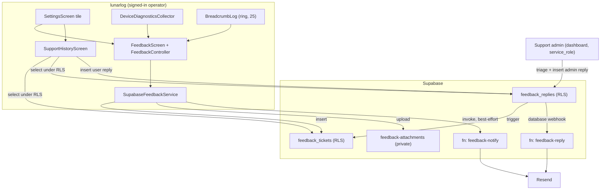
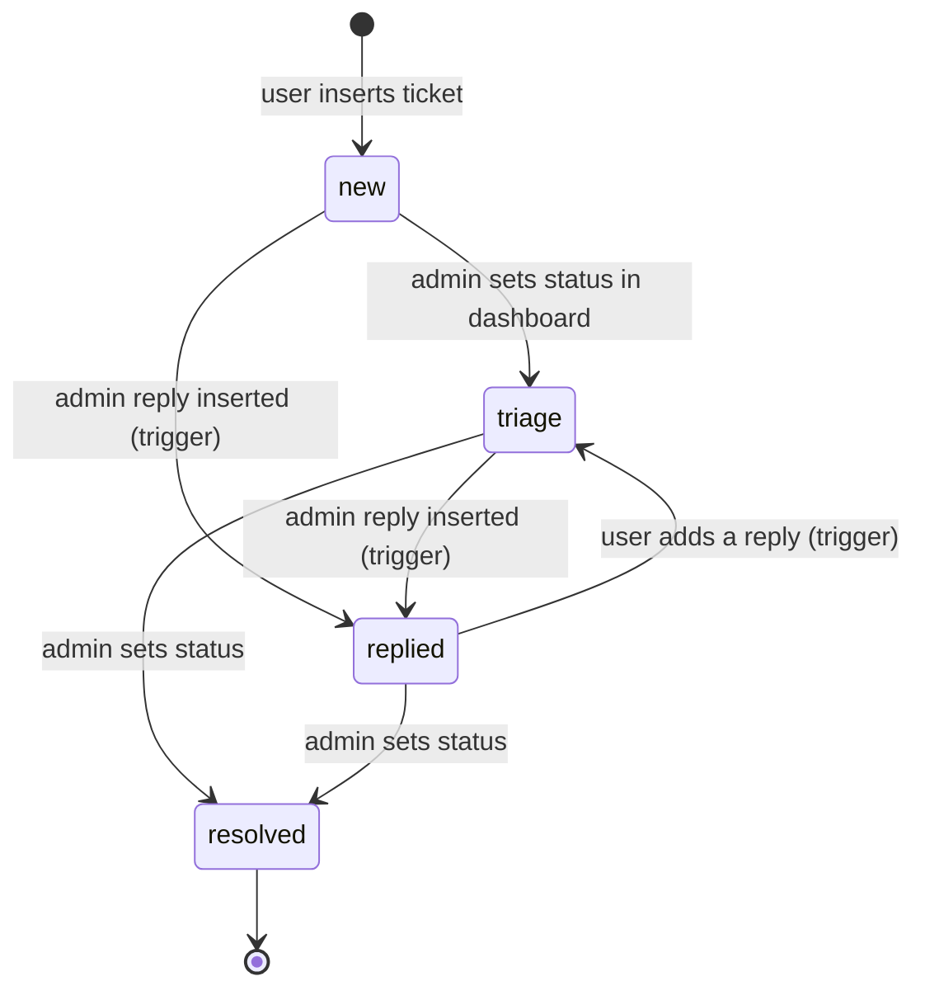
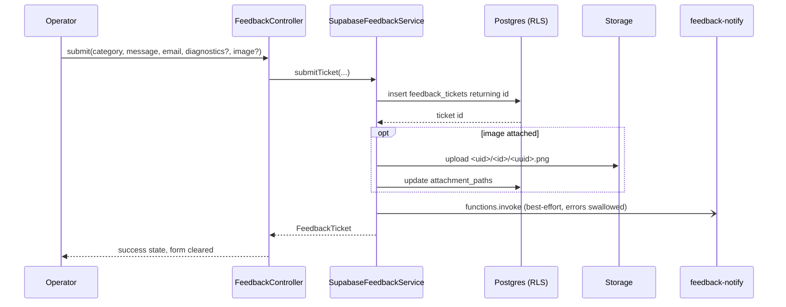

# In-App Feedback, Triage Queue, and Two-Way Replies - Plan

**Target repo:** `lunarlog` (`wjdavis5/lunarlog`). All paths are repo-relative.

---

## Goal Capsule

- **Objective:** Let a signed-in operator send a bug report, idea, question, or general comment from Settings, attach privacy-safe diagnostics and an optional screenshot, and read the operator team's replies inside the app.
- **Means:** Two RLS-protected Postgres tables (`feedback_tickets`, `feedback_replies`), one private Storage bucket, a domain/data service pair in the house three-file shape, a Settings-launched form plus a Support History screen, and two Deno Edge Functions that send the admin alert and dispatch admin replies by email.
- **Authority hierarchy:** GitHub issue #6 owns product intent; this document's Product Contract owns behavioral specification; the Planning Contract owns technical mechanism; Implementation Units own execution detail.
- **Stop conditions:** Stop and surface if a pgTAP test shows one user reading another user's ticket, reply, or attachment; if any health field (`note`, `tags`, `local_date`, `display_name`) can reach `device_info`; or if an unconfigured build (empty dart-defines) gains a network path.
- **Execution profile:** `code`; deep plan spanning migrations, Storage, Edge Functions, a new service layer, and two screens.
- **Tail ownership:** Push/realtime notification of a new reply belongs to issue #5. Crash-telemetry expansion belongs to issue #7. Contextual in-app help cards belong to `docs/plans/2026-09-04-0738-feat-target-state-roadmap-plan.md` U7.

---

## Product Contract

### Summary

Settings gains a **Send feedback** entry. It opens a form with a category selector, a message field, an editable reply email pre-filled from the signed-in account, a diagnostics toggle showing exactly what will be attached, and an optional single screenshot. Submitting writes a ticket the operator team triages in the Supabase dashboard. An admin reply is emailed to the user and also appears in a **Support history** screen inside the app, where the user can reply again in the same thread.

### Problem Frame

lunarlog holds encrypted health data for minors and ships with no support channel. A user who hits a bug has no way to report it, and the operator has no way to reach back. The obvious fixes are both wrong for this app: a crash-reporter-only posture (Sentry, already shipped) captures stack traces but never the user's words, and a plain `mailto:` link asks a user to hand-type device details while giving the operator no queue, no history, and no thread.

The constraint that shapes everything here is that the reporting channel must not become a leak. A free-text message, an auto-attached diagnostics blob, and a screenshot are three separate paths by which cycle data for a minor could leave the encrypted local store. The privacy floor already written for Sentry (`lib/observability/scrub.dart`) is the precedent, and the server must enforce it too, not just the client.

### Key Decisions

- **Authenticated-only submission.** A ticket is written by a signed-in user under RLS scoped to `auth.uid()`. The app ships its publishable key inside the binary, so an `anon` insert policy would be an open, unauthenticated write endpoint on a project that stores minors' health data. Unconfigured and signed-out builds show a support email address instead of a form. (Governs R1, R12, R13, R23)
- **The server enforces the diagnostics allowlist.** `device_info` accepts only a fixed key set, checked by a named constraint, so a future client bug cannot widen the payload. (Governs R7, R8, R9)
- **Attachments are opt-in, private, and consented.** A screenshot of this app usually contains cycle data. The bucket is private, paths are namespaced by user id, and the picker is behind explicit copy naming the risk. (Governs R5, R10, R16)
- **Triage happens in the Supabase dashboard; the app never gains an admin console.** Admin writes go through `service_role`, which bypasses RLS. Building an in-app admin surface would put the whole queue behind the same client key. (Governs R18, R19)
- **One transactional email provider, disclosed once.** Admin alerts and admin replies both go out through Resend. Discord and Slack alerting are dropped so no fourth party appears in `PRIVACY.md`. (Governs R20, R21, R25)

### Actors

- A1. **Operator (end user):** a signed-in adult who submits feedback and reads replies. Also the person who owns the device and the local encrypted store.
- A2. **Support admin:** the project maintainer, working in the Supabase dashboard with `service_role` privileges.
- A3. **Supabase backend:** Postgres with RLS, Storage, and Edge Functions.
- A4. **Resend:** transactional email provider for the admin alert and the reply email.

### Requirements

#### Submission

- R1. A signed-in operator can open a feedback form from Settings.
- R2. The form requires a category from `bug`, `feature_request`, `support`, `other`.
- R3. The form requires a message between 1 and 4000 characters.
- R4. The reply email pre-fills from the signed-in account and stays editable.
- R5. The operator may attach at most one image per submission, and must pass an explicit consent step first.
- R6. Submission is online-only; a network failure keeps the typed draft on screen and offers a retry.

#### Diagnostics and privacy

- R7. The ticket carries app version, build number, OS name, OS version, device model, and active locale.
- R8. The ticket carries at most 25 recent navigation and error-code breadcrumbs, each reduced to a category and a name.
- R9. `device_info` never carries health content, account identity, or credentials; the server rejects any key outside the allowlist.
- R10. The form shows the exact diagnostics payload before submission and lets the operator switch it off.
- R11. No raw provider error message reaches the UI or a log line; only the error type is logged.

#### Backend and isolation

- R12. A user can read only their own tickets and only replies on their own tickets.
- R13. A user can insert a ticket only with `user_id = auth.uid()`.
- R14. A user can insert a `user` reply only on their own ticket; `admin` replies are writable only by `service_role`.
- R15. `status` is server-owned; a user cannot write it.
- R16. A user can read and write objects in `feedback-attachments` only under their own user-id folder.
- R17. A user is limited to 5 new tickets per hour.

#### Response loop

- R18. Inserting an admin reply moves the ticket to `replied`.
- R19. The admin triages and replies in the Supabase dashboard; no admin UI ships in the app.
- R20. An admin reply is emailed to the ticket's `reply_email`.
- R21. A new ticket sends an alert email to the configured admin address; the alert carries ticket id, category, app version, and created-at, never the message body.
- R22. Support history lists the operator's tickets newest-first with status, shows the reply thread, and lets the operator add a `user` reply to an open thread.

#### Build gating and platform

- R23. An unconfigured build, a signed-out session, or a web build without `LUNARLOG_WEB_SYNC=true` shows a support email address instead of the form.
- R24. The feedback Settings entry is absent when no feedback service is provided, matching the existing account-section gating idiom.
- R25. `PRIVACY.md` discloses support-ticket data and the email provider before the feature ships.

### Acceptance Examples

- AE1. Given user B is signed in, when B selects every row of `public.feedback_tickets`, then only B's tickets are returned. Covers R12.
- AE2. Given user B inserts a ticket with `user_id` set to user A's uid, then the insert is rejected. Covers R13.
- AE3. Given a ticket owned by A, when B inserts a reply on it, then the insert is rejected. Covers R14.
- AE4. Given a client sends `device_info` containing a `note` key, then the insert is rejected by the allowlist constraint. Covers R9.
- AE5. Given A has inserted 5 tickets within the hour, when A inserts a sixth, then the trigger raises and no row is written. Covers R17.
- AE6. Given an object at `<A-uid>/t1/shot.png`, when B requests it, then the request returns no row. Covers R16.
- AE7. Given an admin reply row is inserted on ticket T, then T's `status` reads `replied`. Covers R18.
- AE8. Given the network is unreachable, when the operator submits, then an inline error appears, the message text is still in the field, and the submit button is enabled again. Covers R6.

### Success Criteria

- Every RLS rule in R12 through R17 is proven by a pgTAP assertion, and `tests.rls_enabled('public')` still passes with the two new tables.
- `dart run tool/quality_gate.dart` passes with no new entry in `tool/quality/exclusions.dart` other than the image-picker platform adapter.
- An unconfigured build (empty dart-defines) compiles, runs, and shows no feedback form.
- A round trip completes on a device: submit, admin reply in the dashboard, email received, reply visible in Support history.

### Scope Boundaries

#### In-Scope

- `feedback_tickets` and `feedback_replies` with RLS, grants, constraints, and a rate-limit trigger.
- The private `feedback-attachments` bucket and its `storage.objects` policies.
- Diagnostics collection, the breadcrumb ring buffer, and the payload preview.
- The feedback form, the Settings entry, and the Support history screen with a user-reply box.
- Two Edge Functions (new-ticket alert, admin-reply dispatch) and their deploy step.
- `PRIVACY.md`, `AGENTS.md`, and `docs/ops/supabase-go-live.md` updates.

#### Deferred to Follow-Up Work

- Durable offline queueing of an unsent ticket. It needs a Drift schema bump to v4 and `db.g.dart` regeneration; R6's retain-and-retry covers the practical case.
- Push or realtime notification when a reply lands (issue #5 owns the notification coordinator).
- A CI job running `deno test` for the Edge Functions; workflow hardening is tracked in issue #103.
- Discord or Slack admin alerting.
- Attachment retention purge automation; the manual delete path in the dashboard is documented instead.

#### Outside This Product's Identity

- An in-app admin console or any client-side privileged triage view.
- Analytics, session replay, or behavioral telemetry of any kind.
- Public or shareable ticket links.

---

## Planning Contract

### Key Technical Decisions

- KTD1. **Authenticated-only, `user_id not null`.** Deviates from the issue's "nullable `user_id` for unauthenticated feedback": an anon insert policy is reachable by anyone holding the shipped publishable key. The signed-out path is a dialog showing `will@wjdavis5.net` as `SelectableText`, which also avoids adding `url_launcher`. Instantiates the authenticated-only Key Decision; governs R1, R12, R13, R23.
- KTD2. **Store attachment object paths, not URLs.** The column is `attachment_paths text[]`, holding `<uid>/<ticket_id>/<uuid>.<ext>`. The issue named `attachment_urls`; a private bucket has no durable URL, and a signed URL embedded in a row would outlive its own expiry. Reads mint a signed URL on demand.
- KTD3. **Server-side `device_info` allowlist.** An immutable helper `public.is_allowed_device_info(jsonb)` returns true only when every key of the object is in `('os','os_version','model','app_version','build_number','locale','breadcrumbs')`, and a named check constraint applies it. This makes R9 a server guarantee rather than a client promise, in the same spirit as the `sync_push` attribution stamping in `supabase/migrations/20260904020000_sync_push_and_invitations.sql`.
- KTD4. **`status` is not granted to `authenticated`.** Column-list grants give the user `insert` on the content columns only, and `update` on nothing. Status moves via the `feedback_replies` insert trigger. Follows the column-list grant convention already used for `profile_guardians`.
- KTD5. **Rate limit as a `before insert` trigger, not a policy.** `feedback_tickets_rate_limit` counts the caller's rows in the trailing hour and raises `'feedback rate limit exceeded'` with errcode `55000` past 5. A policy cannot express it, and a trigger is directly assertable with `throws_ok` in pgTAP.
- KTD6. **Two Deno Edge Functions with a shared module.** `supabase/functions/_shared/` holds the pure helpers (`buildAdminAlert`, `buildReplyEmail`, `sendEmail`), and `feedback-notify/` and `feedback-reply/` are thin handlers. Pure helpers get `deno test` coverage; handlers stay thin because CI cannot run them.
- KTD7. **Two different invocation paths, chosen per side.** The new-ticket alert is invoked by the client with `client.functions.invoke('feedback-notify', ...)` immediately after a successful insert, best-effort, and a failure never fails the submission. The admin-reply dispatch is invoked by a Supabase **Database Webhook on `feedback_replies` insert**, configured in the dashboard. The webhook keeps the migration free of Vault secrets and function URLs, and matches the repo's existing "settings the code cannot apply" convention in `docs/ops/supabase-go-live.md`.
- KTD8. **Injectable plugin seams so only one file needs a coverage exclusion.** `package_info_plus` and `device_info_plus` are read through function typedefs defaulting to the real plugin calls, mirroring the `SentryInit` seam in `lib/observability/sentry_bootstrap.dart`, so `DeviceDiagnosticsCollector` is unit-testable. Only the `image_picker` call site is a genuine untestable adapter and earns an entry in `tool/quality/exclusions.dart`.
- KTD9. **Breadcrumbs are a bounded in-memory ring buffer.** `BreadcrumbLog` in `lib/observability/breadcrumbs.dart` keeps at most 25 `{ts, category, name}` records, never a `data` map. `configureSentryOptions` tees each already-scrubbed breadcrumb into it, so no new instrumentation is needed when Sentry is configured, and explicit `record()` calls cover the unconfigured build. Every value passes `isDenyListedKey` from `lib/observability/scrub.dart` before it is kept.
- KTD10. **No local persistence for tickets or replies.** Support history reads PostgREST under RLS on open and on pull-to-refresh. The unread badge is a device-local `SettingsKeys.feedbackLastSeenAt` string compared against the newest reply timestamp. This avoids a Drift schema bump entirely.
- KTD11. **House three-file shape.** `lib/domain/feedback/feedback_service.dart` (pure Dart interface, immutable models, sealed `FeedbackFailure` with `userFacingMessage`), `lib/data/feedback/supabase_feedback_service.dart` (the `SupabaseClient` implementation with the `_mapError` ladder extended for `StorageException`), and `lib/ui/feedback/` for the controller and screens. `test/architecture/layering_test.dart` enforces the boundary.

### High-Level Technical Design

#### Component and data flow



#### Ticket status machine



#### Submission sequence



### Assumptions

- Resend is the email provider and a sending domain under `wjd.io` can be verified before U9 ships. If it cannot, the reply email is a documented ops gap and the in-app Support history still satisfies R22.
- The db-only local stack (`supabase start -x ... storage-api ...`) still has the `storage` schema in the Postgres image, so bucket rows and `storage.objects` policies are declarable and testable in SQL. U2 verifies this first and falls back to `to_regclass('storage.buckets')`-guarded creation plus a dashboard step if it does not hold.
- `pubspec.yaml`'s `version:` is not bumped by this work; the release gate in `AGENTS.md` still blocks on issue #17.

### Risks and Mitigations

- **A screenshot leaks a minor's cycle data.** Mitigated by opt-in-only attachment, explicit consent copy naming the risk, a private bucket with per-user folder policies, and a documented manual purge path. If review finds the copy insufficient, drop U7 — the rest of the plan does not depend on it.
- **Three new plugin dependencies dilute the coverage floor.** Mitigated by KTD8's typedef seams; only the image-picker adapter is excluded, and its `reason` string is the review artifact.
- **The Edge Functions are untested in CI.** Mitigated by keeping handlers thin and putting the logic in `_shared/` with `deno test` coverage; the CI job is a named follow-up.
- **A Database Webhook is dashboard state, not code.** Mitigated by adding it to the `docs/ops/supabase-go-live.md` checklist alongside the other settings the code cannot apply, and by making its absence degrade to "no reply email" rather than to a broken thread.
- **`tests.rls_enabled('public')` breaks on a new table without RLS.** Both new tables enable and force RLS in the same migration that creates them.

### Sources

- Migration, grant, policy, and RPC house style: `supabase/migrations/20260904010000_multi_guardian_schema.sql`, `supabase/migrations/20260905090000_close_guardian_revocation_bypass.sql`.
- pgTAP helpers and impersonation idiom: `supabase/tests/000-setup.sql`, `supabase/tests/profile_guardians_rls_test.sql`.
- Service three-file shape and error ladder: `lib/domain/sharing/sharing_service.dart`, `lib/data/sharing/supabase_sharing_service.dart`.
- HTTP-level service testing with `MockClient`: `test/data/sharing/supabase_sharing_service_test.dart`.
- Settings row, gating, and dialog idiom: `lib/ui/settings/settings_screen.dart`.
- Form, busy/error/info triple, and submit wrapper: `lib/ui/account/sign_in_screen.dart`.
- Controller shape: `lib/ui/account/sync_status_controller.dart`.
- Privacy floor primitives: `lib/observability/scrub.dart`, `lib/observability/sentry_bootstrap.dart`.
- Consent precedent: `lib/ui/account/upload_consent_screen.dart`.
- Composition roots: `lib/app_lifecycle.dart` (`_startSyncEngine`), `lib/app.dart` (`MultiProvider`).
- Quality gates: `tool/quality_gate.dart`, `tool/quality/exclusions.dart`.

---

## Implementation Units

| U-ID | Title | Key files | Depends on |
|---|---|---|---|
| U1 | Feedback tables, RLS, grants, triggers | `supabase/migrations/20260905100000_feedback_tickets.sql`, `supabase/tests/feedback_rls_test.sql` | - |
| U2 | Attachment bucket and object policies | `supabase/migrations/20260905110000_feedback_attachments_bucket.sql`, `supabase/tests/feedback_attachments_rls_test.sql` | U1 |
| U3 | Domain contract and models | `lib/domain/feedback/feedback_service.dart` | - |
| U4 | Diagnostics collector and breadcrumb ring | `lib/data/diagnostics/device_diagnostics_collector.dart`, `lib/observability/breadcrumbs.dart` | U3 |
| U5 | Supabase feedback service | `lib/data/feedback/supabase_feedback_service.dart` | U1, U3 |
| U6 | Settings entry, form, and wiring | `lib/ui/feedback/feedback_screen.dart`, `lib/ui/settings/settings_screen.dart`, `lib/app.dart`, `lib/app_lifecycle.dart` | U4, U5 |
| U7 | Optional screenshot attachment | `lib/data/feedback/image_picker_attachment_source.dart`, `lib/ui/feedback/attachment_field.dart` | U2, U6 |
| U8 | Support history and user replies | `lib/ui/feedback/support_history_screen.dart` | U5, U6 |
| U9 | Edge Functions and deploy step | `supabase/functions/`, `.github/workflows/supabase-migrate.yml` | U1 |
| U10 | Privacy, ops, and agent docs | `PRIVACY.md`, `AGENTS.md`, `docs/ops/supabase-go-live.md` | U1, U2, U9 |

---

### U1. Feedback tables, RLS, grants, and triggers

- **Goal:** Create `feedback_tickets` and `feedback_replies` with the isolation, constraints, and status behavior the response loop depends on.
- **Requirements:** R9, R12, R13, R14, R15, R17, R18
- **Dependencies:** None
- **Files:**
  - `supabase/migrations/20260905100000_feedback_tickets.sql` (create)
  - `supabase/tests/feedback_rls_test.sql` (create)
- **Approach:**
  1. Open with the house header block: filename, numbered manifest, issue and requirement ids, and the no-edit-a-merged-migration note.
  2. Create `public.feedback_tickets`: `id uuid primary key default gen_random_uuid()`, `user_id uuid not null references auth.users (id) on delete cascade`, `reply_email text not null` with a named format and length check, `category text not null` with a named check over the four values, `message text not null` with a named 1..4000 length check, `device_info jsonb not null default '{}'::jsonb`, `attachment_paths text[] not null default '{}'` with a named `array_length <= 3` check, `status text not null default 'new'` with a named check over the four values, `created_at`/`updated_at timestamptz not null default now()`.
  3. Add `public.is_allowed_device_info(jsonb) returns boolean` — `language sql`, `immutable`, `security invoker`, `set search_path = ''` — true when the value is a JSON object and every key is in the KTD3 allowlist; apply it as the named constraint `feedback_tickets_device_info_check`.
  4. Create `public.feedback_replies`: `id uuid primary key default gen_random_uuid()`, `ticket_id uuid not null references public.feedback_tickets (id) on delete cascade`, `author_type text not null` with a named check over `('user','admin')`, `message text not null` with a named 1..4000 length check, `created_at timestamptz not null default now()`.
  5. Add indexes `feedback_tickets_user_created_idx (user_id, created_at desc)` and `feedback_replies_ticket_created_idx (ticket_id, created_at)`.
  6. Enable and force RLS on both tables.
  7. Policies, all `to authenticated`, all using `(select auth.uid())`: `"feedback_tickets_select"` on `user_id`; `"feedback_tickets_insert"` with `with check (user_id = (select auth.uid()))`; `"feedback_replies_select"` and `"feedback_replies_insert"` gated on ticket ownership through a `security definer`, `stable` helper `public.owns_feedback_ticket(uuid, uuid)`, with the insert policy additionally requiring `author_type = 'user'`. Write a comment for each deliberately absent policy (no update, no delete, no admin insert) naming what it prevents.
  8. Grants: `revoke all` from `public, anon, authenticated` on both tables, then `grant select` on both; `grant insert (user_id, reply_email, category, message, device_info)` on tickets; `grant update (attachment_paths, updated_at)` on tickets so U5 can attach after insert; `grant insert (ticket_id, author_type, message)` on replies. No `status` grant, no delete grant. Function grants use the full argument type list.
  9. Trigger `feedback_tickets_rate_limit` (`before insert`, `plpgsql`, `security definer`, `set search_path = ''`) raising `'feedback rate limit exceeded'` with errcode `55000` when the caller already has 5 rows created within the trailing hour, measured with `clock_timestamp()`.
  10. Trigger `feedback_replies_touch_ticket` (`after insert`) setting the parent ticket's `status` to `replied` for an `admin` reply and to `triage` for a `user` reply on a `replied` ticket, and stamping `updated_at = clock_timestamp()`.
  11. `comment on` every new table, column group, function, and trigger.
- **Patterns to follow:** `supabase/migrations/20260904010000_multi_guardian_schema.sql` for table, policy, grant, and comment style; `supabase/migrations/20260905090000_close_guardian_revocation_bypass.sql` for the `security definer` helper and errcode style.
- **Test scenarios** (new `supabase/tests/feedback_rls_test.sql`, fixture ULID/user range fresh — use identifiers `fb_a`, `fb_b`, `fb_admin`):
  - `tests.rls_enabled('public')`, `tests.rls_forced('public','feedback_tickets')`, `tests.rls_forced('public','feedback_replies')` all pass.
  - Happy path: A inserts a ticket with valid category, message, and allowlisted `device_info`; the row is visible to A with `status = 'new'`.
  - Covers AE1. B selects `public.feedback_tickets` and sees `0::bigint` of A's rows.
  - Covers AE2. B inserts with `user_id` = A's uid; `throws_ok` on `42501`.
  - Covers AE3. B inserts a reply on A's ticket; `throws_ok` on `42501`.
  - Covers AE4. A inserts with `device_info` containing `note`; the insert is rejected by `feedback_tickets_device_info_check`.
  - Edge case: `device_info` containing only allowlisted keys plus `breadcrumbs` as a JSON array is accepted.
  - Error path: A inserts a message of length 0 and of length 4001; both rejected by the named length check.
  - Error path: A inserts a ticket with `category = 'praise'`; rejected by the category check.
  - Error path: A attempts `update public.feedback_tickets set status = 'resolved'`; the CTE-returning idiom reports `0::bigint` rows updated.
  - Error path: A inserts a reply with `author_type = 'admin'`; rejected.
  - Covers AE5. A inserts 5 tickets, then a sixth; `throws_ok` on `55000` and the ticket count stays 5.
  - Covers AE7. An admin reply inserted with RLS bypassed moves the ticket to `replied`; a subsequent `user` reply moves it back to `triage`.
  - Edge case: deleting the ticket cascades its replies to zero rows.
- **Verification:** `npx supabase@2.116.0 db reset --local` then `test db --local` green, with the new file's `plan(N)` matching its assertion count.

---

### U2. Attachment bucket and object policies

- **Goal:** Create the private `feedback-attachments` bucket and per-user object policies.
- **Requirements:** R16
- **Dependencies:** U1
- **Files:**
  - `supabase/migrations/20260905110000_feedback_attachments_bucket.sql` (create)
  - `supabase/tests/feedback_attachments_rls_test.sql` (create)
  - `docs/ops/supabase-go-live.md` (modify)
- **Approach:**
  1. First, confirm the db-only local stack exposes `storage.buckets` and `storage.objects`. If it does not, wrap the bucket insert in a `to_regclass('storage.buckets') is not null` guard, move bucket creation to the ops checklist, and reduce this unit's pgTAP file to the policy assertions that remain runnable.
  2. Insert the bucket row with `id`/`name` `feedback-attachments`, `public = false`, `file_size_limit` 5 MiB, `allowed_mime_types` `{image/png,image/jpeg,image/webp}`, `on conflict (id) do nothing`.
  3. Add `storage.objects` policies `"feedback_attachments_select"`, `"feedback_attachments_insert"`, and `"feedback_attachments_delete"`, all `to authenticated`, all requiring `bucket_id = 'feedback-attachments'` and `(storage.foldername(name))[1] = (select auth.uid())::text`.
  4. Comment the absent update policy and the path convention `<uid>/<ticket_id>/<uuid>.<ext>`.
  5. Add the bucket, its size and MIME limits, and the manual purge path to the ops checklist.
- **Patterns to follow:** the policy naming, `(select auth.uid())` wrapping, and negative-space comments from U1's migration.
- **Test scenarios:**
  - Happy path: A inserts a `storage.objects` row under `<A-uid>/t1/shot.png` in the bucket and can select it.
  - Covers AE6. B selects that object and gets `0::bigint`.
  - Error path: A inserts an object under `<B-uid>/t1/shot.png`; `throws_ok` on `42501`.
  - Error path: A inserts into a different `bucket_id`; rejected.
  - Edge case: A deletes their own object and the row count drops to zero.
- **Verification:** `test db --local` green; if the fallback in step 1 fires, the unit's verification is the ops-checklist entry plus the reduced pgTAP file, stated explicitly in the migration header.

---

### U3. Domain contract and models

- **Goal:** Define the pure-Dart feedback contract, models, and typed failures.
- **Requirements:** R2, R3, R7, R8, R11, R22
- **Dependencies:** None
- **Files:**
  - `lib/domain/feedback/feedback_service.dart` (create)
  - `test/domain/feedback/feedback_service_test.dart` (create)
- **Approach:**
  1. `enum FeedbackCategory` with `toDb()`/`fromDb()` over `bug`, `feature_request`, `support`, `other`, plus a display label getter.
  2. `@immutable class DeviceDiagnostics` holding `os`, `osVersion`, `model`, `appVersion`, `buildNumber`, `locale`, and `List<String> breadcrumbs`; a `toJson()` emitting exactly the KTD3 allowlist keys; a `previewLines()` returning the human-readable lines the form shows.
  3. `@immutable class FeedbackTicket` and `@immutable class FeedbackReply` with hand-written `operator ==`/`hashCode` via `Object.hash`.
  4. `sealed class FeedbackFailure implements Exception` with `const factory` cases `network`, `unauthorized`, `rateLimited`, `invalidInput`, `attachmentTooLarge`, `attachmentRejected`, `notFound`, `other`, each a `final class` with `userFacingMessage` and a `toString()` of the form `FeedbackFailure.network`.
  5. `abstract interface class FeedbackService` with `submitTicket`, `listTickets`, `listReplies`, `addUserReply`, and `signedAttachmentUrl`.
  6. Pure Dart only: no `package:flutter`, no Supabase types.
- **Patterns to follow:** `lib/domain/sharing/sharing_service.dart` verbatim in structure.
- **Test scenarios:**
  - `FeedbackCategory.fromDb` round-trips every value and throws on an unknown string.
  - `DeviceDiagnostics.toJson()` emits exactly the seven allowlist keys and no others.
  - `DeviceDiagnostics.toJson()` with an empty breadcrumb list still emits a `breadcrumbs` array.
  - Equality and `hashCode` agree for equal and differing `FeedbackTicket` and `FeedbackReply` instances.
  - Every `FeedbackFailure` case has a non-empty `userFacingMessage` and no case echoes a provider string.
- **Verification:** `flutter analyze` clean; `flutter test test/domain/feedback/` green.

---

### U4. Diagnostics collector and breadcrumb ring

- **Goal:** Produce the diagnostics payload and the bounded breadcrumb list without ever carrying health or identity content.
- **Requirements:** R7, R8, R9, R10
- **Dependencies:** U3
- **Files:**
  - `pubspec.yaml` (modify — add `package_info_plus`, `device_info_plus`)
  - `lib/observability/breadcrumbs.dart` (create)
  - `lib/observability/sentry_bootstrap.dart` (modify — tee scrubbed breadcrumbs)
  - `lib/data/diagnostics/device_diagnostics_collector.dart` (create)
  - `test/observability/breadcrumbs_test.dart` (create)
  - `test/data/diagnostics/device_diagnostics_collector_test.dart` (create)
- **Approach:**
  1. `BreadcrumbLog` holds a fixed-capacity list (default 25) of formatted `"<ts> <category>: <name>"` strings. `record(category, name)` drops the entry when `isDenyListedKey` matches either argument, evicts oldest on overflow, and `snapshot()` returns an unmodifiable copy. A `clear()` supports sign-out.
  2. In `configureSentryOptions`, after `scrubBreadcrumb` returns non-null, call `log.record(...)` with the breadcrumb's category and message. The log instance is a parameter with a default so tests can pass their own.
  3. `DeviceDiagnosticsCollector` takes typedef seams for the package-info read and the device-info read, each defaulting to the real plugin call, plus a locale supplier and the `BreadcrumbLog`. `collect()` returns a `DeviceDiagnostics`.
  4. `collect()` maps only to the allowlist: OS name from `defaultTargetPlatform`, OS version and model from `device_info_plus`, version and build from `package_info_plus`, locale from the supplied `Locale`. Any unavailable value becomes `'unknown'`; a plugin throw is caught, logged as its type only, and yields an all-`unknown` payload rather than failing submission.
  5. Assert in the collector that `containsDenyListedKey(result.toJson())` is false before returning.
- **Patterns to follow:** the `SentryInit` typedef seam in `lib/observability/sentry_bootstrap.dart`; the `debugPrint('lunarlog <area>: <what> (${e.runtimeType})')` log discipline.
- **Execution note:** Write the breadcrumb ring test-first — capacity, eviction order, and deny-list rejection are exactly the properties a later refactor could silently break.
- **Test scenarios:**
  - Ring keeps the newest 25 entries and evicts in insertion order when 30 are recorded.
  - A breadcrumb whose category or name matches a deny-listed key (`note`, `email`, `access_token`) is not recorded.
  - `snapshot()` returns an unmodifiable list, and mutating the log afterward does not change a prior snapshot.
  - `clear()` empties the log.
  - `configureSentryOptions` with an injected log tees a breadcrumb that survives `scrubBreadcrumb`, and tees nothing when `scrubBreadcrumb` returns null.
  - Collector happy path: injected fakes yield a payload whose `toJson()` keys equal the allowlist exactly.
  - Collector error path: the package-info seam throws; the result is all-`unknown`, no exception escapes, and the log line carries only a type name.
  - Collector edge case: an empty breadcrumb log yields an empty `breadcrumbs` array.
  - `containsDenyListedKey(collect().toJson())` is false for a payload built from realistic device strings.
- **Verification:** `flutter test` green; `dart run tool/quality_gate.dart` passes with no new exclusion entry.

---

### U5. Supabase feedback service

- **Goal:** Implement `FeedbackService` over PostgREST, Storage, and the notify function, mapping every provider error to a typed failure.
- **Requirements:** R6, R11, R12, R13, R14, R17, R21, R22
- **Dependencies:** U1, U3
- **Files:**
  - `lib/data/feedback/supabase_feedback_service.dart` (create)
  - `test/data/feedback/supabase_feedback_service_test.dart` (create)
- **Approach:**
  1. `class SupabaseFeedbackService implements FeedbackService` with `required SupabaseClient client` and an injectable `Uuid`-style id generator seam for attachment filenames.
  2. `submitTicket` inserts into `feedback_tickets` with `.select().single()` to return the row, then, when an attachment is supplied, uploads to `feedback-attachments` at `<uid>/<ticketId>/<id>.<ext>` and updates `attachment_paths`.
  3. After a successful insert, call `client.functions.invoke('feedback-notify', body: {'ticket_id': id})` inside its own try/catch that swallows every error — the alert is best-effort and must never fail R21's caller.
  4. `listTickets` selects the caller's tickets ordered by `created_at desc`; `listReplies` selects by `ticket_id` ordered ascending; `addUserReply` inserts with `author_type = 'user'`.
  5. `signedAttachmentUrl` calls `createSignedUrl` with a short expiry.
  6. Extend the `_mapError` ladder from `SupabaseSharingService`: pass typed failures through; `SocketException`/`ClientException` to `network`; `PostgrestException` codes `42501`/`PGRST301` to `unauthorized`, `55000` to `rateLimited`, `23514`/`22023` to `invalidInput`, `>= 500` to `network`; `StorageException` by `statusCode` — `413` to `attachmentTooLarge`, `415`/`400` to `attachmentRejected`, `401`/`403` to `unauthorized`; everything else to `other`. Never surface the provider message.
- **Patterns to follow:** `lib/data/sharing/supabase_sharing_service.dart` for the try/catch-per-method and `_mapError` ladder; keep each mapping helper small so the CRAP gate stays satisfied.
- **Test scenarios** (`MockClient`-backed real `SupabaseClient`, per `test/data/sharing/supabase_sharing_service_test.dart`):
  - Happy path: submit posts to `/rest/v1/feedback_tickets` with exactly the granted columns in the body and returns the parsed `FeedbackTicket`.
  - Happy path: submit with an attachment issues the Storage upload to the expected object path and then a PATCH setting `attachment_paths`.
  - Integration scenario: after a successful insert the notify function is invoked at `/functions/v1/feedback-notify` with the ticket id.
  - Error path: the notify invocation returns 500; `submitTicket` still returns the ticket and does not throw.
  - Error path: insert returns `42501` and the caller sees `FeedbackFailure.unauthorized`.
  - Error path: insert returns `55000` and the caller sees `FeedbackFailure.rateLimited`.
  - Error path: insert returns `23514` and the caller sees `FeedbackFailure.invalidInput`.
  - Error path: a `SocketException` yields `FeedbackFailure.network`.
  - Error path: a Storage 413 yields `attachmentTooLarge`; a 415 yields `attachmentRejected`.
  - Edge case: `listReplies` on a ticket with no replies returns an empty list, not null.
  - Privacy: no test asserts a provider message reaching `userFacingMessage`, and a raised failure's `toString()` carries only the case name.
- **Verification:** `flutter test test/data/feedback/` green; `flutter analyze` clean.

---

### U6. Settings entry, feedback form, and wiring

- **Goal:** Ship the Settings entry and the submission form, gated so unconfigured and signed-out builds show the support-email fallback.
- **Requirements:** R1, R2, R3, R4, R6, R10, R11, R23, R24
- **Dependencies:** U4, U5
- **Files:**
  - `lib/ui/feedback/feedback_controller.dart` (create)
  - `lib/ui/feedback/feedback_screen.dart` (create)
  - `lib/ui/settings/settings_screen.dart` (modify)
  - `lib/app.dart` (modify — nullable `feedbackService` field and `Provider<FeedbackService>` entry)
  - `lib/app_lifecycle.dart` (modify — construct `SupabaseFeedbackService` alongside `SupabaseSharingService`)
  - `test/ui/feedback_screen_test.dart` (create)
  - `test/ui/settings_test.dart` (modify)
- **Approach:**
  1. `FeedbackController extends ChangeNotifier` wrapping `FeedbackService` and `DeviceDiagnosticsCollector`, exposing `submit(...)` and the loaded diagnostics preview; shaped like `lib/ui/account/sync_status_controller.dart`.
  2. `FeedbackScreen` is a `StatefulWidget` with `TextEditingController`s for message and reply email, a `FeedbackCategory?` selection, and the `bool _busy; String? _error; String? _info;` triple. Reuse the `_run(action)` wrapper shape from `sign_in_screen.dart`, catching `FeedbackFailure` and rendering `failure.userFacingMessage`.
  3. Pre-fill the reply email from the signed-in session; leave the field editable and validate format and non-emptiness imperatively before calling the service.
  4. Diagnostics section: a `SwitchListTile` defaulting on, and an expandable panel rendering `DeviceDiagnostics.previewLines()` verbatim so R10 is satisfied by showing, not describing.
  5. On success set `_info`, clear the message field, and keep the screen open. On failure keep every field intact (R6).
  6. Add the Settings tile gated on `Provider.of<FeedbackService?>(context) != null`, keyed `send-feedback-tile`, pushing `FeedbackScreen` with `MaterialPageRoute`. When the service is absent, show a `contact-support-tile` opening an `AlertDialog` with the support address as `SelectableText`.
  7. Decompose `build` into small `_buildX()` helpers returning widgets or lists, as `sign_in_screen.dart` does, to keep per-method complexity under the CRAP gate.
  8. Every interactive widget carries a `ValueKey`: `feedback-category-<value>`, `feedback-message`, `feedback-reply-email`, `feedback-diagnostics-toggle`, `feedback-submit`, `feedback-error`, `feedback-info`, `feedback-pending`.
- **Patterns to follow:** `lib/ui/settings/settings_screen.dart` for tile shape and provider gating; `lib/ui/account/sign_in_screen.dart` for the form, submit wrapper, and inline error surfacing; no `Form`, no `TextFormField`, no l10n.
- **Test scenarios:**
  - Settings shows `send-feedback-tile` when a `FeedbackService` is provided and hides it when none is.
  - Settings shows `contact-support-tile` when no service is provided, and the dialog contains the support address.
  - Submit is disabled while the message field is empty.
  - Message longer than 4000 characters shows an inline error and no service call is made.
  - Malformed reply email shows an inline error and no service call is made.
  - Happy path: filling the form and tapping submit calls the service once with the selected category, trimmed message, reply email, and the diagnostics payload.
  - Diagnostics toggle off submits a payload with no diagnostics attached.
  - The diagnostics panel renders each `previewLines()` entry.
  - Covers AE8. A thrown `FeedbackFailure.network()` renders its `userFacingMessage` at `feedback-error`, leaves the message text in place, and re-enables submit.
  - `FeedbackFailure.rateLimited()` renders its own copy, distinct from the network copy.
  - Double-tapping submit while busy issues exactly one service call.
- **Verification:** `flutter test test/ui/feedback_screen_test.dart test/ui/settings_test.dart` green; `dart run tool/quality_gate.dart` passes.

---

### U7. Optional screenshot attachment

- **Goal:** Let the operator attach one image behind an explicit consent step.
- **Requirements:** R5, R10, R16
- **Dependencies:** U2, U6
- **Files:**
  - `pubspec.yaml` (modify — add `image_picker`)
  - `lib/data/feedback/image_picker_attachment_source.dart` (create)
  - `lib/domain/feedback/feedback_service.dart` (modify — `AttachmentSource` interface and `FeedbackAttachment` model)
  - `lib/ui/feedback/attachment_field.dart` (create)
  - `tool/quality/exclusions.dart` (modify)
  - `test/ui/feedback_attachment_test.dart` (create)
- **Approach:**
  1. Add `abstract interface class AttachmentSource { Future<FeedbackAttachment?> pickImage(); }` to the domain file, with `FeedbackAttachment` carrying bytes, mime type, and a filename.
  2. `ImagePickerAttachmentSource` is the thin plugin adapter; add it to `excludedLibFilePaths` with a reason naming it a platform adapter that cannot run under `flutter test`, matching the wording of the existing four entries.
  3. `AttachmentField` shows an "Add screenshot" button that first presents a consent dialog whose copy states that screenshots of this app usually contain cycle data for a family member, then invokes the source. Selecting an image shows the filename, size, and a remove control — never a preview thumbnail, so the sheet cannot itself display health content behind a lock screen.
  4. Enforce client-side caps before upload: one image, 5 MiB, and `image/png`/`image/jpeg`/`image/webp`; surface `attachmentTooLarge` and `attachmentRejected` copy locally rather than round-tripping.
  5. Wire the selected attachment into `FeedbackController.submit`.
- **Patterns to follow:** `lib/ui/account/upload_consent_screen.dart` for consent framing; `lib/data/auth/google_sign_in_client.dart` for the thin-adapter-plus-exclusion shape.
- **Test scenarios:**
  - Tapping "Add screenshot" with the consent dialog dismissed does not call the source.
  - Confirming consent calls the source exactly once.
  - A fake source returning null (user cancelled) leaves the form with no attachment.
  - A 6 MiB image is rejected locally with the too-large copy and is never passed to the service.
  - A `image/gif` selection is rejected locally with the rejected copy.
  - A valid selection shows filename and size and passes the attachment through to `submit`.
  - Removing the attachment clears it from the next `submit` call.
- **Verification:** `flutter test test/ui/feedback_attachment_test.dart` green; `dart run tool/quality_gate.dart` passes with exactly one added exclusion.

---

### U8. Support history and user replies

- **Goal:** Show the operator their tickets, statuses, and reply threads, and let them continue a thread.
- **Requirements:** R14, R22
- **Dependencies:** U5, U6
- **Files:**
  - `lib/ui/feedback/support_history_screen.dart` (create)
  - `lib/domain/repositories/settings_store.dart` (modify — add `feedbackLastSeenAt` key)
  - `lib/ui/settings/settings_screen.dart` (modify — history tile with unread badge)
  - `test/ui/support_history_test.dart` (create)
- **Approach:**
  1. `SupportHistoryScreen` loads tickets in `initState` and on `RefreshIndicator` pull, using the `null`-means-loading convention from `lib/ui/sharing/manage_guardians_screen.dart`.
  2. Render `ListView.separated` of ticket rows: category label, status chip, created-at, and the first line of the message. Tapping expands the thread, loading replies lazily.
  3. The thread view renders replies in ascending order with an author label, and offers a reply field plus send button when the ticket is not `resolved`.
  4. An explicit empty state mirrors the guardians screen: icon, title, subtitle.
  5. On successful load, write the newest reply timestamp to `SettingsKeys.feedbackLastSeenAt`. The Settings history tile compares that value to the newest reply timestamp it can see and shows a badge when newer.
  6. Errors surface as an inline retry row, never a raw provider string.
- **Patterns to follow:** `lib/ui/sharing/manage_guardians_screen.dart` for list, empty state, and snackbar-on-action; `lib/ui/settings/settings_screen.dart` for the `SettingsStore` load-then-enable idiom.
- **Test scenarios:**
  - No tickets renders the empty state and no list.
  - Two tickets render newest-first with their status chips.
  - Expanding a ticket loads its replies in ascending order with correct author labels.
  - Sending a reply calls `addUserReply` once with the ticket id and trimmed text, then re-renders the thread with the new reply.
  - The reply field is absent on a `resolved` ticket.
  - A load failure renders the failure's `userFacingMessage` and a retry control; retry re-issues the load.
  - Opening the screen writes `feedbackLastSeenAt`, and the Settings badge is absent on the next build.
  - A reply newer than the stored `feedbackLastSeenAt` shows the badge.
- **Verification:** `flutter test test/ui/support_history_test.dart` green; `dart run tool/quality_gate.dart` passes.

---

### U9. Edge Functions and deploy step

- **Goal:** Send the admin alert on a new ticket and dispatch admin replies by email.
- **Requirements:** R20, R21
- **Dependencies:** U1
- **Files:**
  - `supabase/functions/_shared/email.ts` (create)
  - `supabase/functions/_shared/format.ts` (create)
  - `supabase/functions/_shared/format.test.ts` (create)
  - `supabase/functions/feedback-notify/index.ts` (create)
  - `supabase/functions/feedback-reply/index.ts` (create)
  - `supabase/functions/deno.json` (create)
  - `.github/workflows/supabase-migrate.yml` (modify — add a functions deploy step)
  - `supabase/config.toml` (modify — add `[functions.feedback-notify]` and `[functions.feedback-reply]` blocks)
- **Approach:**
  1. `_shared/format.ts` holds the pure builders: `buildAdminAlert(ticket)` returning subject and body carrying ticket id, category, app version, and created-at only, and `buildReplyEmail(ticket, reply)` returning subject and body for the user-facing message. Neither ever includes the ticket message body in the admin alert (R21).
  2. `_shared/email.ts` wraps a single `fetch` to the Resend send endpoint, reading `RESEND_API_KEY`, `FEEDBACK_FROM_ADDRESS`, and `FEEDBACK_ADMIN_EMAIL` from the environment and returning a discriminated result rather than throwing.
  3. `feedback-notify/index.ts` verifies the caller's JWT, re-reads the ticket with the service-role client, and sends the admin alert. It returns 204 on success and never echoes ticket content in its response.
  4. `feedback-reply/index.ts` is the Database Webhook target: it validates the shared webhook secret header, ignores any payload whose `author_type` is not `admin`, loads the parent ticket for `reply_email`, and sends the reply email.
  5. `deno.json` pins the import map and the Deno-side dependencies; no npm build step.
  6. Add a deploy step to `supabase-migrate.yml` after `db push`: `supabase functions deploy feedback-notify feedback-reply --project-ref "$SUPABASE_PROJECT_REF"`, inside the existing `production` environment so it stays behind the required reviewer. Do not change the workflow's trigger paths — `supabase/**` already covers `supabase/functions/`.
- **Patterns to follow:** the credential-check-then-act step shape already in `.github/workflows/supabase-migrate.yml`; the repo rule that no secret value is ever committed — secrets are set with `supabase secrets set` and recorded by name only.
- **Execution note:** This is greenfield Deno in a repo with no Edge Function precedent. Keep the handlers thin; the proof lives in `format.test.ts` and in the manual checklist, since CI does not run Deno.
- **Test scenarios** (`deno test supabase/functions/_shared/`):
  - `buildAdminAlert` includes ticket id, category, app version, and created-at.
  - `buildAdminAlert` excludes the message body, reply email, and every attachment path.
  - `buildReplyEmail` includes the admin reply text and the ticket category, and addresses the ticket's `reply_email`.
  - `buildReplyEmail` escapes or strips content that would break the email body structure.
  - Both builders produce a non-empty subject for every `FeedbackCategory` value.
- **Verification:** `deno test supabase/functions/_shared/` green locally; `supabase functions deploy --dry-run`-equivalent check by deploying to the project once the ops secrets exist; the workflow step visible in a `supabase-migrate` run.

---

### U10. Privacy, ops, and agent documentation

- **Goal:** Bring the shipped docs in line with what this feature actually collects and sends.
- **Requirements:** R25
- **Dependencies:** U1, U2, U9
- **Files:**
  - `PRIVACY.md` (modify)
  - `docs/ops/supabase-go-live.md` (modify)
  - `AGENTS.md` (modify)
- **Approach:**
  1. `PRIVACY.md` section 2: add support-ticket data — the message the user writes, the reply email, the diagnostics allowlist, and any attached screenshot — stating it leaves the device only when the user submits.
  2. `PRIVACY.md` section 4: add a Resend row (purpose: transactional support email; data received: reply email address and the reply text) and update "No other third parties receive data from LunarLog" to remain true.
  3. `PRIVACY.md` section 7: state the support-ticket retention and the deletion path, and note that attachments are deleted with the ticket.
  4. `docs/ops/supabase-go-live.md`: add a Dashboard prerequisites block covering the `feedback_replies` Database Webhook pointing at `feedback-reply`, the three Resend-related function secrets by name, the verified sending domain, and the `feedback-attachments` bucket if U2's fallback fired.
  5. `AGENTS.md`: extend the schema paragraph with the two migrations, update the pgTAP total on the "Database tests" line to include the new files' plan counts, and note that `supabase/functions/` now exists and is deployed by `supabase-migrate.yml`.
- **Patterns to follow:** the existing table row format in `PRIVACY.md` section 4; the checkbox phrasing of `docs/ops/supabase-go-live.md`.
- **Test expectation:** none — documentation only; correctness is verified by the review checklist below.
- **Verification:** the pgTAP count in `AGENTS.md` matches the sum of `plan(N)` across `supabase/tests/`; every secret is named, never valued; a reader of `PRIVACY.md` alone can tell that a support message and an optional screenshot leave the device.

---

## Verification Contract

### Automated

```bash
# 1. Database and RLS
npx supabase@2.116.0 start -x realtime,storage-api,imgproxy,mailpit,studio,edge-runtime,logflare,vector,supavisor
npx supabase@2.116.0 db reset --local
npx supabase@2.116.0 test db --local

# 2. Flutter
flutter pub get
flutter analyze
flutter test
dart run tool/quality_gate.dart

# 3. Edge Function helpers (local only; not in CI)
deno test supabase/functions/_shared/
```

Local-only, before opening the PR: `dart run tool/mutation_gate.dart` over the changed files.

Before approving the `supabase-migrate` run: call the Supabase MCP `get_advisors` tool against project `dleexnnevuuddcgcpztq` and confirm no security or RLS findings.

### Manual device checklist

- [ ] Signed-in iPhone build: submit a `bug` ticket with diagnostics on; confirm the diagnostics panel content matches the device, and the ticket appears in the dashboard with an allowlisted `device_info`.
- [ ] Confirm the admin alert email arrives and contains no message body.
- [ ] Insert an admin reply in the dashboard; confirm the reply email arrives at `reply_email` and the ticket status reads `replied`.
- [ ] Open Support history on the device; confirm the reply is visible and the Settings badge cleared.
- [ ] Add a user reply from the device; confirm the ticket returns to `triage`.
- [ ] Attach a screenshot after the consent dialog; confirm the object lands under the user's folder and is not readable from a second account's session.
- [ ] Airplane mode: submit and confirm the network copy appears, the typed message survives, and a retry after reconnecting succeeds.
- [ ] Build with empty dart-defines: confirm Settings shows the support-email tile and no form.

---

## Definition of Done

- All ten Implementation Units are complete, with every listed test scenario implemented and passing.
- Every requirement R1 through R25 is either implemented or explicitly carried in Scope Boundaries.
- `flutter analyze`, `flutter test`, `dart run tool/quality_gate.dart`, and `supabase test db --local` are green; the only new coverage exclusion is the image-picker adapter, with a written reason.
- `get_advisors` returns no security or RLS findings for the two new migrations.
- No credential value appears in any tracked file; new secrets are referenced by name in `AGENTS.md` and `docs/ops/supabase-go-live.md` only.
- `PRIVACY.md` describes the feedback data flow and lists the email provider before the feature is enabled in a shipped build.
- Abandoned or experimental code from the implementation run is removed; no commented-out alternative service, unused migration, or dead Edge Function remains in the diff.
- `pubspec.yaml`'s `version:` is unchanged, preserving the release gate on issue #17.
