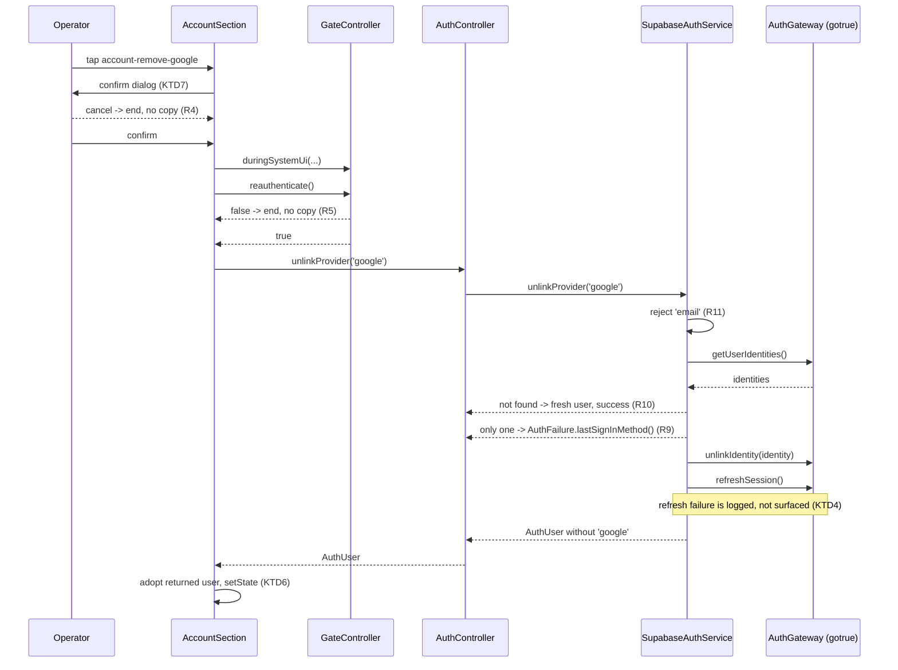
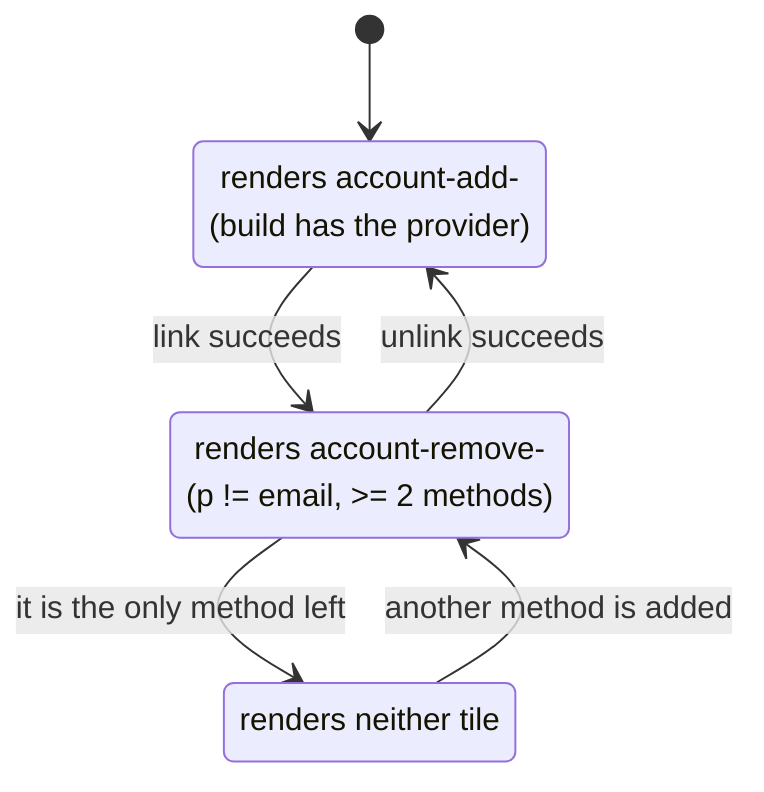

# Remove a Linked Sign-In Method - Plan

**Target repo:** `lunarlog` (`wjdavis5/lunarlog`). Every path below is repo-relative to the repository root.

---

## Goal Capsule

- **Objective:** Let a signed-in operator remove Google or Apple as a sign-in method from the account section, closing the gap PR #27 left when it shipped "Add Google" / "Add Apple" with no way back.
- **Means:** Extend the existing auth seam — `AuthGateway` gains the gotrue calls (`getUserIdentities`, `unlinkIdentity`, `refreshSession`), `AuthService` gains one domain method `unlinkProvider(String provider)` with a new typed failure, `AuthController` forwards it, and `AccountSection` grows a `Remove <Provider>` tile that mirrors the existing `Add <Provider>` tile behind a confirmation dialog plus the same fresh device-credential check.
- **Authority hierarchy:** GitHub issue #31 owns product intent; this document's Product Contract owns behavioral specification; the Planning Contract owns technical decisions; Implementation Units own execution detail. Where this plan and issue #2's plan (`docs/plans/2026-09-03-001-feat-social-logins-plan.md`) disagree, this plan supersedes for unlink only — its KTD5 and Scope Boundaries said "no unlinking", which this change deliberately reverses.
- **Stop conditions:** Stop and surface if removal turns out to require re-authentication semantics the app cannot provide, if `unlinkIdentity` on this project is refused for a reason other than the last-identity rule, or if removing an identity is found to mutate `auth.uid()`, local data, or the device binding.
- **Execution profile:** `code`; Standard depth on a high-risk (auth) surface — five units, no schema change, no migration.
- **Tail ownership:** Security-notification emails on link and unlink stay with issue #18 (custom SMTP). Passkeys and account deletion stay with their own issues (#17). Nothing here touches sync, RLS, or the one-account-per-device binding.

---

## Product Contract

### Summary

An operator signed in on a bound device sees each of the account's sign-in methods in the Settings → Account section. Beside Google and Apple — the methods that can be attached by mistake — a `Remove` action appears whenever the account keeps at least one other method. Removing asks for confirmation, then the device credential, then deletes that identity from the account. The methods line updates immediately and the matching `Add` tile comes back. Email/password is never removable in this change: it is the account's recovery path.

### Problem Frame

PR #27 gave the account section "Add Google" and "Add Apple" behind a fresh device-credential check. That is the only way to attach an Apple Hide-My-Email identity to an existing account, and it is deliberately one-way today. The consequences of the missing inverse are all real:

- A household member with the unlocked phone can attach *their* Google identity permanently. The credential prompt makes that deliberate, not impossible — and there is currently no undo inside the app.
- A mis-tapped account in the Google picker attaches the wrong identity with no signal and no repair.
- The only repair today is the admin path in `docs/ops/supabase-go-live.md`: delete the identity in the Supabase dashboard, then revoke the user's sessions. That needs a laptop, the dashboard password, and someone who knows the runbook — it is not a household-scale answer.

The identity is also durable in a way the operator cannot see: an attached identity keeps working after "Sign out everywhere", because revocation ends sessions, not identities.

### Key Decisions

- **Email/password is not removable; Google and Apple are.** (Governs R2, R11) The email identity is the account's only recovery path — `sendPasswordReset` and the passwordless link/code path in `AuthService` both address the account by email, and the sign-in screen is email-first, so an account reduced to Google alone is unreachable on web and on an Android device without Play Services. Removing it would also leave `auth.users.email` in a state the app cannot verify without dashboard access. This directly answers the issue's open question: the recovery flow is preserved by refusing the removal, not by rebuilding recovery. The provider-agnostic seam still accepts any provider, so lifting this restriction later is a UI change plus copy, not a re-architecture.
- **`Remove` is a per-provider tile mirroring `Add`, not a redesigned methods list.** (Governs R1, R3) The account section already renders `Sign-in methods: Email, Google` as the identity tile's subtitle and one `Add <Provider>` tile per absent method. A symmetric `Remove <Provider>` tile per removable present method keeps the section's shape, keeps the existing widget tests meaningful, and keeps the visible state machine obvious: for any provider, exactly one of `Add` / `Remove` renders, or neither.
- **Confirmation dialog first, then the device credential.** (Governs R4, R5) The device credential answers *who is holding the phone*; it does not state what is about to happen, and the operator who just passed it for "Add" will pass it again by reflex. Removal is the destructive direction, so it follows the section's existing destructive pattern (`Sign out`, `Sign out everywhere`): a dialog naming the consequence, then the credential inside the system-UI window. Adding costs one confirmation the operator did not have before; that is the intended friction.
- **The gotrue `UserIdentity` never crosses `lib/data/auth/`.** (Governs R6, R12) `AuthService.unlinkProvider(String provider)` takes a domain provider string (`AuthProviders.google`). Resolving that string to the `UserIdentity` gotrue's `unlinkIdentity` requires happens inside `SupabaseAuthService`, exactly as `AuthUser.providers` is already derived from `User.identities` there. `test/architecture/layering_test.dart` enforces the boundary this preserves.
- **Freshness comes from `refreshSession()`, not from a new cache.** (Governs R7) `linkIdentityWithIdToken` saves the returned session, so `currentSession.user.identities` is fresh after an add. `unlinkIdentity` is a bare `DELETE /user/identities/<id>` and saves nothing, and `getUser()` returns a fresh user without storing it — so after a removal the SDK's session still lists the removed identity. Refreshing the session after the delete makes `currentUser` authoritative through the same single source of truth the rest of the app reads.
- **A new typed failure `AuthFailure.lastSignInMethod()`.** (Governs R9) `authFailureCopy` in `lib/ui/account/sign_in_screen.dart` is an exhaustive switch over a sealed hierarchy, so a new kind forces its copy to be written rather than falling into "Something went wrong". The server's own refusal (`single_identity_not_deletable`) is a defensive path — the UI never offers the last method — but a second device can win the race.
- **Removing an identity the account no longer has succeeds.** (Governs R10) Two devices, both showing Google as removable; the second one's delete would 404 or find nothing. Treating "already gone" as success keeps the operator's mental model intact and avoids error copy for an outcome they asked for and got.

### Actors

- A1. **Operator** — the signed-in adult holding the bound device, working in Settings → Account.

### Requirements

#### The Remove action

- R1. For each sign-in method the account holds, the account section renders a `Remove <Provider>` tile when that method is removable, using the key `account-remove-<provider>`.
- R2. A method is removable when it is **not** `email` **and** the account holds at least two methods in total.
- R3. For any provider, at most one of `Add <Provider>` / `Remove <Provider>` renders at a time; an account with only `email` renders no `Remove` tile at all.
- R4. Tapping `Remove` shows a confirmation dialog naming the consequence ("You will no longer be able to sign in to this account with <Provider>. Your data and your other sign-in methods are unchanged."). Cancelling ends the action with no device-credential prompt, no service call, and no copy.
- R5. Confirming runs `GateController.reauthenticate()` inside a single `GateController.duringSystemUi` window, exactly as adding a method does. A declined or unavailable device credential cancels the action with no service call and no copy.
- R6. A granted credential calls `AuthController.unlinkProvider(<provider>)` once, with the tapped tile disabled behind a spinner and every other method action disabled for the duration.

#### Outcome and state

- R7. A successful removal updates the account section without a restart: the methods subtitle drops the provider, the `Remove` tile disappears, and the matching `Add` tile reappears.
- R8. A removal never changes `auth.uid()`, the session's signed-in state, the device binding, local data, or the gate's lock state.

#### Failures

- R9. A server refusal to remove the account's last identity surfaces as `AuthFailure.lastSignInMethod()` with its own copy, distinct from the generic unknown copy.
- R10. Removing a provider the account no longer holds completes as a success and leaves the methods list matching the server.
- R11. `unlinkProvider('email')` is rejected by the service before any network call; the UI never offers it.
- R12. Every failure renders generic typed copy in the existing `account-link-error` tile beneath the identity tile. No provider text, no server message, no email, and no identity id reaches the UI, a log, or a crash report.

#### Operations

- R13. `docs/ops/supabase-go-live.md` records that the dashboard's "Manual linking" setting gates unlink as well as link, carries device-checklist items for the removal flow, and rewrites its "Admin recovery for a rogue linked identity" item — which currently states there is no in-app unlink — as the fallback for the case the app cannot reach.
- R14. Every document that asserts the app has no unlink is corrected: `AGENTS.md` ("A second method is linked with `linkIdentityWithIdToken` behind a fresh device-credential check; there is no unlink"), the README's Accounts section, and the #2 plan's scope bullet and KTD5.
- R15. Security-notification emails on link and unlink remain deferred to issue #18 and are recorded as such.

### Key Flows

- F1. **Remove a wrongly attached Google identity**
  - **Trigger:** Operator opens Settings → Account and taps `Remove Google`.
  - **Actors:** A1, GateController, Supabase.
  - **Steps:** Confirmation dialog → device-credential prompt inside one system-UI window → `unlinkProvider('google')` → gotrue deletes the identity → the session refreshes → the subtitle reads `Sign-in methods: Email` and `Add Google` reappears.
  - **Covered by:** R1, R4, R5, R6, R7, R8

- F2. **Declined confirmation or credential**
  - **Trigger:** Operator taps `Remove Apple`, then cancels the dialog, or passes the dialog and dismisses the credential prompt.
  - **Actors:** A1, GateController.
  - **Steps:** The action ends where it was declined. No provider call, no error copy, no spinner left behind, and the gate does not re-lock.
  - **Covered by:** R4, R5, R8

- F3. **The last method cannot be removed**
  - **Trigger:** The account holds only `email`, or a second device removed the other method first.
  - **Actors:** A1, Supabase.
  - **Steps:** In the ordinary case no `Remove` tile renders. In the race, the server refuses and `account-link-error` shows the last-method copy; the tile is re-enabled and the methods list is unchanged.
  - **Covered by:** R2, R3, R9, R12

### Acceptance Examples

- AE1. **Covers R2, R3.** Given `providers` is `['email']`, when the account section renders, then no `account-remove-*` tile exists; given `['email', 'google']`, then `account-remove-google` exists and no `account-remove-email` exists.
- AE2. **Covers R4.** Given `providers` is `['email', 'google']`, when the operator taps `account-remove-google` and cancels the dialog, then `GateController.reauthenticate` is never called and `AuthController.unlinkProvider` is never called.
- AE3. **Covers R5.** Given the dialog is confirmed and the device credential is declined, when control returns, then `unlinkProvider` is never called, no `account-link-error` renders, and the tile is enabled again.
- AE4. **Covers R6, R7.** Given the dialog is confirmed and the credential granted, when `unlinkProvider('google')` succeeds, then it was called exactly once, the subtitle reads `Sign-in methods: Email`, `account-remove-google` is gone, and `account-add-google` is present.
- AE5. **Covers R9, R12.** Given `unlinkProvider` throws `AuthFailure.lastSignInMethod()`, when the call returns, then `account-link-error` shows the last-method copy, the methods subtitle is unchanged, and the tile is enabled again.
- AE6. **Covers R8.** Given the removal ceremony is running, when a background lifecycle event arrives during the credential prompt, then the app does not re-lock (the `duringSystemUi` window covers both steps, as it does for adding).
- AE7. **Covers R10.** Given the current user's identities no longer contain `google`, when `unlinkProvider('google')` runs, then no delete is issued, no failure is thrown, and the returned user's providers match the server.
- AE8. **Covers R11.** Given a signed-in user, when `unlinkProvider('email')` is called directly, then it throws before any gateway call.

### Scope Boundaries

- No removal of the email/password method (KTD1), and therefore no change to `sendPasswordReset`, `updatePassword`, or the recovery link handling.
- No re-designed sign-in-methods screen: the identity tile, its subtitle, and the `Add` tiles keep their current shape.
- No change to the one-account-per-device binding, upload consent, sync, or RLS.
- No new dependency, no Drift schema change, no Supabase migration, no pgTAP.
- No provider-side revocation: removing Apple from the account does not revoke the app in the operator's Apple ID settings, and removing Google does not revoke the Google grant.
- No fix for the pre-existing `passwordRecovery` soft bucket. The section treats `passwordRecovery` as signed in for rendering, while `SupabaseAuthService._requireSignedInUser` demands `signedIn` — so the method actions render during recovery and then fail after the credential prompt. The `Remove` tiles inherit this exactly; it is recorded in `docs/residual-review-findings/feat-social-logins.md` (P3) and is a separate fix for both directions at once.

#### Deferred to Follow-Up Work

- **Security-notification emails on link and unlink** — issue #18, blocked on custom SMTP. This plan only records the requirement in the go-live checklist.
- **Removing the email/password method** — needs a decided recovery story (a provider-only account still reachable on web and on Play-Services-less Android) before it can be offered.
- **A "sign out other devices after removing a method" prompt** — an identity removal does not end sessions that were established through it; the existing "Sign out everywhere" already covers the case and the coupling is not obviously wanted.

### Dependencies

- Supabase dashboard: "Manual linking" must stay ON — the same setting that gates `linkIdentityWithIdToken` also gates the unlink endpoint. Already a go-live checklist item; R13 extends its wording.
- gotrue 2.27.2 (via `supabase_flutter` 2.17.2, both pinned in `pubspec.lock`) supplies `getUserIdentities()`, `unlinkIdentity(UserIdentity)`, and `refreshSession()`. No version bump is required.

---

## Planning Contract

### Key Technical Decisions

- KTD1. **`AuthService.unlinkProvider(String provider)` is the whole domain surface.** One method, provider-agnostic, returning the refreshed `AuthUser`. It throws `AuthFailure` like every other operation. The email restriction lives in the service as a guard (R11) and in the UI as a render rule (R2) — the seam itself stays general so a later product decision is a UI change. (Governs R6, R11, R12)
- KTD2. **`AuthGateway` gains exactly three methods: `getUserIdentities()`, `unlinkIdentity(UserIdentity)`, `refreshSession()`.** The gateway is deliberately "the slice of `GoTrueClient` the service calls"; these are that slice for this feature. `getUserIdentities()` returns gotrue's `List<UserIdentity>` because the gateway already traffics in Supabase types (`Session`, `AuthResponse`, `OAuthProvider`) and only the service boundary above it is required to be pure. `test/data/supabase_auth_service_test.dart`'s `FakeAuthGateway` implements all three. Note that `lib/data/auth/auth_gateway.dart` is already on the reviewed coverage-exclusion list in `tool/quality/exclusions.dart` (a pass-through platform adapter), so the three new overrides sit outside the gate's denominator — which is exactly why they must stay pass-through with no logic. Any branch that appears in `GoTrueAuthGateway` is a branch the gates cannot see. (Governs R6, R7)
- KTD3. **The removal sequence is read → guard → delete → refresh.** `getUserIdentities()` finds the identity for the requested provider (a fresh server read, so a stale local session cannot delete the wrong thing or miss a race); if there is none, return the fresh user unchanged (R10); if it is the only identity, throw `AuthFailure.lastSignInMethod()` before the call; otherwise `unlinkIdentity` then `refreshSession()`, and build the returned `AuthUser` from the refreshed session's user. (Governs R7, R9, R10)
- KTD4. **A refresh failure after a successful delete is not surfaced as a failure.** The identity is already gone server-side; reporting an error for a completed action is worse than a brief stale list. The service returns the user derived from the post-delete `getUserIdentities()` read, logs at `debugPrint` with the error's runtime type only, and lets the SDK's own refresh (bounded by the 10-minute JWT expiry target) reconcile `currentSession`. The account section adopts the returned `AuthUser` for its own render, so the operator sees the correct list immediately even in that window. (Governs R7, R12)
- KTD5. **`single_identity_not_deletable` maps in `_mapGoTrueAuthException`, beside the existing codes.** `mapAuthError` stays pure and code-driven; the new arm sits with `identity_already_exists` and `signup_disabled`. Anything else the unlink endpoint returns — including a manual-linking refusal — keeps falling through to `AuthUnknownFailure`, because the app has no honest, non-leaking copy for a dashboard misconfiguration. (Governs R9, R12)
- KTD6. **`AccountSection` keeps the `AuthUser` returned by a successful add or remove and prefers it over `auth.currentUser` for the current build.** Today the section re-reads `auth.currentUser` in `setState` because a same-state `userUpdated` does not notify. That is correct for add (gotrue stores the linked session) but relies on the session being fresh, which KTD4 cannot guarantee for remove. Adopting the returned user removes the whole staleness class for both directions with no new controller state. (Governs R7)
- KTD7. **The confirmation dialog is a plain `AlertDialog` in the section, matching `Sign out`.** No new dialog widget, no new route. The dialog is shown *before* entering `duringSystemUi` — it is Flutter UI, not system UI, and wrapping it would extend the no-re-lock window over an arbitrarily long read. (Governs R4, R5, R8)
- KTD8. **One in-flight method action at a time, tracked by the existing `_linking` field renamed to `_busyProvider`.** Add and remove share the disabled/spinner mechanics and the `account-link-error` tile, so they share the guard: while any action is in flight, every `Add` and `Remove` tile is disabled. (Governs R6, R12)

### High-Level Technical Design

The removal path, and where each decision lands:

Per-provider tile state, which is what the widget tests assert:

### Assumptions

- AS1. The Supabase project's "Manual linking" setting gates the unlink endpoint as well as the link endpoint. The device checklist item added in U5 is what actually confirms this on the live project; if it turns out unlink is ungated, the only consequence is that a checklist sentence is over-cautious.
- AS2. `refreshSession()` returns a session whose `user.identities` reflects the deletion. This is the same server-sourced user object the SDK stores at sign-in; if it were stale, KTD6's adoption of the returned `AuthUser` still keeps the visible list correct.
- AS3. gotrue's DELETE on an identity the account no longer holds fails in a way `getUserIdentities()` already prevents the app from reaching (KTD3 reads before deleting), so R10 is satisfied without depending on the server's 404 shape.

---

## Implementation Units

### U1. Domain contract: `unlinkProvider` and the last-method failure

- **Goal:** Add the removal operation and its typed failure to the pure-Dart auth seam, with documentation that states the email restriction and the idempotent case.
- **Requirements:** R6, R9, R10, R11, R12; KTD1, KTD6.
- **Dependencies:** none.
- **Files:**
  - `lib/domain/auth/auth_service.dart` — add `AuthLastSignInMethodFailure` (sealed subclass + `const factory AuthFailure.lastSignInMethod()`), and `Future<AuthUser> unlinkProvider(String provider)` on the `AuthService` interface.
- **Approach:**
  1. Add the failure class beside `AuthIdentityTakenFailure`, following the fieldless pattern exactly (`operator ==` by runtime type, `toString` naming the kind, no message, no code).
  2. Add `unlinkProvider` to the interface with doc comments covering: it requires `state == signedIn`; `email` is rejected with `AuthUnknownFailure` before any network call; a provider the account does not hold returns the current user as a success; the account's last identity throws `AuthLastSignInMethodFailure`; the return value carries fresh `AuthUser.providers` and callers should prefer it over re-reading `currentUser`.
  3. Cite issue #31 in the library-level doc comment the way the file already cites `#2 U8` for linking.
- **Patterns to follow:** the existing `linkGoogle` / `linkApple` doc comments and the `AuthIdentityTakenFailure` declaration in the same file.
- **Test scenarios:** `Test expectation: none -- pure declarations; the behavior they name is covered by U2 (service), U3 (controller/fake), and U4 (copy + widget).` The compiler enforces the interface addition across all implementers, and the sealed hierarchy makes `authFailureCopy` fail to compile until U4 adds its arm.
- **Verification:** `flutter analyze` reports the expected non-exhaustive-switch and unimplemented-member errors at `lib/ui/account/sign_in_screen.dart`, `lib/data/auth/supabase_auth_service.dart`, and `test/support/fake_auth_service.dart` — the units that follow resolve them.

### U2. Data layer: gateway calls, unlink sequence, and error mapping

- **Goal:** Implement `unlinkProvider` against gotrue with the read → guard → delete → refresh sequence, and map the server's last-identity refusal to its own failure.
- **Requirements:** R6, R7, R9, R10, R11, R12; KTD2, KTD3, KTD4, KTD5.
- **Dependencies:** U1.
- **Files:**
  - `lib/data/auth/auth_gateway.dart` — add `getUserIdentities()`, `unlinkIdentity(UserIdentity)`, and `refreshSession()` to `AuthGateway` and to `GoTrueAuthGateway`; extend the library doc comment to name issue #31.
  - `lib/data/auth/supabase_auth_service.dart` — add `unlinkProvider`; add the `single_identity_not_deletable` arm to `_mapGoTrueAuthException`.
  - `test/data/supabase_auth_service_test.dart` — extend `FakeAuthGateway` with the three methods plus recording fields, and add the unlink group.
- **Approach:**
  1. `GoTrueAuthGateway` forwards each new method to `_auth` with no logic, matching every other override in the file.
  2. `unlinkProvider(String provider)`: reject `AuthProviders.email` with `const AuthFailure.unknown()` before anything else; call `_requireSignedInUser()`; then run the rest inside `_guard` so mapping stays in one place.
  3. Inside the guard: `final identities = await _gateway.getUserIdentities()`; find the first whose `provider` equals the argument. If none, return the user rebuilt from the current session (success, R10). If `identities.length < 2`, throw `const AuthFailure.lastSignInMethod()`.
  4. Otherwise `await _gateway.unlinkIdentity(identity)`, then attempt `await _gateway.refreshSession()` in its own `try`/`catch` that only `debugPrint`s the error's runtime type (KTD4) — never its message.
  5. Build the return value from `_gateway.currentSession?.user` when the refresh succeeded, otherwise from the identity list minus the removed provider, preserving the existing `_toUser` / `_providersOf` derivation rather than hand-rolling a second one. Throw `const AuthFailure.unknown()` if no user can be built at all.
  6. Add `case 'single_identity_not_deletable': return const AuthFailure.lastSignInMethod();` beside the existing codes in `_mapGoTrueAuthException`.
- **Execution note:** the failure-mapping and sequencing branches are cheap to drive from the fake gateway — write the `FakeAuthGateway` additions and the failing expectations before the service body, so each branch is proven by a test that failed first. `unlinkProvider` as described has five branches in one method, which is exactly the shape the CRAP gate rejects; split the resolve-and-guard step into a private helper the way `mapAuthError` was split into `_mapGoTrueAuthException` + `_isNetworkShapedError`, keeping the same checks in the same order.
- **Patterns to follow:** `_link` (guard usage, user re-read, fallback chain) and `linkGoogle` (precondition ordering: capability check, then signed-in check, then platform work) in the same file; `FakeAuthGateway`'s existing `linkIdentityCalls` recording style and the `makeUser(..., identities: ...)` / `makeSession` builders at the top of `test/data/supabase_auth_service_test.dart`, which already construct real gotrue `UserIdentity` objects.
- **Test scenarios:**
  - `unlinkProvider('google')` on a user with `email` + `google` identities calls `unlinkIdentity` exactly once with the `google` identity, then `refreshSession`, and returns an `AuthUser` whose `providers` is `['email']`.
  - `unlinkProvider('email')` throws `AuthFailure.unknown()` and the gateway records no `getUserIdentities`, no `unlinkIdentity`, and no `refreshSession` call.
  - `unlinkProvider('google')` while the state is `signedOut` throws `AuthFailure.unknown()` before any gateway call.
  - `unlinkProvider('google')` on a user whose only identity is `email` (Google not present) returns the current user unchanged and issues no delete.
  - `unlinkProvider('google')` on a user whose only identity **is** `google` throws `AuthFailure.lastSignInMethod()` and issues no delete.
  - A gateway `unlinkIdentity` that throws `AuthException(code: 'single_identity_not_deletable')` surfaces as `AuthFailure.lastSignInMethod()`.
  - A gateway `unlinkIdentity` that throws `AuthRetryableFetchException` surfaces as `AuthFailure.network()` and no refresh is attempted.
  - A gateway `refreshSession` that throws after a successful delete does **not** throw: the returned `AuthUser.providers` omits the removed provider (KTD4).
  - `mapAuthError` unit case: `AuthException(code: 'single_identity_not_deletable')` maps to `AuthFailure.lastSignInMethod()`; an unrecognized unlink error code still maps to `AuthFailure.unknown()`.
- **Verification:** the new group in `test/data/supabase_auth_service_test.dart` passes; `flutter analyze` is clean for `lib/data/`.

### U3. Controller and test fake

- **Goal:** Forward the operation from the UI layer's controller and teach the shared widget-test fake to model removal.
- **Requirements:** R6, R7; KTD1.
- **Dependencies:** U1.
- **Files:**
  - `lib/ui/account/auth_controller.dart` — add `Future<AuthUser> unlinkProvider(String provider)`.
  - `test/support/fake_auth_service.dart` — implement `unlinkProvider`; add a recording field and a settable outcome.
  - `test/ui/auth_controller_test.dart` — add the delegation test.
- **Approach:**
  1. The controller method delegates to `_service.unlinkProvider(provider)` with no notification, mirroring `linkGoogle` / `linkApple` and their comment that a same-state `userUpdated` does not notify.
  2. The fake mirrors its private `_link(String provider)` helper in reverse — a `_unlink(String provider)` that throws `AuthFailure.unknown()` unless the state is `signedIn`, records into a new `unlinkCalls` list, honours the existing `nextFailure` and `hold` knobs so widget tests can drive failures and held calls, and otherwise removes the provider from `providers` and returns the user built from the updated list. Reuse `nextFailure`/`hold` rather than adding parallel fields: `test/ui/account_test.dart` already drives the add path through them.
- **Patterns to follow:** `AuthController.linkGoogle` / `linkApple` (the thin forwarders with the "does not notify" comment) and `FakeAuthService._link` with its `linkCalls`, `providers`, `nextFailure`, `hold`, and `linkResult` fields.
- **Test scenarios:**
  - `AuthController.unlinkProvider('google')` calls the service once with `'google'` and returns the service's `AuthUser` unchanged.
  - `AuthController.unlinkProvider` does not notify listeners (a `ChangeNotifier` listener registered before the call is not invoked).
  - A service failure propagates out of the controller untouched (the controller does not swallow or re-map it).
- **Verification:** `test/ui/auth_controller_test.dart` passes; every implementer of `AuthService` compiles.

### U4. Account section: the Remove tile, dialog, and copy

- **Goal:** Render `Remove <Provider>` per removable method and run the confirm → credential → unlink sequence, reusing the add path's system-UI window, spinner, and error tile.
- **Requirements:** R1, R2, R3, R4, R5, R6, R7, R8, R9, R12; KTD6, KTD7, KTD8.
- **Dependencies:** U1, U2, U3.
- **Files:**
  - `lib/ui/account/account_section.dart` — the `Remove` tiles, the confirmation dialog, `_removeMethod`, the shared busy guard, and the adopted-user field.
  - `lib/ui/account/sign_in_screen.dart` — the `AuthLastSignInMethodFailure` arm in `authFailureCopy`.
  - `test/ui/account_test.dart` — a new `removing a sign-in method (#31)` group.
  - `test/ui/auth_failure_copy_test.dart` — the new copy case.
- **Approach:**
  1. Add `AuthUser? _freshUser`; the build prefers it over `auth.currentUser` (KTD6), and both `_reauthenticateAndLink` and the new remove path assign it from their call's return value. Clear it whenever the signed-in user id changes so a sign-out/sign-in cannot show a previous account's methods.
  2. Rename `_linking` to `_busyProvider` and use it for both directions so any in-flight action disables every method tile (KTD8). Keep `_linkError` and the `account-link-error` key: the tile is the section's one place for method-action failures, and renaming it would churn existing tests for no behavioural gain.
  3. Render `_removeMethodTile` for each provider in the current methods list where the provider is not `AuthProviders.email` and the list length is at least 2 — key `account-remove-<provider>`, title `Remove <label>` via the existing `providerLabel`, subtitle `Stop using this to sign in to this account.`, same spinner/disabled mechanics as `_addMethodTile`.
  4. `_removeMethod(provider)`: return early if `_busyProvider != null`; clear `_linkError`; read `GateController?` and bail with the existing `debugPrint` when absent; show the confirmation `AlertDialog` (keys `account-remove-confirm` for the destructive action, plain Cancel) **before** entering the window; if not confirmed, return. Then `gate.duringSystemUi(() => _reauthenticateAndRemove(gate, provider))`.
  5. `_reauthenticateAndRemove`: `gate.reauthenticate()`; on false or unmounted, return with no copy. Set `_busyProvider`, call `auth.unlinkProvider(provider)`, assign `_freshUser` from the result, map `AuthFailure` to `authFailureCopy` and any other error to the unknown copy exactly as the add path does, and clear `_busyProvider` in `finally` when mounted.
  6. Add the `AuthLastSignInMethodFailure()` arm to `authFailureCopy`: `'That is the only way left to sign in to this account. Add another method first.'` — no provider name, no email.
- **Execution note:** start from the existing `_addMethod` / `_reauthenticateAndLink` pair and the add-method widget tests; the remove tests are their mirror image, and any divergence in the gate handling between the two paths is a bug rather than a design choice.
- **Patterns to follow:** `_addMethodTile`, `_addMethod`, `_reauthenticateAndLink` in the same file; `_signOut`'s `AlertDialog` shape (Cancel `TextButton` + destructive `FilledButton` with a `ValueKey`) for the confirmation; the existing `sign-in methods and adding one (#2 U5; AE6, R9, R10)` group in `test/ui/account_test.dart` and its `pumpSection(tester, providers: [...], grantReauth: ..., provideGate: ...)` helper, which already wires `FakeAuthService` + a real `AuthController` + `FakeGate` + a real `GateController` (`FakeGate` and `FakeInactivityTimers` are imported from `test/ui/gate_test.dart`). Extend `pumpSection` rather than writing a second harness.
- **Test scenarios:**
  - Covers AE1. `providers: ['email']` renders no `account-remove-email` and no other `account-remove-*` tile; the identity subtitle is unchanged.
  - Covers AE1. `providers: ['email', 'google']` renders `account-remove-google`, no `account-remove-email`, and no `account-add-google`.
  - `providers: ['email', 'google', 'apple']` on iOS renders both `account-remove-google` and `account-remove-apple` and neither add tile.
  - `providers: ['google']` (no email identity) renders no remove tile — the last method is pinned regardless of which provider it is.
  - Covers AE2. Tapping `account-remove-google` and cancelling the dialog leaves `FakeAuthService.unlinkProvider` uncalled and `GateController.reauthenticate` uncalled.
  - Covers AE3. Confirming the dialog with a gate that declines re-authentication leaves `unlinkProvider` uncalled, renders no `account-link-error`, and re-enables the tile.
  - Covers AE4. Confirming with a granted gate calls `unlinkProvider('google')` exactly once; after settle the subtitle reads `Sign-in methods: Email`, `account-remove-google` is gone, and `account-add-google` is present.
  - Covers AE5. A configured `AuthFailure.lastSignInMethod()` renders the last-method copy in `account-link-error`, leaves the subtitle unchanged, and re-enables the tile.
  - A configured `AuthFailure.network()` renders the network copy; a non-`AuthFailure` exception renders the unknown copy (mirroring the existing add-path test).
  - A second tap while the first `unlinkProvider` call is held does nothing: the service records exactly one call, and the sibling `Add`/`Remove` tiles are disabled for the duration.
  - With no `GateController` provided, tapping `account-remove-google` shows no dialog effect on state and never calls `unlinkProvider`.
  - Covers AE6. The whole remove ceremony runs inside one `duringSystemUi` window: a background lifecycle event delivered during the credential prompt does not show the lock screen (mirror of the existing `#65 AE5` add-method test).
  - Copy test: `authFailureCopy(const AuthFailure.lastSignInMethod())` returns the last-method sentence, and the existing exhaustiveness assertion in `test/ui/auth_failure_copy_test.dart` covers the new kind.
- **Verification:** the new `account_test.dart` group and the copy test pass; every pre-existing group in `test/ui/account_test.dart` still passes unchanged (the add path and the subtitle are untouched).

### U5. Operations, docs, and the superseded scope note

- **Goal:** Record the dashboard dependency, add the device-checklist items the removal flow needs, and correct every document that currently states the app has no unlink.
- **Requirements:** R13, R14, R15.
- **Dependencies:** U4.
- **Files:**
  - `docs/ops/supabase-go-live.md` — the "Manual linking" bullet and the "Admin recovery for a rogue linked identity" item in "Social logins and passwordless (issue #2)", new device-checklist items in the matching checklist section, and the #18 notification-email deferral.
  - `AGENTS.md` — the line asserting "there is no unlink" (in the accounts/auth summary) and the "Device checklist" line, which currently names only "adding a sign-in method".
  - `README.md` — the Accounts section, wherever it repeats the no-unlink statement.
  - `docs/plans/2026-09-03-001-feat-social-logins-plan.md` — a dated "Superseded" note on the "No unlinking of a sign-in method" scope bullet, on KTD5's "the app offers no unlink" clause, and on the "Linking as persistence" risk entry, each pointing at this plan and issue #31.
- **Approach:**
  1. Extend the manual-linking bullet to say the setting gates the account section's `Remove` actions as well as `Add`, and that a refusal while it is off shows the generic failure copy with nothing naming the setting.
  2. Rewrite the admin-recovery item: the in-app `Remove` action is now the household path for a wrongly attached Google or Apple identity; the dashboard route (delete the identity, then revoke the user's sessions) remains the fallback for the cases the app cannot reach — an operator locked out of the device, or an identity attached to an account nobody can sign in to. Keep the session-revocation step prominent either way, since removing an identity does not end sessions.
  3. Add device-checklist items: remove with the credential declined (nothing changes); remove with it granted (the methods line drops the provider, the `Add` tile returns, and the data and `auth.uid()` are unchanged); signing in with the removed provider afterwards produces the "Different account" screen rather than re-attaching silently; the last remaining method offers no `Remove`; and — settling AS1 — that the removal succeeds with "Manual linking" ON.
  4. Correct `AGENTS.md` and the README to describe both directions, and add "removing a sign-in method" to the device-checklist line.
  5. Record that link/unlink security-notification emails remain issue #18 and are not part of this change.
  6. Do not restate the plan in the ops doc — link to this file the way the existing section links to the #2 plan.
- **Patterns to follow:** the existing bullets in `docs/ops/supabase-go-live.md` (imperative, one dashboard action each, issue-and-KTD citations in parentheses) and the `**Superseded 2026-09-03**` / `**Resolved 2026-09-03**` note style already used inside the #2 plan.
- **Test scenarios:** `Test expectation: none -- documentation and operator checklist; no code path changes.`
- **Verification:** a repository-wide search for "no unlink" and "there is no in-app unlink" returns only the dated superseded notes; the go-live section names removal in the settings list, the admin-recovery item, and the device checklist; `AGENTS.md`'s device-checklist line names removing a method.

---

## Verification Contract

Run from the repository root of the `issue-31` worktree, in this order:

1. `flutter pub get`
2. `flutter analyze` — must be clean. The sealed `AuthFailure` hierarchy and the `AuthService` interface make U1's additions compile-fail until U2, U3, and U4 land, so a clean analyze after U4 is itself evidence that every implementer and every exhaustive switch was updated.
3. `flutter test` — all pre-existing tests plus the new groups pass. No existing expectation in `test/ui/account_test.dart` may be edited to accommodate this change; if one breaks, the section's shape drifted further than KTD2 intends.
4. `dart run tool/quality_gate.dart` — the 90% line-coverage floor and the per-method CRAP gate (threshold 10), both from one `flutter test --coverage` run filtered through `tool/quality/exclusions.dart`. `_removeMethod` / `_reauthenticateAndRemove` and `unlinkProvider` are the branch-dense additions; the scenario lists in U2 and U4 are sized to cover each branch rather than to hit a number. Do **not** add a new exclusion to `tool/quality/exclusions.dart` for anything in this change: `lib/data/auth/auth_gateway.dart` is already listed, and the new logic deliberately lives above it in `supabase_auth_service.dart` and `account_section.dart`, which are not.
5. `dart run tool/mutation_gate.dart` — local-only, scoped to the changed files with test mirrors (`lib/data/auth/supabase_auth_service.dart`, `lib/ui/account/account_section.dart`).

Not runnable in this environment, and therefore recorded rather than claimed:

- The device checklist items added in U5. Removal touches the live Supabase project's identities, the platform credential prompt, and the gate's re-lock behaviour — none of which `flutter test` reaches. They need an iPhone build and an Android build with a throwaway account, per `docs/ops/supabase-go-live.md`.
- Whether the dashboard's "Manual linking" setting actually gates the unlink endpoint (AS1). The checklist item is what settles it.

---

## Risks and Open Questions

- **The session can be briefly stale after a removal.** `unlinkIdentity` stores nothing and `refreshSession()` can fail offline (KTD4). The visible list stays correct because the section adopts the returned `AuthUser` (KTD6), but `auth.currentUser` — read by anything else that starts reading `providers` later — can lag until the SDK's next refresh. Mitigation: KTD6 keeps the operator's view honest; the lag is bounded by the JWT expiry (10-minute target) and cleared by a restart. Revisit only if a second consumer of `providers` appears.
- **Removal does not end sessions established through the removed identity.** Deleting an identity revokes the *way in*, not the tokens already issued. An operator removing a wrongly attached Google identity may reasonably expect the other person to be logged out; they are not, until "Sign out everywhere". Mitigation: the confirmation dialog states only what is true, and the deferred follow-up records the coupling question rather than guessing at it.
- **Removal is not provider-side revocation.** The app still appears in the operator's Google or Apple ID account settings. Copy must not imply otherwise.
- **The confirmation dialog plus the credential prompt is two ceremonies.** If device testing shows the pair reads as nagging, the dialog is the one to drop (the credential check is required by the issue) — but only with the consequence sentence moved somewhere the operator actually sees before the prompt.
- **Open question, deferred by design:** whether an account should ever be reducible to a provider-only set (no email identity). Answered "no" for this change by KTD1; reopening it needs a recovery story for web and Play-Services-less Android first.

---

## Definition of Done

- `AuthService.unlinkProvider` exists on the domain seam with `AuthFailure.lastSignInMethod()`, and `lib/domain` is still pure Dart (`test/architecture/layering_test.dart` green).
- `SupabaseAuthService.unlinkProvider` performs read → guard → delete → refresh, maps `single_identity_not_deletable` to its own failure, and never lets a gotrue `UserIdentity`, server message, or identity id escape `lib/data/auth/`.
- The account section renders `Remove <Provider>` for every removable method and for none other, runs confirm → device credential → unlink inside one system-UI window, and updates its methods list without a restart.
- Email/password is not offered for removal in the UI and is rejected by the service.
- Every acceptance example AE1–AE8 has a passing test at the layer named in its unit.
- `flutter analyze` clean, `flutter test` green with no pre-existing expectation edited, `dart run tool/quality_gate.dart` passing, `dart run tool/mutation_gate.dart` run locally on the changed files.
- `docs/ops/supabase-go-live.md` (manual-linking bullet, admin-recovery item, device checklist), `AGENTS.md`, `README.md`, and the #2 plan's superseded notes are updated; no document still asserts the app has no unlink; the #18 notification-email deferral is recorded.
- Issue #31's four scope bullets are each either implemented or explicitly answered in this plan's Scope Boundaries — including the email/password recovery question, which is answered by KTD1.

---

## Sources and Research

- GitHub issue [#31](https://github.com/wjdavis5/lunarlog/issues/31) — product intent and the four scope bullets.
- PR [#27](https://github.com/wjdavis5/lunarlog/pull/27) and `docs/plans/2026-09-03-001-feat-social-logins-plan.md` — the add-a-method design this change inverts; its KTD5 and Scope Boundaries are the text U5 supersedes.
- `docs/ops/supabase-go-live.md` — "Social logins and passwordless (issue #2)" settings and device checklist; the admin recovery this feature replaces for the household case.
- gotrue `2.27.2` (pinned in `pubspec.lock`, bundled by `supabase_flutter` `2.17.2`): `GoTrueClient.getUserIdentities()` returns `getUser().user?.identities ?? []`; `unlinkIdentity(UserIdentity)` issues `DELETE /user/identities/<identityId>` and stores nothing; `getUser()` returns a fresh `UserResponse` without saving it; `refreshSession()` stores the new session and emits `tokenRefreshed`, which `SupabaseAuthService._onAuthState` already maps to the session state. These four facts are what KTD3 and KTD4 are built on.
