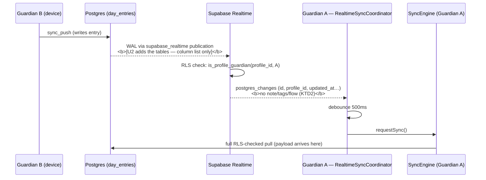
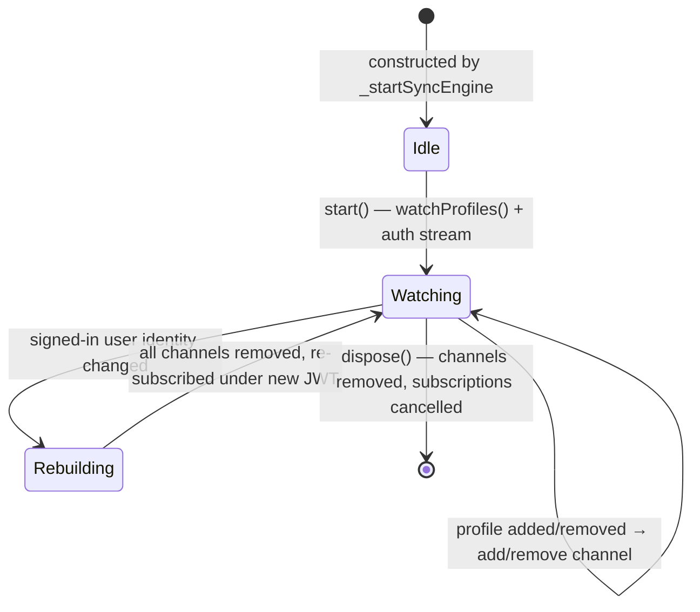

# feat(sharing): make RealtimeSyncCoordinator actually deliver live co-caregiver sync (#77)

**Branch:** `issue-77` · **Closes:** [#77](https://github.com/wjdavis5/lunarlog/issues/77)

---

## Goal Capsule

Co-caregiver edits should land on the other guardian's device within seconds
instead of waiting for the next periodic sync cycle. `RealtimeSyncCoordinator`
exists and is unit-tested, but the feature is still dormant end-to-end. This
plan closes the two real gaps and adds the missing regression proof.

---

## Problem Frame

Issue #77 asserts that `RealtimeSyncCoordinator` "is never instantiated or
started anywhere in `lib/main.dart`, `lib/app_lifecycle.dart`, or
`lib/app.dart`". **That premise is stale.** Commit `7a4c7a6` (PR #80) wired it:

- `lib/main.dart:88` passes `supabaseClient: Supabase.instance.client` when the
  Supabase bootstrap succeeded.
- `LunarLogRootState._startSyncEngine` (`lib/app_lifecycle.dart:764-775`)
  constructs `RealtimeSyncCoordinator(client:, syncEngine:, storage:)` and
  calls `start()`.
- `LunarLogRootState._disposeSyncEngine` (`lib/app_lifecycle.dart:783-791`)
  disposes the coordinator *before* the engine, so channels unsubscribe ahead
  of the database close.

This is the exact same shape as issue #76, which turned out to be stale for the
same reason and was closed by `7d4c664` with a **test** rather than wiring.

So the literal ask in #77 is already satisfied. What is genuinely missing, and
what keeps the feature dormant in production, is three things:

1. **No regression proof for the coordinator wiring.** `7d4c664` added a
   `gate_test.dart` case for `SupabaseSharingService` only. Nothing asserts
   the root builds, starts, or disposes the coordinator — so a revert to a
   null coordinator would fail no test, which is exactly why the stale issue
   still reads as plausible.

2. **The backend never publishes the changes.** No migration adds
   `public.profiles` or `public.day_entries` to the `supabase_realtime`
   publication (`grep -rn "publication" supabase/` returns nothing). Supabase
   Realtime's `postgres_changes` only emits for published tables, so every
   channel the coordinator subscribes to is silent. The client-side wiring is
   live; the wire is dead.

3. **Channels joined while signed out are never re-authorized.** The
   coordinator's `start()` runs right after the database opens
   (`_openDatabase` → `_startSyncEngine`), which on a cold start is *before*
   the user has a session. `postgres_changes` authorization is evaluated at
   join time against the connection's JWT; a channel joined as `anon` is
   parked in `_channels` and never re-subscribed after sign-in, so a
   first-run-then-sign-in device gets no live sync until the next app launch.

---

## Requirements

| ID | Requirement |
|---|---|
| R1 | A test fails if `LunarLogRoot` stops constructing, starting, or disposing `RealtimeSyncCoordinator` when a `SupabaseClient` is present. |
| R2 | `public.profiles` and `public.day_entries` changes are delivered to authorized guardian subscribers via Supabase Realtime. |
| R3 | No entry payload content (`note`, `tags`, `flow`) is broadcast over the Realtime websocket. The coordinator needs a wake signal only; the authoritative read stays on the RLS-checked sync pull. |
| R4 | A device that opens its database signed out and signs in afterwards ends up with live channels, without an app restart. |
| R5 | The change is verifiable in CI without the Realtime container (which `supabase start` excludes in this repo). |

---

## Key Technical Decisions

### KTD1. Close #77 with proof + backend enablement, not by re-writing the wiring

The wiring in `_startSyncEngine` / `_disposeSyncEngine` is correct and already
shipped. Re-implementing it per the issue's "Proposed Solution" would be a
no-op diff at best and a regression at worst. The plan instead adds the missing
test (R1) and the missing enablement (R2, R4). The PR body must say this
explicitly so the issue's stale premise is corrected in the record — same
pattern as `7d4c664` for #76.

### KTD2. Publish column lists, never whole rows

`public.day_entries` stores `note` (up to 2000 chars), `tags`, and `flow` in
plaintext server-side (`supabase/migrations/20260903014208_initial_sync_schema.sql:68-100`).
Adding the table to `supabase_realtime` with a bare `add table` would stream
minors' health-log content over a websocket to every authorized subscriber on
every write. The coordinator reads none of it — `_onRemoteChange` discards the
payload and calls `syncEngine.requestSync()`.

Publish only the columns needed for RLS evaluation, filtering, and replica
identity:

- `public.profiles (id, user_id, updated_at, deleted_at, server_version)` —
  `profiles_select_guardians` needs `id` and `user_id`; the coordinator filters
  on `id`.
- `public.day_entries (id, user_id, profile_id, updated_at, deleted_at, server_version)` —
  `day_entries_select_guardians` needs `profile_id`; the coordinator filters on
  `profile_id`. `note`/`tags`/`flow`/`local_date`/`tz` are deliberately absent.

Postgres requires a publication column list to include every replica-identity
column. Both tables use the default replica identity (their primary key,
`(id, user_id)`), and both columns are in the lists above, so no
`replica identity full` is needed — and `full` would be the wrong answer
anyway, since it would put the excluded columns back into the old-row image on
UPDATE/DELETE.

### KTD3. Re-subscribe on sign-in rather than trusting `setAuth` to retro-authorize

`SupabaseClient` already forwards session changes to Realtime
(`supabase-2.16.1/lib/src/supabase_client.dart:399-429` calls
`realtime.setAuth`), which pushes an `access_token` to joined channels. Whether
the Realtime server re-evaluates an existing `postgres_changes` subscription's
RLS binding on a mid-flight token refresh is version-dependent and not
something this app should bet live sync on. The coordinator will listen to the
auth session stream and tear down + rebuild its channels when the signed-in
user identity changes. This is cheap (channel churn only on sign-in/sign-out,
not on token refresh) and deterministic.

### KTD4. Verify the publication from pgTAP, not from an end-to-end Realtime test

`AGENTS.md:39` and `.github/workflows/ci.yml:76-78` both start local Supabase
with `-x realtime`, so there is no Realtime container in CI to assert against.
Publication membership is plain catalog state, so `pg_publication_tables` /
`pg_publication_rel` assertions in a pgTAP file give exact, fast coverage of
both R2 and R3 (including the negative assertion that `note` is not published)
without adding a container. End-to-end delivery is a manual cloud check, listed
under Verification.

---

## High-Level Technical Design

Where the wake signal travels, and what this plan changes (bold):

Coordinator channel lifecycle after U3:

---

## Implementation Units

### U1. Regression test: the root builds, starts, and disposes the coordinator

**Goal:** Make a revert of the `_startSyncEngine` / `_disposeSyncEngine`
coordinator wiring fail a test (R1).

**Requirements:** R1

**Dependencies:** none

**Files:**
- `test/ui/gate_test.dart` (modify — new case in the sync-engine group, next to the `(#76)` case at ~line 1434)
- `test/support/fake_supabase_client.dart` (modify only if the existing fake cannot observe what U1 needs)

**Approach:**

1. Mirror the `(#76)` case's harness setup: `Harness(tester, seed: seedTwoProfiles)`, `authService: FakeAuthService()`, `syncTransport: FakeSyncTransport()`, `supabaseClient: FakeSupabaseClient()`, and a `syncEngineBuilder` returning a `FakeSyncEngine`.
2. Unlock via `harness.unlockViaButton()`, then pump long enough for `storage.watchProfiles()` to emit — the coordinator subscribes from that stream, not synchronously from `start()`.
3. Assert `client.createdChannels` contains one entry per seeded profile.
4. Unmount (`pumpWidget(SizedBox.shrink())` + pump) and assert `client.removedChannels` covers them and `createdChannels` is empty — proving `_disposeSyncEngine` runs the coordinator's teardown.
5. Add the mirror-image negative assertion to the existing no-client case: with `supabaseClient: null`, no channels are ever created.

`FakeSupabaseClient` already records `createdChannels` and `removedChannels`, so
no new double is expected; only extend it if the assertions need something it
does not expose.

**Patterns to follow:** `test/ui/gate_test.dart:1434-1479` (the `(#76)` sharing
wiring case) for structure and comment style; `test/data/sync/realtime_sync_coordinator_test.dart:110-130`
for channel-name assertions.

**Execution note:** Write this test *first* and confirm it fails against a
locally stubbed-out coordinator block before touching anything else — the whole
point of the unit is that the current suite does not notice the wiring
disappearing.

**Test scenarios:**
- With a `SupabaseClient` and two seeded profiles, unlocking creates one Realtime channel per profile.
- Channel topics are distinct per profile id.
- Unmounting the root removes every created channel (`createdChannels` empty, `removedChannels` non-empty).
- With `supabaseClient: null` but auth + transport present, the sync engine still starts and **no** channel is created.
- A profile added to the database after unlock produces an additional channel without recreating the existing ones.

**Verification:** `flutter test test/ui/gate_test.dart` passes; temporarily
deleting the `RealtimeSyncCoordinator` block in `_startSyncEngine` makes the new
case fail.

---

### U2. Migration: add the two tables to `supabase_realtime` with column lists

**Goal:** Make Postgres actually emit the changes the coordinator is listening
for, without broadcasting entry content (R2, R3).

**Requirements:** R2, R3

**Dependencies:** none (independent of U1)

**Files:**
- `supabase/migrations/20260905100000_realtime_publication.sql` (new — bump the timestamp past `20260905090000_close_guardian_revocation_bypass.sql`)
- `supabase/tests/realtime_publication_test.sql` (new)

**Approach:**

1. Guard for the publication's existence — `supabase_realtime` is created by the platform's own base migrations, so the migration should be a no-op-safe `do $$ … $$` block rather than assuming it, and should be re-runnable (`pg_publication_rel` check before `alter publication … add table`).
2. Add `public.profiles` with the column list from KTD2.
3. Add `public.day_entries` with the column list from KTD2.
4. Leave replica identity at the default (primary key). Do **not** set `replica identity full` — it would defeat KTD2 by restoring the excluded columns in the old-row image.
5. Add a `comment on` or header comment explaining *why* the column list is narrow, so a future "just add the table" edit is visibly a privacy regression.

**Patterns to follow:** the header-comment + numbered-section style of
`supabase/migrations/20260904010000_multi_guardian_schema.sql`; the pgTAP file
conventions in `supabase/tests/rls_isolation_test.sql`, with helpers from
`supabase/tests/000-setup.sql`.

**Test scenarios:**
- `public.profiles` is a member of `supabase_realtime`.
- `public.day_entries` is a member of `supabase_realtime`.
- The published column set for `day_entries` includes `id`, `user_id`, `profile_id`, `updated_at`, `deleted_at`, `server_version`.
- The published column set for `day_entries` **excludes** `note`, `tags`, `flow`, `local_date`, and `tz` — the privacy assertion that gives KTD2 teeth.
- The published column set for `profiles` excludes `display_name`.
- Both tables' replica identity is `d` (default), not `f` (full).
- Re-running the migration body is a no-op (idempotence), so a re-applied migration does not error.

**Verification:** `npx supabase@2.116.0 start -x realtime,storage-api,imgproxy,mailpit,studio,edge-runtime,logflare,vector,supavisor`, then `db reset --local`, then `test db --local` — all pgTAP files green, including the new one.

---

### U3. Rebuild channels when the signed-in identity changes

**Goal:** A device whose database opened while signed out gets live channels
once the user signs in, without an app restart (R4).

**Requirements:** R4

**Dependencies:** U1 (its assertions are the safety net for changing the
coordinator's channel lifecycle)

**Files:**
- `lib/data/sync/realtime_sync_coordinator.dart` (modify)
- `lib/app_lifecycle.dart` (modify — pass the auth session source into the coordinator constructed in `_startSyncEngine`)
- `test/data/sync/realtime_sync_coordinator_test.dart` (modify)
- `test/ui/gate_test.dart` (modify — U1's case gains a sign-in assertion)

**Approach:**

1. Give `RealtimeSyncCoordinator` an auth-session input. Prefer the existing
   `AuthService` abstraction (`lib/domain/auth/auth_service.dart`) that
   `_startSyncEngine` already has in hand over reaching into
   `client.auth.onAuthStateChange`, so the coordinator stays testable with the
   existing `FakeAuthService` and `lib/data` layering rules hold.
2. Track the last signed-in user id. On a change of *identity* (signed-out →
   user, user → different user, user → signed-out), remove every channel and
   re-subscribe from the current profile set. A token refresh that leaves the
   identity unchanged must not churn channels.
3. Make the auth input optional/nullable so existing call sites and tests that
   do not supply one keep today's behavior.
4. Fix the channel-name double prefix while the file is open: `SupabaseClient.channel(name)`
   delegates to `RealtimeClient.channel`, which builds the topic as
   `'realtime:$topic'` (`realtime_client-2.13.0/lib/src/realtime_client.dart:472`),
   so today's `'realtime:profile:$id'` becomes `realtime:realtime:profile:<id>`.
   Pass `'profile:$id'` and update the two assertions in
   `realtime_sync_coordinator_test.dart` plus U1's.
5. Tighten `_onProfilesUpdated`'s `List<dynamic>` parameter to the concrete
   `List<Profile>` that `storage.watchProfiles()` emits, dropping the
   `p.id as String` cast — a free type-safety win in a file already being
   edited. Skip this if it forces unrelated churn.

**Execution note:** Behavior change inside a class with existing coverage —
extend `realtime_sync_coordinator_test.dart` first so the sign-in rebuild is
proven at the unit level before the widget-level assertion in `gate_test.dart`.

**Test scenarios:**
- Coordinator started while signed out, then a sign-in event arrives: existing channels are removed and re-created (assert both `removedChannels` and the fresh `createdChannels`).
- A second session event for the **same** user id does not churn channels (`removedChannels` length unchanged) — guards against re-subscribing on every token refresh.
- Sign-out removes all channels.
- Sign-in on a different user id rebuilds channels for the current local profile set.
- Channel topics are `profile:<id>`, i.e. the client-side topic ends up `realtime:profile:<id>` and not double-prefixed.
- `dispose()` after a sign-in rebuild leaves no channel and no pending debounce timer (a leaked timer fails the widget test as a pending timer).
- A remote change still debounces to exactly one `requestSync()` when several arrive inside the debounce window (existing behavior, must not regress).
- Constructing the coordinator without an auth source behaves exactly as today.

**Verification:** `flutter test`, `flutter analyze` clean, and
`dart run tool/quality_gate.dart` still passes — new branches in the
coordinator must carry coverage or the 90% floor and the per-method CRAP gate
will reject them.

---

### U4. Record the enablement in the docs

**Goal:** The next reader knows Realtime is live, why the publication is
column-scoped, and that CI cannot prove end-to-end delivery.

**Requirements:** R3, R5

**Dependencies:** U2, U3

**Files:**
- `AGENTS.md` (modify — Supabase backend section)
- `README.md` (modify — "Known limitations", only if the CI gap belongs there rather than in AGENTS.md)

**Approach:** Two or three sentences, not a section: the `supabase_realtime`
publication carries `profiles` and `day_entries` with narrow column lists so no
entry content crosses the websocket; the coordinator uses the events as a wake
signal only; local/CI Supabase runs with `-x realtime`, so delivery is verified
manually against the cloud project.

**Test scenarios:** `Test expectation: none -- documentation only, no behavior change.`

**Verification:** Prose reads correctly against the shipped migration; no stale
claim that Realtime is unconfigured.

---

## Scope Boundaries

**In scope:** the regression test for the existing root wiring, the
`supabase_realtime` publication migration and its pgTAP proof, the sign-in
channel rebuild, the channel-name fix, and the doc note.

### Deferred to Follow-Up Work

- **Subscribe only to profiles that are actually shared.** The coordinator opens a channel for every local profile, including local-only ones that no co-caregiver can ever write. Correct but wasteful (one websocket topic per profile). Narrowing it needs a local notion of "is shared", which lives in the guardian membership data — a separate change.
- **Gate the coordinator on `GateController.unlocked`.** The sync engine takes `gateUnlocked` (`lib/app_lifecycle.dart:566-578`); the coordinator does not, so it can `requestSync()` while the app is locked. The engine's own gate check is the backstop today, so this is a tidiness issue, not a leak.
- **Realtime RLS cost.** `day_entries_select_guardians` calls `is_profile_guardian(...)`, which Realtime evaluates per subscriber per change. Fine at family scale; revisit if the project ever grows past it.
- **End-to-end Realtime test in CI.** Would require dropping `-x realtime` from both `AGENTS.md` and `ci.yml` and a live websocket assertion. Out of proportion for this issue.

### Non-goals

- Re-implementing the `_startSyncEngine` / `_disposeSyncEngine` wiring described in the issue's "Proposed Solution" — it already exists (KTD1).
- Any change to the sync engine's pull/push protocol, conflict resolution, or cursor semantics.
- Any change to the guardian RLS policies or the sharing RPCs.

---

## Assumptions

- `supabase_realtime` exists in the hosted project (Supabase creates it by default). U2's migration is written defensively so a missing publication is a clear failure, not a silent skip.
- Supabase's hosted Postgres is 15+ so publication column lists are supported. If `supabase test db --local` rejects the column-list syntax, the local image is older than the cloud project and U2's migration must be reconsidered before merge — treat that as a blocker, not a reason to fall back to whole-row publication (that would violate R3).
- `AuthService` exposes a session/identity stream usable from `lib/data/sync` — confirmed by `SupabaseSyncEngine`'s own `auth:` collaborator.

---

## Risks & Dependencies

| Risk | Mitigation |
|---|---|
| Publishing the tables leaks entry content over websockets. | KTD2's column lists, enforced by U2's negative pgTAP assertions on `note`/`tags`/`flow`. |
| `replica identity full` gets added later "to fix" a missing old-row image, silently re-publishing the excluded columns. | Called out in the migration's header comment and asserted by a pgTAP replica-identity check. |
| The migration reaches production before the client change. | The two are independent and both safe alone: the publication with no listening client is inert, and the client change without the publication is today's behavior. Order does not matter. |
| `supabase-migrate.yml` applies this to the live project on merge. | Migration is additive and idempotent; no data change, no policy change. |
| Channel churn on every token refresh if the identity comparison is wrong. | Explicit test scenario in U3 asserting a same-user session event causes no removal. |
| Coverage floor / CRAP gate rejects the new coordinator branches. | U3's scenario list covers each new branch; run `dart run tool/quality_gate.dart` before pushing. |

---

## Verification Contract

Run from `C:\git\repos\lunarlog-wt\issue-77`:

1. `flutter pub get`
2. `flutter analyze` — zero issues.
3. `flutter test` — full suite green, including the new `gate_test.dart` case and the extended `realtime_sync_coordinator_test.dart`.
4. `dart run tool/quality_gate.dart` — 90% coverage floor and per-method CRAP gate pass (CI-enforced).
5. `npx supabase@2.116.0 start -x realtime,storage-api,imgproxy,mailpit,studio,edge-runtime,logflare,vector,supavisor`, then `npx supabase@2.116.0 db reset --local`, then `npx supabase@2.116.0 test db --local` — all pgTAP files green, including `supabase/tests/realtime_publication_test.sql`. Stop with `npx supabase@2.116.0 stop --no-backup`.
6. Negative check for U1: temporarily comment out the `RealtimeSyncCoordinator` construction in `_startSyncEngine`, confirm the new `gate_test.dart` case **fails**, then restore.
7. Manual (cloud, not CI): two accounts sharing one profile; guardian B records an entry; guardian A's device pulls within a few seconds without a foreground refresh. Confirm in the Realtime inspector that the delivered payload carries no `note`/`tags`/`flow`.

---

## Definition of Done

- [ ] `gate_test.dart` fails if the root stops constructing, starting, or disposing `RealtimeSyncCoordinator` (R1).
- [ ] `supabase/migrations/20260905100000_realtime_publication.sql` adds both tables to `supabase_realtime` with narrow column lists (R2, R3).
- [ ] `supabase/tests/realtime_publication_test.sql` asserts membership, the included columns, the excluded content columns, and default replica identity (R3, R5).
- [ ] The coordinator rebuilds its channels on a signed-in identity change and not on a token refresh (R4).
- [ ] Channel topics are no longer double-prefixed.
- [ ] `AGENTS.md` records the publication's shape and the CI verification gap.
- [ ] Steps 1-6 of the Verification Contract pass locally.
- [ ] The PR body states that the issue's premise was stale — the wiring landed in `7a4c7a6` (PR #80) — and that this PR adds the missing proof and backend enablement, mirroring how `7d4c664` closed #76.

---

## Sources & Research

- Issue [#77](https://github.com/wjdavis5/lunarlog/issues/77); sibling issue #76 and its resolution in `7d4c664`.
- `lib/app_lifecycle.dart:597-791` — root wiring, `_startSyncEngine`, `_disposeSyncEngine`.
- `lib/main.dart:78-92` — `supabaseClient` pass-through.
- `lib/data/sync/realtime_sync_coordinator.dart` — current coordinator.
- `supabase/migrations/20260903014208_initial_sync_schema.sql:36-120` — table shapes; plaintext `note`/`tags`/`flow`.
- `supabase/migrations/20260904010000_multi_guardian_schema.sql:266-311` — guardian SELECT policies Realtime will evaluate.
- `realtime_client-2.13.0/lib/src/realtime_client.dart:468-476` — topic prefixing (the double-`realtime:` finding).
- `supabase-2.16.1/lib/src/supabase_client.dart:399-429` — `realtime.setAuth` on auth state change (KTD3's premise).
- `.github/workflows/ci.yml:76-82` and `AGENTS.md:39` — local/CI Supabase starts with `-x realtime` (KTD4).
