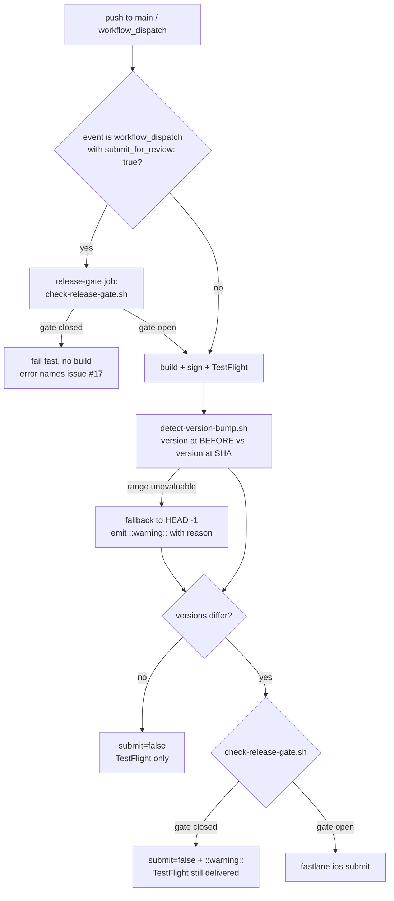
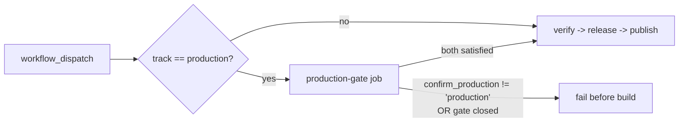

# Strengthen Release Guards for iOS Version Bump and Play Store Production Track - Plan

**Target repo:** `lunarlog` (`wjdavis5/lunarlog`). All paths are repo-relative.

---

## Goal Capsule

- **Objective:** Close the two release-guard holes recorded as findings #6 and #7 of the adversarial review in issue #37 and filed as issue #41 — (a) the iOS App Store submission that is silently skipped when the `version:` bump lands in a non-tip commit of a multi-commit push, and (b) the Play Store `production` dispatch that ships to Google Play review with no enforcement of the documented App Store 5.1.1(v) release gate.
- **Means:** Move the two guard decisions out of inline YAML into two small, unit-tested POSIX shell scripts under `.github/scripts/`, evaluate the iOS bump across the whole pushed commit range (`github.event.before..github.sha`) with an explicit, loud fallback instead of a silent skip, and add a fail-fast gate job plus a typed confirmation input to the Play Store production path. Wire both scripts into CI so the guard logic is proved by tests rather than by pushing to `main`.
- **Authority hierarchy:** Issue #41 owns scope; this document's Product Contract owns the required guard behavior; the Planning Contract owns mechanism.
- **Stop conditions:** Stop and surface if a change would let a production Play release or an App Store submission proceed while the account-deletion gate (issue #17) is unmet, or if a change would block routine TestFlight / Play `internal` delivery on pushes to `main`.
- **Execution profile:** `code`; Standard depth. CI/shell only — no Dart, no schema, no app behavior change.
- **Tail ownership:** In-app account deletion itself stays with issue #17. This plan only builds the mechanical lever that issue #17's completion will flip.

---

## Problem Frame

Two release guards are documented but not enforced correctly.

**Guard 1 — iOS version-bump detection (`.github/workflows/ios-release.yml`, `Detect a version bump` step).** The step compares the marketing version in `pubspec.yaml` at `HEAD` against the version at `HEAD~1`. Every push to `main` in this repo arrives as a **squash-or-merge of a PR branch**, and merge commits routinely carry more than one new commit. When the `version:` bump lands in any commit other than the tip, `HEAD~1` already contains the bumped value, the comparison reports "version unchanged", and the App Store submission is skipped with a green run and a benign log line. The failure is silent: nobody is told that the release they bumped for did not submit.

Two secondary defects sit in the same step. The `release` job checks out with `fetch-depth: 2`, so even the correct range comparison would have no object to read once a push carries three or more commits. And when `git show 'HEAD~1:pubspec.yaml'` fails for any reason, the script assigns `previous="$current"`, which resolves to "no bump" — the most dangerous of the two possible defaults, chosen silently.

**Guard 2 — Play Store production dispatch (`.github/workflows/play-store-release.yml`, `Publish to Google Play Store` step).** `track` is a free `workflow_dispatch` choice, and `production` flows straight into `r0adkll/upload-google-play@v1` with `status: completed`. `AGENTS.md`, `README.md`, and `docs/ops/supabase-go-live.md` all state the same release gate — **no store submission until in-app account deletion has shipped** (App Store guideline 5.1.1(v), tracked by issue #17) — but that gate is prose only. One mis-picked dropdown value publishes to Google Play production with no version check, no confirmation, and no gate.

The two are coupled: fix 1 makes automatic App Store submission fire *more often* and *more reliably*, which raises the cost of guard 2 being process-only. Landing them together is why issue #41 pairs them.

---

## Product Contract

### Requirements

- **R1.** The iOS release workflow detects a `version:` bump anywhere in the range of commits introduced by the push, not only in the tip commit. A bump in the first commit of a five-commit push must submit for App Store review exactly as a bump in the last commit does.
- **R2.** A bump that is introduced and then reverted within the same push nets out to "no bump" and does not submit.
- **R3.** When the range cannot be evaluated — `github.event.before` is the all-zero SHA, the before-commit is unreachable after a force-push, or `pubspec.yaml` did not exist at the before-commit — the workflow falls back to the previous behavior (`HEAD~1`) **and emits a GitHub `::warning::` naming the reason**. No skip and no fallback is silent.
- **R4.** The manual `workflow_dispatch` path (`submit_for_review: true`) keeps its current meaning: an explicit request to submit, independent of any bump.
- **R5.** Routine delivery is unchanged. Every push to `main` still uploads to TestFlight, and Play `internal`/`alpha`/`beta` dispatches still publish, with no new required inputs and no new failure mode.
- **R6.** A Play Store dispatch with `track: production` fails **before** the ~45-minute build unless both of the following hold: the documented account-deletion release gate is recorded as satisfied, and the dispatcher typed an explicit production confirmation.
- **R7.** The account-deletion release gate is a single mechanical fact consulted by both store paths, not two divergent copies of the same rule. Its unsatisfied state is the default; satisfying it is a deliberate, auditable act.
- **R8.** When the gate is unsatisfied and the iOS workflow detects an automatic version bump, the run still uploads to TestFlight but does **not** submit for App Store review, and says so with a `::warning::` that names issue #17. An explicit `submit_for_review: true` dispatch under an unsatisfied gate instead fails fast, before the build.
- **R9.** The guard logic is verifiable without pushing to `main` or dispatching a real release: it is covered by tests that run in CI on every PR.
- **R10.** The repository's own documentation of the release gate (`AGENTS.md`, `README.md`, `docs/ops/supabase-go-live.md`) states the mechanical lever, so the prose and the workflow cannot drift apart again.

### Key Decisions

- **KD1 — The account-deletion gate is a repository variable, not an inferred fact.** `vars.RELEASE_GATE_ACCOUNT_DELETION` must equal `shipped`; anything else (including unset, the state on the day this lands) blocks. Governs R6, R7, R8.
- **KD2 — Blocked automatic submission degrades to TestFlight-only; blocked explicit submission fails.** An automatic bump under a closed gate is a *policy* outcome and should not burn a 60-minute macOS run or deny the team its TestFlight build. An explicit `submit_for_review: true` under a closed gate is a *contradiction of intent* and deserves a hard, fast failure. Governs R5, R8.
- **KD3 — Guard decisions live in tested shell scripts, not inline `run:` blocks.** The residual findings for `feat-social-logins` already name "workflow shell validation" as a known testing gap; a guard whose failure mode is "silently does nothing" is exactly the code that must be tested. Governs R9.

---

## Planning Contract

### Key Technical Decisions

- **KTD1 — Compare the pubspec version at `github.event.before` against the version at `github.sha`, rather than diffing the range.** A range diff (`git diff BEFORE..SHA -- pubspec.yaml`) reports true for a bump-then-revert, violating R2. Comparing the two endpoint values gets R1 and R2 from one comparison and keeps the script's contract identical to the current one (two version strings, compared). Governs R1, R2.
- **KTD2 — The `release` job checks out with `fetch-depth: 0`.** Reading `pubspec.yaml` at an arbitrary before-commit needs history that `fetch-depth: 2` does not have; a `--deepen` loop is more moving parts than a full clone is worth for a repo of this size. The Play Store workflow's `fetch-depth: 2` stays as-is — it never reads history. Governs R1.
- **KTD3 — On an unevaluable range, fall back to `HEAD~1` and warn, rather than defaulting to "no bump" or to "submit".** Defaulting to no-bump reproduces the silent skip this plan exists to remove; defaulting to submit would let a force-push trigger an unintended store submission. Falling back to the prior behavior with a `::warning::` is strictly better than today at every input and never surprises upward. Governs R3.
- **KTD4 — Two scripts, one responsibility each: `detect-version-bump.sh` decides *whether a bump happened*; `check-release-gate.sh` decides *whether submission is permitted*.** Keeping the gate separate is what lets one implementation serve both the iOS submit path and the Play production path (R7) and lets each be tested against its own truth table. Governs R7, R9.
- **KTD5 — Scripts communicate through environment variables in and `$GITHUB_OUTPUT` + exit code out.** No `${{ }}` interpolation inside script bodies, so the same script runs identically under `bash script.sh` in a test harness and under Actions. This also removes the existing expression-injection surface where `${{ inputs.submit_for_review }}` is interpolated directly into a shell string. Governs R9.
- **KTD6 — The Play production gate is a separate job that `release` declares in `needs`, mirroring the existing `migration-gate` job in `ios-release.yml`.** A `needs` job on `ubuntu-latest` fails in seconds; an in-job step would fail after signing and building. The repo already established this pattern for the Supabase migration gate, so it reads as house style. Governs R6.
- **KTD7 — Production confirmation is a typed `workflow_dispatch` string input (`confirm_production`) that must equal `production`.** It is in-repo, reviewable, and testable. A GitHub deployment `environment:` with required reviewers was the alternative (see Alternatives); it is stronger but lives entirely in repo settings, so nothing in the tree would prove it exists. Governs R6.
- **KTD8 — A new `release-guards` CI job runs the shell tests plus `actionlint`.** It needs no Flutter toolchain and no secrets, so it is fast and safe to run on every PR. `actionlint` additionally shellchecks every `run:` block in all four workflows, which is why it is worth adding alongside the unit tests. Governs R9.

### High-Level Technical Design

Decision flow for the iOS submit path after this change:



Play Store production path:



### Output Structure

```text
.github/scripts/
├── detect-version-bump.sh          # new — decides submit=true/false
├── check-release-gate.sh           # new — decides gate open/closed
└── tests/
    ├── detect-version-bump.test.sh # new — temp-git-repo truth table
    └── check-release-gate.test.sh  # new — env-var truth table
```

---

## Implementation Units

### U1. Extract version-bump detection into a tested script

**Goal:** A standalone script that answers "should this run submit for App Store review?" correctly across the whole pushed range, with a loud fallback — proven by tests before any workflow depends on it.

**Requirements:** R1, R2, R3, R4, R9. KTD1, KTD3, KTD5.

**Dependencies:** none.

**Files:**
- `.github/scripts/detect-version-bump.sh` (create)
- `.github/scripts/tests/detect-version-bump.test.sh` (create)

**Approach:**
1. Inputs are environment variables only — event name, before-SHA, head-SHA, the manual `submit_for_review` value, and the current marketing version already resolved by the workflow's `version` step. Output is a `submit=true|false` line appended to `$GITHUB_OUTPUT` (defaulting to `/dev/stdout` when unset so the script is runnable by hand), plus human-readable log lines.
2. Manual dispatch with `submit_for_review: true` short-circuits to `submit=true` (R4) without touching git.
3. Otherwise resolve the *previous* marketing version by reading `pubspec.yaml` at the before-SHA and taking the substring before `+`, reusing the same extraction the workflow's `version` step performs so the two cannot disagree.
4. The before-SHA is unusable when it is empty, when it is the all-zero SHA, when the object is not present, or when `pubspec.yaml` did not exist there. Each of those cases falls back to `HEAD~1` and emits a `::warning::` that names which case fired (R3, KTD3). If `HEAD~1` is also unavailable, treat the version as unchanged and warn again.
5. Compare the two endpoint version strings; differing means bump (R1), identical means no bump — which is what makes a bump-then-revert net out correctly (R2).
6. `set -euo pipefail`, and every value the script consumes comes from the environment, never from `${{ }}` interpolation (KTD5).

**Patterns to follow:** the `set -euo pipefail` + `::error::`/`::warning::` annotation style already used throughout `.github/workflows/ios-release.yml` (`migration-gate` job); the `grep '^version:' | sed | cut -d'+' -f1` version extraction in the existing `Resolve build and version numbers` step.

**Execution note:** Write the test file first and watch it fail against the current inline logic's semantics — the whole defect class here is "the guard silently does nothing", which only a failing test proves is gone.

**Test scenarios** (`.github/scripts/tests/detect-version-bump.test.sh` builds a throwaway git repo per case with `git init` in a temp dir, commits synthetic `pubspec.yaml` contents, and asserts on the emitted `submit=` value and on warning presence):
- Bump in the tip commit of a one-commit push → `submit=true`.
- Bump in the **first** of three pushed commits, tip unchanged → `submit=true`. *(This is the regression the issue reports; it must fail before the fix.)*
- Bump in the middle of a five-commit push → `submit=true`.
- No bump anywhere in a three-commit push → `submit=false`, no warning.
- Bump in commit 1 reverted in commit 3 of the same push → `submit=false` (R2).
- Build-metadata-only change (`1.0.0+7` → `1.0.0+8`) with the same marketing version → `submit=false`.
- `workflow_dispatch` with `submit_for_review: true` and no version change → `submit=true`, and the script performs no git reads.
- `workflow_dispatch` with `submit_for_review: false` and a bumped version → `submit=false` (dispatch does not auto-submit).
- Before-SHA is the all-zero SHA → falls back to `HEAD~1`, emits a `::warning::`, and returns the `HEAD~1` verdict.
- Before-SHA names a commit absent from the local object store (force-push simulation) → same fallback plus warning.
- `pubspec.yaml` absent at the before-commit → same fallback plus warning.
- Both the before-SHA and `HEAD~1` are unavailable (single-commit repo) → `submit=false` plus a warning; never a crash, never an unlogged skip.
- `$GITHUB_OUTPUT` unset → script still runs and prints the verdict rather than failing on an unbound variable.

**Verification:** `bash .github/scripts/tests/detect-version-bump.test.sh` exits 0 with every case reported; the multi-commit case demonstrably fails when run against the pre-fix comparison.

---

### U2. Wire the iOS release workflow to the detection script

**Goal:** `ios-release.yml` uses U1's script and has the history depth to evaluate it.

**Requirements:** R1, R3, R4, R5. KTD2, KTD5.

**Dependencies:** U1.

**Files:**
- `.github/workflows/ios-release.yml` (modify — the `release` job's `actions/checkout` step and the `Detect a version bump` step; refresh the header comment block that documents when submission fires)

**Approach:**
1. Change the `release` job checkout from `fetch-depth: 2` to `fetch-depth: 0` (KTD2).
2. Replace the inline `Detect a version bump` script body with a call to `.github/scripts/detect-version-bump.sh`, passing `github.event_name`, `github.event.before`, `github.sha`, `inputs.submit_for_review`, and `steps.version.outputs.marketing` through the step's `env:` block — not interpolated into the script text (KTD5).
3. Keep the step `id: bump` and the `submit` output name so the downstream `if: steps.bump.outputs.submit == 'true'` condition on the submit step is untouched.
4. Update the file's top-of-file comment so the documented trigger rule says "when the `version:` string changes across the pushed commit range", matching the new behavior.

**Patterns to follow:** the existing `env:`-block-then-`run:` shape used by the `Install the App Store Connect API key` and `Configure signing keychain` steps.

**Test scenarios:** No new script tests — behavior is covered by U1. `actionlint` (U5) must pass on the edited workflow, including the shellcheck pass over the rewritten `run:` block.

**Verification:** `actionlint .github/workflows/ios-release.yml` is clean; the `bump` step's inputs are all env-sourced (no `${{ }}` inside the script body); the `Submit for App Store review` step's condition is byte-identical to before.

---

### U3. Add the shared release-gate check script

**Goal:** One tested implementation of "is App Store / Play production submission permitted yet?", consulted by both store workflows.

**Requirements:** R6, R7, R9. KD1, KTD4, KTD5.

**Dependencies:** none (parallel with U1).

**Files:**
- `.github/scripts/check-release-gate.sh` (create)
- `.github/scripts/tests/check-release-gate.test.sh` (create)

**Approach:**
1. The script reads `RELEASE_GATE_ACCOUNT_DELETION` from the environment and exits 0 only when it equals `shipped` (case-insensitive, whitespace-trimmed). Every other value — unset, empty, `false`, `true`, `yes` — exits non-zero (KD1: closed by default).
2. On a closed gate it emits a `::error::` annotation that states the rule, names App Store guideline 5.1.1(v), names issue #17 as the tracking item, and says exactly how to open the gate (set the `RELEASE_GATE_ACCOUNT_DELETION` repository variable to `shipped`). The message is the whole user experience of this guard — write it as such.
3. An optional `RELEASE_GATE_MODE=warn` makes the script report the closed gate as a `::warning::` and exit 0, which is what the iOS automatic-bump path uses to degrade to TestFlight-only rather than fail the run (KD2, R8). The default mode is hard-fail.
4. No git access, no network, no secrets.

**Patterns to follow:** the `Check gate credentials` step in `ios-release.yml`'s `migration-gate` job — same fail-closed posture and same "explain the fix in the error" style.

**Test scenarios:**
- `RELEASE_GATE_ACCOUNT_DELETION=shipped` → exit 0, no error annotation.
- Variable unset → exit non-zero, error annotation names issue #17 and the variable name.
- Variable empty string → exit non-zero.
- Variable set to `true` → exit non-zero (only `shipped` opens the gate; a truthy-looking value must not).
- Variable set to `Shipped` / ` shipped ` → exit 0 (case and surrounding whitespace tolerated).
- `RELEASE_GATE_MODE=warn` with the gate closed → exit 0 and a `::warning::`, not an `::error::`.
- `RELEASE_GATE_MODE=warn` with the gate open → exit 0, no annotation.
- Unknown `RELEASE_GATE_MODE` value → treated as the hard-fail default, not as `warn`.

**Verification:** `bash .github/scripts/tests/check-release-gate.test.sh` exits 0; the closed-gate error text contains the variable name, the guideline reference, and the issue number.

---

### U4. Gate the Play Store production track and the iOS submission

**Goal:** Neither store path can submit while the gate is closed, and a production Play dispatch additionally requires a typed confirmation — both failing before any build work.

**Requirements:** R6, R7, R8, R5. KD1, KD2, KTD6, KTD7.

**Dependencies:** U2, U3.

**Files:**
- `.github/workflows/play-store-release.yml` (modify — add the `confirm_production` dispatch input, add a `production-gate` job, add it to the `release` job's `needs`, correct the stale two-modes header comment)
- `.github/workflows/ios-release.yml` (modify — add a fail-fast `release-gate` job for explicit dispatch, and a warn-mode gate check between bump detection and the submit step)

**Approach — Play Store:**
1. Add a `confirm_production` string input to `workflow_dispatch`, defaulting to empty, described as "Type `production` to confirm a production release".
2. Add a `production-gate` job on `ubuntu-latest` guarded by `if: inputs.track == 'production'`. It checks out, then runs `check-release-gate.sh` in default (fail) mode, then asserts `confirm_production == 'production'` with its own `::error::` naming what to type. Both assertions run so a dispatcher sees every reason at once rather than one per attempt.
3. Add `production-gate` to the `release` job's `needs` alongside `verify`. Because a skipped `needs` job does not block a dependent job by default in this configuration, confirm during implementation that non-production dispatches still run — if the skipped job blocks, express the gate's non-production pass as an explicit early-exit inside the job instead of an `if:` on the job (R5 is non-negotiable here).
4. Correct the header comment's "Two modes / Automated: pushes to main" text, which describes a push trigger this workflow does not have.

**Approach — iOS:**
1. Add a `release-gate` job on `ubuntu-latest`, `if: inputs.submit_for_review == true`, running `check-release-gate.sh` in default fail mode; add it to the `release` job's `needs` with the same skipped-job caveat as above (R5: a normal push must not be blocked).
2. In the `release` job, insert a step after `Detect a version bump` and before the submit step that runs `check-release-gate.sh` with `RELEASE_GATE_MODE=warn`, conditioned on `steps.bump.outputs.submit == 'true'`. When the gate is closed it writes `submit=false` to `$GITHUB_OUTPUT` under a new step id and emits the warning; the `Submit for App Store review` step's condition becomes the AND of the bump verdict and this gate verdict, so TestFlight delivery is untouched (R8, KD2).

**Patterns to follow:** `ios-release.yml`'s `migration-gate` job — a `needs`-linked pre-flight job that fails closed with an actionable error; its `::error::` messages are the tone to match.

**Test scenarios** (added to `.github/scripts/tests/check-release-gate.test.sh`; workflow wiring itself is proved by `actionlint` plus the manual dispatch checks in the Verification Contract):
- Production gate composite: gate open **and** `confirm_production=production` → both assertions pass.
- Gate open, `confirm_production` empty → fails on the confirmation assertion, and the error names the exact string to type.
- Gate open, `confirm_production=Production` → fails (exact-match confirmation; a near-miss must not pass).
- Gate closed, `confirm_production=production` → fails on the gate assertion, error names issue #17.
- Gate closed **and** confirmation missing → both failures reported in one run, not just the first.

**Verification:** `actionlint` clean on both workflows; the `release` job in each still lists its pre-existing `needs` entries; the iOS `Submit for App Store review` step is reachable only when both the bump verdict and the gate verdict are true.

---

### U5. Run the guard tests in CI

**Goal:** The guards are proved on every PR, so this class of defect cannot return unnoticed.

**Requirements:** R9. KTD8.

**Dependencies:** U1, U3, U4.

**Files:**
- `.github/workflows/ci.yml` (modify — add a `release-guards` job)

**Approach:**
1. Add a `release-guards` job on `ubuntu-latest` that checks out, runs both test scripts, then runs `actionlint` over `.github/workflows/`. No Flutter, no Java, no Supabase, no secrets — it should finish in well under a minute.
2. Install `actionlint` by pinned release download rather than an unpinned action, matching the repo's habit of pinning tool versions.
3. Ensure the new scripts are committed with the executable bit set, and have the job invoke them as `bash <path>` so a lost mode bit cannot break CI on a Windows-authored commit.

**Patterns to follow:** the existing job shape in `.github/workflows/ci.yml` (`check`, `db-tests`, `build-android`, `build-ios`) — one named job per concern, `actions/checkout@v4` first.

**Test scenarios:** `Test expectation: none — this unit adds no behavior of its own; it executes the tests written in U1, U3, and U4.`

**Verification:** the `release-guards` job appears and passes on the PR for this branch; deliberately breaking one assertion in a test script makes it fail, then revert.

---

### U6. Align the documented release gate with the mechanism

**Goal:** The three places that state the release gate in prose also state the lever that enforces it, so the docs and the workflows cannot silently diverge again.

**Requirements:** R10.

**Dependencies:** U4.

**Files:**
- `AGENTS.md` (modify — the "Release gate" bullet and the two release-workflow bullets under "Development & Build Workflow")
- `README.md` (modify — the account-deletion bullet under "Known limitations (accepted)")
- `docs/ops/supabase-go-live.md` (modify — the "Release gate" checklist item)

**Approach:** In each location, keep the existing rule wording and append the mechanism: the gate is enforced by `RELEASE_GATE_ACCOUNT_DELETION`, it is closed until that repository variable is set to `shipped`, production Play dispatches also require typing `production` into `confirm_production`, and issue #17 is what flips it. In `AGENTS.md`, also correct the iOS bullet's description of when submission fires (range, not tip commit).

**Test scenarios:** `Test expectation: none — documentation only.`

**Verification:** every prose statement of the gate names the variable; no doc still describes tip-commit-only bump detection.

---

## Verification Contract

Run from the repo root in the `issue-41` worktree.

| Gate | Command | Expectation |
|---|---|---|
| Bump-detection truth table | `bash .github/scripts/tests/detect-version-bump.test.sh` | Exit 0; the multi-commit-push case passes only after U1 |
| Release-gate truth table | `bash .github/scripts/tests/check-release-gate.test.sh` | Exit 0; closed-gate errors name issue #17 and the variable |
| Workflow lint + shellcheck | `actionlint` (all four workflows) | No findings |
| Dart unaffected | `flutter analyze` and `flutter test` | Same results as `main` — this branch touches no Dart |
| Coverage/CRAP gate unaffected | `dart run tool/quality_gate.dart` | Same result as `main`; shell scripts are outside the Dart coverage surface |
| CI | The PR's `release-guards` job | Present and green |

Manual checks after merge (cannot run pre-merge; record the outcome on the PR):

1. Dispatch `Play Store Release` with `track: production` and `confirm_production` empty → `production-gate` fails within a minute; no build runs; the error names both the confirmation string and issue #17.
2. Dispatch `Play Store Release` with `track: internal` → unchanged end-to-end publish, no new input required.
3. Dispatch `iOS Release` with `submit_for_review: true` while the gate is closed → `release-gate` fails fast; no macOS build minutes are spent.
4. Push a two-commit branch to `main` where the `version:` bump is in the **first** commit → the run's log reports the bump, uploads to TestFlight, and (gate still closed) warns that submission was withheld per issue #17. This is the exact scenario the issue reports as silently skipped.

---

## Scope Boundaries

**In scope:** the two guards named in issue #41 (findings #6 and #7 of issue #37), the shared gate mechanism they both need, the tests that prove them, and the doc lines that state the same rule.

**Not in scope:**
- Implementing in-app account deletion or JSON export — that is issue #17. This plan only builds the lever its completion flips.
- Finding #25 and #28 from issue #37 (the other two "Release gates & compliance" items) and issue #21 (App Store privacy details / Play Data safety parity). Separately tracked.
- Finding #4 from issue #37 — `AGENTS.md:109` claiming the Play workflow triggers on push to `main`. U6 edits nearby lines and U4 corrects the same stale claim in `play-store-release.yml`'s own header comment; if the `AGENTS.md` line is corrected in passing, note it on the PR rather than expanding the plan.
- Migrating other inline workflow shell to scripts, or adding shellcheck/actionlint pre-commit hooks.
- Changing the build-number scheme, the `concurrency` groups, or the fastlane submit lane.

### Deferred to Follow-Up Work

- A GitHub deployment `environment:` with required reviewers on the Play production job (see Alternatives) — strictly stronger than the typed confirmation, but it is repo-settings-only and would leave nothing in the tree to review or test.
- Extending the `release-guards` CI job to lint the Fastfile or the Gradle signing config.

---

## Alternatives Considered

- **Diff the range instead of comparing endpoints** (`git diff BEFORE..SHA -- pubspec.yaml`). Rejected: it reports a bump for a bump-then-revert push, violating R2, and it would also fire on build-metadata-only edits.
- **Derive the account-deletion gate from repository state** (grep for the deletion feature, or query issue #17's state via `gh`). Rejected: grepping for a feature is a clever proxy that breaks on any refactor; querying the issue couples every release to the Issues API and to an issue number surviving unchanged. A repository variable is explicit, auditable, and has exactly one meaning.
- **GitHub deployment `environment:` with required reviewers on the production job.** Genuinely stronger — a human approval no script can bypass. Rejected as the primary mechanism because it lives entirely in repo settings: nothing in the tree proves it is configured, and a plan whose central guard is invisible to code review repeats the problem this issue is about. Deferred as an additive layer.
- **Hard-fail the iOS run when an automatic bump meets a closed gate.** Rejected: it would deny the team its TestFlight build for a policy reason and burn a 60-minute macOS run to do it. KD2's warn-and-degrade keeps delivery intact while making the withheld submission impossible to miss.
- **Keep the logic inline in YAML and verify by dispatching real runs.** Rejected: it is the status quo that produced both findings, it cannot be exercised on a PR, and the failure mode under test is silence.

---

## Risks and Dependencies

- **A skipped `needs` job blocking its dependent.** The gate jobs are conditional; if the dependency semantics block non-production dispatches or ordinary pushes, R5 breaks and routine delivery stops. Mitigation: U4 calls this out explicitly and names the fallback (assert inside the job instead of gating the job). Verify with manual checks 2 and 4 before considering the work done.
- **`fetch-depth: 0` slows the macOS release checkout.** Small repo, small cost; accepted. If it ever matters, a bounded `--deepen` loop is the swap.
- **Branch protection.** Adding `release-guards` to `ci.yml` does not automatically make it a required status check. Flag on the PR whether it should be added to the required set.
- **The gate variable is a manual lever.** It can be set prematurely. It is deliberately a single, named, auditable act — the same property that makes it enforceable makes it flippable; that trade is accepted under KD1.
- **`vars.*` is empty for fork-PR contexts.** Irrelevant here (release workflows are push/dispatch on the upstream repo only), but the fail-closed default means the safe outcome even if that changed.

---

## Definition of Done

- A bump in any commit of a pushed range submits for App Store review; a bump-then-revert does not; an unevaluable range falls back with a visible warning rather than a silent skip.
- A Play `production` dispatch cannot reach `upload-google-play` without both the account-deletion gate open and a typed `production` confirmation, and it fails before the build.
- An explicit `submit_for_review: true` under a closed gate fails fast; an automatic bump under a closed gate still delivers to TestFlight and warns instead of submitting.
- Push-to-`main` TestFlight delivery and Play `internal`/`alpha`/`beta` dispatches behave exactly as they did before.
- All Verification Contract gates pass, and the `release-guards` job is green on the PR.
- `AGENTS.md`, `README.md`, and `docs/ops/supabase-go-live.md` name the enforcing mechanism, not just the rule.

---

## Sources

- GitHub issue [wjdavis5/lunarlog#41](https://github.com/wjdavis5/lunarlog/issues/41) — this plan's scope.
- GitHub issue [wjdavis5/lunarlog#37](https://github.com/wjdavis5/lunarlog/issues/37) — adversarial review; findings #6 and #7, and the "Release gates & compliance" triage group noting the documented gate "has no mechanical guard".
- GitHub issue [wjdavis5/lunarlog#17](https://github.com/wjdavis5/lunarlog/issues/17) — in-app account deletion and JSON export; the item that opens the gate.
- `AGENTS.md` ("Release gate", iOS and Android release workflow bullets), `README.md` ("Known limitations (accepted)"), `docs/ops/supabase-go-live.md` ("Release gate").
- `.github/workflows/ios-release.yml` (`Detect a version bump`, `migration-gate`), `.github/workflows/play-store-release.yml` (`Publish to Google Play Store`), `.github/workflows/ci.yml`.
- `docs/residual-review-findings/feat-social-logins.md` — records "workflow shell validation" as a known testing gap, which U1/U3/U5 close for the release guards.
