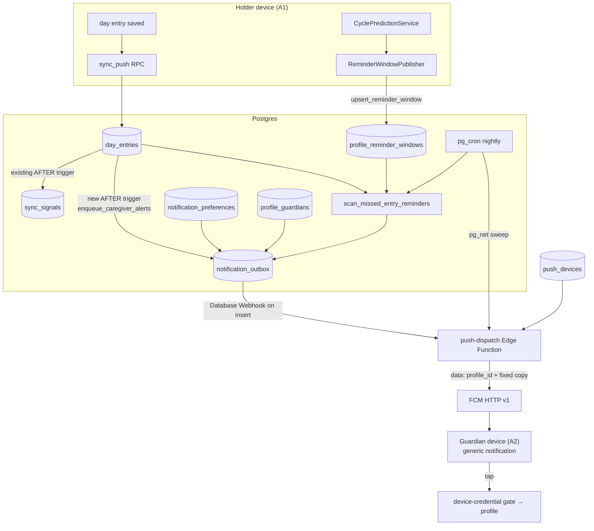
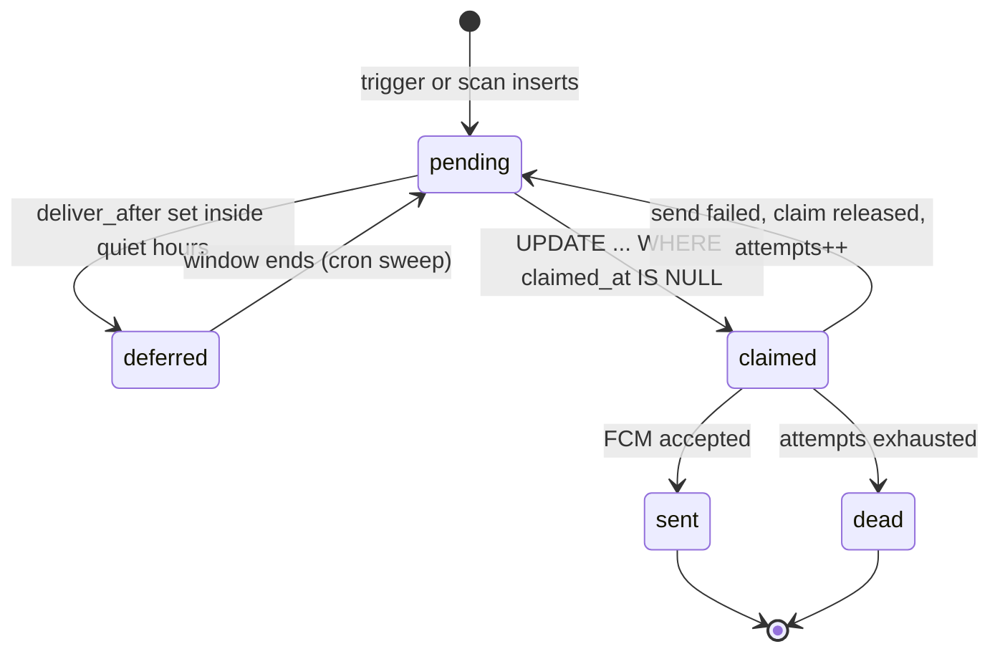

# Caregiver Alert and Reminder Coordinator - Plan

**Target repo:** `lunarlog` (`wjdavis5/lunarlog`). All paths are repo-relative.

---

## Goal Capsule

- **Objective:** A guardian on a shared profile can be alerted, on their own device, when the profile's holder logs an entry, and can be reminded when an expected entry does not arrive - both configurable per profile, both discreet on the lock screen.
- **Means:** Three RLS-protected tables (preferences, push devices, a content-free alert outbox), a `day_entries` AFTER trigger that enqueues alerts, a `pg_cron`-driven missed-entry scan over a client-published prediction snapshot, one Deno Edge Function that drains the outbox to FCM HTTP v1, and a Flutter preference service plus a Notifications screen reached from Manage guardians.
- **Authority hierarchy:** GitHub issue #5 owns product intent; this document's Product Contract owns behavioral specification; the Planning Contract owns technical mechanism; Implementation Units own execution detail.
- **Stop conditions:** Stop and surface if a pgTAP test shows one guardian reading another family's preference, device, or outbox row; if any of `note`, `tags`, `flow`, `local_date`, or a profile `display_name` can reach an FCM payload or an outbox row; if an unconfigured build (empty dart-defines) gains a network path or fails to build; or if `delete_account_data()` leaves a row behind in any of the three new tables.
- **Execution profile:** `code`; deep plan spanning four migrations, one Edge Function, a new Flutter service layer, one screen, and platform push configuration.
- **Tail ownership:** Push notification of a new *feedback reply* (issue #6's tail) is explicitly out of scope here - the transport this plan builds makes it possible later, but nothing in this plan wires it. Broader telemetry belongs to issue #7. Contextual in-app help belongs to `docs/plans/2026-09-04-0738-feat-target-state-roadmap-plan.md` U7.

---

## Product Contract

### Summary

A profile that has been shared with a second adult (issue #8's `profile_guardians`) gains a **Notifications** entry inside **Manage guardians**. There each guardian configures, for that one profile: whether to be alerted when someone logs an entry, whether to narrow that to cycle starts only, whether to be alerted on high-severity days, how many days of silence should trigger a check-in reminder, and a nightly quiet-hours window. Alerts arrive as a remote push on the guardian's phone even when lunarlog is not running. Every alert reads the same discreet line the existing local reminders already use - no name, no date, no health detail - and opens the app to the relevant profile on tap.

### Problem Frame

lunarlog already reminds the *device holder* about their own cycle: `lib/data/notifications/scheduling.dart` plans upcoming and late reminders from the local prediction and `FlutterLocalNotificationsScheduler` fires them on-device. That machinery cannot serve a caregiver, because a caregiver's alert is caused by something that happens on *someone else's* device, hours or days after the caregiver's app was last open. The one existing cross-device signal, `public.sync_signals` (issue #77), only reaches a *running* app over a Realtime websocket - the exact case a parent is not in.

So the missing capability is a server-originated push, and that is where the privacy problem starts. Adding remote push means (a) a third-party push service becomes a data processor for an app whose privacy policy currently promises zero third parties beyond Supabase, Sentry, and Resend, and (b) push payloads travel through that service in plaintext. A naive implementation - "Maya logged heavy flow" on a lock screen, routed through Google - would be a worse privacy regression than the feature is worth. The design below is shaped almost entirely by refusing that.

The second constraint is that the missed-entry half needs a *prediction*, and the prediction algorithm lives in Dart (`lib/domain/prediction/prediction.dart`), unit-tested, with a settled definition of "late". Reimplementing it in SQL would create a second source of truth that drifts silently.

### Key Decisions

- **Push is a content-free wake signal, exactly like `sync_signals`.** The outbox row and the FCM payload carry a profile id and a coarse `kind`, never entry content. The visible title and body are the fixed generic strings already used by the local reminders. This makes the "discreet by default" requirement structural rather than a copy choice. (Governs R9, R10, R11, R21)
- **The issue's "unless opted in by the operator" richer-copy toggle is deliberately not built.** Richer copy is only meaningful if the health detail reaches the lock screen, which means it reaches Google's servers in plaintext first. There is no version of that opt-in that is safe to offer for a minor's cycle data, so v1 offers exactly one copy level. Recorded as a deviation from the issue, not an oversight. (Governs R10, R21)
- **FCM HTTP v1 is the single transport for both platforms; Firebase is configured from dart-defines, never from a checked-in `google-services.json` or `GoogleService-Info.plist`.** `Firebase.initializeApp(options:)` takes explicit `FirebaseOptions`, so the Google Services Gradle plugin is never applied and an unconfigured build (empty defines) still compiles and runs with push simply absent - the invariant AGENTS.md states for every existing define. (Governs R17, R18, R22)
- **The client publishes its prediction to the server; the server never computes one.** A small `profile_reminder_windows` row (profile id, estimated next start, check-in-by date) is upserted whenever the local prediction changes. The missed-entry scan is then a date comparison in SQL, and `lib/domain/prediction/prediction.dart` stays the only implementation of the algorithm. (Governs R12, R13, R14)
- **The `day_entries` trigger enqueues; it never sends.** A second AFTER trigger alongside the existing `sync_signals` one writes into `notification_outbox`. HTTP from a trigger would put an external service in the write path of `sync_push`. Draining is the Edge Function's job, woken by a Database Webhook and swept by `pg_cron`. (Governs R6, R7, R8, R19)
- **Child-directed nudges stay in the existing local reminder stack, unchanged.** The issue's "remind the child to check in" is what `planReminders`' `late` reminders already do on the profile holder's own device. This plan adds only the caregiver-directed half, so there is exactly one planner per audience. (Governs R15)

### Actors

- A1. **Profile holder / logging device:** the person (often a minor) whose profile carries the day entries. Owns no account of their own in the common case; their device is the one that runs the existing local reminders.
- A2. **Guardian recipient:** a signed-in adult with an accepted `profile_guardians` row, who configures preferences and receives alerts.
- A3. **Supabase backend:** Postgres with RLS, `pg_cron`, `pg_net`, and Edge Functions.
- A4. **FCM (Firebase Cloud Messaging):** the push transport; a new data processor, disclosed in `PRIVACY.md`.

### Requirements

#### Preferences

- R1. A guardian with an accepted, non-revoked membership on a profile can read and write notification preferences for that profile, and no other.
- R2. Preferences are per (guardian, profile) pair: two guardians on the same profile configure independently.
- R3. The preference set is: alert on any new entry; narrow to cycle start only; alert on high-severity entries; missed-entry threshold in days (1, 2, 3, or off); quiet-hours start and end; the recipient's IANA time zone.
- R4. A profile with no preference row for a guardian sends that guardian nothing. Off is the default; the feature is opt-in.
- R5. Revoking a guardian stops their alerts for that profile immediately, without requiring the guardian's device to do anything.

#### Active-logging alerts

- R6. Inserting or updating a live `day_entries` row enqueues one alert per eligible guardian other than the writer.
- R7. "Cycle start only" narrows eligibility to entries that open a new bleed episode; "high severity" narrows to heavy flow or a high-severity tag. A guardian who enabled several narrowings receives at most one alert per entry write.
- R8. A guardian never receives an alert for their own write.

#### Delivery and discretion

- R9. An enqueued alert carries only a profile id, a coarse kind, a recipient, and timestamps. No `note`, `tags`, `flow`, `local_date`, or profile `display_name` is ever stored on it or transmitted.
- R10. The delivered notification's visible title and body are the fixed generic strings, identical to the existing local reminders' copy.
- R11. Tapping an alert opens lunarlog and, after the device-credential gate, lands on the profile the alert was about.
- R12. An alert whose dispatch time falls inside the recipient's quiet-hours window is held until the window ends, not dropped.

#### Missed-entry reminders

- R13. When the local prediction for a profile changes, the device publishes an updated reminder window for it.
- R14. A periodic scan enqueues a check-in alert for a guardian when that profile's newest live entry is older than the guardian's configured threshold and either the predicted start has passed or a bleed episode is open.
- R15. Missed-entry alerts never fire more than once per profile per threshold window; a scan that runs again before a new entry arrives enqueues nothing.
- R16. Child-directed "you have not logged" nudges remain the existing on-device local reminders and are unchanged by this work.

#### Configuration and lifecycle

- R17. A build with empty push dart-defines compiles, runs, registers no device, and shows no Notifications entry.
- R18. Push registration only happens on a native platform with a signed-in session and a configured build; web never registers.
- R19. A device token is stored against the signed-in user, refreshed when FCM rotates it, and removed on sign-out.
- R20. `delete_account_data()` removes the caller's preference rows, device rows, and outbox rows, leaving no orphan.
- R21. `PRIVACY.md` discloses FCM as a processor and states that push payloads carry no health content.
- R22. Every existing CI build path (`ci.yml`, `ios-release.yml`, `play-store-release.yml`) still succeeds when the new secrets are absent, including on forks.

### Acceptance Examples

- AE1. Guardian B enables "notify me when someone logs an entry" on profile P, then holder A saves a day entry on their device. B's phone shows *"A reminder from Lunarlog / Open Lunarlog to see what it is about."* and tapping it opens P after the unlock gate.
- AE2. Guardian B enables "only notify on cycle start". A logs a mid-cycle spotting day: nothing is sent. A logs a day that opens a new episode: one alert is sent.
- AE3. A logs an entry themselves while also being a guardian on P. No alert is enqueued for A.
- AE4. B's quiet hours are 22:00-07:00 in `America/New_York`. An entry saved at 23:10 local produces an alert that is delivered at 07:00, not at 23:10 and not never.
- AE5. B sets the missed-entry threshold to 2 days on P. P's predicted start passes and no entry is logged for two days; the scan enqueues exactly one check-in alert. The scan runs again the next night and enqueues nothing. A then logs an entry; the cycle can arm again.
- AE6. The primary guardian revokes B. A subsequent entry write on P enqueues nothing for B, and B's preference row is no longer readable by B.
- AE7. A build with no `FCM_*` defines starts, shows the profile picker, and Manage guardians shows no Notifications entry; `flutter test` and `flutter analyze` pass unchanged.
- AE8. An operator deletes their account. `delete_account_data()` returns, and no `notification_preferences`, `push_devices`, or `notification_outbox` row belonging to them remains.

---

## Planning Contract

### Key Technical Decisions

- **KTD1. Content-free outbox and payload.** `public.notification_outbox` columns are `id`, `profile_id`, `recipient_user_id`, `kind` (a checked text domain: `logged`, `cycle_start`, `high_severity`, `missed_entry`), `created_at`, `deliver_after`, `claimed_at`, `sent_at`, `attempts`, `last_error_kind`. The FCM message carries `data: { profile_id }` plus a fixed `notification` block built from `_shared/notification_copy.ts`. `kind` never crosses the wire - it exists so the scan can dedupe and so the dispatcher can count, not so the device can render. (Governs R9, R10)
- **KTD2. Claim-before-send, mirroring `feedback-notify`.** The dispatcher claims rows with `update ... set claimed_at = now() where claimed_at is null and deliver_after <= now() returning *`, sends, then stamps `sent_at`; a failed send clears `claimed_at` so a later sweep retries, up to a bounded `attempts`. This is the exact pattern `20260906150000_feedback_tickets_notified_at.sql` established and its documented residual risk (process killed mid-send) applies here identically - except that here a stuck claim is recovered by the same `pg_cron` sweep that drives the missed-entry scan, because that sweep already runs every night. (Governs R6, R12)
- **KTD3. Two wake paths, one drain.** A Database Webhook on `notification_outbox` insert invokes `push-dispatch` for immediacy (precedent: `feedback-reply`); `pg_cron` invokes the same function through `pg_net` for quiet-hours releases, retries, and stuck claims. The function is idempotent under KTD2, so both firing at once is safe. (Governs R6, R12)
- **KTD4. Eligibility is computed in SQL inside the trigger, not in the Edge Function.** The trigger already holds the new row and can join `profile_guardians` to `notification_preferences` under `security definer`. Deciding in the function would mean the function reading `day_entries` content with a service-role key - the thing KTD1 exists to avoid. (Governs R6, R7, R8)
- **KTD5. Quiet hours are stored as two `time` columns plus an IANA zone and resolved at enqueue time into `deliver_after`.** No `timestamptz` arithmetic in the client, no per-dispatch zone lookup. The zone comes from the recipient's device (`flutter_timezone` is already a dependency and `lib/domain/util/timezone.dart` already normalizes it). (Governs R12)
- **KTD6. Firebase is initialized from `FirebaseOptions` built out of `AppConfig`, so no `google-services.json` / `GoogleService-Info.plist` is committed or required.** `AppConfig.hasPush` gates every push code path exactly as `hasSupabase` and `hasGoogle` do today. This is what keeps R17/R22 true, and it is the reason the Google Services Gradle plugin must *not* be added to `android/`. (Governs R17, R18, R22)
- **KTD7. The FCM service-account credential lives only in Supabase function secrets.** `push-dispatch` mints a Google OAuth access token by signing an RS256 JWT with Web Crypto and exchanging it at `oauth2.googleapis.com/token`, structurally the same as `_shared/apple_revoke.ts`'s ES256 client-secret flow. No service-account JSON is committed, and no long-lived token is cached across invocations. (Governs R9)
- **KTD8. Missed-entry dedupe is a `last_enqueued_for` marker on `profile_reminder_windows`, not a query over the outbox.** The scan writes the window it just fired for; a re-run compares and no-ops. Deriving it from outbox history would break the moment retention pruning is added. (Governs R15)
- **KTD9. `pg_cron` and `pg_net` are enabled behind a guard that no-ops when the extension is unavailable**, matching `20260906140000_feedback_attachments_bucket.sql`'s storage guard, so `db reset --local` and the `db-tests` CI job never depend on them. The pgTAP tests exercise `scan_missed_entry_reminders()` by calling it directly. (Governs R14)

### High-Level Technical Design

Two enqueue paths, one drain, one transport. Nothing on the right-hand side ever sees entry content.

The outbox row's lifecycle, which is where all the concurrency lives:

---

## Implementation Units

### U1. Notification preference and push-device schema

**Goal:** The two guardian-owned tables exist with RLS that lets a guardian touch only their own rows on profiles they actually guard.

**Requirements:** R1, R2, R3, R4, R5, R19.

**Dependencies:** none.

**Files:**
- `supabase/migrations/20260906160000_notification_preferences.sql` (new)
- `supabase/tests/notification_preferences_rls_test.sql` (new)
- `supabase/tests/push_devices_rls_test.sql` (new)

**Approach:**
1. `public.notification_preferences` keyed `(user_id, profile_id)` with `alert_on_log`, `alert_on_cycle_start_only`, `alert_on_high_severity` booleans defaulting false, `missed_entry_days smallint` null-means-off with a `check (missed_entry_days between 1 and 3)`, `quiet_hours_start time`, `quiet_hours_end time`, `time_zone text`, `updated_at timestamptz`.
2. `public.push_devices` keyed by `id`, with `user_id`, `token text not null`, `platform text check (platform in ('ios','android'))`, `updated_at`, `disabled_at`, and a unique index on `token`.
3. RLS on both. The preferences policies join `public.profile_guardians` requiring `user_id = auth.uid()`, `status = 'accepted'`, and `revoked_at is null` - reusing the exact predicate shape `20260905090000_close_guardian_revocation_bypass.sql` settled, so revocation closes reads and writes together (R5).
4. `push_devices` policies are plain `user_id = auth.uid()`; no cross-user read at all. The dispatcher reaches it with `service_role`.
5. Grant `authenticated` select/insert/update/delete on both, no `anon` grant anywhere.

**Patterns to follow:** `supabase/migrations/20260904010000_multi_guardian_schema.sql` for RLS shape and role predicates; `20260905090000_close_guardian_revocation_bypass.sql` for the `revoked_at` predicate; every existing migration's header-comment convention (state what and why, cite the issue).

**Test scenarios** (`supabase/tests/notification_preferences_rls_test.sql`, `push_devices_rls_test.sql`):
- An accepted guardian can insert and then select their own preference row for a profile they guard.
- A guardian cannot select another guardian's preference row for the same profile.
- A user who guards nothing cannot insert a preference row for an arbitrary profile id.
- A guardian whose `profile_guardians.revoked_at` is set can no longer select or update their previously-readable preference row.
- `missed_entry_days = 0` and `missed_entry_days = 4` are both rejected by the check constraint; `null` is accepted.
- A user can insert, update, and delete only their own `push_devices` row; selecting another user's row returns zero rows.
- Inserting a duplicate `token` violates the unique index.
- `anon` has no grant on either table.

**Verification:** `npx --yes supabase@2.116.0 db reset --local` applies cleanly, then `test db --local` passes with the two new files' plan counts.

---

### U2. Caregiver alert outbox and the `day_entries` enqueue trigger

**Goal:** A live `day_entries` write fans out into content-free outbox rows for exactly the eligible guardians, with quiet hours already resolved.

**Requirements:** R6, R7, R8, R9, R12.

**Dependencies:** U1.

**Files:**
- `supabase/migrations/20260906170000_notification_outbox.sql` (new)
- `supabase/tests/notification_outbox_test.sql` (new)

**Approach:**
1. `public.notification_outbox` per KTD1, with `kind` constrained to the four values and indexes on `(claimed_at, deliver_after)` and `(recipient_user_id, profile_id, kind, created_at)`.
2. RLS enabled with **no** `authenticated` policy - the table is service-role and trigger territory only. A guardian never reads their own queue.
3. `public.resolve_deliver_after(p_now timestamptz, p_quiet_start time, p_quiet_end time, p_zone text) returns timestamptz` - a pure `immutable`-where-possible helper implementing KTD5, handling the wrap-past-midnight case and a null zone (treat as no quiet hours).
4. `public.enqueue_caregiver_alerts()` as an AFTER INSERT OR UPDATE trigger on `day_entries`, `security definer`, `set search_path = public`. It skips tombstoned rows (`deleted_at is not null`), derives whether the row opens an episode (mirroring `lib/domain/episodes/episodes.dart`'s rule: a bleeding flow whose immediately preceding day for the profile is non-bleeding or absent) and whether it is high severity, then inserts one row per accepted, non-revoked guardian whose preferences make it eligible and whose `user_id` is not the writer (`coalesce(new.last_modified_by_user_id, new.user_id)`).
5. Eligibility is a single boolean expression so a guardian with several narrowings on gets one row, not three (R7).
6. Attach the trigger *after* the existing `sync_signals` trigger and note in the header that the two are independent.

**Technical design** (directional, not a spec): eligibility reads roughly as `p.alert_on_log and (not p.alert_on_cycle_start_only or v_is_cycle_start) and (not p.alert_on_high_severity or v_is_high_severity)`, with `kind` chosen as the most specific of `cycle_start` / `high_severity` / `logged`.

**Patterns to follow:** `supabase/migrations/20260905100000_realtime_publication.sql` for AFTER-trigger-on-`day_entries` shape and its "no health content crosses" reasoning; `lib/domain/episodes/episodes.dart` and `lib/domain/tags.dart` for the episode-start and severity definitions the SQL must mirror.

**Execution note:** write `supabase/tests/notification_outbox_test.sql`'s cycle-start and self-write cases before the trigger body - the eligibility expression is the whole unit, and it is much easier to get right against failing assertions than to review by eye.

**Test scenarios** (`supabase/tests/notification_outbox_test.sql`):
- A guardian with `alert_on_log` gets exactly one outbox row when the holder inserts an entry.
- A guardian with no preference row gets nothing.
- A guardian with `alert_on_log` false gets nothing even when the other flags are true.
- With `alert_on_cycle_start_only`, an entry preceded by a bleeding day produces nothing; an entry preceded by a non-bleeding day (or by nothing) produces one row with `kind = 'cycle_start'`.
- With `alert_on_high_severity`, a heavy-flow entry produces one row; a light-flow entry with no severe tag produces none.
- A guardian who is also the writer (`last_modified_by_user_id = their id`) gets no row.
- Two eligible guardians on one profile produce exactly two rows, one each.
- A revoked guardian produces no row.
- A tombstoned (`deleted_at` set) update produces no row.
- Updating an existing entry produces a row for an `alert_on_log` guardian and no row for a `cycle_start_only` guardian when the episode boundary did not move.
- Outbox rows contain no column capable of holding `note`, `tags`, `flow`, or `local_date` - asserted structurally against `information_schema.columns`.
- `authenticated` selecting `notification_outbox` returns zero rows even for their own `recipient_user_id`.
- `resolve_deliver_after` returns `p_now` unchanged outside the window, the window end for a same-day window, and the next morning's end for a window that wraps midnight.

**Verification:** `test db --local` green; the structural column assertion is the mechanical guard behind the stop condition.

---

### U3. Reminder-window snapshot, missed-entry scan, and the cron sweep

**Goal:** The server can tell that an expected entry did not arrive, using the client's prediction rather than its own.

**Requirements:** R12, R13, R14, R15.

**Dependencies:** U1, U2.

**Files:**
- `supabase/migrations/20260906180000_reminder_windows_and_cron.sql` (new)
- `supabase/tests/missed_entry_scan_test.sql` (new)

**Approach:**
1. `public.profile_reminder_windows` keyed by `profile_id`, holding `estimated_next_start date`, `episode_open boolean`, `updated_at`, and `last_enqueued_for date` (KTD8). RLS: a guardian who can write the profile can upsert it; nobody else reads it.
2. `public.upsert_reminder_window(p_profile_id uuid, p_estimated_next_start date, p_episode_open boolean)` - `security invoker`, so RLS decides. Granted to `authenticated` only.
3. `public.scan_missed_entry_reminders() returns integer` - `security definer`. For each preference row with `missed_entry_days is not null`, find the profile's newest live `day_entries.local_date`; enqueue a `missed_entry` row when that date is more than `missed_entry_days` behind `current_date` **and** (`estimated_next_start <= current_date` or `episode_open`), and when `last_enqueued_for` is distinct from the window being fired for. Set `last_enqueued_for` in the same statement.
4. `public.sweep_notification_outbox()` - releases claims older than 15 minutes and returns the count, so the nightly job also recovers KTD2's stuck-claim window.
5. A guarded `do $$ ... $$` block that creates the `pg_cron` and `pg_net` extensions and schedules a nightly job calling `scan_missed_entry_reminders()`, `sweep_notification_outbox()`, and a `net.http_post` to `push-dispatch`; the whole block is wrapped so a stack without those extensions logs a notice and continues (KTD9).

**Patterns to follow:** `supabase/migrations/20260906140000_feedback_attachments_bucket.sql` for the "guard the whole block, no-op locally" idiom; `20260906120000_account_deletion_final_rehome.sql` for `security definer` + revoked-grants hygiene.

**Test scenarios** (`supabase/tests/missed_entry_scan_test.sql`):
- No preference row with a threshold: the scan enqueues nothing.
- Threshold 2, newest entry 3 days old, predicted start already passed: exactly one `missed_entry` row.
- Same state, scan called twice: still exactly one row (the `last_enqueued_for` dedupe).
- Same state, then a new entry is logged and the window advances: a later scan can enqueue again.
- Threshold 2, newest entry 3 days old, but predicted start is in the future and no episode is open: nothing enqueued.
- Threshold 2, newest entry 1 day old: nothing enqueued.
- `episode_open` true with a stale newest entry and no passed prediction: one row (trigger B of the issue).
- A revoked guardian with a threshold set: nothing enqueued.
- `upsert_reminder_window` called by a non-guardian is rejected by RLS.
- `scan_missed_entry_reminders` and `sweep_notification_outbox` grant no `execute` to `authenticated` or `anon`.
- `sweep_notification_outbox` releases a claim stamped 20 minutes ago and leaves a claim stamped 1 minute ago alone.

**Verification:** `test db --local` green on a stack started without `pg_cron`, proving KTD9's guard.

---

### U4. Account-deletion and revocation coverage for the new tables

**Goal:** Deleting an account, or revoking a guardian, leaves nothing behind in the three new tables.

**Requirements:** R5, R20.

**Dependencies:** U1, U2, U3.

**Files:**
- `supabase/migrations/20260906190000_account_deletion_notifications.sql` (new)
- `supabase/tests/account_deletion_test.sql` (modify)

**Approach:**
1. `create or replace function public.delete_account_data()` carrying the existing body verbatim plus deletes of `notification_preferences`, `push_devices`, and `notification_outbox` rows owned by the caller, and `profile_reminder_windows` rows for profiles the caller *owns*. Extend the returned json counts.
2. `create or replace function public.revoke_guardian(...)` to also delete the revoked guardian's `notification_preferences` row and their pending `notification_outbox` rows for that profile - R5's "immediately", not merely "no longer readable".
3. Restate in the header why the deletes are scoped the way they are, mirroring the `day_entries` owner-vs-caregiver reasoning `20260905110000_account_deletion.sql` already documents.

**Patterns to follow:** `supabase/migrations/20260906120000_account_deletion_final_rehome.sql` (the current `delete_account_data()` definition, which this replaces); `20260905090000_close_guardian_revocation_bypass.sql` for the `revoke_guardian` replace pattern.

**Test scenarios** (added to `supabase/tests/account_deletion_test.sql`):
- After `delete_account_data()`, the caller has zero `notification_preferences`, zero `push_devices`, and zero `notification_outbox` rows.
- A *co-guardian's* preference row on a profile the deleted caller also guarded survives.
- `profile_reminder_windows` for a profile the caller owned is gone; one for a profile they merely guarded survives.
- The returned json includes non-zero counts for the new tables when rows existed.
- After `revoke_guardian`, the revoked guardian's preference row for that profile is gone and their unsent outbox rows for it are gone, while their rows for a *different* profile they still guard survive.

**Verification:** `test db --local`; the existing 42 `account_deletion_test.sql` assertions must still pass unchanged alongside the new ones.

---

### U5. `push-dispatch` Edge Function and the FCM sender

**Goal:** Outbox rows become FCM messages exactly once, with fixed generic copy.

**Requirements:** R9, R10, R12.

**Dependencies:** U2.

**Files:**
- `supabase/functions/push-dispatch/index.ts` (new)
- `supabase/functions/push-dispatch/index.test.ts` (new)
- `supabase/functions/_shared/push.ts` (new)
- `supabase/functions/_shared/push.test.ts` (new)
- `supabase/functions/_shared/notification_copy.ts` (new)
- `supabase/functions/_shared/notification_copy.test.ts` (new)
- `supabase/functions/deno.json` (modify - add `push-dispatch/**/*.test.ts` to `test.include`)
- `supabase/config.toml` (modify - add `[functions.push-dispatch]` with `verify_jwt = false`, it is webhook/cron-invoked)

**Approach:**
1. `_shared/notification_copy.ts` holds the two generic strings and a `buildPushMessage(profileId)` returning the FCM v1 message body. The strings must match `kReminderTitle` / `kReminderBody` in `lib/data/notifications/scheduling.dart` character for character; its test asserts the literal values so a client-side copy change that forgets the server is caught.
2. `_shared/push.ts` exposes `sendPush(deps, token, message)`. It mints a Google OAuth token by RS256-signing a JWT with Web Crypto from a caller-supplied service-account key (never read from `Deno.env` inside the module - the `_shared/email.ts` round-7 lesson), posts to `fcm.googleapis.com/v1/projects/<id>/messages:send`, applies an `AbortSignal.timeout`, and classifies failures as `timeout`, `network_error`, `unregistered`, or `other`. `unregistered` is distinct because it means the token is dead.
3. `push-dispatch/index.ts` exports `handlePushDispatch(deps)` taking every I/O call as an injected `PushDispatchDeps`, exactly as `feedback-notify/index.ts` does. It claims a bounded batch (KTD2), looks up the recipient's active `push_devices` rows, sends, stamps `sent_at` on success, releases the claim and increments `attempts` on failure, and marks a device `disabled_at` on `unregistered`.
4. The handler never reads `day_entries`, `profiles`, or `notification_preferences` - it needs none of them, and that is the enforcement of KTD1.

**Patterns to follow:** `supabase/functions/feedback-notify/index.ts` (injected-deps handler + claim-before-send); `supabase/functions/_shared/email.ts` (caller-supplied credentials, `AbortSignal.timeout`, failure classification); `supabase/functions/_shared/apple_revoke.ts` (Web Crypto JWT signing in Deno).

**Test scenarios** (`deno test`):
- `notification_copy.test.ts`: `buildPushMessage` puts only `profile_id` in `data`; the title and body equal the literal expected strings; no other key appears anywhere in the serialized message.
- `push.test.ts`: a stubbed `fetch` returning 200 yields success; a 404 with FCM's `UNREGISTERED` error yields `unregistered`; an aborting fetch yields `timeout`; a thrown network error yields `network_error`; the OAuth exchange is attempted before the send and its failure short-circuits without a send.
- `index.test.ts`: an empty outbox sends nothing; one pending row with one device sends once and stamps `sent_at`; a row with two devices for the recipient sends twice; a failed send leaves `sent_at` null, clears `claimed_at`, and increments `attempts`; an `unregistered` result disables that device row and does not retry it; a row whose `deliver_after` is in the future is not claimed; a row already `claimed_at` by another invocation is not claimed again; a recipient with zero devices marks the row sent rather than looping forever.

**Verification:** `cd supabase/functions && deno test` passes locally and in `ci.yml`'s `edge-functions` job (the `deno.json` edit is what puts it there). Local end-to-end smoke via `supabase functions serve` + `curl` per the `docs/ops/supabase-go-live.md` runbook pattern, since CI cannot reach FCM.

---

### U6. Flutter preference service and reminder-window publisher

**Goal:** The app can read and write a guardian's per-profile preferences, and keeps the server's reminder window in step with the local prediction.

**Requirements:** R1, R2, R3, R4, R13.

**Dependencies:** U1, U3.

**Files:**
- `lib/domain/notifications/notification_preferences.dart` (new - pure model: `CaregiverAlertPreferences`, `QuietHours`, `MissedEntryThreshold`)
- `lib/domain/notifications/notification_preferences_service.dart` (new - interface + sealed `NotificationPreferencesFailure`)
- `lib/data/notifications/supabase_notification_preferences_service.dart` (new)
- `lib/data/notifications/reminder_window_publisher.dart` (new)
- `test/domain/notifications/notification_preferences_test.dart` (new)
- `test/data/notifications/supabase_notification_preferences_service_test.dart` (new)
- `test/data/notifications/reminder_window_publisher_test.dart` (new)
- `test/support/fake_notification_preferences_service.dart` (new)

**Approach:**
1. The domain model is pure Dart with value equality and `copyWith`, following `lib/domain/models/profile_guardian.dart`'s shape, including `toDb`/`fromDb` mapping for the enum-ish fields.
2. The service interface is `watchFor(profileId)`, `save(profileId, prefs)`, and nothing else. Failures are a sealed hierarchy with `userFacingMessage`, mirroring `SharingFailure`.
3. `SupabaseNotificationPreferencesService` is the only file that touches `SupabaseClient`; it maps PostgREST errors onto the sealed failures and never lets a raw provider message reach the UI (the R11-of-#6 precedent, applied here).
4. `ReminderWindowPublisher` subscribes to `CyclePredictionService.watch(profileId)` for active profiles, debounces, and calls `upsert_reminder_window`. It derives `episode_open` from `lib/domain/episodes/episodes.dart` rather than re-deciding. It no-ops when signed out and swallows failures (this is best-effort background upkeep, not a user action).

**Patterns to follow:** `lib/domain/sharing/sharing_service.dart` + `lib/data/sharing/supabase_sharing_service.dart` for the three-file domain/data/failure shape; `lib/data/notifications/reminder_coordinator.dart` for the debounced stream-fan-in and disposal discipline; `test/support/fake_sync_engine.dart` for the fake shape.

**Test scenarios:**
- Model: `copyWith` round-trips every field; equality distinguishes each field; `MissedEntryThreshold` maps 1/2/3/off to and from the database representation and rejects an unknown value.
- `QuietHours` reports whether a given local time falls inside a same-day window and inside a window that wraps midnight; a null window contains nothing.
- Service: `watchFor` emits the stored preferences; emits the all-off default when no row exists (R4).
- Service: `save` writes and the watch stream re-emits the saved value.
- Service: a PostgREST permission error maps to the unauthorized failure with a non-raw message; a socket error maps to the network failure; an unknown error maps to the generic failure and the raw text appears in neither.
- Publisher: a prediction change publishes exactly one upsert after the debounce, not one per intermediate emission.
- Publisher: an `ActivePrediction` with an open episode publishes `episodeOpen: true`; a `NotEnoughHistory` prediction publishes nothing.
- Publisher: a signed-out state publishes nothing; a failure from the RPC is swallowed and does not cancel the subscription.
- Publisher: `dispose` cancels every subscription and a late emission after disposal is a no-op.

**Verification:** `flutter analyze` clean; `flutter test`; `dart run tool/quality_gate.dart` stays green with these files fully inside the denominator (none of them wraps a plugin).

---

### U7. Push registration client

**Goal:** A configured native build with a signed-in session registers an FCM token, keeps it fresh, removes it on sign-out, and routes a tap to the right profile.

**Requirements:** R11, R17, R18, R19, R22.

**Dependencies:** U1, U6.

**Files:**
- `pubspec.yaml` (modify - add `firebase_core`, `firebase_messaging`)
- `lib/config.dart` (modify - `FCM_PROJECT_ID`, `FCM_SENDER_ID`, `FCM_ANDROID_API_KEY`, `FCM_ANDROID_APP_ID`, `FCM_IOS_API_KEY`, `FCM_IOS_APP_ID`, and `AppConfig.hasPush`)
- `lib/domain/notifications/push_registration.dart` (new - `PushTokenSource` interface and `PushDeviceRegistry` interface, pure Dart)
- `lib/data/notifications/firebase_push_token_source.dart` (new - the `firebase_messaging` adapter, including `FirebaseOptions` from `AppConfig`)
- `lib/data/notifications/push_registration_coordinator.dart` (new - auth-state-driven register/refresh/remove, testable against fakes)
- `lib/data/notifications/supabase_push_device_registry.dart` (new)
- `lib/main.dart` (modify - construct the token source and coordinator on native configured builds only)
- `lib/app.dart` (modify - own the coordinator's lifecycle beside `ReminderCoordinator`, route the tap payload through the existing `GateController.setPendingLaunchProfileId`)
- `tool/quality/exclusions.dart` (modify - exclude `firebase_push_token_source.dart`)
- `dart_defines.example.json` (modify)
- `.github/workflows/ci.yml`, `.github/workflows/ios-release.yml`, `.github/workflows/play-store-release.yml` (modify - pass the six new defines)
- `ios/Runner/Runner.entitlements` (modify - `aps-environment`)
- `ios/Runner/Info.plist` (modify - `UIBackgroundModes: remote-notification`)
- `test/data/notifications/push_registration_coordinator_test.dart` (new)
- `test/support/fake_push_token_source.dart` (new)
- `test/config_test.dart` (modify)

**Approach:**
1. `AppConfig.hasPush` requires every `FCM_*` define non-empty **and** `hasSupabase` **and** not web - the same conjunction shape `hasGoogle` already uses. Every push code path is behind it (R17, R18).
2. `PushTokenSource` is `Future<String?> currentToken()` plus `Stream<String> tokenRefreshes()` plus `Stream<String> taps()` (emitting the `profile_id` from the message data). Pure Dart, so the coordinator is fully testable.
3. `FirebasePushTokenSource` builds `FirebaseOptions` from `AppConfig` and calls `Firebase.initializeApp(options:)` - deliberately no `google-services.json`, no Google Services Gradle plugin, no `GoogleService-Info.plist` (KTD6). It is a pure plugin adapter and goes on the reviewed exclusion list with a reason in the same voice as the existing entries.
4. `PushRegistrationCoordinator` listens to `AuthService.states`: on a confirmed user id it registers the current token and every refresh; on sign-out it deletes this device's row. It is the unit that carries the logic and therefore the tests.
5. Tap routing reuses the existing seam - `lib/app.dart` already passes `gate?.setPendingLaunchProfileId` into `ReminderCoordinator.start`; the push tap stream feeds the same callback so the post-unlock landing behaviour is identical for local and remote notifications (R11).
6. Android needs no manifest change beyond what `firebase_messaging` contributes; the notification channel already exists (`lunarlog_reminders`) and the server message names it.

**Execution note:** land the `AppConfig`/`hasPush` change and its `test/config_test.dart` assertions first and run a `--dart-define`-free `flutter build apk` before adding the plugin, so the R17/R22 "unconfigured build still works" invariant is proven before the dependency that could break it exists.

**Test scenarios** (`push_registration_coordinator_test.dart`, against fakes):
- A signed-in start registers the current token exactly once with the right platform.
- A token refresh while signed in registers the new token; the previous row for this device is replaced, not duplicated.
- Sign-out deletes this device's registration and stops registering refreshes.
- A sign-in after a sign-out registers again.
- A token-refresh event that arrives while signed out registers nothing.
- A registry failure is swallowed and does not cancel the auth subscription; a subsequent refresh still registers.
- A tap event forwards the message's `profile_id` to the injected callback; a tap with no `profile_id` forwards nothing.
- `dispose` cancels every subscription and a late event afterwards is a no-op.
- `test/config_test.dart`: `hasPush` is false with any single `FCM_*` define empty, false on web, false without `hasSupabase`, true only with the full set.

**Verification:** `flutter analyze`; `flutter test`; `dart run tool/quality_gate.dart` (the new exclusion entry must be the only exclusion added, and `test/tool/quality/coverage_filter_test.dart` must still pass); `flutter build apk` and `flutter build ios --no-codesign` with **no** dart-defines both succeed (R22). Real token issuance and delivery are device-checklist items, not CI.

---

### U8. Notification preferences screen and composition-root wiring

**Goal:** A guardian can configure alerts from Manage guardians, and nothing about it appears on an unconfigured build.

**Requirements:** R1, R3, R4, R17.

**Dependencies:** U6, U7.

**Files:**
- `lib/ui/sharing/notification_preferences_screen.dart` (new)
- `lib/ui/sharing/manage_guardians_screen.dart` (modify - a "Notifications" tile, rendered only when a `NotificationPreferencesService` is provided)
- `lib/app.dart` (modify - provide `NotificationPreferencesService` and start `ReminderWindowPublisher`, both `null`-gated like `sharingService` / `feedbackService`)
- `test/ui/notification_preferences_test.dart` (new)
- `test/ui/sharing_flow_test.dart` (modify - the entry-point tile's presence and absence)

**Approach:**
1. The screen renders the exact controls the issue specifies: a switch for "Notify me when [Name] logs an entry", a dependent switch for "Only notify on cycle start", a switch for high-severity, a dropdown for 1/2/3 days/Off, and a quiet-hours time-range pair. Dependent switches are disabled while the parent is off.
2. Saves are optimistic with a failure snackbar carrying `userFacingMessage`, matching `lib/ui/sharing/invite_guardian_dialog.dart`'s behaviour.
3. The screen states, in copy, that alerts never show what was logged - the discretion guarantee should be visible, not just implemented.
4. `lib/app.dart` gains two nullable widget fields alongside `sharingService`; when either is null the tile is absent and the publisher never starts, which is how R17 holds on an unconfigured build with zero conditionals in the UI.
5. Every interactive widget carries a `ValueKey`, matching the existing `settings_screen.dart` convention.

**Patterns to follow:** `lib/ui/settings/settings_screen.dart` for tile/gating idiom and `ValueKey` naming; `lib/ui/sharing/manage_guardians_screen.dart` for role-gated navigation; `test/ui/settings_test.dart` and `test/ui/sharing_flow_test.dart` for the widget-test harness and `test/support/pump_helpers.dart` usage.

**Test scenarios** (`test/ui/notification_preferences_test.dart`, `test/ui/sharing_flow_test.dart`):
- With a service provided, Manage guardians shows the Notifications tile and tapping it pushes the screen.
- With no service provided, the tile is absent.
- The screen loads and displays stored preferences.
- With no stored row, every switch is off and the threshold shows Off (R4).
- Toggling "notify on log" on enables the two dependent switches; toggling it off disables and visually clears them.
- Changing the threshold dropdown to 2 days persists a save with the right value.
- Setting a quiet-hours range persists both times; clearing it persists nulls.
- A save failure surfaces the failure's `userFacingMessage` and leaves the screen usable.
- The discretion copy is present on screen.
- A guardian with `viewer` role sees the screen (alerts are a read-side capability, not a logging one) - asserted so the role gate is deliberate rather than accidental.

**Verification:** `flutter test`; `dart run tool/quality_gate.dart`; `dart run tool/mutation_gate.dart` locally over the changed files.

---

### U9. Documentation, ops runbook, and privacy disclosure

**Goal:** The parts a machine cannot apply are written down where the operator will find them, and the new third party is disclosed.

**Requirements:** R21, R22.

**Dependencies:** U1-U8.

**Files:**
- `docs/ops/supabase-go-live.md` (modify - Firebase/APNs dashboard prerequisites, the `push-dispatch` secrets, the Database Webhook, the `pg_cron` job, a `push-dispatch` runbook, and new device-checklist rows)
- `PRIVACY.md` (modify - FCM as a processor; push payloads carry no health content)
- `AGENTS.md` (modify - the four migrations, the new Edge Function, the new dart-defines, the new `production` secrets, and the new pgTAP files, in the existing prose style)
- `README.md` (modify - known limitations: no CI coverage of real push delivery)
- `lib/ui/settings/settings_screen.dart` (modify - one line in the in-app privacy summary naming push)

**Approach:**
1. Dashboard prerequisites to enumerate: a Firebase project; an APNs auth key uploaded to it; Push Notifications capability on the `com.wjdavis5.lunarlog` App ID and a regenerated provisioning profile (this compounds with the already-open Sign in with Apple profile TODO - say so explicitly); a Firebase service account whose JSON becomes the `FCM_SERVICE_ACCOUNT` function secret; a Database Webhook on `notification_outbox` insert pointed at `push-dispatch`.
2. Device-checklist rows to add: alert received with the app killed; alert received during quiet hours arriving after the window; tap routing through the lock gate; sign-out stops alerts; revocation stops alerts; missed-entry reminder after a real threshold elapses.
3. Note the CI reality plainly: `db-tests` covers the SQL, `edge-functions` covers the dispatcher's logic against fakes, and **nothing** in CI proves a real FCM delivery.

**Test expectation:** none - documentation only. The one code edit (a privacy-copy line) is covered by the existing `test/ui/settings_test.dart` privacy-dialog assertions, which must be updated to match rather than left stale.

**Verification:** `flutter test` still green after the copy change; a read-through confirming every new secret, dashboard step, and manual check named anywhere in U1-U8 appears in `docs/ops/supabase-go-live.md`.

---

## Verification Contract

Run from the worktree root, in this order. Flutter lives at `C:\src\flutter\bin` and is not on `PATH`; in Git Bash use `export PATH="/c/src/flutter/bin:$PATH"`. The Supabase CLI is not installed globally; use `npx --yes supabase@2.116.0 ...`.

| Gate | Command | Covers |
|---|---|---|
| Dependencies | `flutter pub get` | U7's new packages resolve |
| Static analysis | `flutter analyze` | all Dart units |
| Dart tests | `flutter test` | U6, U7, U8, and the layering guard |
| Coverage + CRAP | `dart run tool/quality_gate.dart` | 90% floor and per-method CRAP ≤ 10, including the one new exclusion |
| Mutation (local only) | `dart run tool/mutation_gate.dart` | U6/U8 changed-file mutation survival |
| Local stack | `npx --yes supabase@2.116.0 start -x realtime,storage-api,imgproxy,mailpit,studio,edge-runtime,logflare,vector,supavisor` | prerequisite for the SQL gates |
| Migrations apply | `npx --yes supabase@2.116.0 db reset --local` | U1-U4 apply in filename order from scratch |
| pgTAP | `npx --yes supabase@2.116.0 test db --local` | U1-U4, including the existing 303 assertions unchanged |
| Edge Function | `cd supabase/functions && deno test` | U5 (also the `edge-functions` CI job) |
| Unconfigured build | `flutter build apk` and `flutter build ios --no-codesign`, both with **no** `--dart-define` | R17, R22 |
| Advisors | Supabase MCP `get_advisors` (security + performance) against `dleexnnevuuddcgcpztq` | RLS findings on the three new tables, before approving any `supabase-migrate.yml` run |
| Device checklist | manual, iPhone + Android, throwaway account, fabricated profiles only | real FCM delivery, quiet-hours release, tap routing, sign-out, revocation |

**Never run `dart format`** - the codebase is in the pre-3.13 style and the new formatter would rewrite whole files.

Migration filenames must sort after `main`'s current tip (`20260906150000_feedback_tickets_notified_at.sql`); if `main` moves under this branch, rename the four new files to sort after the new tip and note the rename in each header, per AGENTS.md's Migration Flow item 7.

---

## Definition of Done

1. Every gate in the Verification Contract passes, with the pre-existing pgTAP and Dart assertions unchanged.
2. Every acceptance example AE1-AE8 is demonstrably satisfied - AE1-AE6 by pgTAP, `deno test`, or widget tests; AE7 by the unconfigured-build gate; AE8 by `account_deletion_test.sql`.
3. No stop condition is reachable: `notification_outbox` has no column able to hold entry content (asserted structurally), the FCM message carries only `profile_id` plus fixed copy (asserted in `notification_copy.test.ts`), and cross-family reads fail in pgTAP.
4. `docs/ops/supabase-go-live.md` lists every dashboard prerequisite, secret, and manual check introduced here, and `PRIVACY.md` discloses FCM.
5. `AGENTS.md` describes the new migrations, function, tables, defines, and secrets in its existing style.

---

## Scope Boundaries

### In scope

Caregiver-directed alerts on shared profiles; the preference surface for them; the missed-entry scan; the push transport those need end to end; the account-deletion and revocation cleanup that keeps them from leaking.

### Non-goals

- **Richer lock-screen copy behind an opt-in.** Deliberately refused; see Key Decisions.
- **In-app notification history or an inbox.** The outbox is a delivery queue, not a readable feed - `authenticated` has no policy on it at all.
- **Changing the existing local reminder planner.** `lib/data/notifications/scheduling.dart` and `reminder_coordinator.dart` are read from and wired beside, never modified.
- **Web push.** Web stays the insecure iteration surface (KTD9 of the original plan); `hasPush` is false there by construction.
- **Email or SMS fallback when a device has no token.** One transport.

### Deferred to follow-up work

- Push notification of a new feedback reply (issue #6's stated tail) - now cheap on top of this transport, but a separate issue.
- Outbox retention pruning and a dead-letter view for `attempts`-exhausted rows.
- Periodic reconciliation of the cron job's own existence, alongside AGENTS.md's already-tracked Realtime-publication reconciliation follow-up.
- Per-guardian rate limiting, if a chatty profile turns out to produce alert fatigue in real use.

---

## Risks and Dependencies

- **`SUPABASE_ACCESS_TOKEN` is unset in the `production` environment, so `supabase-migrate.yml` has never successfully pushed a migration.** These four migrations inherit that blockage exactly as the feedback ones did. The plan is unaffected in CI (`db-tests` runs the full suite against a local stack) but nothing here reaches the cloud project until that token is provisioned. Out of scope, unchanged.
- **The iOS provisioning profile in `IOS_PROVISION_PROFILE_BASE64` already needs regenerating for Sign in with Apple and now also needs Push Notifications.** One regeneration covers both; doing it for only one capability wastes the trip. Called out in U9.
- **`pg_cron` scheduling behaviour differs between the local stack and Supabase Cloud.** KTD9's guard means local never depends on it, which also means local never *proves* it. The scan and sweep functions are tested directly; the schedule itself is a go-live checklist item.
- **FCM introduces a third-party processor into a privacy-first app.** Mitigated structurally (content-free payloads) and disclosed (R21), but it is a genuine posture change and should be a deliberate acceptance, not a side effect of merging.
- **The trigger duplicates two domain rules in SQL** - episode-start detection and severity classification. Divergence from `lib/domain/episodes/episodes.dart` and `lib/domain/tags.dart` is the most likely silent bug in this plan. The pgTAP cases in U2 are written against the same fixtures as `test/domain/episodes_test.dart` for exactly that reason.

---

## Open Questions

- **Q1. Which severity signals count as "high severity"?** The plan assumes heavy flow plus a fixed subset of `lib/domain/tags.dart` codes. The exact subset should be read off the taxonomy at implementation time and stated in the migration header; if the taxonomy has no obvious severe subset, narrow to heavy flow alone and say so.
- **Q2. Should `push-dispatch` get a `verify_jwt = false` posture, given it is webhook- and cron-invoked?** The plan assumes yes, with the webhook secret and the `pg_net` call as the only callers, matching `feedback-reply`. Confirm against `feedback-reply`'s actual `config.toml` stanza during U5 rather than assuming.
- **Q3. Nightly is assumed for the cron cadence.** A quiet-hours release can therefore wait up to a day. If that proves too coarse in practice, a 15-minute cadence is a one-line change - but it multiplies `pg_net` invocations, so start nightly and revisit.

---

## Sources and Research

- GitHub issue `wjdavis5/lunarlog#5` - product intent.
- `AGENTS.md` - backend configuration, migration flow, quality gates, dashboard prerequisites, and the `SUPABASE_ACCESS_TOKEN` gap.
- `docs/plans/2026-09-05-001-feat-in-app-feedback-support-plan.md` - the Edge Function + RLS + three-file-service precedent this plan follows closely, and the origin of the "tail belongs to issue #5" note.
- `supabase/migrations/20260905100000_realtime_publication.sql` - the content-free wake-signal architecture this plan's push payload extends.
- `supabase/migrations/20260906150000_feedback_tickets_notified_at.sql` and `supabase/functions/feedback-notify/index.ts` - the claim-before-send pattern and its documented residual risk.
- `supabase/functions/_shared/apple_revoke.ts` - Web Crypto JWT signing in Deno, the model for the FCM OAuth exchange.
- `lib/data/notifications/scheduling.dart` - the generic copy constants and lock-screen privacy posture the server-side copy must match.
- `lib/domain/prediction/prediction.dart`, `lib/domain/episodes/episodes.dart` - the prediction and episode definitions the reminder window publishes and the trigger mirrors.
- No external research was run: the repo carries direct, recent precedents for every layer this plan touches (RLS tables, Deno Edge Functions with injected deps, notification scheduling, dart-define gating), so local patterns were the stronger source.
