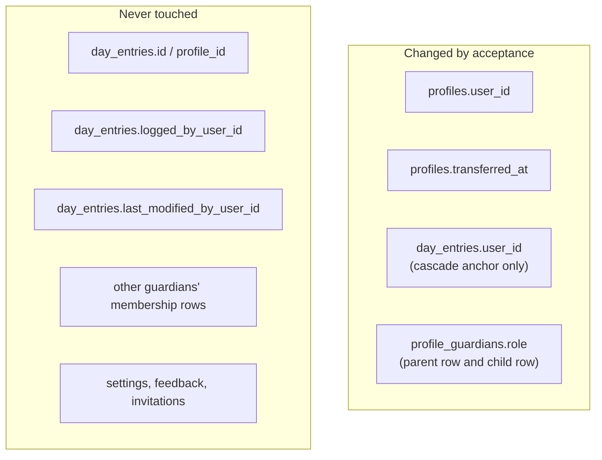

# Parent-First Custodianship and Ownership Transfer to Child - Plan

**Target repo:** `lunarlog` (`wjdavis5/lunarlog`). All paths are repo-relative.

---

## Goal Capsule

- **Objective:** Let the adult who created a minor's profile hand the profile's ownership to that minor's own Supabase account, keeping every historical entry attached and unchanged, and leaving the parent connected in a role the parent picked before the handover.
- **Means:** One new server-side table (`ownership_transfers`), three `security definer` RPCs that arm, cancel, and execute the handover, two new `profiles` columns plus `transferred_at`, a Drift v4 migration, a domain/data service pair in the house three-file shape, and two screens (parent "Transfer profile", child "Claim profile") reusing the existing `lunarlog://invite` deep-link latch.
- **Authority hierarchy:** GitHub issue #4 owns product intent. This document's Product Contract owns behavioral specification. The Planning Contract owns technical mechanism. Implementation Units own execution detail. Where issue #4's SQL sketch names `profiles.owner_id` and `profile_memberships`, this plan's KTD1 overrides it — those are this repo's `profiles.user_id` and `profile_guardians`.
- **Stop conditions:** Stop and surface if a pgTAP test shows any `day_entries` row deleted, duplicated, re-keyed, or moved between profiles by a transfer; if a profile can end a transaction with zero or two accepted `primary_guardian` rows; if an `authenticated` caller can reach the attribution-guard bypass introduced in U3; or if a stale offline parent client can reclaim ownership through `sync_push`.
- **Execution profile:** `code`; deep plan spanning migrations, RLS, RPC security, a Drift schema bump, a new service layer, and two screens.
- **Tail ownership:** QR-code scanning is deferred (KTD9). Reconciling the two coexisting ownership representations (`profiles.user_id` and the `primary_guardian` membership) into one is deferred. Native push notification of a pending transfer belongs to issue #5.

---

## Product Contract

### Summary

A parent who created a profile for their child gains a **Transfer ownership** action on that profile. It asks the parent which role they want afterwards — Co-manager (can still log) or Viewer (read-only) — warns what changes, and produces a single-use link with a 72-hour expiry. The child opens the link on their own device, signs into or creates their own account, and confirms. At that moment the child becomes the profile's owner and sole primary guardian, the parent becomes the role they chose, and every past entry stays exactly where it was, still labelled with who logged it. If the child never confirms, the link expires and nothing about the profile has changed.

### Problem Frame

`lunarlog` today models one adult operator who owns every profile they create. `profiles.user_id` is set from `auth.uid()` at insert, is absent from the client `UPDATE` column grant, and is written by no RPC — ownership is permanent. `profile_guardians` can add a co-parent, a caregiver, or a viewer, but `guardian_invitations.role` explicitly forbids `primary_guardian`, so no existing path can move the top role to a new account.

That permanence is wrong for the data this app holds. A cycle history for a twelve-year-old is created under a parent's account and is still that person's health record at seventeen. If ownership cannot move, the only ways a teenager gets control are for a parent to hand over their account password, or for the history to be abandoned and restarted. The first destroys the parent's own privacy and the second destroys years of a minor's health record.

The constraint that shapes the whole design is that `profiles.user_id` is not a label. It is the `on delete cascade` anchor from `auth.users`, the scope `delete_account_data()` uses to decide which profiles to destroy, and the notion of "the profile's actual owner" that `rehome_stray_day_entries()` corrects `day_entries.user_id` against. Moving it moves who can destroy the record.

### Key Decisions

- **The child becomes the owner in both representations at once.** `profiles.user_id` and the accepted `primary_guardian` membership row move to the child inside one transaction. Nothing in the schema ties those two together today; a transfer that moved one and not the other produces a profile the ex-parent can still read through the `(select auth.uid()) = user_id` branch of `profiles_select_guardians` while every day-entry policy denies them. (Governs R10, R11, R12)
- **The parent's continuing access is a membership, never a retained `user_id`.** After transfer the parent reaches the profile only through `profile_guardians`, which is revocable by the child. Leaving any `user_id`-derived access behind would make the child's control nominal. (Governs R13, R14, R23)
- **No history is copied, deleted, or re-keyed.** Entries stay on their `profile_id`; `logged_by_user_id` and `last_modified_by_user_id` are never rewritten, so "Logged by Mom" stays true for every pre-transfer entry. The one column that moves is `day_entries.user_id`, and only because it is a cascade anchor. (Governs R15, R16, R17)
- **Expiry is a no-op, not a rollback.** Until the child accepts, the only row the feature has written is the transfer row itself. There is nothing to undo. (Governs R7, R8)
- **The parent decides readiness; the app does not.** Birth year is recorded and shown, but no automated age check gates or forces a transfer. Legal capacity to hold an account varies by jurisdiction and the parent is the one who knows the child. (Governs R2, R5)

### Actors

- A1. **Transferring parent:** the adult who currently holds `profiles.user_id` and the accepted `primary_guardian` membership for the target profile. Initiates and can cancel a transfer.
- A2. **Child (profile subject):** the person whose cycle the profile records. Holds no account before the transfer; holds their own Supabase account after it.
- A3. **Other guardians:** existing accepted `co_parent`, `caregiver`, or `viewer` members of the profile. Not parties to the transfer; their rows are untouched.
- A4. **Supabase backend:** Postgres with RLS, the `sync_push` RPC, and Realtime wake signals.

### Requirements

#### Profile subject metadata

- R1. A profile records an optional birth year for its subject.
- R2. The birth year is display and context only; it never gates, forces, or auto-schedules a transfer.
- R3. A profile records an optional relationship of the subject to the profile creator, drawn from a fixed set.
- R4. Both fields sync through the existing `sync_push` / cursor-pull path like every other profile attribute.
- R5. A profile records the instant its ownership last moved, or null if it never has.

#### Transfer initiation and lifecycle

- R6. The accepted `primary_guardian` of a profile can arm exactly one ownership transfer for that profile at a time.
- R7. Arming a transfer requires the parent to choose their own post-transfer role: `co_parent` or `viewer`.
- R8. A transfer expires 72 hours after it is armed unless accepted or cancelled; the default is caller-overridable within 1 to 168 hours.
- R9. The arming parent can cancel a live transfer, which returns the profile to its unchanged state.
- R10. Arming, cancelling, and expiring change nothing about the profile, its memberships, or its entries.

#### Acceptance and handover

- R11. A signed-in user who presents the transfer's secret token, and who is not the arming parent, becomes the profile's owner.
- R12. Acceptance sets `profiles.user_id` to the accepting user and stamps `profiles.transferred_at`.
- R13. Acceptance leaves the accepting user holding the profile's only accepted `primary_guardian` membership.
- R14. Acceptance leaves the arming parent holding an accepted membership in the role chosen at R7.
- R15. Acceptance re-points `day_entries.user_id` from the arming parent to the accepting user for every entry on the profile.
- R16. Acceptance never changes `day_entries.logged_by_user_id` or `day_entries.last_modified_by_user_id`.
- R17. Acceptance inserts, deletes, re-keys, and moves no `day_entries` row.
- R18. Acceptance is single-use; a second presentation of the same token is refused.
- R19. Acceptance leaves every other guardian's membership row unchanged.
- R20. A token that is expired, cancelled, already accepted, or presented by the arming parent is refused with a distinguishable reason.

#### Authorization and isolation

- R21. `profiles.user_id` remains unreachable from any client write path; only the acceptance RPC changes it.
- R22. A profile has exactly one accepted `primary_guardian` at every committed state.
- R23. After transfer, the ex-parent's access to the profile and its entries derives only from their membership row, and the child can revoke it.
- R24. A parent client that has not yet synced cannot reclaim ownership by pushing a stale profile row through `sync_push`.
- R25. Attribution stamping stays server-authoritative for every path other than the acceptance RPC's re-home.

#### Client behavior

- R26. The parent sees a transfer entry point only on a profile they are the accepted `primary_guardian` of, and only in a build with an account signed in.
- R27. A child opening a claim link while signed out is taken through sign-in or account creation, then returned to the claim confirmation.
- R28. After a successful claim, the child's device holds the profile's full history without a manual refresh.
- R29. After a successful transfer the parent's device reflects their new role, and a `viewer` parent cannot log.

### Acceptance Examples

- AE1. **Covers R15, R16, R17.** Given profile P owned by parent A with 400 `day_entries`, 120 of them carrying `logged_by_user_id = A`, when child B accepts the transfer, then `select count(*) from day_entries where profile_id = P` is still 400, all 400 carry `user_id = B`, and the 120 still carry `logged_by_user_id = A`.
- AE2. **Covers R22, R13, R14.** Given a transfer armed with `parent_post_transfer_role = 'viewer'`, when B accepts, then `profile_guardians` for P holds exactly one accepted row with `role = 'primary_guardian'` and it belongs to B, and A's row is accepted with `role = 'viewer'`.
- AE3. **Covers R10, R8.** Given a transfer armed 73 hours ago and never accepted, when B presents the token, then the RPC raises `object_not_in_prerequisite_state`, `profiles.user_id` is still A, and `profiles.transferred_at` is still null.
- AE4. **Covers R24.** Given B has accepted the transfer and A retained `co_parent`, when A's offline client pushes P's profile row through `sync_push` with a newer `updated_at` and `user_id: A` in the payload, then the push is accepted for the metadata columns and `profiles.user_id` is still B.
- AE5. **Covers R23.** Given A holds a `viewer` membership after the transfer, when B calls `revoke_guardian(P, A)`, then A's next pull denies P and A's device tombstones the local profile.
- AE6. **Covers R25.** Given a caregiver C with the `update (last_modified_by_user_id)` grant, when C issues a direct PostgREST update to a `day_entries` row on P without stamping themselves, then the attribution guard still raises.

### Success Criteria

- Every requirement in "Acceptance and handover" and "Authorization and isolation" is proven by a pgTAP assertion in `supabase/tests/ownership_transfer_test.sql`.
- `flutter test` passes with `dart run tool/quality_gate.dart` still clearing the 90% line floor and the per-method CRAP gate.
- A two-device manual run transfers a profile with real (fabricated) history and the child's device shows every past entry with its original attribution.

### Scope Boundaries

#### In-Scope

- `ownership_transfers` schema, RLS, grants, and the three RPCs.
- `profiles.birth_year`, `profiles.relationship`, `profiles.transferred_at` on server and in Drift v4.
- The single-accepted-primary-guardian constraint (R22), which this feature is the first operation able to violate.
- Parent transfer screen, child claim sheet, and `kind=claim` deep-link routing.
- Doc updates to `AGENTS.md`, `PRIVACY.md`, `README.md`, and `docs/ops/supabase-go-live.md`.

#### Deferred to Follow-Up Work

- **QR-code generation and scanning.** See KTD9.
- **Collapsing the dual ownership representation.** `profiles.user_id` and the `primary_guardian` membership stay as two facts kept in sync by this feature's RPC. Removing the `(select auth.uid()) = user_id` disjunct from `profiles_select_guardians` / `profiles_update_guardians` touches policies this issue does not otherwise need to move.
- **Transferring a profile back, or on to a third account.** The RPCs are written so a second transfer is mechanically possible, but no UI exposes it and no test covers it.
- **Notifying the parent when a claim is accepted.** Issue #5.

#### Outside This Product's Identity

- Any automated age check that unlocks, forces, or schedules a transfer.
- An operator or support path that can transfer a profile on a family's behalf. Transfers are family-initiated only; `service_role` has no transfer surface.

### Sources

- Issue #4 (the SQL sketch, the four-stage lifecycle, and the 72-hour TTL).
- `docs/plans/2026-09-04-0710-feat-multi-guardian-support-plan.md` — its KTD2 and its "Deferred to Follow-Up Work" entry designed `profile_guardians` to receive this feature.
- `supabase/migrations/20260904010000_multi_guardian_schema.sql` — `profile_guardians`, `guardian_invitations`, `is_profile_guardian`, `is_guardian_with_roles`, `enforce_day_entry_attribution`, and the current `profiles` / `day_entries` policies.
- `supabase/migrations/20260906120000_account_deletion_final_rehome.sql` — `rehome_stray_day_entries()`, the existing statement that `profiles.user_id` is "the profile's actual owner" and that `day_entries.user_id` is corrected against it.
- `lib/app.dart` lines 175-237 — the invite deep-link latch and its sign-in replay, reused unchanged by the claim flow.

---

## Planning Contract

### Key Technical Decisions

- KTD1. **Reuse `profile_guardians` and `profiles.user_id`; do not introduce `owner_id` or `profile_memberships`.** Issue #4's sketch names tables this repo does not have. `profiles.user_id` appears in two composite primary keys, six RLS policies, five RPCs, the Drift schema, and the sync codec; `profile_guardians` already carries exactly the four roles the issue's lifecycle needs. Renaming buys no behavior and would invalidate 303 passing pgTAP assertions. The only new column on `profiles` from the sketch is `transferred_at`.
- KTD2. **A dedicated `ownership_transfers` table rather than a flag on `guardian_invitations`.** `guardian_invitations.role` has a `check (role in ('co_parent','caregiver','viewer'))` that forbids the role a transfer must grant, and `accept_guardian_invitation`'s revoked-token logic (#82) is tuned to membership grants. A transfer also carries a field an invitation has no place for: the arming parent's post-transfer role. Overloading the invitation path would mean loosening a constraint and a proven RPC to serve a different verb. The new table copies the invitation table's proven shape — SHA-256 hex `token_hash unique`, plaintext never stored, server-computed `expires_at`, `accepted_at` / `accepted_by` / `cancelled_at` in place of a status column.
- KTD3. **The whole handover is one `security definer` RPC, `accept_ownership_transfer`.** Ownership, both membership rows, and the `day_entries` re-home commit together or not at all. A client-orchestrated multi-call sequence could strand a profile with no primary guardian or with the child owning `profiles.user_id` while the parent still holds `primary_guardian`. Lock order is transfer row, then `profiles`, then `profile_guardians`, matching the invitations-then-membership order `accept_guardian_invitation` and `revoke_guardian` already share, so the two families of RPC cannot deadlock against each other.
- KTD4. **The re-home reaches `day_entries.user_id` through a transaction-local GUC bypass in `enforce_day_entry_attribution()`, not by restamping attribution.** The guard today raises on any `day_entries` update where `auth.uid()` is non-null and `last_modified_by_user_id` differs from the caller. `rehome_stray_day_entries()` slips past it only because it sets `last_modified_by_user_id = p_user_id`, which in its caller equals `auth.uid()`. Doing the same here would rewrite "Modified by Mom" to "Modified by the child" across every historical entry, falsifying the record and breaking R16. The RPC instead calls `set_config('lunarlog.ownership_transfer', 'on', true)` — transaction-local — and the guard permits the update only when that GUC is on **and** the only changed column is `user_id`. `set_config` lives in `pg_catalog` and is not a PostgREST-reachable RPC, so `authenticated` cannot arm the bypass; the conjunct on "only `user_id` changed" means even a hypothetical leak could not forge attribution. `delete_account_data()`'s existing behavior is unchanged because it never sets the GUC.
- KTD5. **A partial unique index enforces R22.** `create unique index profile_guardians_one_primary_uq on public.profile_guardians (profile_id) where role = 'primary_guardian' and status = 'accepted'`. Nothing enforces this today — `revoke_guardian` only counts primaries at self-leave time, and the `unique (profile_id, user_id)` constraint permits two users each holding `primary_guardian`. The transfer is the first operation that promotes an arbitrary account into that role, so the invariant has to become structural here rather than remain a convention. The migration asserts the existing data satisfies it before creating the index, and fails loudly if it does not.
- KTD6. **One live transfer per profile, enforced structurally.** `create unique index ownership_transfers_one_live_uq on public.ownership_transfers (profile_id) where accepted_at is null and cancelled_at is null and expires_at > now()` is not usable — `now()` is not immutable. Use `(profile_id) where accepted_at is null and cancelled_at is null` instead, and have `create_ownership_transfer` cancel the caller's own expired-but-uncancelled row before inserting. This keeps "at most one outstanding link" true without a mutable predicate, and makes re-issuing a link a deliberate cancel-then-create.
- KTD7. **Birth year, not date of birth.** A full date of birth is a materially stronger identifier attached to a minor's health record and buys nothing the app computes. `birth_year smallint` with a `check (birth_year between 1900 and 2200)` carries the context the transfer screen needs.
- KTD8. **`relationship` is a closed set, not free text.** `check (relationship in ('self','daughter','son','child','partner','other'))`, mirrored by a Dart enum with `toDb()` / `fromDb()` exactly like `GuardianRole` in `lib/domain/models/profile_guardian.dart`. Free text on a minor's profile is another place identifying detail can be typed into a synced field.
- KTD9. **No QR code in this issue.** `pubspec.yaml` carries no QR or scanner dependency. A scanner needs camera permission, `NSCameraUsageDescription`, an Android camera declaration, and a data-safety amendment on an app holding minors' health data. `share_plus` is already a dependency and covers AirDrop, Messages, and the system share sheet, which satisfies the issue's stated channels. Deferred.
- KTD10. **The claim link reuses the `lunarlog://invite` host with a `kind=claim` parameter.** `main.dart`'s `_isInviteLink` predicate already admits any `lunarlog://invite?code=...`, and `lib/app.dart`'s `_pendingInviteCode` latch already replays a link that arrived while signed out — which is precisely R27. A new `claim` host would need an Android intent-filter entry, a second stream threaded through `LunarLogRoot` and `LunarLogApp`, and a duplicate latch. The `kind` parameter is what stops a claim token being posted to `accept_guardian_invitation`, where it would surface as a confusing "invitation not found".
- KTD11. **The transfer is online-only and holds no local state.** No Drift table for transfers. A transfer's outcome reaches every device through the existing `profiles` and `profile_guardians` cursor pull plus the `sync_signals` Realtime wake. Drift v4 therefore adds only three columns to `profiles`.
- KTD12. **Migration filenames are `20260906160000`, `20260906170000`, `20260906180000`.** They sort after `main`'s current tip, `20260906150000_feedback_tickets_notified_at.sql`, per the ordering rule in `AGENTS.md`'s "Migration Flow" step 7.

### High-Level Technical Design

#### Transfer state machine

The transfer row is the only mutable object until acceptance. Every terminal state except `accepted` leaves the profile byte-identical to how the parent left it.

```mermaid
stateDiagram-v2
  [*] --> Armed: create_ownership_transfer<br/>(primary_guardian only)
  Armed --> Cancelled: cancel_ownership_transfer<br/>(arming parent)
  Armed --> Expired: expires_at passes<br/>(no write; evaluated at accept)
  Armed --> Accepted: accept_ownership_transfer<br/>(child, token, not the parent)
  Cancelled --> [*]
  Expired --> [*]
  Accepted --> [*]
  note right of Accepted
    The only state that writes
    profiles, profile_guardians,
    or day_entries.
  end note
```



#### Handover sequence

```mermaid
sequenceDiagram
  participant P as Parent device
  participant DB as Postgres
  participant C as Child device
  P->>DB: create_ownership_transfer(profile, role, token_hash, ttl)
  DB-->>P: {id, expires_at}
  P->>C: lunarlog://invite?code=<token>&profile=<id>&kind=claim
  C->>C: sign in or create account (latched until signedIn)
  C->>DB: accept_ownership_transfer(sha256(token), names)
  Note over DB: single transaction
  DB->>DB: lock transfer, then profiles, then memberships
  DB->>DB: profiles.user_id := child; transferred_at := now()
  DB->>DB: day_entries.user_id := child (GUC bypass, KTD4)
  DB->>DB: parent membership := chosen role
  DB->>DB: child membership := primary_guardian
  DB-->>C: {profile_id, profile_name, parent_role, entries_rehomed}
  C->>DB: triggerFullReconcile -> cursor pull
  DB-->>C: profile + full day_entries history
  DB-->>P: sync_signals wake -> pull -> new role
```

#### What moves and what does not



### Assumptions

- "Both parties confirm" from issue #4 is satisfied by two confirmations: the parent's destructive-action confirm when arming, and the child's confirm when claiming. No third armed-by-parent-after-child-opens state is built.
- The child creates their account through the existing sign-in surface. If the project's "Allow new users to sign up" setting is closed (see `docs/ops/supabase-go-live.md`), the child's sign-up fails with the existing `AuthSignUpClosedFailure`, and the operator must reopen sign-ups to onboard them. No change to that setting is made here.
- The transferring parent is the profile's accepted `primary_guardian`. A co-parent cannot arm a transfer.
- No production project has ever received these migrations through CI (`supabase-migrate.yml` has failed at its credentials step on every run to date), so the R22 backfill assertion in U2 is expected to find a clean dataset. It still runs, and still fails loudly if it does not.

### Risks and Mitigations

| Risk | Mitigation |
|---|---|
| A stale offline parent client reclaims ownership through `sync_push`. | `sync_push` tolerates but never reads `user_id` from a profile payload, and its update path does not write the column. U4 adds an explicit regression assertion (AE4) so a future edit to `sync_push` cannot silently open this. |
| The attribution-guard bypass (KTD4) becomes reachable by a client. | The guard requires the GUC **and** that only `user_id` changed. U4 asserts an `authenticated` role cannot set the GUC through any granted surface, and that `delete_account_data()`'s existing re-home still works without it. |
| The parent deletes their account while a transfer is pending. | `ownership_transfers.profile_id` cascades off `profiles`, which cascades off `auth.users`. The pending row disappears with the profile. Covered by a U4 assertion. |
| The child deletes their account after transfer, destroying the history. | This is the intended consequence of sovereignty (R23) and is disclosed in the transfer confirmation copy and in `PRIVACY.md` (U11), not prevented. |
| The R22 index (KTD5) fails to create on an existing dataset. | The migration asserts the invariant before creating the index and raises with the offending `profile_id`s, so a deploy fails visibly instead of half-applying. |
| Drift v4 half-applies and quarantines an install. | Follow the existing idiom in `lib/data/db/db.dart` exactly: one `if (from < 4)` block wrapping every step in `transaction()`, each step followed by `migrationStepHook?.call(...)`. Drift 2.34.3 does not wrap `onUpgrade` itself. |

---

## Implementation Units

### Unit Index

| U-ID | Title | Key files | Depends on |
|---|---|---|---|
| U1 | Profile subject metadata and `transferred_at` | `supabase/migrations/20260906160000_*.sql` | — |
| U2 | `ownership_transfers` table and structural invariants | `supabase/migrations/20260906170000_*.sql` | U1 |
| U3 | Transfer RPCs and the attribution-guard bypass | `supabase/migrations/20260906180000_*.sql` | U2 |
| U4 | pgTAP suite for the transfer | `supabase/tests/ownership_transfer_test.sql` | U3 |
| U5 | Drift v4, `Profile` model, codec, repository | `lib/data/db/db.dart`, `lib/domain/models/profile.dart` | U1 |
| U6 | Domain transfer contract and failure taxonomy | `lib/domain/sharing/ownership_transfer_service.dart` | — |
| U7 | Supabase transfer service and wiring | `lib/data/sharing/supabase_ownership_transfer_service.dart` | U3, U6 |
| U8 | Profile metadata in create/edit dialogs | `lib/ui/profiles/profile_dialogs.dart` | U5 |
| U9 | Parent transfer screen | `lib/ui/sharing/transfer_ownership_screen.dart` | U7 |
| U10 | Child claim sheet and `kind=claim` routing | `lib/ui/sharing/claim_profile_sheet.dart`, `lib/app.dart` | U7 |
| U11 | Docs, privacy, and ops runbook | `AGENTS.md`, `PRIVACY.md`, `docs/ops/supabase-go-live.md` | U4, U10 |

---

### U1. Profile subject metadata and `transferred_at`

- **Goal:** Add `birth_year`, `relationship`, and `transferred_at` to `public.profiles` and make the first two syncable.
- **Requirements:** R1, R3, R4, R5.
- **Dependencies:** none.
- **Files:**
  - `supabase/migrations/20260906160000_profile_subject_metadata.sql` (create)
  - `supabase/tests/sync_push_test.sql` (modify — extend the key-allowlist and round-trip coverage)
- **Approach:**
  1. `alter table public.profiles add column birth_year smallint`, with `constraint profiles_birth_year_check check (birth_year is null or birth_year between 1900 and 2200)`.
  2. `add column relationship text`, with `constraint profiles_relationship_check check (relationship is null or relationship in ('self','daughter','son','child','partner','other'))` (KTD8).
  3. `add column transferred_at timestamptz`.
  4. Extend the client column grant: `grant update (birth_year, relationship) on table public.profiles to authenticated`. `transferred_at` gets **no** grant — it is ownership state, written only by U3's RPC, matching how `profile_guardians.revoked_at` is handled.
  5. `create or replace` `public.sync_push` to add `birth_year` and `relationship` to `c_profile_keys` and to both the insert and update paths. Add `transferred_at` to `c_profile_keys` as tolerated-but-never-read, alongside `user_id` and `server_version`, so a client that pulls the column and pushes it back is not rejected.
  6. Header comment records the U1/KTD7/KTD8 rationale and the filename-ordering note per `AGENTS.md` Migration Flow step 7.
- **Patterns to follow:** `supabase/migrations/20260904010000_multi_guardian_schema.sql` for `alter table ... add column` plus a named check constraint; `supabase/migrations/20260904020000_sync_push_and_invitations.sql` for the `create or replace function public.sync_push` shape and the `c_profile_keys` array.
- **Test scenarios:**
  - A push carrying `birth_year: 2011` and `relationship: 'daughter'` persists both and returns no rejection.
  - A push carrying `relationship: 'cousin'` is rejected without aborting the batch's other rows.
  - A push carrying `birth_year: 1800` is rejected by the check constraint and lands in `rejected`.
  - A push carrying `transferred_at` is accepted and the stored `transferred_at` is unchanged.
  - An `authenticated` role's direct `update public.profiles set transferred_at = now()` is denied for lack of a column grant.
  - An `authenticated` role's direct `update public.profiles set birth_year = 2010` on an owned profile succeeds.
- **Verification:** `npx --yes supabase@2.116.0 db reset --local` applies cleanly, then `npx --yes supabase@2.116.0 test db --local` passes with the extended `sync_push_test.sql`.

---

### U2. `ownership_transfers` table and structural invariants

- **Goal:** Create the transfer table with its RLS, grants, and the two partial unique indexes that make R6 and R22 structural.
- **Requirements:** R6, R8, R22.
- **Dependencies:** U1.
- **Files:**
  - `supabase/migrations/20260906170000_ownership_transfers.sql` (create)
- **Approach:**
  1. `create table public.ownership_transfers` with: `id uuid primary key default gen_random_uuid()`; `profile_id text not null references public.profiles (id) on delete cascade`; `initiated_by uuid not null references auth.users (id) on delete cascade`; `token_hash text not null unique` with `check (token_hash ~ '^[0-9a-f]{64}$')`; `parent_post_transfer_role text not null check (parent_post_transfer_role in ('co_parent','viewer'))`; `recipient_label text` capped at 80; `expires_at timestamptz not null`; `accepted_at timestamptz`; `accepted_by uuid references auth.users (id) on delete set null`; `cancelled_at timestamptz`; `created_at timestamptz not null default now()`.
  2. Indexes on `profile_id` and `token_hash`, plus `create unique index ownership_transfers_one_live_uq on public.ownership_transfers (profile_id) where accepted_at is null and cancelled_at is null` (KTD6).
  3. Enable and force RLS. One SELECT policy: `initiated_by = (select auth.uid()) or public.is_guardian_with_roles(profile_id, (select auth.uid()), array['primary_guardian'])`. No INSERT, UPDATE, or DELETE policy — every mutation goes through U3's definer RPCs, matching how `profile_guardians` is handled. Deliberately no policy admits a holder of the token: an invitee must not be able to read the row through PostgREST, same as `guardian_invitations`.
  4. `revoke all on table public.ownership_transfers from public, anon, authenticated; grant select on table public.ownership_transfers to authenticated;`
  5. Assert R22 on the existing data, then create the index (KTD5):
     ```sql
     do $$
     declare v_bad text[];
     begin
       select array_agg(profile_id) into v_bad
         from (select profile_id from public.profile_guardians
                where role = 'primary_guardian' and status = 'accepted'
                group by profile_id having count(*) > 1) s;
       if v_bad is not null then
         raise exception 'profiles with multiple accepted primary guardians: %', v_bad;
       end if;
     end $$;
     create unique index profile_guardians_one_primary_uq
       on public.profile_guardians (profile_id)
       where role = 'primary_guardian' and status = 'accepted';
     ```
  6. Add `public.ownership_transfers` to nothing in the Realtime publication — it carries a token hash and must stay off the wire. The migration says so in a comment so a future Studio toggle is recognisably wrong.
- **Patterns to follow:** `supabase/migrations/20260904010000_multi_guardian_schema.sql` sections 3, 6, and 9 — the `guardian_invitations` table, its select-only policy shape, and the least-privilege grant block.
- **Test scenarios:**
  - Inserting a second live transfer for the same profile violates `ownership_transfers_one_live_uq`.
  - Inserting a second transfer for a profile whose first is cancelled succeeds.
  - Inserting a second accepted `primary_guardian` row for a profile violates `profile_guardians_one_primary_uq`.
  - A user who is neither the initiator nor the profile's primary guardian selects zero rows.
  - An `authenticated` role's direct insert, update, and delete on `ownership_transfers` are all denied.
  - `parent_post_transfer_role = 'caregiver'` violates the check constraint.
  - Deleting the owning profile removes the transfer row.
- **Verification:** `db reset --local` applies the migration and the R22 assertion passes on the seeded dataset; the new pgTAP file in U4 covers the assertions above.

---

### U3. Transfer RPCs and the attribution-guard bypass

- **Goal:** Add `create_ownership_transfer`, `cancel_ownership_transfer`, and `accept_ownership_transfer`, and widen `enforce_day_entry_attribution()` by exactly one guarded case.
- **Requirements:** R6, R7, R8, R9, R10, R11, R12, R13, R14, R15, R16, R17, R18, R19, R20, R21, R25.
- **Dependencies:** U2.
- **Files:**
  - `supabase/migrations/20260906180000_ownership_transfer_rpcs.sql` (create)
- **Approach:**
  1. `create or replace function public.enforce_day_entry_attribution()` — keep every existing branch verbatim and add one case ahead of the raise: permit the update when `current_setting('lunarlog.ownership_transfer', true) = 'on'` **and** `new.logged_by_user_id is not distinct from old.logged_by_user_id` **and** `new.last_modified_by_user_id is not distinct from old.last_modified_by_user_id` (KTD4). Document in the function comment that the GUC is transaction-local, is set only by `accept_ownership_transfer`, and that `set_config` is not PostgREST-reachable.
  2. `create_ownership_transfer(p_profile_id text, p_parent_post_transfer_role text, p_token_hash text, p_recipient_label text default null, p_ttl_hours int default 72) returns jsonb`, `security definer`, `set search_path = ''`. Auth required; caller must satisfy `is_guardian_with_roles(p_profile_id, uid, array['primary_guardian'])`; `p_parent_post_transfer_role in ('co_parent','viewer')`; `p_ttl_hours` coalesced to 72 and bounded 1..168 (R8); `p_token_hash` matches `^[0-9a-f]{64}$`. Cancel the caller's own outstanding-but-expired row for this profile first (KTD6), then insert with `created_at := clock_timestamp()` and `expires_at := clock_timestamp() + p_ttl_hours hours`. Return `{id, profile_id, parent_post_transfer_role, expires_at}`.
  3. `cancel_ownership_transfer(p_transfer_id uuid) returns boolean`, `security definer`. Auth required; the row's `initiated_by` must be the caller; set `cancelled_at = clock_timestamp()` where still live; idempotent `true` on an already-terminal row.
  4. `accept_ownership_transfer(p_token_hash text, p_child_display_name text default null, p_parent_display_name text default null) returns jsonb`, `security definer`, `set search_path = ''`. In order:
     - Auth required; token-hash format check.
     - `select * into v_transfer from public.ownership_transfers where token_hash = p_token_hash for update`; not found raises `no_data_found`; `accepted_at`, `cancelled_at`, or `expires_at <= clock_timestamp()` each raise a distinct `object_not_in_prerequisite_state` message (R20).
     - Refuse if `v_uid = v_transfer.initiated_by` (R11).
     - `select * into v_profile from public.profiles where id = v_transfer.profile_id for update`; refuse if `v_profile.user_id is distinct from v_transfer.initiated_by` — the armer is no longer the owner, so the token is stale.
     - Refuse unless `is_guardian_with_roles(profile, initiated_by, array['primary_guardian'])` still holds.
     - `set_config('lunarlog.ownership_transfer','on',true)`.
     - `update public.profiles set user_id = v_uid, transferred_at = clock_timestamp(), updated_at = greatest(updated_at, clock_timestamp()) where id = ...` — `updated_at` must move forward or client LWW will discard the pulled row; `server_version` is bumped by the existing `profiles_set_server_version` trigger (R12).
     - `update public.day_entries set user_id = v_uid where profile_id = ... and user_id = v_transfer.initiated_by`, capturing `row_count` (R15). No other column is named, which is what satisfies the bypass's second conjunct.
     - Demote the parent: upsert `profile_guardians` on `(profile_id, user_id)` with `role = v_transfer.parent_post_transfer_role`, `status = 'accepted'`, `revoked_at = null`, `display_name = coalesce(p_parent_display_name, existing)` (R14). Do this **before** promoting the child so `profile_guardians_one_primary_uq` is never transiently violated.
     - Promote the child: upsert with `role = 'primary_guardian'`, `status = 'accepted'`, `revoked_at = null`, `display_name = p_child_display_name`, `invited_by = v_transfer.initiated_by` (R13).
     - Mark the transfer `accepted_at = clock_timestamp(), accepted_by = v_uid`; cancel any other live transfer for the profile.
     - Return `{profile_id, profile_name, parent_role, day_entries_rehomed}`.
  5. Grants for all three: `revoke all on function ... from public, anon; grant execute on function ... to authenticated;`
- **Execution note:** Write the U4 pgTAP assertions for AE1, AE2, and AE6 before the RPC body. The re-home and the guard bypass are the two places where a plausible-looking implementation silently violates R16 or R25, and a failing assertion is the cheapest way to see it.
- **Patterns to follow:** `supabase/migrations/20260905090000_close_guardian_revocation_bypass.sql` for all three RPCs — the `security definer` / `set search_path = ''` header, the `v_uid := (select auth.uid())` null check raising `insufficient_privilege`, the `for update` lock ordering, the `raise ... using errcode` vocabulary, and the trailing revoke/grant pair.
- **Test scenarios:** covered in U4.
- **Verification:** `db reset --local` applies all three migrations; U4's suite passes.

---

### U4. pgTAP suite for the transfer

- **Goal:** Prove every handover and isolation requirement, and pin the two regressions that would silently reopen an ownership hole.
- **Requirements:** R6 through R25, AE1 through AE6.
- **Dependencies:** U3.
- **Files:**
  - `supabase/tests/ownership_transfer_test.sql` (create)
  - `supabase/tests/guardian_sync_push_test.sql` (modify — add the AE4 stale-push regression)
- **Approach:** Seed a parent A, a child B, an unrelated user D, a profile P owned by A with a mixed history (entries logged by A, and entries logged by an existing caregiver C), then assert:
  1. **Authorization to arm.** Only A can call `create_ownership_transfer` for P; a `co_parent`, a `caregiver`, a `viewer`, and D each raise. `parent_post_transfer_role = 'caregiver'` raises. `p_ttl_hours = 0` and `p_ttl_hours = 169` each raise.
  2. **Arming changes nothing.** After `create_ownership_transfer`, `profiles.user_id`, `profiles.transferred_at`, every `profile_guardians` row, and every `day_entries` row are byte-identical to a pre-arm snapshot (R10).
  3. **Cancellation and expiry.** A cancelled token raises on accept; a token whose `expires_at` was back-dated raises on accept; in both cases the pre-arm snapshot still holds (AE3). D cannot cancel A's transfer.
  4. **Happy path (AE1, AE2).** B accepts. `profiles.user_id = B`; `transferred_at` is not null; `updated_at` strictly increased; `server_version` increased. `count(day_entries where profile_id = P)` is unchanged; every row's `user_id = B`; every row's `logged_by_user_id` and `last_modified_by_user_id` are unchanged, including C's rows and A's rows. Exactly one accepted `primary_guardian` row for P and it is B's; A's row is accepted with the armed role; C's row is untouched (R19).
  5. **Both post-transfer roles.** Run the happy path twice on separate profiles, once with `co_parent` and once with `viewer`. Assert a `viewer` A is denied a `day_entries` insert by RLS and a profile-metadata edit by `sync_push`, while a `co_parent` A is permitted both.
  6. **Single-use and misuse (R18, R20).** A second accept of the same token raises. A accepting their own transfer raises. A token presented after A was demoted out of `primary_guardian` by other means raises.
  7. **Sovereignty (AE5).** B can `revoke_guardian(P, A)`; afterwards A selects zero rows from `day_entries` for P and zero from `profiles` for P. A cannot `revoke_guardian(P, B)`.
  8. **Client cannot reach ownership (R21, AE4).** An `authenticated` direct `update public.profiles set user_id = ...` is denied for lack of a column grant. A `sync_push` from a post-transfer `co_parent` A, carrying P's row with a newer `updated_at` and `user_id: A`, is accepted for the metadata columns and leaves `profiles.user_id = B` — run it with `co_parent` rather than `viewer` so the push clears the role check and the assertion actually exercises the update path. This assertion goes in `guardian_sync_push_test.sql` next to the existing attribution regressions.
  9. **Attribution guard (AE6, R25).** With the GUC unset, an update to `day_entries.note` that does not stamp `last_modified_by_user_id` still raises. With the GUC set but a second column also changed, the update still raises. An `authenticated` role has no granted surface that sets the GUC. `delete_account_data()` for a caregiver still re-homes their stray entries and still preserves another family's rows — re-run the existing `account_deletion_test.sql` expectations against a profile that has been transferred.
  10. **Cascades.** Deleting A's `auth.users` row while a transfer is pending removes the pending row and, per the pre-existing cascade, the profile A still owned. After a completed transfer, deleting A's `auth.users` row leaves P and all its entries intact — the direct proof of the no-orphan guarantee that motivated R15.
- **Patterns to follow:** `supabase/tests/guardian_revocation_bypass_test.sql` for the shape of a focused regression file; `supabase/tests/account_deletion_test.sql` for the pattern of deleting a real `auth.users` row inside a test rather than only calling the RPC; `supabase/tests/000-setup.sql` for the inlined `supabase_test_helpers` subset (`tests.create_supabase_user`, `tests.authenticate_as`) — do not add a `dbdev` dependency.
- **Verification:** `npx --yes supabase@2.116.0 test db --local` passes; the suite's assertion count is added to the `AGENTS.md` "Database tests" tally in U11.

---

### U5. Drift v4, `Profile` model, codec, and repository

- **Goal:** Carry `birthYear`, `relationship`, and `transferredAt` from the server through the local store to the domain model.
- **Requirements:** R1, R3, R4, R5.
- **Dependencies:** U1.
- **Files:**
  - `lib/data/db/tables.dart` (modify — three columns on `Profiles`)
  - `lib/data/db/db.dart` (modify — `schemaVersion` 4, schema-history comment, `if (from < 4)` block)
  - `lib/data/db/db.g.dart` (regenerate)
  - `lib/domain/models/profile.dart` (modify — three fields through ctor, `copyWith`, `==`, `hashCode`, `toString`)
  - `lib/domain/models/profile_relationship.dart` (create — the closed-set enum with `toDb`/`fromDb`/`label`)
  - `lib/data/repositories/mappers.dart` (modify)
  - `lib/data/sync/remote_rows.dart` (modify — `RemoteProfileRow`)
  - `lib/data/sync/row_codec.dart` (modify — `encodeProfile` / `decodeProfile`)
  - `lib/domain/repositories/profiles_repository.dart` (modify — `create` gains optional `birthYear` and `relationship`)
  - `lib/data/repositories/drift_profiles_repository.dart` (modify)
  - `test/data/db_test.dart` (modify — v3→v4 migration coverage)
  - `test/domain/models/profile_test.dart` (modify)
  - `test/domain/models/profile_relationship_test.dart` (create)
  - `test/data/sync/row_codec_test.dart` (modify)
- **Approach:**
  1. Add `birth_year` (nullable int), `relationship` (nullable text), `transferred_at` (nullable datetime) to the `Profiles` Drift table.
  2. Bump `schemaVersion` to 4, extend the schema-history doc comment with a v4 line, and add one `if (from < 4)` block wrapping three `m.addColumn` calls in `transaction()`, each followed by `migrationStepHook?.call('profiles.birth_year' | 'profiles.relationship' | 'profiles.transferred_at')`. Extend the `migrationStepHook` doc comment's label list.
  3. `ProfileRelationship` is a plain enum with `toDb()` / `fromDb()` / `label`, mirroring `GuardianRole` in `lib/domain/models/profile_guardian.dart`. It must stay Flutter-free — `test/architecture/layering_test.dart` enforces that.
  4. `Profile.copyWith` uses the existing `_unset` sentinel for all three nullable additions.
  5. `encodeProfile` emits `birth_year` and `relationship`; it must **not** emit `transferred_at` on push (the server ignores it, but omitting it keeps the payload honest). `decodeProfile` reads all three.
  6. `dart run build_runner build --delete-conflicting-outputs` and commit `lib/data/db/db.g.dart`.
- **Patterns to follow:** the existing `if (from < 3)` block in `lib/data/db/db.dart` (including the deliberate `transaction()` wrapper and its comment); `GuardianRole` in `lib/domain/models/profile_guardian.dart` for the enum shape; the `logged_by_user_id` handling in `row_codec.dart` for a nullable synced column.
- **Test scenarios:**
  - A v3 database with rows in `profiles`, `day_entries`, and `profile_guardians` upgrades to v4 with every row preserved and the three new columns null.
  - A `migrationStepHook` that throws on `profiles.relationship` leaves the database at v3 with no partially-added column, and the next open retries cleanly.
  - `Profile.copyWith(relationship: null)` clears a set relationship; `copyWith()` with no arguments preserves it.
  - Two `Profile`s differing only in `birthYear` are unequal and hash differently.
  - `ProfileRelationship.fromDb('daughter')` round-trips; `fromDb('cousin')` returns null rather than throwing.
  - `encodeProfile` includes `birth_year` and `relationship` and omits `transferred_at`; `decodeProfile` reads a payload carrying all three.
  - `decodeProfile` on a payload with an unknown `relationship` string yields a null relationship rather than throwing.
- **Verification:** `flutter analyze` clean; `flutter test` green; `dart run tool/quality_gate.dart` still clears both gates.

---

### U6. Domain transfer contract and failure taxonomy

- **Goal:** Define the pure-Dart interface, result types, and typed failures for arming, cancelling, and claiming a transfer.
- **Requirements:** R6, R7, R9, R11, R20.
- **Dependencies:** none.
- **Files:**
  - `lib/domain/sharing/ownership_transfer_service.dart` (create)
  - `test/domain/sharing/ownership_transfer_models_test.dart` (create)
- **Approach:**
  1. `enum ParentPostTransferRole { coManager, viewer }` with `toDb()` returning `co_parent` / `viewer` and a `label`.
  2. `@immutable class GeneratedTransfer` — `transferId`, `profileId`, `parentPostTransferRole`, `rawToken`, `tokenHash`, `claimUri`, `expiresAt`, with value equality. The documented URI shape is `lunarlog://invite?code=<rawToken>&profile=<profileId>&kind=claim` (KTD10).
  3. `@immutable class ClaimedProfileResult` — `profileId`, `profileName`, `parentRole`, `entriesTransferred`.
  4. `sealed class TransferFailure implements Exception` with `userFacingMessage`, following the `SharingFailure` shape exactly: `network`, `notFound`, `expired`, `cancelled`, `alreadyAccepted`, `selfTransfer`, `staleOwner`, `unauthorized`, `invalidToken`, `other`.
  5. `abstract interface class OwnershipTransferService` with `createTransfer({profileId, parentPostTransferRole, recipientLabel, ttl = Duration(hours: 72)})`, `cancelTransfer({transferId})`, and `claimProfile({rawToken, childDisplayName, parentDisplayName})`.
- **Patterns to follow:** `lib/domain/sharing/sharing_service.dart` — the same file houses the interface, the immutable result types, and the sealed failure hierarchy with per-subclass `userFacingMessage` and `toString`. Match it rather than inventing a second convention.
- **Test scenarios:**
  - Each `TransferFailure` subclass returns a non-empty, distinct `userFacingMessage`.
  - Two `TransferFailure` instances of the same subclass are equal; different subclasses are not.
  - `GeneratedTransfer` value equality distinguishes a difference in each of its seven fields.
  - `ParentPostTransferRole.coManager.toDb()` is `co_parent`, and `viewer.toDb()` is `viewer`.
  - The file imports no Flutter library (covered by the existing `test/architecture/layering_test.dart`).
- **Verification:** `flutter analyze` clean; `flutter test` green.

---

### U7. Supabase transfer service and wiring

- **Goal:** Implement the domain contract over the three RPCs and construct it where the other Supabase services are constructed.
- **Requirements:** R6, R7, R8, R9, R11, R20, R28.
- **Dependencies:** U3, U6.
- **Files:**
  - `lib/data/sharing/supabase_ownership_transfer_service.dart` (create)
  - `lib/app_lifecycle.dart` (modify — construct alongside `SupabaseSharingService`)
  - `lib/app.dart` (modify — provide `OwnershipTransferService?`)
  - `test/data/sharing/supabase_ownership_transfer_service_test.dart` (create)
- **Approach:**
  1. Constructor `({required SupabaseClient client, required SyncEngine syncEngine, Random? random})`, defaulting to `Random.secure()` — identical to `SupabaseSharingService`.
  2. `createTransfer` generates 32 random bytes, base64url-encodes the raw token, SHA-256-hex-digests it, calls `create_ownership_transfer`, and builds the claim `Uri` with `kind: 'claim'`.
  3. `claimProfile` digests the raw token, calls `accept_ownership_transfer`, and on success calls `syncEngine.triggerFullReconcile()` so the child's device pulls the full history (R28). On `alreadyAccepted` it also reconciles before rethrowing, matching `SupabaseSharingService.acceptInvite`'s handling of the same case — the profile may already be theirs.
  4. `cancelTransfer` calls `cancel_ownership_transfer` then `syncEngine.requestSync()`.
  5. Error mapping mirrors `SupabaseSharingService._mapError`: Postgrest codes `P0002`, `23505`, `22023`, `PGRST301`, `42501`, and 5xx, plus message-substring matching for the RPC's distinct raises (expired, cancelled, already accepted, self-transfer, stale owner).
  6. Wire in `lib/app_lifecycle.dart`'s `_startSyncEngine`, in the same `supabaseClient != null` branch that already builds `SupabaseSharingService`, `SupabaseFeedbackService`, `SupabaseAccountDeletionService`, and `RealtimeSyncCoordinator`. Provide it in `lib/app.dart` next to `Provider<SharingService>.value`.
- **Patterns to follow:** `lib/data/sharing/supabase_sharing_service.dart` end to end — token generation, the RPC parameter maps, and the three-layer error mapper. `test/data/sharing/supabase_sharing_service_test.dart` for the test harness: a real `SupabaseClient` over `MockClient` asserting the RPC body, plus `MockSyncEngine`.
- **Test scenarios:**
  - `createTransfer` posts `p_profile_id`, `p_parent_post_transfer_role`, `p_token_hash`, `p_recipient_label`, and `p_ttl_hours` with `72` by default, and the posted `p_token_hash` is the SHA-256 hex of the returned `rawToken`.
  - The returned `claimUri` carries `code`, `profile`, and `kind=claim`.
  - Two consecutive `createTransfer` calls produce different raw tokens.
  - `claimProfile` posts `p_token_hash` derived from the raw token, never the raw token itself.
  - `claimProfile` success calls `triggerFullReconcile` exactly once.
  - `claimProfile` mapping: `P0002` → `notFound`; a body naming expiry → `expired`; a body naming cancellation → `cancelled`; `23505` → `alreadyAccepted`; a body naming self-transfer → `selfTransfer`; `42501` → `unauthorized`; a socket error → `network`; an unrecognised 500 → `other`.
  - `claimProfile` on `alreadyAccepted` reconciles before rethrowing.
  - `cancelTransfer` calls `requestSync` and does not reconcile.
- **Verification:** `flutter analyze` clean; `flutter test` green; the new file's coverage keeps `dart run tool/quality_gate.dart` above the 90% floor without an exclusion entry — this is a pure-Dart service over an injected client and needs none.

---

### U8. Profile metadata in create and edit dialogs

- **Goal:** Let the operator set a birth year and relationship when creating or editing a profile.
- **Requirements:** R1, R2, R3.
- **Dependencies:** U5.
- **Files:**
  - `lib/ui/profiles/profile_dialogs.dart` (modify)
  - `lib/ui/profiles/profile_controller.dart` (modify)
  - `test/ui/profiles_test.dart` (modify)
- **Approach:** Add an optional four-digit birth-year field with inline validation and a relationship dropdown built from `ProfileRelationship.values` to the create and rename dialogs. Both fields are optional and neither blocks submission. No age-derived behavior is added anywhere (R2).
- **Patterns to follow:** the existing `validateProfileName` helper and dialog structure in `lib/ui/profiles/profile_dialogs.dart`.
- **Test scenarios:**
  - Creating a profile with a birth year and a relationship persists both.
  - Creating a profile with both fields left empty succeeds and stores nulls.
  - A birth year of `18` or `abcd` shows a validation message and blocks submission.
  - A birth year of `2200` is accepted and `2201` is rejected, matching the server check.
  - Editing a profile clears a previously set relationship back to null.
- **Verification:** `flutter test` green; widget tests assert against the domain `Profile` written through the repository, not against Drift rows.

---

### U9. Parent transfer screen

- **Goal:** Give the accepted primary guardian a guarded flow to arm, share, and cancel a transfer.
- **Requirements:** R6, R7, R9, R26, R29.
- **Dependencies:** U7.
- **Files:**
  - `lib/ui/sharing/transfer_ownership_screen.dart` (create)
  - `lib/ui/sharing/manage_guardians_screen.dart` (modify — entry point)
  - `test/ui/transfer_ownership_test.dart` (create)
- **Approach:**
  1. Entry point is an action on `ManageGuardiansScreen`, visible only when the current user's resolved role for the profile is `GuardianRole.primaryGuardian` and a `OwnershipTransferService` is present in the provider tree (R26). `ManageGuardiansScreen` already computes `_callerRoleOf`; reuse it rather than recomputing.
  2. The screen states what changes, in the plain terms the Privacy update will echo: the child becomes the owner, the parent keeps the chosen role, the child can remove the parent's access at any time, and if the child later deletes their account the history goes with it.
  3. A role selector for Co-manager and Viewer, an optional recipient label, then a destructive-styled confirm.
  4. On success, show the claim link with a Share action (`share_plus`) and a Copy action, plus the expiry time and a Cancel transfer action.
  5. Failures render `TransferFailure.userFacingMessage`.
- **Patterns to follow:** `lib/ui/sharing/invite_guardian_dialog.dart` for the create-then-show-link shape and the `SelectableText` plus copy affordance; `lib/ui/sharing/manage_guardians_screen.dart` for role-gated affordances and its confirm-dialog idiom.
- **Test scenarios:**
  - The transfer action is present for a `primaryGuardian` and absent for a `coParent`, a `caregiver`, and a `viewer`.
  - The action is absent when no `OwnershipTransferService` is provided (an unconfigured build).
  - Submitting without choosing a role is blocked.
  - A successful arm displays the claim URI containing `kind=claim` and the formatted expiry.
  - Cancel calls `cancelTransfer` with the returned transfer id and returns the screen to its pre-arm state.
  - A `TransferFailure.unauthorized` from `createTransfer` renders its message and leaves the screen armable.
  - The confirm step cannot be bypassed: dismissing it does not call `createTransfer`.
- **Verification:** `flutter test` green with a `FakeOwnershipTransferService` in the test file, following `test/ui/sharing_flow_test.dart`'s in-file fake convention.

---

### U10. Child claim sheet and `kind=claim` routing

- **Goal:** Route a `kind=claim` deep link to a confirmation sheet, including when it arrives before sign-in.
- **Requirements:** R11, R27, R28.
- **Dependencies:** U7.
- **Files:**
  - `lib/ui/sharing/claim_profile_sheet.dart` (create)
  - `lib/app.dart` (modify — branch `_maybePresentInvite` on the `kind` parameter)
  - `test/ui/claim_profile_test.dart` (create)
  - `test/ui/app_deep_link_test.dart` (modify or create — the routing branch)
- **Approach:**
  1. In `lib/app.dart`, carry the link's `kind` alongside `code` and `profile` through `_handleInviteLink`, the `_pendingInviteCode` latch, and the `_onAuthChanged` replay. Branch in `_maybePresentInvite`: `kind == 'claim'` shows `ClaimProfileSheet`, anything else keeps today's `AcceptInviteSheet` behavior. Reuse the existing `_inviteSheetOpen` re-entrancy guard for both.
  2. `main.dart`'s `_isInviteLink` predicate and the Android intent filter are unchanged (KTD10).
  3. `ClaimProfileSheet({required String rawToken, required OwnershipTransferService service, String? initialProfileId, void Function(ClaimedProfileResult)? onClaimed})` collects an optional display name for the child and an optional label for the parent, states what the child is accepting, and calls `claimProfile`.
  4. On success the sheet reports the profile name and the parent's retained role, then dismisses; the reconcile started in U7 populates the history.
- **Patterns to follow:** `lib/app.dart` lines 175-237 for the latch and replay; `lib/ui/sharing/accept_invite_sheet.dart` for the sheet's structure, loading state, and failure rendering.
- **Test scenarios:**
  - A `lunarlog://invite?code=X&kind=claim` link while signed in opens `ClaimProfileSheet`, not `AcceptInviteSheet`.
  - The same link without `kind` still opens `AcceptInviteSheet`.
  - A claim link received while signed out is latched, and opens the claim sheet once `AuthController.signedIn` flips (R27).
  - A cold-start claim link supplied as the initial link opens the sheet after the first frame.
  - Two claim links in quick succession open one sheet, not two.
  - A successful claim invokes `onClaimed` with the profile name and parent role.
  - `TransferFailure.expired` and `TransferFailure.selfTransfer` each render their own message and leave the sheet open.
- **Verification:** `flutter test` green; `dart run tool/quality_gate.dart` clears both gates.

---

### U11. Docs, privacy, and ops runbook

- **Goal:** Record the feature where the repo's readers and the operator actually look.
- **Requirements:** R23 disclosure; the operational half of the feature.
- **Dependencies:** U4, U10.
- **Files:**
  - `AGENTS.md` (modify)
  - `PRIVACY.md` (modify)
  - `README.md` (modify)
  - `docs/ops/supabase-go-live.md` (modify)
- **Approach:**
  1. `AGENTS.md`: add the three migrations to the Schema list with their purpose and the KTD4 bypass note; update the "Database tests" count and add `ownership_transfer_test.sql`; note the Drift v4 bump in the Codegen line.
  2. `PRIVACY.md` section 5 currently states that "an adult operator remains the sole custodian". Rewrite it to describe the two-stage model and say plainly what transfer changes: who can delete the record, that the parent's continuing access is revocable by the child, and that the parent's own account deletion no longer removes a transferred profile.
  3. `README.md`: one paragraph in the feature overview.
  4. `docs/ops/supabase-go-live.md`: a migration runbook entry beside the existing "Multi-guardian migration runbook" covering the R22 pre-flight assertion and what to do if it fails, plus a device-checklist section — arm, share by AirDrop, claim on a second device with a fresh throwaway account, confirm the full history arrives with original attribution, confirm a `viewer` parent cannot log, and confirm the child can revoke the parent. Note that the whole checklist uses fabricated profiles only.
- **Test scenarios:** `Test expectation: none -- documentation only.`
- **Verification:** `AGENTS.md`'s schema and test-count claims match `supabase/migrations/` and the pgTAP tallies; `PRIVACY.md` section 5 no longer says the operator is the sole custodian.

---

## Verification Contract

### Automated

```bash
# 1. Database and RLS (Docker required)
npx --yes supabase@2.116.0 start -x realtime,storage-api,imgproxy,mailpit,studio,edge-runtime,logflare,vector,supavisor
npx --yes supabase@2.116.0 db reset --local
npx --yes supabase@2.116.0 test db --local
npx --yes supabase@2.116.0 stop --no-backup

# 2. Flutter (export PATH="/c/src/flutter/bin:$PATH" first in Git Bash)
flutter pub get
dart run build_runner build --delete-conflicting-outputs   # after U5's table change
flutter analyze
flutter test
dart run tool/quality_gate.dart

# 3. Local-only, before opening the PR
dart run tool/mutation_gate.dart
```

| Gate | Proves | Units |
|---|---|---|
| `supabase test db --local` | R6-R25 and AE1-AE6, including the no-orphan cascade proof and the stale-push regression | U1-U4 |
| `flutter analyze` | No analyzer regression from the Drift bump or the new enum | U5-U10 |
| `flutter test` | Drift v3→v4 migration, codec round-trip, service error mapping, both screens, deep-link routing | U5-U10 |
| `dart run tool/quality_gate.dart` | 90% line floor and the per-method CRAP gate, with no new entry in `tool/quality/exclusions.dart` | U5-U10 |
| `dart run tool/mutation_gate.dart` | Local-only; the transfer service's error mapping and the role gating are the two places a surviving mutant matters most | U7, U9 |

Do not run `dart format` — the codebase is in the pre-3.13 style.

### Manual device checklist

Two devices, two throwaway accounts, fabricated profiles only. Recorded as a new section in `docs/ops/supabase-go-live.md` (U11).

1. Parent creates a profile with a birth year and relationship, logs a week of entries, and shares it with a caregiver who logs one more.
2. Parent arms a transfer choosing Viewer, shares the link by AirDrop.
3. Child opens the link on a signed-out device, creates an account, and confirms.
4. Child's device shows every entry, including the caregiver's, with its original "Logged by" attribution.
5. Parent's device shows the new role, cannot log, and shows the transferred marker.
6. Child revokes the parent; the parent's device tombstones the profile on the next sync.
7. Repeat steps 1-5 with Co-manager and confirm the parent can still log.
8. Arm a transfer and let it expire; confirm the parent still owns the profile and the link is dead.

### Before approving the production migration run

Call the Supabase MCP `get_advisors` tool against project `dleexnnevuuddcgcpztq` and confirm no security or RLS findings, per `AGENTS.md` Migration Flow step 5.

---

## Definition of Done

**Global**

- All eleven units are implemented and their test scenarios pass.
- Every gate in the Verification Contract passes.
- No `day_entries` row count changes in any transfer test, and no test rewrites `logged_by_user_id`.
- `tool/quality/exclusions.dart` gains no new entry — nothing in this change is a platform adapter.
- The manual device checklist has been run once end to end on iPhone and once on Android.
- No abandoned approach is left in the diff: no unused RPC, no dead `claim` intent-filter entry if KTD10 held, no commented-out migration.
- `AGENTS.md`, `PRIVACY.md`, `README.md`, and `docs/ops/supabase-go-live.md` reflect what shipped.

**Per unit**

| U-ID | Done when |
|---|---|
| U1 | `db reset --local` applies; a push carrying `birth_year` and `relationship` round-trips; `transferred_at` is not client-writable. |
| U2 | Both partial unique indexes exist; the R22 pre-flight assertion passes; `authenticated` cannot insert, update, or delete a transfer row. |
| U3 | All three RPCs exist with `security definer`, `search_path = ''`, and no `anon` grant; the attribution guard's new case requires both conjuncts. |
| U4 | `ownership_transfer_test.sql` covers every requirement from R6 to R25 and every AE; the stale-push regression lives in `guardian_sync_push_test.sql`. |
| U5 | `schemaVersion` is 4; a v3 database upgrades with every row preserved; `db.g.dart` is regenerated and committed. |
| U6 | The interface, results, and sealed failures compile with no Flutter import; `layering_test.dart` still passes. |
| U7 | The raw token never appears in an RPC body; every failure code maps to a distinct `TransferFailure`; success reconciles once. |
| U8 | Both fields are optional, validated against the server's bounds, and no age-derived behavior exists anywhere. |
| U9 | The entry point is invisible to every role but `primaryGuardian` and absent in an unconfigured build; the confirm cannot be bypassed. |
| U10 | A `kind=claim` link routes to the claim sheet signed in, signed out, and on cold start, without a second deep-link stream. |
| U11 | `PRIVACY.md` section 5 describes the two-stage custodianship model and names what the parent loses. |
