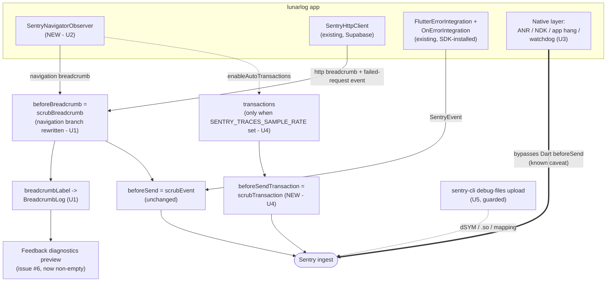
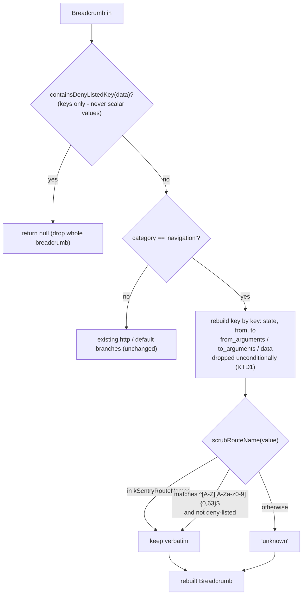

# Crash Reporting, Error Monitoring, and Privacy-Preserving App Health Telemetry - Plan

**Target repo:** `lunarlog` (`wjdavis5/lunarlog`). All paths are repo-relative.

---

## Goal Capsule

- **Objective:** Close issue #7 by completing the crash-reporting surface that PR #16 started — route breadcrumbs that survive the scrubber, explicitly pinned native crash capture (Android ANR/NDK, iOS app hangs and watchdog terminations), an opt-in performance-tracing path with its own scrubber, and guarded debug-symbol upload in both release workflows.
- **Means:** Extend `lib/observability/` (three existing files, no new architecture), name every `MaterialPageRoute` so `SentryNavigatorObserver` has something safe to report, add one Gradle dependency for real NDK capture, add one new dart-define that keeps tracing off by default, and add conditional `sentry-cli` steps to `.github/workflows/ios-release.yml` and `.github/workflows/play-store-release.yml` that no-op without secrets.
- **Authority hierarchy:** GitHub issue #7 owns product intent; this document's Product Contract owns behavioral specification; the Planning Contract owns technical mechanism; `docs/plans/2026-09-02-001-feat-supabase-auth-cloud-sync-plan.md` KTD12 is the upstream privacy floor this plan may extend but never weaken.
- **Stop conditions:** Stop and surface if any change lets a health key (`note`, `tags`, `local_date`, `display_name`), a profile id, an entry date, or an account identifier reach a Sentry payload; if an unconfigured build (empty dart-defines) gains any network path or any non-no-op Sentry behavior; or if a release workflow starts failing when the Sentry secrets are absent.
- **Execution profile:** `code`; deep plan spanning the observability layer, the UI route surface, Android Gradle, two release workflows, and ops documentation.
- **Tail ownership:** Creating the Sentry project, provisioning the DSN and auth token, turning on server-side scrubbing and IP suppression, configuring alert rules, and running the symbolicated-crash smoke test all belong to **issue #19** (`needs-human-review`, not done). See "Hard dependency on issue #19" below.

---

## Hard dependency on issue #19 — and how this plan scopes around it

Issue #19 (`ops: Sentry project, DSN secret, and privacy smoke test`) is a **hard dependency for observing any result of this work**, and a **hard dependency for the symbol-upload steps to actually run**. There is no Sentry project, no `SENTRY_DSN` secret, and no `SENTRY_AUTH_TOKEN` today; `AGENTS.md` already records Sentry debug-symbol upload as deferred for exactly this reason.

It is **not** a blocker for the code, because every unit here is built to land inert:

| Issue #19 artifact | What needs it | Behavior in this plan while it is missing |
|---|---|---|
| Sentry project + `SENTRY_DSN` | Anything reporting at all | `AppConfig.hasSentry` is false; `runWithSentry` calls the app runner directly and every `Sentry.*` call is a no-op hub. Unchanged from today. |
| `SENTRY_AUTH_TOKEN`, `SENTRY_ORG`, `SENTRY_PROJECT` | dSYM / native-symbol / mapping upload (U5) | The upload steps detect the empty secret, print a `::warning::` naming issue #19, and exit 0. The release never fails for a missing telemetry secret. |
| Dashboard alert rules, crash-free-session targets | R11, R12 | Documented as an ops checklist in U6; not code. |
| Symbolicated test-crash verification | Issue #7's last deliverable | Documented as a device-checklist item in U6, owned by #19's smoke test. |

**What is and is not unchanged.** An **unconfigured** build (no `SENTRY_DSN` — which is every build today, and every CI and fork build) is untouched: nothing initializes, no observer is installed, no network path opens. **Performance tracing** stays off in every build: U4's `SENTRY_TRACES_SAMPLE_RATE` is empty in `dart_defines.example.json` and is added to no workflow, so no transaction is ever produced until an operator deliberately sets it.

A **configured** build's payload does change, and the plan is not claiming otherwise. The deltas, all deliberate: navigation breadcrumbs go from an empty `data` map to `{state, from, to}` (U1); `event.transaction` becomes the current screen name (U2/KTD4); and the SDK's reported integration list gains `UINavigationTracing` from the observer's constructor (U2). Native capture also starts producing Android NDK events for the first time, because U3 compiles in the support the option always claimed. Because issue #19's smoke-test checklist in `docs/ops/supabase-go-live.md` was written against the PR #16 payload, **U6 must re-baseline it to this shape** — otherwise the first person to run it reads the new fields as a regression.

---

## Product Contract

### Summary

`lunarlog` already reports crashes to Sentry behind an allowlist scrubber (`lib/observability/scrub.dart`), with sessions on for release health and Supabase HTTP routed through `SentryHttpClient`. What is missing against issue #7 is the diagnostic context that makes a crash report actionable — which screen the user was on, whether the app hung or was killed natively, and readable frames for native crashes — plus the release-health and performance dimensions the issue asks for. This plan adds those without moving the privacy floor: route names are admitted through a strict shape check rather than passed through, route *arguments* stay banned, and performance tracing arrives switched off with its own transaction scrubber already written.

### Problem Frame

Today a Sentry event from this app carries an exception, a stack, `contexts.os`, `contexts.runtime`, and `contexts.app.version`. It does not carry the screen the user was on, because `scrubBreadcrumb` nulls the `data` map of every `navigation` breadcrumb — a correct call when it was written (route names and arguments could carry an entry date or profile id) but one that now costs the single most useful triage dimension. It also does not carry route names in any other form, because no `SentryNavigatorObserver` is installed and every `MaterialPageRoute` in the app is anonymous, so there would be nothing to report even if one were.

Underneath that, three native surfaces are unverified rather than configured: Android ANR (`anrEnabled`) and iOS app hangs (`enableAppHangTracking`) run at SDK defaults that this repo has deliberately pinned for every other option, and Android NDK crash capture does not actually work — `enableNativeCrashHandling` is a switch on a capability the app never compiled in, because `android/app/build.gradle.kts` does not consume `io.sentry:sentry-native-ndk` and does not enable Prefab.

Finally, nothing symbolicates. iOS `.dSYM` bundles are produced by the archive step and thrown away; Android native `.so` debug symbols are never uploaded. When a native crash does arrive it is a wall of addresses.

The constraint that shapes every decision here is the same one that shaped KTD12: this app holds encrypted health data for minors, and the reporting channel must not become the leak. Every dimension issue #7 asks for is admitted only in a form that is provably technical — a screen name matching a fixed shape, an HTTP status, an OS version — never a payload that merely *looks* technical today.

### Key Decisions

- **Route names are allowlisted by shape and by registry, never passed through.** `scrubBreadcrumb` keeps `navigation` breadcrumb `state`, `from`, and `to` only when each value is a bare screen identifier from a known set; `from_arguments`, `to_arguments`, and any `data` sub-map are dropped unconditionally, in every case. A route whose name fails the check is reported as `unknown`, not dropped, so the navigation shape survives without the name. This inverts today's behavior (drop everything) into the allowlist posture the rest of `scrub.dart` already uses. (Governs R1, R2, R3)
- **Every route gets an explicit, static name; no name is ever derived from data.** Route names are compile-time constants in one file, applied via `RouteSettings(name: ...)` at each push site. A screen that renders a specific profile (`ProfileDetailScreen`, `ManageGuardiansScreen`) is named for the *screen*, never for the profile. This is what makes the shape check in the previous decision safe rather than optimistic. (Governs R1, R4)
- **NDK capture is compiled in, not just toggled on.** `enableNativeCrashHandling` is already true by default, but Android NDK crashes are only captured when the app consumes `io.sentry:sentry-native-ndk` with Prefab enabled. Without the Gradle change, "native Android crash capture" would be a claim the build does not support. (Governs R7)
- **Performance tracing ships off, behind its own define, with its scrubber already written.** `sentry_flutter` 9.28.0 has no app-start-only mode — `NativeAppStartIntegration` returns early unless `isTracingEnabled()`, so cold-start measurement requires a non-null `tracesSampleRate`, which also produces route transactions carrying names and request URLs. Rather than choose between issue #7's requirement 3 and KTD12's `tracesSampleRate = null`, the code path and its `beforeSendTransaction` scrubber land complete and tested, gated on a new `SENTRY_TRACES_SAMPLE_RATE` define that is empty in `dart_defines.example.json` and in every workflow. An operator opts in after issue #19 exists. (Governs R9, R10, R14)
- **Symbol upload is guarded, warn-and-skip, and never a release blocker.** Both release workflows gain a `sentry-cli` step that checks for `SENTRY_AUTH_TOKEN`, `SENTRY_ORG`, and `SENTRY_PROJECT` and exits 0 with a `::warning::` naming issue #19 when any is empty — the same posture `check-release-gate.sh` uses for warn-mode and the same posture the whole dart-define surface uses on forks. A telemetry secret must never be able to stop a TestFlight or Play upload. (Governs R15, R16, R17)
- **Android R8/ProGuard is not enabled by this issue.** `android/app/build.gradle.kts` has no `isMinifyEnabled`, so no `mapping.txt` is produced today and there is nothing to upload. Enabling R8 is a build-behavior change with plugin-reflection risk (`flutter_secure_storage`, `local_auth`, `google_sign_in`, `sqlite3`) that deserves its own change and its own device pass. The mapping-upload step is written to upload `mapping.txt` **if it exists** so enabling R8 later needs no workflow edit, and the gap is recorded in Scope Boundaries. (Governs R16)
- **Alerting and crash-free targets are dashboard configuration, documented as ops.** Sentry alert rules, the >99.9% crash-free-session target, and the crash-free-users view are not code. They become checklist items in `docs/ops/supabase-go-live.md` under issue #19's ownership. (Governs R11, R12, R18)

### Actors

- A1. **Operator (end user):** an adult using the app. Never sees any of this; their only visible surface is the existing Settings feedback form, whose diagnostics preview (issue #6) improves as a side effect of U1/U2.
- A2. **Maintainer:** triages crashes in the Sentry dashboard, owns issue #19's project setup and alert rules.
- A3. **Sentry:** the crash-reporting backend and the symbol store.
- A4. **Release workflows:** `ios-release.yml` and `play-store-release.yml`, which produce the artifacts the symbols describe.

### Requirements

#### Breadcrumbs and route context

- R1. A crash report carries the sequence of screens the user visited before the crash, each as a bare screen identifier.
- R2. A navigation breadcrumb never carries route arguments, a profile id, an entry date, or any deny-listed key.
- R3. A route name that does not match the allowlisted shape is reported as `unknown` rather than passed through or dropped.
- R4. Every navigable destination in the app has a stable, static route name that does not vary with the data it displays. **Modal routes count as destinations:** `showDialog` and `showModalBottomSheet` push real routes that the observer reports, so a dialog left unnamed makes a crash inside it look like a crash on the screen behind it.
- R5. The issue #6 feedback diagnostics preview shows navigation breadcrumbs as a readable screen name, not an empty entry.
- R6. App lifecycle transitions (`resumed`, `inactive`, `paused`) and network failure status codes continue to appear as breadcrumbs.

#### Native crash capture

- R7. Android NDK crashes are captured, not merely enabled in options against a build that cannot produce them.
- R8. Android ANRs, iOS app hangs, and iOS watchdog terminations are captured, with every governing option set explicitly rather than inherited from an SDK default.

#### Release health and performance

- R9. Cold-start duration and in-app operation latency can be measured without changing the privacy floor of a build that has not opted in.
- R10. When tracing is opted into, a transaction payload is scrubbed by the same allowlist posture as an event: no user, no extras, no request query string, no route arguments.
- R11. Release health (crash-free sessions, crash-free users) is available per release.
- R12. A regression or error spike after a release raises an alert.

#### Build gating and inertness

- R13. A build with no `SENTRY_DSN` initializes nothing, installs no navigator observer, and reaches no network.
- R14. A build with a DSN but no `SENTRY_TRACES_SAMPLE_RATE` behaves exactly as today: no transactions, no app-start measurement.
- R15. A release workflow run with no Sentry upload secrets succeeds, warns, and skips the upload.

#### Symbolication

- R16. iOS `.dSYM` bundles from the release archive are uploaded when the upload secrets are present; an Android `mapping.txt` is uploaded when one exists.
- R17. Android native `.so` debug symbols from the release bundle are uploaded when the upload secrets are present.
- R18. The operator has a written runbook for what to configure in the Sentry dashboard and how to verify a symbolicated crash.

### Acceptance Examples

- AE1. Given a navigation breadcrumb with `data` `{state: didPush, from: ProfilePickerScreen, to: SettingsScreen}`, when it passes `scrubBreadcrumb`, then all three values survive unchanged. Covers R1.
- AE2. Given a real `RouteObserverBreadcrumb` built from `RouteSettings(name: 'ProfileDetailScreen', arguments: <a non-map value whose `toString()` prints a profile id and a date>)` — the branch `_formatArgs` reduces to a single scalar string, which no deny-list check can inspect — when it passes `scrubBreadcrumb`, then the surviving `data` map's key set is exactly `{state, from, to}`, and no substring of the argument's `toString()` appears anywhere in the result. Covers R2.
- AE2b. Given the same breadcrumb built with a **map** argument carrying a `local_date` key, when it passes `scrubBreadcrumb`, then the breadcrumb is dropped entirely by the `containsDenyListedKey` early return. Covers R2 on the branch the deny-list does reach.
- AE3. Given a navigation breadcrumb with `to: /profiles/8f2c-…`, when it passes `scrubBreadcrumb`, then `to` is `unknown`. Covers R3.
- AE4. Given a build with an empty `SENTRY_DSN`, when the app starts, then `MaterialApp.navigatorObservers` is empty and no `SentryNavigatorObserver` is constructed. Covers R13.
- AE5. Given a build with a DSN and an empty `SENTRY_TRACES_SAMPLE_RATE`, when options are configured, then `tracesSampleRate` is null and `isTracingEnabled()` is false. Covers R14.
- AE6. Given a build with `SENTRY_TRACES_SAMPLE_RATE=0.2` and a transaction produced by a real tracer that had `setData('route_settings_arguments', …)` called on it, when it passes `beforeSendTransaction`, then it carries no `user`, no `extra`, **no `contexts.trace.data`**, no context other than os/runtime/app.version, no request query string, and no span data key outside the allowlist — while trace id, span id, op, and the span list survive. Covers R10.
- AE7. Given `configureSentryOptions` runs, when the resulting options are inspected, then `anrEnabled`, `enableAppHangTracking`, `enableWatchdogTerminationTracking`, `enableNativeCrashHandling`, `enableNdkScopeSync`, `enableAutoNativeBreadcrumbs`, and `enableTombstone` all hold explicitly-set values rather than whatever the SDK defaulted to. Covers R8.
- AE8. Given `.github/workflows/ios-release.yml` runs with an empty `SENTRY_AUTH_TOKEN`, when the dSYM step executes, then it prints a warning naming issue #19 and the job continues to the TestFlight upload. Covers R15.
- AE9. Given the app is built for Android release, when `android/app/build.gradle.kts` is inspected, then it declares `io.sentry:sentry-native-ndk` and enables Prefab. Covers R7.
- AE10. Given a user opens Settings then Send feedback, when the diagnostics preview renders, then it lists `navigation: SettingsScreen` and `navigation: FeedbackScreen`, not blank entries. Covers R5.

---

## Planning Contract

### Key Technical Decisions

- **KTD1. `scrubBreadcrumb` gains a navigation branch that rebuilds `data` from an allowlist of three keys — and that rebuild is the whole protection.** The current branch (`if (category == 'navigation') scrubbedData = null`) is replaced by a rebuild that keeps `state`, `from`, and `to`, passing each of `from`/`to` through a `scrubRouteName` helper, and admits nothing else. Critically, the existing `containsDenyListedKey(data)` early return protects route arguments **only for the map case**. `RouteObserverBreadcrumb._formatArgs` (verified in 9.28.0) branches: a `Map<String, dynamic>` argument keeps its keys and stringifies its values, so `containsDenyListedKey` *does* fire on a `local_date` key; **any non-map argument — a bare id, a value object, a record — is `toString()`ed into a single scalar string**, and `containsDenyListedKey` checks key names, never scalar values ("Scalars never match", per its own doc comment). That second branch is the hole: `RouteSettings(arguments: profile)` becomes one benign-keyed string containing whatever the object's `toString()` prints, and no deny-list check can see it. Dropping `from_arguments`, `to_arguments`, and the `additionalInfoProvider` `data` sub-key unconditionally — never conditionally, never after a value inspection — is load-bearing, not belt-and-braces, and the implementer must not "optimize" it into a deny-list scan. Governs R1, R2, R3.
- **KTD2. `scrubRouteName` is a two-stage check: registry membership, then shape.** A name is kept verbatim when it is in `kSentryRouteNames` (the constants from `lib/observability/route_names.dart`, exported as a `Set<String>`); otherwise it is kept only if it matches `^[A-Z][A-Za-z0-9]{0,63}$` **and** is not a deny-listed key; otherwise it becomes `unknown`. The registry is the real gate; the shape check is the fallback that lets a third-party route (a plugin's dialog route) through as a name without letting a path or an id through. Governs R3.
- **KTD3. Route names live in `lib/observability/route_names.dart` as bare screen identifiers, matching the class name of the screen.** `SettingsScreen`, `FeedbackScreen`, `SupportHistoryScreen`, `SignInScreen`, `UploadConsentScreen`, `ProfileDetailScreen`, `ManageGuardiansScreen`, `ProfileHomeGate`. Bare identifiers rather than `/settings` paths, because a path invites a parameterized segment and this app has no router — the shape check in KTD2 can then reject anything containing `/`. **The file belongs to `lib/observability/`, not `lib/ui/`, and the dependency runs UI → observability.** Today every file in `lib/observability/` imports only `lib/config.dart`, its own siblings, and packages — it depends on no other app layer. Putting the registry under `lib/ui/` would make the scrubber import the UI layer and destroy that property; `test/architecture/layering_test.dart` would not catch it (it guards only `lib/data` → `lib/ui` and `lib/domain` → Flutter), which is exactly why the plan has to state the rule. Governs R4.
- **KTD4. The navigator observer is constructed only when `AppConfig.hasSentry`, and is handed to `MaterialApp` through a helper next to `wrapWithSentry`.** `sentryNavigatorObservers()` in `lib/observability/sentry_bootstrap.dart` returns `const <NavigatorObserver>[]` when unconfigured and a single `SentryNavigatorObserver` otherwise — same shape and same file as the existing `wrapWithSentry`, so `lib/app.dart` gains one call and no `sentry_flutter` import. The observer is constructed with `enableAutoTransactions: true` (inert while `tracesSampleRate` is null; live once U4 is opted into) and `setRouteNameAsTransaction: true`, so the current screen rides on every error event as `event.transaction` — exactly the "screen route name" issue #7 admits. **`scrubEvent` must therefore start scrubbing that field**: the observer writes `scope.transaction = name` with the raw `RouteSettings.name`, and `scrubEvent` currently copies `transaction: event.transaction` verbatim, so a dynamically-named or third-party route would bypass both the registry and the shape check that guard `from`/`to`. Applying `scrubRouteName` to `event.transaction` in `scrubEvent` (U1) is what makes `setRouteNameAsTransaction` safe; without it the plan's central claim — no route string reaches the wire unscrubbed — is false at the one field present on every event. Governs R1, R3, R13.
- **KTD5. The breadcrumb tee derives a label instead of relying on `Breadcrumb.message`.** `SentryNavigatorObserver` produces data-only breadcrumbs with a null `message`, so today's `log.record(category, message ?? '')` would record `navigation: `. A pure `breadcrumbLabel(Breadcrumb)` in `lib/observability/breadcrumbs.dart` returns the message when present, else the scrubbed `to` route for a `navigation` breadcrumb, else the empty string — `breadcrumbs.dart` does not import `sentry_flutter` today (it imports only `scrub.dart`, which imports but does not re-export the SDK), so this helper adds that one import deliberately — it is the only SDK type the file needs. Governs R5.
- **KTD6. Every native-capture option is set explicitly in `configureSentryOptions`, following the file's existing "set explicitly so a default change upstream cannot turn it on" convention.** `anrEnabled = true`, `anrTimeoutInterval` left at the SDK's 5 s, `enableTombstone = false`, `enableNativeCrashHandling = true`, `enableNdkScopeSync = true`, `enableAppHangTracking = true`, `enableWatchdogTerminationTracking = true`, `enableAutoNativeBreadcrumbs = true` with the five Flutter-side breadcrumb toggles left at their mobile defaults (all false) so nothing double-records, and `maxBreadcrumbs` left at the SDK's 100. **On `enableTombstone` specifically:** it is the only option here that is off by SDK default, and an earlier draft turned it on. Doing so would open an Android `ApplicationExitInfo` channel whose payload is assembled natively and never reaches the Dart scrubber — and a tombstone carries thread and register state from a process that holds decrypted health strings in memory. "No payload risk identified" was an absence of investigation, not a finding of safety. Pinning it `false` still guards against an upstream default flip while leaving the opt-in to issue #19, after someone has looked at a real tombstone. Governs R6, R8. (An earlier draft also cut the breadcrumb ring to 50; that traced to no requirement and worked directly against R1 — U1/U2 *add* a breadcrumb producer, so a smaller ring buys less pre-crash history exactly where triage value was the goal. The feedback ring's 25 is a separate buffer and does not constrain what Sentry keeps.)
- **KTD7. NDK capture needs a Gradle change, not just an option.** `android/app/build.gradle.kts` gains `implementation("io.sentry:sentry-native-ndk")` (versionless — the version is inherited from `io.sentry:sentry-android`, which `sentry_flutter`'s own Android module already brings in as `api`) plus `buildFeatures { prefab = true }`. This is the pattern the package's own example app uses. Governs R7.
- **KTD8. `SENTRY_TRACES_SAMPLE_RATE` is a string define parsed to a nullable double, empty meaning off.** `AppConfig.sentryTracesSampleRate` mirrors the existing `_webSyncRaw` idiom: the raw string is the `const`, and a testable `computeTracesSampleRate(String)` in `lib/config.dart` returns null for empty, null for unparseable, and clamps to `[0, 1]`. `test/config_test.dart` already asserts const/function agreement for `hasSupabase`/`hasSentry` and extends to this. Governs R9, R14.
- **KTD9. `scrubTransaction` is a sibling of `scrubEvent`, not a special case of it — and it must scrub `contexts`, because the tracer's data map is written there a second time.** A `SentryTransaction` is a `SentryEvent` subtype but rebuilding it through `SentryEvent(...)` would erase its spans and change its type. **There is no reconstruction path: the only `SentryTransaction` constructor requires the `@internal` `SentryTracer` (reachable only through an `implementation_imports` violation) and `copyWith` is `@Deprecated('Assign values directly to the instance.')`. `scrubTransaction` therefore mutates the incoming transaction in place and returns it (or null to drop) — the SDK's own guidance, and the one deliberate exception to `scrub.dart`'s "pure functions, never mutates" library contract, which must be updated to say so.** Keep the allowlist posture even while mutating: replace each span's data with `data..clear()..addAll(allowlisted)`, never by removing known-bad keys. `scrubTransaction` therefore keeps the transaction's identity and spans and scrubs *within* them. **The non-obvious part, verified in `sentry` 9.28.0's `SentryTransaction` constructor: it sets `extra: extra ?? tracer.data` and then `contexts.trace = spanContext.toTraceContext(..., data: data)` with the same map — so the tracer's data appears in both places, and dropping `extra` alone removes only one copy.** That matters directly here: `SentryNavigatorObserver` calls `transaction.setData('route_settings_arguments', arguments)` with the raw arguments, so the exact payload U1 works to keep out of breadcrumbs would ride out in `contexts.trace.data`. `scrubTransaction` therefore: drops `user` and `extra`; applies the same `_scrubContexts` allowlist `scrubEvent` uses (`contexts.os`, `contexts.runtime`, `contexts.app.version`) and rebuilds `contexts.trace` keeping trace id, span id, op, status, and sampled while dropping its `data` map entirely; applies `_scrubRequest` to the request; applies `scrubRouteName` to the transaction name; applies `_scrubTags` to the tags and maps `scrubBreadcrumb` over the breadcrumbs (`Scope.applyToEvent` merges scope tags and breadcrumbs onto a transaction exactly as onto an event); and rebuilds each span's `data` to an allowlist. **Use the key names the SDK actually emits**, which are not the ones a reader would guess: `url` (passed through `stripQueryString`), `http.request.method`, `http.response.status_code`, `http.response_content_length`, `db.system`, `db.operation` — and `http.query`/`http.fragment` are dropped. An allowlist written as `http.method`/`http.status_code` would match nothing, strip every HTTP span to an empty map, and defeat R9's latency goal while the tests still passed against hand-built spans. The whole transaction is dropped if `containsDenyListedKey` fires on any span's data. Governs R10.
- **KTD10. `sentry-cli` is installed as a pinned, checksum-verified GitHub release binary — never `curl | bash`.** The obvious install path (`curl -sL https://sentry.io/get-cli/ | sh`) is wrong twice over here. First, it executes an unpinned remote script; and in `ios-release.yml` the upload step sits *after* the App Store Connect private key, the distribution `.p12`, and the provisioning profile are installed and *before* the cleanup step, so that script would run with the full signing credential set in reach. Second, the version pin does not even work the way it looks: Sentry's installer reads `SENTRY_CLI_VERSION` from the environment and ignores a positional `bash -s -- <version>` argument, so the "pinned" form would silently install whatever release is current. Download a pinned `sentry-cli` release binary from its GitHub releases URL, verify it with `sha256sum -c` against a checksum committed in the workflow, then `sentry-cli --version` — exactly the cache / pinned-download / verify shape `ci.yml` already uses for `actionlint`. The upload commands are `sentry-cli debug-files upload` (deliberately **without** `--include-sources`, which would upload this app's source files to a third party for no symbolication benefit) against the archive's `dSYMs` directory on iOS, and the extracted native libs plus `mapping.txt` on Android. Governs R16, R17.
- **KTD11. Workflow shape is enforced by a Dart test, not only by actionlint.** `test/release/sentry_symbols_test.dart` follows the exact precedent of `test/release/export_compliance_test.dart`: read the two workflow files as text, assert each contains a guarded upload step, assert the guard checks all three secrets, assert no secret value is ever echoed, and assert the step does not use `set -e` in a way that would abort the job on a missing token. This runs under `flutter test` and therefore under the CI `check` job and the coverage gate. Governs R15.

### High-Level Technical Design

The telemetry pipeline after this plan, with the new pieces marked:

The scrub decision for a navigation breadcrumb, which is the single highest-risk change here:

The option floor after U3 and U4, as a single table an implementer can check against:

| Option | Today | After this plan | Why |
|---|---|---|---|
| `sendDefaultPii` | `false` | `false` | unchanged (KTD12) |
| `attachScreenshot` / `attachViewHierarchy` | `false` | `false` | unchanged |
| `enableUserInteractionBreadcrumbs` / `Tracing` | `false` | `false` | unchanged — tap targets can carry a profile name |
| `sampleRate` | `1.0` | `1.0` | unchanged |
| `enableAutoSessionTracking` | `true` | `true` | release health (R11) |
| `maxRequestBodySize` | `never` | `never` | unchanged |
| `replay.*` | `null` | `null` | unchanged |
| `profilesSampleRate` | `null` | `null` | unchanged — profiling would carry route + URL data |
| `tracesSampleRate` | `null` | `AppConfig.sentryTracesSampleRate` (null unless defined) | R9/R14 |
| `beforeSendTransaction` | unset | `scrubTransaction` | R10 |
| `anrEnabled` | SDK default (`true`) | explicit `true` | R8 |
| `enableTombstone` | SDK default (`false`) | explicit `false` (pinned, not enabled) | see KTD6 — opt-in deferred to issue #19 |
| `enableNativeCrashHandling` | SDK default (`true`) | explicit `true` | R7 |
| `enableNdkScopeSync` | SDK default (`true`) | explicit `true` | R7 |
| `enableAppHangTracking` | SDK default (`true`) | explicit `true` | R8 |
| `enableWatchdogTerminationTracking` | SDK default (`true`) | explicit `true` | R8 |
| `enableAutoNativeBreadcrumbs` | SDK default (`true` on mobile) | explicit `true` | R6 |
| `maxBreadcrumbs` | SDK default (`100`) | explicit `100` | pinned, not reduced — see KTD6 |

---

## Implementation Units

### U1. Admit route names through the scrubber and label them for the feedback ring

**Goal:** `scrubBreadcrumb` keeps a navigation breadcrumb's `state`/`from`/`to` under an allowlist, and the breadcrumb tee produces a readable label instead of an empty string.

**Requirements:** R1, R2, R3, R5. Covers AE1, AE2, AE3.

**Dependencies:** none.

**Files:**
- `lib/observability/scrub.dart` — replace the `category == 'navigation'` branch; add `scrubRouteName` and `kSentryRouteNamePattern`; apply `scrubRouteName` to `event.transaction` inside `scrubEvent` (KTD4).
- `lib/observability/breadcrumbs.dart` — add `breadcrumbLabel(Breadcrumb)`.
- `lib/observability/sentry_bootstrap.dart` — the `beforeBreadcrumb` tee calls `breadcrumbLabel(scrubbed)` instead of `scrubbed.message ?? ''`.
- `lib/observability/route_names.dart` — **new**, created here (U2 consumes it) so `scrub.dart` has a registry to check against. Under `observability/`, not `ui/`, per KTD3.
- `test/observability/scrub_test.dart`
- `test/observability/breadcrumbs_test.dart`

**Approach:**
1. Add `lib/observability/route_names.dart` with the eight `const String` names from KTD3 plus `const Set<String> kSentryRouteNames` holding all of them. It imports nothing from `lib/ui/` — the UI imports it, never the reverse.
2. In `scrub.dart`, add `String scrubRouteName(String? name)` implementing KTD2 — registry hit wins, then the shape regexp plus a `mentionsDenyListedKey` guard, else `'unknown'`. Null becomes `'unknown'`.
3. **Extract the navigation rebuild into its own top-level helpers before writing it** — `scrubNavigationData(Map<String, dynamic>? data)` and `scrubNavigationState(Object? state)` — so `scrubBreadcrumb`'s navigation branch stays a single call. This is not style: `scrubBreadcrumb` already scores McCabe 9 against `tool/quality/crap_gate.dart`'s threshold of 10, and CRAP equals complexity at 100% coverage, so adding the state coercion inline fails the gate on complexity alone no matter how well it is tested. Then build `{'state': …, if from != null 'from': scrubRouteName(from), if to != null 'to': scrubRouteName(to)}`, coercing `state` to `'unknown'` unless it is exactly one of `didPush`/`didPop`/`didReplace`. Nothing else from `data` survives — build the new map key by key, never by copying `data` and removing known-bad keys. Leave the `containsDenyListedKey` early return exactly where it is (it still guards a future breadcrumb shape), but see KTD1: it is not what protects route arguments.
4. In `breadcrumbs.dart`, add `breadcrumbLabel`: message when non-empty; else for `category == 'navigation'` the `to` value from data (already scrubbed by the time the tee sees it); else `''`. Keep `BreadcrumbLog.record`'s existing `mentionsDenyListedKey` guard — this helper feeds it, it does not bypass it.
5. Point the tee in `configureSentryOptions` at the new helper.
6. In `scrubEvent`, change `transaction: event.transaction` to `transaction: event.transaction == null ? null : scrubRouteName(event.transaction)`. This is the field `setRouteNameAsTransaction` (KTD4) feeds, and it is on every event, not just navigation breadcrumbs.

**Patterns to follow:** the allowlist-rebuild posture already used by `scrubEvent` and the `http` branch of `scrubBreadcrumb`; `_normalizeKey`/`isDenyListedKey` for the deny-list check; the existing library doc-comment style that explains *why* each rule exists.

**Execution note:** write the scrub tests first — this is the one unit where a mistake is a health-data leak rather than a bug, and the existing `scrub_test.dart` is already structured as a table of adversarial inputs.

**Test scenarios:**
- A `navigation` breadcrumb with `state: didPush`, `from: ProfilePickerScreen`, `to: SettingsScreen` keeps all three values verbatim (AE1).
- A `navigation` breadcrumb whose `to_arguments` is the **string** `"{profile: 8f2c-4a1b, local_date: 2026-09-06}"` yields a `data` map whose key set is exactly `{state, from, to}`, and no value in the result contains `local_date` or the uuid — asserted by key-set equality plus a substring sweep over the serialized result, so a partial-copy implementation fails (AE2). This is the single most important test in the plan: it is the case the deny-list check provably does *not* catch.
- The same assertion for `from_arguments`, and for an `additionalInfoProvider`-style `data` sub-key carrying a nested map with `note`.
- A `navigation` breadcrumb with `to: /profiles/8f2c-4a1b` yields `to == 'unknown'` (AE3).
- A `navigation` breadcrumb with `to: SomeThirdPartyRoute` (not in the registry, matches the shape) is kept verbatim.
- A `navigation` breadcrumb with `to: display_name` is `'unknown'` — shape matches nothing here, but assert the deny-list guard independently with `to: DisplayName` (shape-legal — the regex requires an uppercase first character — and still normalizes to the deny-listed `display_name`).
- A `navigation` breadcrumb with a null `to` yields no `to` key (not `'unknown'` under a present key).
- A `navigation` breadcrumb with `state: somethingElse` yields `state == 'unknown'`.
- An `http` breadcrumb is unaffected: URL still truncated at `?`, `http.query`/`http.fragment` still dropped.
- A `console` breadcrumb is unaffected.
- `breadcrumbLabel` returns the message for a message-bearing breadcrumb, the `to` route for a data-only navigation breadcrumb, and `''` for a data-only breadcrumb of any other category.
- `scrubEvent` on an event whose `contexts.app` carries `viewNames` emits `contexts.app` reduced to `version` only. `SentryNavigatorObserver` populates `contexts.app.view_names` through `FlutterEnricherEventProcessor`, which runs *before* `beforeSend`; `_scrubContexts` already drops it, but nothing pins that today, so a later change there would leak the route trail silently.
- `scrubEvent` on an event whose `transaction` is `/profiles/8f2c` yields `unknown`; on one named `SettingsScreen` it is kept; on a null transaction it stays null. This is the `setRouteNameAsTransaction` field (KTD4) and it appears on every event, so it needs its own coverage independent of the breadcrumb cases.
- End-to-end through `configureSentryOptions`: a navigation breadcrumb pushed through `options.beforeBreadcrumb` lands in a test `BreadcrumbLog` as `navigation: SettingsScreen` (AE10's unit-level half).

**Verification:** `flutter analyze`, `flutter test test/observability/`, `dart run tool/quality_gate.dart`, and `dart run tool/mutation_gate.dart`. The CRAP gate is the real check here — `scrubBreadcrumb` starts at McCabe 9 of an allowed 10, which is why step 3 extracts helpers rather than growing the branch in place. The mutation gate matters because these are the security-relevant pure functions.

---

### U2. Name every route and install the navigator observer

**Goal:** every `MaterialPageRoute` in the app carries a static `RouteSettings.name`, and a configured build installs `SentryNavigatorObserver`.

**Requirements:** R1, R3, R4, R5, R13. Covers AE4, AE10.

**Dependencies:** U1 (needs `lib/observability/route_names.dart` and the scrub branch).

**Files:**
- `lib/observability/sentry_bootstrap.dart` — add `List<NavigatorObserver> sentryNavigatorObservers()`.
- `lib/app.dart` — hold the observer list in a `late final` field on `_LunarLogAppState` and pass that field to `MaterialApp` (see Approach 1b); and replace `home: const ProfileHomeGate()` with `onGenerateRoute: (settings) => MaterialPageRoute<void>(settings: const RouteSettings(name: kRouteProfileHomeGate), builder: (_) => const ProfileHomeGate())`.
- `lib/ui/account/account_section.dart` (~line 333) — `SignInScreen`.
- `lib/ui/account/sync_status_tile.dart` (~line 289) — `UploadConsentScreen`.
- `lib/ui/profiles/profile_picker_screen.dart` (~lines 40, 88, 127) — `SettingsScreen`, `ProfileDetailScreen`, `ManageGuardiansScreen`.
- `lib/ui/settings/settings_screen.dart` (~lines 72, 228) — `FeedbackScreen`, `SupportHistoryScreen`.
- `test/observability/sentry_bootstrap_test.dart` — **new** (today `runWithSentry`/`configureSentryOptions` are tested inside `scrub_test.dart`; the bootstrap surface has grown enough to own a file — move those two existing groups here rather than duplicating them).
- `test/ui/settings_test.dart`, `test/ui/profiles_test.dart` — extend with route-name assertions.
- `test/ui/feedback_screen_test.dart` — AE10's rendering half. Today its fake collector is wired with an always-empty `BreadcrumbLog()`, so nothing in the suite can catch a regression in the diagnostics preview's rendered text.

**Approach:**
1. `sentryNavigatorObservers()` returns `const <NavigatorObserver>[]` unless `AppConfig.hasSentry`, else a single `SentryNavigatorObserver(enableAutoTransactions: true, setRouteNameAsTransaction: true)`. No `routeNameExtractor` is needed — the scrubber is the enforcement point regardless (KTD1/KTD4).
1b. **Call it once, not per build.** `_LunarLogAppState.build` re-runs on every `setState` (the invite-link and auth-change paths both trigger one), and `Navigator.didUpdateWidget` compares observers by identity — so `navigatorObservers: sentryNavigatorObservers()` inline would detach and re-attach a fresh observer on each rebuild, discarding any in-flight route transaction (which then auto-finishes after 3 s with incomplete spans once U4 is opted in). Hold it in a `late final List<NavigatorObserver> _navigatorObservers = sentryNavigatorObservers();` field, matching how the state class already caches `_navigatorKey`.
2. Add `settings: const RouteSettings(name: kRoute…)` to each of the seven `MaterialPageRoute` push sites. No other change at those call sites.
2b. Name the **modal** routes too, via `showDialog`/`showModalBottomSheet`'s `routeSettings:` parameter. There are 18 such call sites across 11 files (`lib/ui/account/account_section.dart` ×4, `lib/ui/web/dev_banner.dart` ×2, `lib/ui/sharing/manage_guardians_screen.dart` ×2, `lib/ui/settings/settings_screen.dart` ×2, `lib/ui/profiles/profile_dialogs.dart` ×2, and one each in `lib/ui/logging/month_calendar.dart`, `lib/ui/logging/day_sheet.dart`, `lib/ui/feedback/attachment_field.dart`, `lib/ui/account/delete_account_dialog.dart`, `lib/ui/account/account_mismatch_screen.dart`, `lib/app.dart`). Name the ones that are genuine destinations — the day sheet, delete-account confirmation, profile edit/confirm, attachment consent, account mismatch — and add each name to `kSentryRouteNames`. A trivial confirm-only dialog may be left unnamed; record which ones were skipped and why in the file's doc comment, so the next reader can tell "deliberately unnamed" from "forgotten".
3. Name the initial route via `onGenerateRoute`, per the Files list. The two approaches an earlier draft offered are both dead ends, and the implementer should not rediscover that: `WidgetsApp`'s constructor asserts `home == null || onGenerateInitialRoutes == null`, so `initialRoute`/`onGenerateInitialRoutes` cannot coexist with `home:`; and there is no way to attach custom `RouteSettings` to `home:` at all, because `WidgetsApp._onGenerateRoute` always builds it with `Navigator.defaultRouteName` (`/`), which KTD2's shape check rejects. `onGenerateRoute` is the one mechanism that produces the registered `ProfileHomeGate` name.
4. Move the two existing `runWithSentry` / `configureSentryOptions` groups out of `scrub_test.dart` into the new bootstrap test file and add the observer cases.

**Patterns to follow:** `wrapWithSentry` in the same file — the same `AppConfig.hasSentry` gate, the same "unconfigured build has no Sentry object in its tree" doc comment. `test/support/pump_helpers.dart` for widget-test setup.

**Test scenarios:**
- With `AppConfig.hasSentry` false (the default under `flutter test`), `sentryNavigatorObservers()` returns an empty list and constructing the app tree adds no observer (AE4).
- `MaterialApp` in `lib/app.dart` receives whatever `sentryNavigatorObservers()` returned — asserted by finding the `MaterialApp` widget and reading `navigatorObservers`.
- Pushing Settings from the profile picker produces a route whose `settings.name` is `SettingsScreen`; likewise for Feedback, Support history, Sign in, Upload consent, Profile detail, and Manage guardians — one assertion per screen, driven through the real widget tree rather than by reading source.
- Every name used at a push site is a member of `kSentryRouteNames` — a single test iterating the registry against the names observed in the widget tests, so a future screen added without a registry entry fails.
- The initial route's `settings.name` is exactly `ProfileHomeGate`, a `kSentryRouteNames` member — not merely non-null, which passes vacuously today since `home:` already yields `/`.
- `MaterialApp.navigatorObservers` is *identical by reference* across a rebuild triggered by `setState`, proving the observer is not reallocated per build (Approach 1b).
- Pre-populate a `BreadcrumbLog` with the entries the observer/tee would produce (`navigation: SettingsScreen`, `navigation: FeedbackScreen`), pump `FeedbackScreen`, and assert the diagnostics preview renders both lines verbatim (AE10's rendering half — U1 covers only the tee that writes them).
- Test expectation for the `lib/app.dart` wiring line itself: covered by the `navigatorObservers` assertion above; no separate scenario.

**Verification:** `flutter analyze`, `flutter test`, `dart run tool/quality_gate.dart`, and `flutter build web --release` (no dart-defines). The observer object itself is never exercised under `flutter test` (no DSN), so confirm the coverage gate still passes without needing a `tool/quality/exclusions.dart` entry — if `sentryNavigatorObservers()`'s configured branch is the only uncovered line, that is one line against ~237 of headroom, not an exclusion case.

---

### U3. Pin the native crash-capture surface and compile in NDK support

**Goal:** ANR, app-hang, watchdog-termination, and NDK crash capture are explicitly configured and actually supported by the Android build.

**Requirements:** R6, R7, R8. Covers AE7, AE9.

**Dependencies:** none (independent of U1/U2; sequence after them only to keep one file's diffs together).

**Files:**
- `lib/observability/sentry_bootstrap.dart` — the option block in `configureSentryOptions`.
- `android/app/build.gradle.kts` — `buildFeatures { prefab = true }` and the `sentry-native-ndk` dependency.
- `test/observability/sentry_bootstrap_test.dart` — option assertions.
- `test/release/sentry_symbols_test.dart` — **new in U5**; the Gradle assertion (AE9) lands there rather than here, since it is the same "read a build file as text and assert an invariant" shape. If U5 slips, put the Gradle assertion in `test/architecture/layering_test.dart`'s file instead of leaving it unasserted.

**Approach:**
1. Add the eight options from KTD6's table to the existing cascade, each with a one-line comment naming the requirement, in the style the file already uses for `replay`.
2. Leave `enableAppLifecycleBreadcrumbs`, `enableWindowMetricBreadcrumbs`, `enableBrightnessChangeBreadcrumbs`, `enableTextScaleChangeBreadcrumbs`, and `enableMemoryPressureBreadcrumbs` untouched and add a comment explaining why: `SentryFlutterOptions`' constructor calls `enableBreadcrumbTrackingForCurrentPlatform()`, which on mobile sets all five false and `enableAutoNativeBreadcrumbs` true — flipping one without the other double-records. Lifecycle breadcrumbs (R6) come from the native side.
3. In `android/app/build.gradle.kts`, add `buildFeatures { prefab = true }` inside the `android { }` block and `implementation("io.sentry:sentry-native-ndk")` to `dependencies`.

**Patterns to follow:** the existing cascade in `configureSentryOptions`, including the `// ignore: experimental_member_use` treatment where an option is marked experimental; the existing `coreLibraryDesugaring` dependency line in the Gradle file.

**Test scenarios:**
- After `configureSentryOptions`, each of `anrEnabled`, `enableTombstone`, `enableNativeCrashHandling`, `enableNdkScopeSync`, `enableAppHangTracking`, `enableWatchdogTerminationTracking`, `enableAutoNativeBreadcrumbs` holds its intended value (AE7) — one assertion each, so a future SDK default flip is caught by name. `enableTombstone` asserts `false`.
- `maxBreadcrumbs` is 100 — pinned to the SDK default rather than reduced, so a future SDK change cannot silently shrink the pre-crash history R1 depends on.
- The five Flutter-side breadcrumb toggles are still at their platform defaults (a regression guard for step 2's reasoning).
- `anrTimeoutInterval` is untouched at 5 s.
- Unchanged options (`sendDefaultPii`, `attachScreenshot`, `attachViewHierarchy`, `enableUserInteractionBreadcrumbs`, `enableUserInteractionTracing`, `sampleRate`, `profilesSampleRate`, `enableAutoSessionTracking`, `maxRequestBodySize`, `replay.*`) still hold their KTD12 values — this is the privacy-floor regression test and belongs in the same file.

**Verification:** `flutter analyze`, `flutter test`, then `flutter build apk --release` (empty defines) to prove the Prefab/NDK dependency resolves and the Gradle change does not break the release build. Watch for one known interaction: `sentry_flutter`'s own example app carries a comment that Flutter wants `minifyEnabled` on alongside the NDK Prefab dependency. This repo deliberately does not minify (see Scope Boundaries), so if the release build objects, that is the cause — resolve it without silently enabling R8, which is out of scope here. Re-read the `sentry_flutter` Kotlin-Gradle-Plugin warning note in `AGENTS.md` — if the warning text changes, update that note.

---

### U4. Opt-in performance tracing behind a new define, with a transaction scrubber

**Goal:** cold-start and operation-latency measurement is available, off by default, and scrubbed to the same floor as events when on.

**Requirements:** R9, R10, R14. Covers AE5, AE6.

**Dependencies:** U1 (reuses `scrubRouteName`), U3 (same file's option cascade).

**Files:**
- `lib/config.dart` — `sentryTracesSampleRate` const + `computeTracesSampleRate(String)`.
- `dart_defines.example.json` — `"SENTRY_TRACES_SAMPLE_RATE": ""`.
- `lib/observability/scrub.dart` — `scrubTransaction`.
- `lib/observability/sentry_bootstrap.dart` — set `tracesSampleRate` from config and wire `beforeSendTransaction`.
- `test/config_test.dart`
- `test/observability/scrub_test.dart`
- `test/observability/sentry_bootstrap_test.dart`
- `AGENTS.md` — the dart-define key list in "Config & Credential Locations".

**Approach:**
1. `computeTracesSampleRate` returns null for empty or unparseable input, otherwise `double.parse` clamped to `[0, 1]`. Mirror the `hasSupabase`/`computeHasSupabase` const-and-function pairing so `test/config_test.dart`'s existing agreement test extends naturally.
2. `scrubTransaction` per KTD9. Return null (drop) when `containsDenyListedKey` fires on any span's `data` or on the transaction's own `extra`.
3. In the cascade, replace the hard-coded `..tracesSampleRate = null` with the config value, keep `profilesSampleRate = null` hard-coded, and set `options.beforeSendTransaction = (transaction, hint) => scrubTransaction(transaction)`.
4. Do **not** add the define to any workflow. CI, `ios-release.yml`, and `play-store-release.yml` keep their five existing defines — an operator opts in locally or by adding the flag deliberately.

**Patterns to follow:** `computeHasSentry` / `hasSentry` in `lib/config.dart`; `scrubEvent`'s rebuild-from-allowlist structure; the `beforeSend` assignment style already in `configureSentryOptions`.

**Test scenarios:**
- `computeTracesSampleRate('')` is null; `('abc')` is null; `('0.2')` is 0.2; `('1')` is 1.0; `('-1')` is 0.0; `('5')` is 1.0.
- `AppConfig.sentryTracesSampleRate` agrees with `computeTracesSampleRate(AppConfig.sentryTracesSampleRateRaw)` — the same const/function agreement assertion the file already makes for the other flags.
- With the define empty, `configureSentryOptions` leaves `tracesSampleRate` null and `options.isTracingEnabled()` false (AE5).
- `scrubTransaction` on a transaction carrying a `user` returns one with no user (AE6).
- `scrubTransaction` drops `extra` entirely.
- `scrubTransaction` truncates a span `data['url']` at `?` and drops `http.query` and `http.fragment`.
- `scrubTransaction` keeps exactly `url`, `http.request.method`, `http.response.status_code`, `http.response_content_length`, `db.system`, `db.operation` and drops every other span-data key — asserted by key-set equality, using the SDK's real key names (KTD9).
- `scrubTransaction` reduces `contexts` to os/runtime/app.version: a transaction carrying `contexts.device`, `contexts.culture`, `contexts.flutter_context`, or `contexts.app.view_names` emits none of them.
- `scrubTransaction` applies `_scrubTags` to tags and `scrubBreadcrumb` to breadcrumbs.
- `scrubTransaction` returns null when a span's data carries `p_day_entries`.
- `scrubTransaction` replaces a transaction named `/profiles/8f2c` with `unknown` and keeps one named `SettingsScreen`.
- `scrubTransaction` preserves the transaction's spans, span count, and trace context (the regression that a naive `SentryEvent` rebuild would cause).

**Verification:** `flutter analyze`, `flutter test`, `dart run tool/quality_gate.dart`, `dart run tool/mutation_gate.dart`, and `flutter build web --release` (no dart-defines). Then build with `--dart-define=SENTRY_TRACES_SAMPLE_RATE=1.0` and confirm `flutter analyze` and the suite still pass — the define must not change any test's expectations, because no test may depend on a define.

---

### U5. Guarded debug-symbol upload in both release workflows

**Goal:** iOS dSYMs and Android native symbols reach Sentry when the upload secrets exist, and the release is unaffected when they do not.

**Requirements:** R15, R16, R17. Covers AE8, AE9.

**Dependencies:** U3 (the Gradle assertion lands in this unit's test file).

**Files:**
- `.github/workflows/ios-release.yml` — a step between "Verify the exported bundle" and "Upload to TestFlight".
- `.github/workflows/play-store-release.yml` — a step between "Verify build outputs" and "Publish to Google Play Store".
- `test/release/sentry_symbols_test.dart` — **new**.
- `AGENTS.md` — add `SENTRY_AUTH_TOKEN`, `SENTRY_ORG`, `SENTRY_PROJECT` to the CI secrets list and remove the "deferred and not configured" clause on the Sentry line.
- `docs/ops/supabase-go-live.md` — the deferred-follow-ups list at the end names `SENTRY_AUTH_TOKEN` upload as deferred; update it to point at issue #19.

**Approach:**
1. Both steps take the three secrets as `env:` and open with a guard: if any is empty, `echo "::warning::Sentry symbol upload skipped — SENTRY_AUTH_TOKEN/ORG/PROJECT not set (issue #19)."` and `exit 0`. Only after the guard passes does the step `set -euo pipefail`.
2. Install `sentry-cli` as a pinned, checksum-verified release binary — download from the pinned GitHub releases URL, `sha256sum -c` against a checksum literal in the workflow, then `sentry-cli --version`. Follow `ci.yml`'s actionlint cache/download/verify shape. Do **not** pipe `curl` into a shell; KTD10 explains why that is disqualifying in the iOS job specifically.
3. iOS: `sentry-cli debug-files upload build/ios/archive/Runner.xcarchive/dSYMs` — no `--include-sources`, per KTD10.
4. Android: extract the AAB's `BUNDLE-METADATA`/native libs (or upload from `build/app/intermediates/merged_native_libs/release`) and run `sentry-cli debug-files upload` over the `.so` tree; then, only `if [ -f build/app/outputs/mapping/release/mapping.txt ]`, run `sentry-cli upload-proguard`. R8 is off today (KTD-level decision above), so this second command is expected to skip — the conditional exists so enabling R8 later needs no workflow edit.
5. Never echo a secret; never interpolate `${{ secrets.* }}` into a `run:` body (env only) — the repo's existing convention.

**Patterns to follow:** the `Check the release gate (warn-only)` step in `ios-release.yml` for warn-and-continue posture; the `Configure Android signing key` step for the empty-secret check idiom; `ci.yml`'s actionlint cache/install/verify for pinned tool installation.

**Execution note:** run `actionlint` locally against both workflows before committing — the CI `release-guards` job runs it and a shell-quoting mistake in a `run:` block fails the whole PR.

**Test scenarios (`test/release/sentry_symbols_test.dart`, text-shaped like `export_compliance_test.dart`):**
- Both workflow files contain a step whose name matches `/Sentry.*symbol/i`.
- In both, the guard checks all three of `SENTRY_AUTH_TOKEN`, `SENTRY_ORG`, `SENTRY_PROJECT` before any `sentry-cli` invocation appears in the same step body.
- In both, the guard's early exit is `exit 0`, not `exit 1` — asserted by finding the guard block and matching its exit code.
- Neither step body contains a bare `${{ secrets.SENTRY_` interpolation; the secrets appear only under `env:`.
- Neither step `echo`s a variable whose name contains `TOKEN`.
- Neither workflow body pipes `curl` (or `wget`) into a shell — the guard that keeps KTD10's install posture from silently regressing to `curl | bash` in a job holding the signing credentials.
- Both steps verify the downloaded `sentry-cli` with `sha256sum -c` before invoking it.
- The iOS step references `build/ios/archive/Runner.xcarchive/dSYMs`.
- The Android step's ProGuard upload is inside a `[ -f … mapping.txt ]` conditional.
- `android/app/build.gradle.kts` declares `io.sentry:sentry-native-ndk` and `prefab = true` (AE9, carried here from U3).
- Comment lines are stripped before matching, so a commented-out step cannot satisfy any assertion — the same trap `export_compliance_test.dart` documents.

**Verification:** `flutter analyze`, `flutter test test/release/`, `actionlint .github/workflows/ios-release.yml .github/workflows/play-store-release.yml`, `flutter build appbundle --release` (no dart-defines) to confirm the `.so` path the Android upload step references actually exists in the produced tree — this is the one empirical check that separates U5 from untested YAML, and it is what closes Q2 — and a CI run confirming the `release-guards` and `check` jobs stay green. The steps themselves cannot be executed until issue #19 provisions the secrets; that is AE8's live half and belongs to #19.

---

### U6. Ops runbook: release health, alert rules, symbol secrets, and the symbolicated-crash check

**Goal:** the operator has one written place that says what to configure in Sentry and how to prove it works.

**Requirements:** R11, R12, R18.

**Dependencies:** U5 (names the secrets this documents).

**Files:**
- `docs/ops/supabase-go-live.md` — extend the existing `### Sentry` section (~line 140), the CI-secrets checklist (~line 217), the device-checklist Sentry smoke test (~line 449), and the deferred-follow-ups list (~line 699).

**Approach:** add, under the existing Sentry section, checklist items for: the three upload secrets as repository secrets, with `SENTRY_AUTH_TOKEN` specified as an **organization auth token scoped to `project:releases` only** (not `project:write`, not `org:read`, not a personal user token), owned by the maintainer account and rotated whenever repository access changes — every other credential in this document is checklisted with its scope and storage, and this one should match; alert rules for a new-issue-in-release and an error-rate spike, routed to the maintainer's email; the crash-free-session target (>99.9%) and where the release-health view lives; and enabling "Upload debug files" retention. **Re-baseline the existing AE7 smoke test, do not just extend it.** It was written against the PR #16 payload, and U1/U2/U3 change what a configured build sends: navigation breadcrumbs now carry `{state, from, to}`, `event.transaction` now holds the current screen name, and the SDK integration list gains `UINavigationTracing`. Someone running the old checklist would read those as a regression. Update its expected-payload description to this shape first, then add the second half: after a symbol upload has run, force a native crash in a release build and confirm the Sentry issue shows file and line numbers rather than addresses. Cross-reference issue #19 explicitly so the two documents do not drift.

**Test expectation: none — documentation only.** The checklist items are verified by the operator performing them under issue #19, not by `flutter test`.

**Verification:** the go-live document's Sentry section names every secret U5's workflows read, and every dashboard setting issue #19's checklist mentions. Read both side by side before finishing.

---

### U7. Disclosure and project docs

**Goal:** `PRIVACY.md` and `AGENTS.md` describe what the app now sends, before it can send it.

**Requirements:** R1, R9 (disclosure obligations).

**Dependencies:** U1, U2, U4.

**Files:**
- `PRIVACY.md` — section D (line ~50) and the third-party table row for Sentry (line ~75).
- `AGENTS.md` — the Project Overview sentence about Sentry, the "Implementation plans of record" list (add this plan next to the existing four), the dart-define key list, the CI secrets list, and the Android build note.
- `README.md` — only if it describes the observability surface; check before editing.

**Approach:** state in section D that crash reports may carry the *names of screens visited* (never their contents or arguments) and that optional performance measurement, when an operator enables it, carries operation timings and HTTP status codes but no URLs with query strings and no request bodies. **Also correct the one sentence that is about to become misleading.** Section D currently promises that "before any error or crash report leaves your device" the client scrubber removes health data — but native crash reports (Android NDK and ANR, iOS app hangs and watchdog terminations) are assembled and sent by the platform SDK and never pass through `scrub.dart` at all. U3 makes NDK capture work for the first time, so this stops being theoretical. Say plainly that native crash reports bypass the on-device scrubber, that they carry device, thread, and stack state rather than app content, and that Sentry's server-side scrubbing and IP suppression (the go-live checklist) are what cover them. The Sentry third-party table row's "Client-side scrubbed" cell needs the same qualification. Keep the existing "no health information, dates, flow levels, notes, tags, profile names, user IDs" sentence intact — the new dimensions are additive and must not read as a weakening. Update the Sentry table row's "what is collected" cell accordingly.

**Test expectation: none — documentation only.** No behavioral change.

**Verification:** re-read section D against the actual allowlist in `scrub.dart` after U1 and U4 land; every dimension the document claims is sent must be one the code can send, and every dimension the code can send must be described.

---

## Scope Boundaries

### In scope

Everything under Implementation Units U1–U7.

### Deferred to follow-up work

- **Enabling R8/ProGuard on Android** (`isMinifyEnabled = true` plus a `proguard-rules.pro` and a device pass across `flutter_secure_storage`, `local_auth`, `google_sign_in`, `sqlite3`/SQLCipher, `image_picker`, `share_plus`). Until then no `mapping.txt` exists and U5's ProGuard upload is a documented no-op. Worth its own issue.
- **Dart obfuscation (`--obfuscate --split-debug-info`).** Deliberately not adopted: Flutter release builds keep Dart symbol names today, so stack traces are already readable, and adding obfuscation would *create* a symbolication dependency rather than satisfy one. Revisit only if binary-size or reverse-engineering concerns arise.
- **A Sentry-specific structured-logging or `sentry_drift`/`sentry_dio` integration.** The app uses `http` through `SentryHttpClient` and Drift directly; adding span instrumentation to the data layer is a tracing-era decision that follows an actual decision to turn tracing on.
- **Turning tracing on by default.** U4 ships the capability; flipping it on is an operator decision after issue #19 and after a real look at what a transaction payload contains in production.
- **Periodic verification that the Sentry dashboard's server-side scrubbing is still configured** — the same class of drift-detection gap already tracked for the Realtime publication reconciliation.

### Out of scope

- Firebase Crashlytics. The issue names it only as an alternative; Sentry is already shipped and Firebase is not adopted anywhere in this project.
- Slack or Discord alerting. `PRIVACY.md` discloses exactly one email provider (Resend, issue #6); adding a fourth party for alert routing would need a disclosure change for no benefit over email.
- Any change to `lib/data`, `lib/domain`, the Supabase schema, Edge Functions, or the sync path.
- Session replay, screenshots, view hierarchy, and user-interaction breadcrumbs — all permanently off by KTD12 and untouched here.

---

## Open Questions

- Q1. **Resolved during review.** The initial route is named via `onGenerateRoute` (U2, Approach 3). The question had offered two mechanisms; review established that both are unworkable — `WidgetsApp` asserts `home` and `onGenerateInitialRoutes` are mutually exclusive, and `home:` is always built with the route name `/`. No open question remains.
- Q2. **Which Android native-symbol path does the release build actually produce?** `build/app/intermediates/merged_native_libs/release/**/*.so` is the usual location but is an AGP internal path that has moved between versions. Confirm during U5 by inspecting a real `flutter build appbundle --release` tree on this toolchain before committing the path; if it is unstable, extract the `.so` files from the AAB instead. The Verification Contract now carries this as a gate rather than leaving it to inspection. Note also what the upload will and will not cover: because Scope Boundaries declines `--split-debug-info`, Flutter's own `libapp.so` carries no Dart symbols, so this uploads `sentry-native-ndk` and `libflutter.so` frames rather than app Dart frames.
- Q3. **Resolved during review: `enableTombstone` stays off.** It was originally planned as on. Review established that it opens an `ApplicationExitInfo` channel assembled natively — outside the Dart scrubber — and that nobody has inspected what such a payload actually carries. KTD6 now pins it `false`. The open part is narrower and belongs to issue #19: *does* Sentry's tombstone integration transmit memory-near-register content, or only thread/backtrace state? Answer that against a real payload before enabling it.

---

## Risks & Dependencies

| Risk | Impact | Mitigation |
|---|---|---|
| A route name is added later that embeds data (`ProfileDetail_<uuid>`, or the concatenated `ProfileDetail8f2c4a1b`) | Health-adjacent identifier leaks in a breadcrumb *and* in `event.transaction` | **Registry membership is the real defense, not the shape check.** KTD2's regexp rejects anything with `/`, `_`, or a leading lowercase, but it would admit a concatenated alphanumeric id — so the load-bearing guard is U2's test asserting every name a push site emits is in `kSentryRouteNames`, which fails on a screen added without a registry entry. Both channels are covered: `scrubRouteName` runs on breadcrumb `from`/`to` and, per KTD4, on `event.transaction` |
| Native crash events bypass the Dart `beforeSend` entirely | An NDK/ANR event carries native context the scrubber never sees | Pre-existing and documented in the upstream plan's risk section; native events carry device and thread context, not app content. Server-side scrubbing (issue #19) is the defense in depth. **U3 does widen the *volume* on this channel** — NDK capture starts producing events for the first time — so it is not a no-op, but it does not add a *new* kind of channel; `enableTombstone`, which would have, is pinned off (KTD6). U7 must say so in `PRIVACY.md` |
| Enabling Prefab / `sentry-native-ndk` breaks the Android release build | Play releases blocked | U3's verification builds the release APK before the unit is called done; the change is one dependency and one build flag, both revertible in isolation |
| `beforeSendTransaction` has a bug that ships a leaky transaction | Route/URL data on the wire | Tracing is off by default (KTD8), so the scrubber is proven by unit tests long before any transaction is produced; the operator opting in is a deliberate, separate act |
| `sentry-cli` download URL changes or the pinned release is yanked | Release workflow step fails | The guard exits 0 before downloading when secrets are absent, so today the step never runs; once secrets exist, the pinned-release-plus-checksum install (KTD10) fails loudly on a tampered or moved binary rather than executing it, and the warn-and-continue posture keeps a broken install from blocking the release |
| Route arguments reach the wire through a second, non-obvious copy | Health content on a transaction payload | Found in review: the SDK writes the tracer's data map into **both** `extra` and `contexts.trace.data`, and the navigator observer puts raw route arguments there. KTD9 scrubs contexts, not just `extra`; AE6 asserts it against a transaction built from a real tracer |
| Moving `runWithSentry`/`configureSentryOptions` tests out of `scrub_test.dart` loses coverage | Quality gate regression | U2 moves the existing groups verbatim before adding to them; run `dart run tool/quality_gate.dart` immediately after the move, before writing new tests |

**Hard dependency:** issue #19, as detailed at the top of this document.

---

## Verification Contract

Run from the worktree root. Flutter 3.47.2 is at `C:\src\flutter\bin` and is not on PATH — in Git Bash, `export PATH="/c/src/flutter/bin:$PATH"` first.

| Gate | Command | When | Expected |
|---|---|---|---|
| Dependencies | `flutter pub get` | once, and after `pubspec.yaml` changes (none expected) | resolves |
| Static analysis | `flutter analyze` | every unit | zero issues |
| Unit + widget suite | `flutter test` | every unit | all pass |
| Coverage floor + CRAP | `dart run tool/quality_gate.dart` | U1, U2, U4, U5 | 90% total line coverage held; no method over CRAP 10 |
| Mutation (local only) | `dart run tool/mutation_gate.dart` | U1, U4 | no surviving mutants in the changed `scrub.dart` functions — they are the security-relevant pure logic |
| Workflow lint | `actionlint .github/workflows/ios-release.yml .github/workflows/play-store-release.yml` | U5 | clean; also enforced by the CI `release-guards` job |
| Android release build | `flutter build apk --release` (no dart-defines) | U3 | succeeds; Prefab/NDK dependency resolves |
| Android bundle build | `flutter build appbundle --release` (no dart-defines) | U5 | succeeds, and the `.so` path the Android upload step references exists in the produced tree (closes Q2) |
| Web release build | `flutter build web --release` (no dart-defines) | U2, U4 | succeeds — proves the unconfigured path still compiles and tree-shakes |
| Inertness spot check | `flutter test` with no defines | every unit | no test observes Sentry behavior; `AppConfig.hasSentry` false throughout |

**Never run `dart format`** — this codebase is in the pre-3.13 style and the current formatter would rewrite whole files.

**Measured baseline on this branch before any unit lands** (run 2026-09-06 in this worktree, so the implementer can attribute any regression to their own change rather than re-deriving it): Flutter 3.47.2 / Dart 3.13.2; `flutter analyze` — no issues; `flutter test` — 903 tests, all passing; `dart run tool/quality_gate.dart` — coverage 94.17% (5358/5690 lines) against the 90% floor, and 0 methods over the CRAP threshold. The ~4 points of coverage headroom is roughly 237 lines, which is why the handful of Sentry-configured branches this plan adds (unreachable under `flutter test`, since no test may set a DSN) does not need a `tool/quality/exclusions.dart` entry. Watch the margin rather than assuming it: U2 and U4 add the most unreachable lines.

**Not verifiable here (owned by issue #19):** a live event reaching Sentry, a symbolicated native crash, alert-rule delivery, and the crash-free-session view. These are U6's documented checklist items.

---

## Definition of Done

- U1–U7 complete, each unit's test scenarios implemented and passing.
- `flutter analyze` clean, `flutter test` green, `dart run tool/quality_gate.dart` green, `actionlint` clean on both edited workflows.
- `flutter build apk --release` and `flutter build web --release` succeed with no dart-defines.
- A build with no `SENTRY_DSN` installs no navigator observer, initializes no SDK, and reaches no network — asserted by test, not by inspection.
- A build with a DSN and no `SENTRY_TRACES_SAMPLE_RATE` produces no transactions.
- No navigation breadcrumb can carry a route argument, a profile id, an entry date, or a deny-listed key — asserted by the adversarial cases in `test/observability/scrub_test.dart`.
- Both release workflows succeed with empty Sentry upload secrets and print a warning naming issue #19.
- `PRIVACY.md`, `AGENTS.md`, and `docs/ops/supabase-go-live.md` describe the new surface, and the go-live Sentry checklist matches issue #19's checklist item for item.
- `flutter build appbundle --release` succeeds and the `.so` path the Android upload step references exists in the produced tree (Q2 closed empirically, not by inspection).
- The AE7 smoke-test checklist in `docs/ops/supabase-go-live.md` describes the *post-U1/U2/U3* payload, so the first person to run it does not read the new fields as a regression.
- The issue #7 deliverable "verify a symbolicated test crash in a development build" is recorded in `docs/ops/supabase-go-live.md` as an issue #19-owned checklist item, and issue #7's closing note says so explicitly.
- Issue #7's closing note also states that the Android ProGuard mapping upload, while implemented, is a **no-op until R8/ProGuard minification is separately enabled** — which no filed issue tracks yet. Without that line, the deliverable reads as complete to anyone who sees only the closed issue.

---

## Sources & Research

- GitHub issue [#7](https://github.com/wjdavis5/lunarlog/issues/7) — product intent; its six deliverables map to R1–R18 (deliverables 1–3 are already shipped in part by PR #16; this plan covers the remainder).
- GitHub issue [#19](https://github.com/wjdavis5/lunarlog/issues/19) — the ops dependency; `needs-human-review`, not started.
- `docs/plans/2026-09-02-001-feat-supabase-auth-cloud-sync-plan.md` — KTD12 (the privacy floor), U7 (the shipped Sentry unit), and its risk section's note that native events bypass the Dart `beforeSend`.
- `docs/plans/2026-09-05-001-feat-in-app-feedback-support-plan.md` — R7/R8 and KTD9, which own the `BreadcrumbLog` ring this plan's U1 improves; its "Tail ownership" line assigns crash-telemetry expansion to issue #7.
- `docs/ops/supabase-go-live.md` — the existing Sentry checklist, the AE7 smoke test, and the deferred list that names `SENTRY_AUTH_TOKEN` upload.
- `test/release/export_compliance_test.dart` — the precedent for asserting build/workflow file invariants under `flutter test`, including the comment-stripping trap U5's test must repeat.
- `sentry_flutter` / `sentry` 9.28.0 source (pub cache), read directly for option names and defaults: `lib/src/sentry_flutter_options.dart`, `lib/src/sentry_options.dart`, `lib/src/navigation/sentry_navigator_observer.dart`, `lib/src/sentry_flutter.dart`, `lib/src/app_start/ui_load_attached/native_app_start_integration.dart`, and the package's own `android/build.gradle` plus its bundled example app's commented Sentry Gradle configuration. Key facts established: `enableNdk` does not exist in 9.x (only `enableNdkScopeSync`, with real NDK capture requiring `io.sentry:sentry-native-ndk` + Prefab); `NativeAppStartIntegration` returns early unless `isTracingEnabled()`, so there is no app-start-only mode; `SentryNavigatorObserver` emits `state`/`from`/`to`/`from_arguments`/`to_arguments` in a `navigation` breadcrumb's `data`; `SentryFlutter.init` installs `PlatformDispatcher.onError` (`OnErrorIntegration`) and `FlutterError.onError` (`FlutterErrorIntegration`) automatically off-web and uses no zone there, so issue #7's Dart-exception requirement is already met; `SentryFlutterOptions`' constructor selects native-only breadcrumb tracking on mobile.
