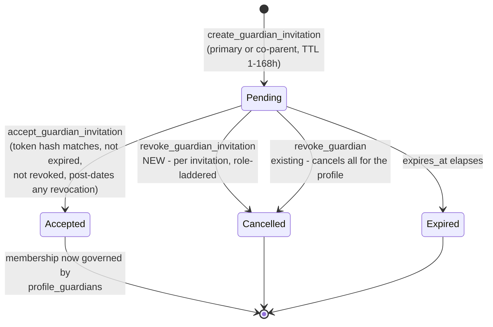
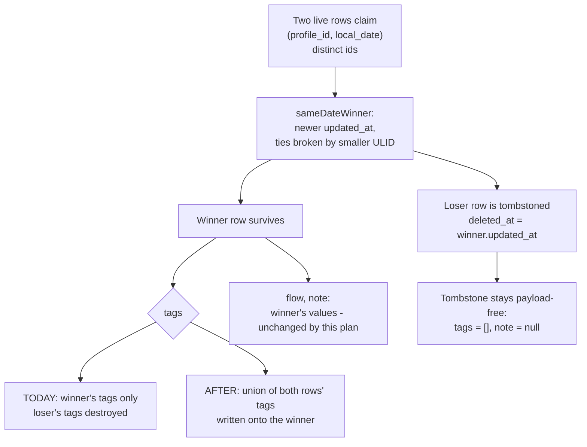

# Family Sharing & Invitations - Close the Gaps Issue #3 Names - Plan

**Target repo:** `lunarlog` (`wjdavis5/lunarlog`). All paths in this document are repo-relative.

---

## Goal Capsule

- **Objective:** Deliver the three parts of issue #3's family-sharing design that the shipped multi-guardian implementation does not yet cover: cancellable pending invitations, a `viewer` role that is actually read-only in the app, and non-destructive conflict resolution when two caregivers log the same date. Record the resulting design decisions so #3's "draft the design spec" ask is satisfied by a durable artifact rather than a meeting.
- **Means:** Two additive Supabase migrations (a `revoke_guardian_invitation` SECURITY DEFINER RPC with privilege tightening; a set-union merge in `sync_push`'s same-date resolver), matching client changes in `SharingService` / `LunarLogStorage` / `ManageGuardiansScreen` / `MonthCalendar`, pgTAP and Flutter coverage for each, and a docs pass.
- **Authority hierarchy:** GitHub issue #3 owns product intent. The already-merged [`docs/plans/2026-09-04-0710-feat-multi-guardian-support-plan.md`](2026-09-04-0710-feat-multi-guardian-support-plan.md) (issue #8) owns the sharing model that is already live and is **not** re-litigated here. This document owns only the delta.
- **Stop conditions:** Stop and surface if any change would let a non-guardian read a profile or a day entry; if invitation state becomes writable by `authenticated` outside a SECURITY DEFINER path; if the tag-merge rule can be shown non-convergent (order-dependent) across two devices; or if a change to `sync_push` regresses any of the 303 existing pgTAP assertions.
- **Execution profile:** `code`; deep - it touches RLS, an authorization RPC, and the sync convergence rule, over a minor's health data.
- **Tail ownership:** Ownership transfer to the child stays with **issue #4 (open)**; caregiver push alerts stay with **issue #5 (open)**. Neither has landed; nothing here may pre-empt their schema.

---

## Problem Frame

Issue #3 asks for a "secure multi-user sharing and invitation system" and lists four areas to design: sharing models and roles, the invitation/onboarding flow, the schema and RLS architecture, and conflict resolution for concurrent logging.

**Three of those four are already built and merged.** Issue #8 shipped `public.profile_guardians` and `public.guardian_invitations` (`supabase/migrations/20260904010000_multi_guardian_schema.sql`), the `create_guardian_invitation` / `accept_guardian_invitation` / `revoke_guardian` RPCs (`20260904020000_sync_push_and_invitations.sql`), a revocation-bypass fix (`20260905090000_close_guardian_revocation_bypass.sql`), the whole client stack (`lib/domain/sharing/sharing_service.dart`, `lib/data/sharing/supabase_sharing_service.dart`, `lib/ui/sharing/`), the `lunarlog://invite?code=...` deep-link handoff in `lib/app.dart`, server-authoritative attribution, and the R5 local revocation wipe in `lib/data/db/storage.dart`. 68 pgTAP assertions already cover guardian RLS, guardian `sync_push` enforcement, and the revocation bypass.

Issue #3's recommended `profile_memberships` table is that shipped `profile_guardians` table, and its `Viewer / Contributor / Co-Manager / Owner` ladder is the shipped `viewer / caregiver / co_parent / primary_guardian` ladder. Re-designing either would be a rewrite of working, tested, security-reviewed code for no product gain.

What is **not** built are two things issue #3 names explicitly:

1. **Pending invitations are write-only.** `create_guardian_invitation` mints a 48-hour link, and nothing in the app can list outstanding invitations or cancel one. A link texted to the wrong person cannot be withdrawn - the operator's only recourse is to wait 48 hours, or to let the wrong person accept and then revoke them, which means a stranger holds a minor's cycle history in between. Issue #3's "Pending invite expiration (e.g. 48-hour TTL)" bullet and its "Instant revocation" guardrail both land here. The server is *almost* ready for it: `guardian_invitations_select` already exposes a profile's invitations to its primary guardian and co-parents, `accept_guardian_invitation` already refuses a row with `revoked_at` set, and `revoke_guardian` already cancels a profile's outstanding invitations wholesale. Only per-invitation cancellation is missing - and the one grant that exists for it (`grant update (revoked_at) ... to authenticated`, gated by `guardian_invitations_update`'s `invited_by = auth.uid()`) is **narrower than the role ladder**: a primary guardian can see a co-parent's outstanding invitation but cannot cancel it.

2. **`viewer` is not read-only in the app.** Issue #3's role hierarchy makes `Viewer` "read-only access to calendar, flow history, and predictions". The server enforces that - `sync_push` rejects a `viewer`'s day-entry write with `insufficient_privilege` - but the client never asks. `GuardianRole.canLog` exists in `lib/domain/models/profile_guardian.dart` and is **referenced nowhere in `lib/` or `test/`**; `MonthCalendar.readOnly` and `DaySheet.readOnly` are wired to "profile is archived", never to the caller's role. So a viewer gets the full logging UI, their entry is written to the local encrypted store, the push is rejected, and the row is parked in the sync engine's `_rejected` map. The viewer then sees an entry on a minor's shared profile that no other guardian will ever see, with no error shown. Not a data leak - but a silent divergence and a broken promise in the one role whose entire definition is "cannot log".

3. **Concurrent same-date logging destroys one caregiver's data.** Issue #3 asks "how to resolve conflicts if two caregivers log symptoms on the same date while offline or simultaneously". Issue #8 answered it in R15 - "the latest timestamp wins for conflicting fields, while non-conflicting tags are unioned" - and shipped only the first half. Both resolvers (`sync_push`'s same-date branch, and `LunarLogStorage._resolveSameDateConflicts`) tombstone the losing row outright, writing `tags = []` and `note = null`. So when Mom logs `cramps` offline and Dad logs `heavy flow` offline for the same date, whichever syncs second silently erases the other's symptom tags. This is the precise multi-caregiver scenario the feature exists for, and it is the only known way the app loses a caregiver's entered data without telling anyone.

Nothing else issue #3 names is missing, and no open issue tracks any of the three (#94/#95/#96 touch `sync_push` but not the resolver's data loss; #87-#90 are attribution test gaps, not role gating).

---

## Requirements

- R1. An authorized guardian can see every outstanding (not accepted, not revoked, not expired) invitation for a profile, with its role, recipient label, and time remaining.
- R2. An authorized guardian can cancel a single outstanding invitation, after which the token can never be redeemed.
- R3. Cancellation authority follows the same ladder as `revoke_guardian`: the primary guardian may cancel any invitation on the profile; a co-parent may cancel an invitation it created, plus any `caregiver` or `viewer` invitation; a caregiver or viewer may cancel nothing.
- R4. Invitation state (`revoked_at`, `accepted_at`, `accepted_by`) is writable only through SECURITY DEFINER RPCs - no `authenticated` grant or RLS path may write it directly.
- R5. Cancelling an invitation is idempotent: cancelling an already-cancelled, already-accepted, or already-expired invitation reports the outcome without error and without altering an accepted membership.
- R6. Pending-invitation metadata is read on demand from the server and never persisted to the local encrypted store.
- R7. When two live day entries collide on one `(profile_id, local_date)`, their `tags` are merged as a set onto the surviving row; the loser is still tombstoned.
- R8. `flow` and `note` remain strict last-writer-wins on the same collision - the winner's values survive, the loser's are discarded.
- R9. R7's merge is order-independent and idempotent: any two devices resolving the same set of colliding rows in any order reach the same `tags`.
- R10. R7 applies **only** to the distinct-id same-date collision path. The same-id convergence path is untouched, so removing a tag from an existing entry still removes it.
- R11. The merged `tags` value is authored on the server and pushed by the client the same way any resolved row is, so the two resolvers cannot diverge.
- R12. Tombstones continue to carry no payload: the merge writes onto the live winner, never onto a deleted row.
- R13. A guardian whose accepted role is `viewer` sees the calendar, history, and predictions for a shared profile, and cannot open a writable day sheet for it.
- R14. Role-derived read-only is additive to the existing archived-profile read-only: a profile that is archived **or** whose caller is a viewer is read-only.
- R15. When the caller's role is not yet known - guardian rows have not synced, or the profile is local-only with no account - the app does **not** degrade to read-only. Local-first single-operator use, and a freshly created profile whose guardian row has not round-tripped, must both stay writable.

---

## Key Technical Decisions

- **KTD1. Keep the shipped `profile_guardians` model; do not introduce `profile_memberships`.** Issue #3's schema sketch and role ladder are already implemented under different names, with 68 pgTAP assertions and a merged security fix behind them. This plan maps #3's vocabulary onto the shipped names in `AGENTS.md` and treats renaming as out of scope. *(Governs R1-R5)*
- **KTD2. Per-invitation cancellation is a new `revoke_guardian_invitation(p_invitation_id uuid)` SECURITY DEFINER RPC, and the direct `update (revoked_at)` grant is withdrawn.** This is the posture the schema already documents as KTD15 ("membership state is only writable through the SECURITY DEFINER RPCs") - the surviving column grant is the one place invitation state escaped it. Routing through an RPC is also the only way to implement R3's role ladder, because an RLS `with check` can constrain the caller but never the target row, exactly as the existing policy comments in `20260904010000_multi_guardian_schema.sql` explain for the INSERT paths. The now-unreachable `guardian_invitations_update` policy is dropped in the same migration rather than left as dead configuration. *(Governs R2, R3, R4)*
- **KTD3. Pending invitations are fetched on demand, not synced into Drift.** They are short-lived (=<168h), needed only while the Manage Guardians screen is open, and are the one artifact whose existence on a device is itself sensitive - a recipient label like "Grandma" plus a minor's profile id. Reading them through PostgREST under the existing `guardian_invitations_select` policy avoids a Drift schema bump, a `db.g.dart` regeneration, a new sync table, and a new local retention surface. The trade-off - the pending list needs connectivity and shows an empty state offline - is acceptable because inviting is an online action anyway. *(Governs R1, R6)*
- **KTD4. Same-date conflict resolution merges `tags` as a set union and leaves `flow` and `note` at last-writer-wins.** Set union is commutative and idempotent, so it converges under any resolution order across any number of colliding rows (R9) - which is what makes it safe to run in two independent resolvers. `note` is free text and `flow` is a single-valued enum; neither has a merge that is both order-independent and meaningful, so inventing one would trade a visible data loss for a silent corruption. This delivers issue #8's R15 exactly as written rather than extending it. *(Governs R7, R8, R9)*
- **KTD5. Union is safe here because the same-date path only ever sees independently-created rows.** A union would be wrong on the same-id convergence path, where an empty `tags` array legitimately means "the user removed these tags". The same-date resolver runs only when two *distinct* row ids claim one `(profile_id, local_date)` - which happens only when two devices each created an entry for that date with no shared history - so there is no removal intent to preserve. The same-id path keeps strict replacement. *(Governs R10)*
- **KTD6. The server is the authority for the merged value; the client merges identically and pushes the result.** `sync_push` writes the union onto the winner and returns it in `resolved`, so every device converges on the server's copy. `LunarLogStorage._resolveSameDateConflicts` performs the same union locally and marks the winner dirty, so a merge computed offline survives to the next push instead of being erased before it is ever sent. Because union is idempotent, the server re-applying it to an already-merged push is a no-op. *(Governs R11)*
- **KTD7. Migration filenames sort after `main`'s current tip (`20260906150000_feedback_tickets_notified_at.sql`).** Per `AGENTS.md`'s Migration Flow item 7, `supabase db push` applies unapplied migrations in filename order, so anything authored on this branch must sort after whatever is already on `main`. This plan's files are `20260906160000_` and `20260906170000_`.
- **KTD8. Viewer read-only is a client-side courtesy over an already-enforced server rule, and it fails open, not closed.** The authorization decision is already made and tested server-side; the client change only stops the app from collecting a write it knows will be rejected. That framing sets the failure mode: an *unknown* role must stay writable (R15), because defaulting to read-only whenever the guardian list has not synced would lock a local-only operator, or a brand-new profile whose guardian row has not round-tripped, out of their own data. Reuse the existing `GuardianRole.canLog` - which already encodes the rule and today has zero callers - rather than introducing a second capability model. *(Governs R13, R14, R15)*
- **KTD9. Nothing here anticipates issue #4 or #5.** Both are still **open** - neither ownership transfer nor caregiver alerts has merged. `revoke_guardian_invitation` takes an invitation id and a role ladder only; it adds no column, no status value, and no notification hook that #4 or #5 would have to unwind.

---

## RLS & Authorization Implications

This is the section to re-read before touching anything below. The data is a minor's health record and the threat model is a family member or ex-partner with a valid account, not an anonymous attacker.

**What the new RPC may not become.** `revoke_guardian_invitation` is `security definer`, so it executes as the function owner and RLS does not protect it. Every authorization decision must be made explicitly inside the function body, in this order: reject a null `auth.uid()`; load the invitation row; derive the caller's *accepted* role on that invitation's `profile_id` from `profile_guardians`; reject when the caller is not `primary_guardian` or `co_parent`; reject when a co-parent targets a `co_parent` invitation it did not itself create. `set search_path = ''` and schema-qualified names are mandatory, matching every other function in this schema. The function is granted to `authenticated` only, with `revoke all ... from public, anon` first - the pattern used by all four existing guardian RPCs.

**Enumeration.** The RPC takes an invitation UUID, which is not guessable, but a caller who is a guardian of profile A must not learn anything about an invitation belonging to profile B. Resolve the profile from the row, then authorize; on any authorization failure raise `insufficient_privilege` with the same message regardless of whether the row exists, so a caller cannot distinguish "no such invitation" from "not yours".

**The privilege withdrawal is a behavior change, not just cleanup.** Dropping `grant update (revoked_at) on public.guardian_invitations to authenticated` and the `guardian_invitations_update` policy closes the only remaining direct-PostgREST write to invitation state. Nothing in `lib/` uses it today (`supabase_sharing_service.dart` calls RPCs exclusively), so there is no client to migrate - but a pgTAP assertion must prove the door is shut, or a future reviewer will re-open it as "harmless".

**What must not widen.** `guardian_invitations_select` already returns a profile's invitations to `invited_by = auth.uid()` or an accepted primary/co-parent. The pending list uses that policy unchanged. Do not add a policy, a view, or a `security definer` list function - any of those would be a new read surface over invitation metadata, and the existing one is already correctly scoped.

**Token secrecy is unaffected.** Only `token_hash` is stored; the raw token exists solely in the invite URI. The pending list must render the role, label, and expiry - never a token or a hash - so a screenshot of the Manage Guardians screen cannot be redeemed.

**The `sync_push` change is authorization-neutral by construction.** The tag merge runs *after* the existing guardian role check (`v_caller_role is null or v_caller_role = 'viewer'` rejects the write) and only rewrites `tags` on rows the caller was already authorized to write. It must not read, write, or widen any row outside the `(profile_id, local_date)` the caller is already touching. The `enforce_day_entry_attribution` triggers still fire on the merged update, so `last_modified_by_user_id` stays server-authoritative.

**Advisors are a gate, not a formality.** Per `AGENTS.md` Migration Flow item 5, call the Supabase MCP `get_advisors` tool (security and performance) against `dleexnnevuuddcgcpztq` before the migration run is approved, and confirm zero security or RLS findings.

---

## High-Level Technical Design

### Invitation lifecycle after this change



Only the `revoke_guardian_invitation` edge is new. `Cancelled` is not a new column or status value - it is the existing `revoked_at` timestamp, which `accept_guardian_invitation` already refuses.

### Same-date collision, before and after



The winner/loser selection rule, the tombstone stamp, and the `flow`/`note` outcome are all unchanged. Only the winner's `tags` value changes, and only on this path.

---

## Implementation Units

### U1. `revoke_guardian_invitation` RPC and invitation-privilege tightening

- **Goal:** Give the server a single, role-laddered, SECURITY DEFINER way to cancel one outstanding invitation, and close the direct-PostgREST write that bypasses the ladder.
- **Requirements:** R2, R3, R4, R5
- **Dependencies:** none
- **Files:**
  - `supabase/migrations/20260906160000_revoke_guardian_invitation.sql` (create)
  - `supabase/tests/guardian_invitation_revocation_test.sql` (create)
- **Approach:**
  1. Create `public.revoke_guardian_invitation(p_invitation_id uuid) returns jsonb`, `language plpgsql`, `security definer`, `set search_path = ''`.
  2. Body order, exactly: reject null `auth.uid()` with `insufficient_privilege`; `select ... into ... from public.guardian_invitations where id = p_invitation_id for update`; if not found, raise the *same* `insufficient_privilege` error the unauthorized branch raises (see the RLS section on enumeration); resolve the caller's accepted role on the row's `profile_id`; reject anything but `primary_guardian` / `co_parent`; reject a co-parent targeting a `co_parent`-role invitation it did not create.
  3. Terminal states return rather than raise (R5): already `accepted_at` -> return `{"outcome": "already_accepted"}` and change nothing; already `revoked_at` -> `{"outcome": "already_revoked"}`; `expires_at <= now()` -> `{"outcome": "expired"}` and still stamp `revoked_at` so the row is unambiguously dead.
  4. Otherwise `update public.guardian_invitations set revoked_at = clock_timestamp() where id = ...` and return `{"outcome": "revoked", "invitation_id": ...}`. Use `clock_timestamp()` for the same reason `create_guardian_invitation` does - see that function's header note about transaction-frozen `now()`.
  5. `revoke all on function ... from public, anon; grant execute ... to authenticated;`.
  6. In the same migration: `revoke update (revoked_at) on public.guardian_invitations from authenticated;` and `drop policy if exists "guardian_invitations_update" on public.guardian_invitations;`, with a comment recording that all invitation-state writes are now SECURITY DEFINER-only (KTD2) and pointing at this plan.
  7. Do **not** edit any merged migration in place - this file is purely additive, matching the discipline stated in `20260905090000_close_guardian_revocation_bypass.sql`'s header.
- **Patterns to follow:** `supabase/migrations/20260904020000_sync_push_and_invitations.sql` (`revoke_guardian`'s role-ladder shape and its `raise ... using errcode`); `20260905090000_close_guardian_revocation_bypass.sql` (additive-only migration, `clock_timestamp()` rationale).
- **Execution note:** Write the pgTAP assertions for the denial cases before the function body - the authorization ladder, not the happy path, is what this unit is for.
- **Test scenarios:**
  - Primary guardian cancels a `caregiver` invitation -> `revoked_at` set, outcome `revoked`.
  - Primary guardian cancels a `co_parent` invitation created by a co-parent -> succeeds (R3).
  - Co-parent cancels a `viewer` invitation created by the primary guardian -> succeeds (R3).
  - Co-parent cancels a `co_parent` invitation it did not create -> `insufficient_privilege`, row unchanged.
  - Caregiver attempts to cancel any invitation on a profile they are an accepted guardian of -> `insufficient_privilege`.
  - Viewer attempts to cancel -> `insufficient_privilege`.
  - A stranger (accepted guardian of a different profile) targeting this invitation id -> `insufficient_privilege`, and the error text is byte-identical to the not-found error.
  - A nonexistent invitation id -> `insufficient_privilege`, byte-identical message (no existence oracle).
  - Cancelling an already-revoked invitation -> outcome `already_revoked`, `revoked_at` unchanged from its first value (R5, idempotent).
  - Cancelling an already-accepted invitation -> outcome `already_accepted`, and the corresponding `profile_guardians` row is still `accepted` (R5 - cancellation never retro-revokes a membership).
  - Cancelling an expired invitation -> outcome `expired`, `revoked_at` stamped.
  - `accept_guardian_invitation` with a token whose invitation was just cancelled -> `object_not_in_prerequisite_state`, no `profile_guardians` row created (proves the cancel actually bites).
  - `authenticated` has no `UPDATE` privilege on `public.guardian_invitations` at all (`has_column_privilege` false for `revoked_at`, `accepted_at`, `accepted_by`), and no `guardian_invitations_update` policy exists (R4).
  - A direct `update public.guardian_invitations set revoked_at = now()` as the invitation's own creator is rejected (the withdrawn grant, proven behaviorally rather than only from the catalog).
  - `revoke_guardian` still cancels the profile's outstanding invitations - existing behavior unregressed.
- **Verification:** `npx --yes supabase@2.116.0 db reset --local` then `npx --yes supabase@2.116.0 test db --local` - the new file's `plan(N)` matches and the whole suite (303 existing + this file) is green.

---

### U2. Pending-invitation listing and cancellation in the sharing layer

- **Goal:** Extend the sharing domain contract and its Supabase implementation so the app can read a profile's outstanding invitations and cancel one.
- **Requirements:** R1, R2, R5, R6
- **Dependencies:** U1
- **Files:**
  - `lib/domain/sharing/sharing_service.dart` (modify)
  - `lib/data/sharing/supabase_sharing_service.dart` (modify)
  - `test/data/sharing/supabase_sharing_service_test.dart` (modify)
  - `test/domain/sharing/sharing_models_test.dart` (modify)
- **Approach:**
  1. Add a `PendingInvite` value type to `sharing_service.dart` alongside `GeneratedInvite`: `invitationId`, `profileId`, `role`, `recipientLabel`, `createdAt`, `expiresAt`. It carries **no token and no hash** (see the RLS section). Give it the same hand-written `==`/`hashCode` shape the neighbouring models use.
  2. Add an `InviteCancellation` outcome enum mirroring U1's returned `outcome` values (`revoked`, `alreadyRevoked`, `alreadyAccepted`, `expired`) with a `fromDb` factory in the style of `GuardianStatus.fromDb` in `lib/domain/models/profile_guardian.dart`.
  3. Extend the `SharingService` interface with `Future<List<PendingInvite>> listPendingInvites(String profileId)` and `Future<InviteCancellation> cancelInvite(String invitationId)`.
  4. Implement `listPendingInvites` in `SupabaseSharingService` as a PostgREST select on `guardian_invitations` filtered to `profile_id`, `accepted_at is null`, `revoked_at is null`, `expires_at > now()`, ordered by `created_at` - selecting an explicit column list that omits `token_hash`, and relying on the existing `guardian_invitations_select` policy for authorization. Do not add a new RPC for reading.
  5. Implement `cancelInvite` as an `rpc('revoke_guardian_invitation', ...)` call, parsing `outcome`.
  6. Route both through the existing `_mapError` so failures surface as the existing `SharingFailure` variants; add no new failure type unless a scenario below cannot be expressed with the current set.
  7. Leave `createInvite`, `acceptInvite`, and `revokeGuardian` untouched.
- **Patterns to follow:** `lib/data/sharing/supabase_sharing_service.dart`'s existing RPC-call-then-`_mapError` shape and its `MockClient`-over-a-real-`SupabaseClient` test harness in `test/data/sharing/supabase_sharing_service_test.dart`; `lib/domain/models/profile_guardian.dart` for the enum-with-`fromDb` idiom. User-facing copy belongs on the domain type (`SharingFailure.userFacingMessage`), never in the widget.
- **Test scenarios:**
  - `listPendingInvites` maps a row set to `PendingInvite`s in `created_at` order, parsing `expires_at` to UTC.
  - `listPendingInvites` returns an empty list when the profile has no live invitations.
  - `listPendingInvites` never requests or exposes `token_hash` - assert on the selected column list, so a future edit that adds it back fails here.
  - `listPendingInvites` maps a transport failure to `SharingFailure.network`.
  - `cancelInvite` sends the invitation id as `p_invitation_id` and maps `outcome: "revoked"` to `InviteCancellation.revoked`.
  - `cancelInvite` maps each of `already_revoked`, `already_accepted`, and `expired` to its enum value rather than throwing (R5).
  - `cancelInvite` maps a `42501` / `insufficient_privilege` RPC error to `SharingFailure.unauthorized`.
  - `cancelInvite` maps an unrecognised `outcome` string to `SharingFailure.other` rather than silently reporting success.
  - `PendingInvite` equality and `hashCode` are consistent across identical and differing field sets.
  - `InviteCancellation.fromDb` on an unknown value fails loudly rather than defaulting to a success value.
- **Verification:** `flutter test test/data/sharing/ test/domain/sharing/` green; `flutter analyze` clean.

---

### U3. Manage Guardians: pending-invitation section

- **Goal:** Surface outstanding invitations on the Manage Guardians screen with their role, label, and time remaining, and let an authorized guardian cancel or re-share one.
- **Requirements:** R1, R2, R3, R6
- **Dependencies:** U2
- **Files:**
  - `lib/ui/sharing/manage_guardians_screen.dart` (modify)
  - `test/ui/sharing_flow_test.dart` (modify)
- **Approach:**
  1. Add a "Pending invitations" section below the existing guardian list, loaded once on init and refreshed after a successful create or cancel. It is a `Future`-backed section, not a stream - there is no local table behind it (KTD3).
  2. Gate the whole section on the same `_callerRoleOf` result the invite FAB already uses: visible only to `primaryGuardian` and `coParent`. Reuse that method rather than recomputing the role - the existing "rows haven't synced yet" null handling is load-bearing and must not be duplicated divergently.
  3. Per row: role label, recipient label when present, and relative expiry ("expires in 6h"). Never render a token, a hash, or the invite URI.
  4. Cancel action: confirmation dialog in the shape of the existing `_revoke` confirmation, then `sharingService.cancelInvite`. On `revoked` refresh the list; on `alreadyAccepted` refresh both the pending list and let the guardian stream update itself; on `alreadyRevoked` / `expired` refresh with a neutral message. Show a per-row cancel control only when the caller's role permits it under R3's ladder - mirror `_canRevoke`'s structure rather than inventing a second authority model.
  5. Empty state: a single line ("No pending invitations"). Offline / load failure: an inline retry affordance, not a thrown error - the rest of the screen must keep working, since the guardian list comes from local Drift and does not need connectivity.
  6. Do not change the invite dialog's create flow or the deep-link handoff in `lib/app.dart`.
- **Patterns to follow:** `lib/ui/sharing/manage_guardians_screen.dart`'s existing `_canRevoke` ladder, `_revoke` confirmation dialog, and `_revokeErrorMessage` context-inference approach; `lib/ui/sharing/invite_guardian_dialog.dart` for role labelling.
- **Test scenarios:**
  - Primary guardian sees the pending section listing two invitations with their roles and labels.
  - Co-parent sees the pending section (R3 allows them to cancel some invitations).
  - Caregiver does not see the pending section at all.
  - Viewer does not see the pending section at all.
  - Guardian rows not yet synced (empty local table) does not collapse the section into a "not a manager" state - the same null-vs-empty distinction the existing FAB gate makes.
  - Tapping cancel shows a confirmation dialog; dismissing it makes no service call.
  - Confirming cancel calls `cancelInvite` with that invitation's id and removes the row on refresh.
  - A co-parent viewing a `co_parent` invitation created by the primary guardian sees no cancel control on that row (R3).
  - `cancelInvite` returning `alreadyAccepted` refreshes rather than leaving a stale pending row on screen.
  - A `listPendingInvites` failure renders the retry affordance and leaves the guardian list rendered.
  - No widget in the section renders a token, hash, or `lunarlog://invite` URI - assert on the rendered text.
  - An expired invitation returned by a stale load renders without crashing (negative time remaining is clamped).
- **Verification:** `flutter test test/ui/` green; `dart run tool/quality_gate.dart` passes (this file is not in `tool/quality/exclusions.dart`, so the new branches need real coverage, and the CRAP gate applies to the new role-gating method).

---

### U4. `sync_push` same-date tag merge (server)

- **Goal:** Stop `sync_push`'s same-date resolver from discarding the losing entry's tags; write the set union onto the surviving live row.
- **Requirements:** R7, R8, R9, R10, R11, R12
- **Dependencies:** none (independent of U1-U3)
- **Files:**
  - `supabase/migrations/20260906170000_same_date_tag_merge.sql` (create)
  - `supabase/tests/same_date_tag_merge_test.sql` (create)
- **Approach:**
  1. `create or replace function public.sync_push(jsonb, jsonb)` carrying the current body from `20260904020000_sync_push_and_invitations.sql` with only the same-date resolver block changed. Additive migration only; do not edit the merged file.
  2. In the `v_incoming_wins` true branch: before tombstoning `v_other`, compute the union of `v_tags` and `v_other.tags` and use it as the incoming row's `v_tags`. `v_other` is still tombstoned with `tags = '[]'` and `note = null` (R12).
  3. In the `v_incoming_wins` false branch: the incoming row becomes a tombstone, so its tags cannot survive on itself - instead update the surviving `v_other` row's `tags` to the union in the same statement that already touches it, and leave its `updated_at` alone so the winner's timestamp is not disturbed by a merge. Return the updated `v_other` in `resolved` so the pushing client receives the merged value (R11).
  4. Implement the union as a helper - `public.merge_tag_arrays(a jsonb, b jsonb) returns jsonb` - that deduplicates, preserves a deterministic order (sorted), and returns `'[]'` for null/empty inputs. A named helper keeps the union rule in one place for both branches and gives the pgTAP suite something to assert directly. `immutable`, `language sql`, `set search_path = ''`, no grants beyond what `sync_push` needs.
  5. Do not touch the winner/loser selection rule, the tombstone stamps, the role checks, the attribution stamping, the advisory lock, the row-count caps, or the key allow-lists.
  6. Note in the migration header that this delivers issue #8's R15, which the original implementation did not, and cross-reference this plan.
- **Patterns to follow:** `20260904020000_sync_push_and_invitations.sql` (the function this replaces); `20260905090000_close_guardian_revocation_bypass.sql` (additive `create or replace` of an already-merged function).
- **Execution note:** The existing `supabase/tests/sync_push_test.sql` (87 assertions) and `guardian_sync_push_test.sql` (26) are the characterization suite for this function - run them first, unchanged, and treat any movement in them as a regression rather than an expected update.
- **Test scenarios:**
  - `merge_tag_arrays` on two disjoint arrays returns both sets, sorted, no duplicates.
  - `merge_tag_arrays` is commutative for the same pair, and idempotent when applied to its own output (R9).
  - `merge_tag_arrays` handles null, `'[]'`, and one-empty-one-populated inputs.
  - Mom pushes `["cramps"]` and Dad later pushes `["heavy_flow"]` for the same profile and date as a distinct row id -> the surviving row carries both tags; the loser is a tombstone with `tags = '[]'`, `note = null` (R7, R12).
  - Reversed push order for the same two rows yields the identical surviving tag set (R9).
  - The losing row's `note` is discarded and the winner's `note` and `flow` are unchanged (R8).
  - The incoming-row-loses branch merges onto the surviving row and returns it in `resolved` (R11).
  - Re-pushing an already-merged row does not duplicate tags and does not resurrect the tombstone.
  - A same-id update that removes a tag still removes it - no union on the same-id path (R10).
  - A `viewer` pushing into a same-date collision is still rejected before any merge happens - the merge did not move ahead of the role check.
  - `logged_by_user_id` is unchanged and `last_modified_by_user_id` is the merging caller on the surviving row (attribution triggers still fire).
  - Three-way collision (three distinct rows, one date) converges to the union of all three regardless of push order.
- **Verification:** `npx --yes supabase@2.116.0 db reset --local` then `test db --local`; `sync_push_test.sql` and `guardian_sync_push_test.sql` pass **unmodified**, and the new file is green.

---

### U5. Client same-date tag merge

- **Goal:** Make `LunarLogStorage`'s local resolver merge tags the same way the server does, so a merge computed offline survives to the next push instead of being erased locally first.
- **Requirements:** R7, R9, R10, R11, R12
- **Dependencies:** U4 (the server rule is authoritative; the client mirrors it)
- **Files:**
  - `lib/data/sync/conflict_rules.dart` (modify)
  - `lib/data/db/storage.dart` (modify)
  - `test/data/conflict_rules_test.dart` (modify)
  - `test/data/storage_sync_test.dart` (modify - the existing home for `LunarLogStorage` remote-apply tests)
- **Approach:**
  1. Add `List<String> mergeTags(List<String> a, List<String> b)` to `conflict_rules.dart` next to `sameDateWinner`, with the same deduplicate-and-sort semantics as U4's `merge_tag_arrays`. `conflict_rules.dart`'s own header already states the "one rule, two implementations" contract - extend that header to name the tag rule.
  2. In `_resolveSameDateConflicts`, local-loser branch: merge the loser's tags into the row `remote` will be written with, so the caller writes the union onto the surviving row. The loser is still written as a payload-free tombstone (R12).
  3. Remote-loser branch: merge `remote`'s tags into the surviving local row and mark it dirty with a bumped `localRev`, so the union is pushed (R11) - matching how the local-loser branch already marks its tombstone dirty.
  4. Return the merged tag list from `_resolveSameDateConflicts` alongside the existing `(updatedAt, deletedAt)` pair rather than mutating shared state, and thread it into `_dayEntryTags` so the tombstone-clearing rule stays the single place that decides a tombstone's payload.
  5. Do not change `sameDateWinner`, `remoteWinsById`, `compareInstants`, or any same-id apply path (R10).
- **Patterns to follow:** `lib/data/sync/conflict_rules.dart` (pure, Flutter-free rule functions with the server-parity comment); `lib/data/db/storage.dart`'s `_tombstoneRevokedSharedProfile` for the "write in the same transaction, control the dirty flag deliberately" shape.
- **Execution note:** Add the `mergeTags` unit tests in `conflict_rules_test.dart` first - it is a pure function and the parity contract with U4's SQL is the thing most likely to drift.
- **Test scenarios:**
  - `mergeTags` matches `merge_tag_arrays` on disjoint, overlapping, empty, and single-sided inputs - same ordering, same deduplication.
  - `mergeTags` is commutative and idempotent (R9).
  - Applying a remote row that loses the same-date rule merges its tags into the surviving local row and marks that row dirty with a bumped `localRev` (R11).
  - Applying a remote row that wins the same-date rule writes the union onto the remote row and leaves the local loser a tombstone with empty tags and null note (R7, R12).
  - A remote tombstone arriving for a date with a live local row is unaffected - tombstones never compete, existing `sameDateWinner` behavior.
  - A same-id remote row that drops a tag still drops it locally (R10).
  - Three local rows colliding on one date converge to the union regardless of the order pages arrive in (R9).
  - A merge on a profile whose row is absent locally still raises `RetryableSyncApplyError` from `_ensureDayEntryProfileExists` before any merge work - ordering unchanged.
- **Verification:** `flutter test` green; `dart run tool/quality_gate.dart` passes; `dart run tool/mutation_gate.dart` on the changed files - `conflict_rules.dart` is small, pure, and directly mirrored by a test file, which is exactly the shape the mutation gate is scoped to.

---

### U6. Make `viewer` actually read-only in the app

- **Goal:** Derive the logging UI's read-only state from the caller's guardian role so a `viewer` cannot compose an entry the server will reject, without changing behavior for local-only or not-yet-synced profiles.
- **Requirements:** R13, R14, R15
- **Dependencies:** none (independent of U1-U5)
- **Files:**
  - `lib/ui/logging/month_calendar.dart` (modify)
  - `lib/ui/profiles/profile_detail_screen.dart` (modify)
  - `test/ui/logging_test.dart` (modify)
- **Approach:**
  1. `MonthCalendar` already subscribes to `ProfileGuardiansRepository` and `AuthController` for the attribution badge (fields around line 66, subscribe/dispose around 113/133). Reuse that existing guardian list and `currentUserId` - add no new dependency and no new subscription.
  2. Derive the caller's accepted role from the guardian rows the widget already holds; when that role is `viewer`, treat the calendar as read-only in addition to the existing `widget.readOnly` archived-profile flag (R14). Pass the combined value where `widget.readOnly` is passed today (around lines 166 and 276) rather than threading a second flag through `DaySheet`.
  3. Express the rule through `GuardianRole.canLog`, not a fresh comparison - that getter exists precisely for this and currently has no callers.
  4. Fail open on unknown (R15): no guardian rows yet, no `currentUserId`, or no row matching the current user all mean "not known to be a viewer" and stay writable. This mirrors the null-vs-empty distinction `ManageGuardiansScreen._callerRoleOf` already makes; do not invert it.
  5. Surface *why* the sheet is read-only. `DaySheet._readOnlyBody` currently reads as the archived-profile case; give the viewer case its own line ("You have view-only access to this profile") so it is not mistaken for an archive. Per the repo's copy convention, user-facing copy for a domain condition belongs on the domain type - add a label to `GuardianRole` alongside `label` rather than hardcoding a string in the widget.
  6. Do not change the server. `sync_push`'s viewer rejection stays exactly as it is - this unit removes a way to reach it, not the guard itself.
- **Patterns to follow:** `lib/ui/sharing/manage_guardians_screen.dart`'s `_callerRoleOf` (the null-vs-empty guardian-rows discipline); `lib/ui/logging/month_calendar.dart`'s existing guardian subscription for the attribution badge; `lib/domain/sharing/sharing_service.dart`'s `userFacingMessage` for the copy-lives-in-domain convention (precedent test: `test/ui/auth_failure_copy_test.dart`).
- **Test scenarios:**
  - Caller is an accepted `viewer` -> tapping a day opens the read-only sheet, with no flow selector, tag chips, or note field.
  - Caller is an accepted `caregiver` -> the day sheet is writable.
  - Caller is an accepted `co_parent` or `primary_guardian` -> writable.
  - Caller is a `viewer` on an archived profile -> read-only, and the copy names the view-only reason rather than only the archive reason.
  - Guardian rows have not synced (empty list) -> writable (R15), not read-only.
  - `currentUserId` is null (no account, local-only operator) -> writable (R15).
  - Guardian rows exist but none match the current user -> writable (R15).
  - The caller's row exists with status `revoked` -> the R5 revocation wipe already tombstones the profile; assert this path does not additionally crash on a missing accepted role.
  - The read-only copy for the viewer case is asserted from `GuardianRole`, not from a literal in the widget (mirrors `auth_failure_copy_test.dart`).
- **Verification:** `flutter test test/ui/logging_test.dart` green; `flutter test` green; `dart run tool/quality_gate.dart` passes; `flutter test test/architecture/layering_test.dart` still passes - the new copy lives in `lib/domain/`, which must not import `package:flutter`.

---

### U7. Documentation and issue reconciliation

- **Goal:** Record the design decisions issue #3 asked for, map its vocabulary onto the shipped schema, and update the two docs that describe the schema.
- **Requirements:** all - this is the traceability unit
- **Dependencies:** U1-U6
- **Files:**
  - `AGENTS.md` (modify)
  - `README.md` (modify)
  - `docs/plans/2026-09-06-001-feat-family-sharing-invitations-plan.md` (this file)
- **Approach:**
  1. In `AGENTS.md`'s schema paragraph, add the two new migrations and the `revoke_guardian_invitation` RPC, note the withdrawn `update (revoked_at)` grant and dropped policy, and note the same-date tag-merge change to `sync_push`. Update the pgTAP assertion count.
  2. Add a short "Sharing model vocabulary" note mapping issue #3's proposed names onto the shipped ones (`profile_memberships` -> `profile_guardians`; `Owner` -> `primary_guardian`; `Co-Manager` -> `co_parent`; `Contributor` -> `caregiver`; `Viewer` -> `viewer`), so the next reader of #3 does not conclude the schema is missing.
  3. In `README.md`, document that invitations are cancellable, that a `viewer` now gets a read-only day sheet, and that concurrent same-date logging unions tags while `flow` and `note` remain last-writer-wins - all three are user-visible behavior.
  4. Add the manual device checks below to `docs/ops/supabase-go-live.md`'s device checklist.
- **Test expectation:** none - documentation only.
- **Verification:** `AGENTS.md`'s schema section names every migration in `supabase/migrations/`; the assertion count matches `test db --local` output.

---

## Scope Boundaries

### In scope

- Per-invitation cancellation, server and client, with its role ladder.
- Pending-invitation visibility in Manage Guardians.
- Withdrawing the direct `update (revoked_at)` grant on `guardian_invitations`.
- Deriving the logging UI's read-only state from the caller's guardian role, so `viewer` means what issue #3 says it means.
- Set-union tag merge on the same-date collision path, in both resolvers.
- Docs reconciling issue #3's vocabulary with the shipped schema.

### Non-goals

- **Re-designing the sharing model or renaming roles.** KTD1. The shipped `profile_guardians` model is issue #3's recommendation, already implemented and tested.
- **QR-code invitations.** Issue #3 lists QR as one option among "secure invite link, email invite, or QR code / AirDrop". The shipped share-sheet link already covers AirDrop and iMessage - the two proximity paths this household actually uses - so a QR dependency would add a package, a camera permission, and a scanning surface for no capability that does not already exist. Revisit only if a device check finds link sharing failing in practice.
- **Email-delivered invitations.** Deliberately rejected in issue #8's Key Decisions (avoids SMTP rate limits and leaking account addresses); nothing has changed.
- **Account-level sharing.** Issue #3 recommends against it; per-profile scoping is shipped.
- **Merging `note` or `flow` on collision.** KTD4 - no order-independent merge exists for either.
- **Warning the user that a note was superseded by conflict resolution.** Real, but it is a new UI surface with its own product questions; see below.

### Deferred to follow-up work

- **Conflict-resolution notice in Day Detail.** When a same-date collision discards a note, nothing tells the caregiver. Worth an issue after U4/U5 land, since the merge makes the remaining loss narrower and easier to describe.
- **Sharing discoverability.** The only route to `ManageGuardiansScreen` is a `'caregivers'` popup action on a profile row in `lib/ui/profiles/profile_picker_screen.dart`. There is no Settings entry, no "shared with me" view, and no pending-invite badge. U3 adds the pending list *inside* the existing screen; making the screen easier to find is a separate navigation change with its own design questions.
- **HTTPS universal-link fallback for invites.** Invite links are custom-scheme only (`lunarlog://invite?...`), so a link opened on a device without the app installed does nothing. A universal/App Link needs a hosted domain, an AASA file, and an `assetlinks.json` - infrastructure work well outside this plan.
- **A sync cursor for `profileGuardians`.** It re-pages from 0 on every reconcile cycle (see `lib/data/sync/supabase_sync_engine.dart`). Correct but wasteful; only matters if membership lists grow.
- **Ownership transfer to the child (issue #4, open).** Untouched here.
- **Caregiver alerts (issue #5, open).** Untouched here.
- **Granular per-caregiver redaction of specific notes.** Already deferred by issue #8; unchanged.
- **A periodic job to purge long-expired `guardian_invitations` rows.** They are inert once expired (`accept_guardian_invitation` refuses them) but accumulate; low priority, no security consequence.

---

## Assumptions

- Issues #4 and #5 are **open, not merged** (verified via `gh issue list` on 2026-09-06). The orchestrator's brief described them as recently merged; the guardian/sharing infrastructure this plan builds on came from issue **#8**, which is closed. Nothing in this plan depends on #4 or #5 having landed, and KTD8 keeps it that way.
- `supabase-migrate.yml` has never successfully pushed (the `production` environment's `SUPABASE_ACCESS_TOKEN` is unset - see `AGENTS.md` Migration Flow item 7). Both new migrations are therefore verified locally only; they will apply with the rest of the backlog whenever that secret is provisioned, which is why KTD7's filename ordering matters.
- The exact path of the storage test file in U5 is assumed to be `test/data/db/storage_test.dart`; confirm against the repo before editing and use the actual mirror path.

---

## Open Questions

- **Q1.** Should `revoke_guardian_invitation` also stamp `revoked_at` on an *expired* invitation (U1 step 3 says yes, for an unambiguous terminal state)? The alternative - leave it null and report `expired` - keeps `revoked_at` meaning strictly "someone cancelled this". Resolve during U1; either is safe, since `accept_guardian_invitation` already refuses on expiry independently.
- **Q2.** Should the pending list show invitations created by *other* guardians to a co-parent who cannot cancel them (visible-but-not-actionable), or hide them? U3 assumes visible-but-not-actionable, because hiding them would make "why can't I invite this person, it says already invited" unexplainable. Confirm during U3.

---

## Verification Contract

Run from the worktree root. Flutter 3.47.2 is at `C:\src\flutter\bin` and is not on `PATH`; in Git Bash use `export PATH="/c/src/flutter/bin:$PATH"` first. **Never run `dart format`** - this codebase is in the pre-3.13 style and the current formatter would rewrite whole files.

```bash
# Flutter
flutter pub get
flutter analyze
flutter test
dart run tool/quality_gate.dart      # 90% line floor + per-method CRAP gate; CI-enforced
dart run tool/mutation_gate.dart     # local-only; scoped to changed files with a test mirror

# Database (Docker required)
npx --yes supabase@2.116.0 start -x realtime,storage-api,imgproxy,mailpit,studio,edge-runtime,logflare,vector,supavisor
npx --yes supabase@2.116.0 db reset --local
npx --yes supabase@2.116.0 test db --local
```

Targeted runs while iterating:

```bash
flutter test test/data/sharing/ test/domain/sharing/   # U2
flutter test test/ui/sharing_flow_test.dart            # U3
flutter test test/data/conflict_rules_test.dart        # U5
flutter test test/ui/logging_test.dart                 # U6
flutter test test/architecture/layering_test.dart      # U6 - domain must not import Flutter
```

`test/ui/` is flat - there is no `test/ui/sharing/` directory, and UI tests are named by flow (`sharing_flow_test.dart`, `logging_test.dart`), not by source file. Fakes are hand-written under `test/support/` (`implements X` plus `noSuchMethod` passthrough); there is no mockito or mocktail. Supabase-touching service tests drive a real `SupabaseClient` over a `MockClient` HTTP stub - follow `test/data/sharing/supabase_sharing_service_test.dart`.

**No codegen step is needed.** No unit changes the Drift schema (KTD3), so `build_runner` and a `db.g.dart` commit are out of scope. If that changes, `dart run build_runner build --delete-conflicting-outputs` and committing `lib/data/db/db.g.dart` become mandatory.

**Pre-merge gate.** Call the Supabase MCP `get_advisors` tool (security and performance) against project `dleexnnevuuddcgcpztq` and confirm zero security or RLS findings, per `AGENTS.md` Migration Flow item 5.

**Not required.** `supabase/tests/manual/verify_realtime_delivery.mjs` - no unit touches `20260905100000_realtime_publication.sql` or the coordinator's subscription shape.

### Manual device checklist

`flutter test` cannot cover these; run them on an iPhone and an Android build with throwaway accounts and **fabricated profiles only - never real family data**.

- [ ] Generate an invite on Device A, see it in the pending list with a live countdown, cancel it, then attempt to redeem the link on Device B -> rejected, no membership created.
- [ ] Generate an invite as a co-parent on Device B; confirm the primary guardian on Device A can see and cancel it.
- [ ] Confirm a caregiver account sees no pending-invitations section at all.
- [ ] Accept a `viewer` invitation on Device C -> the shared profile's calendar and history render, tapping a day opens a read-only sheet naming the view-only reason, and no entry can be composed.
- [ ] On a device with no account at all, confirm logging still works on a local profile (the fail-open rule, R15).
- [ ] Both devices offline: log `cramps` on A and `heavy flow` on B for the same date, reconnect both -> both tags present on both devices, one entry, no duplicate row.
- [ ] Same scenario with notes on both sides -> the later note survives, the earlier is gone, and nothing else is lost.
- [ ] Airplane mode on the Manage Guardians screen -> the guardian list still renders from local storage; the pending section shows its retry affordance rather than blocking the screen.

---

## Definition of Done

- U1-U7 complete; `flutter analyze`, `flutter test`, `dart run tool/quality_gate.dart`, and `npx --yes supabase@2.116.0 test db --local` all exit 0.
- `supabase/tests/sync_push_test.sql` and `guardian_sync_push_test.sql` pass **unmodified** - the tag merge changed no existing behavior.
- `authenticated` holds no `UPDATE` privilege on any `public.guardian_invitations` column, proven by pgTAP.
- The unauthorized and not-found branches of `revoke_guardian_invitation` are indistinguishable to a caller, proven by pgTAP.
- No token, token hash, or invite URI appears in any pending-invitation widget, proven by a widget assertion.
- A `viewer` cannot open a writable day sheet, and an unknown or absent role still can (R15), both proven by widget tests.
- `test/architecture/layering_test.dart` passes - no new `lib/domain` file imports `package:flutter`, and no `lib/data` file imports `lib/ui`.
- `get_advisors` returns zero security or RLS findings for `dleexnnevuuddcgcpztq`.
- `AGENTS.md` names both new migrations and carries a current pgTAP assertion count; `README.md` describes the user-visible conflict behavior.
- No unit added, renamed, or repurposed a column, status value, or RPC that issue #4 or #5 would have to unwind.
