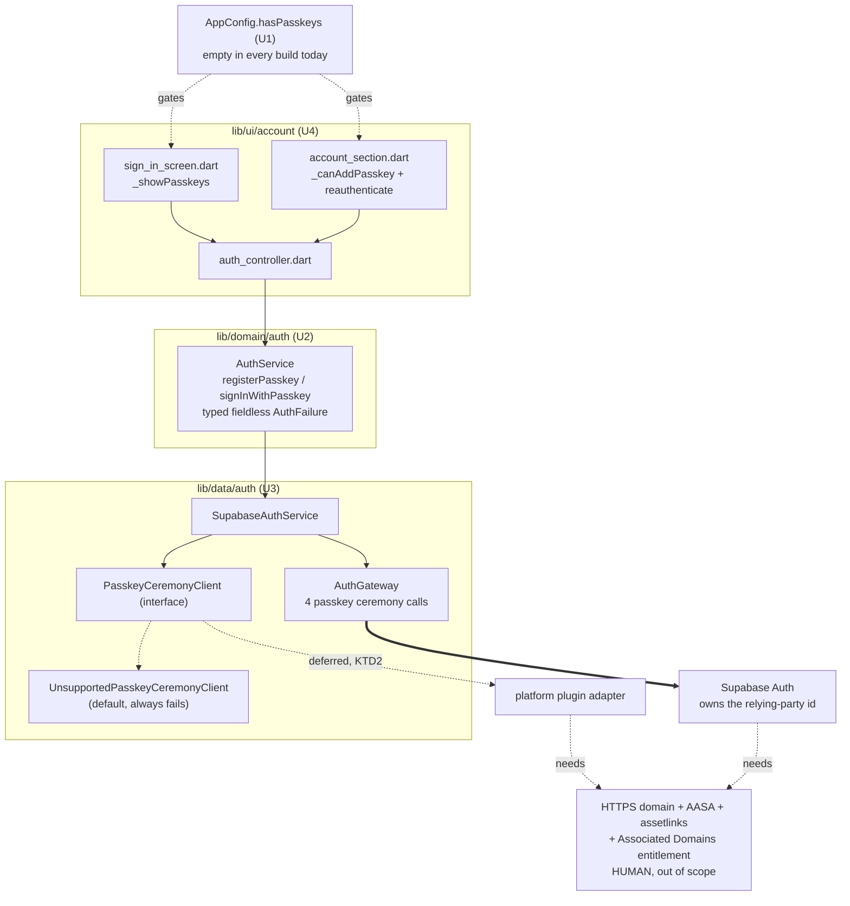
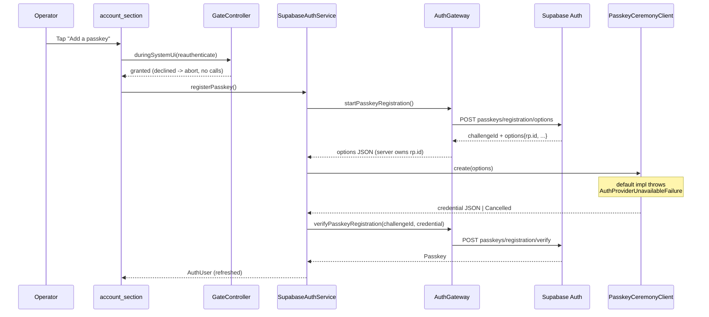

# Passkeys - Code-Only Groundwork (Activation Blocked on an HTTPS RP Domain) - Plan

## Goal Capsule

- **Objective:** Land everything for passkey sign-in and enrolment that does **not** require infrastructure this repo cannot provision, so that turning passkeys on later is a config value, one platform adapter, and a documented list of human steps - not a design exercise. Nothing in this plan makes a passkey reachable in any build that ships today.
- **Authority:** GitHub issue #30 for product intent; this plan's Product Contract and Key Technical Decisions for scope and mechanism; `AGENTS.md` for conventions and quality gates; `docs/plans/2026-09-03-001-feat-social-logins-plan.md` (the "#2 plan") for every auth mechanism this plan extends, and `docs/plans/2026-09-05-001-feat-remove-linked-sign-in-method-plan.md` (the "#31 plan") for the linked-method surface. R-IDs win on behavior, KTDs on mechanism.
- **Execution profile:** Standard plan, high-risk (authentication, minors' health data, an `@experimental` upstream API). Work in the `.worktrees/issue-30` worktree per `AGENTS.md`. Implement units in dependency order and keep every existing test green. Code doc comments cite this plan's IDs with a `#30` prefix - for example `(#30 U3; KTD2)` - so they never collide with the `#1`, `#2`, `#17`, or `#31` IDs already cited across `lib/`.
- **Stop conditions:** Stop and surface a blocker if any unit would (a) raise the shipped app's minimum iOS or Android version, (b) add a native dependency reachable by a default build, (c) make a passkey code path reachable when `AppConfig.hasPasskeys` is false, or (d) require logging or reporting a credential, challenge, email, or server message. Also stop if `supabase.auth.passkey` in the pinned `gotrue` no longer exposes the four ceremony methods named in KTD1.
- **Tail ownership:** The invoking pipeline owns commit, review, and PR. The relying-party domain, its `apple-app-site-association` and `assetlinks.json`, the iOS Associated Domains entitlement and regenerated provisioning profile, and the Supabase dashboard Passkeys toggle are **human follow-up** recorded in `docs/ops/supabase-go-live.md` by U5 - they are explicitly out of scope here.

---

## Product Contract

### Summary

The app gains the complete internal shape of passkey authentication - a build-time feature flag, a pure-Dart contract with typed fieldless failures, a fakeable platform-ceremony seam, the Supabase implementation over `supabase.auth.passkey`, and the two UI entry points - all behind a flag that is empty in every build that exists today. With the flag empty the app is byte-for-byte unchanged in behavior: no button on the sign-in screen, no tile in the account section, no new native dependency, no new permission, no new minimum OS version. When the household later owns an HTTPS domain and completes the documented prerequisites, activation is a `--dart-define`, one platform adapter class, and the go-live checklist.

### Problem Frame

Issue #2 listed passkeys as an optional fast follow and PR #27 deferred them because the prerequisites did not exist. Two of the three original blockers have since moved:

- The Dart API is no longer missing. `gotrue` 2.27.2 - already in `pubspec.lock` transitively under `supabase_flutter` 2.17.2 - ships `supabase.auth.passkey` with `startRegistration` / `verifyRegistration` / `startAuthentication` / `verifyAuthentication` / `list` / `update` / `delete`. It is `@experimental` and the feature is a Supabase beta, but it exists and needs no dependency bump.
- The relying-party id is a **server-side** value: gotrue returns it inside the options map the dashboard is configured with. No client code needs the domain in order to compile, be tested, or be reviewed.

The blocker that genuinely remains is infrastructure: the relying-party id must be a bare HTTPS domain the household controls, serving `apple-app-site-association` with a `webcredentials:` entry and `assetlinks.json` with every signing key's SHA-256; the iOS target needs an Associated Domains entitlement and a regenerated provisioning profile; and the dashboard's Passkeys beta must be switched on. None of that is code, all of it is human, and **the relying-party id is immutable once the first passkey is enrolled** - so the domain choice is permanent and must not be made implicitly by an agent.

The cost of doing nothing is that the design work gets re-derived from scratch whenever the domain appears, most likely by someone who no longer remembers why `AuthFailure` is fieldless or why the ceremony has to be injectable. The cost of doing too much is a native dependency that cannot function, shipped into every TestFlight and Play build for a feature that is permanently off. This plan takes the first and refuses the second.

### Actors

- A1. **Operator** - the adult who owns the device and the account.
- A2. **Supabase Auth** - issues the WebAuthn challenge and options, verifies the credential, returns the session.
- A3. **Platform authenticator** - iOS `AuthenticationServices` / Android Credential Manager, reached through a plugin that this plan deliberately does not yet adopt (KTD2).
- A4. **Release operator** - the human who provisions the domain, hosts the association files, regenerates the provisioning profile, and flips the dashboard toggle. Everything A4 does is documented by U5 and performed outside this plan.

### Requirements

**Feature flag**

- R1. Passkey support is gated on a single build-time value, the relying-party id, supplied as a `--dart-define`. Empty means the feature does not exist for that build: no UI, no reachable code path, no plugin call.
- R2. Every build that exists today - CI, forks, PR builds, TestFlight, Play internal - resolves the flag to empty, because no workflow passes the define. Adding the define is a deliberate, separate release action.
- R3. The flag additionally requires an account-capable build, on the same terms as `AppConfig.hasGoogle`: Supabase configured, and not web.

**Contract and failures**

- R4. Passkey registration and passkey sign-in are operations on the pure-Dart `AuthService` contract, alongside the existing Apple and Google operations. No Supabase type and no Flutter type crosses that boundary.
- R5. Every passkey failure is a typed, **fieldless** `AuthFailure`. No server message, no WebAuthn error name, no challenge, no credential id, no email - nothing that could reach Sentry or a log line. The UI chooses its own copy, as it does for every other provider.
- R6. A ceremony the operator dismisses is a distinct non-failure result, mirroring `GoogleSignInCancelled` and `AppleSignInCancelled`; it returns the caller to where it started with no error and no spinner.
- R7. A build with the flag on but no working platform ceremony fails as `AuthProviderUnavailableFailure` - the same generic outcome as a Google picker that cannot run - never as a crash and never with a provider message.

**Reachability and account rules**

- R8. Registering a passkey is offered only to a signed-in operator, in the account section, behind the same fresh device-credential check as "Add Google" (`gate.duringSystemUi(gate.reauthenticate)`), and only when the flag is on.
- R9. Signing in with a passkey is offered on the sign-in screen only when the flag is on, and a successful passkey sign-in completes that screen exactly as a Google sign-in does, preserving the existing one-account device binding and the account-mismatch path.
- R10. Passkeys are never presented as a recovery method and never removable-into-lockout: this plan adds no removal UI, so the account's existing "email is never removable" rule (#31 R9) is untouched.

**Documentation**

- R11. `docs/ops/supabase-go-live.md` gains a Passkeys section enumerating every human prerequisite, with the immutability of the relying-party id called out as a permanent decision, plus device-checklist items that can only be run after activation.
- R12. `AGENTS.md`'s auth-client paragraph records that the passkey path exists, is flag-gated off, and which adapter is deliberately absent.

### Scope Boundaries

**In scope**

- The feature flag, the domain contract, the ceremony seam and its unsupported default, the Supabase implementation and its error mapping, the two flag-gated UI entry points, tests to the repo's gates, and the two documentation updates.

**Non-goals (this plan will not do these)**

- Choosing, buying, provisioning, or naming the relying-party domain. The permanent choice belongs to a human.
- Hosting `apple-app-site-association` or `assetlinks.json`, or adding an Associated Domains entitlement.
- Any Supabase migration, Edge Function, or dashboard change.
- Turning the feature on in any workflow, or adding the define to any CI secret.
- Raising `IPHONEOS_DEPLOYMENT_TARGET` or Android `minSdk`.
- Passkey management UI - listing, renaming, or deleting enrolled passkeys. `supabase.auth.passkey` offers `list` / `update` / `delete`; none of it is reachable or reviewable until enrolment works, and speculative management screens are exactly the gold-plating this plan exists to avoid.
- Web passkeys (`navigator.credentials`). Web builds have accounts off by default and R3 excludes web outright.

### Deferred to Follow-Up Work

- **The platform ceremony adapter** (KTD2). A `PasskeyCeremonyClient` implementation over the `passkeys` plugin, adopted at activation time against whatever plugin version is current then. U3 fixes the seam's contract so this is a mechanical, single-class addition.
- **Passkey management** (list / rename / delete), once enrolment is real.
- **Re-examining `@experimental`.** Supabase may change the passkey API before activation. U3's error mapping and the seam are the only things coupled to it; re-verify both when the flag is first turned on.

### Acceptance Examples

- AE1. A CI build (no defines) renders the sign-in screen and the account section exactly as it does today - no passkey button, no passkey tile - and `flutter test` proves both absences.
- AE2. With the flag forced on in a widget test, the sign-in screen shows a passkey option; tapping it with a fake ceremony that returns a credential produces a signed-in session through the same path a Google sign-in takes.
- AE3. With the flag forced on and a fake ceremony that reports dismissal, the sign-in screen returns to its resting state: no error text, no spinner, no session.
- AE4. With the flag forced on and the default (unsupported) ceremony client, registering a passkey surfaces the generic provider-unavailable copy, and no exception escapes.
- AE5. A signed-in operator tapping "Add a passkey" is prompted for the device credential first; declining it aborts before any network or platform call.

---

## Key Technical Decisions

### KTD1. Use `supabase.auth.passkey` from the already-pinned `gotrue`; add no Supabase-side dependency

`gotrue` 2.27.2 is already resolved transitively under `supabase_flutter` 2.17.2 (`pubspec.lock`). Its `GoTruePasskeyApi` exposes the whole server half of the WebAuthn ceremony and exchanges plain `Map<String, dynamic>` payloads in W3C WebAuthn Level 3 JSON, with binary fields base64url-encoded. The relying-party id arrives *inside* those options from the server, so the client never names it. Consequence: the entire server half of this feature is written, tested, and reviewed today with no dependency change and no domain.

The API is annotated `@experimental` and the Supabase feature is beta. That is a real risk, and it is confined: it touches U3's gateway methods and error mapping only, and it is recorded in Risks.

### KTD2. Define the ceremony seam now; do **not** adopt the `passkeys` plugin yet

`PasskeyCeremonyClient` is an interface taking and returning the same JSON maps gotrue speaks, with a default `UnsupportedPasskeyCeremonyClient` that throws `AuthProviderUnavailableFailure`. The plugin-backed implementation is deferred to activation.

Chosen over adding `passkeys` 2.22.3 now, for four reasons:

1. **It cannot function.** The plugin's own documentation requires a served AASA file and an `assetlinks.json`. Without a domain there is nothing to test against and nothing a device check could prove.
2. **It would change shipped builds.** Apple's passkey APIs need iOS 16 and Credential Manager passkeys need Android API 28; this repo is at `IPHONEOS_DEPLOYMENT_TARGET = 15.0` and `minSdk = flutter.minSdkVersion`. Adopting the plugin risks silently raising the floor of every TestFlight and Play build for a permanently-off feature - which the Stop Conditions forbid.
3. **The adapter is the disposable half.** The plugin takes typed request objects (`RegisterRequestType`, `AuthenticateRequestType`), not the JSON maps gotrue produces, so the adapter is a translation layer pinned to one plugin version. Writing it months before it can run means writing it against a version that will have moved.
4. **The seam is the durable half.** Everything valuable - injectability, the fieldless failure boundary, the flag gate, the UI wiring, the tests - lives on this side of the interface and is landed today.

Trade-off accepted: at activation someone still writes one class. U3 pays that down by fixing the interface's exact contract and documenting the translation direction on the interface itself.

### KTD3. One `--dart-define` (the relying-party id) is both the config value and the feature flag

`AppConfig.passkeyRelyingPartyId` is a `String.fromEnvironment`; `AppConfig.hasPasskeys` is a `const` expression `hasSupabase && !kIsWeb && passkeyRelyingPartyId != ''`, with a `computeHasPasskeys` twin that `test/config_test.dart` asserts agrees - exactly the `hasGoogle` / `computeHasGoogle` convention in `lib/config.dart`.

One value rather than a separate boolean, because two independent switches can disagree and a disagreement here means a passkey ceremony against the wrong relying party - the one mistake that is permanent. It also means the flag cannot be turned on without someone naming the domain, which is precisely the human decision this plan refuses to make implicitly.

The client does not send the id to the server (the server owns it, per KTD1). It is held client-side because the iOS Associated Domains entitlement and the Android manifest need the same literal at activation, and because it is the honest name for "which relying party is this build for".

### KTD4. Route passkey ceremonies through `AuthGateway`, mapping errors with the existing `mapAuthError`

`lib/data/auth/auth_gateway.dart` already isolates every `GoTrueClient` call behind an interface, is 100% platform adapter, and is coverage-excluded for that reason. The four passkey ceremony calls join it, so `SupabaseAuthService` stays testable with a fake gateway exactly as it is for Google, Apple, OTP, and unlink. Error mapping reuses `mapAuthError` / `_mapGoTrueAuthException` rather than introducing a parallel mapper; a passkey-specific code that has no existing mapping falls through to `AuthFailure.unknown`, which is the correct fieldless outcome (R5) and needs no new failure type.

**No new `AuthFailure` subtype is added.** `AuthProviderUnavailableFailure` already means "the native provider could not complete for any reason other than cancellation", which is exactly the unsupported-client, no-authenticator, and misconfigured-relying-party cases. Adding a passkey-flavored failure would leak the provider into the type system for no UI benefit, since R5 forbids provider-specific copy anyway.

### KTD5. UI mirrors the Google surfaces exactly, including the testability escape hatch

The sign-in screen gets a passkey option gated by `_showPasskeys => widget.showPasskeys ?? AppConfig.hasPasskeys`, mirroring `_showGoogle`; the account section gets an "Add a passkey" tile gated by `_canAddPasskey => widget.showAddPasskey ?? AppConfig.hasPasskeys` and routed through the same `_addMethod` / `_reauthenticateAndLink` path that "Add Google" uses, so the fresh device-credential check (R8) is inherited rather than re-implemented. The nullable widget override is what lets AE2-AE5 be widget tests at all, since `AppConfig` is compile-time const; it is the established pattern in both files.

---

## High-Level Technical Design

Layering, and where the blocked infrastructure actually bites:

Everything drawn with a solid edge is landed by this plan. The two dotted edges into `INFRA` are the whole of what remains blocked.

Registration ceremony, showing that the client never handles the relying-party id:

---

## Implementation Units

### U1. Passkey feature flag in `AppConfig`

**Goal:** One build-time value that gates the entire feature, off in every build that exists today.

**Requirements:** R1, R2, R3; KTD3.

**Dependencies:** none.

**Files:**
- `lib/config.dart` (modify)
- `dart_defines.example.json` (modify - add the key with an empty value and a comment-style sibling note if the file's shape allows one)
- `test/config_test.dart` (modify)

**Approach:**
1. Add `static const String passkeyRelyingPartyId = String.fromEnvironment('PASSKEY_RP_ID');` with a doc comment stating that the value is a bare HTTPS domain, that it is **immutable once a passkey is enrolled**, and that no workflow supplies it.
2. Add `static const bool hasPasskeys = hasSupabase && !kIsWeb && passkeyRelyingPartyId != '';`.
3. Add the `computeHasPasskeys({...})` testable twin beside `computeHasGoogle`, taking the same shaped parameters.
4. Do **not** add the define to any workflow, any repository secret, or `ci.yml` / `ios-release.yml` / `play-store-release.yml`. That omission is the point of R2 and should be stated in the doc comment so a later reader does not "fix" it.

**Patterns to follow:** `AppConfig.hasGoogle` / `computeHasGoogle` in `lib/config.dart`, including the comment explaining why a const expression and a function twin both exist.

**Test scenarios:**
- `computeHasPasskeys` is false when the relying-party id is empty, with Supabase otherwise configured.
- `computeHasPasskeys` is false when the id is non-empty but Supabase is unconfigured.
- `computeHasPasskeys` is false when the id is non-empty, Supabase configured, and the platform is web.
- `computeHasPasskeys` is true only when Supabase is configured, not web, and the id is non-empty.
- The existing const-vs-function agreement assertion is extended to cover `hasPasskeys` / `computeHasPasskeys`, so the two cannot drift.
- The default (no-define) build resolves `AppConfig.hasPasskeys` to false.

**Verification:** `flutter test test/config_test.dart` passes and the new assertions fail if either half of the flag is changed alone.

---

### U2. Passkey operations on the `AuthService` contract

**Goal:** Express registration and sign-in in pure Dart with typed, fieldless failures and a cancellation result, so no Supabase or Flutter type crosses the domain boundary.

**Requirements:** R4, R5, R6, R7; KTD4.

**Dependencies:** none (U1 is independent; U3 depends on both).

**Files:**
- `lib/domain/auth/auth_service.dart` (modify)
- `test/support/fake_auth_service.dart` (modify)
- `test/domain/auth/auth_service_test.dart` (modify)

**Approach:**
1. Add a `PasskeySignInResult` sealed hierarchy with a session case and a `PasskeySignInCancelled` case, mirroring `GoogleSignInResult` / `GoogleSignInCancelled` exactly - same equality, `hashCode`, and `toString` discipline.
2. Add a `PasskeyRegistrationResult` sealed hierarchy with a success case carrying the refreshed `AuthUser` and a cancelled case, so a dismissed enrolment is not a failure (R6).
3. Add two contract methods: `signInWithPasskey()` (no session required) and `registerPasskey()` (requires `AuthSessionState.signedIn`, throwing `AuthUnknownFailure` before touching the platform, as `linkGoogle` does).
4. Document on both methods that they throw `UnsupportedError` where the build has no passkey configuration, `AuthProviderUnavailableFailure` for any platform-side failure, and that the device-credential check before registration is the caller's concern - the same three sentences `linkGoogle` carries.
5. Add **no** new `AuthFailure` subtype (KTD4). If a reviewer wants passkey-specific copy later, that is a UI decision, not a type.
6. Extend `FakeAuthService` with configurable outcomes for both methods so U4's widget tests and U3's service tests share one fake.

**Patterns to follow:** `GoogleSignInResult` / `GoogleSignInCancelled` and the `linkGoogle` doc comment in `lib/domain/auth/auth_service.dart`; cite IDs as `(#30 U2; KTD4)`.

**Test scenarios:**
- `PasskeySignInCancelled` and `PasskeyRegistrationCancelled` are value-equal to fresh instances and stable in `hashCode`, matching the Google/Apple cancellation types.
- Their `toString` carries no email, no credential, and no provider message.
- Every new `AuthFailure` path reachable from the contract is one of the existing fieldless types - a test enumerating `AuthFailure` subtypes catches an accidental new one carrying a field.
- `FakeAuthService` returns each configured outcome for both methods without touching a network or platform seam.

**Verification:** `flutter analyze` clean; `flutter test test/domain/auth/` passes; no `AuthFailure` subtype gains a field.

---

### U3. Ceremony seam, gateway methods, and the `SupabaseAuthService` implementation

**Goal:** Implement both contract methods over `supabase.auth.passkey`, with the platform ceremony behind an injectable interface whose default implementation always fails cleanly.

**Requirements:** R4, R5, R6, R7; KTD1, KTD2, KTD4.

**Dependencies:** U2.

**Files:**
- `lib/data/auth/passkey_ceremony_client.dart` (create)
- `lib/data/auth/auth_gateway.dart` (modify)
- `lib/data/auth/supabase_auth_service.dart` (modify)
- `tool/quality/exclusions.dart` (modify - only if the file ends up holding a real platform adapter; see step 6)
- `test/data/supabase_auth_service_test.dart` (modify)
- `test/data/passkey_ceremony_client_test.dart` (create)

**Approach:**
1. Define `PasskeyCeremonyClient` with two methods - create a credential from registration options, and get an assertion from authentication options - both taking `Map<String, dynamic>` and returning a nullable `Map<String, dynamic>` where **null means the operator dismissed the ceremony** (the same null-means-cancelled convention `GoogleSignInClient` uses for a dismissed picker). Document on the interface that the maps are W3C WebAuthn Level 3 JSON with base64url binaries, that this is deliberately the same shape gotrue speaks, and that an implementation over a typed-request plugin owns the translation (KTD2).
2. Provide `UnsupportedPasskeyCeremonyClient` in the same file: both methods throw `AuthProviderUnavailableFailure`. This is the default `SupabaseAuthService` constructs when no client is injected, mirroring how `PluginGoogleSignInClient` is the Google default. It is pure Dart with no plugin import, so it is unit-testable and **not** coverage-excluded.
3. Add four methods to `AuthGateway` and `GoTrueAuthGateway`, one per gotrue ceremony call, each a one-line delegation to `_auth.passkey`. Keep them thin - the file is coverage-excluded precisely because it holds nothing but delegations, and that justification must stay true.
4. In `SupabaseAuthService`, accept an optional `PasskeyCeremonyClient` in the constructor defaulting to `UnsupportedPasskeyCeremonyClient`, beside the existing optional `googleClient`.
5. Implement both contract methods as: guard the flag and (for registration) the session; call the gateway's start; hand the options to the ceremony client; return the cancelled result on null; call the gateway's verify; rebuild the `AuthUser` on success. Wrap everything in the existing `_guard`-style helper so any provider error becomes a typed `AuthFailure` via `mapAuthError`. A verify response with no session or no user throws `AuthFailure.unknown`, as every sibling method does.
6. Only add a `tool/quality/exclusions.dart` entry if this unit produces a file that genuinely cannot run under `flutter test`. Under KTD2 it should not: `passkey_ceremony_client.dart` imports no plugin. If the implementer finds otherwise, the exclusion needs a written reason in the same voice as the existing entries.

**Execution note:** Implement the ceremony contract test-first. The null-means-cancelled convention and the "server owns the relying-party id" property are the two things a later adapter author will get wrong, and a failing test that pins them is worth more than the implementation order.

**Patterns to follow:** `GoogleSignInClient` / `PluginGoogleSignInClient` in `lib/data/auth/google_sign_in_client.dart`; the `signInWithGoogleNative` and `linkGoogle` bodies and the `mapAuthError` helpers in `lib/data/auth/supabase_auth_service.dart`; the delegation style in `GoTrueAuthGateway`.

**Test scenarios:**
- Sign-in: a fake gateway returning options and a fake ceremony returning a credential produces a signed-in `AuthUser`, and the verify call receives the challenge id the start call returned.
- Sign-in: a ceremony returning null yields `PasskeySignInCancelled`, and the gateway's verify method is never called.
- Sign-in: a gateway `AuthException` maps to a fieldless `AuthFailure`, and the thrown object carries no message from the exception.
- Sign-in: a network-shaped error from either gateway call maps to `AuthNetworkFailure`.
- Sign-in: a verify response with a null session throws `AuthFailure.unknown`.
- Registration: called while signed out throws `AuthUnknownFailure` before the gateway or the ceremony client is touched (assert both fakes recorded zero calls).
- Registration: success returns the user rebuilt after enrolment rather than a stale `currentUser`.
- Registration: a ceremony returning null yields the cancelled result and never calls verify.
- `UnsupportedPasskeyCeremonyClient` throws `AuthProviderUnavailableFailure` from both methods.
- `SupabaseAuthService` constructed without an explicit ceremony client uses the unsupported default, so a flag-on build with no adapter fails as R7 requires rather than crashing.
- No test asserts on a relying-party id, proving the client never handles one.

**Verification:** `flutter test` green; `dart run tool/quality_gate.dart` passes with the 90% line floor and the CRAP gate; `tool/quality/exclusions.dart` gained no entry, or gained one with a written reason.

---

### U4. Flag-gated UI: sign-in entry point and account-section enrolment

**Goal:** Both entry points exist, both are absent when the flag is off, and enrolment inherits the existing fresh device-credential check.

**Requirements:** R8, R9, R10; KTD5.

**Dependencies:** U1, U2 (U3 for a real end-to-end path, but the widget tests drive `FakeAuthService`).

**Files:**
- `lib/ui/account/auth_controller.dart` (modify)
- `lib/ui/account/sign_in_screen.dart` (modify)
- `lib/ui/account/account_section.dart` (modify)
- `test/ui/auth_controller_test.dart` (modify)
- `test/ui/account_test.dart` (modify)
- `test/ui/auth_failure_copy_test.dart` (modify)

**Approach:**
1. `AuthController` gains `signInWithPasskey()` and `registerPasskey()`, the latter routed through the same `_adopting(...)` helper `linkGoogle` uses so the adopted `AuthUser` and its listener notification behave identically.
2. `SignInScreen` gains `_showPasskeys => widget.showPasskeys ?? AppConfig.hasPasskeys` and a nullable `showPasskeys` widget parameter, mirroring `showGoogle`. Render the option in the same region as the other provider options; a plain labelled button is correct - passkeys have no vendor branding requirement, so the #2 plan's branding constraints do not apply.
3. On success, complete the sign-in screen through the exact path a Google sign-in takes, so the one-account device binding and the account-mismatch screen are inherited, not re-implemented (R9).
4. `AccountSection` gains `_canAddPasskey => widget.showAddPasskey ?? AppConfig.hasPasskeys` and an "Add a passkey" tile with a stable key in the `account-add-*` family, routed through the existing `_addMethod` / `_reauthenticateAndLink` path so the fresh device-credential check is inherited (R8).
5. Add **no** removal or management tile (R10, Non-goals). The methods line keeps listing providers from `AuthUser.providers`; passkeys are not identity providers and do not appear there.
6. Reuse the existing generic provider-unavailable and generic-failure copy. Add new strings only where an existing one would be actively wrong, and never name the provider or echo a server message (R5).

**Patterns to follow:** `_showGoogle` in `lib/ui/account/sign_in_screen.dart`; `_canAddGoogle`, the `'Add Google'` tile, `_addMethod`, and `_reauthenticateAndLink` in `lib/ui/account/account_section.dart`; `linkGoogle` and `_adopting` in `lib/ui/account/auth_controller.dart`.

**Test scenarios:**
- Covers AE1. With the flag off (the widget default in a test build), the sign-in screen renders no passkey option and the account section renders no "Add a passkey" tile.
- Covers AE2. With `showPasskeys: true` and a fake service returning a session, tapping the option signs in and the screen completes exactly once.
- Covers AE3. With `showPasskeys: true` and a fake returning the cancelled result, the screen returns to rest: no error text, no lingering spinner, no session.
- Covers AE4. With `showAddPasskey: true` and a fake throwing `AuthProviderUnavailableFailure`, the generic provider-unavailable copy appears and no exception escapes the widget.
- Covers AE5. With `showAddPasskey: true` and a gate that declines re-authentication, the fake service records zero calls - the credential check runs first and aborts.
- With `showAddPasskey: true` and no gate available, the tile behaves as the existing "Add Google" no-gate path does rather than silently linking.
- A passkey sign-in on a device already bound to a different account reaches the existing account-mismatch screen, proving R9's binding is inherited.
- The failure-copy test gains cases for the passkey paths and asserts the rendered strings contain no provider name, no email, and no server message.

**Verification:** `flutter test test/ui/` green; `dart run tool/quality_gate.dart` passes; a default-configured widget pump shows the app is visually unchanged.

---

### U5. Document the human prerequisites and the deliberate gaps

**Goal:** Record what a release operator must do to activate passkeys, and what this plan deliberately did not build, so neither is re-derived.

**Requirements:** R11, R12; KTD2, KTD3.

**Dependencies:** U1-U4 (documents what they produced).

**Files:**
- `docs/ops/supabase-go-live.md` (modify)
- `AGENTS.md` (modify)

**Approach:**
1. Add a **"Passkeys (issue #30)"** section to `docs/ops/supabase-go-live.md`, in the same checkbox style as "Social logins and passwordless (issue #2)", opening with the statement that until `PASSKEY_RP_ID` is set, `AppConfig.hasPasskeys` is false and no passkey surface renders - so the app ships ahead of all of this. Checklist items:
   - Choose the relying-party domain: a bare HTTPS domain the household controls. Call out in bold that **the relying-party id is immutable once the first passkey is enrolled** - changing it later orphans every enrolled credential - so this is a permanent decision made by a human, never inferred.
   - Serve `https://<domain>/.well-known/apple-app-site-association` with a `webcredentials` entry for `<team id>.com.wjdavis5.lunarlog`, as JSON with no extension and an `application/json` content type.
   - Serve `https://<domain>/.well-known/assetlinks.json` with `delegate_permission/common.get_login_creds`, the package name, and the SHA-256 fingerprint of **every** signing key - debug keystore, release keystore, and the Play App Signing key (Play Console -> App integrity) - noting that a missing fingerprint fails the way a missing Google SHA-1 does: the ceremony closes as if the operator cancelled.
   - Add the Associated Domains capability to the `com.wjdavis5.lunarlog` App ID, add `webcredentials:<domain>` to `ios/Runner/Runner.entitlements`, and regenerate `IOS_PROVISION_PROFILE_BASE64` with the new capability - cross-referencing that the profile already needs regenerating for Sign in with Apple, so it is one trip.
   - Enable Passkeys in the Supabase dashboard (Authentication -> Configuration -> Passkeys, a beta feature) and set the relying-party id to the same domain.
   - Adopt a `PasskeyCeremonyClient` implementation over a platform passkey plugin, and confirm whether it raises `IPHONEOS_DEPLOYMENT_TARGET` above 15.0 or Android `minSdk` above the current floor - if it does, that is a separate, deliberate decision about which devices the app still supports.
   - Set `PASSKEY_RP_ID` as a repository secret and pass it as a `--dart-define` in the release workflows, last, once everything above is true.
2. Add passkey items to the **Device checklist**, marked as runnable only after activation: enrol a passkey on iPhone and on Android behind the device-credential prompt; sign in with it on a fresh install; dismiss the ceremony and confirm no error; confirm a passkey sign-in on a device bound to another account reaches the mismatch screen; confirm nothing about the credential appears in Sentry.
3. Update `AGENTS.md`'s auth-client paragraph with two sentences: passkeys exist in the client behind `AppConfig.hasPasskeys` and are off in every build; the `PasskeyCeremonyClient` seam is deliberately backed only by `UnsupportedPasskeyCeremonyClient` until the relying-party domain exists (KTD2), with a pointer to this plan and the go-live section.

**Test expectation:** none - documentation only.

**Verification:** Both files render correctly; a reader who has never seen this plan can execute the checklist without opening `lib/`; `AGENTS.md` does not claim passkeys are available.

---

## Verification Contract

- `flutter analyze` reports no new issues.
- `flutter test` is green, including the new config, domain, data, and widget tests.
- `dart run tool/quality_gate.dart` passes: the 90% total line-coverage floor and the per-method CRAP gate, from one `flutter test --coverage` run filtered through `tool/quality/exclusions.dart`.
- `dart run tool/mutation_gate.dart` is run locally on the changed files; surviving mutants in the new passkey logic are either killed or explained.
- **The off-by-default proof:** a build with no defines renders no passkey surface anywhere, asserted by tests rather than by inspection (AE1).
- **The no-leak proof:** no new string, log line, `debugPrint`, or Sentry-reachable value carries a credential, challenge, relying-party id, email, or server message (R5).
- No pgTAP suite change and no Supabase migration - this plan touches no schema (Non-goals).
- **Human, post-activation, out of scope here:** the domain, the association files, the entitlement and provisioning profile, the dashboard toggle, the ceremony adapter, and every device-checklist item added by U5.

---

## Risks & Dependencies

- **`supabase.auth.passkey` is `@experimental` and the Supabase feature is beta.** The API may change before the domain exists. *Mitigation:* KTD1 confines the coupling to U3's four gateway delegations and its error mapping; the contract, the flag, the seam, and the UI are unaffected by an upstream change. Re-verify U3 when the flag is first turned on.
- **Unexercisable code decays.** Nothing here runs on a device until activation, so it is proven only by unit and widget tests against fakes. *Mitigation:* the quality gates keep it covered, U5's device checklist names exactly what must be re-proven at activation, and KTD2 deliberately leaves out the one part (the plugin adapter) that fakes cannot meaningfully stand in for.
- **The relying-party id is permanent.** A domain chosen carelessly cannot be changed after the first enrolment without orphaning every credential. *Mitigation:* KTD3 makes the flag unsettable without naming the domain, and U5 puts the immutability warning first in the checklist.
- **Minimum OS versions.** Any future plugin adoption may raise the iOS or Android floor. *Mitigation:* KTD2 defers that adoption, U5 makes the check an explicit activation step, and the Stop Conditions forbid this plan from raising either floor.
- **Dependency:** none new. `gotrue` 2.27.2 is already resolved; `pubspec.yaml` is unchanged by this plan.

---

## Open Questions

- **Q1 (activation-time).** Which domain? Not a planning question - it is A4's permanent decision, deliberately left to a human (KTD3, U5).
- **Q2 (activation-time).** Which passkey plugin, at which version? Deferred by KTD2; the seam's contract in U3 is what makes the answer swappable.
- **Q3 (deferred).** Should passkey management (list / rename / delete) ship with activation or later? Out of scope until enrolment is real; `supabase.auth.passkey` already exposes the calls when it is wanted.

---

## Definition of Done

- U1-U5 are implemented in dependency order, each as an atomic commit.
- A default build - no `--dart-define`s - is behaviorally identical to `main`: no passkey surface, no new dependency, no changed minimum OS version.
- Every passkey failure reachable from the contract is a fieldless `AuthFailure`, and no new `AuthFailure` subtype carries a field.
- The Verification Contract's gates all pass, including the off-by-default and no-leak proofs.
- `docs/ops/supabase-go-live.md` carries the Passkeys section with the immutability warning, and `AGENTS.md` states that passkeys exist and are off.
- Issue #30 remains open, retitled or re-labelled as the pipeline sees fit, with its remaining blockers now being exactly the human prerequisites U5 documents.

---

## Sources & Research

- GitHub issue wjdavis5/lunarlog#30, and the deferral recorded in PR #27 / `docs/plans/2026-09-03-001-feat-social-logins-plan.md`.
- `gotrue` 2.27.2, `lib/src/gotrue_passkey_api.dart` (resolved in `pubspec.lock`): the `@experimental` `GoTruePasskeyApi`, its JSON-map payload contract, and its statement that the client half needs a platform passkey API.
- pub.dev `passkeys` 2.22.3: typed request objects (`RegisterRequestType`, `AuthenticateRequestType`), and its documented requirement for a served AASA file and an `assetlinks.json` - the evidence behind KTD2.
- Repo: `lib/config.dart` (flag convention), `lib/domain/auth/auth_service.dart` (fieldless failures, cancellation results), `lib/data/auth/google_sign_in_client.dart` and `lib/data/auth/auth_gateway.dart` (seam and adapter conventions, and their coverage exclusions), `lib/data/auth/supabase_auth_service.dart` (error mapping), `lib/ui/account/sign_in_screen.dart` and `lib/ui/account/account_section.dart` (flag-gated UI and the fresh device-credential check), `tool/quality/exclusions.dart`, `AGENTS.md`, `docs/ops/supabase-go-live.md`.
- Platform facts read from the repo: `IPHONEOS_DEPLOYMENT_TARGET = 15.0` in `ios/Runner.xcodeproj/project.pbxproj`; `minSdk = flutter.minSdkVersion` in `android/app/build.gradle.kts`; `ios/Runner/Runner.entitlements` holds only `com.apple.developer.applesignin`.
