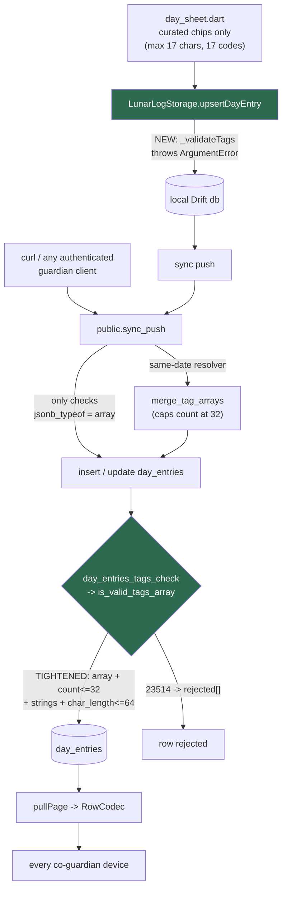
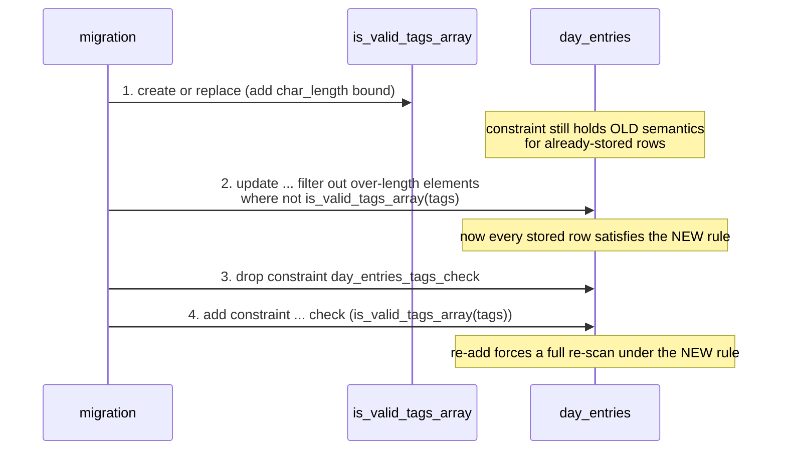

# Bound day-entry tag element length server-side and mirror it client-side - Plan

**Target repo:** `lunarlog` (`wjdavis5/lunarlog`), branch `issue-94`. All paths
below are repo-relative.

---

## Goal Capsule

- **Objective:** Close issue #94. Day-entry `tags` elements have no length
  bound anywhere. `public.is_valid_tags_array(jsonb)` validates only that the
  value is an array of at most 32 *strings* — a single element may be
  arbitrarily large. Any authenticated guardian can therefore push a row with
  32 multi-megabyte tags via `sync_push`, have it persisted and versioned,
  and have it replicated to every co-guardian's device on the next pull.
- **Means:** One migration that adds a per-element `char_length <= 64` bound
  to `is_valid_tags_array`, pre-cleans any existing offending rows, and
  drops-and-re-adds `day_entries_tags_check` so the tightened predicate is
  actually re-validated against stored data. Then mirror the constant in
  `lib/domain/limits.dart` and enforce it in `LunarLogStorage.upsertDayEntry`
  so a local write fails fast instead of creating a row the server will
  reject forever.
- **Authority hierarchy:** Issue #94's suggested fix sets the shape; this
  document's Key Technical Decisions own the details it left open (bound
  value, pre-clean policy, whether `sync_push` itself is re-emitted).
  `AGENTS.md`'s "Migration Flow" rules — especially migration-filename
  ordering and never editing an already-merged migration in place — outrank
  convenience.
- **Stop conditions:** Do not edit `supabase/migrations/20260903170000_tags_string_array_check.sql`
  in place; it is merged. Do not re-emit the ~400-line `sync_push` body
  (KTD4). Do not add a bound so tight it could reject a curated taxonomy
  code (longest is `breast_tenderness`, 17 characters).
- **Execution profile:** `code`; small surface, but it touches a persisted
  data CHECK on a minors'-health-data table, so the migration's pre-clean and
  re-validation ordering is the part that must be exactly right.

---

## Problem Frame

`supabase/migrations/20260903170000_tags_string_array_check.sql` defines:

```
jsonb_array_length(p_tags) <= 32
and not exists (select 1 from jsonb_array_elements(p_tags) elem
                where jsonb_typeof(elem) <> 'string')
```

Count is bounded. Element *content* is not. Every other free-text column on
this schema is bounded server-side (`note` <= 2000, `tz` <= 64,
`display_name` <= 80, all via table CHECKs), so `tags` is the lone
unbounded free-text surface.

Three facts make this reachable rather than theoretical:

1. **The server is the trust boundary.** `sync_push` is granted to
   `authenticated`; an accepted guardian of a profile can push arbitrary
   day-entry rows with nothing but the publishable key and `curl`.
2. **The pull path has no payload-size guard.** `SupabaseSyncTransport.pullPage`
   (`lib/data/sync/supabase_sync_transport.dart`) selects whole rows, and
   `RowCodec`'s `tags` decode (`lib/data/sync/row_codec.dart`) accepts strings
   of any length. An oversized row lands on every co-guardian device.
3. **The client writes `tags` unvalidated.** `LunarLogStorage.upsertDayEntry`
   (`lib/data/db/storage.dart:251-264`) calls `_validateLocalDate` and
   `_validateNote`; `tags` passes straight through to the Drift insert.

The official app is unaffected by accident, not by design: `lib/ui/logging/day_sheet.dart`
renders one-tap chips built from the closed `kTagTaxonomy` in
`lib/domain/tags.dart` (17 codes, longest 17 characters) and offers no
free-form tag entry at all, and `DriftDayEntriesRepository`
(`lib/data/repositories/drift_day_entries_repository.dart:20`) calls
`validateTagCodes` one layer above storage. But both of those sit *above*
`LunarLogStorage`, and neither runs on the remote-apply path
(`lib/data/db/storage.dart:790-830`, `:895-925`), which writes pulled rows
straight through. So the taxonomy check is a UI-path guarantee, not a storage
invariant — which is exactly why the new bound belongs in storage itself and,
above all, in the server CHECK. That layering is why this has never surfaced in
normal use, and why the fix carries essentially zero risk to real user data.

**Discovered while planning (see KTD4):** the in-RPC `is_valid_tags_array`
call that issue #40 added to `sync_push` no longer exists. `sync_push` has
been re-emitted twice since — `20260904020000_sync_push_and_invitations.sql`
and `20260906200000_same_date_tag_merge.sql` — and the current body checks
only `jsonb_typeof(v_tags) <> 'array'`. The string-only and count bounds
survive solely because the table CHECK `day_entries_tags_check` (added in
`20260903014208_initial_sync_schema.sql`, redefined in `20260903170000`) still
fires on INSERT/UPDATE and its `23514` is swallowed by `sync_push`'s per-row
`exception when others` handler into the `rejected` array. The outcome is
identical (the row is rejected); only the specificity of the error is lost.
This means **the table CHECK is the whole enforcement mechanism**, which is
exactly what this plan tightens — and it is why the plan does not need to
touch `sync_push` at all.

---

## Requirements

- **R1.** `public.is_valid_tags_array(p_tags jsonb)` returns `false` for any
  array containing an element longer than the bound, in addition to its
  existing array-ness, count (<= 32), and string-only checks.
- **R2.** The bound is **64 characters**, measured with `char_length` (code
  points), giving ~3.7x headroom over the longest curated code.
- **R3.** `day_entries_tags_check` is re-validated against already-stored rows
  — replacing the function body alone does not re-check existing data, so the
  constraint must be dropped and re-added.
- **R4.** Any pre-existing row whose `tags` violates the tightened predicate is
  cleaned *before* the constraint is re-added, so the migration cannot fail on
  an upgrade. None are known to exist.
- **R5.** A write carrying an oversized tag is rejected at the API trust
  boundary — `sync_push` returns it in `rejected` rather than persisting it —
  and a direct PostgREST insert/update raises `23514`.
- **R6.** The bound is mirrored as a named constant in `lib/domain/limits.dart`
  alongside `kMaxNoteLength` / `kMaxDisplayNameLength`, documented as mirroring
  the server CHECK.
- **R7.** `LunarLogStorage.upsertDayEntry` throws `ArgumentError` for an
  over-length tag *before* writing anything locally, matching `_validateNote`'s
  fail-fast contract, so the client cannot create a permanently-rejected row.
- **R8.** The pgTAP suite proves R1/R5 — both the validator in isolation and
  the CHECK constraint on a direct insert — and `flutter test` proves R7.
- **R9.** The curated taxonomy keeps working end to end: every code in
  `kTagTaxonomy` passes both the server predicate and the client validator.
- **R10.** `AGENTS.md`'s schema paragraph describes the new migration, per this
  repo's convention that every migration is documented there, and its existing
  claim that the tags rule is "enforced both at the table and inside `sync_push`"
  is corrected — that has been false since `20260904020000`.

---

## Key Technical Decisions

- **KTD1 — 64 characters, via `char_length`, not `octet_length`.** The
  curated codes are snake_case ASCII, longest `breast_tenderness` at 17. 64
  leaves room for future codes and for a non-English locale's codes without
  being generous enough to matter: worst case per row becomes 32 x 64 = 2048
  characters, comparable to `note`'s existing 2000 bound, so `tags` stops
  being the outlier. 64 is also already this schema's short-string bound —
  `day_entries_tz_length_check` is `char_length(tz) <= 64` — so the fix adds no
  new magic number. `char_length` counts code points, matching how every
  sibling CHECK in `20260903014208_initial_sync_schema.sql` measures
  (`display_name` 80, `tz` 64, `note` 2000, settings `key` 128 / `value` 4000 —
  all `char_length`), and keeping the client mirror conservative — Dart's
  `String.length` counts UTF-16 code units, which is never *fewer* than code
  points, exactly the reasoning already written into `lib/domain/limits.dart`'s
  header comment.

- **KTD2 — replace the function, then pre-clean, then drop-and-re-add the
  constraint, in that order.** Postgres does **not** re-validate an existing
  CHECK constraint when a function it calls is redefined with `create or
  replace`, so tightening the predicate alone would leave stored violations in
  place and only bind future writes. Dropping and re-adding the constraint
  forces a full re-scan. The pre-clean must sit between the two: it has to run
  *after* the function is replaced (so `where not is_valid_tags_array(tags)`
  selects rows by the *new* rule) and *before* the constraint is re-added (so
  the re-add cannot fail). This is precisely the sequence issue #40's
  migration used, and copying it keeps the two migrations legible side by side.

- **KTD3 — the pre-clean drops offending elements rather than truncating
  them.** Issue #40's migration filtered out non-string elements and kept the
  valid remainder. The analogue here is filtering out over-length elements and
  keeping the rest. Truncating to 64 would manufacture a tag code that matches
  nothing in `kTagTaxonomy` and would render in the UI as raw text via
  `day_sheet.dart`'s `tagByCode(code)?.display ?? code` fallback. An
  over-length tag is not a real tag — it is payload — so dropping it is both
  safer and more honest. No such rows are known to exist, so this branch is
  expected to be a no-op in practice; it exists so the migration is
  unconditionally safe to apply.

- **KTD4 — `sync_push` is NOT re-emitted.** The table CHECK is the actual
  enforcement point (see Problem Frame) and it fires on *every* write path,
  including the same-date resolver's `update ... set tags = merge_tag_arrays(...)`.
  Re-emitting `sync_push` solely to restore the explicit
  `is_valid_tags_array` guard would mean copying ~400 lines of a function that
  has been revised four times, for a strictly cosmetic gain: a specific error
  message instead of a generic one, on a path where `sync_push` swallows the
  message anyway and returns only `{"id": ..., "rejected": true}`. The
  copy-drift risk is real and the benefit is zero. Restoring the in-RPC guard
  is filed under Deferred to Follow-Up Work.

- **KTD5 — `merge_tag_arrays` needs no change.** `public.merge_tag_arrays(a, b)`
  (`20260906200000_same_date_tag_merge.sql`) takes the deduplicated sorted
  union of two tag arrays and caps the result at 32. It passes elements
  through unchanged, so once both inputs satisfy the tightened predicate the
  union does too, and the surviving row's `update` is CHECK-guarded regardless.
  The migration's pre-clean guarantees the "both inputs are already valid"
  precondition holds from the moment the constraint is re-added.

- **KTD6 — `row_codec.dart` is deliberately left alone.** Issue #94 lists the
  `tags` decode as a location. `RowCodec.tags`
  (`lib/data/sync/row_codec.dart:374-383`) is type-only: it checks the value is
  a `List` and every element a `String`, and validates neither element length,
  element membership in the taxonomy, nor even the 32-element count. Tightening
  it would be wrong: it would make a device unable to decode a row the server has
  accepted and stored, converting a server-side data issue into a client-side
  sync stall for the whole page. With the server bound in place, every pulled row
  is bounded by construction. Validation belongs at the write boundary (server
  CHECK plus client pre-write), not the read boundary.

- **KTD7 — the count bound (32) is mirrored client-side too, alongside the
  length bound.** Issue #94 asks only for the length constant, but the stated
  goal of the client mirror is "local writes fail fast instead of producing a
  permanently rejected row", and an over-*count* tags list produces exactly the
  same permanently-rejected row through exactly the same CHECK. The repo already
  mirrors this cap once — `test/data/conflict_rules_test.dart:102-109`
  (`caps at 32 tags matching day_entries_tags_check`) pins it on the conflict-merge
  path — so a named `kMaxTagCount` also gives that existing hardcoded 32 a home,
  rather than introducing a new convention. Both bounds are one line each in the
  same `_validateTags` helper and one extra expectation in the same test.
  Mirroring only half the constraint would leave the fail-fast contract
  half-delivered. This is the one deliberate widening beyond the issue's literal
  text — cut it if a reviewer prefers strict issue scope; the length bound stands
  alone without it.

---

## High-Level Technical Design

Where the bound is enforced, before and after:



The two green nodes are the only enforcement points this plan adds. The
client check is a fail-fast convenience; the CHECK constraint is the trust
boundary, and it is the single choke point every write path funnels through.

Migration ordering (KTD2), which is the part that is easy to get wrong:



---

## Implementation Units

### U1. Tighten `is_valid_tags_array` with a per-element length bound

**Goal:** Bound tag element length at the server trust boundary, safely
re-validating existing data. (R1, R2, R3, R4, R5, R8)

**Dependencies:** none.

**Files:**
- `supabase/migrations/20260907010000_tags_element_length_check.sql` (create)
- `supabase/tests/sync_push_test.sql` (modify)

**Approach:**

1. **Filename.** `20260907010000_tags_element_length_check.sql`. Scaffold with
   `npx supabase@2.116.0 migration new tags_element_length_check`
   (`AGENTS.md:41`), then rename if the generated timestamp does not sort after
   `main`'s tip: per `AGENTS.md` "Migration Flow" rule 7 a migration must sort
   *after* everything already on `main`, and the current tip is
   `20260906240000_account_deletion_notifications.sql`, so a `20260907` prefix
   is correct. Do not edit `20260903170000_tags_string_array_check.sql` — it is
   merged.
2. **Header comment** naming issue #94 and pointing at
   `20260903170000_tags_string_array_check.sql` as the predecessor, matching
   the house style of every other migration in this directory.
3. **`create or replace function public.is_valid_tags_array(p_tags jsonb)`** —
   keep the existing signature, `language sql`, `immutable`, `parallel safe`,
   and the existing array-ness / count / string-only clauses verbatim. Extend
   the `not exists` predicate so an element fails when it is not a string **or**
   its text form exceeds 64 characters. Extract the element's text with
   `elem #>> '{}'` (the correct idiom for a jsonb scalar; `->> 0` does not
   work here) and measure with `char_length`.
4. **Refresh the `comment on function`** to state the new rule and cite both
   issue #40 and issue #94.
5. **Pre-clean**, mirroring the shape of the #40 migration's `update`: for each
   row where `not public.is_valid_tags_array(tags)`, rebuild `tags` as the
   `jsonb_agg` (ordered by `with ordinality`, so surviving order is stable) of
   only those elements that are strings *and* within the bound, coalescing to
   `'[]'::jsonb`. Must come after step 3 and before step 6 — see KTD2.
6. **`alter table public.day_entries drop constraint if exists day_entries_tags_check,
   add constraint day_entries_tags_check check (public.is_valid_tags_array(tags));`**
   — the drop-and-re-add is what forces re-validation.

Do not touch `sync_push` (KTD4) or `merge_tag_arrays` (KTD5).

**Patterns to follow:** `supabase/migrations/20260903170000_tags_string_array_check.sql`
is the direct template for steps 3, 5, and 6 — same function, same pre-clean
idiom, same drop-and-re-add. Bound-check style matches
`day_entries_note_length_check` in `20260903014208_initial_sync_schema.sql`.

**Test scenarios** (append to the existing "tags string-only validation
(Issue #40)" block at `supabase/tests/sync_push_test.sql:412-440`, and **bump
`plan(105)` at line 4 by the number of assertions added** — a mismatched plan
count fails the whole file):

- `is_valid_tags_array` returns `false` for a 65-character single-element
  array, without raising.
- `is_valid_tags_array` returns `true` for a 64-character single-element array
  (boundary is inclusive).
- `is_valid_tags_array` returns `true` for a 32-element array of 64-character
  strings (count and length bounds compose, worst legal case).
- `is_valid_tags_array` still returns `false` for `'1'::jsonb`, `[1, 2]`, and a
  33-element array — the pre-existing behavior is unchanged.
- `is_valid_tags_array` returns `true` for the full curated taxonomy as a
  jsonb array (R9 — the real vocabulary is comfortably inside the bound).
- `sync_push` with a batch of three day entries — one carrying a 65-character
  tag, one carrying `["ok", <65 chars>]`, one carrying valid tags — returns
  `jsonb_array_length(resp -> 'rejected') = 2`, and the valid row's id is
  present in `public.day_entries` with count 1. Mirrors the existing
  `bad_tags` assertion's exact shape.
- `throws_ok` with SQLSTATE `23514` on a direct
  `insert into public.day_entries (... tags ...)` carrying a 65-character tag,
  proving the table CHECK is the enforcement point independent of `sync_push`
  (mirrors the existing `day_entries_tags_check rejects non-string tags`
  assertion).
- The pre-clean is exercised implicitly by `db reset --local` applying the
  migration against a database with no offending rows; no separate fixture is
  needed, since the CHECK makes it impossible to *create* an offending row
  through any granted path once the migration has run.

**Verification:** `supabase test db --local` passes with the bumped plan count;
`supabase db reset --local` applies the new migration cleanly from scratch.

---

### U2. Mirror the bound client-side and fail fast in `upsertDayEntry`

**Goal:** A local write carrying an out-of-bounds tag throws before anything is
persisted, so the client can never manufacture a permanently-rejected row.
(R6, R7, R8, R9, KTD7)

**Dependencies:** U1 (the constant must match the shipped CHECK; the code is
independently compilable, but the numbers are only meaningful together).

**Files:**
- `lib/domain/limits.dart` (modify)
- `lib/data/db/storage.dart` (modify)
- `test/data/db_test.dart` (modify)

**Approach:**

1. **`lib/domain/limits.dart`** — add `kMaxTagLength = 64` and (KTD7)
   `kMaxTagCount = 32`, each with a doc comment naming the mirrored server
   rule. The file's existing header comment cites
   `20260903014208_initial_sync_schema.sql` as the source of the mirrored
   CHECKs; extend it to also cite
   `supabase/migrations/20260907010000_tags_element_length_check.sql`, since
   the tag bounds live in `is_valid_tags_array`, not a table-level CHECK. The
   header's existing note that `String.length` (UTF-16 code units) is a
   conservative proxy for the server's `char_length` (code points) already
   covers the new constants correctly — no change needed there.
2. **`lib/data/db/storage.dart`** — add a file-private `_validateTags(List<String> tags)`
   next to `_validateNote` (currently `storage.dart:88-93`). Throw
   `ArgumentError.value` when the list length exceeds `kMaxTagCount`, and when
   any element's `length` exceeds `kMaxTagLength`. Match `_validateNote`'s
   existing convention exactly: pass the offending *length* as the value (not
   the string itself — a multi-megabyte tag must never end up in an exception
   message), a stable name, and a `'must be at most N characters'` message.
3. Call `_validateTags(tags)` in `upsertDayEntry` immediately after the
   existing `_validateNote(note)` at `storage.dart:263`, i.e. **outside and
   before** the `db.transaction(...)`, so nothing is written on the failure
   path. The method is already `async`, so the throw surfaces as a failed
   future rather than a synchronous throw — the behavior its doc comment
   already promises.
4. Extend `upsertDayEntry`'s doc comment (`storage.dart:249-250`), which
   currently reads "Throws [ArgumentError] for a [note] over [kMaxNoteLength]",
   to also name the tag bounds.

**Patterns to follow:** `_validateNote` / `_validateDisplayName` at
`lib/data/db/storage.dart:81-93` — signature shape, `ArgumentError.value`
usage, and the length-not-content argument. `upsertProfile`'s doc-comment
phrasing for stating the throw contract.

**Test scenarios** (extend `test/data/db_test.dart`'s `storage` group; the
existing `payload limits: an 81-character display_name and a 2001-character
note are rejected before anything is written` test at ~line 481 is the direct
template and the natural home for the first four):

- `upsertDayEntry` with a single 65-character tag rejects with
  `throwsArgumentError`, and `getDayEntries(profileId: ...)` is still empty
  afterwards — nothing was written.
- `upsertDayEntry` with a 64-character tag succeeds, and the stored entry's
  `tags` round-trips that exact value (boundary is inclusive, and the value is
  persisted intact).
- `upsertDayEntry` with 33 tags rejects with `throwsArgumentError` and writes
  nothing (KTD7); 32 tags succeeds.
- Updating an *existing* live entry with an over-length tag rejects and leaves
  the previously stored entry untouched — `tags`, `note`, and `updatedAt` all
  unchanged, and `localRev` not bumped. This is the path most likely to regress
  if the validation call is placed inside the transaction instead of before it.
- `upsertDayEntry` with `tags: const []` and with the default (omitted)
  argument both still succeed — the empty case is not accidentally rejected.
- Every code in `kTagTaxonomy` passes `_validateTags` via a real
  `upsertDayEntry` writing the whole taxonomy at once (17 codes, all short) —
  R9, and a regression guard should a future code ever be added that breaches
  the bound.

**Verification:** `flutter analyze` clean; `flutter test test/data/db_test.dart`
passes; `dart run tool/quality_gate.dart` stays green (the new branches are
small and directly covered, so neither the 90% line floor nor the CRAP gate
should move).

---

### U3. Document the new migration and correct a stale claim in `AGENTS.md`

**Goal:** Keep `AGENTS.md`'s schema narrative accurate — this repo documents
every migration there, and it currently asserts something about tags
enforcement that stopped being true three migrations ago. (R10)

**Dependencies:** U1.

**Files:**
- `AGENTS.md` (modify)

**Approach:** Two edits, both inside the `**Schema (supabase/migrations/)**`
bullet at `AGENTS.md:24`.

1. **Correct the stale claim.** The sentence describing
   `20260903170000_tags_string_array_check.sql` currently says the tags rule is
   "enforced both at the table and inside `sync_push`". The second half has been
   false since `20260904020000_sync_push_and_invitations.sql` re-emitted
   `sync_push` without the `is_valid_tags_array` call (see Problem Frame).
   Rewrite it to say enforcement is at the table CHECK, and note that the in-RPC
   guard was dropped when `sync_push` was re-emitted by `20260904020000` and
   `20260906200000` — following the file's established convention of recording
   *why* a thing is the way it is, not just what it is. This correction matters
   beyond tidiness: the stale sentence is precisely what would lead a future
   reader to believe tags were already doubly guarded.
2. **Append the new migration's sentence** after the existing
   `20260906240000_account_deletion_notifications.sql` sentence: issue #94, the
   64-character per-element bound on `is_valid_tags_array`, and the pre-clean
   plus drop-and-re-add of `day_entries_tags_check` (because replacing the
   function alone does not re-validate stored rows). Match the surrounding prose
   density and the convention of citing issue numbers inline.

**Test expectation:** none — documentation only.

**Verification:** the corrected sentence no longer claims in-RPC enforcement;
the new sentence names the correct filename, issue number, and bound; both read
consistently with the adjacent migration descriptions.

---

## Verification

Run all commands from the repo root (this worktree, on branch `issue-94`).

**Dart / client (U2):**

```bash
flutter analyze
flutter test test/data/db_test.dart
flutter test
dart run tool/quality_gate.dart
```

Expect: analyzer clean, all tests green, quality gate green (90% line-coverage
floor + per-method CRAP gate).

**Postgres / server (U1) —** per `AGENTS.md` "Migration Flow" step 2:

```bash
npx supabase@2.116.0 start -x realtime,storage-api,imgproxy,mailpit,studio,edge-runtime,logflare,vector,supavisor
npx supabase@2.116.0 db reset --local
npx supabase@2.116.0 test db --local
```

Expect: `db reset` applies `20260907010000_tags_element_length_check.sql`
without error (proves the pre-clean and the constraint re-add are ordered
correctly), and `test db --local` reports the full pgTAP suite passing with
`sync_push_test.sql`'s bumped plan count matching its assertion count.

**Direct proof the bound is enforced (R5)** — the issue's own repro, inverted
into an assertion. With the local stack running:

```bash
npx supabase@2.116.0 db query --local "
  select public.is_valid_tags_array(jsonb_build_array(repeat('x', 64))) as at_64,
         public.is_valid_tags_array(jsonb_build_array(repeat('x', 65))) as at_65;"
```

Expect exactly `at_64 = t`, `at_65 = f`.

```bash
npx supabase@2.116.0 db query --local "
  insert into public.day_entries (id, user_id, profile_id, local_date, tz, flow, tags, updated_at)
  values ('01J0000000000000000000TAG1', (select id from auth.users limit 1),
          (select id from public.profiles limit 1), '2026-09-05', 'UTC', 'none',
          jsonb_build_array(repeat('x', 65)), now());"
```

Expect failure with SQLSTATE `23514`, `day_entries_tags_check`. Before this
plan's migration, the same statement succeeds — that contrast is the proof
the fix works.

**Pre-migration sanity (R4)** — confirm the pre-clean has nothing to do on this
database, so the migration's data-touching branch is a verified no-op rather
than an assumption:

```bash
npx supabase@2.116.0 db query --local "
  select count(*) from public.day_entries d
   where exists (select 1 from jsonb_array_elements(d.tags) e
                  where char_length(e #>> '{}') > 64);"
```

Expect `0`.

**CI:** `.github/workflows/ci.yml` runs `flutter analyze`, `flutter test`,
`dart run tool/quality_gate.dart`, and `supabase test db --local` (line 199) —
all four must be green on the PR.

---

## Definition of Done

- New migration exists, is named to sort after `main`'s tip, and applies
  cleanly on a `db reset --local` from scratch.
- `is_valid_tags_array` rejects a 65-character element and accepts a
  64-character one; `day_entries_tags_check` has been dropped and re-added so
  stored rows were re-validated.
- `sync_push` returns an oversized-tag row in `rejected` rather than persisting
  it; a direct insert raises `23514`.
- `kMaxTagLength` (and `kMaxTagCount`) exist in `lib/domain/limits.dart` and
  match the migration's numbers exactly.
- `upsertDayEntry` throws `ArgumentError` for an out-of-bounds tag list and
  writes nothing, on both the insert and the update path.
- Every curated `kTagTaxonomy` code still round-trips through both the client
  validator and the server predicate.
- pgTAP plan count in `sync_push_test.sql` matches its assertion count.
- `AGENTS.md` describes the new migration and no longer claims tags are
  enforced inside `sync_push`.
- `flutter analyze`, `flutter test`, `dart run tool/quality_gate.dart`, and
  `supabase test db --local` all pass.

---

## Scope Boundaries

**In scope:** the server-side element-length bound, its migration and pgTAP
proof, the client-side mirror and its Dart tests, and the `AGENTS.md` entry.

### Deferred to Follow-Up Work

- **Restore the explicit `is_valid_tags_array` call inside `sync_push`.** It
  was silently lost across two `sync_push` re-emissions (see Problem Frame and
  KTD4). Behaviorally redundant with the table CHECK today, so this is a
  legibility and defence-in-depth fix, not a security one. It needs its own
  issue because it requires re-emitting the whole ~400-line function.
- **A response-size or row-size guard on the pull path**
  (`SupabaseSyncTransport.pullPage`). With `note` <= 2000 and `tags` now
  <= 2048 characters, a single day-entry row is bounded to a few KB, so the
  amplification vector issue #94 describes is closed by the bound alone. A
  general page-size guard is a broader hardening question.
- **An audit for other unbounded jsonb columns** on this schema, using the
  same "is every free-text surface bounded server-side?" lens that found this.

### Non-Goals

- No change to `lib/data/sync/row_codec.dart` (KTD6).
- No change to `sync_push` or `merge_tag_arrays` (KTD4, KTD5).
- No change to the curated taxonomy in `lib/domain/tags.dart` or to the
  chip-based tag UI in `lib/ui/logging/day_sheet.dart` — neither can produce
  an out-of-bounds tag.
- No new free-form tag entry surface. If one is ever added, `_validateTags`
  plus a `maxLength` on the field (as `day_sheet.dart` already does for `note`
  with `kMaxNoteLength`) is the pattern to follow.

---

## Risks

- **The constraint re-add fails on a real database with offending rows.**
  Mitigated by the pre-clean (KTD2/KTD3) and verified by the pre-migration
  sanity query above. Expected count is zero, since no granted write path
  could ever have created such a row through the app.
- **The pre-clean and the function replacement get ordered wrongly**, leaving
  stored violations un-caught or making the migration fail. This is the single
  highest-risk detail in the plan; the sequence diagram above and the #40
  migration template exist to pin it down.
- **Client and server bounds drift apart** later. Mitigated by
  `lib/domain/limits.dart`'s header comment citing the owning migration by
  filename, matching how `kMaxNoteLength` is already anchored.
- **`supabase-migrate.yml` has never successfully pushed** to the linked
  project — `AGENTS.md:47` records that every run has failed at "Check deploy
  credentials" on an unset `SUPABASE_ACCESS_TOKEN`. This migration will
  therefore sit unapplied in production alongside the existing backlog until
  that credential gap is fixed. Out of scope here, but it means "merged" does
  not yet mean "enforced in production" for this fix.

---

## Sources

- GitHub issue #94, `wjdavis5/lunarlog` (P2, `review:data`, found at commit
  `4c35cab`).
- `supabase/migrations/20260903170000_tags_string_array_check.sql` — the
  predecessor migration (issue #40) this one extends.
- `supabase/migrations/20260906200000_same_date_tag_merge.sql` — the current
  `sync_push` and `merge_tag_arrays` definitions.
- `AGENTS.md` — "Migration Flow" (filename ordering, local pgTAP run,
  never-edit-a-merged-migration) and "Quality gates".
- `.github/workflows/ci.yml:128-199` — the exact CI verification commands.
