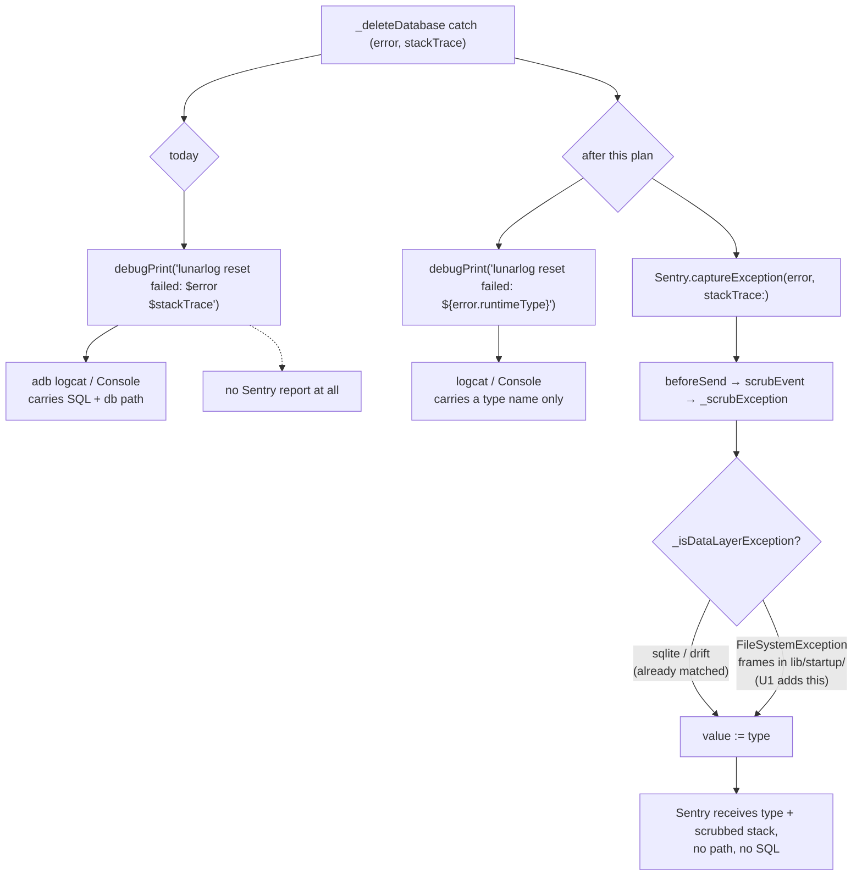

# fix: restore the type-only log discipline in `resetDevice`'s delete step

**Issue:** [#97](https://github.com/wjdavis5/lunarlog/issues/97) — *Observability: resetDevice logs the raw error and stack trace, breaking the type-only log discipline* (P3, `review:observability`).

---

## Goal Capsule

`LunarLogRootState._deleteDatabase` is the one place in `lib/` that stringifies a raw exception and its stack trace into a log line. Every other error path logs `error.runtimeType` only. Restore the discipline at that call site, add the Sentry capture the sibling `_openDatabase` path already has, and — the part the issue does not anticipate — extend the Sentry scrubber first, so the new capture cannot ship the database file path it would otherwise carry.

---

## Problem Frame

`resetDevice()` (`lib/app_lifecycle.dart`, `LunarLogRootState.resetDevice`) delegates its destructive step to `_deleteDatabase`, which wraps `db.wipeAllData()` (web), `db.close()`, and `widget.deleteLocalDatabase()` (native). Its catch branch does:

```
debugPrint('lunarlog reset failed: $error\n$stackTrace');
```

Three things are wrong with that line, in increasing order of consequence.

**1. It breaks a discipline the project treats as absolute.** All 30-odd `debugPrint` call sites across `lib/` log `${error.runtimeType}` (or a closed enum like `error.code.name`). This is the only exception. The sibling handler in the same class states the rule in a comment:

> `// U7 (KTD12): the message can embed a database path or SQL; log the type only and let Sentry (a no-op without a DSN) keep the scrubbed exception and stack.`

The immediately following handler in the same method chain, `_signOutLocally`, obeys it. `_deleteDatabase`, sitting between them, does not.

**2. The failure is under-reported.** Unlike `_openDatabase`, this path has no `Sentry.captureException`. A reset that fails closed — the user is staring at the fail-closed screen with a half-reset install — produces no crash report at all. It is simultaneously over-logged locally and invisible remotely.

**3. `debugPrint` output is not private.** It reaches `adb logcat` and the macOS/iOS Console on release builds. The exceptions this branch actually catches (`SqliteException`, drift wrappers, `FileSystemException`) routinely interpolate SQL statements, bound arguments, and absolute file paths into their messages.

### What the issue gets wrong, and why it matters

The issue was filed against commit `4c35cab`; two of its details have since drifted, and one of its assumptions is false.

- The helper is now `_deleteDatabase`, not `_deleteDatabaseAndKey`, and the `deleteDbKey()` step is gone — SQLCipher was removed in `e7c787c`. Line numbers in the issue (L880/L731) no longer point at the right code.
- **The issue's safety argument does not hold.** It reasons that adding `Sentry.captureException` here is safe because "the scrubber already reduces data-layer exception values to the type name". That reduction is real (`_scrubException` in `lib/observability/scrub.dart` sets `value: reduce ? exception.type : exception.value`), but it is gated on `_isDataLayerException`, which matches only:
  - a type name containing one of `sentryDataLayerTypeMarkers` (`sqlite`, `drift`, `postgrest`, `auth`, `gotrue`, `supabase`, `rowcodec`, `synctransport`, `database`, `encryption`, `googlesignin`), or
  - a stack frame / module pointing into `_dataLayerPathMarkers` (`lib/data/`, `lunarlog/data/`).

  `widget.deleteLocalDatabase()` resolves to `deleteLocalDatabase()` in `lib/startup/startup_native.dart`, which calls `File.delete()` and `getApplicationDocumentsDirectory()`. Those throw `FileSystemException`, `PathNotFoundException`, `PathAccessException`, or `MissingPlatformDirectoryException` — **no marker matches those type names, and the frames point into `lib/startup/` and `dart:io`, not `lib/data/`.** `FileSystemException.toString()` embeds the full path (`Deletion failed, path = '/var/mobile/.../lunarlog.db'`). KTD12's own canonical wording scopes the reduction to "every exception thrown from `lib/data`" — so this is a gap in the floor, not a bug in the scrubber's implementation of it.

  Adding the Sentry capture without closing that gap would **replace a local log leak with a remote one**, which is strictly worse. The scrubber change is therefore a precondition of the capture, not scope creep.

- Two places in the repo cite the old log line verbatim as a worked example and go stale when it changes:
  - `lib/observability/sentry_bootstrap.dart` — the comment justifying `enablePrintBreadcrumbs = false` uses this exact `debugPrint` as its concrete example of a value-based leak the breadcrumb scrubber cannot catch.
  - `test/observability/breadcrumbs_test.dart` — a test fixture is shaped like the console breadcrumb `DebugPrintIntegration` would build from this line.

### Current coverage

`test/ui/device_reset_test.dart` exercises the reset ordering thoroughly (five `testWidgets`, a `ResetHarness` with recording database / engine / auth / file primitives) but **never injects a throwing `deleteLocalDatabase` or `db.close()`**. `_deleteDatabase`'s catch branch — the fail-closed path this issue is about — has no test at all. Repo-wide, no test asserts `debugPrint` content, and no test asserts `Sentry.captureException` fires.

---

## Requirements

- **R1.** `_deleteDatabase`'s failure log records the exception type only — never the exception message, never the stack trace.
- **R2.** A `_deleteDatabase` failure is reported to Sentry with its exception and stack trace, matching `_openDatabase`'s shape.
- **R3.** Before R2 lands, the scrubber reduces the exception values that this specific catch branch can see — including filesystem and platform-directory failures originating in `lib/startup/` — to their type names.
- **R4.** The scrubber change does not widen reduction to unrelated exceptions; non-data, non-startup exceptions keep their `value` so ordinary crashes stay diagnosable.
- **R5.** The fail-closed behaviour is unchanged: a failed delete still records `_error`, still skips sign-out and reopen, and still shows the fail-closed screen.
- **R6.** Repo references that quote the old log line are updated so no comment or fixture cites a call site that no longer behaves that way.

---

## Key Technical Decisions

**KTD1. Close the scrubber gap before adding the Sentry capture, and treat the two as one atomic change.**
The capture is only safe once filesystem exceptions reduce. Sequencing U1 before U2 means the repo is never in a state where a reset failure ships a database path to Sentry. Advances R3; governs U1, U2.

**KTD2. Close the gap by frame path *and* type name, not either alone.**
Adding `lib/startup/` to the path markers is the principled fix — it catches anything escaping the reset/startup primitives whatever its type. But Flutter release builds with obfuscated or stripped symbols can produce frames without usable file paths, and `--split-debug-info` symbolication happens server-side, after `beforeSend` has already run on-device. Type-name markers are the belt to the path marker's braces. Both are cheap constant-list edits. Advances R3.

**KTD3. Do not touch `enablePrintBreadcrumbs`.**
It stays pinned `false`. Its comment's *concrete example* becomes stale, but its *general* argument — that `DebugPrintIntegration` turns arbitrary printed values into `Breadcrumb.console` messages that only a word-scan guards — survives this fix intact, and third-party/plugin `debugPrint` calls are still outside our control. Flipping it belongs to issue #19, which owns inspecting a real payload first. U3 updates the example, not the setting. Advances R6.

**KTD4. Assert the log discipline by overriding `debugPrint`; do not add a Sentry hub seam.**
`debugPrint` is a reassignable global in `flutter/foundation`, so capturing it in a test is a few lines and gives R1 a direct, honest assertion. Asserting R2 would require binding a global Sentry hub — a seam the repo has never had, and which `_openDatabase`'s existing (also unasserted) capture does not have either. Introducing global-hub binding for a P3 fix would be disproportionate and would risk cross-test leakage of a process-global hub. R2 is verified by code review against the `_openDatabase` precedent plus the scrubber unit tests from U1, which prove the payload is safe once it arrives. Advances R1; deferred seam noted in Open Questions.

**KTD5. `_deleteDatabase` keeps its `bool` return and fail-closed contract untouched.**
This is an observability fix. The control flow (`if (!deleted) return;` in `resetDevice`), the `_error` assignment, and the `setState` all stay exactly as they are. Advances R5.

---

## High-Level Technical Design

Reset failure, before and after:



The load-bearing edge is `K → L` via the U1 branch. Without U1, a `FileSystemException` falls through `_isDataLayerException` unmatched and its `value` — containing the database file path — is transmitted verbatim.

---

## Implementation Units

### U1. Extend the scrubber so reset-path filesystem failures reduce to their type name

**Goal:** Close the KTD12 gap for exceptions thrown out of `lib/startup/`, so the U2 capture cannot leak a database path.

**Requirements:** R3, R4.

**Dependencies:** none. Must land before U2 (KTD1).

**Files:**
- `lib/observability/scrub.dart` — modify
- `test/observability/scrub_test.dart` — modify

**Approach:**
1. Add filesystem and platform-directory type fragments to `sentryDataLayerTypeMarkers`: `filesystem`, `pathnotfound`, `pathaccess`, `pathexists`, `platformdirectory`. These cover `FileSystemException`, the three `dart:io` path subclasses, and `path_provider`'s `MissingPlatformDirectoryException`. Keep the list alphabetically ungrouped as it is today; append with a short comment naming the reset path as the reason.
2. Add `lib/startup/` and `lunarlog/startup/` to `_dataLayerPathMarkers`.
3. `_dataLayerPathMarkers` and `sentryDataLayerTypeMarkers` are now slightly misnamed — they cover "exceptions whose messages embed storage material", which includes the startup/reset primitives as well as `lib/data`. Update the doc comments on both constants to say so. Do **not** rename the public `sentryDataLayerTypeMarkers` symbol; it is referenced by tests and the rename is churn with no reader benefit.
4. `_isDataLayerException` itself needs no logic change — it already ORs type markers against path markers.

**Patterns to follow:** the existing marker-list comments in `lib/observability/scrub.dart` (the `googlesignin` entry is the precedent for "this specific type is here because its message carries X").

**Test scenarios** (`test/observability/scrub_test.dart`, extending the existing `scrubEvent` group; mirror the existing `_dataLayerStack()` helper for frame construction):
- A `SentryException` with `type: 'FileSystemException'` and `value: "Deletion failed, path = '/var/mobile/Containers/Data/Application/ABC/Documents/lunarlog.db' (OS Error: Permission denied, errno = 13)"` comes back with `value == 'FileSystemException'`, and the returned value contains neither `lunarlog.db` nor `/var/mobile`.
- A `SentryException` with `type: 'PathNotFoundException'` and a path-bearing value reduces to its type.
- A `SentryException` with `type: 'MissingPlatformDirectoryException'` reduces to its type.
- A `SentryException` with an unremarkable type (`type: 'StateError'`) whose stack frames point into `lib/startup/startup_native.dart` reduces to its type — proving the path marker works independently of the type list.
- Regression guard for R4: a `SentryException` with `type: 'FormatException'`, `value: 'Unexpected character at offset 3'`, and frames pointing into `lib/domain/` keeps its original `value` unchanged.
- Regression guard: the pre-existing data-layer cases (`SqliteException`, frames in `lib/data/`) still reduce exactly as before.

**Verification:** `flutter test test/observability/scrub_test.dart` passes; the two regression guards prove reduction did not widen.

---

### U2. Restore type-only logging and add the Sentry capture in `_deleteDatabase`

**Goal:** Bring the one non-conforming log site into line with the rest of `lib/`, and make reset failures visible in the field.

**Requirements:** R1, R2, R5.

**Dependencies:** U1.

**Files:**
- `lib/app_lifecycle.dart` — modify (`LunarLogRootState._deleteDatabase`, catch branch; currently line 1098)
- `test/support/debug_print_capture.dart` — create
- `test/ui/device_reset_test.dart` — modify

**Approach:**
1. In `_deleteDatabase`'s catch, replace the interpolated log with a type-only line and add the capture, mirroring `_openDatabase` (same file, currently lines 877-881) statement for statement — including the `unawaited(...)` wrapper. `Sentry` and `unawaited` are already imported in this file; no import changes.
2. Carry a short comment in the same voice as `_openDatabase`'s, citing KTD12 and noting that the delete step can throw a path-bearing `FileSystemException` as well as SQL-bearing drift/sqlite errors — this is the in-code pointer to why U1 exists.
3. Leave the `_error` assignment, the `setState`, and the `return false` untouched (KTD5).
4. Add the `debugPrint` capture helper as `test/support/debug_print_capture.dart`: a function that swaps the global `debugPrint`, collects lines into a `List<String>`, and restores the original via `addTearDown`. This is the repo's first such helper; put it in `test/support/` (alongside `fake_auth_service.dart` et al.) rather than inline, because the type-only discipline is repo-wide and the next log-discipline test should not reinvent it.
5. Extend `ResetHarness` in `test/ui/device_reset_test.dart` with an opt-in failure injection — a nullable `Object Function()? deleteFailure` (and the web equivalent on `RecordingDatabase.onClose`) that the harness throws from `deleteLocalDatabase` / `close` when set. Follow the existing `h.auth.nextFailure` convention for shape and naming.

**Execution note:** Write the failing log-content test first. It is the assertion that actually encodes the discipline, and it must be seen to fail against the current interpolated line before the fix lands — otherwise there is no proof the test is wired to the right call site.

**Test scenarios** (`test/ui/device_reset_test.dart`):
- *Native delete failure logs the type only.* Inject a `deleteLocalDatabase` that throws `FileSystemException("Deletion failed, path = '/tmp/lunarlog.db'", '/tmp/lunarlog.db')`. Assert the captured `debugPrint` lines contain exactly one entry, that it equals `'lunarlog reset failed: FileSystemException'`, and — the load-bearing negative assertions — that it contains neither `'Deletion failed'`, nor `'/tmp/lunarlog.db'`, nor `'#0'` (a stack frame marker), nor a newline.
- *Native delete failure fails closed (R5).* Same injection: assert the recorded `log` contains `'close'` but no `'signOut'` and no second `'open'`, that the fail-closed screen is shown (`FailClosedScreen` found; `kNoticeText` not found), and `tester.takeException()` is null.
- *Web wipe/close failure fails closed the same way.* `ResetHarness(tester, isWeb: true)` with a throwing `close()`; assert type-only log and no sign-out, no reopen.
- *A failed reset releases the re-entrancy guard.* After a failed reset, a second `reset()` call still runs (the `finally` clears `_resetting`) — asserts the new failure path did not strand the guard.
- *Sibling handlers are unaffected.* The existing five `testWidgets` in this file pass unchanged, proving the happy-path ordering is untouched.
- *Regression:* `test/ui/gate_test.dart`'s fail-closed startup group still passes — `_openDatabase` was not modified.

**Verification:** `flutter test test/ui/device_reset_test.dart test/ui/gate_test.dart` passes; the log-content test fails when reverted against the old line.

---

### U3. Refresh the two stale citations of the old log line

**Goal:** Leave no comment or fixture asserting that `app_lifecycle.dart` prints raw errors, now that it does not.

**Requirements:** R6.

**Dependencies:** U2.

**Files:**
- `lib/observability/sentry_bootstrap.dart` — modify (the `enablePrintBreadcrumbs` comment, currently around lines 130-145)
- `test/observability/breadcrumbs_test.dart` — modify (the fixture comment, currently lines 36-42)

**Approach:**
1. In `sentry_bootstrap.dart`, keep `enablePrintBreadcrumbs = false` and keep the general argument intact (KTD3). Replace only the `app_lifecycle.dart` worked example — which no longer exists — with a statement of the residual risk that still justifies the pin: `DebugPrintIntegration` captures *any* `debugPrint`, including calls from third-party packages and Flutter itself, whose printed values this codebase does not control. Add a one-line note that lunarlog's own call sites are now uniformly type-only (issue #97), so the pin now guards foreign output rather than our own.
2. In `breadcrumbs_test.dart`, keep the test and its assertion exactly as they are — the behaviour under test (a word-scan catching a deny-listed key inside arbitrary free text) is still correct and still worth proving. Reword only the explanatory comment so the fixture is described as "shaped like a console breadcrumb any uncontrolled `debugPrint` could produce" rather than as lunarlog's reset handler. Rename the fixture string's prefix off `lunarlog reset failed:` (e.g. to `some plugin: db error:`) so a future `grep` for that phrase does not lead a reader back to a call site that no longer produces it — Verification step 6 depends on this rename to reach its single-hit expectation.

**Test scenarios:** `Test expectation: none — comment and fixture-wording only, no behavioural change.` The existing `breadcrumbs_test.dart` and `sentry_bootstrap_test.dart` suites must pass unchanged, which is the whole assertion.

**Verification:** `flutter test test/observability/` passes; `grep -rn "reset failed" lib test` returns only the new type-only line in `lib/app_lifecycle.dart`.

---

## Verification

Run from the worktree root, `/Users/williamdavis/git/lunarlog/.worktrees/issue-97`.

**1. Dependencies and static analysis** — must report zero issues.

```bash
flutter pub get
flutter analyze
```

**2. Targeted suites** — the three files this plan touches tests in, plus the startup-failure regression.

```bash
flutter test test/observability/scrub_test.dart \
             test/observability/breadcrumbs_test.dart \
             test/observability/sentry_bootstrap_test.dart \
             test/ui/device_reset_test.dart \
             test/ui/gate_test.dart \
             test/data/device_reset_test.dart
```

**3. Full suite.**

```bash
flutter test
```

**4. Quality gates** — 90% line-coverage floor plus the per-method CRAP gate. CI runs this; `lib/app_lifecycle.dart` and `lib/observability/scrub.dart` are both absent from `tool/quality/exclusions.dart`, so both changes are inside the gate.

```bash
dart run tool/quality_gate.dart
```

**5. Mutation gate** (local only, scoped to changed files) — confirms the new assertions actually kill mutants rather than merely executing the lines.

```bash
dart run tool/mutation_gate.dart
```

**6. The direct proof for R1** — after the change, exactly one `reset failed` site remains and it is type-only. Expect a single hit, `lib/app_lifecycle.dart` with `${error.runtimeType}`, and no `$error` or `$stackTrace`:

```bash
grep -rn "reset failed" lib test
```

**7. The discipline guard for R1 across `lib/`** — every `debugPrint` that interpolates a caught error must go through `runtimeType` (or a closed enum). Expect **no output**:

```bash
grep -rnE 'debugPrint\(.*\$(error|stackTrace|e)\b' lib/ | grep -v 'runtimeType'
```

**8. Web build** — the last step of CI's `check` job, and the platform where `_deleteDatabase` takes its `wipeAllData` branch.

```bash
flutter build web --release
```

**Manual check (not automatable under `flutter test`):** the real reset path on a device is on the AGENTS.md device checklist ("the sign-out reset"). A hand check on an iPhone or Android build with a throwaway account confirms a normal reset still lands on first-run. Forcing a genuine delete failure on-device is not practical and is not required — U2's injected-failure widget tests cover the branch.

---

## Scope Boundaries

**In scope:** the `_deleteDatabase` catch branch; the scrubber marker lists that make its Sentry capture safe; the two stale citations of the old log line; tests for all three.

**Out of scope (true non-goals):**
- Flipping `enablePrintBreadcrumbs` to `true`. Owned by issue #19, which requires inspecting a real payload first (KTD3).
- `enableTombstone`, also pinned `false` pending issue #19.
- Any change to `_openDatabase`, `_signOutLocally`, or `resetDevice`'s ordering — all three already conform.
- The `deleteDbKey` step named in the issue text. It no longer exists (removed in `e7c787c`).
- Renaming `sentryDataLayerTypeMarkers` (U1 step 3).

**Deferred to follow-up work:**
- A global-hub test seam that would let tests assert `Sentry.captureException` fires (KTD4). It would benefit `_openDatabase`'s existing unasserted capture equally, so it is a repo-wide observability-testing concern, not a P3 line fix. Worth its own issue if a third capture site appears.
- An automated repo-wide lint enforcing the type-only discipline. Verification step 7 is a grep an implementer runs by hand; promoting it to a custom lint or an `test/architecture/layering_test.dart`-style guard test would make the discipline self-enforcing. `test/architecture/` is the natural home. Out of scope here because it would need to encode every legitimate exemption.

---

## Assumptions

Recorded rather than asked, since this ran headless.

- **A1.** Calling `Sentry.captureException` in a widget test is safe without initialization. Grounded: `_openDatabase` already does exactly this and `test/ui/gate_test.dart`'s fail-closed group exercises that branch today with no Sentry init and no failures. Without a DSN the SDK is a no-op.
- **A2.** Adding two lines to a catch branch will not trip the per-method CRAP gate for `_deleteDatabase`. The method's cyclomatic complexity is unchanged (no new branches), and U2 adds first-ever coverage of the catch, which moves the score in the right direction. Verification step 4 confirms.
- **A3.** The five filesystem/platform type fragments in U1 are the complete set reachable from `deleteLocalDatabase`. Derived from reading `lib/startup/startup_native.dart` (`File.exists`, `File.delete`, `getApplicationDocumentsDirectory`). The `lib/startup/` path marker is the backstop if a sixth type appears.
- **A4.** The issue's P3 severity holds after the scrubber finding. The gap found here is latent, not live — nothing captures to Sentry from this path today, so nothing leaks remotely today. It only becomes live if the capture is added without U1, which is precisely what KTD1 prevents.

---

## Risks

| Risk | Likelihood | Impact | Mitigation |
|---|---|---|---|
| U2 lands without U1, shipping the database path to Sentry | Low | High — replaces a local leak with a remote one | KTD1 sequences them; U2 declares U1 as a dependency; land as one commit or one PR |
| U1's new markers over-reduce, hiding useful values on unrelated crashes | Low | Medium — degrades diagnosability | R4 regression guard in U1's scenarios (`FormatException` from `lib/domain/` keeps its value); markers are narrow and specific, not `path` or `exception` |
| The `debugPrint` override leaks across tests and swallows other suites' output | Low | Low | Restore via `addTearDown` inside the helper itself, so no test can forget |
| Release-mode symbol stripping defeats the `lib/startup/` frame marker | Medium | Low | KTD2's type-name markers cover the same exceptions independently of frame paths |
| U3's fixture rename makes `breadcrumbs_test.dart` look unrelated to its origin | Low | Low | Keep the behavioural assertion identical; reword the comment to name the general case, not delete the rationale |

---

## Open Questions

- **Q1.** Should `MissingPlatformDirectoryException` reduce at all? Its message names a platform directory, not user data. Reducing it is the conservative default and costs nothing diagnostically (the type name is the whole signal). Resolved as: include it. Revisit only if a real report proves the value was needed.
- **Q2 (deferred to implementation).** Whether `RecordingDatabase.onClose` can throw cleanly in the web scenario, or whether the harness needs a separate `onWipe` failure hook. Depends on drift's teardown behaviour when `close()` throws mid-reset; resolve by running the test.

---

## Definition of Done

- [ ] `lib/app_lifecycle.dart`'s reset-failure log records `error.runtimeType` only, with no message and no stack trace (R1).
- [ ] That catch branch calls `unawaited(Sentry.captureException(error, stackTrace: stackTrace))`, matching `_openDatabase` (R2).
- [ ] `lib/observability/scrub.dart` reduces `FileSystemException`, the `dart:io` path subclasses, `MissingPlatformDirectoryException`, and anything with frames in `lib/startup/` to its type name (R3).
- [ ] A regression test proves unrelated exceptions still keep their `value` (R4).
- [ ] `test/ui/device_reset_test.dart` covers the previously untested fail-closed branch and asserts the log line's content directly (R1, R5).
- [ ] No comment or fixture in the repo cites the old raw-error log line (R6).
- [ ] Verification steps 1-8 all pass; steps 6 and 7 produce the expected empty/single-hit output.

---

## Sources & Research

- Issue [#97](https://github.com/wjdavis5/lunarlog/issues/97), filed against commit `4c35cab`; planned against `e7c787c`, where the helper has been renamed and the key-deletion step removed.
- `lib/app_lifecycle.dart` — `_openDatabase` (the conforming precedent and its KTD12 comment), `resetDevice`, `_deleteDatabase`, `_signOutLocally`.
- `lib/observability/scrub.dart` — `sentryDataLayerTypeMarkers`, `_dataLayerPathMarkers`, `_isDataLayerException`, `_scrubException`.
- `lib/observability/sentry_bootstrap.dart` — the `enablePrintBreadcrumbs` pin and its rationale.
- `lib/startup/startup_native.dart` — `deleteLocalDatabase`, `deleteDatabaseFiles`, `localDatabaseFile`; the source of the filesystem exceptions this plan makes safe.
- KTD12 canonical wording: `docs/plans/2026-09-02-001-feat-supabase-auth-cloud-sync-plan.md`. Declared an unweakenable floor by `docs/plans/2026-09-06-001-feat-crash-reporting-telemetry-plan.md`.
- Commands and gates: `AGENTS.md` ("Quality gates", "Device checklist"), `CLAUDE.md`, `.github/workflows/ci.yml` (`check` job).
- Survey of all ~30 `debugPrint` call sites in `lib/` establishing that this is the sole non-conforming site.
