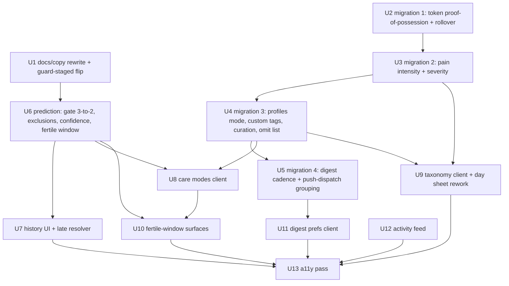
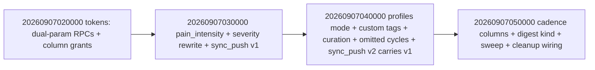

# P1 Backlog Sweep - Plan

Implements every open code-level P1 issue in one PR: #114, #122, #124, #125, #131, #132, #134, #138, #142, #143. Ops P1s #18 and #20 stay out (needs-human, no code).

## Goal Capsule

- **Objective:** After merge, the `P1` label has no open code issues; users get fertile-window estimation, care modes, cycle history, a deeper taxonomy, an activity feed, notification digests, an accessibility pass, honest privacy/positioning copy, and hardened invitation tokens — all verified by the repo's full gate stack.
- **Means:** One worktree branch off `origin/main` implementing the ten issues in dependency order (docs/policy first, then a four-migration server batch, then client domain/UI, then a11y last), each issue's acceptance criteria honored (KTD1).
- **Authority:** AGENTS.md (gates, migration flow, worktree rule) > the GitHub issue bodies (product contracts) > this plan on mechanism. PRIVACY.md is the public policy artifact this plan amends; the roadmap plan `docs/plans/2026-09-04-0738-feat-target-state-roadmap-plan.md` is edited where it cites the old policy.
- **Stop conditions:** A settled decision is invalidated; the quality gates cannot pass; a migration cannot be written conformantly (sort order, no in-place edits); CI cannot go green on the combined branch.
- **Execution profile:** Single branch off `origin/main`, sequential units, full local verification before the PR, merge after CI green (session-settled: user-directed).
- **Tail ownership:** PR body carries residuals (manual device passes, legal check, store declarations, deploy blockers, the legacy token-arm removal). Follow-up issues are filed, not silently dropped.

---

## Product Contract

### Summary

One PR fixes all ten open code-level P1 issues: token proof-of-possession for invitations and ownership transfers (#114); sync-first, family-collaboration repositioning (#122) and removal of the no-fertility commitment (#142) as one coherent docs/copy rewrite; a shared activity feed (#124); notification digest cadence with rate limiting (#125); per-profile care modes (#131); cycle history with omit-from-average and confidence framing (#132); an expanded, customizable taxonomy with intensity (#134); an accessibility pass over the primary surfaces (#138); and calendar-based fertile-window estimation (#143).

### Problem Frame

The P1 backlog holds the product's largest gaps. Public framing (README, PRIVACY.md, in-app copy) undersells the deepest-built features and still promises "no fertility features" while the owner has decided full parity including fertile-window estimation (#142's settled decision). A co-parent can read a pending invitation's `token_hash` from the table and redeem it themselves (#114). The taxonomy is 17 fixed booleans with no intensity, which caps every downstream feature and forces the caregiver-alert trigger to use `flow = 'heavy'` as its entire severity definition. There is no cycle-history surface, no per-profile framing, no feed, no digest, and effectively no accessibility work. Each issue body is a detailed product contract with acceptance criteria; this plan executes them together because they interact: the vocabulary guards must flip before fertile-window strings land, the day sheet must be reworked before semantics are pinned to it, and one `sync_push` carry-forward must serve intensity, mode, custom tags, and curation.

Live-branch note: `main` moves while this plan executes (PR #145 landed mid-planning, adding the tag-length bound; TestFlight builds mint on every push). Re-verify the migration tip and cited line numbers at each server-side unit's start (KTD2).

### Requirements

Requirements are grouped by issue; each group cites its issue. Acceptance criteria in the issue bodies are the product contracts — where this plan narrows or adapts one, the Key Decision or Assumption that does it is cited.

**#114 security: invitation/transfer tokens**
- R1. Redeeming a guardian invitation or ownership transfer requires the raw token; new clients send it and the server hashes it (pgcrypto) before lookup. Possession of the stored hash no longer redeems anything through the new API path.
- R2. `authenticated` cannot select `token_hash` from `guardian_invitations` or `ownership_transfers` (column-level grants replace table-level select), pinned by pgTAP.
- R3. A token minted before deploy remains redeemable after (the server-side hash of the raw token equals the already-stored client-side hash), and already-released binaries (TestFlight ≤ the current build) keep working during a one-cycle rollover: the RPCs accept the legacy hashed parameter and the new raw-token parameter concurrently (KTD3).

**#122 docs: sync-first repositioning**
- R4. No "local-first" product-identity claim remains in README.md, PRIVACY.md, AGENTS.md, or `lib/ui/` copy; sync plus multi-guardian collaboration leads; offline is described as resilience. No offline capability is removed.
- R5. PRIVACY.md's internal contradictions are fixed: "encrypted SQLite database" (L31) reconciled with the OS-at-rest statement (L15); "never uploaded unless you create an optional account" conflation fixed; the "end-to-end encryption" claim (L91) corrected to TLS-in-transit + RLS + OS-at-rest; "entirely optional" account framing (L33-34) updated. `Last Updated` bumped with a change note.
- R6. Settings and first-run copy match the new positioning; tests asserting the old strings are updated, not deleted (including the verbatim pin in `test/ui/profiles_test.dart`).

**#124 shared activity feed**
- R7. A per-profile Activity view shows a reverse-chronological list of entry changes: the date the entry is for, the guardian who last changed it, when, and the change kind (changed/removed), using honest latest-state projection (KTD12). Collision disclosure is adapted per KD7: the feed flags a conflict on a device whose own outgoing write was superseded (detected at sync-apply), with neutral wording; full per-field discard disclosure is tracked by open issue #130.
- R8. Tapping a row opens that date's day sheet; a per-device "new since last opened" badge renders on the entry points (Manage Guardians tile and the profile row) and clears on open; single-guardian and no-changes-yet profiles show a quiet state; a `viewer` can read the feed and mutate nothing; entries with no attribution render without crashing and without inventing an actor.

**#125 notification digest cadence and rate limiting**
- R9. A guardian can set log alerts to immediate / daily digest at a chosen local time / off; cycle-start, high-severity, and missed-entry alerts remain immediate-or-off in v1 (adaptation, KD8). Cadence is a per-guardian choice, not a per-profile broadcast. All-off default unchanged.
- R10. Multiple qualifying events inside a named coalescing window produce one push; a per-(guardian, profile) daily push ceiling rolls overflow into the next digest rather than dropping it; a guardian's own writes never push to them (existing trigger behavior, pinned by a regression test).
- R11. A digest scheduled inside quiet hours shifts to the window boundary. Digest pushes carry the same fixed generic strings as immediate pushes — byte-identical, no counts. pgTAP covers the digest sweep and the rate ceiling; the delivery-time collapse into one push is covered by a Deno test in `push-dispatch` (KTD10).

**#131 care modes**
- R12. Each profile carries a mode: `standard` (default), `teen`, `caregiver`, `irregular`; selectable at profile creation (shared dialog and first-run form) and changeable later; synced to the server like `birth_year`.
- R13. Mode drives vocabulary (overview status labels, prediction framing, empty/insufficient-history states, day-sheet category headings), the default category order and visibility (user curation always wins over mode presets — KTD13), and reminder presets — applied prospectively only; saved entries and history read verbatim regardless of mode.
- R14. `irregular` silences the late banner's urgency styling and rewords the overview while keeping the resolver's three actions available in a non-urgent card; the estimate disclaimer appears in every mode; mode changes nothing about what any guardian role can read or write (proved by a test); `isMinor` and `birthYear` still gate nothing.

**#132 cycle history with omit and confidence**
- R15. A reverse-chronological cycle history list with start date and length per cycle, open cycle pinned to top; average cycle length, average period length, and a variability measure displayed, with thin-data fallbacks (KTD12).
- R16. One-tap omit-from-average per cycle (reversible, synced per profile — KTD7); cycles outside the 15-60 validity window are auto-flagged as suggested omissions; omitted cycles stay visible, greyed, excluded from the average; omitting a 48-day outlier moves the estimate and clears a false late flag.
- R17. Confidence reads `learning` below three valid cycles and `irregular` on a low valid ratio or high spread (provisional named thresholds); the prediction gate lowers from three to two valid cycles so the `learning` tier is reachable exactly as #132's acceptance criterion demands (KTD5); plain-language summaries with graceful thin-data fallbacks; the disclaimer appears on every surface that shows a number.
- R18. The late banner is replaced by a three-option resolver — log it / skip this cycle / remind me in three days; "skip this cycle" feeds the same exclusion list and replans the late window; a paused profile with an open cycle over sixty days still resolves through "log it"; each action's post-state is specified (KTD12).

**#134 taxonomy, intensity, custom tags, curation**
- R19. The built-in taxonomy expands beyond 17 codes with existing codes keeping their exact identifiers; the picker renders searchable, collapsible clusters; search matches display name and code, force-expands clusters while querying, restores persisted collapse state on clear, and shows a zero-match state.
- R20. Pain entries carry a day-level intensity that survives a sync round-trip, appears in the export document, and is unambiguous when absent on a legacy entry (KTD9).
- R21. A per-profile custom-tag registry — capped (32) and length-bounded (64, the bound `20260907010000` already enforces for tag strings) server-side, case-insensitively deduped at creation on the client — syncs opaquely with union-merge semantics so concurrent guardian additions converge (KTD8); unknown synced codes render as raw text and never drop; removing a custom tag retires it from the picker without destroying stored entries.
- R22. A profile can hide categories and reorder the rest; the curation syncs with the profile (KTD7) and shapes the day sheet; user curation wins over mode presets (KTD13).

**#138 accessibility pass**
- R24. Each calendar cell announces its date, flow state, symptom presence, and loggability; a predicted/estimated day is semantically distinct from a logged bleed day.
- R25. Day-sheet chips announce group and selected state; the note field is labelled; the read-only variant announces its reason; the attribution badge announces who logged the entry; Manage Guardians roles and actions have unambiguous labels.
- R26. At 200% text scale no control on the calendar, day sheet, overview, cycle-history surface, or Manage Guardians clips or overlaps; calendar cells and chips meet touch-target minimums; widget tests pin calendar, day-sheet, and history-surface semantics.
- R27. Manual VoiceOver and TalkBack passes are recorded in the PR (residual — device QA, A1).

**#142 privacy amendment (fertility scope)**
- R28. No occurrence of the no-fertility-tracking commitment remains as a guarantee in PRIVACY.md, README.md, AGENTS.md, in-app copy, or the named code comments (`lib/domain/tags.dart`, `lib/domain/prediction/prediction.dart`); the roadmap plan's "Outside this product's identity" line and stale authority note are removed; `PRIVACY.md` gains a change-history line and date bump.
- R29. Guardian-visibility and ownership-transfer behavior for fertility data is stated explicitly in PRIVACY.md; a note is added to issue #21 that store privacy declarations must cover derived reproductive data; the legal/compliance check is flagged for a human (residual, A2). Fertility estimation is available on all profiles including `isMinor`-flagged ones.

**#143 fertile-window estimation**
- R30. Fertile-window and ovulation estimation is computed from logged cycle history only (estimated next start back-calculated by a luteal-phase constant; window as a range around it) with no new required input (KTD6).
- R31. The estimate carries #132's confidence tiering and is visibly uncertain on short/irregular history; it renders on the existing month calendar (including days in the window's month beyond the current one, reachable via a view-window affordance — KTD11) and overview with care-mode-aware vocabulary (KD5); the stale "no fertility-phase wording" comment and its enforcing test sweeps are removed/rewritten (with U1); the insights surface is deferred to #135 with a note on #143, #133, and #135.

**Cross-cutting**
- R32. All new migrations sort after the current `origin/main` tip (at plan revision: `20260907010000_tags_element_length_check.sql`; re-verify at implementation start — PR #145 landed mid-planning); no merged migration is edited in place; the full pgTAP suite passes; every pre-existing test that this PR's changes break is updated, never deleted.

### Key Decisions

- KD1. All ten code P1 issues land in a single PR. (session-settled: user-directed — chosen over per-issue PRs: the user explicitly requested one PR.) Governs R32 and the unit sequencing.
- KD2. Ops P1s #18 and #20 are out of scope: they are labeled needs-human-review and contain no code this PR can ship. (session-settled: user-directed — chosen over attempting dashboard/portal work: no agent holds those credentials.)
- KD3. The PR merges once verification passes, and merging is the deploy trigger. (session-settled: user-directed — chosen over leaving the PR open: the user pre-authorized merge and deploy.) Known deploy blockers are reported, not silently skipped (A6).
- KD4. Fertility estimation is available on all profiles, including `isMinor`-flagged ones, with no restriction — inherited from #142's recorded owner decision. Governs R29, R30.
- KD5. #143's display lands on the existing month calendar and overview in this PR; the forecast-calendar and insights surfaces (#133/#135) are P2, unbuilt, and deferred with notes on #143, #133, and #135. Governs R31.
- KD6. One coherent PRIVACY.md/README/AGENTS rewrite covers both #122 and #142 — two separate edits to the same document would produce conflicting hunks and double date bumps. Governs R4, R5, R28.
- KD7. #124's same-date collision-disclosure criterion is adapted to what a latest-state projection can honestly show: a conflict marker on a device whose own outgoing write was superseded, detected at sync-apply time; remote-vs-remote discards are invisible by design. Full per-field discard disclosure is issue #130's scope (open P2), cited here rather than rebuilt. Governs R7; annotated on #124 at ship time.
- KD8. #125's per-alert-type cadence is scoped in v1 to log alerts (immediate / digest / off); cycle-start, high-severity, and missed-entry alerts stay immediate-or-off — the digest machinery exists for the chatty case the issue names, and widening cadence to the other kinds rides the same columns later. Governs R9; annotated on #125 at ship time.

### Scope Boundaries

**Out of scope (this PR)**
- Issues #18 and #20 (ops; needs-human) — see KD2.
- Store listing privacy answers: store listings do not exist yet (release gate closed); the deliverable is the #21 note (R29).
- Release actions: `pubspec.yaml` version bump, `submit_for_review` dispatch, Play Store dispatch — separate deliberate release actions per AGENTS.md.
- Provisioning `SUPABASE_ACCESS_TOKEN` in the `production` environment — pre-existing gap tracked in AGENTS.md; merge will trigger `supabase-migrate.yml`, which fails at credential check until a human sets it (A6).

**Deferred to Follow-Up Work** (filed as issues or noted on existing ones at ship time)
- Removal of the legacy `p_token_hash` RPC parameter arm (a dated follow-up migration, once no pre-rollover TestFlight binaries remain in use — KTD3).
- Per-type cadence for cycle-start/high-severity/missed-entry alerts beyond log alerts (KD8).
- Full same-date discard disclosure and per-field change granularity in the feed (issue #130's scope; KD7).
- Viewer-aware care-mode framing composition (the `caregiver` mode's viewer dimension).
- Fertility-signal logging (BBT/mucus/OPK — issue #144) and per-tag intensity refinement beyond day-level pain intensity.
- Append-only audit log for the activity feed (the feed is an honest latest-state projection; a true revision log is a schema decision, KTD12).
- #133/#135 display surfaces for the fertile window (notes on #143, #133, #135).
- Periodic Realtime publication reconciliation (pre-existing AGENTS.md follow-up; untouched here).

### Success Criteria

- All gates green on the combined branch: `flutter analyze`, `flutter test`, `dart run tool/quality_gate.dart` (90% floor + CRAP), local pgTAP suite, `deno test` for the touched `push-dispatch` function, and CI on the PR.
- The ten issue bodies' acceptance criteria are met or explicitly adapted via a cited Key Decision/Assumption, with the adaptations visible in the PR body (KD7, KD8, KTD5, KTD7, KD5).
- PR merges; the ten issues close via `Fixes #N` references; deploy workflows trigger (their pre-existing blockers reported in the PR body, A6).

---

## Planning Contract

### Key Technical Decisions

- KTD1. Work happens in an isolated worktree under `.worktrees/` on one branch cut from `origin/main`, per AGENTS.md's strict worktree rule. Units land as ordered commits on that branch.
- KTD2. Four new migrations, each sorting after the live `origin/main` tip (at plan revision: `20260907010000`; re-verify at implementation start — main moved once mid-planning already), in this order: `20260907020000_invitation_token_proof_of_possession` (#114); `20260907030000_entry_pain_intensity_and_severity` (#134 server half: `day_entries.pain_intensity`, severity rewrite in `enqueue_caregiver_alerts`, first `sync_push` carry-forward); `20260907040000_profiles_mode_tags_curation` (#131/#134 server half: `profiles.mode`, `profiles.custom_tags`, `profiles.category_curation`, `profiles.omitted_cycles`, second `sync_push` carry-forward); `20260907050000_notification_digest_cadence` (#125: cadence/digest columns, `digest` outbox kind, sweep, `delete_account_data`/`revoke_guardian` wiring). Each `create or replace` carries every prior file's keys verbatim — the repo's documented carry-forward trap (AGENTS.md migration rules) is the reason for the fixed order. The per-string tag length bound is NOT re-added here: `20260907010000` (PR #145) already enforces it, and U3/U9 build on #145's `kMaxTagLength`/`kMaxTagCount` in `lib/domain/limits.dart`.
- KTD3. #114 rollover is a one-cycle dual-parameter bridge, not a clean break: production IS migrated (a manual out-of-band `db push` is proven by the passing migration gate on ios-release run 34146031864) and released TestFlight binaries (1.0.0-1046+) call the current `p_token_hash` convention, so a clean break would break invite/claim flows on those builds. The `create_guardian_invitation` / `accept_guardian_invitation` / `create_ownership_transfer` / `accept_ownership_transfer` rewrites take `p_raw_token` (new path: server computes `encode(extensions.digest(p_raw_token, 'sha256'), 'hex')` — pgcrypto lives in the `extensions` schema and every SECURITY DEFINER function here pins `set search_path = ''`, so the call must be schema-qualified; the migration opens with `create extension if not exists pgcrypto with schema extensions`) alongside the legacy `p_token_hash` parameter (default null; when present, validated and used exactly as today). Both arms produce/consume the same `sha256hex(raw)` storage format, so pre-rollover tokens stay redeemable and pre-rollover binaries keep working. The legacy arm's removal is a dated follow-up migration (Deferred list). Column-level select grants (all columns except `token_hash`) replace the table-level grants on both tables; both client readers already select explicit column lists. Enumeration-safety and freshness guards in the existing accept bodies carry forward verbatim; the Sentry deny-list gains `p_raw_token`/`raw_token` keys alongside the client change.
- KTD4. Care-mode vocabulary is a declarative copy table keyed by (mode, prediction state, confidence tier) in one Dart library exporting const strings; `overview_panel.dart` and the day sheet consume it. The disclaimer-in-every-mode and `irregular`-de-escalation rules are data in the table, not scattered conditionals — this is what keeps the per-method CRAP gate passable and widget tests iterable over the matrix instead of hand-written per combination.
- KTD5. The prediction gate lowers with this PR: `kMinCompletedValidCycles` goes from 3 to 2, so `NotEnoughHistory` covers fewer than two valid cycles and #132's own acceptance criterion ("confidence reads `learning` below three valid cycles") becomes reachable — under the old gate a `learning` tier defined as <3 valid cycles could never appear on an `ActivePrediction`. The overview not-enough state, reminder arming (`planReminders` consumes only `ActivePrediction`), and the no-digits invariant all re-anchor to the new boundary in U6's tests. Confidence tiers: `high` (≥3 valid cycles and low spread), `learning` (2 valid cycles or moderate spread), `irregular` (valid ratio below or spread above provisional named thresholds — constants with a "provisional until measured" comment). Mapping lives in the prediction domain, not the UI.
- KTD6. Fertile-window math: estimated ovulation day = estimated next start − luteal constant (14 days, named); fertile window = ovulation −5 … +1 (6 days, named). Computed only inside `ActivePrediction` (hidden under `NotEnoughHistory`/`PausedAwaitingNextPeriod`); carries the prediction's confidence tier. The R13-era vocabulary guards' rewrite asserts fertile-window copy is present in active states and absent in not-enough/paused states.
- KTD7. Per-profile prediction exclusions (the omit list), category curation, and the custom-tag registry all sync on the `profiles` row — the omit list and curation join `custom_tags` in migration 3's payload. A device-local omit list was considered and rejected: co-guardians would see different estimates and different late flags for the same profile, and — worse — their devices would publish competing `profile_reminder_windows` snapshots, making the server's missed-entry alerts nondeterministic last-device-writer-wins. The synced list is one more jsonb column riding the pipeline U4 already builds. `computePrediction` takes the exclusion set as an explicit parameter, so the reminder coordinator's replan loop consumes it naturally.
- KTD8. The custom-tag registry is a `profiles.custom_tags` jsonb column riding the existing profile sync pipeline (allowlist key + `v_row ? 'custom_tags'` containment guard + column grant), not a new synced table — a third table would cost cursors, transport, Realtime wiring, and RLS for no gain. Server-side validity bounds array size (≤32) and per-string length (≤64, mirroring the tag-string bound `20260907010000` enforces); `sync_push`'s profile UPDATE arm union-merges incoming and stored registries (the `merge_tag_arrays` pattern, capped at 32) so two guardians adding tags concurrently converge instead of last-writer-wins-losing one side. Case-insensitive dedupe happens at creation on the client (matching the picker UX); the server tolerates a case-variant reaching it via merge. Client `validateTagCodes` becomes registry-aware at the `DriftDayEntriesRepository.save` choke point; unknown codes render via the `?? code` fallback everywhere.
- KTD9. Intensity is day-level pain intensity: `day_entries.pain_intensity` smallint nullable (1 = mild, 2 = moderate, 3 = severe), applying to the pain category as a whole. Chosen over a per-tag intensity map: the issue's own complaint is day-level ("a day that kept her home from school"), the roadmap says intensity sits "on pain categories", one column keeps sync/export/SQL classification simple, and the trigger's severity predicate becomes `pain_intensity = 3 OR flow = 'heavy'` with the legacy heavy-flow arm retained. Absent = unset, never zero-as-mild. Note: this granularity is permanent for stored data — day-level values cannot be retroactively split per symptom if per-tag intensity ships later (Deferred list); accepted with the issue's alerting use case as the driver.
- KTD10. Digest delivery: `notification_preferences` gains `log_alert_digest boolean default false` (off = today's `alert_on_log = false` semantics; immediate = true + digest false; digest = true + digest true), `digest_time time` (null = no digest), and `daily_push_cap smallint check between 1 and 50` (null = uncapped) — one added dimension without dropping the existing boolean, so the migration maps old rows trivially. Immediate-alert coalescing is a deliberate delivery delay: digest-ineligible log rows get `deliver_after = resolve_deliver_after(now + kCoalescingWindow)` so events inside the window become eligible together; `push-dispatch` gains claim-time grouping — claimed rows group by (recipient_user_id, profile_id), one FCM send per group per device, every row in the group marked sent on success and released on failure (this is a real Edge Function change; `push-dispatch` is already inside `deno.json`'s `test.include`, and the one-push assertion lives there, not in pgTAP). A `run_digest_sweep()` security-definer function (the `scan_missed_entry_reminders` shape: per-row exception isolation, zone-degrades-never-raise, `revoke execute` from public/anon/authenticated) collapses pending digest-eligible rows per (recipient, profile) into one `digest` row — the absorbed rows are marked sent in the same transaction so the next sweep cannot re-collapse them — enforces the per-(recipient, profile, day) ceiling by counting today's sent rows and rolling overflow `deliver_after` to the next digest time; wired into the existing 15-minute drain cron wrapper (unschedule-by-jobname then schedule) inside its own exception sub-block. Digest pushes send the byte-identical generic copy through `buildPushMessage` — R11's indistinguishability contract is preserved by construction.
- KTD11. The fertile window renders on the calendar for every in-window day in the displayed month, including dimmed future days (ring present, cell stays non-interactive); when a day carries logged content, the logged fill/symptom dot paints first and the ring renders as the outline around it. Because the window can fall in the month after the current one (long cycles), the overview's fertile-window line carries a view-window affordance that jumps the calendar to the window's month — forward navigation unlocks through the estimated window's month only; full forecast paging stays #133.
- KTD12. Interaction states are committed in the units, not improvised: the late resolver's post-action states (U7), the history surface's thin-data fallbacks (U7), the custom-tag cap/duplicate/retire states (U9), tag-search force-expand/zero-match/restore (U9), the unread badge placement (U12), and the digest-time picker's conditional visibility (U11).
- KTD13. Mode presets and user curation have one precedence rule: user curation always wins. Mode presets supply the default category order and visibility only when no curation exists for the profile; a later mode change never rewrites an existing curation. Pinned by a test.
- KTD14. `First-run` and shared profile dialogs both gain the mode picker (the first-run form has its own inline create path); `ProfileEditResult` extends; mode never reads as gating in copy, and `isMinor` stays inert (R14). After an ownership transfer completes, the accepting user's next open of the profile prompts a one-time mode review (defaulting to the current mode) — #131's transfer-moment scenario.
- KTD15. Export schema version bumps 1 → 2, adding `painIntensity` to day entries and `mode`, `customTags`, `categoryCuration`, and `omittedCycles` to profiles (registry and estimate portability); the deterministic byte-identical re-encode contract is preserved for unchanged data only — the version bump is the sanctioned shape change. No released binary imports exports (no import feature exists; #140 is open), so a schema bump is safe.

### High-Level Technical Design

Unit sequencing (dependency flow):

Server data flow for the migration batch — each `sync_push` replacement must carry the prior body forward:

### Assumptions

Headless run; these are the un-validated bets (flagged per the pipeline's confirmation skip):
- A1. Manual VoiceOver/TalkBack passes and two-device sync convergence checks cannot run headless; widget-test approximations ship now and the manual passes are PR-body residuals with a filed device-QA follow-up (R27).
- A2. The #142 legal/compliance check is a human action; it is flagged on the #21 note and the PR body, not silently skipped.
- A3. The TestFlight audience for pre-rollover builds is internal-tester-sized (the App Store release gate is still closed); the dual-parameter bridge (KTD3) covers them regardless, and the legacy arm's removal waits for human confirmation that devices updated.
- A4. Production is migrated (proven by the passing migration gate on ios-release run 34146031864, 2026-09-07) via a manual out-of-band push; CI has never pushed (`SUPABASE_ACCESS_TOKEN` unset — the latest run on #145 fails the same gate, showing production is missing only #145's file). Old-client safety therefore rests on containment guards (`v_row ? 'key'`) for schema columns and the dual-param bridge for RPCs — both designed in — not on "no old binaries exist".
- A5. Digest pushes stay count-silent (byte-identical generic copy); counts are visible only in-app. This is #125's own "decide deliberately" call, resolved conservatively.
- A6. "Deploy" = merge to main triggering `supabase-migrate.yml` and `ios-release.yml`; both have documented pre-existing blockers (missing `SUPABASE_ACCESS_TOKEN`; the migration gate will fail until production catches up to this PR's files; export-compliance 90592). They are reported at ship time, not fixed here.
- A7. `SENTRY_DSN` remains unset in CI, so no crash-report path exercises in CI; scrubber discipline is enforced by unit tests only.

### Implementation Constraints

- AGENTS.md governs: worktree isolation, `flutter analyze` clean, 90% + CRAP quality gate, Drift codegen committed (`db.g.dart`), migration sort order and no in-place edits, pgTAP suite green locally before PR.
- The layering test (`test/architecture/layering_test.dart`) keeps domain imports pure — new domain code (prediction, taxonomy, copy table) must not import drift or Flutter.
- Reminder copy constants stay character-for-character identical to `supabase/functions/_shared/notification_copy.ts` (R11 contract); this PR does not change those strings.

---

## Implementation Units

### Unit Index

| U-ID | Title | Key files | Depends on |
|---|---|---|---|
| U1 | Docs/copy rewrite + guard-staged flip (#122, #142) | PRIVACY.md, README.md, AGENTS.md, settings_screen.dart, first_run_screen.dart, roadmap plan | — |
| U2 | Migration 1: token proof-of-possession + rollover (#114) | supabase/migrations/20260907020000*, supabase_sharing_service.dart, supabase_ownership_transfer_service.dart, scrub.dart, 3 pgTAP files | — |
| U3 | Migration 2: pain intensity + severity (#134 server) | supabase/migrations/20260907030000*, notification_outbox_test.sql, sync_push_test.sql | U2 |
| U4 | Migration 3: profiles mode/tags/curation/omits (#131/#134/#132 server) | supabase/migrations/20260907040000*, sync_push_test.sql | U3 |
| U5 | Migration 4: digest cadence + push-dispatch grouping (#125 server) | supabase/migrations/20260907050000*, push-dispatch/index.ts, index.test.ts, missed_entry_scan_test.sql, notification_outbox_test.sql, notification_preferences_rls_test.sql | U4 |
| U6 | Prediction domain: gate change, exclusions, confidence, fertile window (#132, #143) | lib/domain/prediction/prediction.dart, test/domain/prediction_test.dart | U1 |
| U7 | Cycle history UI + late resolver (#132 UI) | profile_detail_screen.dart, overview_panel.dart, scheduling.dart, reminder_coordinator.dart | U6 |
| U8 | Care modes client (#131 UI) | lib/domain/models/profile.dart, care_mode.dart, copy_table.dart, profile_dialogs.dart, first_run_screen.dart | U6, U4 |
| U9 | Taxonomy client + day-sheet rework (#134 UI) | lib/domain/tags.dart, lib/domain/limits.dart, day_sheet.dart, account_export.dart | U3, U4, U8 |
| U10 | Fertile-window surfaces (#143 UI) | month_calendar.dart, overview_panel.dart, copy_table.dart | U6, U8 |
| U11 | Digest prefs client (#125 UI) | notification_preferences.dart, supabase_notification_preferences_service.dart, notification_preferences_screen.dart | U5 |
| U12 | Activity feed (#124) | activity_feed_screen.dart, storage.dart, route_names.dart | — |
| U13 | Accessibility pass (#138) | lib/ui/logging/*, lib/ui/overview/*, lib/ui/profiles/profile_detail_screen.dart, manage_guardians_screen.dart | U7, U9, U10, U11, U12 |

### U1. Docs/copy rewrite + guard-staged flip (#122, #142)

**Goal:** One coherent repositioning (KD6): sync-first family-collaboration framing, the no-fertility commitment removed, PRIVACY.md contradictions fixed, and the enforcing tests staged from negative sweeps to state-scoped assertions.

**Requirements:** R4, R5, R6, R28, R29 (docs half).

**Dependencies:** none — lands first so fertile-window vocabulary (U6/U10) never hits a stale guard.

**Files:** PRIVACY.md; README.md; AGENTS.md; docs/plans/2026-09-04-0738-feat-target-state-roadmap-plan.md; lib/ui/settings/settings_screen.dart; lib/ui/profiles/first_run_screen.dart; lib/domain/tags.dart (header comment only); lib/domain/prediction/prediction.dart (header comment only); test/ui/settings_test.dart; test/ui/first_run_test.dart; test/ui/profiles_test.dart; test/ui/overview_test.dart; test/domain/tags_test.dart; test/domain/prediction_test.dart; web/privacy.html (if it mirrors PRIVACY.md fertility/positioning lines).

**Approach:**
1. PRIVACY.md: rewrite intro + Core Principles (drop "No Fertility Tracking or Algorithms", replace with an accurate fertile-window-estimation description naming inputs and who sees output; reframe "Local-First & Offline" as offline resilience); fix L31 storage sentence (OS at-rest, upload-consent separate from account); fix L33-34 optional framing; fix L63/L91 ("your authorized devices" → guardian devices; drop "end-to-end encryption"); add a forward-looking derived-reproductive-data line to §9; bump `Last Updated` with a combined change note (repositioning + narrowed fertility promise, per the repo's amendment standard).
2. README.md: opening paragraph leads with family sync/collaboration; L15/L313 fertility lines removed; L48-49 reframed as a development configuration; Accounts section updated.
3. AGENTS.md framing sentence updated (keep the technical accuracy; drop local-first-as-identity).
4. Roadmap plan: remove/rewrite the "Outside this product's identity" fertility line (L110) and the stale PRIVACY.md authority parentheticals (L17, L115).
5. In-app copy: settings tile subtitle + privacy dialog bullets; `kFirstRunNoticeCopy` leads with the account/sync story with offline-as-resilience; keep every claim literally true (data does stay local until account + consent — the copy must not overstate).
6. Stage the guard flip so no intermediate commit is red: U1 deletes the negative fertility sweeps (`kForbiddenStems`/`expectNoFertilityVocabulary`'s fertility arms; the R13 group's forbidden-stem assertions; `tags_test`'s taxonomy fertility guard where it pins built-ins) and keeps/pins **absence** assertions for not-enough-history and paused states plus the no-digits invariant. The positive **presence** assertions for fertile-window vocabulary are added in U6 (domain fields) and U10 (UI rendering), where the strings they assert come into existence.
7. Post the #21 comment (store declarations must cover derived reproductive data + sync-first answers) via `gh issue comment`.

**Patterns to follow:** the existing PRIVACY.md section structure and its `Last Updated` parenthetical convention; the FCM disclosure precedent for the change note.

**Test scenarios:**
- Settings dialog renders the new positioning copy; updated assertions replace the old string pins (all found, none deleted).
- `kFirstRunNoticeCopy` change propagates: first-run tests pass via the constant import; `test/ui/profiles_test.dart:32` verbatim duplicate updated in lockstep.
- Overview not-enough-history and paused states still contain no digits and no fertile-window wording after U1 (absence pins kept green immediately).

**Verification:** `flutter analyze` + `flutter test` green with guards staged; no stale string survives a repo grep for the removed phrases.

### U2. Migration 1 — token proof-of-possession + rollover bridge (#114)

**Goal:** Raw-token redemption for invitations and ownership transfers; stored hashes become non-redeemable and unreadable to clients; pre-rollover binaries keep working.

**Requirements:** R1, R2, R3, R32.

**Dependencies:** none (first migration).

**Files:** supabase/migrations/20260907020000_invitation_token_proof_of_possession.sql; lib/data/sharing/supabase_sharing_service.dart; lib/data/sharing/supabase_ownership_transfer_service.dart; lib/observability/scrub.dart; test/observability/scrub_test.dart; supabase/tests/guardian_invitation_revocation_test.sql; supabase/tests/ownership_transfer_test.sql; supabase/tests/profile_guardians_rls_test.sql; test/ui/sharing_flow_test.dart; test/ui/transfer_ownership_test.dart.

**Approach:**
1. Migration: `create or replace` the four RPCs taking `p_raw_token` (new; non-empty, reasonable length) alongside legacy `p_token_hash` (default null; validated exactly as today when present); the new path computes `encode(extensions.digest(p_raw_token, 'sha256'), 'hex')` (schema-qualified pgcrypto — every SECURITY DEFINER function pins `set search_path = ''`; the migration opens with `create extension if not exists pgcrypto with schema extensions`); carry every existing guard verbatim (#82 freshness, acceptor-freshness, single-use, cancellation side-effects, enumeration-safe messages with the client's `SharingFailure.invalidToken` mapping preserved). The legacy arm is marked for dated removal (Deferred list).
2. Replace table-level `grant select` on `guardian_invitations` and `ownership_transfers` with column-level grants listing every column except `token_hash`.
3. Client: delete the client-side sha256 in create/accept paths; send `p_raw_token`; deep-link format unchanged; keep "never select token_hash" explicit column lists.
4. Scrubber: `sentryDenyListedKeys` gains `p_raw_token` and `raw_token` (the raw token is now the sole redeemable secret; its parameter names must be dropped like other secret keys); unit test asserts a breadcrumb/data map keyed either spelling is dropped.
5. pgTAP: raw-token accept happy path on both flows; legacy `p_token_hash` accept still works (the rollover bridge); pre-rollover token redemption via `p_raw_token` (fixture row inserted with a known sha256 hex → accept with the preimage succeeds — proves R3); `authenticated` cannot select `token_hash` on either table while other columns select fine; wrong-token and nonexistent-token accepts fail identically (enumeration safety); existing invitation/transfer fixtures switch from hex-literal params to raw tokens.

**Patterns to follow:** the `create or replace` fix-forward shape (`revoke_guardian` ×3 precedent); `register_push_device`'s security-definer hygiene; the 20260906190000 enumeration-safety pattern.

**Test scenarios:** happy-path invite→accept with raw token on both flows; legacy-hash accept (bridge); pre-migration token redemption via preimage; column-select denial for `token_hash` on both tables; enumeration-identical errors; freshness/revocation guards still fire; client widget tests pass with fakes speaking raw-token; scrubber drops both raw-token key spellings.

**Verification:** local pgTAP suite green (`npx supabase@2.116.0 db reset --local` then `test db --local`); `flutter test` green.

### U3. Migration 2 — pain intensity + severity rewrite (#134 server)

**Goal:** Server schema and trigger carry real severity.

**Requirements:** R20 (storage half), R23, R32; serves R19-R22.

**Dependencies:** U2 (migration order).

**Files:** supabase/migrations/20260907030000_entry_pain_intensity_and_severity.sql; the current `sync_push` body in supabase/migrations/20260906200000_same_date_tag_merge.sql (carry-forward source); supabase/tests/notification_outbox_test.sql; supabase/tests/sync_push_test.sql.

**Approach:**
1. `alter table public.day_entries add column pain_intensity smallint check (pain_intensity between 1 and 3)` (nullable = unset, KTD9); additive `grant update (pain_intensity)`.
2. `create or replace sync_push` rebased on the 20260906200000 body (which already carries #145's tightened `is_valid_tags_array` — do not re-tighten): add `pain_intensity` to `c_day_entry_keys`, the INSERT column list, and a `v_row ? 'pain_intensity'` containment-guarded UPDATE arm (the `birth_year` precedent).
3. `create or replace enqueue_caregiver_alerts`: `v_is_high_severity := new.pain_intensity = 3 or new.flow = 'heavy'` (KTD9; the migration header documents the predicate, replacing the Q1 workaround note); add `pain_intensity` to the UPDATE trigger's WHEN column list (drop + re-create the trigger in the same migration).

**Patterns to follow:** `20260906160000_profile_subject_metadata.sql` (column + grant + containment-guarded sync_push arm); trigger re-creation with WHEN clause from 20260906220000.

**Test scenarios:** sync_push round-trips pain_intensity (set, changed, cleared); a pre-U3 client that omits the key does not null a stored value; severity: pain_intensity=3 with light flow enqueues for a high-severity guardian (replaces the Group C heavy-only cases); heavy flow alone still enqueues (legacy arm); pain_intensity=1/2 does not; existing 32-cap and merge-union tests still pass against the carried-forward body.

**Verification:** pgTAP suite green; `sync_push` dry-run applies cleanly after U2's file.

### U4. Migration 3 — profiles mode, custom tags, curation, omitted cycles (#131/#134/#132 server)

**Goal:** `profiles.mode`, `custom_tags`, `category_curation`, and `omitted_cycles` sync through the existing pipeline.

**Requirements:** R12 (storage half), R16 (storage half), R21 (storage half), R22 (storage half), R32.

**Dependencies:** U3 (carry-forward order).

**Files:** supabase/migrations/20260907040000_profiles_mode_tags_curation.sql; supabase/tests/sync_push_test.sql.

**Approach:**
1. `alter table public.profiles add column mode text not null default 'standard' check (mode in ('standard','teen','caregiver','irregular'))`; `add column custom_tags jsonb not null default '[]'`, `add column category_curation jsonb not null default '{}'`, and `add column omitted_cycles jsonb not null default '[]'` — the three jsonb columns share one validity function (array sizes ≤32; strings ≤64 chars — the bound #145 established; curation keys constrained to known category names) mirroring `is_valid_tags_array`'s pattern; additive column grants.
2. `create or replace sync_push` (second carry-forward, carrying U3's changes): the four keys join `c_profile_keys`, the INSERT list, and `v_row ? 'key'` containment-guarded UPDATE arms; the `custom_tags` arm union-merges incoming with stored (the `merge_tag_arrays` pattern, capped 32) so concurrent guardian additions converge; `omitted_cycles` and `category_curation` are last-writer-wins (single-owner semantics: curation is per-profile cosmetic; omits are explicit user actions whose divergence window is one sync cycle).
3. pgTAP: round-trips for all four columns; old-client-omits-key regression for each; invalid mode / over-cap / over-length / bad-curation-key rejections; custom_tags union convergence (two sequential pushes with disjoint tags both present after).

**Patterns to follow:** exactly the `birth_year`/`relationship` precedent end to end; `merge_tag_arrays` for the union arm.

**Test scenarios:** round-trip all columns; omission does not null stored values; closed-set mode enforcement; cap/length/curation-key enforcement; custom_tags union across two pushes; a viewer-role push cannot write profiles (existing guard).

**Verification:** pgTAP suite green.

### U5. Migration 4 — digest cadence + push-dispatch grouping (#125 server)

**Goal:** Cadence columns, digest kind, sweep, delivery grouping, and cleanup wiring.

**Requirements:** R9-R11 (server half), R32.

**Dependencies:** U4 (migration order; the outbox CHECK re-creation must come after nothing else touches it).

**Files:** supabase/migrations/20260907050000_notification_digest_cadence.sql; supabase/functions/push-dispatch/index.ts; supabase/functions/push-dispatch/index.test.ts; supabase/tests/notification_outbox_test.sql; supabase/tests/missed_entry_scan_test.sql; supabase/tests/notification_preferences_rls_test.sql.

**Approach:**
1. `notification_preferences` gains `log_alert_digest boolean not null default false`, `digest_time time` (null = no digest), and `daily_push_cap smallint check (daily_push_cap between 1 and 50)` (null = uncapped); existing rows need no backfill (defaults are today's behavior).
2. Widen `notification_outbox.kind` CHECK to add `digest` (drop + re-add constraint).
3. `create or replace enqueue_caregiver_alerts`: guardians with `log_alert_digest` and a `digest_time` get `kind='logged'` rows with `deliver_after` at their next digest time via `resolve_deliver_after` (quiet-hours shifted); immediate log rows gain the coalescing delay (`now() + kCoalescingWindow` as a named constant comment); cycle_start/high_severity/missed_entry rows always enqueue immediate-or-not-at-all (KD8); writer-exclusion unchanged.
4. `run_digest_sweep()` security-definer (the `scan_missed_entry_reminders` shape: per-row exception isolation, zone-degrades-never-raise, `revoke execute` from public/anon/authenticated): collapses pending digest-eligible rows per (recipient, profile) into one `digest` row, marking the absorbed rows sent in the same transaction; enforces the per-(recipient, profile, day) ceiling by counting today's sent rows and rolling overflow `deliver_after` to the next digest time; wired into the existing 15-minute drain cron wrapper (unschedule-by-jobname then schedule) in its own exception sub-block.
5. `push-dispatch` (a real change, not "unchanged"): after `claimBatch`, group claimed rows by (recipient_user_id, profile_id), send one push per group per device via the unchanged `buildPushMessage`, `markSent` every row in the group on success, `releaseClaim` on failure. Deno tests extend: five claimed rows for one (recipient, profile) → exactly one send per device; mixed-kind groups behave identically (byte-identical copy).
6. Wire the new columns into `delete_account_data()` counts and `revoke_guardian()` cleanup (unsent outbox rows already deleted there; extend to digest rows) — the 20260906240000 regression trap.
7. pgTAP: structural guard that `digest` rows still cannot carry entry content; digest collapse produces exactly one row and absorbed rows are terminal; ceiling overflow rolls forward rather than dropping; digest inside quiet hours shifts to boundary; self-authored write produces no row (regression pin, R10); missed-entry stays immediate while log digests (KD8 pin).

**Patterns to follow:** `20260906230000` sweep/scan/cron-wrapper structure; per-row exception isolation; `claimBatch`'s existing claim predicate.

**Test scenarios (pgTAP + deno):** digest guardian with N events → one digest row at digest time, absorbed rows terminal; ceiling exceeded → overflow rolls to next digest, nothing dropped; quiet-hours digest shifts to boundary; missed-entry immediate while log digests; delete-account and revoke cleanup cover the new columns/rows; deno: five-row coalescing → one send per device.

**Verification:** pgTAP suite green on a stack started without pg_cron/pg_net (sweep called directly); `deno test` in `supabase/` green (push-dispatch is inside `deno.json`'s `test.include`).

### U6. Prediction domain — gate change, exclusions, confidence, fertile window (#132, #143)

**Goal:** `computePrediction` lowers its gate to two valid cycles, gains a synced exclusion set, and returns confidence tiering and fertile-window fields; pure-domain, fully tested.

**Requirements:** R16 (domain half), R17, R30, R31 (domain half).

**Dependencies:** U1 (guards staged).

**Files:** lib/domain/prediction/prediction.dart; lib/domain/episodes/episodes.dart (expose the episode list for history); lib/domain/prediction/prediction_service.dart; test/domain/prediction_test.dart; test/domain/episodes_test.dart; test/domain/prediction_service_test.dart.

**Approach:**
1. Lower `kMinCompletedValidCycles` from 3 to 2 (KTD5): `NotEnoughHistory` now covers fewer than two valid cycles — the `learning` tier (2 valid cycles) becomes reachable on an `ActivePrediction`, exactly #132's acceptance criterion. Re-anchor the not-enough state's no-digits invariant, reminder arming, and the overview state switch to the new boundary in this unit's tests; the positive fertile-window vocabulary assertions from U1's staging land here for the domain fields.
2. New named constants: `kLutealPhaseDays = 14`, `kFertileWindowLeadDays = 5`, `kFertileWindowLagDays = 1` (KTD6); provisional confidence thresholds (`kMinValidCyclesForHighConfidence = 3`, spread threshold, valid-ratio threshold) with the "provisional until measured" comment.
3. `computePrediction({episodes, today, excludedStarts = const {}})`: exclusion filtering happens before valid-length selection; omitted cycles remain visible in history outputs (the service exposes the cycle list for U7); keep the sealed-type contract (NotEnoughHistory carries no partial numbers).
4. `ActivePrediction` gains `confidence` (`high`/`learning`/`irregular`), `estimatedOvulationDate?`, `fertileWindowStart?`/`fertileWindowEnd?` (null unless active).
5. `CyclePredictionService` threads the synced exclusion set (KTD7 — the value arrives via the profile from U4's column; until U8's codec work lands, the service parameter defaults to an empty set so this unit stays independently green) so watch/current stay pure streams.

**Patterns to follow:** the existing pure-function + fixed-`today` test style; the sealed-class gate-order structure.

**Test scenarios:** 3 valid regular cycles → confidence `high`, ovulation = next start − 14, window = ovulation −5..+1; 2 valid cycles → `learning` (previously NotEnoughHistory — the gate-change pin), window computed, framing visibly uncertain; 1 valid cycle → NotEnoughHistory (no digits, no window); outlier-heavy history (1 of 4 valid) → `irregular`; excluding a 48-day outlier changes mean/estimate and clears the late flag; excluding every valid cycle → NotEnoughHistory; paused >60d open cycle → PausedAwaitingNextPeriod with no window; fertile-window fields present in active states and absent otherwise (the U1-staged presence assertions for domain output).

**Verification:** `flutter test test/domain/prediction_test.dart` and service/episodes suites green; layering test green.

### U7. Cycle history UI + late resolver (#132 UI)

**Goal:** History list with omit, stats, confidence banner; three-option late resolver replacing the banner with committed post-action states.

**Requirements:** R15, R16 (UI half), R18.

**Dependencies:** U6.

**Files:** lib/ui/profiles/profile_detail_screen.dart (new History tab/section); lib/ui/overview/overview_panel.dart; lib/data/notifications/scheduling.dart; lib/data/notifications/reminder_coordinator.dart; test/ui/overview_test.dart; test/data/scheduling_test.dart; test/data/reminder_coordinator_test.dart; new test file for the history widget.

**Approach:**
1. History tab: reverse-chron cycle list (start, length), open cycle pinned; omitted cycles greyed with a visible "excluded" treatment and a reverse action; auto-flag suggestion (15-60 window) on outlier rows; stats block (avg cycle length, avg period length, variability from the domain fields) with the disclaimer.
2. Thin-data fallbacks (KTD12): fewer than three valid cycles → the confidence tier's plain-language line ("Learning — averages appear after about three cycles") in place of numeric averages; zero cycles → "No cycles yet — log a period to start"; the disclaimer stays in both states.
3. Exclusion persistence: writes the profile's synced `omitted_cycles` list (U4's column, via the profile repository — KTD7), so all guardians' devices converge and the reminder-window publisher stops racing; `CyclePredictionService` watch consumes it (U6), so the estimate and reminders replan through the existing coordinator pass.
4. Late resolver in `overview_panel` with committed states (KTD12): "Log it" opens today's day sheet directly; after any resolver action the card collapses to a one-line confirmation ("We'll check back on <date>" / "Cycle skipped — undo in History") that clears when the prediction changes; "Skip this cycle" shows a confirm naming the History undo path before writing the exclusion; "Remind me in 3 days" feeds a defer-until input into `planReminders` (suppression state is an input, not a scheduler mutation) so the coordinator's replan doesn't immediately re-arm; in `irregular` mode the same three actions remain in a non-urgent, non-error-colored inline card (only urgency styling and banner vocabulary are silenced).
5. Paused >60d open cycle: "log it" remains the resolver's primary path (R18).

**Patterns to follow:** overview panel's ValueKey-pinned card structure; the day-sheet `showModalBottomSheet` open pattern.

**Test scenarios:** history list renders from fixture episodes with lengths, open cycle pinned top; omitting a 48-day outlier greys it, estimate moves, late flag clears; un-omit restores; thin-data: zero-cycle and one-cycle profiles render the fallback states with disclaimer and no fabricated numbers; confidence banner text per tier; late resolver: each action's post-state (log-it opens today's sheet; skip shows confirm then writes the synced exclusion and replans; remind-me defer survives a coordinator replan); irregular mode keeps the three actions without urgency styling; paused-over-60 profile shows the log-it path.

**Verification:** overview + scheduling + coordinator + new history test suites green.

### U8. Care modes client (#131 UI)

**Goal:** Per-profile mode end to end: model, pickers, synced, vocabulary/defaults/presets via the copy table, transfer-moment review.

**Requirements:** R12 (client half), R13, R14.

**Dependencies:** U6 (confidence consumed), U4 (server column).

**Files:** lib/domain/models/profile.dart; lib/domain/models/care_mode.dart (new enum, toDb/fromDb/label); lib/ui/overview/copy_table.dart (new, KTD4); lib/ui/profiles/profile_dialogs.dart; lib/ui/profiles/first_run_screen.dart; lib/ui/profiles/profile_controller.dart; lib/ui/profiles/profile_picker_screen.dart (settings entry + transfer-moment prompt hook); lib/ui/logging/day_sheet.dart (category headings via copy table); lib/data/db/tables.dart + db.dart (schema v5 migration step) + storage.dart + mappers.dart + repositories; lib/data/sync/row_codec.dart + remote_rows.dart; lib/domain/export/account_export.dart; test mirrors (profile, codec, db, profiles UI, first-run, overview, export).

**Approach:**
1. `CareMode` enum following `ProfileRelationship` exactly; Drift columns (`mode`, plus U4's `custom_tags`, `category_curation`, `omitted_cycles` arrive in the same schema bump — one `schemaVersion` 5 step covers all four); codec encode/decode (including the three jsonb columns); repository create/update threading; export v2 adds `mode` + registry/curation/omits (KTD15).
2. Copy table (KTD4): const string sets keyed by (mode, state, confidence); rules as data — disclaimer always, `irregular` de-escalation, teen-framed not-enough-history, caregiver-framed overview; `overview_panel` and day-sheet headings read from it.
3. Mode pickers: shared dialog dropdown (`ProfileRelationship` dropdown precedent) + first-run inline form (KTD14); later change via the picker row menu; copy never implies gating.
4. Reminder presets: mode-keyed preset map (which reminder types default on; the reminder fire-hour) consumed by `planReminders` inputs so a mode change replans at the next coordinator pass without rewriting past reminders; prospective-only (no entry rewrite — pinned by a test).
5. Mode-vs-curation precedence (KTD13): curation wins; mode presets apply only when no curation exists; a mode switch never rewrites curation.
6. Transfer-moment review (KTD14): after an ownership transfer completes, the accepting user's next open of the profile prompts a one-time mode review defaulting to the current mode.
7. Permission invariance test: mode switch changes nothing about guardian role read/write behavior (R14).

**Patterns to follow:** `ProfileRelationship`/`birth_year` full-stack precedent; `ProfileEditResult` extension shape.

**Test scenarios:** create with each mode; switch modes → overview/day-sheet vocabulary changes while previously saved entries render byte-identical; `irregular` de-escalates the late card and rewords status while keeping the three actions; disclaimer present in all four modes × states (matrix test over the copy table); caregiver preset applied prospectively, no retroactive rewrite; mode change does not rewrite an existing curation; post-transfer prompt appears once and defaults to the current mode; mode change does not alter role capabilities; codec round-trip + old-client-omits-key (mirror of pgTAP); export v2 carries mode.

**Verification:** full flutter test green; Drift codegen committed; schema v5 migration test in db_test.

### U9. Taxonomy client + day-sheet rework (#134 UI)

**Goal:** Expanded taxonomy in searchable collapsible clusters, day-level pain intensity, custom-tag registry with union-merge sync, synced curation, export v2 — rebased onto #145's landed bounds.

**Requirements:** R19, R20 (client half), R21 (client half), R22.

**Dependencies:** U3, U4 (server columns), U8 (schema bump shared — land after or together).

**Files:** lib/domain/tags.dart; lib/domain/limits.dart (add `kMaxCustomTagsPerProfile = 32` alongside #145's `kMaxTagLength`/`kMaxTagCount`); lib/domain/models/day_entry.dart (painIntensity); lib/data/db/tables.dart + db.dart + storage.dart (rebased onto #145's `_validateTags`) + mappers.dart + repositories (registry-aware validateTagCodes); lib/data/sync/row_codec.dart + remote_rows.dart; lib/ui/logging/day_sheet.dart (picker rework + intensity control); lib/domain/export/account_export.dart; test/domain/tags_test.dart; test/ui/logging_test.dart; test/data/row_codec_test.dart; test/domain/export/account_export_test.dart; test/data/db_test.dart.

**Approach:**
1. Expand the built-in taxonomy (target on the order of 40 codes across the existing 4 categories + a sensible new set; every existing code keeps its identifier; codes are stable snake_case; UI owns display strings). Update the 17-count pin and category-set pins.
2. Day sheet picker rework: searchable (name + code match), collapsible clusters ordered by the profile's synced curation. Search states committed (KTD12): while query text is non-empty, all clusters force-expand and chips filter live; zero matches render "No tags match <query>"; clearing the query restores each cluster's persisted collapse state (stored with the curation).
3. Custom-tag create/retire states committed (KTD12): the create field stays visible and disables at cap with helper text ("Custom tag limit reached (32) — retire one to add another"); entering a case-insensitive duplicate selects the existing chip with an inline "Already added" hint; retire lives in a long-press (desktop: right-click/overflow) menu behind a confirm dialog ("Retire <tag>? It stays on past entries but leaves the picker") and only ever retires — stored entries keep rendering via the `?? code` fallback everywhere, including the editable picker's selected chips.
4. Pain intensity: a 1-3 segmented control shown when any pain tag is selected; null when none; threads model → storage → codec → export v2. Mid-session deselect hides the control without clearing a stored value; a synced entry carrying intensity with no pain tag keeps its stored value (control hidden).
5. Curation: per-profile hidden/reordered category list stored in the synced `category_curation` column (KTD7) — writes go through the profile repository, so all guardians' devices converge; precedence per KTD13.
6. Registry-aware validation: `validateTagCodes` accepts built-ins + the profile's registry; unknown codes from sync never drop (render as raw text).

**Patterns to follow:** the taxonomy const-list structure; the export v2 contract (schemaVersion bump + deterministic encode); #145's `_validateTags` for any new client-side bounds.

**Test scenarios:** every pre-existing tag code saves/loads/syncs/exports unchanged (round-trip suite); search: finds by display name and code, force-expands during query, zero-match state, restore-on-clear; cluster collapse/expand persists; custom tag: create, case-insensitive duplicate selects existing with hint, cap disables with helper text, over-length rejected client-side (reusing `kMaxTagLength`); custom tag survives reload and renders as raw text when absent from a second device's registry; retire keeps stored entries visible; curation persists, syncs through the codec round-trip, and wins over mode presets; intensity: control appears with a pain tag, 1-3 persists through codec round-trip and export, null without pain tags, deselect keeps stored value, legacy entry without intensity unambiguous; the 17→N taxonomy test pins updated; read-only day sheet renders unknown code via fallback.

**Verification:** full flutter test green; export tests cover v2; codec round-trips cover all new fields.

### U10. Fertile-window surfaces (#143 UI)

**Goal:** Fertile window visible and reachable on the month calendar and overview, confidence-tiered, mode-aware vocabulary.

**Requirements:** R31 (UI half).

**Dependencies:** U6 (fields), U8 (copy table).

**Files:** lib/ui/logging/month_calendar.dart; lib/ui/overview/overview_panel.dart; lib/ui/overview/copy_table.dart; test/ui/logging_test.dart; test/ui/overview_test.dart.

**Approach:**
1. Calendar rendering rules committed (KTD11): the window ring renders on every in-window day in the displayed month, including dimmed future days (ring present, cell non-interactive); when a day carries logged content, the logged fill/symptom dot paints first and the ring renders as the outline around it (both channels visible); the ring is visually distinct from the bleed fill — never colour-only.
2. Reachability (KTD11): the overview's fertile-window line carries a view-window affordance that jumps the calendar to the window's month; forward navigation unlocks through the estimated window's month only (full forecast paging stays #133). The calendar controller's forward-lock relaxes accordingly.
3. Overview: one fertile-window line under the next-period estimate (mode-aware wording from the copy table; learning/irregular states carry visibly-uncertain framing).
4. The U1-staged positive presence assertions for UI rendering land here; note the insights-surface deferral on #143, #133, and #135 at ship time (PR body).

**Patterns to follow:** the existing bleed-dot/today-ring decoration system in `_dayCellDecoration`; the ValueKey pin convention.

**Test scenarios:** active prediction renders window days with the estimate treatment and ValueKeys, including a dimmed future in-window day (ring present, tap disabled); a bleed-on-window-day composes both decorations; not-enough/paused profiles render no window markers (asserts absence); the window is always reachable: a window in the next month is jumpable via the overview affordance and renders there; predicted window day is visually + key-distinct from a logged bleed day; overview line present with disclaimer in each mode's wording; irregular-confidence wording differs from high-confidence wording.

**Verification:** calendar + overview suites green.

### U11. Digest prefs client (#125 UI)

**Goal:** Cadence UI and model wiring.

**Requirements:** R9 (client half).

**Dependencies:** U5 (server columns).

**Files:** lib/domain/notifications/notification_preferences.dart; lib/data/notifications/supabase_notification_preferences_service.dart; lib/ui/sharing/notification_preferences_screen.dart; test mirrors for all three.

**Approach:** `CaregiverAlertPreferences` gains `logAlertDigest`, `digestTime`, `dailyPushCap` (cadence maps onto existing boolean semantics: off = `alertOnLog` false; immediate = true + digest false; digest = true + digest true — KD8/KTD10); `_toRow`/`_fromRow` extended; the screen gains the cadence selector, a digest-time picker that renders only while log alerts are set to digest (helper text naming the device time zone), and an explicitly optional "Daily push limit" numeric field where empty means uncapped, honoring the parent-off-clears-narrowings convention.

**Test scenarios:** cadence round-trip through the service mapper; "off" persists as the boolean-off equivalent (no orphan state); digest-time picker hidden/shown on cadence change and writes HH:MM; empty cap round-trips as null; cap bounds enforced in UI; default (no row) stays all-off with no digest.

**Verification:** prefs service + widget tests green.

### U12. Activity feed (#124)

**Goal:** Honest per-profile activity projection with unread badges and tap-through.

**Requirements:** R7, R8.

**Dependencies:** none hard (existing attribution data); lands after U9 only to avoid day-sheet merge conflicts.

**Files:** lib/ui/sharing/activity_feed_screen.dart (new; shaped like manage_guardians_screen); lib/data/db/storage.dart (tombstone-inclusive watch); lib/domain/repositories/day_entries_repository.dart (feed query); lib/data/sync/supabase_sync_engine.dart (superseded-write detection feeds the conflict wording — a diff at apply time when a resolved row's content differs from the pushed outgoing row); lib/observability/route_names.dart (+ kSentryRouteNames); lib/ui/profiles/profile_picker_screen.dart and manage_guardians_screen.dart (entry points + unread badges); lib/domain/repositories/settings_store.dart (last-seen key); test/ui/activity_feed_test.dart; test/architecture route-name test.

**Approach:** KTD12 in full — latest-change rows from a tombstone-inclusive watch; actor resolution reusing the attribution badge's chain (you → displayName → role label → "a guardian", never a raw uuid); conflict wording per KD7 ("updated after a conflict — tags from both were kept" / a supersede marker when this device's outgoing write lost a flow/note value); removed rows show date + actor + "removed" with no content; unread badge on the Activity row in Manage Guardians and the profile row in the picker, cleared on open via a per-profile last-seen `app_settings` key holding the `updated_at` high-water mark; quiet state covers single-guardian and no-changes-yet profiles ("Nothing here yet — changes guardians make will appear here"); the screen states the latest-change limitation; viewer read-only (feed is read-only for everyone).

**Patterns to follow:** `support_history_screen`/`manage_guardians_screen` list shape; the day-sheet `showModalBottomSheet` open pattern from `_openDay`; route-name registration + membership test.

**Test scenarios:** two-guardian profile renders rows newest-first naming the right guardian; own changes read "you"; a superseded local write produces the conflict wording; a remote-vs-remote merge shows the neutral wording; tombstoned entry renders "removed" without content; no-attribution row renders without crashing and without an invented actor; tap opens the day sheet for that date; quiet state for single-guardian and no-changes profiles; unread badge appears on both entry points before opening and clears after; late sync apply updates the stream without restart (Drift watch); viewer opens and mutates nothing.

**Verification:** new widget suite green; route-name test updated.

### U13. Accessibility pass (#138)

**Goal:** Semantics, 200% scale, and touch targets over the final layouts — including the new history surface.

**Requirements:** R24, R25, R26.

**Dependencies:** U7, U9, U10, U11, U12 (final layouts exist).

**Files:** lib/ui/logging/month_calendar.dart; lib/ui/logging/day_sheet.dart; lib/ui/logging/widgets/caregiver_attribution_badge.dart; lib/ui/overview/overview_panel.dart; lib/ui/profiles/profile_detail_screen.dart (history surface + tab control); lib/ui/sharing/manage_guardians_screen.dart; lib/ui/sharing/notification_preferences_screen.dart; lib/ui/sharing/activity_feed_screen.dart; test/ui/logging_test.dart; test/ui/overview_test.dart; new/updated semantics tests.

**Approach:**
1. Calendar cells: `Semantics` wrapper with a composed label (date, flow state, symptom presence, loggable/future/read-only status) and distinct labels for estimated-window vs logged-bleed days; cell size/touch-target floor; no layout clamping — restructure the cell if 200% breaks it.
2. Day sheet: chips announce group + selected state; note field labelled; read-only variant announces its `readOnlyReason`; attribution badge semantics; intensity control labelled.
3. Overview: reading order — status, estimate, window, resolver card, disclaimer.
4. History surface: the omit/un-omit control announces the cycle and action; the confidence banner and stats block have labels; the three-segment tab control survives 200% scale.
5. Manage Guardians + prefs + feed: role badges, invite/revoke actions, cadence controls labelled.
6. 200% text-scale tests: pump the logging/overview/history harnesses with a text-scale MediaQuery override; assert no overflow exceptions and no clipped keys.
7. No new breadcrumbs; no label content into Sentry (A7 discipline).

**Patterns to follow:** `google_sign_in_button.dart` Semantics + `ensureSemantics` test precedent; existing tooltip usage.

**Test scenarios:** each calendar-cell state announces its composed label (spot-check: bleed+symptoms, symptom-only, future, read-only, estimated-window vs logged — distinct); flow chip announces group + selected; read-only day sheet announces the reason; attribution badge announces "Logged by <name>"; overview nodes read in order including the resolver card; history: omit control, banner, stats labels, 200% tab control; 200% scale: no overflow exceptions on calendar/day sheet/overview/history/manage guardians; touch-target assertions on calendar cells and chips.

**Verification:** full flutter test + quality gate green (semantics code counts toward coverage/CRAP — keep label composition in small helpers).

---

## Verification Contract

| Gate | Command / proof | Applies to |
|---|---|---|
| Static analysis | `flutter analyze` | whole PR |
| Unit/widget tests | `flutter test` | whole PR |
| Quality gate | `dart run tool/quality_gate.dart` (90% line floor + CRAP ≤ 10) | whole PR |
| Drift codegen | `dart run build_runner build --delete-conflicting-outputs`, commit `lib/data/db/db.g.dart` | U8, U9 |
| pgTAP suite | `npx supabase@2.116.0 start -x realtime,storage-api,imgproxy,mailpit,studio,edge-runtime,logflare,vector,supavisor` then `db reset --local` then `test db --local` | U2-U5 |
| Edge functions | `deno test` in `supabase/` — **mandatory**: U5 changes `push-dispatch` (claim-time row grouping for coalescing/digest) | U5 |
| CI | `check` + `db-tests` jobs green on the PR | whole PR |
| Realtime guard | not touched (no changes to `20260905100000` or the coordinator's subscription shape) — skip the manual websocket check | n/a |
| Supabase advisors | MCP `get_advisors` before approving any production push (needs interactive login — residual for the human, A6) | deploy |

## Definition of Done

**Global**
- All ten issues' acceptance criteria met or adapted via a cited KD/KTD/Assumption, with adaptations (KD7 feed collision disclosure, KD8 cadence scope, KTD5 gate change, KTD7 synced storage, KD5 display surfaces) listed in the PR body and annotated on the affected issues at ship time.
- All Verification Contract gates green locally and on CI.
- The ten issues referenced with `Fixes #114 … Fixes #143` so they close on merge.
- PR body carries: the residual checklist (manual VoiceOver/TalkBack passes, two-device sync convergence check, legal/compliance review, store-declaration updates on #21, `SUPABASE_ACCESS_TOKEN` provisioning, migration-gate catch-up including #145's file, export-compliance 90592 status, legacy token-arm removal pending device updates) and the filed follow-up issues (per-type cadence widening, viewer-aware framing, per-tag intensity, #130 collision disclosure, #133/#135 surfaces, legacy-arm removal).
- Follow-up issues filed per Scope Boundaries before DONE.
- No dead-end/experimental code left in the diff (abandoned attempts removed).

**Per unit**
- Each unit's test scenarios written and green before moving on; each unit lands as its own commit on the worktree branch.
- Units touching Drift schema land codegen in the same commit; units adding migrations land their pgTAP/deno extensions in the same commit.

## Appendix

### Sources / Research

Primary: the ten issue bodies (each a detailed product contract with acceptance criteria); AGENTS.md (gates, migration flow, sort-order rule, deploy status); the five planning-run research reports (prediction/profile domain; taxonomy/day-sheet/calendar; migrations/outbox/security; docs/copy/feed surfaces; cross-issue flow analysis) and the seven-persona document review whose two P0s (TestFlight binaries exist with production migrated; the `20260907010000` collision with PR #145) were verified against live `origin/main` and workflow history before this revision. Load-bearing code citations verified during planning: client-side token hashing at `lib/data/sharing/supabase_sharing_service.dart:34-49,87-93`; the table-wide select grant at `supabase/migrations/20260904010000_multi_guardian_schema.sql:336-338`; the severity proxy at `supabase/migrations/20260906220000_notification_outbox.sql:197`; writer-exclusion at line 214; the `sync_push` allowlist/INSERT/UPDATE sections in `20260906200000` (lines 81-85, 413-431); the `birth_year` containment-guard precedent (`20260906160000`, PR #108 review item 3); PR #145's landed bounds (`is_valid_tags_array` char_length ≤ 64; `kMaxTagLength`/`kMaxTagCount` in `lib/domain/limits.dart`; `_validateTags` in `lib/data/db/storage.dart`); the copy pins in `test/ui/settings_test.dart:72-82` and `test/ui/profiles_test.dart:32`; the vocabulary guards in `test/ui/overview_test.dart:36-43`, `test/domain/prediction_test.dart:295-339`, `test/domain/tags_test.dart:5-59`; the `public.settings` dead-end (no client sync path — mode must ride `profiles`); push-dispatch's per-row send loop (`supabase/functions/push-dispatch/index.ts:110-142`) that U5's grouping replaces; and ios-release run 34146031864's passing migration gate + TestFlight upload (the A4/KTD3 evidence).

Key repo docs: `docs/plans/2026-09-06-001-feat-caregiver-alerts-and-reminders-plan.md` (outbox/payload rules), `docs/plans/2026-09-04-0738-feat-target-state-roadmap-plan.md` (R-numbers cited by the issues), `docs/ops/supabase-go-live.md` (deploy runbook).
