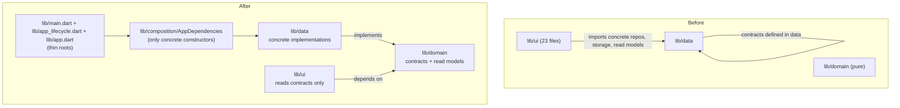
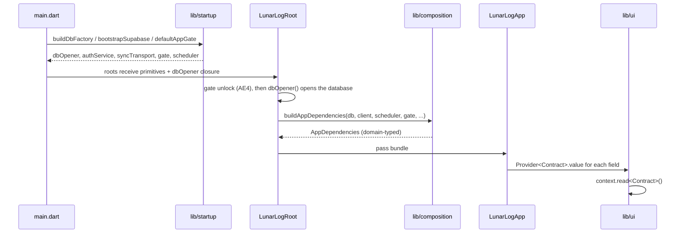

# Datalayer Contracts and Centralized Dependency Injection

---

## Goal Capsule

- **Objective:** The app has one clearly defined data layer whose external-data boundaries are all reachable through `lib/domain` contracts, so no UI code depends on a concrete storage, network, or platform implementation, and every concrete implementation is constructed in one place.
- **Means:** Introduce a plain-Dart composition module (`lib/composition/`) that builds an `AppDependencies` bundle of domain-typed contracts; migrate the UI to those contracts; enforce the full layer matrix with the existing architecture test.
- **Authority hierarchy:** The Product Contract (this plan) owns scope and behavior; the Planning Contract owns mechanism. When they disagree, the Product Contract wins. Existing repo conventions win over both where they are silent.
- **Execution profile:** Behavior-preserving refactor. Existing tests are the characterization suite; they must stay green with only import/fake-wiring changes.
- **Stop conditions:** Stop and report if a unit would change user-visible behavior, schema, sync wire format, or unconfigured-build gating; or if a contract cannot be expressed without dragging a data wire type or a plugin type into `lib/domain`.
- **Tail ownership:** `ce-work` owns engine selection and the implementation tail. The plan is not mutated at ship time.

---

## Product Contract

### Summary

This plan gives lunarlog a single, enforced data-layer boundary. Every outside-data source the app touches — the local Drift store, Supabase, and each platform adapter — is reached through a `lib/domain` contract, and every concrete implementation is constructed once in a `lib/composition/` module. The UI stops importing `lib/data`, stops reading the raw local-storage object from the provider tree, and stops constructing repositories inline.

### Problem Frame

The app's layering intent is documented but only half-enforced. `lib/app.dart` calls itself the composition root, yet construction is spread across `lib/main.dart`, `lib/app_lifecycle.dart`, `lib/app.dart`, and inline inside widgets. The domain layer is pure and `lib/data` never imports `lib/ui`, but the reverse arrow is wide open: 23 files under `lib/ui` import `lib/data` (19 via `package:lunarlog/data/...`, 4 via relative imports), 9 of them read the concrete `LunarLogStorage` object straight from `Provider`, and 18 construction sites inside widgets build concrete repositories, collectors, and writers. The `test/architecture/layering_test.dart` guard enforces only `lib/data -/-> lib/ui` and `lib/domain -/-> package:flutter`, so the `lib/ui -> lib/data` drift is invisible to CI.

The cost is concrete. Tests cannot fake `ProfileGuardiansRepository`, `ActivityFeedRepository`, or `AccountImportCoordinator` because they are concrete and constructed internally, so tests either build a real in-memory database or subclass the concrete class. `lib/ui` knows Drift-shaped read models such as `ActivityFeedSnapshot` and the `PushBatch` batch cap. The `ReminderScheduler` contract lives in `lib/data` and is named by the composition roots. The `docs-reconcile` plan (`docs/plans/2026-09-06-001-docs-reconcile-docs-with-codebase-plan.md`) explicitly deferred enforcing the `lib/ui -> lib/data` boundary as "its own issue"; issue #100 separately records the guard's one-direction gap and the file-concentration debt. This plan is that follow-up for the boundary and dependency-injection half; it does not take on #100's file-splitting half.

### Requirements

**Contracts for UI-consumed data**

- R1. Every `lib/data` type that `lib/ui` consumes is exposed to the UI through a `lib/domain` contract or a `lib/domain` read model. After this plan, no file under `lib/ui` imports `lib/data`.
- R2. `ProfileGuardiansRepository` and `ActivityFeedRepository` gain `lib/domain` contracts, and `ActivityFeedSnapshot` moves to `lib/domain`.
- R3. `DriftOnboardingCycleAnswersRecorder`, `DriftCareContentRepository`, and `ImagePickerAttachmentSource` are consumed through their existing domain contracts (`OnboardingCycleAnswersRecorder`, `CareContentRepository`, `AttachmentSource`); UI code imports no concrete implementation.
- R4. Platform and service seams get `lib/domain` contracts. UI-consumed: `DeviceDiagnosticsCollector`, `ImportFileReader`, `AccountImportCoordinator`, `AccountExportWriter`, `FhirBundleWriter`, `PredictionProjectionPublisher`. Root-only (moved because the interface already exists, or because a test must fake it): `ReminderScheduler`, `AppGate`, `ReminderWindowRemote`, `HealthFlowWriteService` and `HealthFlowWriteCoordinator`, `AccountImporter`, and the `SyncBatchLimits` read model.
- R5. The UI does not reference `PushBatch`; the sync batch row cap it reads is a `lib/domain` constant or read model. `SyncTransport` itself stays in `lib/data` — its signatures are built from data wire types (`PushBatch`, `PushResult`, `RemoteRow`, `SyncTable`) and moving it would drag the codec or Drift into `lib/domain`.

**Composition and dependency injection**

- R6. All concrete data-layer implementations are constructed in one composition module. `lib/main.dart`, `lib/app_lifecycle.dart`, and `lib/app.dart` name no concrete data-layer constructor except the platform primitives that stay in `lib/startup/` (the database factory, file deletion, privacy protections, Supabase bootstrap, and the app-gate factory, which U2 relocates to `lib/startup/`).
- R7. `LunarLogStorage` is not provided to the widget tree; no `lib/ui` file resolves it from `Provider`.
- R8. `lib/ui` constructs no data-layer object inline; every data dependency arrives through an injected contract.
- R9. Post-construction mutation of a data object (`FlutterLocalNotificationsScheduler.settingsStore`) is removed; the dependency is constructor-injected. U4 commits to one mechanism: the scheduler is constructed inside the composition factory after the database opens.
- R10. Tests inject fakes through contract-typed seams (the composition module or the provider tree) rather than by subclassing a concrete data class. Integration tests that deliberately exercise a real storage implementation (for example the sync engine's `HookedStorage`) are exempt.

**Boundary enforcement**

- R11. `test/architecture/layering_test.dart` enforces the full matrix: `lib/ui -/-> lib/data`, `lib/domain -/-> lib/data`, `lib/data -/-> lib/ui`, and `lib/domain -/-> package:flutter`. The guard is extended only once the UI migration units land, so it is green at the end of the work, not mid-refactor.
- R12. `lib/ui/startup/fail_closed_screen.dart` has no `lib/data` import; `DatabaseQuarantineError` moves to `lib/domain`.
- R16. Composition invariants the guard cannot see are checked mechanically: `lib/ui` contains no `AppDependencies` reference, and `lib/main.dart`, `lib/app.dart`, and `lib/app_lifecycle.dart` name no concrete data-layer constructor outside the platform primitives.

**Invariants**

- R13. No user-visible behavior change; no Drift schema change; no Supabase migration; no sync wire-format change.
- R14. An unconfigured build (no `--dart-define`s) still has no account, sync, push, or health-sync surfaces, and the null-gating that produces that posture is preserved.
- R15. `flutter analyze`, `flutter test`, and `dart run tool/quality_gate.dart` all pass.

### Success Criteria

- Zero files under `lib/ui` import `lib/data` (from 23).
- Zero `LunarLogStorage` resolutions in `lib/ui` (from 10 reads in 9 files).
- One construction site per concrete implementation, all inside the composition module.
- Existing tests pass with only import and fake-wiring changes; the extended guard test fails if any layer edge is reintroduced.

### Scope Boundaries

**In scope:** the contract interfaces and read models named in R1–R5, the composition module and DI migration in R6–R10, the guard extension in R11, the error-contract relocation in R12, and the composition-invariant checks in R16.

#### Deferred to Follow-Up Work

- The file-splitting half of issue #100 (`app_lifecycle.dart`, `storage.dart`, `supabase_sync_engine.dart`, `supabase_auth_service.dart`, and the sync test file). This plan may reduce `app.dart`/`app_lifecycle.dart` as a side effect of moving construction, but does not split those files.
- Rewriting the sync wire/codec types (`RemoteRow`, `JsonRow`, `row_codec`) and moving `SyncTransport` to `lib/domain`. U2 keeps `SyncTransport` in `lib/data`; only `SyncBatchLimits` moves.
- DI for `lib/observability` and the `AppConfig` static access spread through `lib/data` and `lib/ui`. Tracked as a follow-up once the data-layer boundary holds.
- Adopting a DI package (`get_it`, `riverpod`, or similar). This plan uses the existing `provider` package.

#### Non-Goals

- Any change to feature behavior, notification content or timing, sync semantics, RLS, or the Supabase schema.
- Changing the platform primitives in `lib/startup/` beyond relocating the app-gate factory (database factory, file deletion, privacy protections, Supabase bootstrap).

---

## Planning Contract

### Key Technical Decisions

- KTD1. **Composition is a plain-Dart `AppDependencies` bundle built by a factory in `lib/composition/`.** The factory returns an immutable bundle of domain-typed fields; the roots provide each field with `Provider<T>.value`. This keeps the existing `provider`-based injection the UI already uses, centralizes every concrete constructor, and adds no package. The bundle is a data holder, not a service locator: UI reads typed contracts, never the bundle.
- KTD2. **Breadth covers every external-data boundary.** The local Drift store, Supabase, and each platform adapter get a domain contract. Plugin types (`LocalAuthentication`, `FlutterLocalNotifications`, `file_picker`, `image_picker`, `share_plus`, `path_provider`, `firebase_messaging`, `app_links`) may appear only in `lib/data` implementations, `lib/composition/`, and `lib/startup/`. A contract that cannot be expressed without a data wire type (see `SyncTransport`) stays in `lib/data` rather than dragging the wire type up.
- KTD3. **The raw storage type leaves the provider tree.** `Provider<LunarLogStorage>` is deleted. The screens that read it today are given the domain repository each actually needs. There is no domain "raw storage" escape hatch; a need for one is a signal that a repository contract is missing.
- KTD4. **The guard becomes a full matrix with no exception allowlist.** Composition roots live outside `lib/ui`, `lib/domain`, and `lib/data`, so they can still name concrete types without an allowlist. `fail_closed_screen.dart`'s `lib/data` import is eliminated by moving `DatabaseQuarantineError` to `lib/domain`, not by allowlisting the file.
- KTD5. **Behavior preservation is the acceptance test; existing tests are the characterization suite.** Every unit is a mechanical move plus a re-wire. Tests may change imports and switch to fakes, but no assertion changes except where a test currently depends on a concrete type.
- KTD6. **Optional services stay optional in the bundle.** The unconfigured-build posture is preserved: contract fields for account, sync, sharing, feedback, push, and health are nullable and null exactly when they are today. The bundle makes the "present or absent" fact explicit in one place instead of spreading it across constructor params.
- KTD7. **The database-open ordering is preserved.** `buildAppDependencies` runs inside `LunarLogRootState` after `dbOpener()` resolves and the gate is unlocked, never in `main.dart` before unlock. `resetDevice` rebuilds the bundle alongside the fresh database and engine.

### Alternative Approaches Considered

- **Boundary-only fix (rejected):** add the missing contracts, delete `Provider<LunarLogStorage>`, and extend the guard, but leave construction where it is. This is lighter and would satisfy R1–R3, R7, R11, R12. It was rejected because construction remains spread across three roots and 18 widget sites, so the "one place to change an implementation" outcome and the test-injection seam do not land, and the same construction-sprawl defect would have to be re-planned. The bundle is the smallest mechanism that fixes both the boundary and the construction spread without a new package.
- **Adopt a DI package (rejected):** `get_it`/`riverpod` would give a container but adds a dependency and a second injection idiom alongside `provider`. Deferred to follow-up work.

### High-Level Technical Design

Layer direction, before and after:

Construction and injection flow after the refactor (note the database opens only after the gate unlocks, inside `LunarLogRoot`):

### Target Interface and Class Shape

Directional guidance for review, not implementation specification. Names are the contract; member intent is authoritative, exact signatures are the implementer's to settle.

**New/changed domain contracts** (all pure Dart, no Flutter, no `lib/data`):

| Contract | Home | Responsibility | Concrete implementation |
|---|---|---|---|
| `ProfileGuardiansRepository` | `lib/domain/repositories/profile_guardians_repository.dart` | Watch/list the guardians for a profile; return `ProfileGuardian` models only. | `lib/data/repositories/drift_profile_guardians_repository.dart` (renamed from `ProfileGuardiansRepository`) |
| `ActivityFeedRepository` | `lib/domain/repositories/activity_feed_repository.dart` | Watch a profile's activity feed; `markSeen`. | `lib/data/repositories/drift_activity_feed_repository.dart` (renamed from `ActivityFeedRepository`) |
| `ActivityFeedSnapshot` (read model) | `lib/domain/activity/activity_feed_snapshot.dart` | Items, guardians, last-seen, is-shared, `hasNewItems`. | (none) |
| `ReminderScheduler` | `lib/domain/notifications/reminder_scheduler.dart` | Schedule/cancel/initialize reminders; platform-neutral. Moves with `PlannedReminder` (`scheduling.dart`) and `ReminderLaunch` (`reminder_payload.dart`), both already pure Dart. | `FlutterLocalNotificationsScheduler`, `NoopReminderScheduler` |
| `ReminderWindowRemote` (replaces the `ReminderWindowUpsert` closure) | `lib/domain/notifications/reminder_window_remote.dart` | Publish a profile's prediction window to the server. | Supabase-backed implementation in `lib/data/notifications/` |
| `AppGate` | `lib/domain/gate/app_gate.dart` | Device-credential gate: `requiresUnlock`, `requestAccess`. | `LocalAuthAppGate`, `WebAppGate`, unsupported stub; `defaultAppGate` moves to `lib/startup/` |
| `SyncBatchLimits` (read model) | `lib/domain/sync/sync_batch_limits.dart` | The per-table row cap the UI displays. | (none; constant). `SyncTransport`, `PushBatch`, `PushResult`, `RemoteRow` stay in `lib/data` |
| `HealthFlowWriteService` / `HealthFlowWriteCoordinator` | `lib/domain/health/` | The one-way health-store write path and its binding. | `lib/data/health/` implementations |
| `AccountImporter` | `lib/domain/import/account_importer.dart` | Apply a parsed export document to local storage. | `lib/data/import/account_importer.dart` |
| `AccountImportCoordinator` | `lib/domain/import/account_import_coordinator.dart` | Drive plan/preview/apply for an import run; the seam `import_screen.dart` actually uses. | `lib/data/import/account_importer.dart` |
| `ImportFileReader` | `lib/domain/import/import_file_reader.dart` | Return the operator-picked file's bytes, or null on cancel. | `pickImportFile` adapter in `lib/data/import/` |
| `DeviceDiagnosticsCollector` | `lib/domain/feedback/device_diagnostics_collector.dart` | Produce a `DeviceDiagnostics` allowlisted payload. | `lib/data/diagnostics/` implementation |
| `AccountExportWriter` | `lib/domain/export/account_export_writer.dart` | Write and share an export document. | `lib/data/export/` implementation |
| `FhirBundleWriter` | `lib/domain/export/fhir_bundle_writer.dart` | Write and share a FHIR bundle. | `lib/data/export/` implementation |
| `PredictionProjectionPublisher` | `lib/domain/sharing/prediction_projection_publisher.dart` | Publish the sharer's derived-phase snapshot. | `lib/data/sharing/` implementation |
| `DatabaseQuarantineError` | `lib/domain/models/database_error.dart` | The fail-closed database-open failure the UI shows. | Thrown by `lib/data/db/` |

**Composition module** — `lib/composition/app_dependencies.dart`:

- `AppDependencies` — an immutable holder with one field per contract above, each nullable exactly where its service is optional today, plus `SyncEngine?`.
- `buildAppDependencies({required db, required gate, required scheduler, client, authService, syncTransport, ...})` — the single factory that names every concrete constructor and returns the bundle. It is invoked by `LunarLogRootState` after the database opens (KTD7).
- A test entry point (for example, a `@visibleForTesting` factory or constructor) that accepts fake contracts directly, so widget tests build a bundle without a real database or Supabase client.

**Consumers** — `lib/ui` widgets change from `context.read<LunarLogStorage>()` plus inline construction to `context.read<ProfileGuardiansRepository>()` and the other typed contracts.

### Assumptions

- `OnboardingCycleAnswersRecorder`, `CareContentRepository`, `AttachmentSource`, `BulkImporter`, `HealthPlatformStore`, `PushTokenSource`, and `PushDeviceRegistry` already exist in `lib/domain`; this plan reuses them rather than redefining them.
- The `provider` package remains the injection mechanism; the team does not want a new DI package for this refactor.
- `ActivityItem` already lives in `lib/domain`; only its snapshot wrapper moves.
- `PlannedReminder`, `ReminderLaunch`, `scheduling.dart`, and `reminder_payload.dart` are pure Dart and move to `lib/domain` with `ReminderScheduler`.

---

## Implementation Units

### U1. Domain contracts for the local-data repositories the UI consumes

- **Goal:** The two UI-consumed repositories without contracts get them, the activity-feed read model leaves `lib/data`, and the concrete classes take the `Drift*` naming convention.
- **Requirements:** R1, R2, R3.
- **Dependencies:** none.
- **Files:**
  - create `lib/domain/repositories/profile_guardians_repository.dart`
  - create `lib/domain/repositories/activity_feed_repository.dart`
  - create `lib/domain/activity/activity_feed_snapshot.dart`
  - rename `lib/data/repositories/profile_guardians_repository.dart` -> `lib/data/repositories/drift_profile_guardians_repository.dart` (class `DriftProfileGuardiansRepository implements ProfileGuardiansRepository`)
  - rename `lib/data/repositories/activity_feed_repository.dart` -> `lib/data/repositories/drift_activity_feed_repository.dart` (class `DriftActivityFeedRepository implements ActivityFeedRepository`)
  - modify `lib/data/repositories/drift_care_content_repository.dart` (declare the existing contract)
  - modify `lib/data/repositories/drift_onboarding_cycle_answers_recorder.dart` (declare the existing contract)
  - modify `lib/data/feedback/image_picker_attachment_source.dart` (declare the existing contract)
- **Approach:**
  1. Define `ProfileGuardiansRepository` from the concrete class's public surface: `watchForProfile`, `getForProfile`, and any other public members the UI calls.
  2. Define `ActivityFeedRepository` from the concrete surface: `watch` and `markSeen`.
  3. Move `ActivityFeedSnapshot` to `lib/domain/activity/` unchanged in shape; the concrete repository imports it from there.
  4. Rename the two concrete classes to the `Drift*` convention so they can `implements` their identically named contracts (the plan's cited pattern, `DriftDayEntriesRepository implements DayEntriesRepository`). Add the missing `implements` clauses where the contract already exists but is not declared.
  5. Keep every implementation method body unchanged.
- **Patterns to follow:** `lib/domain/repositories/day_entries_repository.dart` and its concrete `lib/data/repositories/drift_day_entries_repository.dart` — pure abstract contract, thin concrete mapping.
- **Test scenarios:**
  - `ActivityFeedSnapshot.hasNewItems` behavior is unchanged: null `lastSeen` is never new; an item newer than `lastSeen` is new; an item older is not.
  - The concrete `DriftProfileGuardiansRepository` and `DriftActivityFeedRepository` satisfy their contracts under `flutter analyze` (compile-time check).
  - Existing `test/ui/activity_feed_test.dart` and guardian-watching tests pass with the snapshot imported from its new home.
- **Verification:** `flutter analyze` clean; `ActivityFeedSnapshot` is defined only under `lib/domain`.

### U2. Move the existing platform interfaces to `lib/domain`

- **Goal:** The interfaces that already exist but live in `lib/data`, plus their pure payload types, move to `lib/domain`.
- **Requirements:** R4.
- **Dependencies:** none.
- **Files:**
  - create `lib/domain/notifications/reminder_scheduler.dart` (move `ReminderScheduler`)
  - create `lib/domain/notifications/scheduling.dart` and `lib/domain/notifications/reminder_payload.dart` (move `PlannedReminder` / `ReminderLaunch`; both are pure Dart)
  - create `lib/domain/gate/app_gate.dart` (move `AppGate`)
  - modify `lib/data/notifications/notification_scheduler.dart` (import the domain interface and payloads)
  - modify `lib/data/notifications/reminder_coordinator.dart`, `reminder_action_executor.dart`, `reminder_window_publisher.dart` (imports)
  - move `defaultAppGate` and its three platform factories from `lib/data/gate/` to `lib/startup/gate/` (so `main.dart`'s call is a platform primitive per R6)
  - modify `lib/data/notifications/scheduling.dart` and `reminder_payload.dart` (remove the moved types or re-export them)
- **Approach:**
  1. Move `ReminderScheduler`, `AppGate`, `PlannedReminder`, and `ReminderLaunch` to `lib/domain`; update every import.
  2. Relocate the `defaultAppGate` factory to `lib/startup/` so the composition root's gate construction is a platform primitive, not a data-layer constructor (resolves R6).
  3. Leave `SyncTransport` in `lib/data` (R5); only `SyncBatchLimits` moves, in U9.
- **Patterns to follow:** `lib/domain/sharing/sharing_service.dart` and its `SupabaseSharingService` implementation — a provider-neutral contract with a provider-backed concrete class.
- **Test scenarios:**
  - `FakeReminderScheduler` now implements the `lib/domain` contract and still passes the coordinator tests.
  - The reminder scheduling behavior is unchanged (existing `test/data/reminder_coordinator_test.dart` passes with import-only changes).
  - `lib/domain` still has zero `package:flutter` and zero `lib/data` imports after the moves.
- **Verification:** `flutter analyze` clean; no `abstract interface class ReminderScheduler` / `AppGate` remains under `lib/data`.

### U3. Relocate the database-open error contract

- **Goal:** `fail_closed_screen.dart` stops importing `lib/data`.
- **Requirements:** R12.
- **Dependencies:** none.
- **Files:**
  - create `lib/domain/models/database_error.dart` (move `DatabaseQuarantineError`)
  - modify `lib/data/db/errors.dart` (import the domain type for its throw sites, or re-export it)
  - modify `lib/ui/startup/fail_closed_screen.dart`
- **Approach:** move `DatabaseQuarantineError` to `lib/domain/models/database_error.dart`. Keep the same type name so the fail-closed screen's pattern-match is unchanged. `lib/data`'s throw sites import the domain type.
- **Patterns to follow:** the existing pure-Dart domain model files under `lib/domain/models/`.
- **Test scenarios:**
  - The fail-closed screen still renders for a `DatabaseQuarantineError` and never wipes.
  - `grep` finds `DatabaseQuarantineError` defined only under `lib/domain`.
- **Verification:** `flutter test test/ui/` fail-closed coverage green; `fail_closed_screen.dart` has no `lib/data` import.

### U4. Composition module and centralized construction

- **Goal:** One factory names every concrete implementation; the roots stop constructing data objects.
- **Requirements:** R6, R9, R16.
- **Dependencies:** U1, U2, U9.
- **Files:**
  - create `lib/composition/app_dependencies.dart`
  - modify `lib/main.dart`
  - modify `lib/app_lifecycle.dart`
  - modify `lib/app.dart`
  - modify `lib/data/notifications/notification_scheduler.dart` (constructor-inject the settings store)
- **Approach:**
  1. Define `AppDependencies` with one field per contract, plus `SyncEngine?`.
  2. Implement `buildAppDependencies(...)`: move every concrete constructor currently in `app.dart` (`initState`) and `app_lifecycle.dart` (`_startSyncEngine`, push registration) into it. It receives the opened database and the `GateController` (or an unlocked-listenable plus callback) from `LunarLogRootState`; it is invoked there after `_openDatabase` succeeds (KTD7). The root keeps owning the engine's start/dispose lifecycle, but the engine is built inside the factory and held on the bundle.
  3. Resolve the scheduler/settings ordering: construct `FlutterLocalNotificationsScheduler` inside the factory *after* the database (and settings store) exists, so the settings dependency is constructor-injected. Preserve the existing platform gating (web gets `NoopReminderScheduler`) by having the factory take the platform decision or the already-selected scheduler class.
  4. `resetDevice` rebuilds the bundle alongside the fresh database and engine; the root must not hand the UI a bundle bound to a closed database.
  5. Add a test construction path that accepts fake contracts.
  6. Reduce `LunarLogApp`'s ~20 optional constructor params to the bundle plus the lifecycle-only callbacks it genuinely needs. Do not split `app.dart`/`app_lifecycle.dart` (deferred to #100).
- **Patterns to follow:** the existing `defaultSyncEngineBuilder` test seam in `lib/app_lifecycle.dart`; the `Provider.value` hoisting pattern from `docs/plans/2026-09-03-005-refactor-layering-cleanups-sync-coverage-plan.md` U5.
- **Test scenarios:**
  - Mounting `LunarLogApp` with a bundle of fakes yields the same provider values as the pre-refactor widget params did (identity assertions for each contract).
  - An unconfigured bundle (no Supabase client, no push) leaves account, sync, sharing, feedback, and push contracts null, and the corresponding UI surfaces absent (R14).
  - No `FlutterLocalNotificationsScheduler` is mutated after construction; a scheduler built by the factory receives its settings store at construction.
  - After a simulated device reset, the UI resolves the new bundle's contracts, not the closed database's (R9/KTD7).
  - The existing `test/ui/app_auth_provider_test.dart` provider-wiring assertions pass against the bundle.
- **Verification:** `grep` for concrete data constructors in `lib/app.dart` and `lib/app_lifecycle.dart` finds only platform-primitive references; `flutter test` green.

### U5. Provider tree migration and removal of the raw-storage provider

- **Goal:** The tree exposes contracts, not `LunarLogStorage`; UI has no path to raw storage.
- **Requirements:** R7, R8, R16.
- **Dependencies:** U4.
- **Files:**
  - modify `lib/app.dart` (provider tree)
  - modify any test harness that provides `Provider<LunarLogStorage>`
- **Approach:**
  1. Replace `Provider<LunarLogStorage>.value(...)` and the inline `.value` constructions with `Provider<Contract>.value(...)` over the bundle fields.
  2. Provide the new contracts so the UI migration units have a source. Preserve `Provider<LocalRowCounter>` — it is a `countAllRows` tear-off from the storage object; keep it as a domain-typed count callback, not a raw storage reference.
  3. Delete the storage provider. Do not provide `AppDependencies` to the tree (R16); provide only the individual contracts.
- **Patterns to follow:** the existing `Provider<ProfilesRepository>.value` block in `lib/app.dart`.
- **Test scenarios:**
  - `context.read<LunarLogStorage>()` is absent in the tree; a smoke test mounts the app and asserts each contract resolves.
  - Contract identity is stable across rebuilds (same instance each read).
  - `lib/ui` contains no `AppDependencies` reference (R16).
- **Verification:** `grep` for `LunarLogStorage` and `AppDependencies` in `lib/ui` returns nothing; `flutter test` green.

### U6. Migrate the guardians and activity-feed UI consumers

- **Goal:** The heaviest `lib/ui -> lib/data` cluster reads domain contracts.
- **Requirements:** R1, R7, R8.
- **Dependencies:** U5.
- **Files:**
  - modify `lib/ui/components/app_shell.dart`
  - modify `lib/ui/components/today_log_fab.dart`
  - modify `lib/ui/logging/month_calendar.dart`
  - modify `lib/ui/overview/overview_panel.dart`
  - modify `lib/ui/care/care_notes_screen.dart`
  - modify `lib/ui/insights/analysis_tab.dart`
  - modify `lib/ui/sharing/manage_guardians_screen.dart`
  - modify `lib/ui/sharing/activity_feed_screen.dart`
  - modify `lib/ui/sharing/open_manage_guardians.dart`
  - modify `lib/ui/sharing/sharing_overview_controller.dart`
  - modify `lib/ui/profiles/profile_detail_screen.dart`
  - modify `lib/ui/profiles/profile_dialogs.dart`
  - modify `lib/ui/profiles/profile_picker_screen.dart`
  - modify `lib/ui/settings/family_sharing_section.dart`
  - modify `lib/ui/settings/settings_screen.dart`
  - modify `lib/ui/settings/import_screen.dart`
  - modify `lib/ui/profiles/first_run_screen.dart`
- **Approach:**
  1. Replace `context.read<LunarLogStorage>()` plus inline `DriftProfileGuardiansRepository(storage)` / `DriftActivityFeedRepository(storage)` / `DriftCareContentRepository(storage)` / `DriftOnboardingCycleAnswersRecorder(storage)` with `context.read<Contract>()`.
  2. `SharingOverviewController` takes the contract in its constructor; its two construction sites stop passing `LunarLogStorage`.
  3. `import_screen.dart` reads the injected `ProfileGuardiansRepository` instead of building a tear-off, and reads an injected `AccountImportCoordinator` instead of constructing one.
  4. Remove now-unused `lib/data` imports.
- **Patterns to follow:** the existing `context.read<DayEntriesRepository>()` usage in `lib/ui/logging/day_sheet.dart`.
- **Test scenarios:**
  - Guardian attribution badges and viewer read-only gating behave identically with a fake `ProfileGuardiansRepository`.
  - The activity feed renders its waiting state, populated state, and "new" dot with a fake `ActivityFeedRepository` emitting scripted snapshots.
  - `SharingOverviewController` is unit-testable with a fake repository and no database.
  - `import_screen.dart` drives a fake `AccountImportCoordinator` without constructing a real one.
- **Verification:** `grep` for `lib/data` imports under the listed files returns nothing; their tests pass.

### U7. Migrate the remaining UI consumers

- **Goal:** The last `lib/ui -> lib/data` edges are gone.
- **Requirements:** R1, R3, R5.
- **Dependencies:** U5.
- **Files:**
  - modify `lib/ui/feedback/feedback_screen.dart`
  - modify `lib/ui/feedback/feedback_controller.dart`
  - modify `lib/ui/account/sync_status_tile.dart`
  - modify `lib/ui/account/export_account_collaborator.dart`
  - modify `lib/ui/settings/clinical_export_tile.dart`
  - modify `lib/ui/settings/your_data_section.dart`
  - modify `lib/ui/account/account_section.dart`
- **Approach:**
  1. `feedback_screen.dart` resolves `DeviceDiagnosticsCollector` and `AttachmentSource` from the tree instead of constructing `DeviceDiagnosticsCollector()` / `ImagePickerAttachmentSource()` as null-coalescing fallbacks.
  2. `sync_status_tile.dart` imports `SyncBatchLimits` instead of `PushBatch`.
  3. Export tiles resolve `AccountExportWriter` / `FhirBundleWriter` from the tree.
  4. Remove now-unused `lib/data` imports. (`fail_closed_screen.dart` is handled in U3.)
- **Patterns to follow:** the injectable-collaborator pattern already documented in `lib/ui/README.md`, now backed by tree-provided contracts instead of widget-param defaults.
- **Test scenarios:**
  - Feedback submission still collects the same diagnostics payload through a fake collector.
  - The sync tile still shows the batch-cap copy when dirty rows exceed the cap, using the domain constant.
  - Export still writes and shares through the injected writer.
- **Verification:** `grep` for `lib/data` under `lib/ui` returns nothing across the whole tree.

### U8. Migrate tests and fakes, and extend the layering guard

- **Goal:** Tests inject fakes through contracts; the full matrix is enforced and green on the finished tree.
- **Requirements:** R10, R11, R15, R16.
- **Dependencies:** U1–U7.
- **Files:**
  - create `test/support/fake_profile_guardians_repository.dart`
  - create `test/support/fake_activity_feed_repository.dart`
  - create `test/support/fake_account_import_coordinator.dart`
  - modify `test/support/pump_helpers.dart` (bundle-based harness)
  - modify `test/support/fake_sync_transport.dart`, `test/support/fake_reminder_scheduler.dart` (import the moved contracts)
  - modify `test/architecture/layering_test.dart` (add the `lib/ui -/-> lib/data` and `lib/domain -/-> lib/data` scans plus falsification cases)
  - modify the affected tests under `test/ui/` and `test/data/`
- **Approach:**
  1. Add fakes for the new repository and coordinator contracts.
  2. Give the shared pump helper a way to build an `AppDependencies` bundle of fakes, replacing `Provider<LunarLogStorage>` harness wiring.
  3. Switch tests that currently subclass `AccountImportCoordinator` or construct real repositories to the fakes. Leave the sync engine's real-storage integration tests (`HookedStorage`, `CountingStorage`) as they are (R10 exemption).
  4. Update imports for the moved contracts.
  5. Extend `layering_test.dart` with the two new scans, reusing the existing directive parser and `_resolve` helper, plus a falsification case for the `lib/ui -> lib/data` rule. This is the unit where the `lib/ui` scan is expected to go green, because U6/U7 have landed by now.
- **Patterns to follow:** `test/support/fake_auth_service.dart` and `test/support/fake_sync_engine.dart`.
- **Test scenarios:**
  - The bundle harness mounts a screen with fakes and no in-memory database.
  - A test can drive `ProfileGuardiansRepository`, `ActivityFeedRepository`, and `AccountImportCoordinator` without touching Drift.
  - The `lib/ui` and `lib/domain` scans report zero offenders; each asserts a non-zero scanned-file count.
  - A synthetic `lib/ui` file importing `package:lunarlog/data/...` is flagged.
  - `dart run tool/quality_gate.dart` still passes after the coverage denominator shifts.
- **Verification:** `flutter analyze`, `flutter test`, and `dart run tool/quality_gate.dart` all green.

### U9. New domain contracts for the remaining seams

- **Goal:** The seams with no contract yet get one, expressed in domain models only.
- **Requirements:** R4, R5.
- **Dependencies:** none.
- **Files:**
  - create `lib/domain/sync/sync_batch_limits.dart`
  - create `lib/domain/notifications/reminder_window_remote.dart`
  - create `lib/domain/health/health_flow_write_service.dart`
  - create `lib/domain/health/health_flow_write_coordinator.dart`
  - create `lib/domain/import/account_importer.dart`
  - create `lib/domain/import/account_import_coordinator.dart`
  - create `lib/domain/import/import_file_reader.dart`
  - create `lib/domain/feedback/device_diagnostics_collector.dart`
  - create `lib/domain/export/account_export_writer.dart`
  - create `lib/domain/export/fhir_bundle_writer.dart`
  - create `lib/domain/sharing/prediction_projection_publisher.dart`
  - modify the corresponding `lib/data` implementations to declare `implements`
- **Approach:**
  1. For each seam, define a contract from the public surface the composition root or UI uses, in domain models only. No plugin type, Supabase type, or data wire type in a signature.
  2. `AccountImportCoordinator` is the seam `import_screen.dart` drives; it depends on `ProfilesRepository`, `ProfileGuardiansRepository`, and storage-through-repositories, not on `LunarLogStorage`.
  3. `ReminderWindowRemote` replaces the raw `ReminderWindowUpsert` closure with a named contract method.
  4. `SyncBatchLimits.maxRowsPerTable` is the only sync type the UI reads; `PushBatch` and `SyncTransport` stay in `lib/data`.
  5. Have each concrete class `implements` its contract; keep method bodies unchanged.
- **Patterns to follow:** `lib/domain/sharing/sharing_service.dart` and its `SupabaseSharingService` implementation.
- **Test scenarios:**
  - Each concrete class satisfies its contract under `flutter analyze`.
  - The reminder-window publish path still calls the server exactly once per prediction change (existing publisher test unchanged except for the contract type).
  - The import coordinator's plan/preview/apply behavior is unchanged against a real in-memory store.
  - `lib/domain` still has zero `package:flutter` and zero `lib/data` imports after the additions.
- **Verification:** `flutter analyze` clean; `grep` finds no new contract defined under `lib/data`.

---

## Verification Contract

Run from the repository root, in order:

1. `flutter analyze` — zero issues.
2. `flutter test` — all green, including the extended `test/architecture/layering_test.dart`.
3. `dart run tool/quality_gate.dart` — the 90% coverage floor and per-method CRAP gate pass.

Grep gates (outcome checks, not substitutes for the tests):

- `grep -rn "package:lunarlog/data/" lib/ui/` returns nothing.
- `grep -rn "LunarLogStorage" lib/ui/` returns nothing.
- `grep -rn "AppDependencies" lib/ui/` returns nothing (R16).
- `grep -rn "import 'package:lunarlog/data/" lib/domain/` returns nothing.
- `grep -rn "Drift[A-Za-z]*Repository(\|Supabase[A-Za-z]*Service(\|DeviceDiagnosticsCollector(\|AccountImportCoordinator(" lib/app.dart lib/app_lifecycle.dart` finds only platform-primitive references (R6/R16).

No codegen is required: no Drift table or schema change, so `lib/data/db/db.g.dart` is untouched. No Supabase migration.

---

## Definition of Done

- [ ] `lib/ui` contains zero `lib/data` imports (R1).
- [ ] `ProfileGuardiansRepository` and `ActivityFeedRepository` contracts exist in `lib/domain`, `ActivityFeedSnapshot` lives in `lib/domain`, and the concrete classes are renamed to `Drift*` (R2).
- [ ] `DriftOnboardingCycleAnswersRecorder`, `DriftCareContentRepository`, and `ImagePickerAttachmentSource` are consumed through existing domain contracts (R3).
- [ ] The seams in R4 have domain contracts; `SyncTransport` stays in `lib/data` (R4/R5).
- [ ] No `lib/ui` file references `PushBatch` (R5).
- [ ] All concrete data implementations are constructed only in `lib/composition/` (R6).
- [ ] `LunarLogStorage` is not provided to the tree (R7).
- [ ] No data-layer object is constructed inline in `lib/ui` (R8).
- [ ] No data object is mutated after construction; the scheduler receives its settings store at construction (R9).
- [ ] Tests inject fakes through contracts, not concrete subclasses, except deliberate real-storage integration tests (R10).
- [ ] `test/architecture/layering_test.dart` enforces the full matrix and has falsification coverage, green on the finished tree (R11).
- [ ] `fail_closed_screen.dart` has no `lib/data` import; `DatabaseQuarantineError` lives in `lib/domain` (R12).
- [ ] Composition invariants hold: no `AppDependencies` in `lib/ui`; roots name no concrete data constructor (R16).
- [ ] No behavior, schema, migration, or wire-format change (R13).
- [ ] Unconfigured-build gating is unchanged (R14).
- [ ] All three Verification Contract gates pass (R15).
- [ ] Abandoned-attempt code from any approach that did not pan out is removed from the diff.

---

## Risks & Dependencies

| Risk | Likelihood | Mitigation |
|---|---|---|
| Moving `SyncTransport` would drag the wire codec or Drift into `lib/domain`. | High if attempted | R5 and U9 keep `SyncTransport` in `lib/data`; only `SyncBatchLimits` moves. U2 leaves it untouched. |
| Moving `ReminderScheduler` drags `PlannedReminder`/`ReminderLaunch` and breaks the pure-domain rule. | Medium | U2 moves both payload files (already pure Dart) with the interface and verifies `lib/domain` has no Flutter/data imports. |
| A contract defined from a concrete class's surface accidentally exposes a plugin or Supabase type. | Medium | U9 requires contracts to speak in domain models; `flutter analyze` plus a review pass on each new contract catches leaks. |
| The `AppDependencies` bundle becomes a de-facto service locator the UI reads directly. | Medium | KTD1: the UI reads individual contracts; U5 does not provide the bundle, and R16/Verification grep for `AppDependencies` in `lib/ui`. |
| The bundle is bound to a closed database after a device reset. | Medium | KTD7/U4: `resetDevice` rebuilds the bundle alongside the fresh database; a reset regression is a U4 test scenario. |
| Moving scheduler construction after database open changes initialization order. | Medium | U4 commits to factory-time construction; the gate/reminder tests and the unconfigured-build test catch regressions. |
| Coverage/CRAP gates trip on reshaped code despite no behavior change. | Medium | Add missing test scenarios rather than restructuring to satisfy the metric; U8 is budgeted for this. |
| The full-matrix guard blocks a legitimate composition-root import. | Low | Composition roots live outside the three layer directories, so the guard does not apply to them; `fail_closed_screen.dart` is fixed, not allowlisted. |

---

## Sources & Research

- `docs/plans/2026-09-03-005-refactor-layering-cleanups-sync-coverage-plan.md` — prior layering work (#44/#49); established `test/architecture/layering_test.dart`, the domain-contract pattern, and the composition-root hoisting decision.
- `docs/plans/2026-09-06-001-docs-reconcile-docs-with-codebase-plan.md` — deferred enforcing the `lib/ui -> lib/data` boundary as its own issue; this plan is that follow-up.
- `docs/residual-review-findings/chore-issues-44-45-49.md` — records the guard's one-direction gap.
- `docs/plans/2026-09-02-001-feat-supabase-auth-cloud-sync-plan.md` (KTD6) — "Auth and sync contracts live in `lib/domain`; implementations in `lib/data`; UI notifiers in `lib/ui`."
- Issue #100 — file concentration and the one-direction layering guard; cross-linked, not absorbed.
- Working-tree inventory: 23 `lib/ui` files import `lib/data` (19 package-prefix, 4 relative); 18 inline construction sites; 10 `LunarLogStorage` reads in 9 UI files; `lib/domain` already has zero `lib/data` and zero `package:flutter` imports.
- Document review (coherence, feasibility, scope-guardian, adversarial personas) corrected the `SyncTransport`/`ReminderScheduler` type cascades, the missing `AccountImportCoordinator` contract, the guard ordering, the database-open ordering, and the scheduler/settings injection mechanism.
