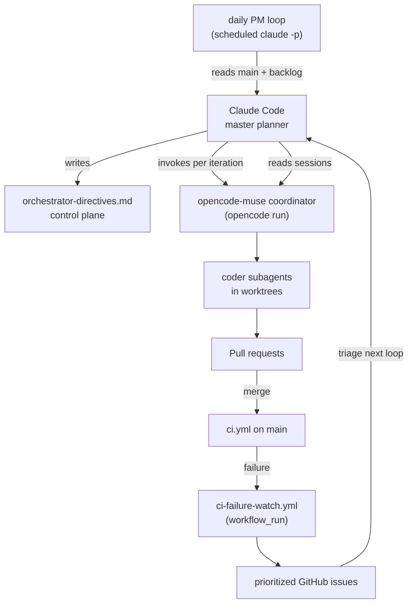

# Claude Code Central Orchestrator - Plan

## Goal Capsule

- **Objective:** One master planner (Claude Code) owns every autonomous coding orchestrator in this repo: it decides what each should work on, can start and inspect an orchestrator run, reacts to any CI failure on `main` by filing a prioritized issue, and produces a daily progress review — so no red build or stalled backlog goes unnoticed and no two orchestrators collide.
- **Means:** A repo-local Claude Code plugin plus thin Python/PowerShell bridges around the existing `opencode-muse` coordinator and a GitHub Actions failure watcher (KTD1, KTD2, KTD4).
- **Authority:** The Product Contract's Requirements govern behavior; the Planning Contract's KTDs govern mechanism; a unit overrides neither. Where this plan and an existing coordinator doc disagree, this plan's hardening requirements win and the doc is updated to match.
- **Execution profile:** Mostly configuration, prompts, scripts, and one CI workflow; no app-code or database change. Prefer smoke/runtime verification over unit coverage for the prompt and plugin surfaces; use stdlib unit tests for the Python scripts.
- **Stop conditions:** Stop and hand back if the workflow-hardening units (U1-U3) cannot land first, because the orchestrator depends on a reliable coordinator; stop if `opencode export` output cannot be parsed stably enough to read a session.
- **Tail ownership:** `ce-work` builds and ships the units, including the coordinator hardening in U1-U3; the workflow-fix issues in the Appendix are created as tracked records that point at those units and close when they land.

---

## Product Contract

### Summary

Plan a Claude Code central-orchestrator layer that sits above the existing coding coordinators and hardens the `opencode-muse` coordinator it depends on. Claude Code becomes the master planner that directs the orchestrators, reads their sessions, tracks the available opencode models, watches landed PRs and `main`-branch CI, files prioritized issues when `main` breaks, and runs a daily product-manager pass. The plan also fixes the coordinator workflow defects that would otherwise undermine that layer.

### Problem Frame

Three overlapping autonomous systems exist in this repo and they collide. The tracked `opencode-muse` coordinator dispatches a weak free-tier coder into git worktrees and merges PRs. A Claude Code coordinator (`claude-orch`) runs a parallel loop against the same labels. A third, stopped Antigravity orchestrator left untracked agent role files under `.agents/agents/` that bypass the claim and ownership markers entirely, alongside its shell and state under `.orchestrator/`. No single planner decides what any of them should do, so they duplicate and conflict.

The `opencode-muse` pipeline itself is under-specified for the work it does. The coder prompt names no engineering standards — no object-oriented or boundary guidance, no design principles, no Flutter/Dart rules, no Postgres/Supabase rules — and never tells the coder to load the two Supabase skills the repo already ships. The coordinator's review checklist cannot catch what the prompt never asked for. Several `tool/coord` scripts carry real defects: unvalidated worktree owner/slug, a bypassable prefix guard, cp1252 decoding that corrupts Unicode on Windows, a claim path that can mutate a foreign issue or leave a stuck claim, and no head-SHA pin before merge.

Nothing closes the loop from CI back to the backlog. `ci.yml` runs on every push to `main` but a red run is visible only as a red status; there is no watcher, no issue, no revert, and no scheduled review. The repo has no scheduled workflow at all. A red `main` can sit unnoticed, and there is no periodic check that the open backlog still matches the product direction.

### Requirements

**Coordinator and coder hardening**

- R1. The coder prompt must explicitly require object-oriented and boundary design; the design principles DRY, SRP, abstraction over duplication, composition and inheritance discipline, and inversion of control through the existing dependency-injection seams; Flutter/Dart best practices; and Postgres/Supabase best practices. It must require loading the `supabase` and `supabase-postgres-best-practices` skills before any change under `supabase/`.
- R2. The coordinator review must independently verify those standards against the diff, not against the coder's summary, and must re-run the gates itself.
- R3. Every brief must carry the complete verification command set, including Drift codegen, the schema dump, and the `ci.yml` schema-dump filename bump for any `schemaVersion` change.
- R4. Claiming and worktree scripts must enforce ownership for real: validate the owner id and slug, pin the worktree prefix to a literal root, abort before mutating an issue that carries a foreign owner label, and never leave an owned-but-unreconciled claim.
- R5. The coordinator must capture the reviewed head SHA and merge only that SHA.
- R6. The `tool/coord` scripts must be UTF-8-safe and time-bounded; the outer loop must be single-instance, back off after repeated failure, and honor the STOP file promptly.
- R7. No coder may bypass the claim, ownership, or PR-label rules through a legacy or alternate agent definition.

**Central orchestrator**

- R8. Claude Code is the master planner: it can start an `opencode-muse` coordinator iteration non-interactively and read the resulting session transcript.
- R9. Claude Code knows the available opencode models and can assign a model per role or per dispatch.
- R10. Claude Code watches landed PRs and `main`-branch CI; a CI failure on `main` produces a priority-tagged issue even when no Claude Code session is running.
- R11. Claude Code runs a daily product-manager pass over `main` and the open backlog that reports progress and files prioritized follow-ups.
- R12. A durable control plane records what Claude Code wants each orchestrator working on, while GitHub labels remain the ownership source of truth.
- R13. The orchestration ships as repo-local Claude Code configuration, structured so it can later be packaged as a shareable plugin.

### Success Criteria

- A coder dispatched on a `supabase/` issue loads the Postgres skill and follows its rules, and a reviewer can point to the prompt lines that required it.
- No `tool/coord` script can be induced to create or delete a worktree outside `.worktrees/<validated-owner>/`.
- A red `ci.yml` run on `main` produces exactly one new or updated prioritized issue within one watcher cycle, with no duplicate spam for the same head SHA.
- A daily product-manager report is produced on schedule and lands as an issue or artifact without a human starting a session.
- Claude Code can run one opencode coordinator iteration and then summarize that iteration from the exported session JSON.

### Scope Boundaries

- In scope: `.opencode/prompts/`, `opencode.json`, `tool/coord/`, `tool/orchestrator/`, `.claude/` orchestration configuration, `.agents/agents/` and `.agents/hooks.json` (quarantine only), `.agents/skills/` (read-only standards source), one new CI watcher workflow, one scheduled PM loop, and the coordinator docs.
- In scope: creating the workflow-fix issues enumerated in the Appendix.
- Deferred to follow-up work: packaging the orchestration as a published marketplace plugin; moving `claude-orch` state into a per-id directory; the existing periodic Realtime-publication and `feedback-notify` reconciliation TODOs; and the app-code bugs the review may surface.
- Outside this product's identity: changing the product roadmap; making Claude Code write feature code directly; replacing the `opencode-muse` coordinator's role as the code executor.

### Open Questions

- Non-blocking: whether the daily PM loop should also run as a GitHub Actions scheduled job in addition to the local scheduled task. Resolve during implementation.
- Non-blocking: the exact GitHub token scopes and `permissions:` block for the watcher workflow. Resolve during implementation.

---

## Planning Contract

### Key Technical Decisions

- KTD1. **Repo-local Claude Code config shaped as a plugin, not a published plugin.** The orchestration lives at a repo-local plugin root (`tool/orchestrator/` with `.claude-plugin/plugin.json`, `skills/`, `agents/`, `hooks/hooks.json`) loaded with `--plugin-dir tool/orchestrator`, the path that works for both interactive and headless `-p` runs. It is versioned with the repo now and can be moved to a marketplace later without restructuring. (session-settled: user-directed — chosen over building the distributable marketplace plugin first: fastest path to a working layer.)
- KTD2. **Invoke opencode per iteration; read sessions through `opencode export`/`opencode db`.** Claude Code shells out to `opencode run --agent coordinator` (matching `run_opencode.ps1`) rather than driving a persistent `opencode serve`; it reads back `opencode export <sessionID>` JSON and `opencode db` queries rather than parsing the raw `opencode.log`. This reuses the existing loop and avoids a new server lifecycle.
- KTD3. **Role-to-model map validated at runtime.** A checked-in default map assigns `deepseek/deepseek-v4-flash` to planning and review work and `opencode/muse-spark-1.3-contributor-free` to bulk coder work, and every dispatch validates the chosen id against `opencode models` before use. Per-dispatch override wins.
- KTD4. **CI-failure detection in GitHub Actions, triage in Claude Code.** A `workflow_run` watcher on `ci.yml` for `main` files or updates one prioritized issue per failing head SHA; Claude Code enriches and routes it on its next loop. The detector does not depend on a live Claude Code session.
- KTD5. **Daily PM loop as a scheduled headless `claude -p` run.** An OS scheduled task mirrors `run_opencode.ps1` and invokes Claude Code with the product-manager skill; the loop is not an in-session `/loop`. (session-settled: user-directed — chosen over an in-session loop or an Actions cron: matches the existing outer-loop pattern.)
- KTD6. **The central orchestrator is a layer above, not a replacement.** Claude Code directs `claude-orch` and `opencode-muse`; it does not absorb them or take over their merge authority in this plan. (session-settled: user-directed — chosen over replacing `claude-orch`: preserves working, tested coordination.)
- KTD7. **Workflow fixes are tracked as prioritized issues, with one execution vehicle.** The coordinator hardening is the plan's units U1-U3; the Appendix issues are created at handoff as tracked, prioritized records that point at those units and are closed when the units land. The fixes are not run twice.
- KTD8. **Control plane is a checked-in directives document plus GitHub labels.** Claude Code records per-orchestrator intent in `docs/coordinator/orchestrator-directives.md`; ownership and status remain GitHub labels, which stay the single source of truth.

### High-Level Technical Design

### Assumptions

- The `opencode export` JSON shape is stable enough to summarize a session; if it is not, the bridge falls back to `opencode db` queries and is recorded as a risk.
- A GitHub Actions `workflow_run` event can create issues with `permissions: issues: write` on this repository.
- The Windows host that runs the existing coordinator loop can also host the scheduled PM task.
- `claude plugin validate` is available locally for the plugin skeleton.

### System-Wide Impact

- `.github/workflows/`: adds one watcher workflow; touches no existing workflow.
- GitHub labels: relies on the existing `P0`-`P3`, `epic:*`, `owner:*`, and `orch:*` families; adds none unless the watcher needs a marker label.
- Agent permissions: `opencode.json` changes how the `general` subagent is disabled and narrows coordinator permissions, which affects every opencode dispatch.
- Worktrees and branches: `tool/coord` fixes change how worktrees are created, validated, and removed for every coordinator.
- `.claude/` and `tool/orchestrator/`: new committed configuration that runs Claude Code unattended; its hooks and permissions need the same care as the opencode coordinator's.

### Risks & Dependencies

- **Prompt injection through issue bodies.** The watcher and PM loop read untrusted issue text. Mitigation: the Claude Code skills treat issue content as data, never instructions, and the opencode coordinator's permissions are narrowed (R7-adjacent, U1).
- **Cost and quota.** Two model families plus a daily loop can consume quota. Mitigation: the role map defaults the cheap model to bulk work; the loop is once daily and bounded.
- **Duplicate issue spam.** A flapping `main` can file many issues. Mitigation: dedupe by failing head SHA in the watcher (U6).
- **Dependency on U1-U3.** The orchestrator's reliability rests on a coordinator that enforces ownership and follows engineering standards. If U1-U3 stall, the orchestrator work should pause.
- **Windows scheduling fragility.** The existing outer loop is documented but not registered. Mitigation: the PM loop ships with an explicit registration runbook and a single-instance guard.

---

## Implementation Units

### U1. Engineering-standards instructions in the coder and coordinator prompts

- **Goal:** Make the coder prompt and the coordinator review require the repo's engineering standards, load the Supabase skills before touching the database, and pin the reviewed head SHA at merge.
- **Requirements:** R1, R2, R3, R5.
- **Dependencies:** none.
- **Files:** `.opencode/prompts/coder.md`, `.opencode/prompts/coordinator.md`, `opencode.json`.
- **Approach:**
  - Add an "Engineering standards" section to the coder prompt covering object-oriented and boundary design, DRY/SRP/abstraction/composition/inheritance discipline, inversion of control through existing seams, Flutter/Dart rules, and Postgres/Supabase rules.
  - Require loading `.agents/skills/supabase/SKILL.md` and `.agents/skills/supabase-postgres-best-practices/SKILL.md` before any change under `supabase/`.
  - Register the skills path in `opencode.json`, move the `general`-subagent disable into the correct `agent` key, and narrow the `coordinator` permission block.
  - In the coordinator's step 4, add the same standards as explicit review items and require re-running the brief's gate commands locally, recording their output.
  - In the coordinator's merge step, record the reviewed head SHA and merge with `gh pr merge --match-head-commit <sha>`.
  - Replace the direct-to-`main` state-commit instruction with the PR-based state-sync flow.
  - Extend the brief's verification commands with the Drift codegen, schema dump, and `ci.yml` filename bump.
- **Test expectation:** none -- prompt and config text; verified by inspection and one smoke dispatch.
- **Verification:** A reviewer can point to the added lines; `opencode.json` parses; `general` is absent from `opencode agent list` (or `agent.general.disable` is true).

### U2. `tool/coord` correctness and safety fixes

- **Goal:** Make claiming, listing, worktree, and PR-status operations ownership-safe, Unicode-safe, and time-bounded.
- **Requirements:** R4, R6.
- **Dependencies:** none.
- **Files:** `tool/coord/claim.py`, `tool/coord/release.py`, `tool/coord/list_issues.py`, `tool/coord/pr_status.py`, `tool/coord/worktree_add.py`, `tool/coord/worktree_rm.py`, `tool/coord/_common.py`, `tool/coord/run_opencode.ps1`, `tool/coord/tests/`.
- **Approach:**
  - Validate owner and slug against a strict pattern and pin the worktree prefix to the literal `.worktrees` root in both worktree scripts.
  - In `claim.py`, abort before mutating when a foreign `owner:*` label is present, and roll back the owner label on a post-add error.
  - Add a stuck-claim listing mode (in-progress with no owner) and a `list_issues.py` open-PR skip.
  - Fix the dependency regex to anchor word boundaries and capture every issue reference in the sentence.
  - Classify `NEUTRAL`/`SKIPPED` as non-failing and `CANCELLED`/`STALE` as failing in `pr_status.py`.
  - Decode `gh`/`git` output as UTF-8 with replacement, add a subprocess timeout, and resolve the main worktree root rather than the current worktree toplevel.
  - Add a single-instance guard, exponential backoff, and mid-sleep STOP polling to `run_opencode.ps1`.
  - Implement or remove the unused `--json` flags, fix the claim comment's branch name for `bug` issues, and reconcile the README race rule with `claim.py`'s actual back-off behavior.
  - Add a stdlib `unittest` suite under `tool/coord/tests/` and wire it into CI.
- **Test scenarios:**
  - Happy path: `worktree_add.py` creates `.worktrees/opencode-muse/7-foo`; `worktree_rm.py` removes it.
  - Edge case: an owner value of `..` or a slug containing `/` is rejected by both worktree scripts.
  - Error path: `claim.py` on an issue carrying `owner:claude-orch` exits without adding labels.
  - Error path: `claim.py` whose comment step fails removes its owner label before returning error.
  - Edge case: `list_issues.py` treats "not blocked by #5" and "unblocked by #5" as unblocked, and captures both numbers in "depends on #12 and #13".
  - Edge case: `pr_status.py` reports `SKIPPED` as non-failing and `CANCELLED` as failing.
  - Error path: a hung `gh` call times out and raises the tool's error type instead of blocking.
- **Verification:** `python -m unittest discover -s tool/coord/tests` passes; a manual `worktree_add.py` with a bad owner fails loudly.

### U3. Quarantine the legacy orchestrator definitions

- **Goal:** Ensure no coder can bypass the claim and ownership rules through the stopped Antigravity agent definitions.
- **Requirements:** R7.
- **Dependencies:** none.
- **Files:** `.gitignore`, `docs/coordinator/README.md`.
- **Approach:**
  - The five `.agents/agents/*.md` files and `.agents/hooks.json` are untracked local artifacts, so the committed change is a `.gitignore` entry that keeps them from ever being tracked accidentally, plus a deprecation note in `docs/coordinator/README.md` naming `.opencode/prompts/` as the only supported agent surface.
  - The operator may delete the local files; that is a machine-local cleanup, not a repo change.
  - Leave the tracked `.agents/skills/` in place; they are the standards source for U1.
- **Test expectation:** none -- configuration and docs; verified by inspection that no active config references the retired paths.
- **Verification:** `git check-ignore .agents/agents/coder.md` succeeds, and a search for `invoke_subagent` returns no live wiring outside the deprecation note.

### U4. Claude Code orchestrator plugin skeleton and control plane

- **Goal:** Create the repo-local plugin root and the directives control plane that the other orchestrator units build on.
- **Requirements:** R12, R13.
- **Dependencies:** none.
- **Files:** `tool/orchestrator/.claude-plugin/plugin.json`, `tool/orchestrator/agents/orchestrator-planner.md`, `tool/orchestrator/skills/README.md`, `tool/orchestrator/hooks/hooks.json`, `tool/orchestrator/settings.json`, `.claude/settings.json`, `docs/coordinator/orchestrator-directives.md`, `docs/coordinator/README.md`.
- **Approach:**
  - Create the plugin root with the manifest, an `agents/` orchestrator role, a `hooks/` file, and default `settings.json`; keep components at the plugin root, not inside `.claude-plugin/`.
  - Load the plugin with `--plugin-dir tool/orchestrator`; document that flag for interactive sessions and use it in the scheduled loop. Do not rely on project-file marketplaces, which wait on workspace trust that a `-p` run never grants.
  - Define `docs/coordinator/orchestrator-directives.md` as the per-orchestrator intent record and document the plugin in `docs/coordinator/README.md`.
- **Test scenarios:**
  - Happy path: `claude plugin validate tool/orchestrator` passes.
  - Integration: starting Claude Code in the repo loads the plugin and lists its skills and agent.
- **Verification:** `claude plugin validate tool/orchestrator` passes; the plugin appears in `/plugin` and `/context`.

### U5. opencode bridge: invocation, session readback, and model registry

- **Goal:** Give Claude Code a reliable way to start an opencode coordinator iteration, read the resulting session, and choose a valid model.
- **Requirements:** R8, R9.
- **Dependencies:** U4.
- **Files:** `tool/orchestrator/opencode_bridge.py`, `tool/orchestrator/models.py`, `tool/orchestrator/tests/test_opencode_bridge.py`, `tool/orchestrator/skills/opencode-bridge/SKILL.md`.
- **Approach:**
  - Wrap `opencode run --agent coordinator` and capture the session id from `--format json` output.
  - Read a session with `opencode export <sessionID>` and fall back to `opencode db` queries if the export shape is unusable.
  - Resolve the model roster from `opencode models` and apply the KTD3 role map, validating each id before use.
  - Expose the bridge as a skill Claude Code can invoke, and keep the Python entry points testable with a stubbed subprocess.
- **Test scenarios:**
  - Happy path: the bridge starts a run, records the session id, and returns a summary from a fixture export.
  - Edge case: an unknown model id in the role map is rejected before dispatch.
  - Error path: `opencode export` fails and the bridge falls back to `opencode db`.
  - Integration: the role map resolves `deepseek/deepseek-v4-flash` and `opencode/muse-spark-1.3-contributor-free` from a fixture `opencode models` list.
- **Verification:** `python -m unittest discover -s tool/orchestrator/tests` passes; a live smoke run summarizes a real session.

### U6. GitHub watcher: main-branch CI failures and landed PRs

- **Goal:** Turn a red `main` into a prioritized issue without a live session, and surface landed PRs to the master planner.
- **Requirements:** R10.
- **Dependencies:** U4.
- **Files:** `.github/workflows/ci-failure-watch.yml`, `tool/orchestrator/ci_watch.py`, `tool/orchestrator/tests/test_ci_watch.py`, `tool/orchestrator/skills/ci-triage/SKILL.md`.
- **Approach:**
  - Add a `workflow_run` watcher on `ci.yml` completed for `main`; on failure, build an issue body with the run link, failing jobs, and head SHA, and create or update one issue per failing head SHA.
  - Grant the workflow `permissions: contents: read`, `actions: read`, and `issues: write`.
  - Add a landed-PR reader that lists recently merged PRs for the master planner to review.
  - Keep the issue-body builder pure and unit-tested; the workflow is the thin caller.
- **Test scenarios:**
  - Happy path: a failed `ci.yml` run for `main` produces one issue labeled `P1` and `bug` with the run link.
  - Edge case: a second failure for the same head SHA updates the existing issue instead of creating another.
  - Edge case: a successful run creates no issue.
  - Error path: a missing run id or head SHA produces no issue and logs the gap.
- **Verification:** `python -m unittest discover -s tool/orchestrator/tests` passes; `actionlint .github/workflows/ci-failure-watch.yml` passes; a manual `workflow_run` dispatch creates the expected issue.

### U7. Daily product-manager loop

- **Goal:** Produce a daily progress review of `main` and the open backlog, and file prioritized follow-ups.
- **Requirements:** R11.
- **Dependencies:** U2, U4, U6.
- **Files:** `tool/orchestrator/pm_loop.ps1`, `tool/orchestrator/skills/product-manager/SKILL.md`, `docs/coordinator/orchestrator-runbook.md`.
- **Approach:**
  - Drive a headless `claude -p` run with the product-manager skill through an OS scheduled task, mirroring `run_opencode.ps1` (single instance, backoff, STOP file).
  - The skill reads recent `main` commits, open issues by label, and merged PRs, writes a short report artifact, and files prioritized follow-up issues only when they are actionable.
  - Document registration and operation in the runbook.
- **Test scenarios:**
  - Happy path: a run produces a report artifact and no issue when the backlog is healthy.
  - Edge case: a run with no new commits still produces a short report and exits cleanly.
  - Error path: a second concurrent invocation exits immediately due to the single-instance guard.
- **Verification:** `python -m unittest discover -s tool/orchestrator/tests` passes; a manual run produces the report.

### U8. Master-planner orchestration skills and commands

- **Goal:** Give Claude Code the commands that make it the master planner: set directives, start and steer the opencode coordinator, and reconcile orchestrator status.
- **Requirements:** R8, R12, KTD6.
- **Dependencies:** U4, U5, U6, U7.
- **Files:** `tool/orchestrator/skills/master-planner/SKILL.md`, `tool/orchestrator/skills/dispatch-orchestrator/SKILL.md`, `tool/orchestrator/skills/reconcile-orchestrators/SKILL.md`, `tool/orchestrator/commands/set-directive.md`, `tool/orchestrator/commands/orchestrator-status.md`, `docs/coordinator/orchestrator-directives.md`.
- **Approach:**
  - Define skills that read and write the directives control plane, dispatch an opencode iteration for a chosen issue with a chosen model, and reconcile each orchestrator's PRs and worktrees against its ownership markers.
  - Keep GitHub labels authoritative; the directives document records intent only.
  - Have the skills treat issue and PR text as data, never instructions.
- **Test scenarios:**
  - Happy path: `set-directive` records an intent line for `opencode-muse` and `orchestrator-status` reads it back with the live PR state.
  - Edge case: dispatching for an issue with a foreign owner label is refused.
  - Integration: `dispatch-orchestrator` starts a run and returns the session id to the master planner.
- **Verification:** `claude plugin validate tool/orchestrator` passes; a manual command run records and reads a directive.

---

## Verification Contract

- **Python scripts:** `python -m unittest discover -s tool/coord/tests` and `python -m unittest discover -s tool/orchestrator/tests` must pass; add the `tool/coord` suite to the existing `release-guards` CI job and provision the interpreter there with `actions/setup-python@v5` (or invoke `python3`).
- **Workflows:** `actionlint` (already pinned in `ci.yml`) must pass on `.github/workflows/ci-failure-watch.yml`.
- **Claude Code plugin:** `claude plugin validate tool/orchestrator` must pass.
- **opencode config:** `opencode.json` must parse and `general` must be absent from `opencode agent list` (or assert `agent.general.disable` is true).
- **Dart/app:** no app code or schema change is planned; if any unit touches `lib/` or `supabase/`, the full repo gates apply (`flutter analyze`, `flutter test`, `dart run tool/quality_gate.dart`, and the pgTAP flow from `AGENTS.md`).
- **Smoke:** one live `opencode run --agent coordinator` iteration summarized from its exported session, and one watcher dry-run producing the expected issue body.

## Definition of Done

- Every unit's Verification passes and its test scenarios are covered.
- The coder prompt demonstrably carries the engineering-standards section and the skill-loading requirement; the coordinator review checklist mirrors it.
- No `tool/coord` script can act outside `.worktrees/<validated-owner>/`, and the Python suites pass in CI.
- A simulated `ci.yml` failure on `main` creates exactly one prioritized issue, and a repeat for the same head SHA updates it.
- The daily PM loop runs on schedule, produces a report, and is single-instance.
- `claude plugin validate tool/orchestrator` passes and the plugin loads in a session.
- No abandoned-attempt code or scratch files remain in the diff; the directives document and runbook are current.

---

## Appendix

### Workflow Review Findings to Issue

The coordinator review surfaced these defects. Each is filed as a tracked issue; U1-U3 are the execution vehicle and close them when they land. Grouped by priority. Filed: A1 #396, A2 #397, A3 #398, A4 #399, A5 #400, A6 #401, A7 #402, A8 #403, A9 #404, A10 #405, A11 #406, A12 #407, A14 #408. A13 is covered by the existing #51; A15 is folded into #403.

| # | Priority | Proposed issue title | Evidence |
|---|---|---|---|
| A1 | P1 | Coder/coordinator prompts lack explicit engineering standards and skill loading | `.opencode/prompts/coder.md:28`, `.opencode/prompts/coordinator.md:190-226` |
| A2 | P1 | Worktree scripts do not validate owner/slug; prefix guard is bypassable | `tool/coord/worktree_add.py:31-44`, `tool/coord/worktree_rm.py:26-36` |
| A3 | P1 | `tool/coord` decodes `gh`/`git` output as cp1252 on Windows | `tool/coord/_common.py:28,40-45,66-71` |
| A4 | P1 | `claim.py` can mutate a foreign-owned issue and leave a stuck owned claim | `tool/coord/claim.py:45-69` |
| A5 | P1 | Coordinator merges without pinning the reviewed head SHA | `.opencode/prompts/coordinator.md:222-228` |
| A6 | P1 | `opencode.json` uses a non-existent `subagents` key; `general` is not disabled | `opencode.json:5-9` |
| A7 | P1 | State-commit instruction contradicts the gitignored state dir and PR-only `main` | `.opencode/prompts/coordinator.md:141-144`, `.gitignore:78` |
| A8 | P2 | `list_issues.py` dependency regex holes and no open-PR skip | `tool/coord/list_issues.py:25,71-80` |
| A9 | P2 | `pr_status.py` misclassifies neutral/skipped/cancelled checks | `tool/coord/pr_status.py:21-30` |
| A10 | P2 | `tool/coord` has no subprocess timeout; `repo_root()` resolves the worktree toplevel | `tool/coord/_common.py:22-33,40-45` |
| A11 | P2 | `run_opencode.ps1` has no single-instance guard, backoff, or mid-sleep STOP check | `tool/coord/run_opencode.ps1:61-91` |
| A12 | P2 | Briefs omit Drift codegen, schema dump, and the `ci.yml` filename bump | `.opencode/prompts/coordinator.md:190-197` |
| A13 | P2 | Untracked legacy `.agents/agents` role files can bypass ownership rules | `.agents/agents/coder.md`, `.agents/hooks.json` |
| A14 | P2 | Coordinator permissions are unrestricted; issue bodies are untrusted input | `opencode.json:16-35` |
| A15 | P3 | Minor: bug-branch name in claim comment, unimplemented `--json` flags, README race rule contradicts `claim.py` | `tool/coord/claim.py:38`, `docs/coordinator/README.md:61-65` |

### Sources / Research

- opencode CLI: `opencode run`, `opencode export`, `opencode session`, `opencode db`, `opencode models` (verified locally, v1.18.30).
- Claude Code plugin, skill, hook, and headless docs (`docs.claude.com`).
- Existing coordinator: `.opencode/prompts/`, `tool/coord/`, `docs/coordinator/README.md`, `docs/coordinator/PROCESS.md`.
- CI triggers and jobs: `.github/workflows/ci.yml`, `.github/workflows/supabase-migrate.yml`.
- Local skills: `.agents/skills/supabase/SKILL.md`, `.agents/skills/supabase-postgres-best-practices/SKILL.md`.
