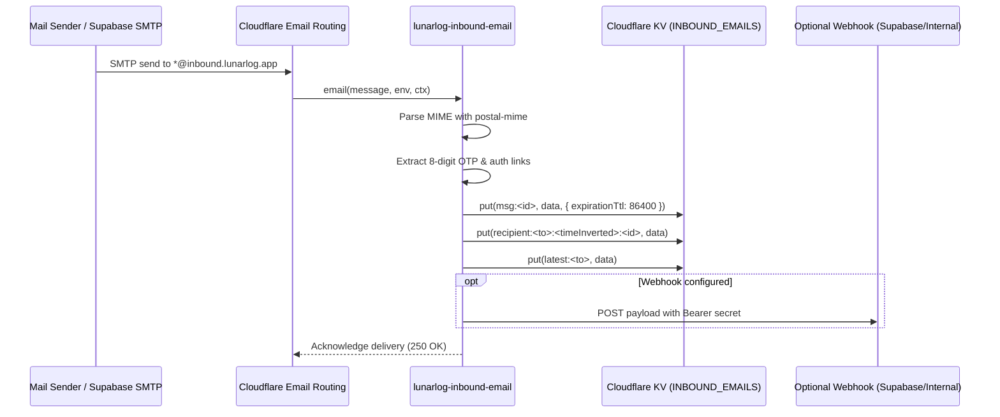

# Inbound Email Routing and Processing Worker - Plan

**Target repo:** `lunarlog` (`wjdavis5/lunarlog`). All paths are repo-relative.

---

## Goal Capsule

- **Objective:** Accept inbound emails to `lunarlog.app` domains (e.g. `*@inbound.lunarlog.app`, `test-*@lunarlog.app`, or `inbound@lunarlog.app`) using a Cloudflare Email Worker, parse the MIME stream, extract authentication metadata (8-digit OTPs, magic links, confirm links), and store the parsed emails in a queryable store with a 24-hour TTL accessible via an authenticated REST API for test automation, CI, and backend processing.
- **Means:** A new Cloudflare Worker located in `web/email/` in the monorepo, pairing Cloudflare Email Routing's `email(message, env, ctx)` handler with an authenticated `fetch(request, env, ctx)` API, Cloudflare Workers KV (`INBOUND_EMAILS`) for time-indexed queries with auto-expiry, automated CI tests via Deno, and deployment via `cloudflare/wrangler-action`.
- **Authority hierarchy:** GitHub issue #1107 owns requirements; this plan owns architecture and execution details; PR code and tests own verification.
- **Stop conditions:** Stop and surface if email parsing fails on standard RFC 5322 MIME formats, if unauthenticated requests can view received emails without a valid API key, or if the solution requires moving outside the repository monorepo.
- **Execution profile:** `code`; monorepo Worker service with parser, store, HTTP API, unit tests, CI wiring, and operational runbook.

---

## Technical Architecture & Contracts

### 1. Monorepo Placement
To maintain the monorepo standard alongside `web/links/` (PR #1085 / issue #450):
- `web/email/wrangler.jsonc` — Worker configuration, bindings, routes, and observability.
- `web/email/deno.json` — Test and runtime configuration.
- `web/email/src/types.ts` — Typed interfaces for parsed emails, KV schemas, and environment bindings.
- `web/email/src/parser.ts` — MIME parsing via `postal-mime` and regex extractors for 8-digit OTPs and auth links.
- `web/email/src/store.ts` — KV-backed storage abstraction with time-inverted lexicographical indexing, O(1) latest lookups, and auto-expiring TTLs.
- `web/email/src/index.ts` — `email` event handler, authenticated HTTP `fetch` router, and optional webhook dispatcher.
- `web/email/src/index.test.ts` — Deno unit tests covering MIME parsing, OTP extraction, storage, and API endpoints.
- `.github/workflows/email-deploy.yml` — Automated Cloudflare Workers deployment on pushes to `main` touching `web/email/**`.
- `docs/ops/inbound-email.md` — Setup runbook for Cloudflare Email Routing, DNS, KV namespaces, and API secrets.

### 2. Inbound Email Flow (`email` handler)

### 3. Query & Retrieval Flow (`fetch` API)
- **`GET /health`**: Unauthenticated health check returning `{"status": "ok", "service": "lunarlog-inbound-email"}`.
- **`GET /api/emails/latest?recipient=<email>`**: Returns the most recently received email for the specified recipient. Requires `Authorization: Bearer <EMAIL_API_KEY>` or `X-API-Key: <EMAIL_API_KEY>`.
- **`GET /api/emails?recipient=<email>&limit=<n>`**: Lists up to `limit` emails for that recipient (default 10, max 50).
- **`GET /api/emails/:id`**: Retrieves a single parsed email by ID.
- **`DELETE /api/emails/:id`**: Explicitly deletes a message before TTL expiration.
- **`POST /api/emails/simulate`**: Allows testing the pipeline with mock MIME or JSON payloads without sending real SMTP traffic.

---

## Units of Work

- **U1: Worker scaffolding & configuration (`web/email/wrangler.jsonc`, `web/email/deno.json`)**
  Configure Wrangler with `compatibility_date: "2026-09-20"`, `name: "lunarlog-inbound-email"`, KV binding `INBOUND_EMAILS`, and Deno test configuration.
- **U2: MIME parsing and auth metadata extractor (`web/email/src/parser.ts`)**
  Use `npm:postal-mime` to parse raw MIME streams or byte buffers. Extract sender, recipient, subject, dates, plain text, HTML, 8-digit OTP codes (`\b\d{8}\b` per #2/#970), and authentication URLs.
- **U3: KV storage abstraction (`web/email/src/store.ts`)**
  Implement storage with key layout:
  - `msg:${id}`: Full email record.
  - `recipient:${to}:${invertedTime}:${id}`: Lexicographically ordered keys where newest messages sort first.
  - `latest:${to}`: Pointer/record for instantaneous retrieval.
  - 86,400s (24h) TTL expiration to prevent unbounded storage costs.
  - In-memory mock store fallback for unit testing without Cloudflare emulators.
- **U4: Inbound handler, HTTP API, and webhook dispatcher (`web/email/src/index.ts`)**
  Implement `export default { fetch, email }`. Route HTTP requests with API key authorization. Handle email events, parse, store in KV, and trigger optional background webhook.
- **U5: Comprehensive test suite (`web/email/src/index.test.ts`)**
  Unit tests for MIME parsing, OTP regex matching, KV index ordering, authorized vs. unauthorized HTTP requests, simulate endpoint, and webhook triggering.
- **U6: CI and deployment automation (`.github/workflows/ci.yml`, `.github/workflows/email-deploy.yml`)**
  Add `deno check` and `deno test` for `web/email` into CI `edge-functions` job. Add GitHub Actions workflow deploying the Worker using `cloudflare/wrangler-action`.
- **U7: Operational runbook & docs (`docs/ops/inbound-email.md`)**
  Document Cloudflare Email Routing configuration, DNS MX/TXT records, KV namespace creation, API key management, and `curl` test examples.

---

## Verification Plan

- `deno check web/email/src/**/*.ts` passes with 0 type errors.
- `deno test web/email/src/**/*.test.ts` passes 100% of test assertions.
- Existing tests across `supabase/functions/`, `web/links/`, and Flutter test suites continue to pass without regression.
